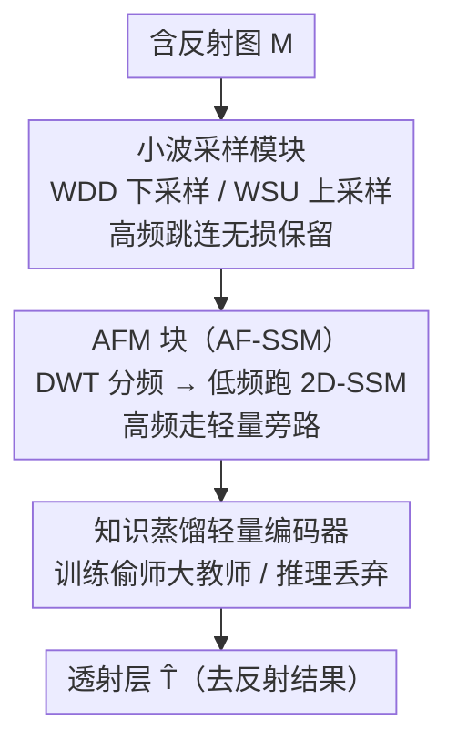

# LightRR: A Lightweight Network for Single Image Reflection Removal

**会议**: CVPR 2026  
**论文**: [CVF Open Access](https://openaccess.thecvf.com/content/CVPR2026/html/Yin_LightRR_A_Lightweight_Network_for_Single_Image_Reflection_Removal_CVPR_2026_paper.html)  
**代码**: 无  
**领域**: 图像恢复 / 反射去除 / 轻量化  
**关键词**: 单图反射去除、Mamba 状态空间、小波变换、知识蒸馏、轻量化

## 一句话总结
针对单图反射去除（SIRR）模型又大又慢的问题，LightRR 用小波分频把反射主要集中的低频交给 Mamba 状态空间模型重点处理、高频走轻量旁路无损保留，再用知识蒸馏让小编码器在训练时偷师大预训练模型、推理时丢弃，最终只用 RDNet 的 3.01% 参数和 5.22% FLOPs 就拿到接近 SOTA 的去反射效果。

## 研究背景与动机
**领域现状**：透过玻璃等反射介质拍照时，画面 $M$ 同时含有想拍的透射层 $T$ 和干扰的反射层 $R$，常建模为 $M=T+R$。单图反射去除（SIRR）要从一张图里把这两层分开，是典型的高度病态问题。近年深度学习（CEILNet、DSRNet、DSIT、RDNet 等）进展显著，但代价是参数和算力暴涨：很多 SOTA 用大 CNN/Transformer 骨干 + 预训练网络来获取区分反射所需的全局上下文。

**现有痛点**：这些方法 FLOPs 和参数极高——RDNet 达 315.71M 参数、184.21 GFLOPs，DSIT 326.96M、233.18 GFLOPs，预训练骨干往往占总参数的 60%–90%。如此沉重的计算需求严重限制了它们在手机、边缘设备等资源受限平台上的部署。已有的深度展开（deep unfolding）类轻量方法虽参数小，但推理时需多次迭代，实际开销又上来了。

**核心矛盾**：去反射既需要**大感受野 / 全局上下文**来区分反射与背景，又要**低算力**才能落地——前者推着模型变大变重，后者要求模型变小变快，二者直接打架。

**本文目标**：在不牺牲性能的前提下做出一个真正轻量、可部署的去反射网络，把「全局建模能力」和「低算力」同时拿到。

**切入角度**：两个观察。其一，Mamba（结构化状态空间 S4 的变体）能像 Transformer 一样建模长程依赖，却是**线性复杂度**，适合做高效骨干。其二，反射和透射在频域上特征不同——可视化显示反射伪影（$M-T$）主要分布在**低频 LL** 分量，而高频分量（LH/HL/HH）在 $M$ 和 $T$ 上几乎一致、承载关键细节。这说明对全频域**均匀处理**（多数 SOTA 的做法）既次优又浪费算力。

**核心 idea**：用「频域分而治之 + 状态空间建模」代替「全频域均匀的大骨干」——把算力集中到富含反射伪影的低频分量上跑 Mamba，高频走轻量路径无损保留细节；再用知识蒸馏把大模型的表征能力「搬进」小编码器，推理时不背大骨干。

## 方法详解

### 整体框架
LightRR 是一个 U 形编码器-解码器网络，核心是把「反射在低频、细节在高频」这一频域先验贯穿到每个组件。输入含反射图，先经知识蒸馏优化过的轻量编码器提特征；编码/解码主干由 Asymmetric Frequency Mamba（AFM）块堆成，每块用离散小波变换（DWT）把特征分成低频 LL 和三个高频子带，**只对低频跑 2D 状态空间模型**建全局上下文、高频用深度卷积轻量精修；上下采样不用插值或亚像素卷积，而用可逆无损的小波分解下采样（WDD）和小波合成上采样（WSU），让高频细节经跳连无损保留、深层只在 1/4 分辨率的低频上算。训练时额外挂一个大预训练「教师」网络做特征蒸馏，推理时教师整个丢弃。

### 关键设计

**1. 非对称频域 Mamba 块 AFM（AF-SSM）：把算力压到反射所在的低频上**

针对「全频域均匀处理既次优又浪费」的痛点，AFM 块把标准 Mamba 里的 SSM 换成自研的非对称频域状态空间模型 AF-SSM。它先对输入特征 $F_{in}\in\mathbb{R}^{C\times H\times W}$ 做 DWT 分成四个子带 $\{F_{LL},F_{LH},F_{HL},F_{HH}\}$（每个 $\mathbb{R}^{C\times H/2\times W/2}$）。富含反射伪影的低频 $F_{LL}$ 走「重」路径：先深度卷积再过 2D-SSM 建全局上下文，$F'_{LL}=\text{2D-SSM}(\text{SiLU}(\text{DWConv}(F_{LL})))$；三个高频子带拼起来只过一个深度卷积轻量精修，$F'_{HF}=\text{DWConv}(\text{Concat}(F_{LH},F_{HL},F_{HH}))$；最后 iDWT 重组 $F_{out}=\text{iDWT}(F'_{LL},F'_{HF})$。妙处在于：2D-SSM 这种重计算只在 1/4 分辨率（$H/2\times W/2$）的 LL 上跑，既抓到了区分反射所需的长程上下文（Mamba 线性复杂度），又因为 DWT 本身降了空间分辨率而省了大量算力——这是把「需要全局上下文」和「要省算力」同时满足的关键。

**2. 小波采样模块 WDD / WSU：可逆无损的上下采样，深层只算 1/4 分辨率**

传统插值或亚像素卷积上下采样会引入特征畸变、不可逆地丢高频细节。LightRR 改用 DWT/iDWT 这对可逆无损变换做 U-Net 的上下采样。下采样 WDD 先对 $F^{en}$ 做 DWT，把三个高频子带拼成 $F^{en}_H\in\mathbb{R}^{3C\times H/2\times W/2}$ **立即经跳连保留**、绕开后面昂贵的深层编码；只有承载核心语义和反射伪影的低频 $F^{en}_{LL}$ 过一层卷积后送入深层（$F_{down}=\text{Conv}(F^{en}_{LL})\in\mathbb{R}^{2C\times H/2\times W/2}$）。这一刻意设计让后续所有 AFM 块只在 1/4 空间面积的低频上运算，大幅降骨干算力。上采样 WSU 融合深层解码特征 $F^{de}$ 与两路编码跳连（$F^{en}_{LL}$、$F^{en}_H$）：先用低频语义融合（LSF，借鉴 MDTA 的交叉注意力，$F^{en}_{LL}$ 出 Query/Value、$F^{de}$ 出 Key）得到精修低频 $F'_{LL}=\text{LSF}(F^{de},F^{en}_{LL})$，再用 iDWT 与高频跳连无损重组回原分辨率 $F_{up}=\text{iDWT}(F'_{LL},F^{en}_H)$。由此把「高频无损直传」和「重计算只放 1/4 低频」拆开，同时拿到细节保真与低算力。

**3. 知识蒸馏轻量编码器：训练时偷师大模型，推理时丢掉大骨干**

SOTA 普遍靠大预训练骨干（VGG19、Swin、FocalNet）拿表征力，但这正是参数/算力暴涨的根源。LightRR 把高效编码器当「学生」、大预训练网络当固定「教师」，训练时让学生不仅学 GT，还模仿教师各阶段的中间特征，引入特征蒸馏损失
$$\mathcal{L}_{distill}=\sum_{k=1}^{K}\big\|\text{Proj}_k(F_{S,k})-F_{T,k}\big\|_1$$
其中 $\text{Proj}_k$ 是 $1\times1$ 卷积对齐通道。核心好处是**把训练复杂度和推理成本解耦**——昂贵的教师只在训练用、推理时整个丢弃，学生因此继承了大模型的丰富层级特征，却保持极少参数和 FLOPs。消融显示这一步很关键：完全不用预训练特征效果最差，直接把 VGG19 特征注入各阶段（像 RDNet 那样、但不蒸馏）反而引入额外参数算力且指标更低，因为预训练网络并非为去反射而训、直接塞进轻量网络反而限制其拟合能力。

### 损失函数 / 训练策略
重建损失约束透射层在图像域和梯度域都贴近 GT：$\mathcal{L}_{rec}=\alpha_1\|\hat T-T\|_2^2+\alpha_2\|\nabla\hat T-\nabla T\|_1$（$\alpha_1=0.3,\alpha_2=0.6$）；感知损失 $\mathcal{L}_{per}=\sum_i\omega_i\|\phi_i(\hat T)-\phi_i(T)\|_1$（VGG19 第 $\{2,7,12,21,30\}$ 层）。总损失 $\mathcal{L}_{all}=\mathcal{L}_{rec}+\mu_1\mathcal{L}_{per}+\mu_2\mathcal{L}_{distill}$（$\mu_1=0.01,\mu_2=0.2$）。两阶段训练：① 蒸馏 40 epoch 带 $\mathcal{L}_{distill}$，学习率 $2\times10^{-4}$ 线性降到 $1\times10^{-4}$；② 微调 40 epoch 用 $\mathcal{L}_{rec}+\mu_1\mathcal{L}_{per}$（去掉蒸馏）、固定 $1\times10^{-4}$。教师为 ImageNet-1K 预训练的 VGG19，单张 RTX 3090，图像裁 224×224。

## 实验关键数据

### 主实验
按 DSRNet 设置训练（7,643 张合成 PASCAL VOC 对 + 真实对），在四个真实基准 Real20、SIR² 的 Objects/PostCard/Wild 上评测。下表为「w/o Nature」设置下的平均结果（PSNR↑/SSIM↑）：

| 方法 | 平均 PSNR | 平均 SSIM | 参数(M) | GFLOPs |
|------|-----------|-----------|---------|--------|
| DSIT | **26.27** | **0.917** | 326.96 | 233.18 |
| RDNet | 25.95 | 0.908 | 315.71 | 184.21 |
| DSRNet | 25.40 | 0.905 | 350.33 | 143.71 |
| ERRNet | 23.53 | 0.879 | 162.62 | 359.18 |
| **LightRR（本文）** | 25.88 | 0.911 | **9.50** | **9.62** |

LightRR 平均 PSNR 仅比 RDNet 低 0.26 dB、SSIM 仅低 0.02，却只用其 **3.01% 参数、5.22% FLOPs**；相比 326M 的 DSIT，性能接近而算力差两个数量级。在 Real20、Objects、Wild 等更难数据集上表现稳健。

### 消融实验
四个真实基准平均指标（HCI 设置下，PSNR/SSIM）：

| 配置 | PSNR / SSIM | 参数(M) | GFLOPs | 峰值显存(MB) | 说明 |
|------|-------------|---------|--------|---------------|------|
| Full model（Ours） | **26.39 / 0.915** | 9.50 | 9.62 | 170.72 | 完整模型 |
| AF-SSM → 原生 2D-SSM | 25.95 / 0.909 | — | — | 361.03 | 全特征跑 SSM，掉 0.44 dB、显存翻倍 |
| 小波采样 → 亚像素卷积 | 26.17 / 0.911 | 10.37 | 14.47 | — | 参数算力反升、指标更低 |

知识蒸馏消融（Table 6 三设置）：(A) 不用预训练特征→最差；(B) 直接注入 VGG19 特征不蒸馏→额外开销且指标更低；(Ours) 用 $\mathcal{L}_{distill}$ 蒸馏→最佳。说明预训练能力有用，但必须靠蒸馏「内化」而非直接塞骨干。

轻量化对照（把 SOTA 缩小到同参数量再重训，Table 3）：

| 方法 | 参数(M) | GFLOPs | PSNR / SSIM |
|------|---------|--------|-------------|
| DSRNet-light | 9.72 | 67.72 | 25.09 / 0.902 |
| DSIT-light | 9.96 | 48.04 | 25.16 / 0.902 |
| RDNet-light | 8.74 | 10.39 | 25.14 / 0.900 |
| **Ours** | 9.50 | 9.62 | **26.39 / 0.912** |

同参数预算下，LightRR 比重训的 DSIT-light 高 1.23 dB，且只用其约 20% 算力——说明优势来自架构本身的高效，而非单纯「缩小版」。

### 关键发现
- **AF-SSM 是省显存主力**：把它换成全特征 2D-SSM，PSNR 掉 0.44 dB，峰值显存从 170.72MB 涨到 361.03MB（+111%）；AF-SSM 只在 1/4 分辨率低频上跑，虽因 DWT/iDWT 略增运行时（74.57ms vs 51.37ms），但显存省 52.7%，更适合资源受限环境。
- **频域分治 + 小波无损采样**共同支撑效率：换成亚像素卷积 + 常规跳连后参数、算力、指标全面变差。
- **分辨率越高优势越大**：推理时间和峰值显存随分辨率（224→1024）增长，LightRR 与对手的差距明显拉大，可扩展性更好。
- 蒸馏让学生「轻装上阵」拿到大模型表征，是把性能与推理成本解耦的关键。

## 亮点与洞察
- **频域先验落到算力分配上**：把「反射主要在低频、细节在高频」这条观察直接变成「重计算只给低频、高频走无损旁路」的非对称设计，是很务实的「先验→架构」转化，可迁移到其它低频伪影主导的恢复任务（如去雾、去阴影）。
- **首个把 Mamba 用到 SIRR**：用线性复杂度的状态空间模型替代大 Transformer 拿全局上下文，是「要全局又要省算力」矛盾的一个干净解法。
- **训练-推理解耦的蒸馏用法**：教师只在训练出现、推理整个丢弃，既吃到大预训练表征又不背它的算力——这套「偷师即弃」思路对所有想轻量化又依赖大骨干的任务都有借鉴价值。
- **小波采样无损可逆**：用 DWT/iDWT 当上下采样，天然保住高频细节、还顺手降了分辨率省算力，比插值/亚像素卷积更适合细节敏感的恢复任务。

## 局限与展望
- 性能仍略逊于最强的大模型（平均 PSNR 比 DSIT 低约 0.39 dB、比 RDNet 低 0.26 dB），是「换算力」的代价，对精度极致场景未必够。
- 频域分治依赖「反射集中在低频」这一统计先验，对反射本身富含高频或与透射频谱高度重叠的极端场景，非对称处理的收益可能下降。⚠️ 论文未充分讨论该假设失效时的表现。
- 仍需在训练期承载大教师网络（VGG19），训练成本未省，只是把成本从推理移到了训练。
- 推理时间因 DWT/iDWT 略有上升（虽显存大降），在对延迟极敏感场景需权衡。

## 相关工作与启发
- **vs RDNet / DSIT / DSRNet（大骨干 SOTA）**：它们靠 300M+ 参数的大 CNN/Transformer + 预训练骨干拿全局上下文、对全频域均匀处理；本文用 Mamba + 频域分治 + 蒸馏，以 3% 参数、5% FLOPs 拿到接近的精度。
- **vs 深度展开类轻量方法**：那类方法参数虽小但推理需多次迭代、实际开销高；LightRR 是单次前向的轻量 U 形网络，无迭代开销。
- **vs 普通缩小版 SOTA（DSIT-light 等）**：同参数预算下本文高 1.23 dB 且算力更省，证明效率来自架构而非单纯减层。

## 评分
- 新颖性: ⭐⭐⭐⭐ 首次把 Mamba 引入 SIRR，频域非对称分治 + 训练即弃的蒸馏组合新颖实用；单项技术多为已有部件的巧妙拼装。
- 实验充分度: ⭐⭐⭐⭐ 四基准 + 效率（参数/FLOPs/显存/速度/分辨率扩展）+ 三组消融 + 同参对照齐全；主要在真实基准、合成场景覆盖偏少。
- 写作质量: ⭐⭐⭐⭐ 动机（频域观察）到方法对应清晰，公式与图完整。
- 价值: ⭐⭐⭐⭐⭐ 把去反射算力压两个数量级、精度几乎不掉，直击边缘/移动端部署的真实痛点。

<!-- RELATED:START -->

## 相关论文

- [\[CVPR 2025\] Reversible Decoupling Network for Single Image Reflection Removal](../../CVPR2025/image_restoration/reversible_decoupling_network_for_single_image_reflection_removal.md)
- [\[CVPR 2026\] Reflection Separation from a Single Image via Joint Latent Diffusion](reflection_separation_from_a_single_image_via_joint_latent_diffusion.md)
- [\[CVPR 2026\] ReflexSplit: Single Image Reflection Separation via Layer Fusion-Separation](reflexsplit_single_image_reflection_separation_via_layer_fusion-separation.md)
- [\[CVPR 2026\] Polarization State Tracing for Reflection Removal and Color-Consistent Reconstruction](polarization_state_tracing_for_reflection_removal_and_color-consistent_reconstru.md)
- [\[CVPR 2026\] UCAN: Unified Convolutional Attention Network for Expansive Receptive Fields in Lightweight Super-Resolution](ucan_unified_convolutional_attention_lightweight_sr.md)

<!-- RELATED:END -->
