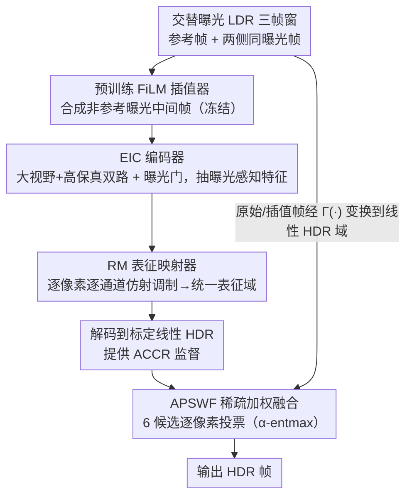

# LRHDR: Learning Representation-enhanced HDR Video Reconstruction

**会议**: CVPR 2026  
**论文**: [CVF Open Access](https://openaccess.thecvf.com/content/CVPR2026/html/Liao_LRHDR_Learning_Representation-enhanced_HDR_Video_Reconstruction_CVPR_2026_paper.html)  
**代码**: 待确认  
**领域**: 图像恢复 / HDR 视频重建  
**关键词**: HDR 视频, 多曝光融合, 跨曝光表征, 稀疏加权融合, 鬼影抑制

## 一句话总结
LRHDR 用交替曝光的 LDR 视频帧重建 HDR 视频，把"先对齐再融合"的传统范式换成"映射到统一表征再投票融合"：通过 ACCR 网络把不同曝光的特征经逐像素仿射调制对齐到一个曝光无关的统一表征域，再由 APSWF 把融合改写成逐像素稀疏候选选择，在两曝光/三曝光设置下都取得了 PSNR/SSIM 的 SOTA。

## 研究背景与动机

**领域现状**：标准相机只能捕捉窄动态范围，要得到 HDR 视频，最实用的路线是让相机在拍摄时**交替切换曝光**（如奇数帧 EV-3、偶数帧 EV+0），再把相邻几帧不同曝光的 LDR 帧融合成一帧 HDR。绝大多数现有 HDR 视频方法都遵循"对齐—重建"（alignment–reconstruction）范式：先用光流、可变形卷积或注意力把邻帧配准到参考帧，再做融合。

**现有痛点**：交替曝光带来三重困难——大运动、曝光导致的光度不一致、以及过曝/欠曝区域的信息丢失。这些因素叠加让**逐像素对齐变成高度病态问题**：过曝区根本没有可匹配的纹理，欠曝区被暗噪声淹没，光流在不同曝光帧间本就不可靠。一旦中间对齐结果出现畸变，畸变会一路传播到最终 HDR，在动态区域表现为明显的鬼影和细节丢失。

**核心矛盾**：传统范式的整体上限被两件事卡死——**对齐的精度**和**融合模块的性能**。但在交替曝光场景下，"强行把不同曝光帧像素级对齐到参考帧"这个前提本身就难以成立，对齐越用力，鬼影越重，反而给后续重建增加负担。

**本文目标**：绕开显式跨曝光对齐，把"如何让不同曝光帧互补"重新表述为"如何把它们映射到一个共享的、曝光无关的表征"，并把融合从"加权平均多少"改写成"每个像素该信任哪个候选"。

**切入角度**：作者观察到，在局部良好曝光、相机响应函数单调可微的假设下，特征对曝光对数 $s=\log e$ 的导数可以近似为一个仿射形式 $\partial_s E(x)\approx a(x,s)E(x)+b(x,s)$，沿曝光路径积分后得到 $E(X^{e_b})(x)\approx k(x)E(X^{e_a})(x)+b(x)$——这意味着**跨曝光的特征关系本质上是逐像素、逐通道的线性调制**，无需做空间对齐就能把一个曝光的特征"翻译"到另一个曝光域。

**核心 idea**：用"映射到统一表征 + 稀疏投票融合"代替"显式对齐 + 稠密融合"，从源头规避病态的跨曝光像素配准。

## 方法详解

### 整体框架
LRHDR 输入是一段交替曝光的 LDR 视频 $\{L_t\}$（论文主文聚焦两曝光模式 $N_e=2$，三曝光 $N_e=3$ 放在附录），输出是同长度的 HDR 视频 $\{H_t\}$。在时刻 $t$，框架取一个三帧滑窗 $L^{e_0}_{t-1}, L^{e_1}_t, L^{e_0}_{t+1}$，其中 $L^{e_1}_t$ 为参考帧。整个流水线由三个可学习/预训练组件串起来：

1. **预训练插值器（FiLM）**：先用预训练的帧插值网络 FiLM 从两侧同曝光帧 $L^{e_0}_{t-1}, L^{e_0}_{t+1}$ 合成一个与参考帧时间对齐的非参考曝光中间帧 $\hat{L}^{e_0}_t$，提供"无需参考帧"的运动信息（这是脚手架，权重冻结）。
2. **ACCR（核心贡献①）**：把 $\{L^{e_1}_t, \hat{L}^{e_0}_t\}$ 送入 ACCR，内部先经 **EIC 编码器**抽取曝光感知特征，再经 **RM（Representation Mapper）**把不同曝光特征逐像素仿射调制到统一表征域，解码出标定线性 HDR 帧 $\{\tilde{H}^{e_1}_t, \tilde{\hat{H}}^{e_0}_t\}$。
3. **APSWF（核心贡献②）**：把原始/插值 LDR 帧、经 $\Gamma(\cdot)$ 变换到线性 HDR 域的候选 $\{H^{e_0}_{t-1}, H^{e_1}_t, H^{e_0}_{t+1}, \hat{H}^{e_0}_t\}$、以及 ACCR 产出的统一表征 HDR $\{\tilde{H}^{e_1}_t, \tilde{\hat{H}}^{e_0}_t\}$ 共 6 个候选一起送入，预测逐像素稀疏归一化掩码做加权融合，输出最终 HDR 帧。

其中 LDR→线性 HDR 的变换定义为 $\Gamma(L)=L^{\gamma}/e$，$\gamma=2.2$，$e$ 为曝光时间。

### 关键设计

**1. EIC 编码器：为交替曝光量身设计的曝光感知特征提取**

传统编码器对所有帧一视同仁，但交替曝光下不同帧的可信信息分布完全不同（欠曝帧高光可信、过曝帧暗部可信）。EIC（Exposure-aware Interleaved Context）用双分支加一个标量曝光门来让特征"知道自己来自哪个曝光"。对一帧 $L^{e_i}_t$，融合特征为 $F^{e_i}_t = \mathrm{LF}(L^{e_i}_t) + \alpha(e_i)\cdot \mathrm{HF}(L^{e_i}_t)$，其中 **LF（Large-Field）分支**用 stride=2 的普通卷积提供大感受野、稳定的空间上下文，**HF（High-Fidelity）分支**由 pixel-unshuffle、通道拆分、点积和 stride=1 卷积组成，保留亚像素级的精细结构。曝光门 $\alpha(e_i)=\sigma(w\log(e_i+\varepsilon)+b)$（$\varepsilon=10^{-8}$，$w,b$ 为可学习标量）依据曝光时间对数自适应地调节高保真分支的权重——曝光越长/越短，模型对精细分支的信任程度随之改变。这样 LF 与带门 HF 联合构成了一个曝光感知的多尺度信息交换机制。

**2. RM 表征映射器：用逐像素仿射调制代替显式跨曝光对齐**

这是全文最核心的设计，直接回应"跨曝光像素对齐病态"的痛点。RM（Representation Mapper）不做任何空间配准，而是学习一个对每个曝光特征都成立的归一化映射 $\Pi_e$，把它投影到一个曝光无关的统一表征 $R_t(x)$ 上：$\tilde{F}^e_t(x)=\Pi_e(F^e_t(x))\approx R_t(x)$。前面动机里推导出的仿射结论决定了 $\Pi_e$ 的形式就是逐像素、逐通道的线性调制：

$$\tilde{F}^e_t(x) = K^e_t(x) \odot F^e_t(x) + B^e_t(x)$$

其中 $\odot$ 为 Hadamard 积，$K,B$ 是调制系数。在过曝和暗噪声主导的区域，单路映射不可靠，于是 RM 引入两个**跨曝光线索**来引导 $K,B$ 的估计：$C_t=\Gamma(\hat{L}^{e_0}_t)-\Gamma(L^{e_1}_t)$ 是带符号的跨曝光差异线索（指示某区域该增强还是该抑制），$C^{\circ 2}_t=C_t\odot C_t$ 提供幅度/可靠性线索（帮助估计置信度和调制强度）。这套设计的妙处在于：它把"不同曝光怎么互补"从一个空间匹配问题，转化成一个有物理依据（成像模型 + 相机响应）的逐像素特征调制问题，从根上避免了强行对齐带来的畸变。

**3. APSWF 稀疏加权融合：把融合改写成逐像素候选投票**

APSWF（Adaptive Pixel-wise Sparse Weighted Fusion）不再问"每个源该平均多少"，而是问"每个像素该激活哪几个可信候选"。它对 6 个候选 $(H^{e_0}_{t-1}, H^{e_1}_t, H^{e_0}_{t+1}, \hat{H}^{e_0}_t, \tilde{H}^{e_1}_t, \tilde{\hat{H}}^{e_0}_t)$ 学一组逐像素稀疏掩码 $M(x)=(M_1(x),\dots,M_6(x))$，满足 $M_i(x)\ge 0$、$\sum_i M_i(x)=1$，最终 $\hat{H}_t=\sum_{i=1}^6 M_i H_i$，融合全程在线性 HDR 域进行以保证物理合理性。网络主干是带 triplet attention 的 U-Net，在四个尺度（1/8、1/4、1/2、1×）各挂一个 6 通道头预测加权 logits，再自顶向下融合多尺度 logits。关键一步是用 **α-entmax**（$\alpha=1.75$）把 logits 投影到 6-单纯形上，得到"赢家通吃"式的稀疏掩码——它能产生**精确的零**（不可信候选直接归零）同时保持梯度平滑，从而只让少数可靠候选参与每个像素的重建，显著抑制鬼影和噪声放大。

### 损失函数 / 训练策略
总损失 $L_{total}=\lambda_1 L_{Recon}+\lambda_2 L_{ACCR}+\lambda_3 L_{vote}$（$\lambda_1=1,\lambda_2=0.1,\lambda_3=0.5$），三项都在 μ-law 色调映射域 $T(H)=\frac{\log(1+\mu H)}{\log(1+\mu)}$（$\mu=5000$）上计算以提升感知质量：

- **ACCR Loss** $L_{ACCR}=\lambda_{L1}L_{L1}+\lambda_{grad}L_{grad}$（$\lambda_{L1}=1.0,\lambda_{grad}=0.01$）监督 RM 解码出的两路线性 HDR，其中 $L_{L1}$ 对插值流用减权系数 $\eta=0.7$ 避免过约束，$L_{grad}$ 是 1×/0.5×/0.25× 的多尺度梯度保真损失（权重 $\omega_s=(1.0,0.5,0.25)$）。
- **Vote Loss** $L_{vote}$ 用 α-entmax 交叉熵监督 APSWF：先按 $E_i(x)=\|T(H_i(x))-T(H^\star(x))\|^2_2$ 找出每像素最匹配真值的"oracle 候选" $i^\star(x)=\arg\min_i E_i(x)$，再让预测 logits 对齐该 oracle，使单候选占优时收敛到 one-hot、否则允许低熵混合，避免退化成稠密平均。

训练用 AdamW，APSWF 初始学习率 $10^{-4}$、ACCR 为 $10^{-5}$，cosine 退火至 $10^{-6}$，共 300 epoch，batch 8，4×RTX 4090（24GB）；一次训练得到的冻结权重在所有数据集上评测。

## 实验关键数据

### 主实验
在 Cinematic Video [8] 与 DeepHDRVideo [2] 两个数据集、两曝光与三曝光两种设置下对比 7 个 SOTA。下表节选 Cinematic Video 数据集结果（PSNR/SSIM 在 μ-law 色调映射域计算）：

| 设置 / 数据集 | 指标 | NECHDR（次优）| 本文 LRHDR | 提升 |
|--------|------|------|----------|------|
| 2-Exp / Cinematic[8] | PSNR$_T$ | 40.59 | **41.11** | +0.52 |
| 2-Exp / Cinematic[8] | SSIM$_T$ | 0.9241 | **0.9274** | +0.0033 |
| 2-Exp / Cinematic[8] | HDR-VDP-2 | 73.31 | **75.23** | +1.92 |
| 3-Exp / Cinematic[8] | PSNR$_T$ | 37.24 | **37.64** | +0.40 |
| 3-Exp / Cinematic[8] | HDR-VDP-2 | 68.36 | **71.01** | +2.65 |
| 2-Exp / DeepHDRVideo[2] | PSNR$_T$ | 43.44 | **43.49** | +0.05 |
| 2-Exp / DeepHDRVideo[2] | HDR-VDP-2 | 73.31⚠️ | **80.68** | 大幅领先 |

> 注：HDR-VDP-2 是基于人眼视觉模型的 HDR 质量评价指标（值越高越好），角分辨率统一设为 30 像素/视角度。⚠️ DeepHDRVideo 2-Exp 那一行的次优值疑似 OCR 串列，以原文表格为准。LRHDR 在两数据集、两设置下几乎都拿到 PSNR$_T$/SSIM$_T$ 最佳，HDR-VDP-2 在 Cinematic 上较次优分别领先 1.92（两曝光）和 2.65（三曝光）。

### 消融实验
在 DeepHDRVideo 动态子集（DeepHDRVideo-D）和 Cinematic Video 上逐组件累加。Base = FiLM + APSWF + Vote Loss：

| 配置 | DeepHDRVideo-D PSNR$_T$ | Cinematic PSNR$_T$ | 说明 |
|------|---------|------|------|
| Base | 44.51 | 40.01 | FiLM 插值 + APSWF 融合 |
| + EIC | 44.86 | 40.27 | 曝光感知特征带来清晰增益 |
| + RM | 45.11 | 40.47 | 统一表征映射进一步提升 |
| + ACCR Loss | 45.46 | 40.61 | 约束 RM 学到正确表征 |
| ACCR + APSWF | 45.57 | 40.99 | 完整 ACCR |
| ALL w/o Vote Loss | 45.52 | 40.97 | 去掉投票监督掉点 |
| **ALL（完整）** | **45.89** | **41.11** | 最佳 |

### 关键发现
- **RM 是收益主力之一**：在 Base 上加 EIC 再加 RM，Cinematic PSNR$_T$ 从 40.01→40.27→40.47 稳步上升，验证"映射到统一表征"比单纯加强特征更关键。
- **Vote Loss 不可省**：去掉投票监督（ALL w/o Vote Loss）相比完整模型在两数据集上都掉点（45.52 vs 45.89），说明 oracle 投票监督让稀疏掩码学到了正确的候选选择。
- **统一表征 vs 显式对齐**：在 Fig.3 与 Tab.3 的对照中，把 ACCR 换成基于光流的显式对齐重建，中间结果在动态区域畸变明显并传播到最终 HDR；把 APSWF 换成 [6,39] 的稠密融合网络，PSNR$_T$/SSIM$_T$ 也一致下降，双双佐证"统一表征 + 稀疏投票"在交替曝光下更鲁棒。

## 亮点与洞察
- **把跨曝光关系还原成仿射调制**：从成像模型对 $\log e$ 求导推出"特征间是逐像素逐通道线性关系"，给 RM 的 $K\odot F+B$ 形式提供了物理依据，而不是拍脑袋设计——这种"先推物理、再定网络结构"的思路可迁移到其他多曝光/多模态对齐任务。
- **用 α-entmax 把"融合"变成"可学的稀疏选择"**：相比 softmax 的稠密加权，α-entmax 能产生精确零、实现"赢家通吃"，让不可信候选彻底退出，这对抑制鬼影特别有效；这个把融合写成稀疏单纯形投影的 trick 在多源/多视图融合里有通用价值。
- **绕开对齐这件事本身就是洞察**：当对齐病态时，与其把精力花在更强的对齐器上，不如换一个不需要对齐的表征——这是对"对齐—重建"范式的一次范式级反思。

## 局限与展望
- **依赖预训练 FiLM 插值器**：非参考曝光中间帧由冻结的 FiLM 合成，插值器在极端大运动下的失败会成为上游瓶颈，本文未联合优化这一环。
- **仿射近似的前提有边界**：RM 的线性调制建立在"局部良好曝光 + 相机响应单调可微"假设上，对极端过曝/欠曝、强非线性 tone curve 的真实相机，统一表征的逼近精度可能下降（论文也承认过曝/暗噪声区需要额外线索引导）。
- **主文只详述两曝光**：三曝光仅给结果、推导放附录，更多曝光级数（$N_e>3$）下候选数增长、APSWF 投票头如何扩展仍待验证。
- **评测局限**：Kalantari13 缺真值只能做定性，定量主要靠两个合成/半合成数据集，真实交替曝光相机的端到端表现仍需更多野外验证。

## 相关工作与启发
- **vs 显式对齐范式（HDRFlow / Chen et al. / 两阶段对齐）**：他们靠光流/可变形卷积/分阶段把邻帧配准到参考帧，本文不做任何空间对齐，改成逐像素仿射映射到统一表征，区别在于规避了交替曝光下病态的像素匹配，因此在大运动+饱和区域鬼影更少。
- **vs NECHDR（曝光补全）**：NECHDR 通过插值补全缺失曝光信息再渲染，本文也用插值器但只把它当运动线索，真正的互补发生在统一表征域；LRHDR 在两数据集上 PSNR$_T$/SSIM$_T$ 均优于 NECHDR。
- **vs 稠密融合网络 [6,39]**：他们用稠密权重做融合，本文用 α-entmax 稀疏掩码做"投票式"选择，消融显示稀疏融合在动态场景一致更优。
- **启发**：候选选择 + 可靠性感知融合的思路源自 HDR 去鬼影里的 hard-voting 与不确定性感知合并，本文把它系统化为可微的稀疏单纯形投影，是一次成功的机制移植。

## 评分
- 新颖性: ⭐⭐⭐⭐⭐ 用"统一表征 + 稀疏投票"取代"对齐 + 稠密融合"，并给出仿射调制的物理推导，是范式级创新
- 实验充分度: ⭐⭐⭐⭐ 两数据集×两曝光设置 + 逐组件消融 + 对照实验扎实，但真实交替曝光相机的野外验证偏少
- 写作质量: ⭐⭐⭐⭐ 动机推导清晰、图文配合好，但符号密集、三曝光细节挪到附录略影响完整性
- 价值: ⭐⭐⭐⭐ 对 HDR 视频重建社区给出可复用的"免对齐"思路，稀疏投票融合也具通用性

<!-- RELATED:START -->

## 相关论文

- [\[CVPR 2026\] F²HDR: Two-Stage HDR Video Reconstruction via Flow Adapter and Physical Motion Modeling](f2hdr_two-stage_hdr_video_reconstruction_via_flow_adapter_and_physical_motion_mo.md)
- [\[CVPR 2026\] AE2VID: Event-based Video Reconstruction via Aperture Modulation](ae2vid_event-based_video_reconstruction_via_aperture_modulation.md)
- [\[CVPR 2026\] ExpoCM: Exposure-Aware One-Step Generative Single-Image HDR Reconstruction](expocm_exposure-aware_one-step_generative_single-image_hdr_reconstruction.md)
- [\[CVPR 2026\] HFR and HDR Video from Multi-Attenuated Spikes Using a Rapidly Rotating SpokeND Filter](hfr_and_hdr_video_from_multi-attenuated_spikes_using_a_rapidly_rotating_spokend_.md)
- [\[CVPR 2026\] PNG: Diffusion-Based sRGB Real Noise Generation via Prompt-Driven Noise Representation Learning](diffusion-based_srgb_real_noise_generation_via_prompt-driven_noise_representatio.md)

<!-- RELATED:END -->
