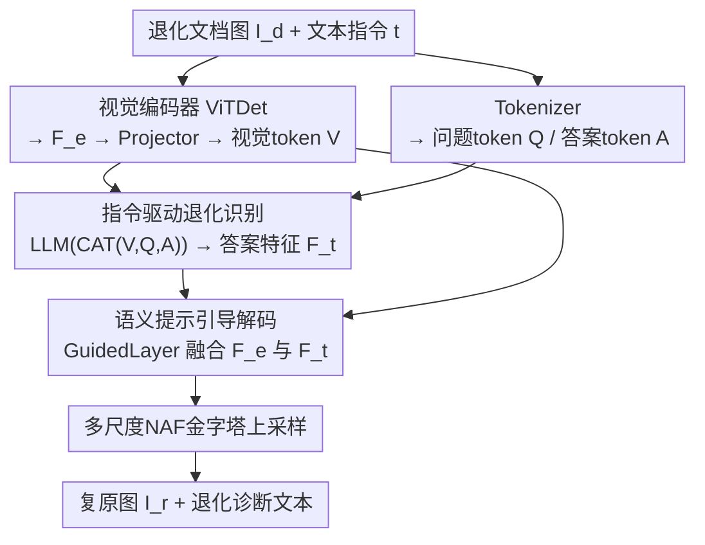

# MMDIR: Multimodal Instruction-Driven Framework for Mixed-Degradation Document Image Restoration

**会议**: CVPR 2026  
**论文**: [CVF Open Access](https://openaccess.thecvf.com/content/CVPR2026/html/Li_MMDIR_Multimodal_Instruction-Driven_Framework_for_Mixed-Degradation_Document_Image_Restoration_CVPR_2026_paper.html)  
**代码**: https://github.com/xiaomore/MMDIR  
**领域**: 图像恢复 / 文档图像复原  
**关键词**: 文档图像复原, 混合退化, 指令驱动, 多模态大模型, 退化识别

## 一句话总结
MMDIR 把"用文字指令问模型这张文档图里有没有/有哪些退化"这件事塞进文档复原流程：一张退化文档图配一条文本指令，经视觉编码器和 LLM 联合处理后，LLM 先输出"哪几种退化存在"的诊断文本，再用这段语义特征去引导视觉解码器做有针对性的复原，从而在不依赖退化先验、不为每种退化单独训模型的前提下，统一处理模糊、阴影、文字水印、印章四类**混合且不确定**的退化。

## 研究背景与动机
**领域现状**：文档图像复原（DIR）是把模糊、阴影、水印、印章这些干扰从扫描/拍摄文档里去掉、把内容修复成清晰可读的预处理任务。主流做法是端到端的"图到图"映射——把退化图喂进 CNN / Transformer / GAN / 扩散模型，用干净参考图监督，直接回归出复原结果（如 DocDiff、NAF-DPM、LGA-Doc）。

**现有痛点**：这类端到端模型学的是一个**固定映射**，没有显式的退化类型条件，通常一种退化训一个专用模型；要处理多种退化就得训多个模型。DocRes 进了一步，在预处理阶段估计退化类型、把弱提示拼到输入上引导网络，但它需要**预先知道退化类别**、依赖刚性的预处理管线，一旦遇到退化类型模糊的开放场景就失效，而且它对提取的视觉先验质量敏感，先验抽错会直接污染复原结果。

**核心矛盾**：真实文档往往**多种退化同时出现**（一张合同可能既有阴影又有模糊还盖着印章和文字水印），且事先并不知道到底有哪几种。现有方法要么假设单一退化、要么必须先知道退化类别，本质上无法在"退化未知且混合"的条件下工作；而且各复原任务之间其实有共性，独立训练的模型无法共享这种跨任务知识。

**本文目标**：做一个统一框架，能在不给退化先验的前提下，自动识别一张图里同时存在哪些退化，并据此做细粒度、可解释的复原。

**切入角度**：作者借鉴了多模态文档理解（OCR、VQA）里"给定任务提示，MLLM 能生成相关文本回答"的能力——既然 MLLM 能回答"图里写了什么"，那它应该也能回答"图里有哪些退化"。

**核心 idea**：把"退化识别"做成一个由文本指令驱动的 VQA 式任务，让 LLM 输出的诊断语义特征当作引导信号去驱动视觉解码器复原，用"语义推理"替代"退化先验"。

## 方法详解

### 整体框架
MMDIR 是一个端到端多模态架构，同时吃**多模态输入**（退化图 + 文本指令）、产**多模态输出**（复原图 + 退化诊断文本）。输入一张退化文档图 $I_d \in \mathbb{R}^{H\times W\times C}$ 和一条文本指令 $t$（指令含两部分：固定的"判断图里有无噪声/干扰并指出类型"，以及可选的"指定移除某几类退化"）。视觉端用 ViTDet 编码器把图切成 16×16 patch、过窗口自注意力得到特征图 $F_e$，再经一个两层 3×3 卷积的 Projector 压成 256 个视觉 token $V$；文本端用 tokenizer 把问题（指令）和答案（退化诊断）分别编码成 $Q$、$A$。三者沿序列维拼接送进 LLM 做跨模态对齐，LLM 输出的答案特征 $F_t$ 携带"图里到底有哪些退化"的语义。最后视觉解码器把编码器特征 $F_e$ 与语义引导特征 $F_t$ 融合，经多尺度 NAF 金字塔逐级上采样重建出复原图 $I_r$。训练时 $Q$、$A$ 都给（让 LLM 学跨模态对齐）；推理时只给 $I_d$ 和 $Q$，由 LLM 逐步解码出诊断答案 $A$，并把每步隐状态沿序列平均当作 $F_t$。

### 关键设计

**1. 指令驱动的退化识别：用 VQA 式问答替代退化先验**

针对"现有方法必须预知退化类别、且无法感知图里到底有哪些噪声"这一痛点，MMDIR 把退化识别做成一个文本模态的诊断任务。视觉 token $V$、问题 token $Q$、答案 token $A$ 沿序列维拼接后送进 LLM：

$$F_e = \text{VisEncoder}(I_d),\quad V = \text{Projector}(F_e),\quad F_t = \text{LLM}(\text{CAT}(V, Q, A))$$

LLM 借助训练中习得的常识与推理能力，动态解读指令、生成一段诊断回答——明确指出哪些退化存在、哪些不存在。关键巧思在于这个诊断不是简单分类：指令里用户可能指定"移除印章、模糊"，但 LLM 经视觉分析后会纠正成"图里没有印章，但检测到文字水印，因此实际移除模糊和文字水印"。这就把"文字描述的退化类型"和"图像里实际存在的退化区域"做了空间对齐，既能响应用户请求、又能检测到用户没提的退化，从而摆脱对退化先验和刚性预处理的依赖。

**2. 语义提示引导的视觉解码器：让诊断语义当复原的"导航"**

LLM 输出的答案特征 $F_t$ 携带"该修哪些退化"的语义，MMDIR 把它当作引导信号注入复原。视觉解码器（公式 $I_r = \text{VisDecoder}(F_e, F_t)$）对编码器特征 $F_e$ 做 unpatch 上采样得到四个多尺度特征图 $\{F_0,F_1,F_2,F_3\}$，按金字塔哲学用 PixelShuffle 每次放大 2 倍、沿通道拼接后送入 NAF Block（含 Simplified Channel Attention），逐级重建到原分辨率。融合的核心是 GuidedLayer：LLM 给出的文本 token $F_t$ 先乘一个初始化为 1 的可学习权重 $W_t$ 得到 $F'_t$，再与视觉特征 $F_e$ 逐元素相加，形成"文本语义引导的特征图"。可学习权重让模型自己决定语义引导的强度，避免硬性注入破坏视觉细节；而且推理时这段引导来自 LLM 对指令的**推测性语义**而非真值答案，使复原过程任务自适应、语义感知。

**3. MixedDoc 混合退化基准与合成管线：补上"多退化共存"的数据空白**

现有数据集大多只含单类退化、且忽略印章/文字水印这类常见遮挡，无法评估混合退化场景。作者据此合成数据：训练侧从 CDLA、CDDOD、FSDSRD 收集干净文档，合成 11 万张混合退化图，每张随机叠加 1–4 种退化（模糊随机取高斯/散焦/玻璃/缩放/运动模糊；印章用 2 万张合成图加 1597 张真实印章；阴影用 FSDSRD 与 SynShadow 的掩码；文字水印用自采中英文语料随机渲染，所有元素随机裁剪旋转）。测试侧基于 M6Doc 文档按类似管线合成、用未参与训练的 320 张真实印章和 432 张精选阴影掩码，最终得到 1837 张的 **MixedDoc** 基准。它系统性地填补了"真实多退化样本缺失"的数据缺口。

**4. 多目标复合损失：像素 + 局部 + 结构 + 诊断四路监督**

复原侧用像素级 L1 损失 $L_{pixel}=\|I_{gt}-I_r\|_1$ 约束整体保真；为强化对退化区域的感知，引入局部 L1 损失 $L_{local}=\|I_{gt}\times I_{mask}-I_r\times I_{mask}\|_1$，其中二值掩码 $I_{mask}$ 在阴影/水印/印章等退化区域取 255、其余取 0，让模型重点盯住退化区域；再加 SSIM 损失 $L_{ssim}$ 从感知空间评估质量；诊断侧用交叉熵 $L_{ce}$ 监督退化识别。总损失为

$$L_{total} = L_{pixel} + \alpha L_{local} + \beta L_{ssim} + \lambda L_{ce}$$

平衡系数经验设为 $\alpha=4,\ \beta=0.5,\ \lambda=0.5$。局部损失权重最大，反映了"退化区域的修复质量"是该任务的核心。

## 实验关键数据

**实现细节**：LLM 用 Qwen2.5 (0.5B)，除嵌入层外全程冻结；训练图尺寸 1024×1024，AdamW、batch 16、学习率峰值 $3\times10^{-4}$ 余弦衰减，80 epoch（5% warmup），2 张 A100。评测用 PSNR/SSIM（像素级）+ LPIPS/DISTS（感知级，越低越好）。

### 主实验

单退化基准（去模糊 BMVC + 去阴影 OSR），`*` 表示用相同训练集复现：

| 任务 | 指标 | MMDIR | 次优 | 说明 |
|------|------|-------|------|------|
| 去模糊 BMVC | PSNR↑ | 29.03 | 28.95 (LGA-Doc) | SOTA |
| 去模糊 BMVC | SSIM↑ | 0.977 | 0.978 (LGA-Doc) | 仅低 0.001 |
| 去模糊 BMVC | LPIPS↓ | 0.0150 | 0.0169 | ↓约 11.2% |
| 去模糊 BMVC | DISTS↓ | 0.0233 | 0.0470 | ↓约 43.0% |
| 去阴影 OSR | LPIPS↓ | 0.0547 | 0.0579 (DiffUIR1024*) | 最优 |
| 去阴影 OSR | DISTS↓ | 0.0816 | 0.0848 (DiffUIR1024*) | 最优 |

混合退化基准 MixedDoc（每图 1–4 种退化）：

| 方法 | PSNR↑ | SSIM↑ | LPIPS↓ | DISTS↓ |
|------|-------|-------|--------|--------|
| DocDiff1024* | 21.14 | 0.863 | 0.1923 | 0.1966 |
| DiffUIR1024* | 22.09 | 0.853 | 0.2008 | 0.2064 |
| **MMDIR** | **24.43** | **0.908** | **0.1217** | **0.1323** |

MMDIR 在 MixedDoc 上四项指标全面领先，PSNR 比次优高 2.34 dB，感知指标 LPIPS/DISTS 大幅下降，说明它在不确定混合退化下的泛化与鲁棒性明显更强。值得注意的是，去阴影任务里 BGSNet/DiffUIR 的 PSNR/SSIM 更高，但它们 LPIPS/DISTS 更差——作者指出这些方法输出偏过平滑/模糊，MMDIR 的优化方向更贴合人眼感知。

### 消融实验

文本指令（Inst.）的作用，对比有/无指令：

| 基准 | 指令 | PSNR↑ | SSIM↑ | LPIPS↓ | DISTS↓ |
|------|------|-------|-------|--------|--------|
| BMVC | ✗ | 26.76 | 0.966 | 0.0219 | 0.0320 |
| BMVC | ✓ | 29.03 | 0.977 | 0.0150 | 0.0233 |
| OSR | ✗ | 18.79 | 0.922 | 0.0610 | 0.0960 |
| OSR | ✓ | 19.60 | 0.928 | 0.0547 | 0.0816 |
| MixedDoc | ✗ | 23.83 | 0.898 | 0.1324 | 0.1489 |
| MixedDoc | ✓ | 24.43 | 0.908 | 0.1217 | 0.1323 |

### 关键发现
- **文本指令是核心增益来源**：去模糊上加指令让 PSNR 从 26.76 涨到 29.03（+2.27 dB），三个基准全线提升，证明"先识别退化、再据此引导复原"的语义信号确实有效，而非把 LLM 当摆设。
- **感知指标提升远大于像素指标**：MMDIR 在 LPIPS/DISTS 上的领先幅度（去模糊 DISTS ↓43%）远超 PSNR/SSIM，说明它的优势在于生成更真实的纹理与边缘细节，而不只是逐像素逼近。
- **混合退化场景受益最大**：相比单退化，MMDIR 在 MixedDoc 上对 DocDiff/DiffUIR 的全面碾压，印证了统一框架在多退化共存时能共享跨任务知识。

## 亮点与洞察
- 把"退化识别"重构成 VQA 式文本任务，让 LLM 输出可读的诊断（"图里没有印章，但有文字水印"），既提升复原又带来可解释性——这是端到端复原模型普遍欠缺的透明度。
- GuidedLayer 用一个初始化为 1 的可学习标量 $W_t$ 控制语义引导强度，是个轻量却关键的设计：让模型自己学"该信多少 LLM 的话"，避免硬注入破坏视觉特征。这个"可学习引导权重"思路可迁移到任何"用高层语义引导低层重建"的任务。
- 推理时引导信号来自 LLM 对指令的**推测性语义**（而非真值答案），意味着即便用户描述的退化和实际不符，模型也能自我纠正——这把"用户指令"从硬约束变成了可被推翻的提示。
- 局部 L1 损失用退化区域二值掩码做加权，权重 $\alpha=4$ 最大，是把"哪里该重点修"显式写进损失的简洁手段，可复用到任何有区域级标注的复原任务。

## 局限与展望
- LLM 仅用 0.5B 的 Qwen2.5 且冻结，诊断能力受限；退化类型也只覆盖模糊/阴影/文字水印/印章四类，扩展到折痕、撕裂、墨迹扩散等更复杂退化时是否还能靠指令识别，未验证。⚠️ 推理时若 LLM 误诊（把存在的退化判成不存在），会直接误导解码器，但论文未给出误诊率分析。
- MixedDoc 的混合退化是**合成**的（真实印章/阴影掩码有限），与真实世界的退化分布差距、以及在真实拍摄文档上的泛化，主要靠定性图展示，缺乏真实混合退化的定量评测集。
- 去阴影任务上 PSNR/SSIM 仍低于 BGSNet/DiffUIR，作者解释为"对方过平滑"，但这也意味着在以像素保真为主的下游（如 OCR）上的实际收益需进一步验证。

## 相关工作与启发
- **vs DocRes**：DocRes 在预处理阶段估计退化类型、把弱视觉先验拼到输入上，需预知退化类别且依赖刚性管线；MMDIR 不要先验、用文本指令让 LLM 在线诊断退化，避免了先验抽取错误污染复原，且能处理退化未知的开放场景。
- **vs DocDiff / NAF-DPM / LGA-Doc**：它们是无提示的端到端单退化复原；MMDIR 用 LLM 语义引导做统一多退化复原，在感知指标上明显更优。
- **vs DiffUIR**：DiffUIR 是自然场景统一复原、用共享分布项把不同退化映到统一表示，本文把它迁移到文档域做公平对比并超越；MMDIR 的差异在于用显式的语言诊断（而非隐式分布项）来条件化复原。

## 评分
- 新颖性: ⭐⭐⭐⭐ 把指令驱动 VQA 式退化识别引入文档复原、并用诊断语义引导解码，角度新颖且实用。
- 实验充分度: ⭐⭐⭐⭐ 单退化+混合退化双基准、指令消融到位；但混合退化全是合成、缺真实定量评测与误诊分析。
- 写作质量: ⭐⭐⭐⭐ 动机和架构讲得清楚，图示充分；部分公式排版有 OCR 噪声。
- 价值: ⭐⭐⭐⭐ 提供了 MixedDoc 基准和一套可解释的统一复原范式，对真实文档预处理有实用意义。

<!-- RELATED:START -->

## 相关论文

- [\[CVPR 2026\] Degradation-Robust Fusion: An Efficient Degradation-Aware Diffusion Framework for Multimodal Image Fusion in Arbitrary Degradation Scenarios](degradation-robust_fusion_an_efficient_degradation-aware_diffusion_framework_for.md)
- [\[CVPR 2026\] Hybrid Agents for Image Restoration](hybrid_agents_for_image_restoration.md)
- [\[CVPR 2026\] DRFusion: Degradation-Robust Fusion via Degradation-Aware Diffusion Framework](drfusion_degradation_robust_fusion_via_degradation_aware_diffusion_framework.md)
- [\[CVPR 2026\] Degradation-Consistent Test-Time Adaptation for All-in-One Image Restoration](degradation-consistent_test-time_adaptation_for_all-in-one_image_restoration.md)
- [\[CVPR 2026\] InstantRetouch: Efficient and High-Fidelity Instruction-Guided Image Retouching with Bilateral Space](instantretouch_efficient_and_high-fidelity_instruction-guided_image_retouching_w.md)

<!-- RELATED:END -->
