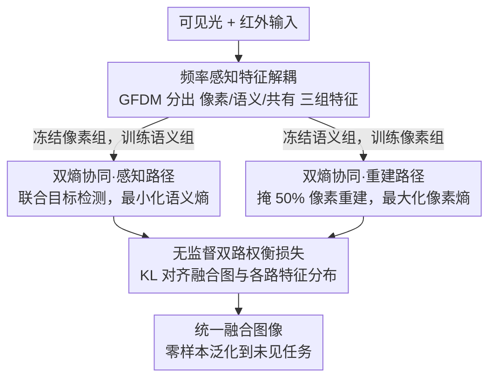

# More Than Meets the Eye: A Unified Image Fusion Framework via Semantic-Pixel Entropy Trade-off for Zero-Shot Generalization

**会议**: CVPR 2026  
**论文**: [CVF Open Access](https://openaccess.thecvf.com/content/CVPR2026/html/Liu_More_Than_Meets_the_Eye_A_Unified_Image_Fusion_Framework_CVPR_2026_paper.html)  
**代码**: https://github.com/XiaoW-Liu/DECC  
**领域**: 图像融合 / 图像恢复  
**关键词**: 图像融合, 自由能原理, 语义-像素熵权衡, 零样本泛化, 频域特征解耦

## 一句话总结
把图像融合重新表述成自由能最小化问题——感知路径压低"语义熵"、重建路径抬高"像素熵"——只用红外-可见光这一种数据训练，就能零样本泛化到医学、多焦点、多曝光等没见过的融合任务，同时显著提升下游检测/分割性能。

## 研究背景与动机

**领域现状**：多源图像融合把多张互补输入整合成一张信息更全的图，传统上靠任务专用网络（红外-可见光、医学、多焦点各训一个）。近年开始出现"通用网络"和"统一融合"方法，试图用一个模型覆盖多任务，但绝大多数仍要求推理时显式指定任务类型，或在训练中见过目标任务。

**现有痛点**：现有方法卡在两个地方。其一是**适应不了没见过的融合任务**——通用方法需要任务标识、统一方法多半只在见过的任务上表现好；TC-MoA、GIFNet 这类靠门控/选择机制的方法虽然能泛化，但训练时仍要任务专用的选择和辅助网络，复杂度高。其二是**语义与像素难以兼顾**——重视下游任务（检测/分割）的方法会牺牲细粒度像素细节，纯像素驱动的方法又缺乏高层感知约束、容易在重建中引入伪影、抬高语义不确定性。

**核心矛盾**：作者把痛点归结成三个根本挑战：(1) **缺统一的、与任务无关的优化目标**——要零样本泛化，锚任务的优化空间必须天然对齐其它融合任务，这要求一个超越具体数据属性、刻画融合"本质"的目标函数；(2) **语义保真与像素丰富之间存在域鸿沟**——高层语义特征和低层像素特征分布差异大，难以同时优化；(3) **过度依赖监督学习**——跨模态融合本就没有"真值融合图"，强行靠任务监督会阻碍学到可迁移的共享表示。

**切入角度**：作者从计算神经科学的**自由能原理**（Friston）借了个视角：智能体通过"感知推断"和"主动推断"最小化预测误差。映射到融合上——感知推断把像素映射到语义空间以降低不确定性（**最小化语义熵**），生成式重建从语义反推像素细节以最大化信息量（**最大化像素熵**）。这两个方向天然对称、互为约束。

**核心 idea**：用一个统一的自由能目标——"最大化像素熵、最小化语义熵"——取代任务专用的损失设计，让目标函数本身与具体任务无关，从而获得零样本泛化能力。落地为三件套：双路协同训练（DECC）、频域特征解耦（GFDM）、无监督 KL 权衡损失。

## 方法详解

### 整体框架

整篇方法叫 **DECC（Dual-Entropy Collaborative Constraints，双熵协同约束）**。它的出发点是把融合写成自由能最小化：

$$\mu^*,\alpha^* = \arg\min_{\mu,\alpha} F(\tilde{s}(\alpha),\mu)$$

其中 $F$ 可分解为"预测误差 + 复杂度（先验偏离）"两项：$F = \mathbb{E}_{q(\mu)}[-\log p(\tilde{s}(\alpha)|\mu)] + \mathrm{KL}[q(\mu)\|p(\mu)]$。作者借预测误差项与条件熵的联系，把它近似成两个熵的差：

$$F(\tilde{s}(\alpha),\mu) \propto \mathbb{E}[H(I_{sem}|\mu)] - \mathbb{E}[H(I_{pix}|\alpha)] + C$$

于是融合的统一目标就变成一个对称的双熵优化（$C$ 为与优化无关的常数）：

$$\mu^*,\alpha^* = \arg\max_{\mu,\alpha}\ \mathbb{E}[H(I_{pix}|\alpha)] - \mathbb{E}[H(I_{sem}|\mu)]$$

也就是"重建时把像素熵抬到最大、感知时把语义熵压到最小"。这个目标不绑定任何具体任务的数据属性，所以是 task-agnostic 的，这正是零样本泛化的来源。

整个网络由一个**共享的频率动态编码器**、一个**感知解码器**、一个**重建解码器**，外加**双路交替训练**机制构成。输入是配准好的可见光 + 红外图，编码器先做频域感知和频率感知解耦，再经跨模态、跨频率融合；之后分流到两条对称路径——感知路径（PP）联合做目标检测压语义熵，重建路径（RP）对输入随机掩码 50% 像素做重建抬像素熵——两条路共享编码器参数，彼此互为正则。

### 关键设计

**1. 双熵协同约束的双路对称训练（DECC）：把"语义保真"和"像素丰富"拆成两条共享参数的路**

这一设计直接回应"缺统一目标 + 没法零样本泛化"的挑战。它不去为每个任务设计损失，而是把上面的双熵目标拆成两条对称路径同时优化。**感知路径（PP）**学一个"像素→语义"的映射：把融合任务和目标检测任务联合起来训，用检测把语义结构逼出来，从而最小化语义熵、增强语义表征，其目标可写成 $\min_{\phi,\theta}\mathbb{E}_{x}[-\sum_y s_\phi(y|x;\theta)\log s_\phi(y|x;\theta)]$（$\theta$ 是共享编码器、$\phi$ 是感知头）。**重建路径（RP）**学一个"语义→像素"的低维到高维映射：对每张输入随机遮掉 50% 的像素（非重叠区域）让模型补全，逼它保留尽可能多的视觉多样性，目标是 $\max_{\psi,\theta}\mathbb{E}_{x}[-\sum_f p_\psi(f|x;\theta)\log p_\psi(f|x;\theta)]$。

为什么这样有效：两条路**共享同一个编码器 $\theta$**，意味着语义侧学到的约束和像素侧学到的约束会在共享参数里相互拉扯、互为正则——这正是自由能"感知-重建对称"的工程化身。其结果就是消融里看到的：只用 PP 语义指标（MI、检测 mAP）高但像素丰富度（SD、SF）差，只用 RP 反过来；合在一起才同时拿到最好的 Qabf 和检测 mAP。

**2. 分组频率动态卷积（GFDM）的频率感知特征解耦：在频域里把语义和像素拆开，再分路冻结**

这一设计针对"语义-像素域鸿沟"的挑战。共享编码器的核心是一个**分组频率动态卷积模块（GFDM）**：它先用离散傅里叶变换（DFT）把特征送进频域，经 Fourier Disjoint Weight、Kernel Spatial Modulation、Frequency Band Modulation 等模块做动态调制，再 IDFT 回空间域，把表征**分解成像素导向（$K_P$）、语义导向（$K_S$）、共有导向（$K_C$）三组频率感知特征**。关键在训练时的处理：迭代训练中**交替冻结与当前路径无关的组**——训感知路径时冻住像素导向参数、训重建路径时冻住语义导向参数——从而强制实现跨域解耦，避免两类特征在同一组参数里互相污染。解耦之后再通过跨模态融合（红外/可见光两支）和跨频率融合做动态特征交互。

为什么这样有效：低层像素细节集中在高频、高层语义结构集中在低频，在频域里分组天然贴合"语义 vs 像素"的物理差异；而"按路冻结"让每条路只更新自己负责的频率组，等于在一个共享骨干里实现了软性的参数分工。消融最有说服力——把 GFDM 换成普通卷积（w/o GFDM），SD 从 40.97 暴跌到 27.67、EN 从 7.01 掉到 6.49，视觉质量全面崩塌，说明频域解耦是这套框架的承重墙。

**3. 无监督双路 KL 权衡损失：没有真值融合图，就让融合结果去对齐两路各自的特征分布**

这一设计回应"跨模态融合没有真值、过度依赖监督"的挑战。作者不依赖任何"标准答案融合图"，而是用 KL 散度在分布层面做约束。在感知路径上，对融合图 $x_f$ 和感知特征施加 KL 约束 $\mathcal{L}^{PP}_{trade}=\mathcal{L}_{KL}(x_f, \mathrm{Fea}_{PP})$，把融合结果往"语义确定"的方向拉、降低语义熵；在重建路径上对称地用 $\mathcal{L}^{RP}_{trade}=\mathcal{L}_{KL}(x_f, \mathrm{Fea}_{RP})$ 把融合结果往"像素丰富"的高维分布拉、抬高像素熵。两条 KL 约束合起来就实现了"语义-像素分布权衡"。

为什么这样有效：KL 把监督从"逐像素回归某个真值"变成"分布对齐"，绕开了无真值的根本困难，又恰好把第一条设计里的双熵目标落到可优化的损失上。消融中去掉权衡损失（w/o Ltrade）会让轮廓精度和背景细节同时退化、检测 mAP 也下滑，印证它是平衡两端的关键。此外，由于双路是交替优化，作者额外加了 **EWC（弹性权重巩固）** 项保护前一阶段的重要参数、缓解灾难性遗忘。

### 损失函数 / 训练策略

每条路的总损失为：

$$\mathcal{L}_{path} = \mathcal{L}_{base} + \alpha\,\mathcal{L}^{path}_{info} + \beta\,\mathcal{L}^{path}_{trade} + \mathcal{L}_{ewc},\quad path\in\{PP,RP\}$$

其中基础损失 $\mathcal{L}_{base}=\mathcal{L}_{int}+\gamma\,\mathcal{L}_{grad}$（强度一致性 + 梯度一致性）；信息期望损失 $\mathcal{L}_{info}$ 在 PP 用检测结果与标签的交叉熵压语义熵、在 RP 促进像素级精确重建；权衡损失 $\mathcal{L}_{trade}$ 即上述 KL；EWC 在双路交替学习中防遗忘。训练数据只用 **M3FD**：感知路径借检测标签注入语义熵约束，重建路径对红外/可见光各遮 50% 非重叠像素、并对可见光额外做退化模拟以增强鲁棒性。

## 实验关键数据

训练只用 M3FD（红外-可见光），评测全部在**训练时没见过的任务/数据集**上做：医学融合 MIF（Harvard）、近红外-可见光 NVIF（VIS-NIR Scene）、多曝光 MEIF（MEFB）、多焦点 MFIF（MFI-WHU），以及下游检测（M3FD 上 YOLOv8/YOLOv11）和分割（FMB 上 Mask2Former/DPT）。

### 主实验

跨任务融合质量（Table 1，DECC 多数指标第一/第二；EN=熵越高像素信息越丰富）：

| 任务 | 指标组 | DECC | 代表对手 | 说明 |
|------|--------|------|----------|------|
| MIF 医学 | EN/SD/MI/Qabf | 7.10 / **85.52** / 2.74 / **0.66** | EMMA SD 92.57 | SD、Qabf 居前，视觉丰富度强 |
| NVIF 近红外 | EN/SD/MI/Qabf | **7.26** / 56.41 / **4.63** / 0.62 | SegMiF EN 7.17 | EN、MI 第一，互补信息保留好 |
| MFIF 多焦点 | EN/SD/VIFF/SCD | **7.37** / 57.51 / 0.84 / 0.88 | GIF SD 67.33 | EN 第一，细节保留充分 |
| MEIF 多曝光 | EN/SD/VIFF/SCD | 7.20 / 64.26 / 0.78 / **1.25** | GIF SCD 1.23 | SCD 第一，与源图结构一致性最好 |

下游任务增益（检测 mAP / 分割 mIoU，均取最难/综合列）：

| 下游任务 | 模型 | DECC | 次优 | 备注 |
|----------|------|------|------|------|
| 检测 mAP@[0.5:0.95] | YOLOv8 | **35.34** | TC-MoA 34.76 | Person/Car 各阈值多数第一 |
| 检测 mAP@[0.5:0.95] | YOLOv11 | **36.85** | TC-MoA 36.25 | 同上 |
| 分割 mIoU | Mask2Former | **55.39** | GIFNet 55.28 | Car 类 IoU 64.75 最高 |
| 分割 mIoU | DPT | **49.38** | TC-MoA 48.80 | Person 12.81、Car 57.47 领先 |

### 消融实验

在 M3FD 上拆掉各组件（Table 4，注意完整模型是"平衡"而非单项最大）：

| 配置 | MI | Qabf | EN | SD | SF | PSNR | mAPv8 | mAPv11 | 说明 |
|------|----|----|----|----|----|----|----|----|------|
| only PP | 4.25 | 0.65 | 6.96 | 39.62 | 15.47 | 15.89 | 34.28 | 35.66 | 语义/MI 最高，像素丰富度（SD/SF）偏低 |
| only RP | 3.20 | 0.45 | 7.07 | **56.92** | **17.67** | 11.39 | 28.93 | 31.36 | 像素丰富但检测、PSNR 崩 |
| w/o GFDM | 3.10 | 0.61 | 6.49 | 27.67 | 11.26 | 13.28 | 32.76 | 34.17 | 换普通卷积，全面塌方 |
| w/o Ltrade | 4.19 | 0.65 | 7.06 | 40.21 | 15.09 | 16.02 | 34.61 | 36.01 | 检测、细节同步下滑 |
| DECC (Full) | 3.89 | **0.67** | 7.01 | 40.97 | 15.94 | **16.48** | **36.34** | **36.85** | Qabf/PSNR/检测最优 |

### 关键发现
- **GFDM 是承重墙**：去掉它 SD 从 40.97 跌到 27.67、EN 跌 0.5、SF 几乎腰斩，频域解耦一旦失效，融合质量整体崩塌。
- **双路是真正的"协同"而非简单相加**：only PP 把 MI（4.25）和语义拉满但 SD/SF 低，only RP 把 SD（56.92）/SF（17.67）拉满却让检测 mAP 掉到 28.93、PSNR 掉到 11.39；完整模型在两端都不取极值，反而拿到最高的 Qabf（0.67）、PSNR（16.48）和检测 mAP——印证"语义-像素熵权衡"的设计意图。
- **诚实地看 MI/EN**：完整模型的 MI（3.89）和 EN（7.01）都不是各单路里的最大值，作者追求的是均衡后的下游收益而非单一无参考指标刷分，这点在论文里也明确体现为"权衡"。

## 亮点与洞察
- **把融合问题"本体论"地重述了一遍**：用自由能原理把融合拆成"最小化语义熵 + 最大化像素熵"，目标函数因此与具体任务解耦——这是它能只训一种任务就零样本泛化的根因，而不是堆数据/堆任务硬泛化。这个"用熵权衡定义融合本质"的视角可迁移到其它需要平衡高低层信息的低层视觉任务（去雾、超分、HDR）。
- **频域分组 + 按路冻结**是一个轻巧的解耦 trick：不引入多分支大网络，只靠在共享骨干里冻结不同频率组就实现语义/像素分工，参数量小、还自带"防互相污染"的效果。
- **用 KL 分布对齐替代无真值监督**：跨模态融合天生没有 GT，把监督从逐像素回归改成"融合图去对齐各路特征分布"，是一个绕开无真值困境的干净做法，值得借鉴到其它无监督生成/融合场景。

## 局限与展望
- **依赖目标检测标签注入语义熵**：感知路径靠检测任务和标签来压语义熵，意味着锚任务（红外-可见光 + M3FD 检测标注）的选择会影响泛化边界；若锚任务语义结构与目标任务差异极大，对齐假设是否成立存疑。
- **频域三组解耦的可解释性偏弱**：像素/语义/共有三组特征如何分、$K_P/K_S/K_C$ 的物理含义，正文给的直觉多于定量证据（详细推导和编码器结构都放进了补充材料），读者难以独立判断解耦的彻底程度。
- **熵的近似较粗**：式(3)把自由能近似成两个条件熵之差用了"预测误差 ≈ 条件熵"的关系（⚠️ 详细推导以原文补充材料为准），这种近似在何种条件下成立、近似误差多大，正文未展开。
- **改进方向**：可探索去掉检测标签依赖、用纯自监督代理任务驱动语义熵；以及把双路推广到三路以上（如加入光照/几何先验路径）看是否进一步提升泛化。

## 相关工作与启发
- **vs U2Fusion（TPAMI 2021）**：U2Fusion 用连续学习累积跨任务知识，但数据密集、易任务偏置、仍有灾难性遗忘；DECC 用统一自由能目标 + EWC，从"目标函数层面"对齐任务空间，而非靠持续学习硬记。
- **vs TC-MoA（CVPR 2024）/ GIFNet（CVPR 2025）**：这类靠门控/选择机制的方法虽能泛化到未见任务，但训练时仍需任务专用选择和辅助网络、复杂度高；DECC 不需任务标识、不需辅助分支，只靠双路共享参数 + 频域解耦实现 zero-shot，参数更轻。
- **vs 纯视觉驱动（CNN/Transformer 重建）方法**：它们缺高层感知约束、重建时易引入伪影、抬高语义不确定性；DECC 用感知路径显式压语义熵补上这块。
- **vs 纯语义驱动（级联/语义注入）方法**：它们为保语义牺牲像素微结构、泛化受限；DECC 用重建路径的像素熵最大化把细节找回来，两端互为正则。

## 评分
- 新颖性: ⭐⭐⭐⭐⭐ 用自由能原理把融合重述为"语义熵-像素熵"对称优化，目标函数与任务解耦，视角新颖且自洽。
- 实验充分度: ⭐⭐⭐⭐ 覆盖 4 个未见融合任务 + 检测/分割双下游、多个检测器/分割器交叉验证，消融到位；无参考指标偶有非第一，但属设计的"权衡"取舍。
- 写作质量: ⭐⭐⭐⭐ 动机—挑战—方法链条清晰，公式与图示配合；但关键推导和编码器细节大量外放补充材料，正文自洽性略打折。
- 价值: ⭐⭐⭐⭐ 单任务训练即零样本泛化 + 轻量参数 + 下游一致增益，实用性强，对低层视觉的"信息权衡"思路有迁移价值。

<!-- RELATED:START -->

## 相关论文

- [\[CVPR 2026\] Self-supervised Dynamic Heterogeneous Degradation Modeling for Unified Zero-Shot Image Restoration](self-supervised_dynamic_heterogeneous_degradation_modeling_for_unified_zero-shot.md)
- [\[CVPR 2026\] Degradation-Robust Fusion: An Efficient Degradation-Aware Diffusion Framework for Multimodal Image Fusion in Arbitrary Degradation Scenarios](degradation-robust_fusion_an_efficient_degradation-aware_diffusion_framework_for.md)
- [\[CVPR 2026\] Zero-Shot Image Denoising via Hybrid Prior-Guided Pseudo Sample Generation](zero-shot_image_denoising_via_hybrid_prior-guided_pseudo_sample_generation.md)
- [\[CVPR 2026\] MR. Illuminate: Zero-Shot Low-Light Image Enhancement with Diffusion Prior](mr_illuminate_zero-shot_low-light_image_enhancement_with_diffusion_prior.md)
- [\[CVPR 2026\] Towards Generalized Representations for Low-Light Understanding: When Signal Constancy Meets Semantic Enrichment](towards_generalized_representations_for_low-light_understanding_when_signal_cons.md)

<!-- RELATED:END -->
