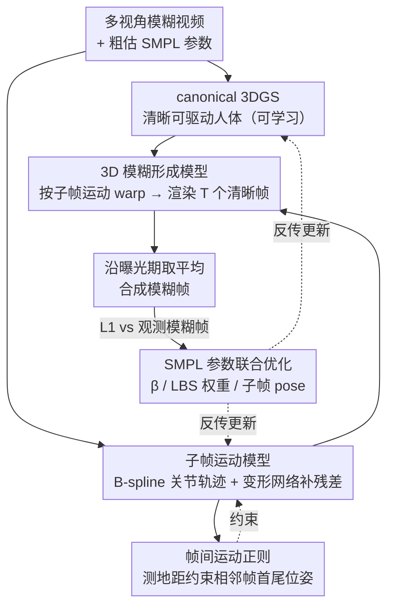

# MAD-Avatar: Motion-Aware Animatable Gaussian Avatars Deblurring

**会议**: CVPR 2026  
**arXiv**: [2411.16758](https://arxiv.org/abs/2411.16758)  
**代码**: [GitHub](https://github.com/MyNiuuu/MAD-Avatar)  
**领域**: 3D视觉 / 人体重建 / 去模糊  
**关键词**: 3D human avatar, Gaussian splatting, motion blur, SMPL, deblurring  

## 一句话总结
首次实现从模糊视频直接重建清晰可驱动3D高斯人体avatar：提出3D感知的物理模糊形成模型(将模糊分解为子帧SMPL运动+canonical 3DGS)，用B-spline插值+位姿变形网络建模子帧运动，帧间正则化解决运动方向歧义，在合成和真实数据集上大幅超越"2D去模糊+3DGS"两阶段方案(PSNR提升约2.5dB)。

## 背景与动机
3D人体avatar重建(如GauHuman)依赖清晰多视角视频输入，但实际场景中人体运动不可避免地产生运动模糊，导致：(1) 3DGS学到畸形的3D表示(模糊的歧义性使同一模糊图可对应多种运动)；(2) SMPL参数从模糊帧估计不准确。已有两阶段方案(先2D去模糊再训3DGS)不足：2D去模糊缺乏3D结构信息导致多视角不一致，反而限制3DGS重建质量。

## 核心问题
如何从多视角模糊视频中直接重建清晰、可驱动的3D人体avatar？关键困难是模糊引入的运动歧义(同一模糊效果可由多种运动产生)和SMPL初始化误差。

## 方法详解

### 整体框架

这篇论文要解决的是：输入是多视角模糊视频，外加从模糊帧粗估的一套不太准的 SMPL 参数，目标是直接重建出一个清晰、可驱动的 canonical 空间 3DGS avatar。整体怎么转？模型同时优化两件事——canonical 空间里那个清晰的 3DGS 人体，以及每一帧曝光期内人体的子帧运动轨迹。每次迭代把 canonical 3DGS 按估计的子帧运动 warp 到观测空间，渲染出 $T$ 个虚拟清晰帧，平均起来得到一张"模拟模糊帧"，再和真实观测到的模糊帧算 L1 loss。去模糊和 3D 重建因此被绑进同一个物理过程里互相约束。

### 关键设计

**1. 3D 模糊形成模型：把 2D 曝光积分搬到 3D 空间**

两阶段方案（先 2D 去模糊再训 3DGS）的根本毛病是，2D 去模糊看不到 3D 结构，去出来的多视角彼此不一致，反而拖累后续重建。这里换了个建模位置：不再在像素层面做模糊核卷积，而是把传统的曝光积分公式整体扩展到 3D，模糊帧写成 $I_{blur} = \frac{1}{T}\sum_{t} R(W(G_{canonical}, S_t), R, K)$——即把 canonical 3DGS 按子帧 SMPL 运动 $S_t$ 变形、渲染、再沿曝光期取平均。模糊形成的物理过程天然带上了 3D 结构和多视角一致性，去模糊和重建不再是两段割裂的流程。

**2. 子帧运动模型：B-spline 给骨架、变形网络补细节**

曝光期内人体到底怎么动，是模糊歧义的来源，必须显式建模。模型用两层结构刻画它：先用 $P$ 个控制节点的 B-spline 对 24 个 SMPL 关节在曝光期内的连续旋转轨迹做插值，保证刚体运动平滑；再用一个位姿变形网络 $G_{disp}$（CNN）预测每个时间步、每个关节的残差位移，补上 B-spline 表达不了的高频非刚性变化。消融显示去掉 B-spline 约束、各时间步独立优化会让运动估计变得杂乱无序，PSNR 掉 1.5dB；去掉变形网络则掉 0.25dB，说明两层缺一不可。

**3. 帧间运动正则：用视频连续性打破方向对称歧义**

同一张模糊图可以由两个对称方向的运动产生（论文图 1(c) 的问题），中间时间步看不出差别，但非中间时间步会因为方向判错而崩掉。解决办法是约束当前帧最后一个时间步的位姿，与下一帧第一个时间步的位姿在测地线距离上接近，借视频帧间的天然连续性把对称的两支拉开。消融里这一项对 $t=0.5$ 几乎无影响，却让非中间时间步回升约 1dB，正好印证方向歧义是真实瓶颈。

**4. SMPL 参数联合优化：不指望初始估计准**

从模糊帧估出来的 SMPL 本就粗糙，如果当成固定真值，误差会一路传到重建。这里把 shape $\beta$、LBS 权重（初始值加上 CNN 预测的偏移）、以及每帧的子帧 pose 全部设为可学习参数一起优化。去掉这项联合优化 PSNR 在合成/真实数据上分别掉 3.9dB 和 1.9dB，是所有消融里最致命的一项，说明方法的鲁棒性正建立在"不依赖精确初始化"之上。

### 损失函数 / 训练策略

总损失为 $L = L_1(\text{合成模糊帧}, \text{观测模糊帧}) + L_{reg}(\text{帧间位姿连续性})$。用 Adam 优化，学习率与 decay 沿用原始 3DGS 设置；输入分辨率 512×512（合成）/ 612×512（真实），单卡 RTX 4090 训练。

## 实验关键数据

### 合成数据集(ZJU-MoCap, K_blur=5)

| 方法 | PSNR↑ | SSIM↑ | LPIPS↓ |
|------|-------|-------|--------|
| GauHuman (直接用模糊帧) | 23.08 | 0.766 | 0.228 |
| BSST + GauHuman (最佳两阶段) | 23.08 | 0.770 | 0.221 |
| **Ours** | **25.55** | **0.829** | **0.148** |

### 真实数据集(360°混合曝光相机)

| 方法 | PSNR↑ | SSIM↑ | LPIPS↓ |
|------|-------|-------|--------|
| BSST + GauHuman | 25.57 | 0.807 | 0.234 |
| **Ours** | **27.01** | **0.827** | **0.167** |

### 消融实验要点
- **去掉B-spline插值(独立优化每步位姿)**: PSNR降1.5dB，因为无约束的各时间步位姿优化导致无序运动估计
- **去掉位姿变形网络**: PSNR降0.25dB，B-spline单独不足以捕获复杂运动细节
- **去掉帧间正则化**: 中间时间步(t=0.5)几乎无差别，但非中间时间步性能显著下降(PSNR降约1dB)，因为运动方向误判
- **去掉SMPL优化**: PSNR降3.9dB(合成)和1.9dB(真实)，说明从模糊帧的粗SMPL极不准确，联合优化必不可少
- **B-spline vs Linear vs Slerp插值**: 差异很小(B-spline略优)，因为位姿变形网络弥补了插值精度差异
- **对初始SMPL扰动的鲁棒性**: 即使加入较大随机扰动(ξ=0.4)，PSNR仅降0.4dB，证明方法不依赖精确初始化
- **不同模糊强度**: K_blur=5/7/9/11均大幅超越baseline，说明方法对不同程度模糊鲁棒

## 亮点 / 我学到了什么
- **"3D-aware blur formation"范式**: 不在2D做去模糊，而是在3D空间建模模糊形成过程，让去模糊和3D重建互相增强。这个思路可以迁移到其他动态3D重建任务
- **运动方向歧义的巧妙解决**: 帧间连续性正则是一个简单但关键的设计——不加它中间帧毫无差别，但非中间帧崩溃，说明方向歧义是真实存在的瓶颈
- **360°混合曝光相机系统构建**: 实际搭建了12台同步相机(4模糊+8清晰)的benchmark，对该方向有持续价值
- **iPhone Demo展示泛化性**: 从单目iPhone视频+TRAM做SMPL估计也能工作，说明方法实用性较好

## 局限与展望
- 基于SMPL，无法处理手持物体和宽松服装的运动模糊
- 在sRGB空间做平均而非线性辐射空间，高对比度区域会有物理不准确
- 无法恢复几何(法向/BRDF)，因为基于3DGS表示
- 训练开销未详细讨论(多个子帧渲染+平均可能较慢)

## 与相关工作的对比
- **vs BAD-NeRF/Deblur-NeRF**: 这些方法处理静态场景的相机运动模糊或defocus blur，不适用于动态人体的运动模糊
- **vs DyBluRF/BARD-GS**: 处理动态场景模糊但无法输出可驱动的avatar
- **vs GauHuman/3DGS-Avatar**: 清晰输入的avatar方法，遇到模糊输入严重退化

## 与我的研究方向的关联
- 3D人体重建非核心关注方向，但"3D-aware blur formation"的思路在视频理解中可能有用——通过物理建模模糊来增强对真实场景的鲁棒性

## 评分
- 新颖性: ⭐⭐⭐⭐ 首次做"模糊视频→清晰可驱动avatar"的问题设定，3D blur formation model设计优雅
- 实验充分度: ⭐⭐⭐⭐⭐ 合成+真实数据集，10+种消融，多种鲁棒性测试(扰动/blur强度/视角数/mask方法)，还有iPhone demo
- 写作质量: ⭐⭐⭐⭐ 逻辑清晰，图表信息量丰富，问题动机交代得很好
- 对我的价值: ⭐⭐⭐ 3D blur formation的方法论可借鉴，不过人体avatar方向本身非核心

<!-- RELATED:START -->

## 相关论文

- [\[CVPR 2026\] Event-Based Motion Deblurring Using Task-Oriented 3D Gaussian Event Representations](event-based_motion_deblurring_using_task-oriented_3d_gaussian_event_representati.md)
- [\[CVPR 2026\] Spatio-Temporal Difference Guided Motion Deblurring with the Complementary Vision Sensor](spatio-temporal_difference_guided_motion_deblurring_with_the_complementary_visio.md)
- [\[CVPR 2026\] Gyro-based Deep Video Deblurring](gyro-based_deep_video_deblurring.md)
- [\[CVPR 2026\] Gaussian Splatting-based Low-Rank Tensor Representation for Multi-Dimensional Image Recovery](gaussian_splatting-based_low-rank_tensor_representation_for_multi-dimensional_im.md)
- [\[CVPR 2026\] SelfHVD: Self-Supervised Handheld Video Deblurring](selfhvd_self-supervised_handheld_video_deblurring.md)

<!-- RELATED:END -->
