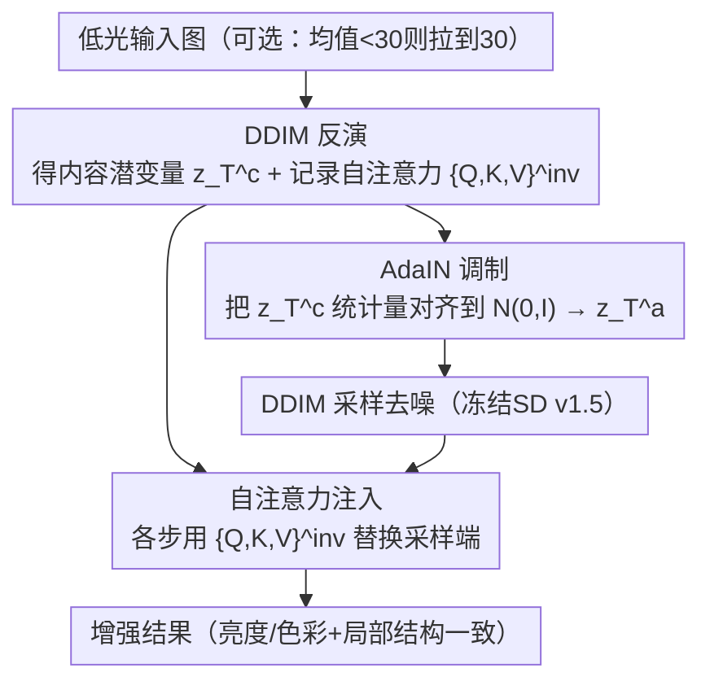

# MR. Illuminate: Zero-Shot Low-Light Image Enhancement with Diffusion Prior

**会议**: CVPR 2026  
**论文**: [CVF Open Access](https://openaccess.thecvf.com/content/CVPR2026/html/Cho_MR._Illuminate_Zero-Shot_Low-Light_Image_Enhancement_with_Diffusion_Prior_CVPR_2026_paper.html)  
**代码**: 无（论文未提供）  
**领域**: 图像恢复 / 低光增强  
**关键词**: 低光增强, 零样本, 扩散先验, AdaIN, 自注意力注入, 色彩恒常性

## 一句话总结
MR. Illuminate 用一个**完全冻结、零训练、零优化**的预训练扩散模型（SD v1.5）做低光增强：先把输入做 DDIM 反演，再用 AdaIN 把反演潜变量的统计量对齐到模型期望的标准正态分布完成全局亮度/色彩矫正（Modulate），同时把反演阶段记录的自注意力特征注入采样阶段以恢复局部结构与色彩（Refine），全程不用任何辅助损失、退化假设或调参，就能在标准低光基准上超过 SOTA、并保持同场景不同光照下的色彩恒常性。

## 研究背景与动机
**领域现状**：低光增强（LLIE）要把暗光照片复原成自然明亮的版本。方法按"何时/如何学习"分四类：A. 有监督（配对数据学图到图映射）；B. 测试时按预设损失逐图优化网络权重；C. 冻结预训练先验、但仍逐输入优化可学习组件；D（本文）直接复用冻结扩散模型内部信号引导增强。近年兴起的零样本扩散方法（GDP、TAO、FourierDiff 等）大多落在 C 类。

**现有痛点**：不管有监督、无监督还是零样本，现有方法都**依赖辅助损失函数和经验调的超参数**——这让它们在评测集上表现亮眼，却严重过拟合该数据集、泛化差。有监督方法受配对数据稀缺所限（LOLv1 约 500 对、LOLv2 约 700、LSRW 约 5000），常产生伪影；零样本的 GDP 会幻觉出不存在的结构，FourierDiff 则色彩恒常性差（同一场景不同光照下输出颜色漂移）。

**核心矛盾**：扩散模型本身在 LAION-5B 这种数十亿张明亮均衡照片上训练，**隐式地学会了把 $N(0,I)$ 映射到自然亮光图像**——这个先验本可以直接用，但 C 类方法非要再叠一层逐图优化的损失和超参，反而把"通用先验"绑死到了特定评测集上，丢掉了泛化。

**本文目标**：做一个**不需要任何优化、不需要退化假设**的零样本 LLIE，既要超 SOTA，又要保证同场景不同光照下的重建一致性（色彩恒常性）。

**切入角度**：与其外挂可训练组件 + 自定义损失，不如直接利用冻结扩散模型的**内部信号**——尤其是自注意力特征（此前多用于图像编辑），把它的用途扩展到低光增强。

**核心 idea**：用 AdaIN 把反演潜变量对齐到模型期望的输入分布来做全局光照/色彩矫正（Modulate），用反演阶段的自注意力三元组注入采样阶段来锚定局部结构/色彩（Refine），二者协同实现"免训练、免调参"的增强。

## 方法详解

### 整体框架
MR. Illuminate（读作"Mister Illuminate"，强调 **M**odulate–**R**efine 设计）在冻结的 SD v1.5（无文本提示）上运行，整个框架**不训练**，由三步串行构成：（1）**反演 Inversion**——把输入图做 DDIM 反演得到内容潜变量 $z_T^c$（$T=24$），同时记录每个 U-Net block 在反演时的自注意力特征；（2）**调制 Modulation**——用 AdaIN 把 $z_T^c$ 的通道统计量对齐到 $N(0,I)$，得到既保留输入结构、又符合模型期望输入分布的潜变量 $z_T^a$，负责全局亮度与色彩矫正；（3）**精修 Refinement**——从 $z_T^a$ 出发做 DDIM 采样去噪，并在各时间步把反演阶段存下的自注意力特征注入 up-blocks，恢复反演与调制过程中丢失的局部结构和色彩细节。预处理仅一条规则：若输入平均强度低于 30 就线性拉到 30，其余不做任何处理。同一框架不改动还能直接做自动白平衡（AWB）。

### 关键设计

**1. AdaIN 潜变量调制：把反演潜变量对齐到模型期望分布，做全局光照与色彩矫正**

针对"低光图信噪比低、光照不均导致色彩失真"以及"DDIM 反演潜变量并不符合模型推理时假设的 $N(0,I)$"这两个问题，本文在初始潜变量上做一次 AdaIN。给定反演潜变量 $z_T^c$（content，$T=24$）和一个采样自标准正态的 $z_T^s\sim N(0,I)$（style），调制后的潜变量为

$$z_T^a = \sigma(z_T^s)\left(\frac{z_T^c-\mu(z_T^c)}{\sigma(z_T^c)}\right)+\mu(z_T^s)$$

其中 $\mu(\cdot),\sigma(\cdot)$ 是通道级均值和标准差。与 PGDiff、StableSR、ReFIR 等"在退化特征与预设色彩统计/参考图之间做 AdaIN"不同，MR. Illuminate 是把潜变量对齐到模型**期望的输入分布 $N(0,I)$** 本身。这带来两个好处：（1）**结构一致性**——AdaIN 是仿射且空间均匀的变换，保留了输入的空间结构，给扩散模型一个"良好条件化"的起点去复现连贯的场景几何（相比之下直接从纯高斯噪声采样会生成与输入无关的图）；（2）**全局色彩/亮度矫正**——这个全局统计对齐把潜变量的整体亮度和色偏拉到去噪动力学所假设的分布上，从而在 $t=0$ 输出一张良好打光、又忠于输入的图。这一步对应"调制扩散噪声初始化"，是免训练却能矫正全局光照的核心。

**2. 反演自注意力注入：锚定局部结构与色彩，对抗反演累积误差**

AdaIN 解决了全局，但 DDIM 反演本身有累积误差、加上 AdaIN 调制会让局部结构/色彩漂移。本文在反演阶段记录自注意力三元组 $\{Q_t,K_t,V_t\}^{\text{inv}}$，并在采样去噪的每一步用它替换采样端的对应特征：

$$\{Q_t,K_t,V_t\}^{\text{samp}} \leftarrow \{Q_t,K_t,V_t\}^{\text{inv}}$$

其中 $Q_t,K_t,V_t\in\mathbb{R}^{N\times d}$，$N=H'W'$。作者通过 PCA 可视化发现：**反演时的自注意力准确保留了输入的局部空间对应与色彩关系，而采样时形成的自注意力会因累积反演误差逐渐偏离**；把反演时的注意力重新注入采样轨迹，相当于把采样过程"重新锚定"到输入编码的场景构图上，从而恢复 DDIM 反演 + AdaIN 丢失的局部结构和色彩。与 ReFIR（需高质量参考图做跨图注意力）、ZVRD（加额外时序注意力模块）不同，本文不引入任何额外注意力模块或参考图，纯复用输入自身的反演自注意力，因此目标是"重建一致性"（保留输入局部空间/色彩关系）而非编辑/重风格化。

**3. AdaIN 与自注意力的协同：全局打光 + 局部保结构，互不破坏**

两路信号需要协同而非互相抵消。虽然自注意力来自反演阶段、会把采样轨迹偏向输入结构，但 AdaIN 调制后的潜变量 $z_T^a$ 仍持续引导扩散过程——模型在 $z_T^a$ 条件下预测并扣除噪声，因而 AdaIN 注入的亮度与色彩平衡被保留；同时 U-Net 的 skip/residual 连接把这些光度调整传遍网络，使"AdaIN 全局归一化"与"注意力局部结构保持"协同工作。消融（图 7）进一步表明：注入特征的类型（残差/自注意力/交叉注意力）和注入的 U-Net block 位置（Down/Mid/Up）都会影响重建保真度，作者据此选定只注入自注意力、且注入 up-blocks 的配置。

### 一个完整示例
以一张同场景、不同曝光的低光输入为例走一遍：先线性把平均强度拉到 30 以上（若已够亮则不动），DDIM 反演 24 步得到 $z_T^c$ 并把每步 up-block 的自注意力 $\{Q,K,V\}^{\text{inv}}$ 存下；接着用一个随机 $z_T^s\sim N(0,I)$ 对 $z_T^c$ 做 AdaIN 得到 $z_T^a$——此时若直接去噪（图 5 "AdaIN, w/o SA"），全局亮度对了但局部细节糊；于是在去噪的每一步把存下的反演自注意力注入 up-blocks（$t=24\to19\to14\to9\to0$），可视化可见预测的原图 $\hat z_0^a$ 局部结构和色彩逐步清晰、找回被反演和调制丢掉的细节；最终在 $t=0$ 输出一张亮度均衡、忠于输入结构与色彩的增强图。由于全局矫正只依赖 $N(0,I)$ 对齐、局部矫正只依赖输入自身的注意力，同一场景不同光照的输入会收敛到一致的输出（色彩恒常性）。

## 实验关键数据

**设置**：冻结 SD v1.5 无文本提示；$T=24$；解码器换用 QuadPrior 的 VAE 解码器（自重建质量优于默认 SD 解码器）；在 LOL、LSRW、五个 Unpaired 基准（DICM/LIME/NPE/MEF/VV）上评测，配对集报 PSNR/SSIM/LPIPS，无配对集报 ILNIQE/BRISQUE/NL（均越低越好）；时间/显存/FLOPs 在 A10 上测 400×600 的 LOL 图。

### 主实验

零样本/无监督方法横向对比（LOL 与 Unpaired），本文为 D 类（无需训练数据）：

| 方法 | 类别 | LOL PSNR↑ | LOL SSIM↑ | LOL LPIPS↓ | Unpaired BRISQUE↓ | Unpaired NL↓ |
|------|------|-----------|-----------|------------|-------------------|--------------|
| GDP | Z(C) | 14.66 | 0.504 | 0.356 | 27.01 | 0.528 |
| FourierDiff | Z(C) | 16.95 | 0.604 | 0.293 | 26.57 | 1.221 |
| CoLIE | Z(B) | 14.90 | 0.499 | 0.327 | 18.97 | 0.964 |
| TAO | Z(C) | 19.18 | 0.607 | 0.390 | 42.14 | 0.384 |
| **MR. Illuminate** | **Z(D)** | **21.74** | **0.815** | **0.177** | **16.18** | **0.379** |

> NL（Naturalness）、BRISQUE、ILNIQE 均为无参考图像质量指标，越低代表越自然/失真越小。

效率（A10，400×600，分钟/GB）：

| 方法 | Time(min) | Memory(GB) | FLOPs |
|------|-----------|-----------|-------|
| GDP | 19.09 | 4.7 | – |
| TAO | 3.5 | 4.7 | 4.7e15 |
| FourierDiff | 0.82 | 7.1 | 8.5e14 |
| **MR. Illuminate** | **0.12** | 6.7 | 5.8e13 |

### 消融实验

| 配置 | 作用 | 现象 |
|------|------|------|
| 完整（AdaIN + SA 注入到 Up-blocks） | 全局矫正 + 局部精修 | 最佳保真与色彩一致 |
| w/o SA（仅 AdaIN，直接去噪 $z_T^a$） | 去掉局部精修 | 全局亮度对、局部结构/色彩糊 |
| 注入 Residual / Cross 而非 Self | 换注入特征类型 | 保真度下降（自注意力最优） |
| 仅注入 Down / Mid / Up 某一组 block | 换注入位置 | 重建保真随位置变化，Up-blocks 较优 |
| Samp（默认采样，不注入反演 SA） | 不锚定 | 几何/色彩扭曲（累积反演误差） |

### 关键发现
- **AdaIN 管全局、自注意力管局部，缺一不可**：去掉自注意力注入（w/o SA）只剩 AdaIN，全局亮度正确但局部模糊；可视化（PCA）证实反演时的自注意力比采样时的更准确地保留了输入局部结构，是对抗反演累积误差的关键。
- **零优化反而泛化更强**：有监督的 CIDNet 在训练集 LOLv1 上 PSNR=28.9 dB，换到 MIT5K 骤降到 12.0 dB；MR. Illuminate 不依赖训练数据，在多数未见数据集上泛化更好，在 Unpaired 的 BRISQUE/NL 上拿到最优。
- **又快又省**：0.12 分钟/图，远快于同为扩散先验的 GDP（19 分钟）、TAO（3.5 分钟），因为它免去了逐图优化的迭代。
- **框架零改动迁移到 AWB**：同一套 Modulate–Refine 不改任何东西就能做自动白平衡，且是已知首个适用于色彩失衡图的零样本 AWB 方法，佐证其通用性。

## 亮点与洞察
- 核心洞察是"扩散模型已隐式学会把 $N(0,I)$ 映射到亮光自然图"，于是低光增强不需要新增损失，只需把反演潜变量**对齐回这个分布**——一个 AdaIN 就完成全局打光。这种"把任务转化为分布对齐"的思路极简且优雅。
- 区分"反演时的自注意力" vs "采样时的自注意力"，并发现前者更忠实于输入、后者会随累积误差漂移——这个观察本身就有价值，可迁移到任何基于 DDIM 反演的编辑/复原任务做结构锚定。
- 全程冻结、零训练、零超参、零退化假设，把"泛化差"的根因（过拟合评测集的损失/超参）直接消除，是对当前"先验 + 逐图优化"范式（C 类）的一次反向操作。
- 一套框架同时打 LLIE 和 AWB，说明 Modulate–Refine 抓住的是"全局色彩/亮度统计 + 局部结构保持"这一通用结构，而非低光专用 trick。

## 局限与展望
- 依赖 DDIM 反演，反演本身有累积误差（论文正是用自注意力注入去补救），$T=24$ 步偏少，对极端低光/强噪声输入反演是否稳定、误差能否补回，缺乏定量分析。⚠️ 论文把 AWB 的定量/定性结果放在补充材料，正文未给数字，实际 AWB 性能需查补充。
- 在训练集分布内（如 LOLv1），有监督方法（CIDNet 28.9 dB）的 PSNR 仍高于本文（21.7 dB），即"零样本泛化"是以牺牲分布内峰值保真换来的。
- 仅在 SD v1.5 上验证，换更强/更弱的扩散 backbone 时 AdaIN 对齐和自注意力注入是否同样有效未知；解码器还专门换成 QuadPrior 的 VAE 以避免压缩失真，暗示对解码器质量有一定依赖。

## 相关工作与启发
- **vs GDP / TAO（C 类零样本）**：它们冻结扩散先验但仍逐图优化可训练组件、依赖自定义损失与退化假设，慢且对超参敏感（GDP 19 分钟、会幻觉结构）；MR. Illuminate 不优化任何东西、不设退化假设，0.12 分钟出图且泛化更好。
- **vs FourierDiff（频域优化）**：FourierDiff 把输入频率成分塞进优化目标，色彩恒常性差（同场景颜色漂移）；本文用 AdaIN 全局对齐 + 自注意力锚定，明确保证同场景一致性。
- **vs ReFIR / ZVRD（注意力引导复原）**：ReFIR 需高质量参考图做跨图注意力、ZVRD 加额外时序注意力模块；本文只复用输入自身的反演自注意力，无参考图、无额外模块，且与 AdaIN 协同同时矫正光照和色彩，这种协同是先前注意力引导框架所没有的。

## 评分
- 新颖性: ⭐⭐⭐⭐⭐ "把低光增强转化为潜变量分布对齐 + 反演自注意力注入"的免训练范式，角度新颖且自洽。
- 实验充分度: ⭐⭐⭐⭐ 横向对比广、消融把 AdaIN 与自注意力的作用拆得很清；但 AWB 定量结果藏在补充、分布内峰值保真不及有监督。
- 写作质量: ⭐⭐⭐⭐ 方法论证清晰、可视化（PCA、逐步精修）很有说服力；公式排版有 OCR 噪声。
- 价值: ⭐⭐⭐⭐⭐ 零训练零调参、又快又泛化、还能直接迁移 AWB，对实际部署很有吸引力。

<!-- RELATED:START -->

## 相关论文

- [\[CVPR 2026\] Multinex: Lightweight Low-light Image Enhancement via Multi-prior Retinex](multinex_lightweight_low-light_image_enhancement_via_multi-prior_retinex.md)
- [\[CVPR 2026\] Bi-Bridge: Bidirectional Diffusion Bridges for Low-Light Image Enhancement](bi-bridge_bidirectional_diffusion_bridges_for_low-light_image_enhancement.md)
- [\[CVPR 2026\] Zero-Shot Image Denoising via Hybrid Prior-Guided Pseudo Sample Generation](zero-shot_image_denoising_via_hybrid_prior-guided_pseudo_sample_generation.md)
- [\[CVPR 2026\] Event-Illumination Collaborative Low-light Image Enhancement with a High-resolution Real-world Dataset](event-illumination_collaborative_low-light_image_enhancement_with_a_high-resolut.md)
- [\[CVPR 2026\] Self-supervised Dynamic Heterogeneous Degradation Modeling for Unified Zero-Shot Image Restoration](self-supervised_dynamic_heterogeneous_degradation_modeling_for_unified_zero-shot.md)

<!-- RELATED:END -->
