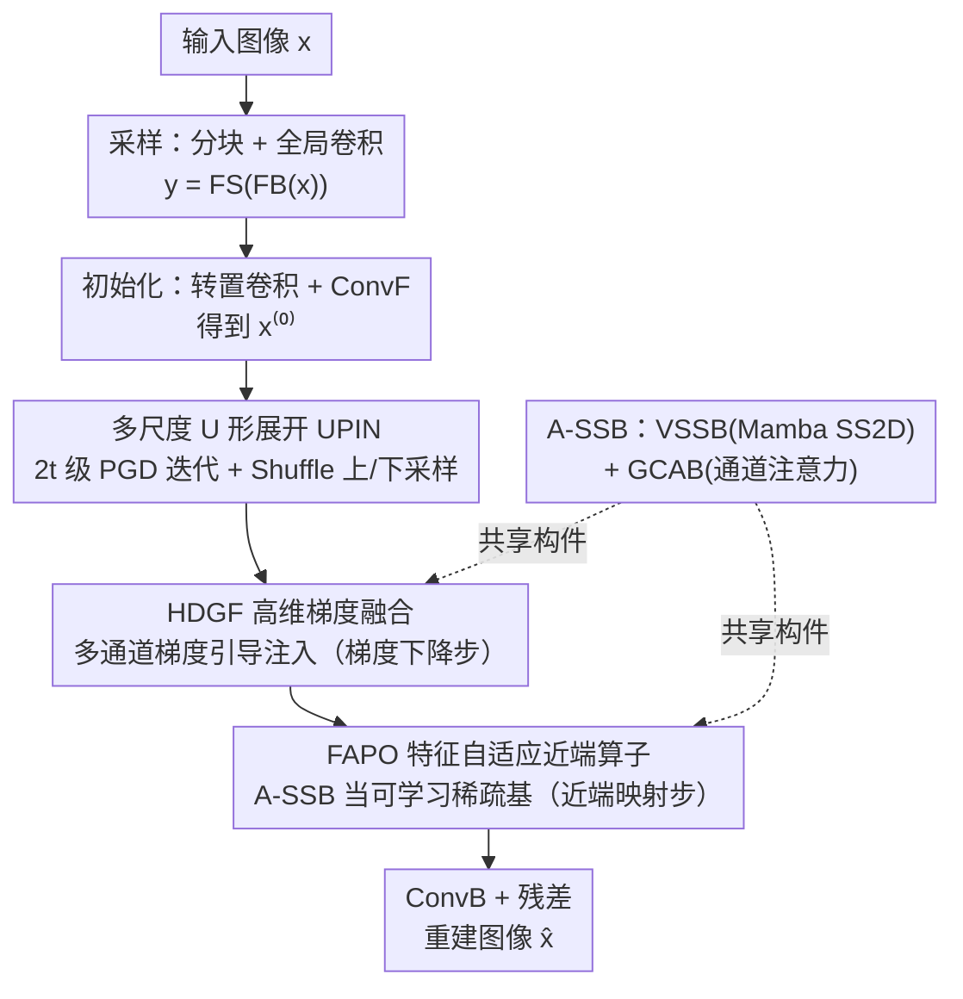

# Multi-Scale Gradient-Guided Unrolling Architecture with Adaptive Mamba for Compressive Sensing

**会议**: CVPR 2026  
**论文**: [CVF Open Access](https://openaccess.thecvf.com/content/CVPR2026/html/Yang_Multi-Scale_Gradient-Guided_Unrolling_Architecture_with_Adaptive_Mamba_for_Compressive_Sensing_CVPR_2026_paper.html)  
**代码**: https://github.com/（论文称已开源 MambaCS，具体地址⚠️以原文为准）  
**领域**: 图像恢复 / 压缩感知重建  
**关键词**: 压缩感知, 深度展开网络, Mamba, 梯度引导, 近端梯度下降

## 一句话总结
MambaCS 把经典近端梯度下降（PGD）算法在多个特征尺度上展开成一个 U 形深度网络，用定制的自适应状态空间块（A-SSB）替换传统展开网络里的卷积/Transformer 模块，并重新设计梯度注入（HDGF）与近端算子（FAPO），在多个压缩感知重建数据集上以相近参数量取得 SOTA 的 PSNR/SSIM。

## 研究背景与动机
**领域现状**：压缩感知（CS）用远低于奈奎斯特率的测量 $y=\Phi x$ 去重建信号 $x$。深度展开网络（DUN）把传统优化求解器（如 PGD、ISTA）的迭代过程"展开"成网络的逐级模块，既保留了优化算法的可解释性与数据保真，又借了深度学习的拟合能力，是目前 CS 重建的主流范式。

**现有痛点**：作者把现有 DUN 的毛病归纳为三条——① **跨阶段特征同质化**：每一级迭代模块结构僵硬、重复，提取的特征缺乏多样性；② **梯度引导信息注入低效**：传统 DUN 在图像域用单通道矩阵运算实现梯度下降步，带宽受限形成"信息瓶颈"，迭代间特征不可逆地丢失；③ **空间维度特征提取不足**：CNN 感受野局部、Transformer 计算量随分辨率二次增长，二者在"全局感受野 vs 计算效率"之间只能二选一。

**核心矛盾**：DUN 想同时要可解释性（贴着 PGD 迭代结构走）、重建质量（强特征提取）和效率（线性复杂度的全局建模），但传统模块设计让这三者互相牵制。

**本文目标**：在保持 PGD 展开可解释性的前提下，设计一个既有全局感受野、又是线性复杂度、还能把梯度引导信息稳定注入多尺度的展开架构。

**切入角度**：作者注意到 Mamba（选择性状态空间模型）能以线性复杂度建模长程依赖，正好补上 CNN/Transformer 的短板，于是把 Mamba 引入 DUN——这是首次把 Mamba 用进 CS 的深度展开。

**核心 idea**：以自定义的 A-SSB（Mamba + 通道注意力）为基本砖块，在多尺度 U 形结构里展开 PGD，并重写 PGD 的梯度步（HDGF）和近端步（FAPO），让两者都借助 A-SSB 的全局自适应感知。

## 方法详解

### 整体框架
MambaCS 由一个采样阶段 + $2t$ 个重建阶段组成（默认 $t=4$，即 8 级）。采样阶段把单通道图像分成 $B\times B$ 块（$B=128$）做无偏全局卷积得到测量值 $y$；重建阶段先用转置卷积初始化得到 $x_f$，再经卷积投影 ConvF 得到 $x^{(0)}$，然后送入一个深度为 $t$ 的 U 形 PGD 迭代网络 UPIN——它用 Pixel Shuffle / Unshuffle 做上/下采样实现多尺度，每一级恰好对应一次 PGD 迭代，含两个子模块：HDGF（对应梯度下降步 $s^{(k)}$）和 FAPO（对应近端映射 $x^{(k+1)}$）。最后经逆卷积投影 ConvB 加残差得到重建图像 $\hat{x}$。A-SSB 是贯穿 HDGF 与 FAPO 的共享构件。

### 关键设计

**1. 多尺度 U 形展开架构（UPIN）：让每级迭代看不同尺度，打破跨阶段特征同质化**

针对痛点①——传统 DUN 每级在同一分辨率上重复同质模块。MambaCS 把 $2t$ 级 PGD 迭代排成 U 形：前 $t$ 级逐级下采样（Pixel Unshuffle），后 $t$ 级逐级上采样（Pixel Shuffle）并与对称级做跳连相加。这样不同迭代级天然工作在不同特征尺度上，特征增益按"边缘纹理 → 全局结构 → 边缘纹理"的轨迹演化（作者可视化验证），而不是每级都提同一种特征。整体重建写作 $x^{(2t)}=\mathrm{UPIN}(x^{(0)})+x^{(0)}$，$\hat{x}=\mathrm{ConvB}(x^{(2t)})+x_f$，残差结构保证训练稳定。

**2. HDGF 高维梯度融合：把单通道梯度步升维成多通道引导，消除信息瓶颈**

针对痛点②——传统 DUN 直接用 $s^{(k)}=x^{(k)}-\rho^{(k)}\Phi^{\top}(\Phi x^{(k)}-y)$ 实现梯度下降，单通道矩阵运算带宽太窄。作者先把该式展开成 $s^{(k)}=x^{(k)}-\rho^{(k)}\Phi^{\top}\Phi x^{(k)}+\rho^{(k)}\Phi^{\top}y$，识别出三个关键量 $x^{(k)}$、$\Phi^{\top}\Phi x^{(k)}$、$\Phi^{\top}y$，沿通道维拼接后过一个"深度卷积(DConv) + A-SSB + Sigmoid"结构生成梯度引导信息再从 $x^{(k)}$ 中减去：

$$s^{(k)}=x^{(k)}-\rho^{(k)}\,F_{\text{grad}}\!\big(F_{\text{concat}}(x^{(k)},\,\Phi^{\top}\Phi x^{(k)},\,\Phi^{\top}y)\big),\quad F_{\text{grad}}(\cdot)=\mathrm{Sigmoid}(\text{A-SSB}(\mathrm{DConv}(\cdot))).$$

这样梯度引导在高维特征空间里被持续、稳定地注入，既保留 PGD 的数据保真语义，又避免了迭代间特征的不可逆丢失。

**3. FAPO 特征自适应近端算子：用 A-SSB 当可学习稀疏基替代固定软阈值**

针对痛点③以及传统近端步对固定正交稀疏基 $\Psi$ 的依赖。经典 PGD 近端步是 $x^{(k+1)}=\Psi^{\top}\mathrm{Soft}(\Psi s^{(k)},\theta^{(k)})$，要求 $\Psi$ 正交，实际很难满足。FAPO 把前向算子 $\Psi$ 换成 A-SSB、把逆算子 $\Psi^{\top}$ 换成 A-SSB$^{\top}$（前向算子的逆过程），中间夹一个软阈值收缩：

$$x^{(k+1)}=\text{A-SSB}^{\top}\!\big(\mathrm{Soft}(\text{A-SSB}(s^{(k)}),\theta^{(k)})\big).$$

A-SSB 提供跨空间-通道的全局自适应注意力，相当于把稀疏基做成对多尺度特征敏感的可学习版本，从而显著改善细节重建。

**4. A-SSB 自适应状态空间块：用 Mamba 同时拿全局感受野和线性复杂度**

A-SSB 是 HDGF 和 FAPO 共用的核心砖块，由两部分组成：**VSSB**（Mamba 视觉状态空间块）做空间长序列建模——双分支结构，一支经 LN→Linear→DConv→SiLU→SS2D，SS2D 用四方向扫描（左上↔右下、右上↔左下）把 2D 特征展成 4 条 1D 序列分别过状态空间方程再求和重组，另一支做门控，两支逐元素相乘后线性投影；**GCAB**（门控通道注意力块）做跨通道聚合，用 DConv 生成 Q/K/V，注意力 $\mathrm{Attention}(Q,K,V)=V\cdot\mathrm{Softmax}(K^{\top}Q/\alpha)$（$\alpha$ 为可学习缩放），再接双路 GELU 门控。VSSB 专注空间、GCAB 专注通道，二者协同让 A-SSB 以线性复杂度获得近全局的有效感受野（ERF 可视化显示即便采样核降到 32 也优于对比方法）。

### 损失函数 / 训练策略
仅用最简单的均方误差（MSE）约束重建图像与真值：$\mathcal{L}(A,W^{1\sim 2t})=\frac{1}{N}\sum_{i=1}^{N}\|\hat{x}_i-x_i\|_2^2$，其中 $W^{1\sim2t}$ 为全部可训练参数（含可学习采样矩阵 $A$）。默认 8 级、通道配置 $[32,64,128,256]$、采样核 128。

## 实验关键数据

### 主实验
在 General100、LIVE29、OST300、Set14、BSD68 等数据集、CS 率 $\tau\in\{0.01,0.04,0.10,0.25\}$ 下，MambaCS 在 PSNR/SSIM 上几乎全面超过 11 个对比方法（TransCS、DGU-Net+、OCTUF、NesTD-Net、CPP-Net 等）。下表摘录 General100 上的平均结果：

| 方法 | General100 平均 PSNR(dB) | General100 平均 SSIM |
|------|------|------|
| OCTUF (CVPR2023) | 30.67 | 0.8305 |
| NesTD-Net (TIP2024) | 30.74 | 0.8292 |
| CPP-Net (CVPR2024) | 31.17 | 0.8427 |
| **MambaCS（本文）** | **31.71** | **0.8447** |

在 General100、$\tau=0.04$ 这一设置下，MambaCS 相比 TransCS / DPC-DUN / OCTUF 分别提升约 2.39dB(8.77%) / 3.03dB(11.39%) / 1.29dB(4.55%)。视觉上 MambaCS 在低 CS 率下伪影更少、边缘细节更锐利。

### 消融实验
作者通过 Net-1～Net-8 逐项替换/移除组件（Tab.2/Tab.3），在 Set11 等数据集、$\tau=0.10$ 下评估：

| 配置 | 改动 | Set11 PSNR(dB) | 参数量(M) |
|------|------|------|------|
| **MambaCS（完整）** | — | **31.94** | 44.91 |
| Net-5 | 去掉 HDGF 中的 A-SSB | 31.40 | 41.12 |
| Net-6 | 去掉 FAPO 中的 GCAB | 31.14 | 38.43 |
| Net-7 | 去掉 FAPO 中的 VSSB | 31.22 | 40.02 |
| Net-8 | 去掉通道自适应阈值收缩(CAT) | 31.44 | 44.90 |
| Net-1 | 采样核 KS=32 | 30.27 | 18.17 |

### 关键发现
- 去掉 FAPO 中的 GCAB（Net-6）掉点最多（Set11 −0.80dB），说明通道注意力对近端映射的细节恢复贡献最大；VSSB（Net-7，−0.72dB）次之，两者印证 A-SSB"空间+通道"双路设计缺一不可。
- 采样核从 128 降到 32（Net-1）虽掉点明显，但参数量从 ~45M 降到 18M，且其 ERF 仍优于对比方法，说明 A-SSB 带来的全局感受野不强依赖大采样核。
- MambaCS 与 CPP-Net 参数量相近（~45M）却全面领先，提升来自结构设计而非单纯堆参数。

## 亮点与洞察
- **首次把 Mamba 引入 CS 深度展开**：用线性复杂度的选择性状态空间模型解决"全局感受野 vs 计算效率"的老矛盾，是可迁移到其他逆问题（MRI、快照压缩成像、高光谱）的范式。
- **把 PGD 的梯度步代数展开后再升维注入**（HDGF）：先在数学上把 $\Phi^{\top}\Phi x$、$\Phi^{\top}y$ 拆出来当显式输入通道，再交给网络融合——既不丢可解释性，又突破单通道带宽，是"保物理结构 + 加表达力"的巧思。
- **A-SSB 当可学习稀疏基**（FAPO）：把经典近端算子里需要正交的固定基 $\Psi$ 直接替换成可学习的前向/逆向 Mamba 算子，绕过正交性难以满足的工程困境。

## 局限与展望
- 参数量偏大（~45M），相比早期 DUN 不算轻量；A-SSB 在 HDGF 与 FAPO 中反复调用，实际推理速度/显存开销论文正文未充分给出（⚠️ 以原文/补充材料为准）。
- 代码地址在正文仅以"MambaCS"占位，是否完整开源需确认（⚠️ 以原文为准）。
- 评测集中在自然图像 CS 重建；论文提到 MRI、高光谱等应用，但未在这些真实医学/遥感场景上验证，跨域泛化待考。
- SS2D 四方向扫描、双 A-SSB 设计的具体复杂度-精度权衡可进一步剪裁（Net-1 已显示降采样核可大幅省参）。

## 相关工作与启发
- **vs OCTUF / CPP-Net（基于 Transformer/定制近端的 DUN）**: 它们靠交叉注意力或定制近端点模块提升细节，仍受限于 Transformer 的二次复杂度或局部建模；MambaCS 用 A-SSB 以线性复杂度拿到更大 ERF，且重写了梯度注入路径，相近参数量下 PSNR/SSIM 更高。
- **vs VMamba / FourierMamba（SSM 视觉骨干）**: 它们把 Mamba 用作通用视觉 backbone；MambaCS 把 Mamba 定制成展开网络里的状态空间砖块，并嵌进 PGD 的梯度步与近端步，是"算法展开 + SSM"的结合而非单纯换骨干。
- **vs 传统 PGD 优化求解器**: 传统方法有严格理论保证但需手调参数、计算昂贵且要求测量矩阵正交；MambaCS 保留 PGD 迭代骨架的可解释性，同时用可学习模块替换难以满足的假设（如正交稀疏基）。

## 评分
- 新颖性: ⭐⭐⭐⭐ 首次将 Mamba 引入 CS 深度展开，HDGF/FAPO 的重写有巧思，但"展开网络换骨干"的大思路有迹可循
- 实验充分度: ⭐⭐⭐⭐ 多数据集多 CS 率全面对比 + 细粒度组件消融 + ERF/特征可视化，较扎实
- 写作质量: ⭐⭐⭐⭐ 公式与物理含义对应清晰，三大痛点-设计一一对应；部分模块细节散落在图与补充材料
- 价值: ⭐⭐⭐⭐ 在 CS 重建上稳定刷新 SOTA，范式可迁移到 MRI/高光谱等逆问题

<!-- RELATED:START -->

## 相关论文

- [\[CVPR 2026\] Beyond Single Solution: Multi-Hypothesis Collaborative Deep Unfolding Network for Image Compressive Sensing](beyond_single_solution_multi-hypothesis_collaborative_deep_unfolding_network_for.md)
- [\[CVPR 2026\] DetectSCI: Toward Object-Guided ROI Reconstruction for High-Resolution Video Snapshot Compressive Imaging](detectsci_toward_object-guided_roi_reconstruction_for_high-resolution_video_snap.md)
- [\[CVPR 2026\] VEMamba: Efficient Isotropic Reconstruction of Volume Electron Microscopy with Axial-Lateral Consistent Mamba](vemamba_efficient_isotropic_reconstruction_of_volume_electron_microscopy_with_ax.md)
- [\[CVPR 2026\] Customized Fusion: A Closed-Loop Dynamic Network for Adaptive Multi-Task-Aware Infrared-Visible Image Fusion](customized_fusion_a_closed-loop_dynamic_network_for_adaptive_multi-task-aware_in.md)
- [\[ICML 2026\] Phy-CoSF: Physics-Guided Continuous Spectral Fields Reconstruction and Super-Resolution for Snapshot Compressive Imaging](../../ICML2026/image_restoration/phy-cosf_physics-guided_continuous_spectral_fields_reconstruction_and_super-reso.md)

<!-- RELATED:END -->
