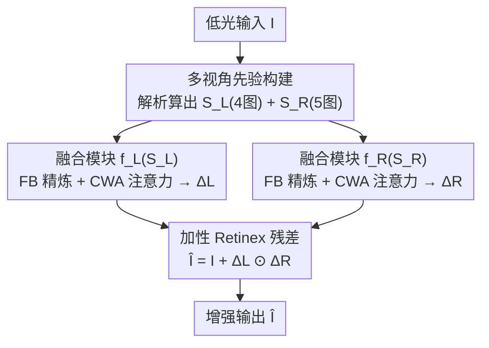

# Multinex: Lightweight Low-light Image Enhancement via Multi-prior Retinex

**会议**: CVPR 2026  
**论文**: [CVF Open Access](https://openaccess.thecvf.com/content/CVPR2026/html/Brateanu_Multinex_Lightweight_Low-light_Image_Enhancement_via_Multi-prior_Retinex_CVPR_2026_paper.html)  
**代码**: https://albrateanu.github.io/multinex （项目页）  
**领域**: 图像恢复 / 低光增强  
**关键词**: 低光增强, Retinex, 轻量化网络, 多先验融合, 边缘部署

## 一句话总结
Multinex 把 Retinex 分解从「重建目标」改写成「加性残差先验」，再用一组解析计算出的多视角亮度/色度先验喂给两个超轻量融合网络，只用 45K（甚至 0.7K）参数就在 7 个低光基准上把同量级轻量 SOTA 全面压过、逼近百万级大模型。

## 研究背景与动机

**领域现状**：低光增强（LLIE）的目标是在严重曝光不足下恢复自然亮度、色彩保真和结构细节。当前主流是深度学习方法，从早期 CNN 到 Transformer 再到扩散模型，感知质量不断刷新；其中 Retinex 系方法（Retinex-Net、KinD、RetinexFormer）因为有「照度×反射」的物理先验而成为一条重要主线，近年还衍生出在 YCbCr/YUV/HSV/HVI 等色彩空间里解耦亮度与色度的做法（CIDNet 等）。

**现有痛点**：两个具体问题并存。其一，**色彩与亮度耦合**——多数方法仍主要在 RGB 空间运算，亮度和色度纠缠在一起，Retinex 的解耦优势被削弱，容易出现红色断层、黑面噪声、训练不稳定；换到单一非 RGB 色彩空间又各有新伪影（HSV 的色相断裂、残留纠缠）。其二，**模型太重**——SOTA 普遍要几百万到几千万参数、几百 GFLOPs，无法在监控、手机、无人机这类边缘设备实时部署；而一旦把参数压到 1M 以下，增强质量就明显塌方。

**核心矛盾**：要物理可解释 + 跨场景稳定，就得把亮度/色度彻底解耦；要边缘可部署，就得极限压参数。两者通常互斥——解耦得靠学习色彩空间变换或大网络，而极限压缩又会让表示学习能力不够。

**本文目标**：在 1M 参数以下、乃至 10K 量级的极限压缩下，仍能稳定地把亮度和色度信息解耦并恢复出高质量结果。

**切入角度**：作者的观察是，现有方法都「只盯着单一色彩空间」（RGB / YUV / HVI），白白浪费了输入里大量互补的亮度与色度线索；与其让小网络去学一个色彩空间变换，不如把这些线索**用解析公式直接算出来**当先验喂进去，把表示学习的负担卸掉。

**核心 idea**：用「加性增强残差 + 多视角解析先验 + 轻量可学习融合」三件套替代「隐式 Retinex 重建 + 单色彩空间学习」——即只预测需要的曝光/色彩修正量，而不是重建整张图。

## 方法详解

### 整体框架
Multinex 输入一张低光 RGB 图 $\mathbf{I}$，输出增强图 $\hat{\mathbf{I}}$。核心是把基本 Retinex 的乘性重建 $\hat{\mathbf{I}}=L\odot R$ 改写成「原图 + 加性修正」：先用解析公式从输入算出两组先验栈——亮度引导栈 $\mathcal{S}_L$（4 张照度图）和反射引导栈 $\mathcal{S}_R$（5 张色度图）；再用两个共享结构、独立权重的轻量融合模块 $f_L,f_R$ 分别把两组栈融成亮度修正 $\Delta L$ 和色彩修正 $\Delta R$；最后按 Retinex 式相乘再叠加回原图，得到增强结果。整条链路里「保结构」由保留原图 $\mathbf{I}$ 直接保证，网络只需学一个加性残差，因而能极限压参数。

### 关键设计

**1. 加性 Retinex 增强残差（Enhancement Delta）：只修不重建**

针对「直接做 Retinex 乘性重建在低曝光下难以解出忠实分解、且代价高」的痛点，作者把 Retinex 分解当成**结构先验**而非重建输出。不再预测 $L,R$ 让它们相乘还原图像，而是估计一个加性修正场 $\Delta\mathbf{I}$ 把输入「修」成正常曝光，并按 Retinex 把它再拆成亮度修正 $\Delta L$ 和反射修正 $\Delta R$：

$$\hat{\mathbf{I}} = \mathbf{I} + \Delta\mathbf{I} = \mathbf{I} + \Delta L \odot \Delta R.$$

具体地，逐通道有 $\hat{\mathbf{I}}_i = \mathbf{I}_i + f_L(\mathbf{I},\theta_L)\odot f_{R_i}(\mathbf{I},\theta_R)$，其中 $\Delta L=f_L(\cdot)\in\mathbb{R}^{H\times W\times1}$ 三通道共享、$\Delta R=f_R(\cdot)\in\mathbb{R}^{H\times W\times3}$ 各通道独立，输出端**不加限制性激活**以鼓励灵活修正。因为原图 $\mathbf{I}$ 本身已携带纹理结构被直接保留，网络只需逼近一个加性残差，既避免色偏和细节丢失，又把「重建」难度降成「修正」难度——这是它能在轻量约束下仍有效的根因。

**2. 多视角解析先验栈：把色彩空间学习换成解析计算**

针对「单色彩空间忽略互补线索、且让小网络去学色彩变换负担太重」的痛点，作者不学色彩空间变换，而是**用经典色彩视觉理论直接算出**两组互补先验。亮度栈 $\mathcal{S}_L=[Y_{\text{Rec.709}}, Y_{v\max}, Y_{\text{lightness}}, Y_{L2}]$ 共 $K_L=4$ 张：分别是 BT.709 标准加权亮度（最贴近人眼对绿色敏感的视觉亮度）、通道最大值（高光能量代理）、HSL 明度（带轻微对比正则）、RGB 向量 L2 范数（整体能量）。反射栈 $\mathcal{S}_R=[C_b,C_r,r,g,S]$ 共 $K_R=5$ 张：YCbCr 的蓝/红色差（把色彩从全局强度里剥出来）、归一化色度比 $r=I_R/(I_R+I_G+I_B+\varepsilon)$ 与 $g$（对光照绝对尺度不变）、以及饱和度 $S=(\max-\min)/(\max+\varepsilon)$（衡量像素离灰轴多远）。选图原则是**尽量覆盖更广的物理/感知线索、同时减少图间信息重叠**。增强公式随之变为：

$$\hat{\mathbf{I}}_i = \mathbf{I}_i + f_L(\mathcal{S}_L(\mathbf{I}),\theta_L)\odot f_{R_i}(\mathcal{S}_R(\mathbf{I}),\theta_R).$$

这样网络拿到的已经是解耦好的多视角线索，表示学习负担大减，是极限压参数的前提。⚠️ 论文另配了 DIA（描述子重要性分析）和 LRA（线性重建分析）两种可视化手段验证先验互补性，细节在补充材料，正文未给完整公式，以原文为准。

**3. 双分支轻量融合网络（FB + CWA）：在极小参数下精炼并融合先验**

针对「先验栈只是原料、还需高质量融合但不能加参数」的痛点，作者用两个轻量算子搭融合模块。**融合块 FB** 负责信息精炼：$\bar{\mathbf{X}}=\text{MSEF}\circ\sigma_{\text{ReLU}}\circ\text{DSConv}\circ\text{MSEF}(\mathbf{X})$，先用 MSEF 借全局上下文逐通道校准、再用 3×3 深度可分卷积做轻量空间滤波与平滑门控、最后再过一次 MSEF 强化跨通道一致性，整体在局部与全局两个尺度上做梯度稳定的融合。**逐分量注意力 CWA** 负责整合局部与全局线索：$\mathbf{A}=\sigma\circ\text{Conv}_{1\times1}\circ\text{DWConv}(\mathbf{X})$，先用 7×7 深度卷积避免早期跨通道混合、再用零偏置的 $1\times1$ 卷积做 $C\to C'$ 通道对齐，给每个描述子生成**独立的逐分量注意力图**。完整融合模块为：

$$f(\mathcal{S})=\text{Conv}_{1\times1}\circ\text{FB}^T\big(\text{CWA}(\mathcal{S})\odot\bar{\mathcal{S}}\big),\quad \bar{\mathcal{S}}=\text{FB}^T\circ\text{Conv}_{1\times1}(\mathcal{S}).$$

末端 $1\times1$ 卷积分别用 1 个和 3 个滤波器产出 $\Delta L$ 与 $\Delta R$。两个变体由此实例化：Lightweight 用完整模块、每段 $T=3$ 个 FB；Nano 用 $T=1$ 且简化路径（只保留后段 FB 的后一个 MSEF），把参数压到 0.7K。CWA 之所以比 CBAM/MHSA/MDTA 更好，是因为它给每个解析描述子单独算注意力、保持分量独立性而非把通道混在一起。

### 损失函数 / 训练策略
采用混合损失：逐像素 MSE + 多尺度结构相似性 MS-SSIM + 感知损失的加权和（具体权重在补充材料 C.2）。两个融合网络结构相同但权重独立、操作独立。

## 实验关键数据

### 主实验
在 LOL-v1 / LOL-v2(real) / LOL-v2(syn) 三个带参考基准上，按参数量分为 heavy(>10M)、mid(1–10M)、lightweight(<1M)、micro(<10K) 四组对比（PSNR↑/SSIM↑/LPIPS↓）。Multinex 在轻量组全面领先，并逼近 mid 组最优；Multinex-Nano 在 micro 组登顶。

| 数据集 | 指标 | Multinex(45K) | LYT-Net(45K, 轻量SOTA) | CIDNet(1.88M, mid) |
|--------|------|---------------|------------------------|--------------------|
| LOLv1 | PSNR↑ | 23.19 | 22.38 | 23.81 |
| LOLv2-real | PSNR↑ | 23.04 | 21.83 | 24.11 |
| LOLv2-syn | PSNR↑ | 25.04 | 23.78 | 25.71 |
| — | Param(M)↓ | 0.0446 | 0.0449 | 1.88 |
| — | GFLOPs↓ | 2.50 | 3.49 | 7.57 |

无参考基准（MEF/LIME/DICM/NPE，NIQE↓/BRISQUE↓）上 Multinex 取得最佳整体感知质量，平均 NIQE 3.64、BRISQUE 14.33，比最强的 CIDNet 平均 NIQE 再降 0.15、BRISQUE 降 5.69，而参数 < 2.5%。下游 ExDark 低光检测中，Multinex 与 Multinex-Nano 作 YOLOv3 前置增强器分别拿到 mAP50 79.7 / **80.7**，Nano 仅 0.7K 参数却登顶。

### 消融实验
在 LOL-v1、统一 45K 配置、PSNR 指标下进行（Tab.4）：

| 配置 | PSNR | 说明 |
|------|------|------|
| $\hat{\mathbf{I}}_i=f_i(\mathbf{I}_i)$（无先验） | 14.15 | 只靠原始 RGB，最差 |
| w/ $\Delta L$ only | 20.57 | 加亮度先验，曝光恢复主力 |
| w/ $\Delta R$ only | 18.50 | 加色度先验，稳色相但弱于亮度 |
| $\Delta L\odot\Delta R$（完整） | 23.19 | 物理一致分解，最优 |
| w/o CWA & MSEF | ~20 | 去掉两个核心算子掉约 3dB |
| w/ CWA only | ~21 | 单独 CWA |
| w/ MSEF only | ~22 | 单独 MSEF |
| CWA vs CBAM/MHSA+Pool/MDTA | 23.19 vs ~20/~22/~22 | CWA 在同复杂度下注意力最佳 |

### 关键发现
- 先验是「重器」：去掉所有先验只剩 14dB，加上 $\Delta L$ 直接跳到 20dB+，说明显式亮度线索对曝光恢复贡献最大；亮度先验比色度先验更高效（20.57 vs 18.50）。
- CWA 与 MSEF 互补：前者做通道重加权、后者做局部细节增强，二者同用才上 23dB，单用都掉 1–3dB。
- 极限压缩仍稳：Nano 仅 0.7K 参数在 micro 组和下游检测里都最好，验证「解析先验 + 加性残差」在极小模型上依然奏效。

## 亮点与洞察
- **把学习负担「外包」给解析公式**：与其让 45K 小网络去学色彩空间变换，不如直接用经典色彩理论算 9 张互补先验图喂进去——这是它能在 1/40 参数下追平大模型的关键，思路可迁移到任何「先验可解析计算」的低层视觉任务。
- **「只修不重建」的残差视角**：保留原图当结构骨架、网络只学加性残差，天然防色偏和细节丢失，把重建难题降级成修正难题，对轻量化极友好。
- **CWA 的逐分量独立注意力**：针对「每张先验图语义不同」这一点，给每个描述子单独算注意力而不混通道，在更低复杂度下反超 MHSA/MDTA，是个可复用的轻量注意力设计。

## 局限与展望
- 论文主打极限轻量与感知质量（NIQE/BRISQUE 全胜），但在带参考 PSNR 上仍略逊于 mid 组大模型（如 LOLv1 23.19 vs CIDNet 23.81），即「逼近但未超越」百万级模型。
- 解析先验栈的选择（哪 4 张亮度图、哪 5 张色度图）依赖人工经验与补充材料里的实证分析，是否对所有传感器/噪声分布最优、能否自动搜索，正文未深入。⚠️ DIA/LRA 等先验验证手段的完整数学形式都在补充材料，正文只给结论。
- 多视角先验栈一旦扩到更多图，融合模块的极小参数预算可能成为瓶颈；先验数与参数量的 trade-off 值得进一步研究。

## 相关工作与启发
- **vs RetinexFormer / KinD（Retinex 重建系）**：他们显式估计照度/反射图做乘性重建，本文把 Retinex 当结构先验、改成加性残差「只修不建」，区别在于绕开了低曝光下难解的忠实分解，参数从百万级降到 45K。
- **vs CIDNet / HVI（学习色彩空间系）**：他们学一个可学习的亮度-色度解耦映射（数据依赖、训练易不稳），本文用解析公式直接算多视角先验，更稳更省；代价是带参考 PSNR 略低。
- **vs LYT-Net / ZeroDCE（同量级轻量系）**：同为 ~45K 或更小参数，LYT-Net 在 YUV 单空间做通道解耦、ZeroDCE 学逐像素曲线，本文靠多先验 + 加性残差在所有轻量基准上反超，且 Nano 把参数进一步压到 0.7K。

## 评分
- 新颖性: ⭐⭐⭐⭐ 「Retinex 当结构先验 + 解析多视角先验替代色彩空间学习」组合很巧，但各组件（残差、解析先验、轻量注意力）多有渊源。
- 实验充分度: ⭐⭐⭐⭐⭐ 7 基准 + 下游检测 + 三组消融，且按参数量分组对比公平，覆盖很全。
- 写作质量: ⭐⭐⭐⭐ 物理动机清晰、公式完整；但 DIA/LRA 等关键分析手段都甩到补充材料，正文略空。
- 价值: ⭐⭐⭐⭐⭐ 0.7K–45K 参数实时增强，对边缘部署（监控/手机/无人机）有直接实用价值。

<!-- RELATED:START -->

## 相关论文

- [\[CVPR 2026\] MR. Illuminate: Zero-Shot Low-Light Image Enhancement with Diffusion Prior](mr_illuminate_zero-shot_low-light_image_enhancement_with_diffusion_prior.md)
- [\[CVPR 2026\] Event-Illumination Collaborative Low-light Image Enhancement with a High-resolution Real-world Dataset](event-illumination_collaborative_low-light_image_enhancement_with_a_high-resolut.md)
- [\[CVPR 2026\] Bi-Bridge: Bidirectional Diffusion Bridges for Low-Light Image Enhancement](bi-bridge_bidirectional_diffusion_bridges_for_low-light_image_enhancement.md)
- [\[CVPR 2026\] VSRELL: A Simple Baseline for Video Super-Resolution and Enhancement in Low-Light Environment](vsrell_a_simple_baseline_for_video_super-resolution_and_enhancement_in_low-light.md)
- [\[CVPR 2026\] BiEvLight: Bi-level Learning of Task-Aware Event Refinement for Low-Light Image Enhancement](bievlight_bi-level_learning_of_task-aware_event_refinement_for_low-light_image_e.md)

<!-- RELATED:END -->
