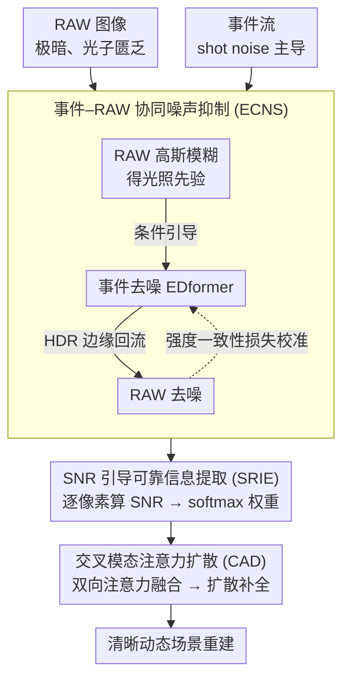

# NEC-Diff: Noise-Robust Event–RAW Complementary Diffusion for Seeing Motion in Extreme Darkness

**会议**: CVPR 2026  
**arXiv**: [2603.20005](https://arxiv.org/abs/2603.20005)  
**代码**: [https://github.com/jinghan-xu/NEC-Diff](https://github.com/jinghan-xu/NEC-Diff)  
**领域**: 图像复原 / 低光照增强  
**关键词**: 极暗成像, 事件相机, RAW图像, 协同去噪, 扩散模型

## 一句话总结

提出 NEC-Diff，一个基于扩散模型的事件-RAW 混合成像框架，利用 RAW 图像的光照先验引导事件去噪、事件的高动态范围边缘辅助图像去噪，结合双模态 SNR 引导的可靠信息提取和交叉模态注意力扩散，在极暗环境下（0.001-0.8 lux）实现高质量动态场景重建，PSNR 达 24.51 dB（REAL 数据集）。

## 研究背景与动机

1. **领域现状**：低光照图像增强方法分为 sRGB 基、RAW 基、事件基和混合方法。RAW 方法能更好建模噪声但不能解决短曝光信息丢失；事件相机高动态范围但无法恢复平滑区域强度。
2. **现有痛点**：极暗环境（<1 lux）下两个模态都受严重噪声影响——RAW 图像光子匮乏噪声极大，事件相机的 shot noise 在低光下成为主导背景活动（密度超其他噪声类型 50 倍以上）。现有混合方法要么忽略噪声（EvRAW），要么只考虑单模态 SNR（EvLight），无法有效解噪。
3. **核心矛盾**：在极低光照下，信号和噪声难以区分，简单的滤波或单一网络去噪无法同时保持弱信号和抑制噪声。
4. **本文目标** 如何从两个严重退化的模态信号中有效去噪并恢复精细场景细节？
5. **切入角度**：利用 RAW 与事件之间的物理互补性——RAW 线性响应光照可指导事件去噪，去噪后的事件提供高动态范围边缘反过来帮助图像去噪。
6. **核心 idea**：基于物理约束的跨模态协同去噪 + SNR 引导的自适应融合 + 扩散模型高保真重建。

## 方法详解

### 整体框架

NEC-Diff 要在 0.001–0.8 lux 的极暗动态场景里，从 RAW 图像和事件流这两路都被噪声严重污染的信号中重建出干净画面。它的核心判断是：与其各自硬去噪再融合，不如先让两个模态借助物理关系互相帮对方降噪，再做融合和生成。于是整条流水线分三步走——先把 RAW 与事件**协同去噪**（ECNS），再按每个像素位置的信噪比**挑出各自可靠的部分**（SRIE），最后用**交叉注意力 + 扩散模型**把两路特征融合并高保真重建（CAD）。前两步专门压噪声、定权重，第三步才负责把弱信号补成完整图像。

### 关键设计

**1. 事件–RAW 协同噪声抑制 (ECNS)：让两个模态用物理关系互相去噪**

极暗下两路都很脏：RAW 光子匮乏、噪声极大，事件相机的 shot noise 在低光下密度能超过其他噪声类型 50 倍以上，单独给任一路去噪都难分信号与噪声。ECNS 抓住的是一个被前人忽略的物理事实——事件 shot noise 的密度与光照强度正相关（论文实验验证），而 RAW 恰好线性响应光照。于是它先把 RAW 图像高斯模糊得到一张粗光照先验图，送进事件去噪网络（EDformer 架构）当条件：光照强的地方真实事件多、噪声判据放宽，光照弱的地方则更激进地压制背景活动噪声。反过来，去噪后的事件带着高动态范围边缘信息回流，帮 RAW 在弱纹理区分辨"这里是真有细节还是噪声"，避免被去噪网络抹成一片平滑。

两路互助还不够，还要保证它们去噪后物理上自洽。论文从事件成像模型推出 RAW 与事件应满足的对数关系 $\tilde{E}(t) = \frac{1}{C}\log\frac{\tilde{R}(t)}{\tilde{R}(t-\Delta t)}$（$C$ 为事件触发的对比度阈值），并据此加一条强度一致性损失把去噪结果钉在这条物理约束上：

$$\mathcal{L}_{\text{cons}} = \left\|\hat{E}(t)\cdot C - \log\frac{\hat{R}(t)+\epsilon}{\hat{R}(t-\Delta t)+\epsilon}\right\|_1$$

这条损失让"事件该在哪里跳变"和"RAW 相邻帧该有多大亮度变化"互相校准，比单纯各自去噪更稳——消融里它正是贡献最大的一块（去掉 ECNS 整体掉 3.45 dB）。

**2. SNR 引导的可靠信息提取 (SRIE)：按像素信噪比决定信谁**

去完噪也不能无脑融合，因为两个模态各有盲区：事件在纹理和运动区域信噪比高，但在平滑区几乎没信号、SNR 趋近零；RAW 在明亮区可靠，但在极暗区噪声压过信号。SRIE 用去噪前后的残差直接量化每个位置的可靠度，算出 SNR 图

$$M_{\text{SNR}} = 10\cdot\log\frac{M_{\text{in}}^2}{(M_{\text{in}}-M_{\text{den}})^2+\epsilon}$$

去噪前后差异越小，说明该处本就干净、SNR 越高。把两路 SNR 图联合处理后用 channel-wise softmax 转成空间权重 $W_{\text{img}}, W_{\text{evt}}$，逐位置分配该信谁。这比 EvLight 只用图像 SNR 引导更全面：在又暗又平滑的区域，事件 SNR 近零，此时不该盲目依赖事件，而要保留图像里那点微弱信号——双 SNR 策略正是为这类区域兜底，消融里它比仅图像 SNR 多 0.43 dB、比直接融合多 0.76 dB。

**3. 交叉模态注意力扩散 (CAD)：双向注意力融合 + 扩散补全弱信号**

有了加权后的可靠特征，CAD 负责把它们深度融合并重建。它先做双向交叉注意力——图像特征当 query 去查事件的 key/value，再反过来用事件查图像，两个方向都让一个模态用另一个模态的上下文补全自己，拼接成统一的多模态表征 $F_{\text{fused}}$。这份表征不直接回归成图像，而是作为条件喂进扩散模型 $\hat{\epsilon}_\theta = \epsilon_\theta(x_t, F_{\text{fused}}, t)$，用 50 步 DDIM 确定性采样重建。之所以用扩散而非单步回归，是因为极暗区域 SNR 太低，单步网络容易把残留噪声直接吐成结果；扩散的渐进式去噪能一步步逼近干净分布，而 $F_{\text{fused}}$ 提供的多模态条件又把生成牢牢约束在真实场景上，避免扩散自由发挥跑偏。

### 损失函数 / 训练策略

训练分两阶段：第一阶段单独训练图像和事件去噪模块，让各自先具备基本去噪能力；第二阶段才接入跨模态一致性约束做联合训练，避免两个还没收敛的模块互相误导。总损失为

$$\mathcal{L}_{\text{total}} = \mathcal{L}_{\text{rec}} + 10\cdot\mathcal{L}_{\text{grad}} + 0.5\cdot\mathcal{L}_{\text{cons}}$$

梯度项权重 10 强调边缘锐度，一致性项权重 0.5 做物理约束。用 Adam 优化、学习率 $1\times10^{-4}$、训练 50 epochs，输入裁剪 256×256；扩散前向 1000 步，单卡 RTX 4090。

## 实验关键数据

### 主实验

| 输入 | 方法 | LLRVD-simu PSNR/SSIM/LPIPS | REAL PSNR/SSIM/LPIPS |
|------|------|---------------------------|---------------------|
| sRGB | LightenDiffusion | 21.64/0.818/0.265 | 22.19/0.714/0.282 |
| RAW | BRVE | 27.58/0.817/0.137 | 21.87/0.717/0.334 |
| RAW | RID(NoiseModelling) | 26.76/0.825/0.127 | 22.72/0.729/0.258 |
| Event+sRGB | EvLight | 17.06/0.677/0.291 | 21.20/0.626/0.277 |
| **Event+RAW** | **NEC-Diff** | **27.74/0.828/0.125** | **24.51/0.742/0.201** |

### 消融实验

| 配置 | PSNR ↑ | SSIM ↑ | LPIPS ↓ |
|------|--------|--------|---------|
| 无 ECNS（仅 SRIE+CAD） | 21.06 | 0.653 | 0.278 |
| 无 SRIE（ECNS+CAD） | 23.24 | 0.698 | 0.243 |
| 无 CAD（ECNS+SRIE） | 22.53 | 0.671 | 0.265 |
| 完整模型 | **24.51** | **0.742** | **0.201** |

### 关键发现

- ECNS 贡献最大（去掉后 PSNR 降 3.45 dB），说明协同去噪是整个流程的基础
- 双 SNR 引导 vs 仅图像 SNR 引导多 0.43 dB，vs 直接融合多 0.76 dB
- 在 REAL 真实数据集上优势更明显（+1.79 dB vs 最佳 RAW 方法），因为真实噪声更复杂
- 在 0.001–0.3 lux 极暗场景中（占数据集 70%），优势尤为突出
- 事件去噪中同时使用跨模态输入和一致性损失效果最佳，单用任一均改善有限

## 亮点与洞察

- **物理驱动的跨模态去噪机制**是核心贡献：利用 RAW 光照的线性响应特性和事件 shot noise 与光照的正相关关系，建立了从物理出发的互助去噪框架。这比直接融合或后处理滤波高明很多
- **REAL 数据集**的构建很有价值——共轴成像系统 + 光学衰减模拟0.001 lux 极暗，47800 组像素对齐三元组（RAW/事件/GT），填补了事件-RAW 低光数据的空白
- **SNR 图作为融合权重**的做法简单有效，可推广到任意多模态融合场景

## 局限与展望

- 强度一致性损失中事件对比度阈值 $C$ 从数据学习，实际部署中不同事件相机阈值不同可能降低泛化性
- 扩散模型推理速度较慢（50 步 DDIM），实时应用受限
- 仅在 256×256 分辨率上训练和评测，高分辨率场景有待验证
- 未来可探索 test-time adaptation 适应不同事件相机参数

## 相关工作与启发

- **vs EvLight**: 仅用图像 SNR 引导融合，忽略了事件 SNR 在平滑暗区近零的问题。NEC-Diff 的双 SNR 策略更全面
- **vs ELEDNet/RETINEV**: 用低通滤波或 CNN 处理事件噪声，但简单滤波无法在抑噪和保细节间取平衡
- **vs EvRAW**: 关注事件-RAW 的细节和颜色恢复但忽略传感器噪声，在极暗下效果有限

## 评分

- 新颖性: ⭐⭐⭐⭐ 物理驱动的跨模态协同去噪思路新颖，但整体扩散框架与条件生成已较常见
- 实验充分度: ⭐⭐⭐⭐ 合成+真实数据集充分对比，消融清晰，但缺少更多真实场景泛化评测
- 写作质量: ⭐⭐⭐⭐ 物理建模推导清晰，图示精美，但方法描述略冗长
- 价值: ⭐⭐⭐⭐ 数据集贡献大，方法在极暗成像领域有明确应用场景

<!-- RELATED:START -->

## 相关论文

- [\[CVPR 2026\] Learning to Translate Noise for Robust Image Denoising](learning_to_translate_noise_for_robust_image_denoising.md)
- [\[CVPR 2026\] DRFusion: Degradation-Robust Fusion via Degradation-Aware Diffusion Framework](drfusion_degradation_robust_fusion_via_degradation_aware_diffusion_framework.md)
- [\[CVPR 2026\] PNG: Diffusion-Based sRGB Real Noise Generation via Prompt-Driven Noise Representation Learning](diffusion-based_srgb_real_noise_generation_via_prompt-driven_noise_representatio.md)
- [\[ECCV 2024\] EDformer: Transformer-Based Event Denoising Across Varied Noise Levels](../../ECCV2024/image_restoration/edformer_transformer-based_event_denoising_across_varied_noise_levels.md)
- [\[CVPR 2026\] RAW-Domain Degradation Models for Realistic Smartphone Super-Resolution](rawdomain_degradation_models_smartphone_sr.md)

<!-- RELATED:END -->
