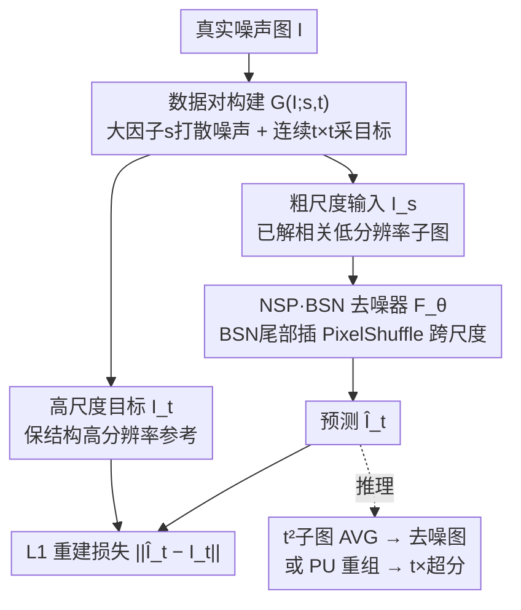

# Next-Scale Prediction: A Self-Supervised Approach for Real-World Image Denoising

**会议**: CVPR 2026  
**论文**: [CVF Open Access](https://openaccess.thecvf.com/content/CVPR2026/html/Shan_Next-Scale_Prediction_A_Self-Supervised_Approach_for_Real-World_Image_Denoising_CVPR_2026_paper.html)  
**代码**: https://github.com/XLearning-SCU/2026-CVPR-NSP  
**领域**: 图像恢复 / 自监督去噪  
**关键词**: 自监督去噪, 盲点网络, 像素重排下采样, 跨尺度训练对, 真实噪声

## 一句话总结
NSP 借鉴视觉自回归的「下一尺度预测」，让盲点网络（BSN）以大下采样因子得到的**低分辨率、已解相关**子图为输入、去预测小下采样因子对应的**高分辨率、保细节**目标，从而把「噪声解相关」和「细节保留」这对长期对抗的目标在不同尺度上各自解决，在真实去噪基准上刷到自监督 SOTA，还顺带白送一个噪声图超分能力。

## 研究背景与动机

**领域现状**：自监督真实去噪不依赖干净标签，主流范式是盲点网络（BSN）——用周围像素预测中心像素的干净值，前提是「噪声逐像素独立」。但真实噪声经过 ISP 流水线后往往有强空间相关性，BSN 会把这种相关性也学进去、用邻域噪声预测目标噪声，从而失效。为此学界引入像素重排下采样（PD）：把图像拆成许多更小的子图，用大下采样因子 $s$ 把空间相关噪声打散成近似逐像素独立，让 BSN 能干净地去除。

**现有痛点**：PD 的下采样因子 $s$ 是个两难旋钮。$s$ 大——噪声相关性确实被彻底打散，但高分辨率结构也被撕成碎片，BSN 只能从极小 patch 学习，恢复不出细微边缘纹理，有时甚至把高分结构误当噪声删掉；$s$ 小——细节回来了，可噪声的空间相关性也回来了，BSN 又消不掉这些「像信号的残留噪声」。

**核心矛盾**：噪声解相关与细节保留作用在**同一组空间依赖**上、方向相反——这是个本质的「可辨识性」难题，不是调参能解的。打散相关噪声的操作必然顺手抹掉区分真细节与噪声的高频线索。所以任何解法都必须**显式解耦**这两个目标，而不能指望同一个尺度上同时满足。

**本文目标**：找到一种策略，既保留 PD 解相关的优势，又不破坏高分辨率结构，把「去噪」和「保细节」分到各自最优的尺度上分别完成。

**切入角度**：作者从视觉自回归建模（VAR，NeurIPS 2024 最佳论文）的「下一尺度预测」得到启发——VAR 让 Transformer 从粗到细逐尺度预测。去噪能不能也搞成「粗尺度去噪、细尺度补细节」的由粗到细过程？

**核心 idea**：把去噪重构成「下一尺度预测」（NSP）——BSN 以大 PD 因子得到的低分辨率子图为输入，去预测小 PD 因子对应的高分辨率目标；低尺度负责噪声解相关、高尺度负责细节保留，二者天然解耦。

## 方法详解

### 整体框架
NSP 建立在 PD+BSN 范式上，但把去噪从「同尺度预测」改成「跨尺度预测」。给定真实噪声图 $\mathbf{I}\in\mathbb{R}^{C\times H\times W}$，先用「数据对构建」算子 $\mathcal{G}$ 造出跨尺度训练对 $(\mathbf{I}_s,\mathbf{I}_t)=\mathcal{G}(\mathbf{I};s,t)$：$s$ 是从原图到子图的 PD 因子（取大，把噪声打散），$\mathbf{I}_s$ 是粗尺度、已解相关的输入；$t$ 是子图到目标的相对尺度（取小），$\mathbf{I}_t$ 是高尺度、保结构的参考。BSN $\mathcal{F}_\theta$ 学习从 $\mathbf{I}_s$ 预测 $\mathbf{I}_t$，用 $\ell_1$ 重建损失监督。因为输入和目标都从同一张噪声图采出，这构成一个**自监督闭环**。推理时对测试图按因子 $t$ 做 PD 拆成 $t^2$ 个子图，逐个过 BSN 再求平均得到去噪结果；若改用像素重排上采样（PU）重组，则免训练地得到 $t\times$ 超分图像。

### 关键设计

**1. 下一尺度预测范式：把两个对抗目标拆到两个尺度**

针对「同尺度上噪声解相关与细节保留不可兼得」这一根本矛盾，NSP 把去噪从同尺度重构成跨尺度。形式上 BSN 学 $\hat{\mathbf{I}}_t=\mathcal{F}_\theta(\mathbf{I}_s)$，目标函数 $\mathcal{L}(\theta)=\|\hat{\mathbf{I}}_t-\mathbf{I}_t\|_1$，整个流程是自监督闭环 $\mathbf{I}\xrightarrow{\mathcal{G}}(\mathbf{I}_s,\mathbf{I}_t)\xrightarrow{\mathcal{F}_\theta}(\hat{\mathbf{I}}_t,\mathbf{I}_t)\xrightarrow{\mathcal{L}}\text{更新}\theta$。关键在于：输入用大因子 $s$ 取——此时噪声已被打散到近似逐像素独立，BSN 在这个**粗尺度**干净地去噪；目标用小因子 $t$ 对应的高尺度——此处空间结构和细节被大量保留，BSN 在这个**细尺度**学习恢复细节。一个粗到细的层级把「在最优尺度去噪」和「在最优尺度补细节」各自安排好，不再让二者在同一空间依赖上互相拉扯。这正是它消除 PD+BSN 棋盘格伪影、恢复出更多细节的根因。

**2. 跨尺度数据对构建：阻断跨尺度噪声相关 + 保住相对位置**

针对「构造的训练对若让 BSN 仍能访问相关噪声、或破坏像素相对排布，就会失效」的痛点，作者立了三条原则——跨尺度阻断噪声相关像素、保持结构一致性、用随机采样覆盖多样噪声/结构——并据此设计构造流程。先把噪声图切成 $s\times s$ 不重叠 patch $\{\mathbf{P}_{i,j}\}$；在每个 patch 内随机采 $t\times t$ 个像素拼成高尺度目标 $\mathbf{L}_{i,j}=\text{Sample}(\mathbf{P}_{i,j};t)\in\mathbb{R}^{C\times t\times t}$，剩下的 $(s^2-t^2)$ 个像素被分配到 $(s^2-t^2)$ 个子图、每个子图对应一个像素位；最后每个子图都和同一个目标配对成训练对 $\{(\mathbf{I}_{i,j}^{(k)},\mathbf{L}_{i,j})\}$。这种一对一随机分配把**噪声相关的邻接像素拆到不同子图**，从而跨尺度阻断噪声相关——BSN 拿解相关子图去预测由不同像素组成的高尺度目标，无法靠残留相关性作弊。

采目标像素的策略很讲究：作者比了「纯随机 / 行优先排序 / 行列交叉 / 连续 t×t patch」四种（Fig.3），发现**保留像素相对空间排布**最关键——纯随机丢了相对位置最差，连续 patch 完美保位故作默认选择（可产生 $(s-t+1)^2$ 个可能目标）。此外目标数 $n\in[1,\lfloor s^2/t^2\rfloor]$ 是个超参，单图可造 $n\cdot(s^2-n\cdot t^2)$ 个训练对，是个关于 $n$ 的二次函数 $-t^2 n^2+s^2 n$，$n$ 越大对越多但更耗显存。

**3. 带像素重排的 BSN 去噪器：让盲点网络真正改变尺度**

针对「原版 BSN 只在同尺度运算、无法输出更高尺度」的痛点，作者在 BSN 尾部、靠近 $1\times1$ 卷积块之间插入一个像素重排（PixelShuffle）层来完成尺度变换，并**保持盲点性质**（插在末端 $1\times1$ 卷积之间不会破坏盲点感受野约束）。框架对两类骨架都适配：CNN 系的 DBSN 和 Transformer 系的 TBSN，分别记为 NSP(DBSN) 与 NSP(TBSN)。这一点改动很小却是范式落地的关键——它让 BSN 从「同尺度像素预测器」变成「跨尺度细节预测器」，使第 1 条的下一尺度预测在网络结构上可实现。

### 一个完整示例
以论文设定 $s=5, t=2, n=2$ 走一遍：取一张噪声图，切成 $5\times5=25$ 像素的 patch；每个 patch 内用连续策略采一个 $2\times2$ 块（4 像素）当目标 #1，再在剩余像素里采另一个 $2\times2$ 当目标 #2（$n=2$）；剩下 $25-2\times4=17$ 个像素各自分到 17 个子图。于是该 patch 产出 $n\cdot(s^2-n t^2)=2\times17=34$ 个训练对（与 Tab.3 中 $n=2$ 的 34 对吻合）。训练时 BSN 拿这些 $1/5$ 尺度、已解相关的子图，去预测 $1/(s/t)=2/5$ 尺度、保结构的 $2\times2$ 目标——在粗尺度去噪、在细尺度补细节。推理时对测试图按 $t=2$ 做 PD 拆 4 个子图、逐个去噪后 AVG 得去噪图；若改用 PU 重组就得到 $2\times$ 超分结果。

### 损失函数 / 训练策略
损失为 $\ell_1$ 重建 $\|\hat{\mathbf{I}}_t-\mathbf{I}_t\|_1$。默认 $s=5, t=2$，patch size 160×160，batch 16，训练 750 epoch（每 epoch 400 iter），学习率 1e-4，Adam 默认参数；在 SIDD Medium 的 320 张真实噪声图上训练。

## 实验关键数据

### 主实验
在 SIDD Validation / SIDD Benchmark / DND 三个真实噪声基准上对比（PSNR/SSIM）。NSP 几乎在所有自监督方法里取得最佳，仅 DND 的 PSNR 比 TBSN 低 0.03dB。

| 方法 | 类型 | #Param | SIDD Validation | DND |
|------|------|--------|-----------------|-----|
| AP-BSN | 自监督 | 3.66M | 34.46/0.8296 | 37.46/0.9244 |
| SDAP | 自监督 | 3.66M | 36.58/0.8630 | 37.71/0.9278 |
| TBSN | 自监督 | 12.74M | 36.59/0.8574 | 37.90/0.9288 |
| **NSP(DBSN)** | 自监督 | 3.75M | **37.02/0.8865** | 37.80/0.9319 |
| **NSP(TBSN)** | 自监督 | 12.77M | **37.12/0.8853** | 37.87/0.9342 |

同骨架同量级下，NSP(DBSN) 在 SIDD Validation 上比 SDAP 高 0.44dB/0.0235；NSP(TBSN) 也胜过 TBSN。NSP(DBSN) 还以至少 1.66dB 的 PSNR 优势压过 DnCNN、TNRD、CBDNet、PDD、GCBD、C2N 等多个监督/伪监督方法。定性上，AP-BSN/SDAP/TBSN 会产生棋盘格伪影，而 NSP 因为有高尺度目标监督、恢复出更多细节。

### 消融实验
作者分析了目标构建策略、目标数 $n$、上采样因子 $t$ 三项（SIDD Validation，PSNR/SSIM）：

| 设置 | 配置 | PSNR/SSIM | 结论 |
|------|------|-----------|------|
| 目标策略($n{=}1$) | 纯随机 | 36.77/0.8835 | 丢相对位置，最差 |
| 目标策略($n{=}1$) | 行优先排序 | 36.91/0.8835 | 部分恢复相对位置 |
| 目标策略($n{=}1$) | 行列交叉 | 37.01/0.8854 | 完美保位 |
| 目标策略($n{=}1$) | 连续 t×t（默认） | 37.02/0.8865 | 完美保位，最优 |
| 目标数 | $n{=}1\to2$（连续） | 36.77→37.11 | 对数从 21→34，涨点 |
| 上采样因子 | $t{=}1/2/4$（连续） | 34.12 / 37.02 / 36.46 | $t{=}2$ 最佳 |

### 关键发现
- **保住相对像素位置是命门**：纯随机选目标最差，连续/交叉策略完美保位才最好——相对位置编码了图像结构信息，是高尺度目标能监督细节恢复的前提。
- **训练对数量越多越好**：各策略最优解都出现在对数 >30 时；$n$ 从 1 增到 2 一致涨点，但更大 $n$ 更耗显存，是质量-显存 trade-off。
- **尺度因子有甜点**：$t=2$ 显著优于 $t=1$（34dB→37dB）和 $t=4$（36.46dB），太小没解相关、太大撕碎结构。
- **白送超分**：把 AVG 换成 PU 重组即得 $t\times$ 噪声图超分，NSP(DBSN) 在 SIDD 超分上超过所有「SDAP+SR」两阶段方法，且参数更少。

## 亮点与洞察
- **把生成范式迁到 low-level 恢复**：从 VAR 的「下一尺度预测」借来「粗到细」骨架，恰好对上去噪里「粗尺度去噪 / 细尺度补细节」的解耦需求，是一次漂亮的跨领域类比。
- **一个小改动撬动整个范式**：只在 BSN 尾部插一个 PixelShuffle 层就把「同尺度预测器」改成「跨尺度预测器」，且保住盲点性质——改动极小、落地极轻。
- **去噪与超分一体**：因为模型本就在预测更高分辨率版本，免训练免改结构就同时具备去噪 + 超分，这是范式自带的副产品而非额外设计。

## 局限与展望
- 仅在合成自然噪声→真实 ISP 噪声的 SIDD/DND 上验证，对其他模态（医学/低光/科学成像）的相关噪声是否同样奏效未知。
- 默认超参 $s=5,t=2,n=2$ 是在 SIDD 上经验调出的；甜点位置可能随噪声统计和分辨率变化，需重新搜索。
- 推理需对 $t^2$ 个子图逐个前向再平均，相比单次前向有额外开销；$n$ 大时训练显存压力明显。
- ⚠️ 论文方法节多处公式在缓存里是 LaTeX 源码（如 $\mathcal{L}(\theta)=\|\hat{\mathbf{I}}_t-\mathbf{I}_t\|_1$、子图数量计数式），此处按语义转述，精确符号以原文为准。

## 相关工作与启发
- **vs AP-BSN / SDAP（PD+BSN 系）**：他们都在**同一尺度**用 PD 打散噪声再让 BSN 去噪，无法解决「打散噪声=撕碎细节」的内在冲突，会出棋盘格；NSP 把输入/目标分到两个尺度，同骨架同量级下 SIDD 涨 0.44dB 并去掉伪影。
- **vs TBSN（Transformer BSN）**：TBSN 靠掩码注意力在同尺度捕获长程依赖，NSP 直接把它当骨架包进跨尺度预测（NSP(TBSN)），在其基础上进一步涨点。
- **vs VAR（视觉自回归生成）**：VAR 用下一尺度预测做图像生成，NSP 借其「由粗到细」思想但用途完全不同——不是生成而是恢复，且把「尺度」对应到「噪声解相关程度 vs 细节保留程度」。
- **vs 两阶段「SDAP+SR」超分**：他们先去噪再超分、易累积伪影，NSP 一个模型同时做、参数更少且边缘更清晰。

## 评分
- 新颖性: ⭐⭐⭐⭐⭐ 把「下一尺度预测」引入自监督去噪、用尺度解耦两个对抗目标，是个干净而有洞察的新范式。
- 实验充分度: ⭐⭐⭐⭐ 三基准 + 双骨架 + 三项消融 + 超分副产物，较充分；但训练数据仅 SIDD Medium 一套。
- 写作质量: ⭐⭐⭐⭐⭐ 把 PD 的两难讲得透彻，矛盾→动机→方法逻辑链清晰，图示到位。
- 价值: ⭐⭐⭐⭐ 真实去噪自监督 SOTA + 免训练超分，实用且有迁移潜力。

<!-- RELATED:START -->

## 相关论文

- [\[CVPR 2026\] TM-BSN: Triangular-Masked Blind-Spot Network for Real-World Self-Supervised Image Denoising](tm-bsn_triangular-masked_blind-spot_network_for_real-world_self-supervised_image.md)
- [\[CVPR 2026\] Convexity-Aware Noise Calibration: A Self-Supervised Framework for Noise-Level-Unknown Image Denoising](convexity-aware_noise_calibration_a_self-supervised_framework_for_noise-level-un.md)
- [\[CVPR 2026\] LF-BVN: Blind-View Network for Self-Supervised Light Field Denoising](lf-bvn_blind-view_network_for_self-supervised_light_field_denoising.md)
- [\[ECCV 2024\] Asymmetric Mask Scheme for Self-supervised Real Image Denoising](../../ECCV2024/image_restoration/asymmetric_mask_scheme_for_self-supervised_real_image_denoising.md)
- [\[CVPR 2026\] SelfHVD: Self-Supervised Handheld Video Deblurring](selfhvd_self-supervised_handheld_video_deblurring.md)

<!-- RELATED:END -->
