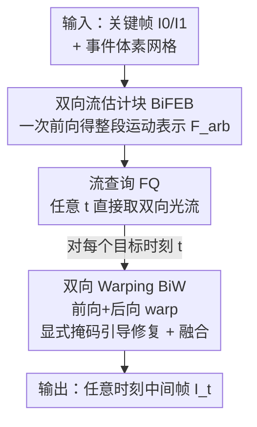

# One-Shot Flow, Any-Time Frame: A Bidirectional Warping Framework for Event-Based Video Frame Interpolation

**会议**: CVPR 2026  
**论文**: [CVF Open Access](https://openaccess.thecvf.com/content/CVPR2026/html/Fu_One-Shot_Flow_Any-Time_Frame_A_Bidirectional_Warping_Framework_for_Event-Based_CVPR_2026_paper.html)  
**代码**: https://github.com/Sudadaaaa/OF-AF （有）  
**领域**: 视频插帧 / 事件相机 / 图像恢复  
**关键词**: 事件相机、视频插帧、光流、前向/后向 warping、任意时刻插帧

## 一句话总结
针对事件相机视频插帧（E-VFI）中「前向 warping 快但有空洞、后向 warping 质量高但每帧都要重算」的两难，本文提出「One-Shot Flow, Any-Time Frame」：用一次前向计算得到覆盖整段时间的双向运动表示，任意时刻的光流可直接查询，再用带显式修复掩码的双向 warping 融合两种方向的优势，在合成与真实数据集上同时刷新了重建质量与推理效率（GOPRO Skip 15 PSNR 36.90，127 帧插值显存仅 7.27GB 而 TLXNet 直接 OOM）。

## 研究背景与动机
**领域现状**：视频插帧（VFI）的主流是基于光流的方法——估计关键帧之间的运动，再把已有像素 warp 到中间时刻合成新帧。它又分两条路：前向（forward）方法只估一次 $I_0\rightarrow I_1$ 的光流，再按 $t$ 线性缩放即可生成任意多帧，速度快；后向（backward）方法对每个目标帧反向采样 $I_1\rightarrow I_0$，能保证每个目标像素都有来源，质量高。事件相机以微秒级精度记录逐像素亮度变化，提供了关键帧之间稠密、连续的运动线索，催生了 Event-based VFI（E-VFI）。

**现有痛点**：前向方法的线性运动假设撑不住复杂运动，而且 warp 后常有区域没被任何源像素覆盖，留下空洞（hole），画质退化；后向方法虽然像素全覆盖、质量好，但要为**每一个**插值帧单独预测一次光流，插帧越多算力越爆。现有 E-VFI 即便引入事件、即便用迭代策略复用部分计算，本质上还是建立在后向 warping 之上——迭代法的中间变量随帧数线性膨胀，内存开销急剧上升（实验里 TLXNet 插 63 帧就 OOM）。

**核心矛盾**：效率和质量之间存在结构性的 trade-off——一次估流（前向）省算力却画质差，逐帧估流（后向）画质好却算力炸。没有方法真正把两者统一。

**本文目标**：让一次运动估计就能服务任意数量、任意时刻的插帧，同时既不丢质量（修掉空洞）也不爆内存。

**切入角度**：作者的两个关键观察——(1) 前向流的线性假设会累积误差，但稠密事件流提供了连续、非线性的运动线索，可以纠正它；(2) 前向 warp 产生的空洞，恰好能借后向流的信息填补。

**核心 idea**：把整段时间区间的双向运动**一次性**编码成一个「整体运动轨迹表示」$F_{arb}$，任意时刻 $t$ 的双向光流按需查询（不再逐帧重算），最后用一个带显式修复掩码的双向 warping 把前向、后向两种 warp 的长处融到一起。

## 方法详解

### 整体框架
输入是两张关键帧 $I_0$、$I_1$ 加上它们之间的事件流，输出是任意数量、任意时刻 $t\in(0,1)$ 的中间帧。整个流程分两大阶段：**双向流估计**和**双向 warping**。原始事件先被处理成体素网格（voxel grid），再用两个独立特征提取器分别从关键帧和体素网格抽 1/4 尺度特征。

第一阶段，Bidirectional Flow Estimation Block（BiFEB）把关键帧特征和事件特征联合处理，**只跑一次**就产出覆盖整段时间的双向光流表示 $F_{arb}$——无论后面要插多少帧，这一步成本固定。第二阶段，给定目标时刻 $t$，Flow Query（FQ）模块从 $F_{arb}$ 里瞬时取出该时刻的两组双向光流 $(F_{0\rightarrow t}, F_{t\rightarrow 0})$ 和 $(F_{1\rightarrow t}, F_{t\rightarrow 1})$；Bidirectional Warping（BiW）模块用这些流做前向+后向 warp，并生成显式修复掩码引导网络修补，最后融合成高质量中间帧。

### 关键设计

**1. BiFEB：把整段运动切成 n 个短时段，用事件估出一次到位的非线性双向光流**

前向方法之所以快，是因为只估一次光流再线性外推；但它假设关键帧之间运动是线性匀速的，遇到曲线运动或变速运动就估不准。BiFEB 的做法是「一次估流」但**不**用线性假设：它把物体在整段时间上的运动划成 $n$ 个连续时段（无论最终要插多少帧 $N$，$n$ 都固定，实验取 $n=16$），每个时段只用落在该段内的事件去估这一小段的局部光流。这背后是一个合理的运动假设——在**极短**的时间间隔里，物体运动可以近似为线性匀速。把整段曲线运动拆成许多段短直线，就能逼近真实的非线性轨迹。

具体地，处理第 $t$ 个时段时，BiFEB 先把当前事件特征 $E_t$ 与上一段传来的上下文特征 $\theta_{t-1}$、运动信息 $V_{t-1}$ 聚合，更新出 $\theta_t$、$V_t$，再从关键帧 $I_0$ 出发估双向光流：

$$\theta^0_t = \mathrm{RES}(\theta^0_{t-1}, E_t),\quad V^0_t = \mathrm{RES}(V^0_{t-1}, E_t, \theta^0_t)$$
$$F_{0\rightarrow t} = \mathrm{FFE}(V^0_t, \theta^0_t),\quad F_{t\rightarrow 0} = \mathrm{BFE}(V^0_t, \theta^0_t, D^0_{t-1}, F_{t-1\rightarrow 0})$$

其中 $\mathrm{RES}$ 是残差块，前向流估计器 FFE 用一个 GRU 递归地估 $F_{0\rightarrow t}$，后向流估计器 BFE 估 $F_{t\rightarrow 0}$。把事件**逆序**再走一遍、从 $I_1$ 出发，就能得到 $F_{1\rightarrow t}$ 和 $F_{t\rightarrow 1}$。所有时段串完，就得到了覆盖任意时刻的双向流表示 $F_{arb}$。它兼具前向方法的「一次计算」效率和事件带来的非线性精度——消融里 $n$ 从 4→8→16，PSNR 从 29.75→35.24→36.96 一路爬升，正说明切得越细、非线性逼近越准。

**2. Flow Query：从整段表示里按目标时刻线性插值取流，把「估流」降成「查表」**

有了 $F_{arb}$，任意时刻 $t$ 的光流就不必再重新估计，而是**查**出来。FQ 先定位 $t$ 落在哪个时段——确定该时段的起点 $t_l$ 和终点 $t_r$，从 $F_{arb}$ 和上下文 $\theta$ 里取出 $t_l$、$t_r$ 处的双向光流与上下文特征：

$$F_{0\rightarrow t_l}, F_{t_l\rightarrow t_r} = Q(F_{arb}, 0\rightarrow t),\quad \theta^0_{t_l}, \theta^0_{t_r} = Q(\theta, 0, t)$$

然后在该时段内按相对位置 $\lambda = \dfrac{t - t_l}{t_r - t_l}$ 做线性混合得到最终的流和上下文：

$$F_{0\rightarrow t} = F_{0\rightarrow t_l} + \lambda \cdot F_{t_l\rightarrow t_r},\quad F_{t\rightarrow 0} = (1-\lambda)\cdot F_{t_r\rightarrow t_l} + F_{t_l\rightarrow 0}$$
$$\theta^0_t = (1-\lambda)\cdot\theta^0_{t_l} + \lambda\cdot\theta^0_{t_r}$$

关键在于：线性插值只发生在**一个极短时段内部**，而段与段之间的非线性早已被 BiFEB 编码进 $F_{arb}$，所以查询既廉价又不损非线性精度。这正是「一次估流、任意时刻、任意帧数」得以成立的地方——后向方法做不到任意时刻（如 $t=0.51$、$t=0.88$）的连续插值，而本文可以无限细分。

**3. Bidirectional Warping：用显式空洞/差异掩码告诉网络"该修哪里"，再加权融合双向结果**

光流不可能完美，warp 出的中间帧总有瑕疵。以往做法是把 warp 后的帧直接丢进一个 Refinement Network，指望网络**隐式**地自己找出错误区域去修——但「哪里错了」对网络是个难题。BiW 的核心是把这件事**显式化**：先分别用 $F_{0\rightarrow t}$、$F_{t\rightarrow 0}$ 做前向 warp 得 $I^f_t$、后向 warp 得 $I^b_t$，然后算两张掩码——空洞掩码 $R^0_h = \mathrm{where}(I^f_t = 0)$（前向 warp 没覆盖到的洞）和差异掩码 $R^0_d = \mathrm{where}(|I^f_t - I^b_t| > Y)$（前后向结果差异大、$Y$ 为阈值的可疑区）：

$$R^0, I^0_t = \mathrm{MG}(R^0_h, R^0_d, \theta^0_t, \theta^1_t)$$

由于空洞往往就是遮挡区、后向 warp 在这些区域同样容易出错，作者选择**不去修前向图的空洞**，而是拿这两张掩码去**纠正后向 warp 图 $I^b_t$**：掩码引导网络 MG 先用 $R^0_h$ 引导 Reference 块从 $\theta^0_t$、$\theta^1_t$ 的对应区域抽参考信息（并更新 $R^0_h$，因为流不准会让 $R^0_h$ 本身有误），再把 $R^0_h$ 与 $R^0_d$ 相加得修复掩码 $R^0$、与 $I^b_t$ 相乘锁定待修像素，结合参考信息给出最终预测。注意 $R^0_d$ **不**送入 Reference 块——因为差异区里 $I^b_t$ 未必是错的，目的只是让网络多看一眼这些区域。

从 $I_1$ 一侧同样跑一遍得到 $I^1_t$ 和掩码 $R^1$，最后按时间距离 + 可信度融合：

$$M = \mathrm{softmax}\big((1-R^0)\cdot(1-t),\ (1-R^1)\cdot t\big),\quad I_t = I^0_t\cdot M^0 + I^1_t\cdot M^1$$

直觉很清楚：$t$ 越小越靠近 $I_0$，就给 $I^0_t$ 更大权重；同时用 $1-R^0$、$1-R^1$ 压低需要修复区域的权重——没问题的地方更值得信。消融里去掉 $R_h$（变体 F）PSNR 从 36.96 掉到 36.01，去掉 $R_d$（变体 G）掉到 36.74，证明两张显式掩码都在起作用。

### 损失函数 / 训练策略
模型在 GOPRO 上端到端训练，用 L1 + LPIPS 损失。20 个 epoch，Adam 优化器，学习率从 $10^{-4}$ 余弦退火到 $10^{-6}$，图像与事件随机裁到 $256\times256$，BiFEB 取 $n=16$ 保证时段足够短。事件由 V2E 从视频合成。全部实验在单张 RTX 3090 上完成。

## 实验关键数据

### 主实验
合成数据集（GOPRO + SNU-FILM），本文在所有设置下都拿到最优（F&B 指前后向融合）：

| 数据集 / 设置 | 指标 | 本文 | 次优(TimeTracker*) | 说明 |
|--------------|------|------|--------------------|------|
| GOPRO Skip 7 | PSNR | **37.66** | 37.13 | +0.53 |
| GOPRO Skip 15 | PSNR | **36.90** | 36.54 | +0.36，多帧插值优势更明显 |
| SNU-FILM hard | PSNR | **38.32** | 37.92 | +0.40 |
| SNU-FILM extreme | PSNR | **36.96** | 36.47 | +0.49，极端运动下领先扩大 |

真实数据集（BS-ERGB + HS-ERGB）上，HS-ERGB 全设置最优，BS-ERGB 进前二：

| 数据集 / 设置 | 指标 | 本文 | 次优 | 说明 |
|--------------|------|------|------|------|
| HS-ERGB Skip 5 | PSNR | **34.63** | 33.59 | +1.04，大幅领先 |
| HS-ERGB Skip 7 | PSNR | **34.19** | 32.68 | +1.51，越难差距越大 |
| BS-ERGB Skip 1 | PSNR | 29.76 | 29.85 | 第二，略低于 TimeTracker* |
| BS-ERGB Skip 3 | SSIM | **0.815** | 0.807 | SSIM 反超 |

计算成本（GOPRO，插不同帧数）——本文的核心卖点：

| 方法 | 类型 | 127 帧 显存 | 127 帧 MACs/f | 127 帧 Time/f |
|------|------|------------|---------------|---------------|
| TimeLens | 后向 | 1.93GB | 1535.28G | 1.126s |
| CBM-Net | 后向 | 10.77GB | 3732.99G | 2.959s |
| TLXNet | 后向 | **OOM(>24GB)** | - | - |
| 本文 | F&B | **7.27GB** | **665.35G** | **0.108s** |

关键在于本文成本随帧数**摊薄**：只估一次流，插的帧越多，每帧均摊成本越低（31→127 帧，MACs/f 从 887→665 下降）；而后向方法逐帧估流，每帧成本基本恒定，TLXNet 靠堆显存换速度直接在 63 帧就 OOM。

### 消融实验
| 变体 | 流估计器 | 插值方式 | PSNR | SSIM |
|------|---------|---------|------|------|
| A | RAFT+TimeLens | BiW | 36.27 | 0.962 |
| B | BiFEB (n=4) | BiW | 29.75 | 0.892 |
| C | BiFEB (n=8) | BiW | 35.24 | 0.954 |
| D | BiFEB (n=16) | 仅前向 | 30.54 | 0.912 |
| E | BiFEB (n=16) | 仅后向 | 35.78 | 0.959 |
| F | BiFEB (n=16) | BiW (w/o R_h) | 36.01 | 0.961 |
| G | BiFEB (n=16) | BiW (w/o R_d) | 36.74 | 0.966 |
| H(本文) | BiFEB (n=16) | BiW | **36.96** | **0.967** |

### 关键发现
- **时段数 n 是 BiFEB 的命门**：n=4→8→16，PSNR 从 29.75→35.24→36.96。切得越细，「极短间隔内线性」的假设越成立，非线性运动逼近越准——这直接验证了 BiFEB 用分段对抗线性假设的设计逻辑。
- **双向融合显著优于单向**：仅前向（D，30.54）惨于仅后向（E，35.78），而 BiW 融合（H，36.96）比两者都好，证明前向的空洞确实靠后向信息补、后向的误差也被双向交叉修正。
- **两张显式掩码都有效**：去掉空洞掩码 $R_h$ 掉 0.95（→36.01），去掉差异掩码 $R_d$ 掉 0.22（→36.74），说明"显式告诉网络该修哪"比让网络隐式自己找更有效。
- **越难越强**：在 SNU-FILM extreme、HS-ERGB Skip 7、细长结构与遮挡等极端运动场景，领先幅度比简单场景更大，印证 BiFEB 对复杂运动轨迹的刻画能力。

## 亮点与洞察
- **"一次估流 + 按需查询"把效率-质量两难拆成了两个正交问题**：精度交给 BiFEB 的分段非线性建模，效率交给 FQ 的查表式检索——一次计算服务任意帧数、任意时刻，这是相对后向方法"每帧重算"的范式级改变，也是成本能随帧数摊薄的根源。
- **用事件的高时间分辨率破解线性假设很巧**：把"整段曲线运动"切成"许多段短直线"，再用每段的事件估局部流，本质是用事件密度换运动建模精度，这个"分段线性逼近非线性"的思路可迁移到任何需要连续运动表示的任务（如事件去模糊、连续时间光流）。
- **显式掩码引导修复值得复用**：与其让 refinement 网络隐式找错，不如用 warp 的物理特性（空洞=未覆盖、前后向差异=可疑）算出显式掩码喂给网络。这种"把先验显式化再引导网络注意力"的做法，在很多 warp/对齐类任务里都能照搬。

## 局限与展望
- **作者承认的残余问题**：当空洞不发生、但 $I^f_t$ 与 $I^b_t$ 在同一区域犯**相同**错误时，差异掩码 $R_d$ 抓不到（因为两者一致），这些错误区进不了修复掩码，会留下错误。作者为此额外接了一个 Refine 模块兜底，但这本质是补丁。
- **依赖事件质量与合成事件**：合成数据集的事件由 V2E 仿真，真实事件的噪声、阈值漂移更复杂；真实数据集上 BS-ERGB 还略逊于 TimeTracker，说明在某些真实运动分布下优势不稳定。
- **n 是固定超参**：$n=16$ 对所有场景一刀切，但运动剧烈程度差异大——理论上自适应地按局部运动复杂度分配时段数，可能在算力固定下进一步提质。
- **TimeTracker 未开源、用其原文报告值对比**，且本文复现其结果失败（标星 *），横向比较的严谨性存在一定 caveat。

## 相关工作与启发
- **vs 前向方法（M2M、UPR-Net、IQ-VFI）**：它们也只估一次流换效率，但靠线性缩放外推、warp 留空洞；本文同样"一次估流"，却用事件分段建非线性、用后向信息补洞，在保持效率的同时把质量拉到后向水平。
- **vs 后向 E-VFI（TimeLens、CBM-Net、TLXNet、TimeTracker）**：它们逐帧反向估流，质量好但每帧重算、内存随帧数膨胀（TLXNet 63 帧 OOM）；本文把"估流"降成"查表"，成本随帧数摊薄，且支持任意时刻插帧（后向方法做不到 $t=0.51$ 这种连续位置）。
- **vs 直接 refinement 的方法（RIFE、TLXNet 的细化）**：它们把 warp 帧直接送细化网络隐式纠错；本文用显式空洞/差异掩码引导网络"看哪里、修哪里"，消融证明显式引导比隐式更有效。

## 评分
- 新颖性: ⭐⭐⭐⭐⭐ 「一次双向估流 + 按需查询 + 显式掩码双向 warping」是对 E-VFI 效率-质量两难的范式级重构，不是增量改进
- 实验充分度: ⭐⭐⭐⭐ 合成+真实 4 个数据集、质量与算力双维度、消融覆盖 n 和两张掩码；扣分在 BS-ERGB 未全胜、TimeTracker 用原文报告值且复现失败
- 写作质量: ⭐⭐⭐⭐ 动机的两个 insight 清晰、图示对比到位；公式排版在原文 PDF 里较密，部分符号需对照图理解
- 价值: ⭐⭐⭐⭐⭐ 在单卡上做到 127 帧高质量插帧、显存远低于后向法且支持任意时刻，对慢动作/视频压缩/视图合成等实际应用很实用

<!-- RELATED:START -->

## 相关论文

- [\[CVPR 2026\] Time-Specialized Event-Image Alignment for Blur-to-Video Decomposition](time-specialized_event-image_alignment_for_blur-to-video_decomposition.md)
- [\[CVPR 2026\] AE2VID: Event-based Video Reconstruction via Aperture Modulation](ae2vid_event-based_video_reconstruction_via_aperture_modulation.md)
- [\[CVPR 2026\] From Events to Clarity: The Event-Guided Diffusion Framework for Dehazing](from_events_to_clarity_the_event-guided_diffusion_framework_for_dehazing.md)
- [\[ECCV 2024\] Exploiting Dual-Correlation for Multi-frame Time-of-Flight Denoising](../../ECCV2024/image_restoration/exploiting_dual-correlation_for_multi-frame_time-of-flight_denoising.md)
- [\[CVPR 2026\] Event-Based Motion Deblurring Using Task-Oriented 3D Gaussian Event Representations](event-based_motion_deblurring_using_task-oriented_3d_gaussian_event_representati.md)

<!-- RELATED:END -->
