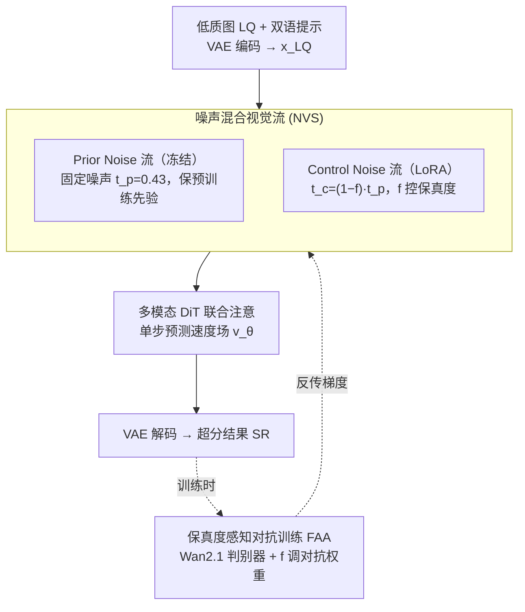

# One-Step Diffusion Transformer for Controllable Real-World Image Super-Resolution

**会议**: CVPR 2026  
**论文**: [CVF Open Access](https://openaccess.thecvf.com/content/CVPR2026/html/Fang_One-Step_Diffusion_Transformer_for_Controllable_Real-World_Image_Super-Resolution_CVPR_2026_paper.html)  
**代码**: https://github.com/RedMediaTech/ODTSR  
**领域**: 图像恢复 / 扩散模型  
**关键词**: 真实图像超分, 一步扩散, 扩散Transformer, 可控生成, 对抗训练

## 一句话总结
基于 Qwen-Image 的一步式扩散 Transformer（ODTSR），用「噪声混合视觉流」让保真度和提示可控性可以同时拿到、并由一个保真度权重 $f$ 连续调节，再配合「保真度感知对抗训练」把多步去噪压成单步推理，在通用真实超分和中英文文字图超分上都达到 SOTA。

## 研究背景与动机
**领域现状**：扩散模型把真实世界图像超分（Real-ISR）的感知质量推到了很高水平。主流分两路——多步扩散方法靠迭代去噪获得强生成可控性；一步方法靠对预训练扩散做蒸馏/微调换取效率。

**现有痛点**：保真度（fidelity）和可控性（controllability）很难兼得。多步方法生成随机性大、容易偏离低质输入（LQ）导致**低保真**，且推理慢；一步方法为了高保真做了大量针对性微调，**丢掉了预训练模型本来的提示可控性**，换个场景就不灵。

**核心矛盾**：Real-ISR 在复杂退化 + 语义模糊下是经典病态问题，高分辨率结果不唯一，本质上**需要可控性来消歧**；但现有一步方法把「保真」固化进了权重，牺牲了这种可控性。

**切入角度**：作者在 Qwen-Image 上做了一组对照实验（论文 Sec.3）：对同一张图加不同强度噪声再去噪，发现**噪声强度直接决定保真—可控的权衡**——高噪声输入提示可控性强、质量高但保真低；低噪声输入保真高却出不来超分效果，而且低噪声下文字提示仍能修复被破坏的中文字。关键是这种能力是预训练模型**开箱即有、无需训练**的。

**核心 idea**：既然单条视觉流上调噪声只能二选一，那就**拆成两条流**——一条固定噪声保住预训练先验（保真），一条噪声可调由用户权重 $f$ 控制（可控），让两者在多模态 DiT 里联合注意；再用对抗训练把多步压成一步。

## 方法详解

### 整体框架
ODTSR 以 Qwen-Image（双流 MMDiT，含视觉流 + 文本流）为骨干，把超分表述成一步去噪。输入低质图 ILQ 经 VAE 编码到潜空间 $x_{LQ}$，再把原来的单条视觉流扩展成两条：**Prior Noise 流**注入固定噪声 $t_p$ 并冻结，尽量保住预训练扩散先验；**Control Noise 流**按用户可控的保真度权重 $f\in[0,1]$ 动态调噪、用 LoRA 微调，负责自适应恢复高频细节。两条视觉流连同文本流一起被多模态 DiT 联合注意，**单步**预测速度场把潜变量推向高质目标，再 VAE 解码出超分结果 SR。训练阶段额外引入一个由 Wan2.1 初始化的判别器，做**保真度感知对抗训练（FAA）**：根据 $f$ 动态调整对抗信号强度，逼出单步推理能力。

### 关键设计

**1. 噪声混合视觉流 NVS：用两条流把保真和可控解耦**

动机分析里发现，单条视觉流上调噪声是个死结——高噪声出质量和可控性但毁保真，低噪声保细节但出不来超分。NVS 把原视觉流拆成两支。Prior Noise 流给 $x_{LQ}$ 注入固定噪声 $x_{t_p}=(1-t_p)x_{LQ}+t_p\epsilon$（$t_p$ 经验设 0.43），并**冻结**该流以最大限度保留预训练扩散先验。Control Noise 流则按用户保真度权重动态调噪：$x_{t_c}=(1-t_c)x_{LQ}+t_c\epsilon,\ t_c=(1-f)\cdot t_p$——当 $f=1$ 时 $t_c=0$（无额外噪声、最高保真），$f=0$ 时 $t_c=t_p$（噪声最大、最强可控/生成）；其参数由 Prior Noise 流初始化、用 LoRA 微调。两条流连同文本流在多模态 DiT 里联合注意，**单步**预测速度场更新潜变量：$x_{pred}=x_{t_p}+(0-t_p)\,v_\theta(x_{t_p},x_{t_c},t_p,c)$，再 $I_{pred}=D(x_{pred})$ 解码。消融证明：相比「直接在单条流上调噪声」的 1-Visual 变体，NVS 在保真、质量、提示遵循上都更好（见下表），因为它把「保先验」和「调可控」交给了不同的流，互不拖累。

**2. 保真度感知对抗训练 FAA：把多步压成一步、还让对抗强度随 $f$ 自适应**

输入虽已尽量贴近预训练设计（噪声潜变量），但把多步去噪变单步仍是难训问题。受 Diffusion APT 启发，由于输入是含噪 LQ 潜变量而非纯噪声，作者**跳过离散时间一致性蒸馏阶段**，直接在 Real-ISR 任务上做单阶段对抗训练。生成器损失 = RGB 空间重建损失 $L_{rec}=L_{MSE}+\lambda_1 L_{LPIPS}$ + 潜空间对抗损失；对抗损失借鉴 R3GAN 用**相对论 GAN 损失**替代 APT 的非饱和 GAN 损失以避免模式崩塌：$L_{adv}^{G}=-\mathbb{E}_{x_r}[\log(1-R(x_r,x_f))]-\mathbb{E}_{x_f}[\log R(x_f,x_r)]$，其中 $R(x_r,x_f)=\sigma(D(x_r,t,c)-D(x_f,t,c))$。核心是「保真度感知」的权重耦合：$L_G=L_{rec}+(f\lambda_{min}+(1-f)\lambda_{max})L_{adv}^G$——$f$ 越小（输入越被噪声扰动、越难重建）对抗权重越大，鼓励生成器按提示合成逼真细节；$f$ 越大则降低对抗贡献、偏向重建保真。判别器用 Wan2.1（同 Qwen-Image 的 VAE）初始化、全参微调，在 transformer 输出后接两层 2D 卷积产出 **patch-wise** 判别分数，并用近似 R1 正则 $L_{reg}$ 稳住训练。FAA 让模型学会随 Control Noise 自适应调节提示效果——这是单纯固定 GAN 权重做不到的。

### 损失函数 / 训练策略
生成器目标 $L_G=L_{rec}+(f\lambda_{min}+(1-f)\lambda_{max})L_{adv}^G$，重建 $L_{rec}=L_{MSE}(I_{pred},I_{GT})+\lambda_1 L_{LPIPS}(I_{pred},I_{GT})$。判别器目标 $L_D=L_{adv}^D+\lambda_2 L_{reg}$，对抗项与生成器对称、$L_{reg}=\|D(x_r,t,c)-D(N(x_r,\sigma I),t,c)\|_2^2$ 为近似 R1 正则。训练时 $f$ 在 $[0,1]$ 均匀采样，$t_p=0.43$，$\lambda_1=1.0,\ \lambda_{min}=0.02,\ \lambda_{max}=0.1,\ \lambda_2=5.0$。生成器为 Qwen-Image、判别器为 Wan2.1-T2V-1.3B，在 8×H20 上跑 10,000 步、batch 32；训练数据 LSDIR + FFHQ，LQ 按 Real-ESRGAN 退化在线合成。

## 实验关键数据

> 指标说明：**LPIPS/DISTS** 感知相似度（↓）；**FID** 分布距离（↓）；**MUSIQ/MANIQA** 无参考图像质量（↑）；**PSNR/SSIM** 像素级保真（↑，但作者指出其难反映视觉质量）；**CLIP-T** 提示遵循度（↑）；**NED** 文字相似度归一化编辑距离（↑，专为场景文字超分定义，$\mathrm{NED}=1-\mathrm{ED}(P,G)/\max(|P|,|G|)$，$P/G$ 为复原图与真值的 OCR 文本）。

### 主实验

通用 Real-ISR（节选 LPIPS/DISTS/FID，↓越好；步数）：

| 数据集 | 方法 | 步数 | LPIPS↓ | DISTS↓ | FID↓ |
|------|------|------|------|------|------|
| RealSR | TSD-SR | 1 | 0.2743 | 0.2104 | 114.45 |
| RealSR | TVT | 1 | 0.2597 | 0.2061 | 109.90 |
| RealSR | DiT4SR (40 步) | 40 | 0.3215 | 0.2251 | 118.55 |
| RealSR | **ODTSR (f=1, 无提示)** | 1 | **0.2398** | **0.1894** | **101.49** |
| DRealSR | TVT | 1 | 0.2899 | 0.2205 | 134.28 |
| DRealSR | **ODTSR (f=1, 无提示)** | 1 | **0.2592** | **0.1926** | **119.86** |
| DIV2K-Val | TSD-SR | 1 | 0.2673 | 0.1821 | 23.29 |
| DIV2K-Val | **ODTSR (f=1, 无提示)** | 1 | 0.2761 | **0.1700** | **21.47** |

可控 Real-ISR：在文字图超分数据集 RealCE-val 上，ODTSR **未在任何场景文字数据集上训练**，仅靠保留 Qwen-Image 的文字渲染能力，无提示时 NED 0.7609、加提示后跃升到 0.8475，远超 SUPIR（0.6877）、DiT4SR（0.6794），并在 FID 上也最好（68.05）。

### 消融实验

NVS 有效性（RealSR，1-Visual 为单流变体）：

| 结构 | LPIPS↓ | MANIQA↑ | FID↓ | CLIP-T↑ |
|------|------|------|------|------|
| 1-Visual (f=1, 无提示) | 0.2655 | 0.6387 | 118.08 | 32.01 |
| **NVS (f=1, 无提示)** | **0.2398** | **0.6622** | **101.49** | **32.37** |
| 1-Visual (f=1, 有提示) | 0.2552 | 0.6499 | 105.94 | 33.94 |
| **NVS (f=1, 有提示)** | **0.2310** | **0.6622** | **101.49** | **34.01** |

FAA 有效性（RealSR，有提示；对比固定 GAN 权重）：

| 策略 | CLIP-T (f=1→0.2) | MANIQA (f=1→0.2) | 说明 |
|------|------|------|------|
| **FAA** | 34.01 → 34.56 ↑ | 0.668 → 0.682 ↑ | 降 f 时可控性、质量双升 |
| 固定 0.02 | 34.01 → 33.09 ↓ | 0.646 → 0.673 | 降 f 时提示遵循反降 |
| 固定 0.1 | 33.92 → 32.71 ↓ | 0.636 → 0.671 | 同样无法自适应 |

### 关键发现
- **NVS 在保真态全面占优**：f=1 时无论有无提示，NVS 相比单流在 LPIPS/MANIQA/FID/CLIP-T 上都更好，说明「拆流」确实把保先验和调可控解耦开了；而强可控态（f=0.2）NVS 用略低保真换更高的 CLIP-T 与 MANIQA，给了更大的调节空间。
- **FAA 是「可控性能随 $f$ 单调调节」的关键**：固定 GAN 权重（不论 0.02 还是 0.1）在把 $f$ 从 1.0 降到 0.2 时 CLIP-T 反而下降，因为模型学不会随 Control Noise 自适应调提示效果；只有 FAA 让 CLIP-T 随 $f$ 降而升。
- **泛化到长尾文字图**：ODTSR 不需任何文字数据训练就能复原可读、风格一致的中英文文字图，证明 NVS + 冻结 Prior 流有效保住了 Qwen-Image 的文字渲染先验。
- **用户研究**：20 名志愿者投票，ODTSR 得 53.25%，超过 TSD-SR（19.4%）、DiT4SR（12.75%）、PiSA-SR（14.6%）之和。

## 亮点与洞察
- **把「保真—可控权衡」变成一个连续可调旋钮 $f$**：用户一个标量就能在保真和提示可控之间无级滑动，且训练时 $f$ 均匀采样让单个模型覆盖整段权衡曲线——这是最实用的设计。
- **双流 = 冻结先验 + LoRA 可控**：一条流冻结保住预训练扩散的开箱能力、一条流轻量微调负责调控，既不破坏先验又拿到可控性，这种「冻结主干 + 旁路可调」的思路可迁移到其他想保留基模型能力的下游可控生成任务。
- **保真度感知的对抗权重耦合**：让对抗强度跟着输入难度（由 $f$ 决定）走，难输入多用对抗逼细节、易输入多用重建保真，是把「可控性」真正训进模型而非仅靠推理调噪的关键。
- **首个 20B+ 参数、支持中英双语提示的一步 Real-ISR 模型**，且零文字数据就能做中文场景文字超分，工程意义大。

## 局限与展望
- 基模型是 20B+ 的 Qwen-Image，判别器又是 Wan2.1，训练成本高（8×H20）；推理虽一步，但单步本身的算力/显存开销对落地仍是门槛（⚠️ 论文未给出推理时延/显存的量化对比）。
- $t_p=0.43$ 等关键超参为经验设定，Prior Noise 水平的消融放在补充材料，正文未充分展开其敏感性。
- 自承 PSNR/SSIM 不占优（如 DIV2K-Val 上 SSIM 0.6108 与一步基线相当甚至略逊），作者解释为这些像素指标难反映视觉质量，但对强调像素保真的应用仍是顾虑。
- 提示由 Qwen2.5-VL / OCR 自动抽取，真实部署时提示质量和 OCR 误差会直接影响可控超分效果，鲁棒性待考。

## 相关工作与启发
- **vs 一步方法（PiSA-SR / TSD-SR / OSEDiff / TVT）**: 它们为高保真做大量针对性微调，丢掉了预训练的提示可控性；ODTSR 用 NVS 保住先验、用 $f$ 拿回可控性，在保真态指标更优且额外支持双语提示控制。
- **vs 多步方法（SUPIR / DiT4SR）**: 多步靠迭代去噪获得可控性但慢且随机性大、保真不稳（调 CFG 时 SUPIR 难提保真、DiT4SR 低 CFG 时质量骤降）；ODTSR 一步即可同时拿到保真、质量与提示遵循。
- **vs APT（对抗后训练）**: ODTSR 输入是含噪 LQ 潜变量而非纯噪声，故跳过一致性蒸馏直接单阶段对抗，并用相对论 GAN 损失 + patch-wise 判别替代 APT 的标量判别，缓解模式崩塌。
- **vs DiT4SR（DiT 中的 LQ 条件机制）**: DiT4SR 研究更有效的 LQ 注入但仍多步；ODTSR 从「噪声强度决定保真—可控权衡」这一观察出发设计双流，思路不同。

## 评分
- 新颖性: ⭐⭐⭐⭐⭐ 「噪声混合视觉流 + 保真度感知对抗」把一步超分的保真—可控权衡变成连续可调，视角新且自洽。
- 实验充分度: ⭐⭐⭐⭐ 通用/可控/文字图多场景 + NVS/FAA 消融 + 用户研究较完整，但缺推理开销量化、Prior Noise 敏感性正文未展开。
- 写作质量: ⭐⭐⭐⭐ 动机实验（Sec.3 噪声分析）做得清楚、逻辑顺；符号与多损失项较多，初读需对照框架图。
- 价值: ⭐⭐⭐⭐⭐ 首个 20B+ 双语一步 Real-ISR，零文字数据做中文文字超分，实用性与影响力强。

<!-- RELATED:START -->

## 相关论文

- [\[CVPR 2026\] Bridging Fidelity-Reality with Controllable One-Step Diffusion for Image Super-Resolution](bridging_fidelity-reality_with_controllable_one-step_diffusion_for_image_super-r.md)
- [\[CVPR 2026\] IFCSR: Inference-Free Fidelity-Realism Control for One-Step Diffusion-based Real-World Image Super-Resolution](ifcsr_inference-free_fidelity-realism_control_for_one-step_diffusion-based_real-.md)
- [\[CVPR 2026\] Time-Aware One Step Diffusion Network for Real-World Image Super-Resolution](time-aware_one_step_diffusion_network_for_real-world_image_super-resolution.md)
- [\[CVPR 2026\] DreamSR: Towards Ultra-High-Resolution Image Super-Resolution via a Receptive-Field Enhanced Diffusion Transformer](dreamsr_towards_ultra-high-resolution_image_super-resolution_via_a_receptive-fie.md)
- [\[CVPR 2026\] SAT: Selective Aggregation Transformer for Image Super-Resolution](sat_selective_aggregation_transformer_for_image_super_resolution.md)

<!-- RELATED:END -->
