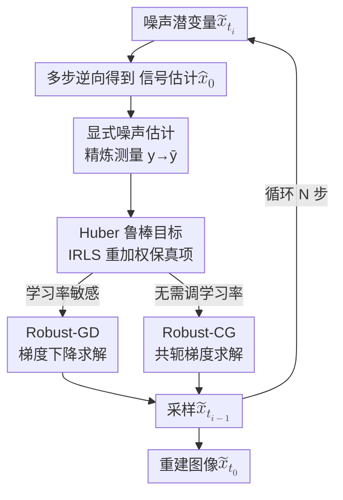

# Outlier-Robust Diffusion Solvers for Inverse Problems

**会议**: CVPR 2026  
**arXiv**: [2605.09477](https://arxiv.org/abs/2605.09477)  
**代码**: 无  
**领域**: 图像恢复 / 扩散模型 / 逆问题  
**关键词**: 扩散逆问题, 离群值鲁棒, Huber 损失, 共轭梯度, 噪声估计

## 一句话总结
针对真实测量中常见的离群值（outlier），本文给基于预训练扩散模型的逆问题求解器加了两道保险——先用显式噪声估计精炼测量，再把数据保真项从平方 $\ell_2$ 换成 Huber 损失的迭代重加权最小二乘，并分别用梯度下降（Robust-GD）和共轭梯度（Robust-CG）求解，在超分/修复/去模糊等线性与非线性任务上对离群污染显著比 DPS、DAPS 等近期方法更稳。

## 研究背景与动机
**领域现状**：用预训练扩散模型（DM）求解逆问题（inverse problems, IP）是近两年的热门路线。逆问题要从退化、含噪的观测 $\bm{y}=\mathcal{A}(\bm{x}_0^*)+\bm{\nu}$ 中恢复原信号 $\bm{x}_0^*$，覆盖超分、修复、去模糊等任务。相比需要成对数据监督训练的专用模型，DPS、DiffPIR、DAPS、RED-diff 这类方法直接借用预训练 DM 的生成先验，无需针对任务重训，因而流行。

**现有痛点**：这些方法几乎都只考虑观测里的高斯噪声，却忽略了**离群值**。现实测量中除了高斯噪声，还常有传感器故障、传输瞬时干扰造成的离群污染——按论文采用的「任意污染模型」，观测里有一个比例 $\rho$ 的分量被任意离群向量 $\bm{\xi}$ 替换：当 $i$ 落在未知污染集合 $\mathcal{C}$ 时 $y_i=\xi_i$，否则 $y_i=(\mathcal{A}(\bm{x}_0^*))_i+\nu_i$。

**核心矛盾**：现有 DM 求解器的数据保真项普遍是平方 $\ell_2$ 形式 $\|\bm{y}-\mathcal{A}(\bar{\bm{x}}_0)\|_2^2$。平方惩罚对大残差极其敏感，离群点贡献的巨大残差会主导优化、把重建带偏。换句话说，问题不在先验，而在「拿被污染的测量做强引导」这件事本身。

**本文目标**：在不重训 DM 的前提下，让求解器对离群值鲁棒，同时仍能处理普通高斯噪声，且在线性与非线性 forward operator 上都能用。

**切入角度**：鲁棒统计里早有应对离群值的工具。作者比较了三类——丢弃高损失点的 trimmed loss、取分块均值中位数的 median-of-means，以及对小残差二次惩罚、对大残差仅线性惩罚的 Huber 损失。前两类会**丢掉**疑似离群点的信息，而 Huber 损失利用了全部测量、只是差异化惩罚，更适合作为保真项。

**核心 idea**：用「显式噪声估计精炼测量」+「Huber 损失的迭代重加权最小二乘」两步替换掉原来的平方 $\ell_2$ 保真项，并提供 GD 和 CG 两种求解器。

## 方法详解

### 整体框架
方法嵌在标准 DM 的逆向采样循环里，每个时间步 $t_i$ 做一次「估计→精炼→鲁棒求解→采样」。具体地：先用多步逆向过程从当前噪声潜变量 $\tilde{\bm{x}}_{t_i}$ 得到信号估计 $\hat{\bm{x}}_0$（与 DAPS 同款）；接着用**显式噪声估计**把原始测量 $\bm{y}$ 精炼为 $\bar{\bm{y}}$，削弱加性噪声；然后构造一个以 **Huber 损失**为保真项的鲁棒目标函数来对付离群值，并近似求解得到 $\bar{\bm{x}}_0$；求解器有两个版本——梯度下降的 **Robust-GD** 和共轭梯度的 **Robust-CG**；最后从 $\mathcal{N}(\alpha_{t_{i-1}}\bar{\bm{x}}_0,\sigma_{t_{i-1}}^2\bm{I}_n)$ 采样得到 $\tilde{\bm{x}}_{t_{i-1}}$，循环 $N$ 步后输出 $\tilde{\bm{x}}_{t_0}$ 为重建结果。三个贡献组件（噪声估计精炼、Huber 鲁棒目标、GD/CG 求解）依次串在采样循环内层。

### 关键设计

**1. 显式噪声估计精炼测量：先去噪再引导，别让脏测量毁掉重建**

逆问题求解通常是优化 $\min_{\bar{\bm{x}}_0}\frac{1}{2r_t^2}\|\bar{\bm{x}}_0-\hat{\bm{x}}_0\|_2^2+\lambda\|\bm{y}-\mathcal{A}(\bar{\bm{x}}_0)\|_2^2$，但当测量被严重污染时，含噪 $\bm{y}$ 与无噪 $\mathcal{A}(\bm{x}_0^*)$ 的巨大偏差会破坏重建。本文不像 [4] 那样额外训一个模型去生成伪条件，而是**显式估计加性噪声** $\bar{\bm{\nu}}$ 来精炼测量。假设加性噪声服从 $\mathcal{N}(\bm{0},\sigma^2\bm{I}_m)$，把噪声项作为额外变量写进目标：

$$\min_{\bar{\bm{x}}_0,\bar{\bm{\nu}}}\frac{1}{2r_t^2}\|\bar{\bm{x}}_0-\hat{\bm{x}}_0\|_2^2+\frac{1}{2\sigma^2}\|\bar{\bm{\nu}}\|_2^2+\frac{1}{2\gamma_t^2}\|\bm{y}-\mathcal{A}(\bar{\bm{x}}_0)-\bar{\bm{\nu}}\|_2^2.$$

固定 $\bar{\bm{x}}_0=\hat{\bm{x}}_0$ 先对 $\bar{\bm{\nu}}$ 求闭式解 $\tilde{\bm{\nu}}=\frac{\sigma^2}{\gamma_t^2+\sigma^2}(\bm{y}-\mathcal{A}(\hat{\bm{x}}_0))$，回代后得到精炼测量 $\bar{\bm{y}}=\frac{1}{\gamma_t^2+\sigma^2}(\gamma_t^2\bm{y}+\sigma^2\mathcal{A}(\hat{\bm{x}}_0))$——它是原始测量与当前重建预测的凸组合。其中时变权重取 $\gamma_t=1/\sigma_t$：早期时间步 $\hat{\bm{x}}_0$ 对潜变量扰动鲁棒，可用较小 $\gamma_t$（更强测量引导、容忍噪声）；后期 $\hat{\bm{x}}_0$ 变敏感，需较大 $\gamma_t$ 让 $\bar{\bm{x}}_0$ 贴住 $\hat{\bm{x}}_0$、保住重建的自然度。$1/\sigma_t$ 正好满足「早期低、后期高」。

**2. Huber 损失的迭代重加权最小二乘：保留全部测量信息，又压住离群点**

精炼只削弱了高斯噪声，离群值还在。作者把保真项里的平方 $\ell_2$ 残差换成逐元素 Huber 损失之和。Huber 算子 $\mathcal{H}_\delta(r)$ 在 $|r|\le\delta$ 时取 $r^2$（二次惩罚），在 $|r|>\delta$ 时取 $2\delta|r|-\delta^2$（线性惩罚）——对小残差像最小二乘，对大残差（离群点）只线性增长，从而限制离群点的损失贡献，又不像 trimmed loss / MOM 那样直接丢弃数据。

为了能用迭代重加权最小二乘（IRLS）求解，把 Huber 项改写成等价的二次形式 $\tilde{\mathcal{H}}_\delta(\bm{r})=\|\mathcal{W}_\delta(\bm{r})\bm{r}\|_2^2$，其中对角加权算子

$$\mathcal{W}_\delta(\bm{r})_{ii}=\begin{cases}1,&|r_i|\le\delta,\\ \sqrt{\delta/|r_i|},&|r_i|>\delta.\end{cases}$$

残差越大的分量权重越小（$\sqrt{\delta/|r_i|}<1$），等于自动给离群点降权。关键技巧：权重 $\bm{W}_\delta$ 虽由当前 $\bar{\bm{x}}_0$ 算出，但**从梯度计算中 detach**，这样二次形式与原 Huber 项关于 $\bar{\bm{x}}_0$ 的梯度严格相等，既享受 IRLS 的便利又不引入偏差。最终目标为

$$\min_{\bar{\bm{x}}_0}\frac{1}{2}\Big(\frac{1}{r_t^2}\|\bar{\bm{x}}_0-\hat{\bm{x}}_0\|_2^2+\frac{1}{\gamma_t^2}\|\bm{W}_\delta(\bar{\bm{y}}-\mathcal{A}(\bar{\bm{x}}_0))\|_2^2\Big).$$

Robust-GD 即对该目标做 $J$ 步梯度下降（学习率 $\eta_x$），从 $\tilde{\bm{x}}_0$ 初始化、每步重算 $\bm{W}_\delta$。

**3. 共轭梯度求解 + 闭式步长：把对学习率的依赖彻底去掉**

Robust-GD 的痛点是性能对学习率 $\eta_x$ 敏感、需要精调。作者改用共轭梯度（CG）法，并给步长 $\alpha_j$ 推了闭式解，免去调参。在第 $j$ 步给定梯度 $\bm{g}_j$ 和方向 $\bm{d}_j$，步长是个 line search 问题；当 forward operator 线性（$\mathcal{A}(\bm{x})=\bm{A}\bm{x}$）时目标是二次的，可直接求出最优步长

$$\alpha_j=\frac{\bm{g}_j^\mathrm{T}\bm{g}_j}{\frac{1}{r_t^2}\bm{d}_j^\mathrm{T}\bm{d}_j+\frac{1}{\gamma_t^2}(\bm{W}_\delta^{(j)}\bm{A}\bm{d}_j)^\mathrm{T}(\bm{W}_\delta^{(j)}\bm{A}\bm{d}_j)}.$$

分子用非线性 CG 常用的 $\bm{g}_j^\mathrm{T}\bm{g}_j$ 形式（经验上比标准 $\bm{g}_j^\mathrm{T}\bm{d}_j$ 更优）。对非线性 IP，先把 $\mathcal{A}(\bar{\bm{x}}_0^{(j)}+\alpha\bm{d}_j)$ 在当前点做一阶 Taylor 展开，但显式算 Jacobian 太贵，于是用有限差分近似 Jacobian-向量积 $\bm{J}\bm{d}_j\approx(\mathcal{A}(\bar{\bm{x}}_0^{(j)}+\eta\bm{d}_j)-\mathcal{A}(\bar{\bm{x}}_0^{(j)}))/\eta$，代入即得与线性情形同形的步长（用 $\bm{\omega}_j$ 替换 $\bm{W}_\delta\bm{A}\bm{d}_j$）。搜索方向用 Fletcher-Reeves 公式 $\bm{d}_{j+1}=\bm{g}_{j+1}+\frac{\bm{g}_{j+1}^\mathrm{T}\bm{g}_{j+1}}{\bm{g}_j^\mathrm{T}\bm{g}_j}\bm{d}_j$ 保证共轭性。这样 Robust-CG 全程不需要学习率。

### 损失函数 / 训练策略
本方法**无需任何训练**，直接复用预训练 DM。"损失"指的是每个时间步内层求解的优化目标（上式 Eq.17）。关键超参：Huber 阈值 $\delta$（多数任务 0.01~0.02）、有限差分参数 $\eta$（$10^{-3}\sim10^{-4}$）、噪声相关时变权重 $\gamma_t=1/\sigma_t$、内层迭代步数 $J$ 与采样步数 $N$。离群向量在实验中设为 $\xi_i=-1$（贴合测量边界 $\bm{y}\in[-1,1]$）。

## 实验关键数据

数据集：CelebA、FFHQ、ImageNet（均 256×256，各随机取 100 张验证图，FFHQ 结果在附录）。所有主任务均在高斯噪声 $\sigma=0.05$ 下进行，污染比例 $\rho=0.02$ 或 $0.10$。指标：PSNR、SSIM（失真）+ LPIPS、FID（感知）。Baseline：DPS、DiffPIR、DCPS、RED-diff、DAPS。

### 主实验

线性任务（超分 4×、修复 random 70%），CelebA，节选 PSNR↑ / LPIPS↓ / FID↓：

| 任务 / 污染 | 指标 | DPS | DAPS | Robust-GD | Robust-CG |
|------|------|------|------|------|------|
| 超分 ρ=0.02 | PSNR | 23.99 | 22.51 | 29.41 | **29.67** |
| 超分 ρ=0.02 | LPIPS | 0.184 | 0.403 | 0.145 | **0.125** |
| 修复 ρ=0.02 | PSNR | 26.68 | 25.57 | 30.47 | **31.20** |
| 修复 ρ=0.02 | FID | 63.49 | 195.00 | 62.62 | **51.42** |
| 超分 ρ=0.10 | PSNR | 20.95 | 16.63 | 26.52 | **28.96** |
| 修复 ρ=0.10 | LPIPS | 0.185 | 0.596 | 0.374 | **0.093** |

去模糊（高斯/运动），CelebA，节选 PSNR↑：

| 任务 / 污染 | DPS | DAPS | RED-diff | Robust-GD | Robust-CG |
|------|------|------|------|------|------|
| 高斯去模糊 ρ=0.02 | 25.14 | 23.73 | 27.99 | **30.00** | 29.48 |
| 运动去模糊 ρ=0.02 | 23.44 | 23.74 | 24.80 | **29.87** | 29.27 |
| 高斯去模糊 ρ=0.10 | 22.06 | 16.18 | 22.96 | **29.27** | 29.38 |

非线性去模糊（learned blurring operator），节选 PSNR↑：

| 任务 / 污染 | DPS | RED-diff | DAPS | Robust-GD | Robust-CG |
|------|------|------|------|------|------|
| CelebA ρ=0.02 | 23.42 | 22.49 | 20.90 | **28.25** | 26.89 |
| CelebA ρ=0.10 | 21.26 | 16.37 | 15.89 | **27.06** | 26.80 |
| ImageNet ρ=0.10 | 19.19 | 14.95 | 15.21 | **24.55** | 23.67 |

可见污染越重（ρ=0.10）baseline 崩得越狠（DAPS/RED-diff PSNR 跌到 12~16），本文方法仍稳在 24~29，差距被进一步拉开。

### 高强度高斯噪声（σ=0.5, ρ=0.02, CelebA）

| 任务 | 指标 | DPS | DCPS | Robust-GD | Robust-CG |
|------|------|------|------|------|------|
| 超分 | PSNR | 20.55 | 18.77 | 22.16 | **23.04** |
| 修复 | PSNR | 21.90 | 22.54 | 23.91 | **24.62** |

### 消融实验

Huber 阈值 $\delta\in\{0.005,0.01,0.02,0.04\}$（Robust-CG，CelebA，ρ=0.10, σ=0.05）：

| δ | 高斯去模糊 PSNR | 运动去模糊 PSNR |
|------|------|------|
| 0.005 | 28.75 | 27.91 |
| 0.010 | 29.04 | 28.55 |
| 0.020 | 29.38 | **28.91** |
| 0.040 | **29.64** | 27.67 |

有限差分参数 $\eta\in\{10^{-3},5\times10^{-4},10^{-4}\}$：

| η | 高斯去模糊 PSNR | 非线性去模糊 PSNR |
|------|------|------|
| 0.0010 | 29.38 | 25.97 |
| 0.0005 | 29.38 | 26.37 |
| 0.0001 | 29.38 | **26.80** |

### 关键发现
- **Huber 阈值 δ 不敏感**：在 {0.005~0.04} 区间 Robust-CG 的 PSNR 波动极小（高斯去模糊 28.75~29.64），说明鲁棒性不靠精调 δ，δ=0.04 在运动去模糊上反而掉点（27.67），偏大会削弱对中等残差的二次惩罚。
- **有限差分 η 对线性任务无影响、对非线性有轻微影响**：高斯去模糊三档 η 下 PSNR 完全相同（29.38），因为线性算子 Jacobian 即 $\bm{A}$，有限差分近似精确；非线性任务 η 越小越准（25.97→26.80）。
- **污染越重优势越明显**：ρ 从 0.02 升到 0.10 时 baseline 大幅崩坏，本文方法掉点很小，离群鲁棒性是核心卖点。
- **GD 与 CG 各有所长**：Robust-CG 在多数线性任务上更优且免调学习率；Robust-GD 在部分去模糊与非线性任务上 PSNR 反而更高，但代价是要调 $\eta_x$。

## 亮点与洞察
- **把鲁棒统计「平移」进扩散逆问题**：核心创新不是新网络，而是认清「现有 DM 求解器的平方 $\ell_2$ 保真项天然不抗离群值」，用 Huber 损失替换它，思路干净、即插即用、不需重训，可迁移到任何借用预训练 DM 先验的 IP 求解器。
- **detach 权重的 IRLS 技巧很巧**：把 Huber 写成加权二次形式后，让权重 $\bm{W}_\delta$ 从梯度图断开，保证改写后梯度与原 Huber 严格一致——既拿到 IRLS 的可解性，又没引入近似误差，是个可复用的工程细节。
- **CG + 闭式步长免调学习率**：GD 版对学习率敏感是实用性硬伤，作者用共轭梯度配线性/非线性下的闭式最优步长（非线性靠有限差分近似 JVP）绕开调参，对落地很友好。
- **噪声估计 = 测量与重建预测的凸组合**：精炼测量 $\bar{\bm{y}}$ 用时变权重 $1/\sigma_t$ 在「信任测量」与「信任当前重建」间随时间步平滑切换，符合「早期容噪、后期保真」的直觉。

## 局限与展望
- **离群模型偏理想**：实验里离群值统一设成 $\xi_i=-1$（贴合 $[-1,1]$ 边界），真实场景的离群分布可能更复杂多样，鲁棒性是否同样保持未充分验证。
- **两个方法没有统一赢家**：Robust-GD 与 Robust-CG 在不同任务/污染下互有胜负，论文未给出「何时用哪个」的明确判据，用户仍需试错（且 GD 要调学习率）。
- **超参仍有任务依赖**：δ 虽不敏感，但不同任务给的 δ、η 取值不同（如超分 δ=0.005~0.02），最优区间需经验确定。
- **计算开销**：每个时间步内层要做 $J$ 次迭代、CG 非线性情形每步还要额外一次 forward 算有限差分，相比纯 DPS 的单次梯度引导更重，论文未给运行时间对比。

## 相关工作与启发
- **vs DAPS**：本文沿用 DAPS 的多步逆向估计 $\hat{\bm{x}}_0$ 和解耦采样思路，但 DAPS 仍用平方 $\ell_2$ 保真项、只抗高斯噪声；本文加上噪声估计精炼 + Huber 鲁棒目标，在 ρ=0.10 下 DAPS PSNR 崩到 14~18 而本文稳在 24~29。
- **vs DiffPIR / DPS**：它们分别用 proximal 更新 / Tweedie 公式 + 梯度后验校正，保真项都是平方 $\ell_2$；本文的差异就在把这个保真项换成鲁棒形式，是对整条 DM-IP 路线的「正交补丁」。
- **vs trimmed loss / median-of-means**：这两类鲁棒方法靠丢弃疑似离群点取得鲁棒，会损失测量信息；本文选 Huber 损失，差异化惩罚而不丢数据，在高污染下信息利用更充分。
- **启发**：「换保真项」这一招对任何用平方 $\ell_2$ 做数据一致性的生成式逆问题求解器（包括 flow matching、latent diffusion）都可能适用，值得作为提升鲁棒性的标准选项。

## 评分
- 新颖性: ⭐⭐⭐⭐ 不是全新框架，但把 Huber 鲁棒统计 + IRLS + CG 闭式步长系统地接进扩散逆问题，组合扎实且补了被忽视的离群值问题。
- 实验充分度: ⭐⭐⭐⭐ 覆盖 3 数据集、线性/非线性多任务、两档污染、高噪声条件 + δ/η 消融，较全面；但缺运行时间和真实离群分布验证。
- 写作质量: ⭐⭐⭐⭐ 推导清晰、两套算法伪代码完整，逻辑链顺；部分关键对比（GD vs CG 何时用）留在附录。
- 价值: ⭐⭐⭐⭐ 即插即用、无需重训、对真实含离群测量很实用，可作为 DM-IP 求解器的鲁棒性标配补丁。

<!-- RELATED:START -->

## 相关论文

- [\[CVPR 2026\] Variational Garrote for Sparse Inverse Problems](variational_garrote_for_sparse_inverse_problems.md)
- [\[CVPR 2026\] GSNR: Graph Smooth Null-Space Representation for Inverse Problems](gsnr_graph_smooth_null_space_representation_for_inverse_problems.md)
- [\[CVPR 2026\] PnP-CM: Consistency Models as Plug-and-Play Priors for Inverse Problems](pnp-cm_consistency_models_as_plug-and-play_priors_for_inverse_problems.md)
- [\[ICML 2026\] Learning Normalized Energy Models for Linear Inverse Problems](../../ICML2026/image_restoration/learning_normalized_energy_models_for_linear_inverse_problems.md)
- [\[CVPR 2026\] DRFusion: Degradation-Robust Fusion via Degradation-Aware Diffusion Framework](drfusion_degradation_robust_fusion_via_degradation_aware_diffusion_framework.md)

<!-- RELATED:END -->
