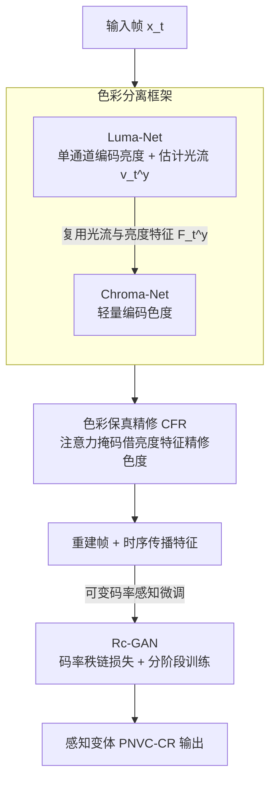

# Perceptual Neural Video Compression with Color Separation and Rank Chain

**会议**: CVPR 2026  
**论文**: [CVF Open Access](https://openaccess.thecvf.com/content/CVPR2026/html/Liang_Perceptual_Neural_Video_Compression_with_Color_Separation_and_Rank_Chain_CVPR_2026_paper.html)  
**代码**: https://github.com/lxz-nan/PNVC-CR  
**领域**: 神经视频压缩 / 图像视频恢复  
**关键词**: 神经视频压缩, 感知质量, 亮度色度分离, 秩链损失, 可变码率

## 一句话总结
针对现有神经视频压缩只追 PSNR、忽视人眼对亮度/色度感知差异、且可变码率下感知质量不一致两个问题，本文用「亮度-色度分离的双编解码框架（PNVC-C）」+「码率秩链对抗优化（Rc-GAN）」组合出 PNVC-CR，在 LPIPS / DISTS / KID / FID 等感知指标上相对 VTM 取得 77.71% / 53.94% / 54.44% / 42.27% 的 BD-rate 节省，同时仍保留客观保真度。

## 研究背景与动机
**领域现状**：神经视频压缩（Neural Video Compression, NVC）近年以 DCVC 系列（DCVC-DC / DCVC-FM / DCVC-RT）为代表的条件编码方案取得 SOTA，但绝大多数仍以 PSNR 这类客观失真指标作为优化目标。

**现有痛点**：以像素级保真为目标的优化会牺牲感知合理性——重建结果 PSNR 高但看起来不自然。已有工作引入 GAN 和感知损失改善视觉真实感，但仍有两个硬伤：(1) 优化在统一色彩空间（RGB 或上采样得到的 YUV444）里做，忽视了人眼视觉系统对亮度和色度的**非对称敏感性**；(2) 可变码率模型的一致性优化被忽略，导致跨码率时感知质量不稳定。

**核心矛盾**：一方面，人眼亮度与色度由不同感光细胞处理、敏感度不对称（传统编码用 YUV420 降色度采样正是利用这点），但 NVC 把两者混在一个色彩空间里建模；另一方面，对抗式打分本身不稳定、难以可靠感知码率变化，使可变码率模型无法把优化对齐到人眼「码率越高、质量越好」的质量排序，结果大多数感知 NVC 只能对每个码率单独训一个模型。

**本文目标**：(1) 设计一个对齐人眼非对称感知的色彩分离 NVC 框架；(2) 让单个可变码率模型在不同码率下保持一致、单调的感知质量排序。

**切入角度**：把「亮度细节」和「色度」拆成两个专门网络，把更多算力/码率预算分给人眼更敏感的亮度；并把「码率↔感知质量」的单调关系显式写进对抗训练的排序约束里。

**核心 idea**：用「亮度-色度分离的双编解码器」替代统一色彩空间建模，再用「码率秩链损失」把可变码率的质量排序约束进判别器，给编码器更细粒度的感知反馈。

## 方法详解

### 整体框架
PNVC-C 把一帧 $x_t$ 拆成亮度分量 $x_t^y$ 和色度分量 $x_t^{uv}$，分别交给两个专门网络：Luma-Net 负责高保真编码亮度并估计光流 $\hat v_t^y$ 与亮度传播特征 $\hat F_t^y$；Chroma-Net 复用 Luma-Net 的光流和亮度特征做轻量色度编码，并在解码端用色彩保真精修（CFR）借亮度特征增强色度纹理。这套客观预训练得到的 PNVC-C-Base 再用 Rc-GAN 做感知微调，得到感知变体 PNVC-CR。整条管线是「分离 → 双网编码（含 CFR）→ 感知对抗微调」的串行流程：

### 关键设计

**1. 色彩分离框架：用双专网对齐人眼亮度/色度的非对称敏感度**

针对「统一色彩空间建模忽视人眼非对称感知」的痛点，PNVC-C 把亮度和色度解耦成两个独立编解码网络。Luma-Net 基于 DCVC-DC，但把输入输出从三通道改成单通道以适配亮度分量，并设计单通道输入的 Luma-SpyNet 估计亮度光流；同时用轻量高效的 Partial Convolution ResBlock 替换原 ResBlock 降复杂度。Chroma-Net 则是重新设计的轻量网络：它直接**复用** Luma-Net 已重建的光流 $\hat v_t^y$、去掉自己的光流估计与压缩模块，把 $\hat v_t^y$ 下采样后送入色度时序上下文挖掘（TCM）做运动补偿、抽多尺度特征作为色度编码的条件。这样设计之所以有效，是因为亮度承载了人眼最敏感的结构信息、值得更高的重建质量与算力预算，而色度可以借亮度的运动/结构线索做廉价编码——实测 Chroma-Net 只占总复杂度的 15.53%、平均码率的 4.52%，把预算精准压在了亮度上。

**2. 色彩保真精修 CFR：用注意力掩码把亮度细节注入色度重建**

色度分量被压得很省，容易丢结构和纹理。CFR 在解码端引入基于注意力的精修：把亮度传播特征 $\hat F_t^y$ 与上下文解码器输出的中间色度特征 $\ddot F_t^{uv}$ 融合，生成一个调制掩码 $m_t$（作为表征结构置信度的注意力图），再把掩码作用到 $\ddot F_t^{uv}$ 上得到精修后的色度传播特征 $\hat F_t^{uv}$。它之所以有效，是因为亮度网络已经把高保真的结构/纹理线索学好了，色度直接「蹭」这份线索即可——CFR 极其轻量（仅增加约 0.1M 参数、MACs 几乎不变），却在客观预训练阶段额外带来 6.0% / 6.6% 的 YUV PSNR / LPIPS BD-rate 节省。

**3. Rc-GAN 码率秩链优化：把「码率越高质量越好」写成可训练的排序约束**

针对「可变码率下感知质量不一致」的痛点，Rc-GAN 让判别器学习跨码率的感知质量排序。设可变码率编解码器为 $g_u(X,r)$，码率索引 $r\in\{0,\dots,n_{\text{rate}}-1\}$ 越大码率越高（并把原始样本记为 $\hat X_{n_{\text{rate}}}$），判别器 $f(\cdot)$ 的打分应满足**链式排序约束** $f(\hat X_{n_{\text{rate}}}) > f(\hat X_{n_{\text{rate}}-1}) > \cdots > f(\hat X_0)$。直接最大化整条链首尾分差会退化成只区分「原图 vs 最低码率」的粗粒度二分类、丢掉中间的精细排序，于是作者把全局链拆成相邻码率的**局部成对约束** $f(\hat X_{i+1}) > f(\hat X_i)$，并提出**分阶段训练**：每次迭代分成 $n_{\text{rate}}$ 个子阶段，从最高码率往低码率逐对约束。判别器损失为 $\mathcal L_D^r = -f(\hat X_{r+1}) + f(\hat X_r)$；生成器的排序损失只有在当前排序已正确时才施加梯度——$\mathcal L_G^r = \mathbb I[f(\hat X_{r+1}) > f(\hat X_r)]\cdot f(\hat X_r)$。这个「排序对了才回传梯度」的门控借鉴了 ReWaGAN 的 Ref-vs-SR 成对排序思想，避免排序不稳时给生成器误导性更新，从而把跨码率的感知反馈做得更细更准、抑制长序列里伪影的累积。

### 损失函数 / 训练策略
两阶段训练：先用 MSE 做客观预训练得到 PNVC-C-Base（每个训练单元 $m=8$ 帧，$n_{\text{rate}}=4$ 个率失真点，基 $\lambda$ 为 85/170/380/840，帧级权重 $w_t=(0.5,1.2,0.5,0.9)$）；再从 Base 出发用 Rc-GAN 感知微调得到 PNVC-CR，判别器与编解码器交替优化，生成器总损失含 $\alpha\!\cdot\!L_{L2} + \beta\!\cdot\!L_{lps} + \gamma\!\cdot\!L_G$（$\alpha=1/2,\ \beta=1/320,\ \gamma=1/640$），判别器梯度裁剪 $c=0.001$。

## 实验关键数据

> 说明：**BD-Rate（Bjøntegaard Delta rate）**衡量在同等质量下相对锚点的码率变化，**负值越大越好**（节省码率越多）；本文锚点为传统编码器 VTM-13.2（H.266/VVC），测试 96 帧、IP=−1。

### 主实验
| 指标 | 方法 | 平均 BD-Rate(%) vs VTM |
|------|------|------|
| LPIPS↓ | DCVC-FM | +2.56 |
| LPIPS↓ | DCVC-RT | +7.71 |
| LPIPS↓ | **PNVC-CR** | **−77.71** |
| DISTS↓ | DCVC-RT | +56.20 |
| DISTS↓ | **PNVC-CR** | **−53.94** |
| KID↓ | DCVC-FM | +52.63 |
| KID↓ | **PNVC-CR** | **−54.44** |
| FID↓ | DCVC-FM | +46.84 |
| FID↓ | **PNVC-CR** | **−42.27** |
| YUV PSNR↑ | DCVC-FM | −21.69 |
| YUV PSNR↑ | **PNVC-C-Base** | **−25.26** |
| YUV PSNR↑ | **PNVC-CR** | −15.91 |

要点：PNVC-CR 在四个感知指标上全面领先（其余神经/传统编解码器多数甚至比 VTM 还差，呈正 BD-rate），同时仍保留 15.91% 的 YUV PSNR 码率节省、比 baseline DCVC-DC 还多 6.7% 客观优势；客观取向的 PNVC-C-Base 则在 YUV PSNR / SSIM / VMAF 上取得 SOTA（如 YUV PSNR −25.26%、YUV SSIM −22.34%、VMAF −19.34%）。与扩散式生成编码 DiffVC 相比，PNVC-CR 在 0.014 bpp 时 RGB PSNR 达 32.18 dB，而 DiffVC 在 0.191 bpp 才 29.68 dB，且单帧 480p 推理仅 125 ms（DiffVC 约 4.0 s）。

### 消融实验
| 配置（色彩分离，BD-Rate%，锚点 $M_a$=复现 DCVC-DC） | YUV PSNR | LPIPS | 说明 |
|------|------|------|------|
| $M_a$ | 0 | 0 | 复现 DCVC-DC 基线 |
| $M_b$ +色彩分离 | −7.2 | −9.1 | 亮度/色度独立编码 |
| $M_c$ +CFR | −13.2 | −15.7 | 复用亮度特征精修色度（+0.1M 参数） |
| $M_d$ +长序列训练 | −21.4 | — | 增强时序一致性，无额外推理开销 |
| $M_e$ +Partial Conv | −20.7 | −24.3 | 略掉 0.7% PSNR 换 1583.6→1412.6 kMacs/pixel |

| 配置（感知损失，BD-Rate%，锚点 $M_e$=PNVC-C-Base） | YUV PSNR | LPIPS | 说明 |
|------|------|------|------|
| $M_e$ | 0 | 0 | 客观预训练基座 |
| $M_f$ +LPIPS | +14.7 | −51.2 | 感知提升但 PSNR 退化、出现明显伪影 |
| $M_g$ +WGAN | +11.5 | −60.1 | 缓解早期伪影，但长序列伪影回潮 |
| $M_h$ +Rc-GAN | +8.3 | −77.5 | 感知/客观最佳平衡，抑制伪影累积 |

### 关键发现
- 色彩分离 + CFR 是客观保真的主要来源：$M_a\to M_c$ 仅靠分离与轻量特征复用就拿到 13.2% YUV PSNR BD-rate，且 CFR 几乎零成本。
- 感知优化里 Rc-GAN 明显优于「裸 LPIPS」和「LPIPS+WGAN」：裸 LPIPS 虽降 LPIPS 51.2% 但 PSNR 涨 14.7% 且伪影严重；Rc-GAN 把 LPIPS 进一步压到 −77.5%、同时把 PSNR 退化收到 +8.3%，靠的是更细更准的跨码率排序反馈抑制了伪影随时序累积。
- 资源分配验证了「重亮度」策略：Chroma-Net 仅占 15.53% 复杂度、4.52% 平均码率，四个码率点的色度码率占比 3.19%~6.07%。

## 亮点与洞察
- 把传统视频编码里「YUV420 重亮度、降色度采样」的经典感知先验，重新落到端到端神经编解码的网络结构里（双专网 + 亮度引导色度），这是个很自然却被忽略的迁移点。
- Rc-GAN 的「排序对了才回传梯度」是个可复用的对抗训练 trick：当某个约束本身难以稳定满足时，与其硬训，不如用指示函数门控只在已满足时给正向梯度，避免误导更新——可迁移到任何需要单调/有序约束的可变条件生成。
- 把全局链式排序拆成相邻成对的分阶段训练，避免对抗目标退化成粗粒度二分类，这种「全局约束→局部成对」的分解思路对一切多档位/多等级的一致性优化都适用。

## 局限与展望
- 复杂度有所上升：PNVC-CR 总 MACs 2951G、参数 34.07M，比 DCVC-DC 增 5.99%、也高于 DCVC-FM（虽然作者认为相对收益值得）。
- 与 DiffVC 的比较是非重叠码率区间下的逐指标对比、而非 BD-rate，且 PNVC-CR 在 YUV420 域训练、换算 RGB PSNR 时存在域偏移，横向比较需带 caveat。
- 感知指标（LPIPS/DISTS/KID/FID）均在 RGB 域用 BT.709 换算后计算，YUV420→RGB 的转换本身会引入误差；对超低码率/极端运动场景的鲁棒性论文未充分展开。

## 相关工作与启发
- **vs DCVC 系列（DCVC-DC/FM/RT）**: 它们在统一色彩空间追客观保真，本文在其条件编码骨架上做亮度/色度分离 + 感知优化；区别在于显式利用人眼非对称敏感度并加入跨码率排序，本文在感知指标上大幅领先、客观指标仍有竞争力。
- **vs 既有感知 NVC（RNN/Transformer 判别器、频域/3D 判别器等）**: 它们多在统一色彩空间做对抗，且不利用可变码率模型的内在排序属性；本文用码率秩链把「码率↔质量」单调性显式约束进判别器。
- **vs ReWaGAN**: 借用其 Ref-vs-SR 的成对排序与「排序成立才回传梯度」思想，并从单一成对扩展到多码率的链式局部成对约束。
- **vs DiffVC（扩散式生成编码）**: 扩散合成质量好但推理慢（约 4.0s/帧），本文是非扩散方案、125ms/帧，在低码率下提供了质量/保真/效率更均衡的替代。

## 评分
- 新颖性: ⭐⭐⭐⭐ 把传统感知先验与可变码率排序两个角度落到神经 NVC，组合新颖但各组件均有出处。
- 实验充分度: ⭐⭐⭐⭐ 多 benchmark + 客观/感知双指标 + 两组消融 + 复杂度分析，较扎实；超低码率与极端场景的鲁棒性略欠。
- 写作质量: ⭐⭐⭐⭐ 动机清晰、公式完整，部分缩写与图注稍密。
- 价值: ⭐⭐⭐⭐ 单模型跨码率的感知一致性优化对实用感知视频编码有直接价值，且代码开源。

<!-- RELATED:START -->

## 相关论文

- [\[CVPR 2026\] Real-Time Neural Video Compression with Unified Intra and Inter Coding](real-time_neural_video_compression_with_unified_intra_and_inter_coding.md)
- [\[CVPR 2026\] VLIC: Vision-Language Models As Perceptual Judges for Human-Aligned Image Compression](vlic_vision-language_models_as_perceptual_judges_for_human-aligned_image_compres.md)
- [\[CVPR 2026\] ReflexSplit: Single Image Reflection Separation via Layer Fusion-Separation](reflexsplit_single_image_reflection_separation_via_layer_fusion-separation.md)
- [\[CVPR 2026\] Low-Rank Residual Diffusion Models](low-rank_residual_diffusion_models.md)
- [\[CVPR 2026\] Reflection Separation from a Single Image via Joint Latent Diffusion](reflection_separation_from_a_single_image_via_joint_latent_diffusion.md)

<!-- RELATED:END -->
