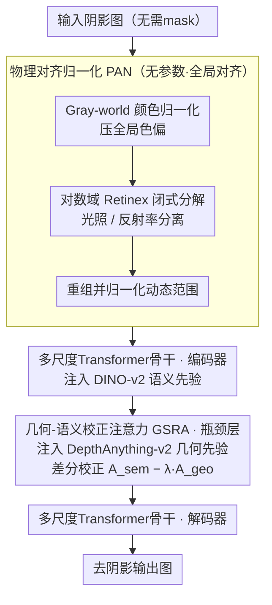

# PhaSR: Generalized Image Shadow Removal with Physically Aligned Priors

**会议**: CVPR 2026  
**arXiv**: [2601.17470](https://arxiv.org/abs/2601.17470)  
**代码**: [https://github.com/ming053l/PhaSR](https://github.com/ming053l/PhaSR)  
**领域**: 图像复原  
**关键词**: 阴影去除, Retinex分解, 差分注意力, 几何-语义先验对齐, 环境光归一化

## 一句话总结
提出PhaSR框架，通过双层物理先验对齐——全局级的PAN执行无参数Retinex分解抑制色彩偏差、局部级的GSRA利用差分注意力对齐DepthAnything深度先验和DINO-v2语义嵌入——实现从单光源直射阴影到多光源环境光场景的泛化阴影去除，在WSRD+和Ambient6K上达到SOTA且FLOPs最低。

## 研究背景与动机

**领域现状**：阴影去除是计算机视觉基础任务，核心挑战在于准确区分阴影与物体固有暗色区域，并进行物理合理的颜色校正。学习方法从CNN到Transformer到扩散模型不断进步，但大多在单光源直射阴影基准上评估。

**现有痛点**：(1) 仅依赖RGB线索时，阴影容易与材料固有属性混淆，在纹理边界处产生颜色失真；(2) 现有方法在单光源直射阴影基准上表现好，但面对多光源室内环境光场景（色偏、漫反射间接照明）泛化能力差；(3) 传统编码器-解码器框架无法有效传播物理先验，均匀融合忽略了空间变化的退化特征，导致边缘模糊。

**核心矛盾**：物理先验未对齐（prior misalignment）。几何特征（局部着色变化、法线方向）对光照几何敏感但有噪声，语义特征（物体类别、材料）跨光照稳定但空间粗糙。如果不正确对齐，几何噪声会破坏语义一致性，或语义过度平滑会擦除光照边界——在间接光照下尤其严重。

**本文目标** (1) 全局色彩偏差的抑制；(2) 几何先验和语义先验的跨模态冲突解决；(3) 从单光源到多光源场景的泛化能力。

**切入角度**：从"对齐"的角度统一思考——全局级对齐（PAN做光照-反射率分解）和局部级对齐（GSRA用差分注意力协调几何和语义）。

**核心 idea**：通过双层物理先验对齐（全局无参数Retinex归一化 + 局部差分注意力跨模态校正），使阴影去除系统能从单光源泛化到复杂多光源场景。

## 方法详解

### 整体框架
PhaSR把"泛化阴影去除"拆成两层物理对齐，分两阶段串起来。Stage 1是PAN，一个**完全无训练参数**的预处理模块：原图先做Gray-world颜色归一化压掉全局色偏，再到对数域做一次闭式Retinex分解把光照和反射率分开，最后重组归一化，吐出一张光照一致的图。Stage 2是多尺度Transformer编码器-解码器，吃这张干净图，并在不同深度注入两种冻结的外部先验——编码器阶段注入DINO-v2语义嵌入，瓶颈层注入DepthAnything-v2的深度/法线几何先验——再由GSRA在瓶颈层用差分注意力把这两种先验对齐后融合。整条流水线不依赖任何阴影mask，全局色偏由PAN管、局部跨模态冲突由GSRA管，对应"全局对齐+局部对齐"的双层设计。

### 关键设计

**1. 物理对齐归一化（PAN）：用闭式Retinex在输入端就掐掉全局色偏**

直接拿RGB喂网络的方法会把阴影和材料固有暗色混在一起，间接光照下还会整体偏色。PAN不学参数，纯靠三步闭式运算解决这个输入端的退化：先做Gray-world颜色归一化 $\mathbf{I}_{\text{norm}} = \mathbf{I} \cdot \frac{\mathbb{E}[\mathbf{I}]}{\mathbb{E}_c[\mathbf{I}]+\varepsilon}$ 把各通道光照拉平去掉色偏；再到对数域利用加法可分性做Retinex分解，光照分量取空间均值 $\log\hat{\mathbf{S}} = \mathbb{E}_{H,W}[\log(\mathbf{I}_{\text{norm}}+\varepsilon)]$、反射率为残差 $\log\hat{\mathbf{R}} = \log(\mathbf{I}_{\text{norm}}+\varepsilon) - \log\hat{\mathbf{S}}$，对数域让这一步有闭式解、不用迭代优化；最后重组并归一化动态范围 $\hat{\mathbf{I}} = \frac{\hat{\mathbf{R}} \otimes \hat{\mathbf{S}} - \min}{\max - \min + \varepsilon}$。和学习型Retinex最大的不同是它零参数、零训练，可以当即插即用模块塞进任何框架——实验里把它接到OmniSR/DenseSR前面就能白捡0.15–0.34dB，说明很多方法的瓶颈其实在没处理好的输入色偏。

**2. 几何-语义校正注意力（GSRA）：用跨模态减法让稳定的语义和敏感的几何各取所长**

几何先验（深度/法线）在阴影边缘很准、但在均匀光照区噪声大；语义先验跨光照稳定、但空间太糊。直接均匀融合会让几何噪声污染语义、或语义过平滑抹掉光照边界。GSRA先做多模态先验注入：用一份共享查询特征，分别加上几何和语义先验（各带可学习缩放因子 $\alpha$）生成模态专属的键值对；再用这份共享查询算出两张注意力图 $\mathbf{A}_{\text{geo}}$ 和 $\mathbf{A}_{\text{sem}}$，做一次差分校正

$$\mathbf{A}_{\text{rect}} = \mathbf{A}_{\text{sem}} - \lambda \cdot \mathbf{A}_{\text{geo}}$$

把语义当"全局稳定基底"、几何当"局部光照敏感扰动"减掉，可学习的 $\lambda$ 调节对光照变化的敏感度和几何正则强度的平衡；最后拼接两路输出 $\mathbf{F}_{\text{output}} = \text{Concat}(\mathbf{A}_{\text{rect}}\mathbf{V}_{\text{geo}}, \mathbf{A}_{\text{rect}}\mathbf{V}_{\text{sem}})$。这个减法结构天然就是一个物理可解释的门控：真实光照边界处几何精度被保留，均匀区域里几何噪声被压住。和原始DiffTransformer在同一自注意力头内部做减法不同，GSRA的减法是**跨模态**的——减的是两种异质先验之间的冲突。

**3. 多尺度Transformer骨干：按抽象层次把两种先验注到对的深度**

无mask阴影去除需要一个能在不同阶段承接物理先验的主干。骨干是层次化编码器-解码器，基础通道维度 $C=32$、每个Transformer块2层。关键不是堆层数，而是注入位置的安排：语义先验稳定、适合放在抽象的编码器阶段引导高层理解，所以冻结的DINO-v2嵌入注在编码器；几何先验精细、信息密度高，放在最压缩的瓶颈层，所以DepthAnything-v2的深度/法线注在瓶颈，并由GSRA在瓶颈层完成两者的对齐。让每种先验落在它最适合的抽象层次，是这个骨干能稳定传播物理先验、而不是均匀糊在一起的原因。

### 损失函数 / 训练策略
总损失 $\mathcal{L}_{\text{total}} = 0.95\mathcal{L}_{\text{Charb}} + 0.05\mathcal{L}_{\text{SSIM}}$，以Charbonnier损失保像素保真度、少量SSIM损失约束结构一致性。优化器用AdamW，batch size 9，训练1400 epochs，学习率 $2\times10^{-4}$ 余弦退火。

## 实验关键数据

### 主实验

| 数据集 | 指标 | PhaSR | 之前SOTA | 提升 |
|--------|------|------|----------|------|
| ISTD | PSNR/SSIM | 30.73/0.960 | 30.64(DenseSR) | +0.09 |
| ISTD+ | PSNR/SSIM | 34.48/0.960 | 35.19(StableSD) | -0.71 |
| INS | PSNR/SSIM | 30.38/0.961 | 30.64(DenseSR) | -0.26 |
| WSRD+ | PSNR/SSIM | **28.44/0.842** | 26.28(DenseSR) | **+2.16** |
| Ambient6K | PSNR/SSIM | **23.32/0.834** | 22.54(DenseSR) | **+0.78** |

注：在最具挑战性的WSRD+和Ambient6K（多光源环境光）上提升最大，验证了泛化能力。

### 消融实验（PAN作为插件）

| 框架 + PAN | ISTD(PSNR) | WSRD+(PSNR) | Ambient6K(PSNR) |
|------|---------|------|------|
| OmniSR | 30.45→30.60 | 26.07→26.22 | 23.01→23.15 |
| DenseSR | 30.64→30.98 | 26.28→26.47 | 22.54→22.73 |
| PhaSR(Ours) | 30.73 | 28.44 | 23.32 |

### 复杂度对比

| 方法 | FLOPs(G) | Params(M) |
|------|----------|-----------|
| OmniSR | 118.67 | 21.02 |
| DenseSR | 109.32 | 24.70 |
| PhaSR | **55.63** | **18.95** |

### 关键发现
- **在环境光场景(Ambient6K)上PhaSR大幅领先**——比专门的环境光归一化方法IFBlend(21.44dB)高出1.88dB，说明物理对齐先验在多光源场景中的关键作用
- **PAN作为即插即用模块**可稳定提升多种框架性能，ISTD数据集上误差减少高达26.4%
- **PhaSR的计算效率最高**——FLOPs仅55.63G，约为OmniSR的47%、DenseSR的51%，同时参数量最小(18.95M)
- 在ISTD+上低于StableShadowDiffusion，但后者是基于扩散的方法，计算代价远高于PhaSR
- PAN与传统颜色校正方法（ACE、White-balance等）对比，在所有指标上都优于后者

## 亮点与洞察
- **PAN的即插即用性**是最大亮点——一个无参数的闭式预处理模块就能稳定提升各种阴影去除方法0.15-0.34dB，说明很多方法的输入端就存在color bias问题。这个模块可以迁移到任何图像复原任务
- **GSRA的跨模态差分注意力**：$\mathbf{A}_{\text{sem}} - \lambda \cdot \mathbf{A}_{\text{geo}}$ 有很好的物理可解释性——语义注意力是"全局稳定的基底"，几何注意力是"局部光照敏感的扰动"，减法操作校正语义过平滑同时抑制几何噪声。这种跨模态差分范式可迁移到其他需要融合异质先验的任务
- **从单光源到多光源的泛化思路**：通过物理对齐而非数据驱动来实现泛化，比直接扩大训练集更优雅

## 局限与展望
- PAN基于Gray-world假设，对于颜色分布极不均匀的图像（如大面积单色背景）可能引入偏差
- 对数域Retinex用全局均值估计光照，无法处理空间变化剧烈的复杂光照（如多方向聚光灯）
- 在ISTD+上低于扩散模型方法，精细纹理恢复仍有提升空间
- GSRA中的 $\lambda$ 是全局可学习标量，空间自适应的 $\lambda(x,y)$ 可能在处理局部复杂阴影时更优

## 相关工作与启发
- **vs OmniSR**: OmniSR也用几何-语义先验但融合策略无法正确对齐互补模态强度；PhaSR通过差分注意力显式校正
- **vs DenseSR**: DenseSR将阴影去除重构为密集预测利用自适应融合，但在Ambient6K上依然显著低于PhaSR，说明没有物理对齐的融合在多光源场景下不够
- **vs ReHiT**: ReHiT用Retinex引导的双分支分解做无mask阴影去除，但在环境光场景下性能下降（Ambient6K仅19.98dB），PhaSR通过PAN+GSRA实现了更好的泛化

## 评分
- 新颖性: ⭐⭐⭐⭐ 双层物理对齐（PAN+GSRA）的设计思路系统且有物理直观
- 实验充分度: ⭐⭐⭐⭐⭐ 覆盖五个基准包括环境光场景，PAN插件实验、传统方法对比、复杂度分析齐全
- 写作质量: ⭐⭐⭐⭐ 物理动机阐述清晰，图表辅助理解
- 价值: ⭐⭐⭐⭐ PAN作为即插即用模块有广泛应用价值，GSRA的跨模态对齐思路可泛化

<!-- RELATED:START -->

## 相关论文

- [\[CVPR 2025\] Detail-Preserving Latent Diffusion for Stable Shadow Removal](../../CVPR2025/image_restoration/detail-preserving_latent_diffusion_for_stable_shadow_removal.md)
- [\[CVPR 2026\] Disentangled Textual Priors for Diffusion-based Image Super-Resolution](disentangled_textual_priors_for_diffusion-based_image_super-resolution.md)
- [\[CVPR 2026\] VLIC: Vision-Language Models As Perceptual Judges for Human-Aligned Image Compression](vlic_vision-language_models_as_perceptual_judges_for_human-aligned_image_compres.md)
- [\[CVPR 2025\] SoftShadow: Leveraging Soft Masks for Penumbra-Aware Shadow Removal](../../CVPR2025/image_restoration/softshadow_leveraging_soft_masks_for_penumbra-aware_shadow_removal.md)
- [\[CVPR 2026\] UniLDiff: Unlocking the Power of Diffusion Priors for All-in-One Image Restoration](unildiff_unlocking_the_power_of_diffusion_priors_for_all-in-one_image_restoratio.md)

<!-- RELATED:END -->
