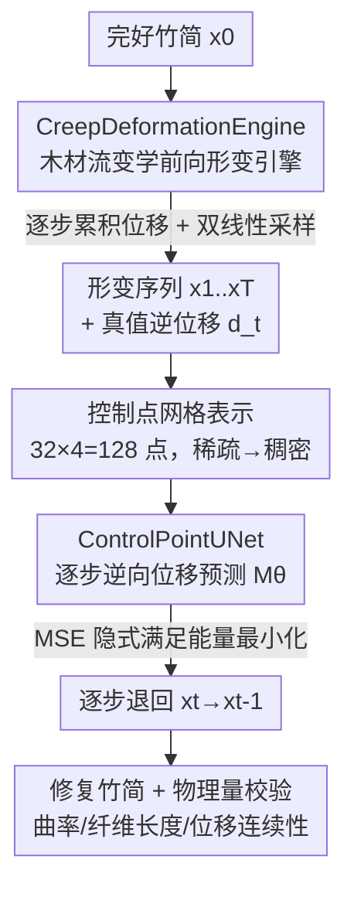

# Physics-Guided Multistep Deformation Reversal for Ancient Bamboo Slip Restoration

**会议**: CVPR 2026  
**论文**: [CVF Open Access](https://openaccess.thecvf.com/content/CVPR2026/html/Tang_Physics-Guided_Multistep_Deformation_Reversal_for_Ancient_Bamboo_Slip_Restoration_CVPR_2026_paper.html)  
**代码**: https://github.com/VillanelleQQ/PGDR-BambooSlips  
**领域**: 图像恢复 / 3D视觉 / 数字考古  
**关键词**: 竹简修复, 物理引导, 形变逆向, 控制点位移场, 木材流变学

## 一句话总结
针对出土古竹简因脱水应力产生的复杂非线性形变，本文用木材流变学建立一套可计算的"前向物理形变引擎"无配对地造数据，再训一个 ControlPointUNet 逐步预测**逆向位移场**把竹简一步步"拗"回原状，在文字保真度（TRQ）与形变物理合理性（DCI）上显著超过 CycleGAN / DewarpNet / DDRM 等数据驱动方法。

## 研究背景与动机
**领域现状**：竹简是记录古东亚文明的核心载体（公元前 500–公元 300 年），但出土后常因失水和土壤环境变化发生严重弯曲变形，既妨碍文字识别，又给残片缀合制造障碍。修复手段分两类：传统物理修复（控湿、机械压平、化学加固）精度高但极耗时、易造成墨迹扩散和不可逆损伤；计算方法（薄板样条 TPS、网格形变）则假设形变模式简单。

**现有痛点**：竹简的真实形变是多方向翘曲 + 非均匀收缩，TPS/网格类方法处理不了，常在校正几何的同时引入伪影、丢失文字细节。数据驱动的生成模型（CycleGAN、Stable Diffusion、DDRM 等）又有两个硬伤——① 形变/原状成对数据极度稀缺，几乎无法监督训练；② 黑箱去噪式恢复缺乏对竹材专属物理规律的建模，只会"把图拉直"而不顾位移场是否物理可行，导致字迹被拉花。

**核心矛盾**：恢复任务的本质是反演一个由材料物理（纤维微结构、应力扩散、湿度耦合、黏弹蠕变）支配的**累积、时变、非线性**过程，但现有方法要么没有物理模型、要么用过度简化的物理假设，无法表达竹材特有的应力-扩散耦合效应。

**本文目标**：在没有成对真实数据的前提下，构造一个**物理可解释**、能逐步逆转复杂形变并保住文字的修复框架。

**切入角度**：作者把"修复"重新表述成"形变的逆过程"——既然形变是物理驱动的确定性演化，那就先把这个正向物理过程建模成可计算引擎来批量造训练数据，再让网络学习它的逆位移场，而不是去预测抽象噪声。

**核心 idea**：用"物理前向形变 + 逐步逆向位移预测"的对偶过程，把黑箱去噪式恢复换成在**控制点位移空间**里可控、可解释的反演。

## 方法详解
整个系统建立在第 3 节的物理形变模型之上，分两块协同：一块是 **CreepDeformationEngine（蠕变形变引擎）**，按木材流变学把一张完好竹简 $x_0$ 逐时间步 $t$ 确定性地"变形"到 $x_t$，从而无配对地生成 $(x_t, d_t^{\text{true}})$ 训练对；另一块是 **ControlPointUNet**，在每个时间步看着形变图 $x_t$ 预测把它退回 $x_{t-1}$ 的逆向控制点位移 $\hat{\mathbf d}_t$。两块共享同一套控制点表示，因此前向造出的"真值位移"正好就是网络要学的监督信号。

### 整体框架
输入一张（合成或真实）形变竹简图，输出修复后的竹简图。训练阶段：引擎把完好竹简沿 $t=1\dots T$ 逐步施加物理形变得到序列 $\{x_t\}$ 及每步增量位移 $d_t^{\text{fw}}$；网络以 $x_t$ 为输入、$d_t^{\text{fw}}$ 为真值学习逆位移。推理阶段：从形变图出发，网络逐步预测逆位移并经双线性采样把图退回，多步累积完成修复。

### 关键设计

**1. CreepDeformationEngine：用木材流变学造出"物理真实"的无配对训练数据**

最大的拦路虎是没有"形变-原状"成对真数据。作者不去采集，而是把形变正向过程建成一个确定性的物理引擎来生成数据，核心是把第 3 节的连续介质模型离散到控制点网格上、串联三个耦合物理效应。① **纤维伸长（Fiber Elongation, FE）**：竹材由纵向纤维束组成，湿度变化 $\Delta W$ 下每束新长度为 $x_i' = x_i(1+\alpha_i\cdot\Delta W)$，不同束伸缩不一导致几何不相容、产生弯曲，曲率近似 $\kappa\approx\frac{\Delta L}{L\cdot h}$；离散到控制点后由经典梁理论推出竖直位移 $\Delta d_{i,y}^{\text{elong}}=\frac{t}{T}\cdot A_\kappa\cdot(y_i-y_{\text{center}})$，其中 $A_\kappa=\kappa\cdot L$ 是曲率幅度，$t/T$ 模拟蠕变的渐进累积。② **应力传递 / 力平衡（Force Balance, FB）**：相邻纤维束通过基体耦合，应力按 $\sigma_{i\to j}(r)=\sigma_i\,e^{-r/\lambda}$ 指数衰减传播，短程下用 $3\times3$ 高斯核近似。③ **湿度-应力耦合（Moisture Diffusion, MD）**：用位移梯度幅值作物理化的应力代理 $\sigma_i\approx\|\nabla\mathbf d_i\|$，再以 $(1+\gamma_i\sigma_i)$ 放大形变（对应 $\varepsilon_{i,total}=\varepsilon_{i,initial}+\varepsilon_{i,moisture}(1+\gamma_i\sigma_i)$），并叠加随时间增大的高斯噪声 $\mathcal N(0,0.05\cdot t/T)$ 模拟材料异质性。每步先后施加这三种效应得到增量位移 $d_t^{\text{fw}}$，累积场 $D_t=D_{t-1}+d_t^{\text{fw}}$ 经双线性采样作用于 $x_0$ 得 $x_t$。这样造出的形变轨迹是"物理可行"的，而不是随机扰动，给网络提供了强先验。

**2. 控制点网格表示：把稠密形变压成 128 个"骨架点"位移**

直接在像素级预测稠密位移场参数量巨大且难约束。作者从竹简轮廓自动定义一个 $32\times4$ 的控制点网格（4 条纵向纤维束 × 每束 32 点 = 128 个控制点，无需人工标注），把它们当作支配整张图翘曲的虚拟"骨架点"。稀疏控制点位移经双线性插值映射成稠密场，既保证了与连续介质力学一致的空间平滑性，又带来 >98% 的参数缩减。这一表示是前向引擎和逆向网络的公共接口：引擎在控制点上算物理位移，网络也只需回归这 128 个点的位移。$32\times4$ 的密度是消融选出的最优。

**3. ControlPointUNet：逐步逆向位移预测，MSE 隐式扛起物理约束**

修复被分解成 $T$ 个简单的"单步逆操作"，回避直接学复杂非线性映射。在每个时间步 $t$，网络（4 级编码-解码，通道 $[64,128,256,512]$）预测 $\hat{\mathbf d}_t=M_\theta(x_t,t)\in\mathbb R^{128\times2}$，真值取引擎的前向位移 $d_t^{\text{true}}=d_t^{\text{fw}}$，损失为 $L_{\text{MSE}}=\sum_{t=1}^{T}\|\hat{\mathbf d}_t-d_t^{\text{true}}\|^2$。关键在于：由于 $d_t^{\text{true}}$ 本身是按能量最小化 $E_{total}=E_{bend}+E_{stretch}$（即 $d_t^{\text{true}}=\arg\min_d[E_{bend}(d)+E_{stretch}(d)]$）算出来的，所以网络只要拟合这个真值，就**隐式**继承了物理约束，无需额外正则项。这与 DDRM 等只盯几何拉直的数据驱动逆过程形成对比——后者会产生不连续、物理不合理的位移场。

### 损失函数 / 训练策略
仅用上式 MSE 监督逐步逆位移。训练数据由前向引擎在 $t\in\{1,\dots,150\}$ 上即时生成，无需成对真数据。$T=150$ 步，AdamW（lr $=1\times10^{-4}$，batch 8，100 epoch），物理参数 $A_\kappa=0.15$、力耦合 $\lambda=0.3$、湿扩散系数 $D_{\text{moist}}=0.15$，单卡 RTX 5090。另外可从预测位移反解曲率 $\kappa_t$、纤维束长度 $\hat x_i$、位移连续性 $E_{\text{cont}}$ 等物理量做可解释性校验。

## 实验关键数据

### 主实验
数据集来自云梦睡虎地汉简：2000 张直竹简图（$320\times32$）按 1800/200 划分训练/测试，前向引擎在 $t\in\{1,\dots,150\}$ 造对；另收 500 张真实出土形变竹简用于评测。四个指标：Straightness（几何直度）、LPIPS（感知质量，越低越好）、TRQ（文字可读性改善比，$>1$ 即提升）、DCI（自定义形变一致性指数，衡量位移场物理合理性，归一化到 [1,10]，越高越好）。

合成测试集对比：

| 方法 | Straightness↑ | LPIPS↓ | TRQ↑ | DCI↑ |
|------|--------------|--------|------|------|
| CycleGAN | 0.226 | **0.118** | 0.848 | 3.258 |
| DewarpNet | 0.220 | 0.226 | 0.965 | 7.392 |
| StableDiffusion | 0.243 | 0.347 | 0.786 | 7.700 |
| DDRM | **0.348** | 0.314 | 0.962 | 2.195 |
| **本文** | 0.296 | 0.232 | **1.018** | **7.941** |

本文在 TRQ（较 DewarpNet +5.4%）与 DCI（+7.4%）上领先，且是唯一 TRQ$>1$ 的方法。DDRM 直度最高但 DCI 仅 2.195（最低）——它只拉直几何、位移场不连续；CycleGAN 的 LPIPS 最好却把文字严重扭曲。本文在保持有竞争力直度/LPIPS 的同时，把"文字保真 + 物理合理"做到最高。

真实出土 500 简泛化（含局部断裂、表面腐蚀）：

| 方法 | Straightness↑ | TRQ↑ | DCI↑ |
|------|--------------|------|------|
| CycleGAN | 0.182 | 0.753 | 2.841 |
| DewarpNet | 0.191 | 0.915 | 6.273 |
| StableDiff | 0.204 | 0.682 | 6.619 |
| DDRM | **0.281** | 0.893 | 1.975 |
| **本文** | 0.243 | **1.004** | **7.151** |

本文是真实数据上唯一 TRQ$>1$ 的方法，DCI 7.151 领先次优 DewarpNet（6.273）约 14%，且 DCI 是 DDRM 的 3.6 倍，说明物理建模给复杂考古形变设定了更高的性能上限。

### 消融实验
逐一移除引擎里的三个物理组件（合成集）：

| 配置 | Straightness↑ | LPIPS↓ | TRQ↑ | DCI↑ | 说明 |
|------|--------------|--------|------|------|------|
| Full | 0.296 | 0.232 | 1.018 | 7.942 | 完整模型 |
| w/o FE | 0.073 | 0.341 | 1.002 | 3.213 | 去纤维伸长，直度崩到 0.073 |
| w/o FB | 0.094 | 0.358 | 0.928 | 2.884 | 去力平衡，DCI 崩到 2.884 |
| w/o MD | 0.166 | 0.295 | 0.897 | 6.115 | 去湿度扩散，TRQ 跌破 1.0 |

### 关键发现
- **力平衡（FB）对物理合理性最关键**：去掉后 DCI 从 7.942 暴跌到 2.884，因为失去应力传递约束，位移场变得不连续——这正是 DDRM 式纯数据方法的通病。
- **纤维伸长（FE）是几何修复主力**：去掉后 Straightness 从 0.296 崩到 0.073，几乎丧失拉直能力（FE 提供主弯曲位移场）。
- **w/o FB 与 w/o MD 都会把 TRQ 拉到 1.0 以下**，即文字质量反而变差，三个物理组件缺一不可。
- 定性上，所有 baseline 在真简上暴露两类失败：CycleGAN 引入伪影/字迹损坏，DewarpNet 与 SD 合成不真实纹理把笔画扭成乱码（优化的是分布似然而非物理保真）；DDRM 能部分校正几何但逐步丢字（先验不接物理）。本文因显式建模流变过程，字迹连续、笔画完整。

## 亮点与洞察
- **把"造数据"变成物理仿真**：在成对数据极稀缺的考古修复里，用木材流变学建一个确定性前向引擎来无配对生成训练对，是绕开数据瓶颈的巧解，且天然让真值位移满足能量最小化。
- **DCI 这个自定义指标补了评价空白**：传统直度/LPIPS 评不出"位移场是否物理可行"，DCI 用连续性能量 $E_{\text{cont}}$ + 位移幅度能量惩罚位移场的不连续与异常，正好暴露了 DDRM"拉直但乱跳"的问题——这套"几何 vs 物理合理性"分离评价思路可迁移到文档去扭曲、医学配准等任务。
- **MSE 隐式带物理约束**：因为监督信号本身是能量最小化解，网络无需显式物理损失就继承约束，工程上很省心。
- **控制点位移空间 + 多步逆向**：把稠密恢复压到 128 个骨架点、再拆成 $T$ 步小位移，既降参数又把难映射切成易学的小步，是可复用的"降维 + 渐进"组合。

## 局限与展望
- 作者承认：控制点网格对**严重弯折或断裂**竹简鲁棒性有限；物理参数对保存环境敏感、限制泛化；逐步物理仿真带来计算开销。
- ⚠️ 自评指标 TRQ、DCI 均为论文自定义、且依赖启发式（TRQ 因缺秦代篆书可靠 OCR 而用边缘锐度/笔画连续/Weber 对比加权代替，原文称通用 OCR 准确率 <20%）——跨方法横比时应注意这些指标本身的设计偏好可能利于本文范式。
- 物理模型多处依赖未在正文给全的推导与系数（$\alpha_i,\gamma_i,m_i$ 等束级参数如何取值、补充材料才有完整推导），可复现性有待 release 验证。
- 改进方向：自适应控制点层级、物理-数据混合、更高效的求解器，并推广到其他需可解释物理一致修复的文物材料。

## 相关工作与启发
- **vs DDRM / 扩散类逆问题求解**: DDRM 把恢复当通用图像逆问题、预测抽象噪声，只优化几何似然 → 直度高但位移场不连续（DCI 最低）。本文预测**物理意义明确的逆位移场**，用能量最小化真值隐式约束，物理合理性碾压。
- **vs DewarpNet（文档去扭曲）**: DewarpNet 为通用文档几何校正设计，缺竹材专属物理 → 合成不真实纹理、扭曲笔画。本文用流变学先验显式建模纤维结构，文字保真更好（TRQ 唯一 >1）。
- **vs CycleGAN / Stable Diffusion（生成式修复）**: 生成式方法优化分布似然，黑箱、依赖成对/大数据，易引入伪影。本文走"物理前向 + 物理逆向"对偶，免成对数据且可解释。
- **vs PINN 类物理引导模型**: 既有 PINN 多用简化物理假设，表达不了竹材的应力-扩散耦合；本文用更完整的微结构 + 蠕变 + 湿度耦合模型，专门定制。

## 评分
- 新颖性: ⭐⭐⭐⭐⭐ 把木材流变学物理引擎接进逐步逆向恢复，无配对造数据，是数字考古修复的新范式。
- 实验充分度: ⭐⭐⭐⭐ 合成 + 500 真简双重评测 + 三组件消融到位，但指标多为自定义、缺 OCR 客观验证。
- 写作质量: ⭐⭐⭐⭐ 物理推导与方法逻辑清晰，但部分系数/推导推给补充材料。
- 价值: ⭐⭐⭐⭐ 面向竹简等脆弱文物的可解释修复，范式可外推到其他文化材料。

<!-- RELATED:START -->

## 相关论文

- [\[ICML 2026\] Phy-CoSF: Physics-Guided Continuous Spectral Fields Reconstruction and Super-Resolution for Snapshot Compressive Imaging](../../ICML2026/image_restoration/phy-cosf_physics-guided_continuous_spectral_fields_reconstruction_and_super-reso.md)
- [\[CVPR 2026\] From Events to Clarity: The Event-Guided Diffusion Framework for Dehazing](from_events_to_clarity_the_event-guided_diffusion_framework_for_dehazing.md)
- [\[CVPR 2026\] Language-Guided One-Step Diffusion Model for Nighttime Flare Removal](language-guided_one-step_diffusion_model_for_nighttime_flare_removal.md)
- [\[CVPR 2026\] Spatio-Temporal Difference Guided Motion Deblurring with the Complementary Vision Sensor](spatio-temporal_difference_guided_motion_deblurring_with_the_complementary_visio.md)
- [\[CVPR 2026\] Multi-Scale Gradient-Guided Unrolling Architecture with Adaptive Mamba for Compressive Sensing](multi-scale_gradient-guided_unrolling_architecture_with_adaptive_mamba_for_compr.md)

<!-- RELATED:END -->
