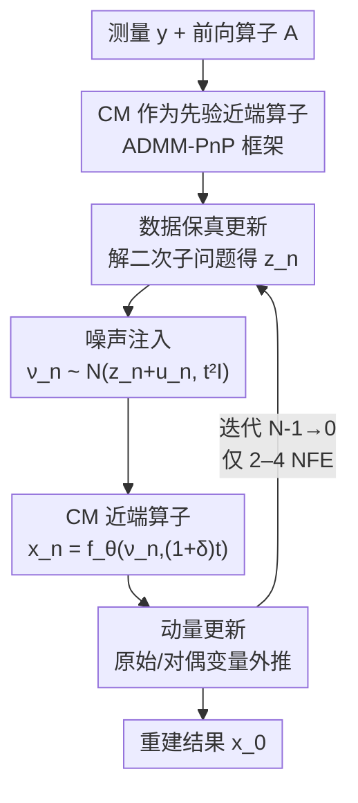

# PnP-CM: Consistency Models as Plug-and-Play Priors for Inverse Problems

**会议**: CVPR 2026  
**论文**: [CVF Open Access](https://openaccess.thecvf.com/content/CVPR2026/html/Gulle_PnP-CM_Consistency_Models_as_Plug-and-Play_Priors_for_Inverse_Problems_CVPR_2026_paper.html)  
**代码**: https://github.com/MerveGulle/PnP-CM  
**领域**: 图像恢复 / 逆问题  
**关键词**: 一致性模型, 逆问题, 即插即用先验, ADMM, MRI 重建

## 一句话总结
把一致性模型（consistency model, CM）重新解释成"先验的近端算子"，塞进 ADMM 形式的即插即用（PnP）框架，再用噪声注入和动量两招把迭代压到 2–4 个神经网络评估（NFE），就能统一求解线性/非线性逆问题，并首次把 CM 训练应用到 MRI 重建。

## 研究背景与动机
**领域现状**：逆问题（去模糊、超分、修复、JPEG 去伪影、相位恢复、MRI 重建）的主流做法是用扩散模型（DM）当先验，把无条件 score 和数据保真项结合起来，沿反向 SDE / 概率流 ODE 采样近似后验 $p(x\mid y)$。质量很好，但典型要几百次 NFE，大规模或实时场景下太慢。

**现有痛点**：为加速，一致性模型把扩散轨迹蒸馏成一个一致性函数 $f_\theta(x_t,t)$，能把 ODE 轨迹上任意一点直接映回干净原点 $x_0$，1–4 次 NFE 就能高质量采样。但现有基于 CM 的逆问题求解器各有硬伤：CoSIGN 要外挂一个 ControlNet 去编码测量算子，每换一种退化都得重训/微调，泛化差；CM4IR 用伪逆 $A^\dagger$ 做反投影来强制测量一致，本质是预条件的近端梯度下降（PGD），对前向算子的条件数很敏感，在高度病态（如多线圈 MRI）下伪逆不稳定、容易放大混叠伪影，也不好扩展到非线性算子。

**核心矛盾**：要"少 NFE 的高效"（CM 的强项），又要"对前向算子条件数鲁棒 + 能统一处理线性/非线性 + 有收敛保证"（PnP/ADMM 的强项），这两套机制此前没有被干净地缝在一起。

**本文目标**：(1) 给 CM 一个能嵌入 PnP 的数学身份；(2) 在 2–4 NFE 的极低迭代预算下还能出高质量重建；(3) 验证这套框架能搬到真实大规模医学成像（MRI）。

**切入角度**：注意到 PnP 的核心操作是"把先验子问题的近端算子换成一个现成去噪器"，而 CM 恰好就是一个"从含噪状态直接预测干净图"的去噪映射——于是可以把 $f_\theta$ 当作先验 $g(\cdot)$ 的近端算子。

**核心 idea**：把 CM 解读为先验的近端算子，放进 ADMM-PnP 的 x-更新里，再加噪声注入 + 动量来弥补极低 NFE 下的性能损失，且证明这两个加速项不破坏 ADMM 的收敛性。

## 方法详解

### 整体框架
逆问题要从退化观测 $y = A(x) + n$ 中恢复干净信号 $x$，其中 $A(\cdot)$ 是（可能非线性的）前向算子，$n$ 是测量噪声。MAP 估计可写成优化形式

$$\arg\min_x\; f(x) + \lambda g(x),$$

其中数据保真项对 i.i.d. 高斯噪声取 $f(x)=\tfrac12\|y-Ax\|_2^2$，$g(\cdot)$ 是先验/正则项。ADMM 通过变量分裂把它拆成三步交替最小化：

$$z^{(k+1)} = \arg\min_z f(z) + \tfrac{\rho}{2}\|z - x^{(k)} + u^{(k)}\|_2^2,$$
$$x^{(k+1)} = \arg\min_x g(x) + \tfrac{\rho}{2}\|z^{(k+1)} - x + u^{(k)}\|_2^2,$$
$$u^{(k+1)} = u^{(k)} + z^{(k+1)} - x^{(k+1)}.$$

其中 z-更新管数据保真、x-更新是先验的近端算子、$u$ 是对偶变量。$g(\cdot)$ 的近端算子通常算不出来，PnP 的做法是把这一步直接换成一个现成去噪器 $D_\sigma$：$x^{(k+1)} = D_{\sigma_k}\!\big(z^{(k+1)} + u^{(k)}\big)$。本文就把这个去噪器实例化为一致性模型 $f_\theta$。

整体一次迭代的流向是：解一个二次的数据保真子问题得到 $z_n$ → 给它注入受控噪声得到 $\nu_n$ → 用 CM 当近端算子做一次去噪得到 $x_n$ → 更新对偶变量 → 对原始变量和对偶变量都做动量外推。算法按扩散/CM 文献惯例用反向迭代序号（从 $N-1$ 数到 0）。

### 关键设计

**1. CM 当作先验的近端算子，塞进 ADMM-PnP：用 ADMM 的二次罚项天然抗病态**

针对"CM4IR 这类基于反投影/PGD 的方法对前向算子条件数敏感"的痛点。PnP 把 ADMM 的 x-更新（先验近端算子）换成去噪器，本文进一步把这个去噪器选成一致性模型 $f_\theta$——因为 CM 本身就是个"把含噪状态映回干净图"的去噪映射，语义上正好对应近端算子。这样选的好处来自 ADMM 数据保真子问题里的二次罚项 $\tfrac{\rho}{2}\|z-\cdots\|^2$：它等价于对数据保真做 Tikhonov 正则，改善了子问题的条件数，使整体对前向算子 $A$ 的病态程度不那么敏感。相比之下，CM4IR 的数据保真基于反投影目标 $\tfrac12\|A^\dagger(y-Ax)\|_2^2$，继承了 $A$ 的条件数依赖；在多线圈 MRI（$m>n$）里 $A^\dagger(Ax-y)$ 退化成 $x-A^\dagger y$，把解推向最小二乘解 $A^\dagger y$，而后者本身就充满混叠伪影。此外 ADMM 实际收敛到中等精度所需迭代数比 PGD 更少，这对"只想跑几步"的逆问题正合适。

数据保真更新对线性算子有闭式解

$$z_n = \big(A^\top A + \rho_{n+1} I\big)^{-1}\big(A^\top y + \rho_{n+1}(\hat x_{n+1} - \hat u_{n+1})\big),$$

可用 SVD 高效求解；大规模问题（如 MRI）改用共轭梯度（CG）避免显式求逆；非线性前向模型则用 GD / Adam 等一阶方法解这个子问题——这也是它能统一覆盖线性与非线性逆问题的原因。

**2. 受控噪声注入：让 CM 在更高噪声水平上工作，且不破坏收敛**

针对"直接把 CM 套进 PnP，在极低 NFE 下发挥不出潜力"的痛点。CM 训练时见的是不同噪声水平的输入，单纯按 PnP 迭代喂给它的输入噪声水平往往偏低、迭代步数又少，性能受限。本文在 CM 的输入上加一个受控扰动，让它在更高噪声水平上运行：

$$\nu_n \sim \mathcal{N}\big(z_n + \hat u_{n+1},\; t_{n+1}^2 I\big),\qquad x_n = f_\theta\big(\nu_n,\,(1+\delta_{n+1})\,t_{n+1}\big),$$

即把 CM 的输入采成以 $z_n+\hat u_{n+1}$ 为均值、方差随时间步 $t$ 的随机样本，并把传给 CM 的时间标签放大成 $(1+\delta)t$。关键是它有收敛保证（Theorem 1）：在 PnP-ADMM 里把去噪器换成 $L$-Lipschitz 的 $D_\sigma$ 并对其输入注入噪声 $\eta_k$，只要噪声序列递减且满足能量界 $\sum_{k=0}^\infty \|\eta_k\|_2 < \infty$，则原本会收敛到不动点的算法注噪后仍收敛。和 CM4IR 用"上一次噪声实例的修正项"不同，本文的噪声是随机生成的，与逆问题领域里的经典做法一致。⚠️ Theorem 1 的完整证明在补充材料，此处只转述结论。

**3. 动量更新：在低 NFE 区间提速**

针对"想把 NFE 压到 2–4 还要保质量"的痛点。动量在梯度下降类算法里常用来加速收敛，在成像 ADMM 里也被证明能减少迭代数。本文给原始变量和对偶变量都加动量外推：

$$\hat x_n = x_n + \mu_{n+1}(x_n - x_{n+1}),\qquad \hat u_n = u_n + \mu_{n+1}(u_n - u_{n+1}),$$

即用相邻两次迭代的差做 Nesterov 式外推。消融显示动量主要在低 NFE 区间见效，NFE 变大后增益递减——这正契合本文"只跑几步"的目标。

### 损失函数 / 训练策略
CM 本身按标准一致性损失训练：对同一张 $x_0$ 的两个独立加噪版本 $(x_t,t)$、$(x_{t'},t')$，要求它们经过 $f_\theta$ 的预测一致，

$$\mathcal{L}_{CM} = \mathbb{E}\big[w(t)\,d\big(f_\theta(x_t,t),\, f_{\theta^-}(x_{t'},t')\big)\big],$$

其中 $w(t)$ 是权重、$d(\cdot,\cdot)$ 是 $\ell_2$ 或 LPIPS 距离、$f_{\theta^-}$ 是 EMA 得到的"教师"网络。可用一致性蒸馏（CD）从已有 DM 蒸馏，也可用一致性训练（CT）直接从数据学。本文对 LSUN Bedroom 直接用现成预训练 CM；对 CelebA-HQ 和 MRI 则先训一个 EDM、再蒸馏成 CM——其中 MRI 用 fastMRI 全部 973 个训练 volume，是 CM 首次被训练并应用到大规模医学成像。注意 PnP-CM 的去噪器是即插即用的，CM 一旦训好，换任意前向算子都不用再训。

## 实验关键数据

### 主实验
自然图像在 256×256 分辨率的 CelebA-HQ 与 LSUN Bedroom 上评测，σ_y=0.05；指标为 PSNR↑ / LPIPS↓。PnP-CM 仅用 4 NFE 就达到或超过需要上千 NFE 的方法。

| 任务 (CelebA-HQ) | 方法 | NFE | PSNR↑ | LPIPS↓ |
|------|------|-----|-------|--------|
| 高斯去模糊 | DPS | 1000 | 25.36 | 0.225 |
| 高斯去模糊 | CM4IR | 4 | 27.30 | 0.297 |
| 高斯去模糊 | **PnP-CM** | **4** | **28.94** | **0.249** |
| 超分 ×4 | CM4IR | 4 | 26.77 | 0.392 |
| 超分 ×4 | **PnP-CM** | **4** | **27.27** | **0.285** |
| 修复 (70%) | DiffPIR | 100 | 30.71 | 0.207 |
| 修复 (70%) | **PnP-CM** | **4** | 29.23 | **0.201** |

MRI 重建（fastMRI，含固有测量噪声）上，PnP-CM 用 4 NFE 全面超过 DPS（1000 NFE）、DDS（100 NFE）、CM4IR（4 NFE）：

| 设置 | 方法 | NFE | PSNR↑ | SSIM↑ |
|------|------|-----|-------|-------|
| Coronal PD, R=8 | DPS | 1000 | 31.88 | 0.863 |
| Coronal PD, R=8 | DDS | 100 | 32.27 | 0.868 |
| Coronal PD, R=8 | CM4IR | 4 | 29.60 | 0.755 |
| Coronal PD, R=8 | **PnP-CM** | **4** | **33.24** | **0.884** |
| Coronal PD-FS, R=8 | **PnP-CM** | **4** | **31.42** | **0.804** |

非线性任务（JPEG 去伪影 QF5、非线性去模糊、相位恢复）上 PnP-CM 用 4–8 NFE 也优于或持平 DPS（1000 NFE）、ΠGDM（100 NFE）、DPnP，例如 CelebA-HQ 的 JPEG 去伪影达到 26.14 / 0.356。

### 消融实验
在 CelebA-HQ、NFE=4、σ_y=0.05 下拆解噪声注入与动量的贡献（PSNR↑ / LPIPS↓）：

| 噪声注入 | 动量 | 超分 ×4 | 高斯去模糊 | 修复 |
|---------|------|---------|-----------|------|
| ✗ | ✗ | 22.93 / 0.461 | 27.26 / 0.427 | 28.69 / 0.295 |
| ✓ | ✗ | 24.25 / 0.300 | 28.89 / 0.251 | 29.13 / 0.204 |
| ✗ | ✓ | 25.97 / 0.469 | 26.59 / 0.453 | 28.72 / 0.293 |
| ✓ | ✓ | **27.27 / 0.285** | **28.94 / 0.249** | **29.23 / 0.201** |

### 关键发现
- 两个加速项都有用，且互补：单看超分 ×4，只加噪声注入 PSNR 从 22.93→24.25，只加动量 →25.97，两者齐上 →27.27；噪声注入对 LPIPS（感知质量）改善尤其大（0.461→0.300）。
- 动量的增益集中在低 NFE 区间，NFE 增大后递减——印证它是为"少步数"量身定制。
- 效率优势极端：PnP-CM 用 4 NFE 就压过 DPS 的 1000 NFE、DPnP 的 2923 NFE、PnP-DM 的 2034 NFE，且在 MRI 这种病态多线圈场景里优势比自然图像更明显（CM4IR 因反投影项退化出现残余混叠）。
- 论文称 2 步也能出有意义结果，4 步达到 SOTA；相位恢复因更难用 N=8。

## 亮点与洞察
- **"CM = 先验近端算子"这个身份转换很巧**：它把 CM 的少步采样和 PnP 的收敛保证缝在一起，且无需任务特定训练——换前向算子不用重训，直接解决了 CoSIGN 那种"每种退化都得微调 ControlNet"的痛点。
- **用 ADMM 的二次罚项对冲前向算子病态**：这是相对 CM4IR（反投影/PGD）的核心理论优势，论文还给出了 MRI 场景下 CM4IR 反投影退化成 $x-A^\dagger y$、必然带混叠的具体推导，说服力强。
- **噪声注入配收敛性定理**：把一个经验性加速技巧（让 CM 在更高噪声水平工作）落到"递减且能量有界即不破坏收敛"的条件上，可迁移到其它 PnP-去噪器组合。
- **首次把 CM 训到 MRI**：证明这套范式能从自然图像搬到真实大规模医学成像，且 4 NFE 就超过 100/1000 NFE 的扩散基线。

## 局限与展望
- 相位恢复仍需 N=8 且绝对质量偏弱（CelebA-HQ 22.18 / 0.422），说明对高度非线性/非凸问题这套框架优势收窄。
- 噪声注入、动量系数、$\rho_n$、$\delta_n$ 等超参较多，敏感性分析放在补充材料；实际换新任务时的调参成本 ⚠️ 正文未充分量化。
- CelebA-HQ 和 MRI 的 CM 需从头训（先 EDM 再蒸馏），对没有预训练 CM 的新模态有一定门槛。
- 收敛定理基于去噪器 $L$-Lipschitz 假设，而神经网络去噪器是否严格满足该假设、$L$ 实际多大，⚠️ 以原文/补充材料为准。

## 相关工作与启发
- **vs CM4IR**：都用 CM 做逆问题且都是 4 NFE，但 CM4IR 用伪逆反投影强制测量一致，对前向算子条件数敏感、病态时不稳定、难扩到非线性；PnP-CM 用 ADMM 二次罚项改善条件数，统一覆盖线性/非线性，MRI 上 PSNR 大幅领先（如 Coronal PD R=8：33.24 vs 29.60）。
- **vs CoSIGN**：CoSIGN 外挂 ControlNet 编码测量算子，每种退化要重训；PnP-CM 即插即用，CM 训一次换任意算子都不用动。
- **vs DPS / DiffPIR / DPnP / PnP-DM（DM-based）**：这些靠扩散先验质量高但要 100–2900+ NFE；PnP-CM 用 4 NFE 取得相当或更好的质量与感知指标，效率高两三个数量级。
- **vs 经典 PnP**：经典 PnP 用现成 CNN 去噪器，本文把去噪器升级成一致性模型，兼得生成式先验的表达力和少步推理。

## 评分
- 新颖性: ⭐⭐⭐⭐ "CM 当先验近端算子嵌入 ADMM-PnP" 的视角干净且实用，但每个组件（CM、PnP、噪声注入、动量）单独都已有，胜在缝合得当。
- 实验充分度: ⭐⭐⭐⭐ 覆盖 6 类线性/非线性逆问题 + 真实 MRI，对比基线齐全，消融清楚；超参敏感性主要藏在补充材料。
- 写作质量: ⭐⭐⭐⭐ 算法、公式、收敛定理交代清晰，MRI 中 CM4IR 退化的推导很有说服力。
- 价值: ⭐⭐⭐⭐⭐ 4 NFE 达 SOTA + 即插即用 + 首次落地 MRI，对实时/大规模逆问题求解很有实用价值。

<!-- RELATED:START -->

## 相关论文

- [\[CVPR 2026\] GSNR: Graph Smooth Null-Space Representation for Inverse Problems](gsnr_graph_smooth_null_space_representation_for_inverse_problems.md)
- [\[CVPR 2026\] Variational Garrote for Sparse Inverse Problems](variational_garrote_for_sparse_inverse_problems.md)
- [\[CVPR 2026\] Outlier-Robust Diffusion Solvers for Inverse Problems](outlier-robust_diffusion_solvers_for_inverse_problems.md)
- [\[CVPR 2025\] FiRe: Fixed-points of Restoration Priors for Solving Inverse Problems](../../CVPR2025/image_restoration/fire_fixed-points_of_restoration_priors_for_solving_inverse_problems.md)
- [\[ICML 2026\] Learning Normalized Energy Models for Linear Inverse Problems](../../ICML2026/image_restoration/learning_normalized_energy_models_for_linear_inverse_problems.md)

<!-- RELATED:END -->
