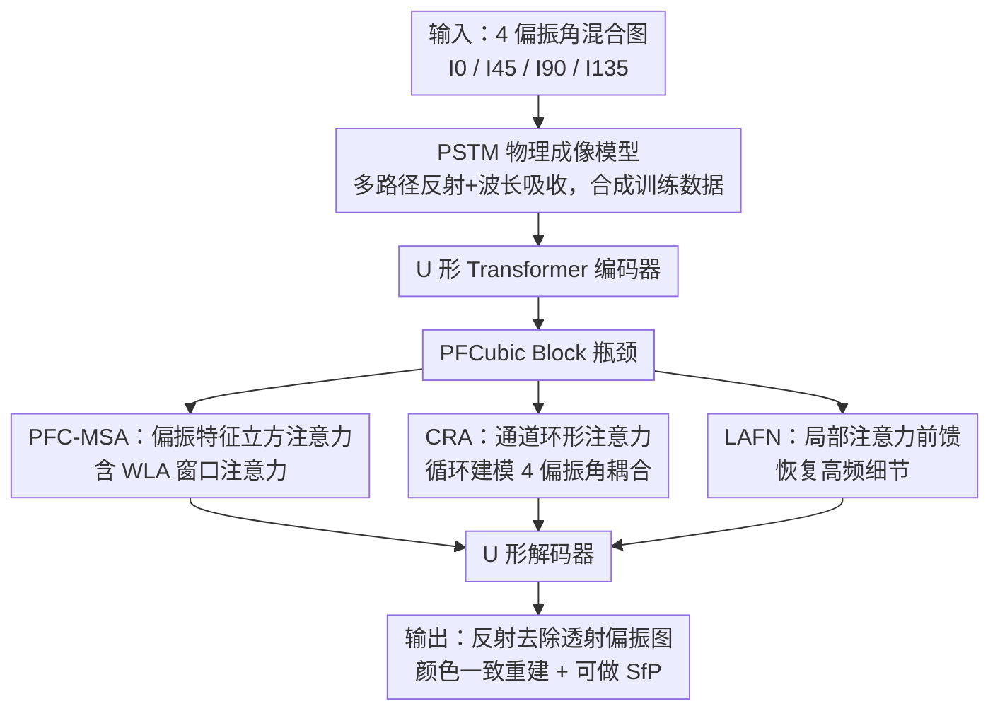

# Polarization State Tracing for Reflection Removal and Color-Consistent Reconstruction

**会议**: CVPR 2026  
**论文**: [CVF Open Access](https://openaccess.thecvf.com/content/CVPR2026/html/Wang_Polarization_State_Tracing_for_Reflection_Removal_and_Color-Consistent_Reconstruction_CVPR_2026_paper.html)  
**代码**: 无  
**领域**: 图像恢复 / 偏振成像 / 反射去除  
**关键词**: 偏振成像、彩色玻璃、反射去除、颜色一致重建、Stokes-Muller 物理建模

## 一句话总结
针对"透过彩色玻璃拍照会出现重影 + 颜色偏色"这一被忽视的退化问题，本文首次把偏振成像理论引入建模，提出物理成像模型 PSTM（追踪偏振光多路径传播 + 波长选择性吸收）并据此设计带 Channel Ring Attention 的偏振感知网络 PANet，在自建真实数据集 GlassPol 上比现有 SOTA 最高提升约 3dB PSNR，同时恢复出颜色保真的透射场景。

## 研究背景与动机

**领域现状**：单图反射去除（single image reflection removal）的主流做法是把观测图当成"反射层 + 透射层"的线性叠加，再用平滑先验、梯度稀疏先验或深度网络去做层分离；少数偏振方法则把偏振当作辅助加权信号来压制反射。

**现有痛点**：这些方法都默认反射层有"单一、一致的外观"，并主要依赖 RGB 强度线索。但透过**彩色玻璃**拍摄时会出现一个特殊现象——画面里同时出现两层几何几乎相同、但颜色和强度不同的反射重影（ghost shadow），而且整张图带明显偏色（color bias）。这说明光在玻璃内部经历了多次反射和波长选择性衰减，观测图早已不是简单的两层混合，RGB 域里这两层根本分不开。作者实测 DExNet、DSRNet 这类最强的 RGB 方法，以及基于扩散+偏振的 PolarFree，在这种场景下都失败。

**核心矛盾**：彩色玻璃的退化本质是"多次内部反射 + 波长选择性吸收"的物理过程，而现有方法**忽略了吸收效应**，只在空间域（RGB）做层分离——这两层在空间域不可分，但在偏振域可分。

**本文目标**：把彩色玻璃退化当作一个全新、未解的问题，要同时做到两件事：去掉反射重影、以及恢复被玻璃染色扭曲的真实颜色。

**切入角度**：与其在 RGB 上硬分层，不如直接对完整的光学反射—透射—吸收过程建物理模型，再让网络在这个物理模型指导下、利用偏振线索去恢复。

**核心 idea**：用一个能追踪偏振态演化的物理成像模型（PSTM）替代 RGB 层分离假设，把反射、透射、波长吸收统一成一个物理过程，再用偏振感知网络在该模型约束下联合完成反射去除与颜色一致重建。

## 方法详解

### 整体框架
方法由两部分构成：一个**物理成像模型 PSTM**（用来解释退化、并合成物理一致的训练数据），和一个**偏振感知重建网络 PANet**（在 PSTM 指导下做实际恢复）。PANet 输入是相机在 0°/45°/90°/135° 四个偏振角下拍到的混合图 $\{I_0, I_{45}, I_{90}, I_{135}\}$，输出对应的反射去除后透射偏振图 $\{\hat T_0, \hat T_{45}, \hat T_{90}, \hat T_{135}\}$；它采用 U 形 Transformer 编解码骨干，并把四个偏振角作为独立特征维度保留，从而在角度—空间上联合推理。网络瓶颈处放了核心模块 **PFCubic Block**，内部有两条互补支路：全局偏振注意力支路 **PFC-MSA**（含 WLA 与 CRA）和局部细化支路 **LAFN**，分别对应 PSTM 里"偏振态全局传播"与"局部吸收变化"两种物理效应。

### 关键设计

**1. PSTM 偏振态追踪成像模型：把彩色玻璃退化写成可推导的物理过程**

这是全文的物理地基，直接针对"现有方法忽略吸收、在空间域分不开两层重影"的痛点。PSTM 把玻璃建模成厚度 $t$、折射率 $n$ 的平面介质板，对 RGB 三通道分别赋予波长选择性吸收系数 $\beta_\lambda=\{\beta_r,\beta_g,\beta_b\}$。光线在前后表面遵循 Snell 定律折射（$n_0\sin\theta_i = n\sin\theta_t$），并在每个界面用 Fresnel 定律把平行/垂直分量组成 Muller 矩阵 $M_R,M_T$，作用在 Stokes 矢量上：$S'=MS$。玻璃内部的吸收按 Beer–Lambert 定律写成对角矩阵 $E(L)=\mathrm{diag}(e^{-\beta_r L}, e^{-\beta_g L}, e^{-\beta_b L})$，其中单次透射光程 $L=t/\cos\theta_t$；内部折射光还会产生横向位移 $\Delta x = 2t\tan\theta_t$，这正是"两层重影几何相近却错位"的来源。最终观测 Stokes 强度被拆成四条物理路径之和 $S=S_R^1+S_T^1+S_R^2+S_T^2$（一阶/二阶反射与透射），高阶项因衰减强被忽略。这个模型不仅解释了重影和偏色，还被直接用来**合成物理一致的训练数据**——作者据此生成 1400/160 训练/测试对，覆盖入射角 $20^\circ\!-\!80^\circ$、厚度 2–10mm。

**2. PFCubic Block 与 PFC-MSA：在"偏振—空间立方体"上做注意力，而不是把偏振当普通通道**

针对"偏振信息被当作辅助加权、角间依赖没被建模"的问题，作者在 U 形骨干的瓶颈放了 PFCubic Block，其全局支路 PFC-MSA（Polarization Feature-Cubic based Multi-head Self-Attention）把堆叠的偏振输入切成一个个"偏振—空间小立方体"，在立方体内同时跨空间位置与偏振通道算注意力，从而自适应建模角间依赖与反射—透射的空间相关。为控制全局自注意力的代价并保持局部一致性，里面又嵌了 **WLA（Window-Level Attention）**：把偏振特征立方切成不重叠的空间窗口，在每个窗口内算注意力，既保住反射图样的局部连贯，又避免全局注意力带来的过平滑。消融显示去掉整个 PFCubic Block 掉点最严重（PSNR 31.11→19.48），说明在"空间 + 角间"双域里建模偏振立方表示是网络成败的关键。

**3. CRA 通道环形注意力：用循环矩阵刻画四个偏振角的周期性耦合**

普通通道注意力把通道当成相互独立的特征，但四个偏振角在物理上是耦合的——偏振强度随角度周期变化 $I_\theta=\tfrac12(S_0+S_1\cos 2\theta+S_2\sin 2\theta)$。CRA 据此把角间注意力表示成一个**循环、秩受限的矩阵** $A_{\mathrm{CRA}}\in\mathbb{R}^{4\times4}$，强制偏振方向间的旋转对称，从而同时捕捉相邻偏振角的局部相关与整个偏振周期上的全局一致性。物理上，CRA 可被理解为对 PSTM 中偏振态传播的可学习近似——把多角依赖隐式编码成循环特征交互。消融里去掉 CRA（即 PFC-MSA 受损）PSNR 掉到 25.58，残留反射和光照不均明显，验证了跨通道依赖建模的必要性。

**4. LAFN 局部注意力前馈支路：把被全局注意力抹掉的高频细节补回来**

PFC-MSA 擅长全局偏振一致性，但容易压掉细小纹理。LAFN（Local Attention Feed-forward Network）作为瓶颈内的互补局部支路，自适应聚合邻域偏振响应并按局部空间上下文调制，把高频纹理和局部强度不均（对应 PSTM 里空间变化的吸收/反射残差）重新引回。它对应 PSTM 中"局部吸收变化"那一面，与 PFC-MSA 的"全局传播"在 PFCubic Block 里协同优化。消融去掉 LAFN 后图像变模糊、边缘对比下降（PSNR 25.56），说明局部上下文融合是全局 Transformer 注意力的必要补充。

### 损失函数 / 训练策略
训练目标是 L1（Charbonnier 形式）与 SSIM 损失的加权组合：$\mathcal{L}=\tfrac1N\sum_i\sqrt{(\hat y_i-y_i)^2+\varepsilon^2}+\lambda(1-\mathrm{SSIM}(\hat y,y))$，其中 $\varepsilon=10^{-3}$、$\lambda=0.2$。在单张 RTX A6000 上用 PyTorch 训练，batch size 8，学习率固定 $2\times10^{-4}$，共 600 epoch。训练时只监督透射层，以便和带显式反射估计分支的对比方法公平对齐。

## 实验关键数据

### 主实验
在两个数据集上评测：PSTM 合成集（1400/160 对）和真实集 GlassPol（500/200 对，FLIR 偏振相机拍摄、原始 2448×2042 缩到 256×256）。指标为 PSNR、SSIM、LPIPS，对比 7 个近期方法（2 个偏振法 + 5 个 RGB 法），所有对比方法都在相同数据上重训。

| 数据集 | 指标 | 本文 | 次优 | 说明 |
|--------|------|------|------|------|
| 合成集 | PSNR↑ | **32.80** | 26.83 (IBCLN) | 领先次优近 6dB |
| 合成集 | SSIM↑ | **0.947** | 0.917 (DExNet) | — |
| 合成集 | LPIPS↓ | **0.109** | 0.174 (IBCLN) | 感知质量大幅领先 |
| GlassPol | PSNR↑ | **31.11** | 28.03 (PolarFree) | 比偏振扩散法高约 3dB |
| GlassPol | SSIM↑ | **0.895** | 0.871 (PolarFree) | — |
| GlassPol | LPIPS↓ | **0.094** | 0.118 (PolarFree) | — |

注：摘要所称"最高约 3dB PSNR 提升"主要对应真实集 GlassPol 上相对次优 PolarFree 的 31.11 vs 28.03。

### 消融实验
在真实集 GlassPol 上逐模块去除（PANet 完整 PSNR 31.11 / SSIM 0.895 / LPIPS 0.094）：

| 配置 | PSNR↑ | SSIM↑ | LPIPS↓ | 说明 |
|------|-------|-------|--------|------|
| 完整 PANet | 31.11 | 0.895 | 0.094 | 完整模型 |
| w/o WLA | 26.79 | 0.834 | 0.182 | 去窗口注意力，出现全局结构伪影 |
| w/o CRA | 25.58 | 0.806 | 0.245 | 去通道环形注意力，残留反射、光照不均 |
| w/o LAFN | 25.56 | 0.798 | 0.243 | 去局部支路，图像模糊、边缘弱 |
| w/o PFC-MSA | 22.43 | 0.743 | 0.283 | 去全局偏振注意力，掉点显著 |
| w/o PFCubic Block | 19.48 | 0.684 | 0.324 | 去整个瓶颈模块，掉点最严重 |

### 关键发现
- **PFCubic Block 贡献最大**：去掉它 PSNR 从 31.11 暴跌到 19.48，证明"在空间 + 偏振角双域上建立立方表示"是整套方法的核心，缺了它就无法利用四个偏振通道间的相关性。
- **CRA 与 LAFN 几乎同等重要**：二者单独去掉都掉到约 25.5dB，说明全局角间耦合（CRA）和局部高频细节恢复（LAFN）是互补的两条腿。
- **物理建模带来跨域泛化**：合成集和真实集都领先，作者归因于 PSTM 的物理一致监督；合成图与真实拍摄图视觉高度相似，侧面验证了 PSTM 数据合成的物理正确性。
- **下游可迁移**：恢复出的偏振信息可直接喂给 Shape-from-Polarization (SfP)，混合输入会让预训练 SfP 产生错误法向，而本文去反射后能恢复高精度表面法向。

## 亮点与洞察
- **把经典偏振物理（Stokes/Muller/Fresnel/Beer–Lambert）系统地接进深度反射去除**：不是把偏振当辅助权重，而是用完整光路物理模型同时解释重影（横向位移 $\Delta x$）和偏色（波长选择性吸收 $E(L)$），动机非常具体。
- **物理模型一物两用**：PSTM 既是设计动机来源，又是数据合成器，省去了"彩色玻璃配对数据极难采集"的难题，这个思路可迁移到其他难采数据的退化任务。
- **CRA 的循环矩阵设计很巧**：用 $4\times4$ 循环秩约束矩阵显式编码偏振角的周期对称性，比无结构的通道注意力更契合偏振物理，是可复用的小 trick。
- **首次明确把"彩色玻璃退化"立为独立问题**并配真实 benchmark GlassPol，对后续研究有数据集价值。

## 局限与展望
- 真实集 GlassPol 仅 32 个场景、700 对样本，且统一缩到 256×256，规模和分辨率都偏小，高分辨率/复杂场景泛化性待验证。
- 方法依赖**偏振相机**采集四角偏振图，无法直接用于普通 RGB 单图，落地门槛较高。
- PSTM 忽略三阶及以上内部反射、并假设玻璃光学均匀，对厚玻璃或非均匀/曲面玻璃可能不成立。⚠️ 部分 Muller 矩阵显式形式放在补充材料，正文未给全，复现需参考原文。
- 改进方向：把物理模型扩展到非平面/多层异质玻璃；探索从单张或少角偏振图恢复，降低采集成本。

## 相关工作与启发
- **vs RGB 反射去除（DExNet / DSRNet / IBCLN）**：它们在 RGB 强度域做层分离、缺物理约束，遇到波长选择性透射会过平滑且颜色还原不准；本文用偏振 + 物理模型，在颜色一致性上明显更好。
- **vs 偏振反射去除（Lei et al. / PolarFree）**：Lei 用简化线性分解、忽略吸收；PolarFree 基于扩散+偏振但只做强度归一化、不建模多路径反射，强吸收下仍残留重影偏色。本文显式建模反射—透射—吸收全过程，因而能分开 RGB 域分不开的两层重影。
- **vs 颜色校正/色彩恒常**：传统白平衡假设朗伯面 + 单光源，只能处理光照偏色；当偏色源自成像介质（玻璃波长吸收）时失效，本文专门建模介质的选择性吸收来补这一块。

## 评分
- 新颖性: ⭐⭐⭐⭐⭐ 首次把完整偏振物理成像模型接入反射去除并解决彩色玻璃这一新问题
- 实验充分度: ⭐⭐⭐⭐ 合成+真实双数据集、7 个对比、逐模块消融充分，但真实数据规模偏小
- 写作质量: ⭐⭐⭐⭐ 物理推导清晰、图示完整，少数 Muller 矩阵细节下放补充材料
- 价值: ⭐⭐⭐⭐ 提出新问题 + 新 benchmark + 物理建模思路，对偏振视觉社区有较强参考价值

<!-- RELATED:START -->

## 相关论文

- [\[CVPR 2025\] PolarFree: Polarization-based Reflection-Free Imaging](../../CVPR2025/image_restoration/polarfree_polarization-based_reflection-free_imaging.md)
- [\[CVPR 2026\] LightRR: A Lightweight Network for Single Image Reflection Removal](lightrr_a_lightweight_network_for_single_image_reflection_removal.md)
- [\[CVPR 2026\] VEMamba: Efficient Isotropic Reconstruction of Volume Electron Microscopy with Axial-Lateral Consistent Mamba](vemamba_efficient_isotropic_reconstruction_of_volume_electron_microscopy_with_ax.md)
- [\[CVPR 2026\] Reflection Separation from a Single Image via Joint Latent Diffusion](reflection_separation_from_a_single_image_via_joint_latent_diffusion.md)
- [\[CVPR 2026\] ReflexSplit: Single Image Reflection Separation via Layer Fusion-Separation](reflexsplit_single_image_reflection_separation_via_layer_fusion-separation.md)

<!-- RELATED:END -->
