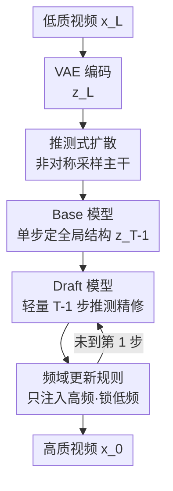

# PS-SR: Pseudo-Single-Step Video Super-Resolution via Speculative Diffusion

**会议**: CVPR 2026  
**论文**: [CVF Open Access](https://openaccess.thecvf.com/content/CVPR2026/html/Wu_PS-SR_Pseudo-Single-Step_Video_Super-Resolution_via_Speculative_Diffusion_CVPR_2026_paper.html)  
**代码**: 无（项目页 https://waq2001.github.io/PS-SR-page/）  
**领域**: 视频超分 / 扩散模型 / 图像恢复  
**关键词**: 视频超分辨率, 推测式扩散, 单步扩散, 频域约束, 计算非对称采样

## 一句话总结
PS-SR 把一个昂贵的多步扩散超分拆成「强 base 模型走 1 步 + 轻量 draft 模型推测式走 T−1 步」的非对称采样，再用频域更新规则强制后续步只注入高频细节、不动低频结构，从而在接近单步模型的速度下拿到多步扩散的画质与细节。

## 研究背景与动机
**领域现状**：视频超分（VSR）长期被「效率 vs 画质」的二选一困住。基于 CNN/轻量 Transformer 的单步模型推理快、能实时，但生成不出高频纹理和细节；多步扩散模型（STAR、SeedVR 等）画质惊艳，可几十步迭代去噪让它在实际部署里慢到不可用。

**现有痛点**：为弥合这道鸿沟，主流做法是把多步扩散蒸馏成单步学生（OSEDiff、SeedVR2、DOVE）。蒸馏能保住相当一部分感知质量，但单步前向那一锤子买卖学不到多步扩散「逐步幻想出合理高频细节」的迭代推理能力——结果学生模型倾向于收敛到更安全、更平均的预测，纹理变糊、创造力下降。

**核心矛盾**：根本矛盾在于，多步扩散的细节创造力来自它**反复迭代**这一行为本身，而单步蒸馏为了快把这个迭代过程压没了。要么慢（多步、有细节），要么糊（单步、丢细节），没有第三条路。

**本文目标**：造一个「看起来像单步、跑起来快、却有多步画质」的伪单步框架——速度对齐单步、输入输出一致性对齐单步，同时保留多步扩散的高频创造力。

**切入角度**：作者借鉴大语言模型里的**推测采样**（speculative sampling）思路——用一个轻量 draft 模型大量"猜"、用一个强 base 模型把关。VSR 里同理：真正决定全局结构的"第一步"最贵也最关键，后面的若干步只是补细节，不必都用大模型跑。

**核心 idea**：让强 base 模型只跑 1 步定下全局结构与语义，剩下 T−1 步交给轻量 draft 模型推测式精修，并用频域规则锁死「后续步只能加高频、不能改低频」，从而在单步成本附近"伪造"出多步扩散的效果。

## 方法详解

### 整体框架
PS-SR 建立在「成对数据流匹配（flow matching）」之上：对低质/高质潜变量对 $(z_L, z_H)$，中间态走一条直线流 $z_t = (1-\sigma_t)z_H + \sigma_t z_L$，模型 $\phi$ 回归把 $z_L$ 推向 $z_H$ 的速度场。PS-SR 把这条流拆成一个**非对称的多模型协作序列**：先由强 base 模型迈一大步，再由轻量 draft 模型走若干小步精修，每步精修都经过频域更新规则过滤。整个生成过程被压缩成一个公式：

$$\hat{x}_H = \left(\prod_{t=1}^{T-1}(I + H \circ \phi_{\text{draft}})\right)\circ \phi_{\text{base}}(x_L)$$

其中 $H$ 是高通滤波、$I$ 是恒等算子（保留低频）。直觉上：$\phi_{\text{base}}$ 负责"画大结构"，后面每一项 $(I + H\circ\phi_{\text{draft}})$ 都只在已有结果上"叠加高频细节"。

### 关键设计

**1. 推测式扩散：把昂贵的多步采样拆成"1 步定调 + T−1 步推测精修"的非对称管线**

这是 PS-SR 的总骨架，直接针对「多步慢、单步糊」的核心矛盾。作者不再让同一个大模型把 T 步全跑完，而是把流匹配序列切成两段。第一段由 base 模型迈一大步，把源潜变量大幅推向目标：

$$z_{T-1} = z_L - (1-\sigma_{T-1})\phi_{\text{base}}(z_L; T), \quad x_{T-1} = E^{-1}\big(z_{T-1} - \sigma_{T-1}\phi_{\text{base}}(z_L; T)\big)$$

这一步建立全局结构和语义内容，是整条流里最关键、信息量最大的一跳。第二段交给轻量 draft 模型走剩下 T−1 步，同步更新潜变量 $z$ 和像素域估计 $x$：

$$z_{t-1} = z_t - (\sigma_t - \sigma_{t-1})\phi_{\text{draft}}(z_t; t), \quad x_{t-1} = x_t + H\circ E^{-1}\big(z_{t-1} - \sigma_{t-1}\phi_{\text{draft}}(z_t; t)\big)$$

关键在于：贵的大模型只调用一次，便宜的小模型多调用几次（实验里 T=4，即 1+3）。因为重活（全局结构）已经被 base 一步搞定，后面只是补细节，用小模型完全够用——这正是 LLM 推测采样"draft 猜、target 核"的思路在扩散上的落地。最终速度逼近单步，却保留了"多步迭代"这个能孕育高频细节的行为本身。

**2. Base 模型：单步重建全局结构，靠 VSD + 对抗 + 两阶段训练逼出感知质量**

base 模型要在**一步扩散**内从低质输入恢复出全局结构与语义，难点是单步 L2 监督天然会过平滑、丢感知质量。作者从 Wan2.1 视频基座模型初始化以继承生成与运动先验，对所有 DiT 块做 LoRA 微调适配 VSR，再用**两阶段训练**把质量逼出来。潜空间阶段除了基础的速度场 L2 损失 $\mathcal{L}_{L2} = \mathbb{E}\|\phi_{\text{base}}(z_L) - (z_L - z_H)\|^2$，还加两味"提质料"：一是**变分得分蒸馏 VSD**，用一个 LoRA 微调版正则器 $\phi'_{\text{reg}}$ 和一个冻结预训练正则器 $\phi_{\text{reg}}$ 的预测差来对齐单步输出与多步教师的分布，$\nabla_\theta \mathcal{L}_{\text{vsd}} = \mathbb{E}_{t,\varepsilon}[\omega(t)(\phi_{\text{reg}}(\hat{z}_t;t) - \phi'_{\text{reg}}(\hat{z}_t;t))\partial\hat{z}_H/\partial\theta]$；二是基于 VGG-16 判别器的**潜空间对抗损失** $\mathcal{L}_{\text{adv}}$ 增强真实感。潜空间收敛后进入像素阶段，去掉 VSD 和对抗以省显存，改用 patch-wise 策略：把预测潜变量裁成小块解码成像素块 $\hat{x}_H^{\text{crop}}$，用 L2 + LPIPS 复合损失 $\mathcal{L}_{\text{pixel}} = \lambda_{L2}\mathbb{E}\|\hat{x}_H^{\text{crop}} - x_H^{\text{crop}}\|^2 + \lambda_{\text{lpips}}\mathcal{L}_{\text{lpips}}$ 对齐真值块。先潜空间稳分布、再像素域抠细节，既保画质又控显存。

**3. Draft 模型：从 base 剪枝来的轻量精修器，靠 base 特征注入补足容量**

要让推测式精修真的便宜，draft 模型必须轻。作者直接从微调好的 base 模型初始化，再**均匀删掉 DiT 块**（实验里 30 块删 20 块）得到一个瘦身版。但剪枝会掉表达能力，所以把 base 对应块的特征沿通道维与 draft 拼接、过一个全连接层恢复隐藏维度——相当于让 draft 在 base 的"语义脚手架"上干活，而不是从零硬扛。与 base 不同，draft 是**全量微调**以适配更复杂的目标，输入插值潜变量 $z_t = \sigma_t z_L + (1-\sigma_t)z_H$ 预测速度场，监督用 L2 + 像素损失 $\mathcal{L}_{\text{draft}} = \lambda_{L2}\mathcal{L}_{L2} + \lambda_{\text{pixel}}\mathcal{L}_{\text{pixel}}$。这里**特意不用 VSD 和对抗损失**——因为 base 已经管了分布层面的对齐，draft 的职责被聚焦到"恢复高频细节"上，分工明确才能既快又出细节。

**4. 频域更新规则（FDU）：强制每步精修只加高频、锁死低频，杜绝语义漂移**

如果放任 draft 自由改写每一步输出，多步精修很容易把 base 定好的低频结构也改了，导致语义漂移、输入输出不一致——这正是很多单步/多步方法刷高 sharpness 指标却偏离原图的根源。FDU 给精修上了"频域护栏"。给定上一步结果 $x_t$ 和当前预测 $\tilde{x}_{t-1}$，都转到 YUV 色彩空间取亮度通道 $Y_t, \tilde{Y}_{t-1}$，用高通滤波 $H$ 取高频分量 $Y^H = H(Y)$。再用一个**自适应权重**平衡新旧高频贡献：

$$w_t = \frac{|\tilde{Y}_{t-1}^H|}{|Y_t^H| + |\tilde{Y}_{t-1}^H|}$$

更新后的高频分量为 $Y_{t-1}^H = \alpha(w_t \tilde{Y}_{t-1}^H + (1-w_t)Y_t^H)$，$\alpha$ 控制精修强度（实验取 0.6）。最后把这份新高频亮度与 $x_t$ 的低频分量、色度通道拼回去再转回 RGB。这样**低频内容始终来自 base 的初始结果，只有高频在多步里被逐步增强**，既保结构一致性又能放心利用多步迭代的创造力——这是 PS-SR 能"伪造单步一致性"的关键机制。

### 损失函数 / 训练策略
- base 模型潜空间总目标：$\mathcal{L}_{\text{latent}} = \lambda_{L2}\mathcal{L}_{L2} + \lambda_{\text{vsd}}\mathcal{L}_{\text{vsd}} + \lambda_{\text{adv}}\mathcal{L}_{\text{adv}}$，权重 $\lambda_{L2}=1, \lambda_{\text{vsd}}=1, \lambda_{\text{adv}}=0.1$；像素阶段 $\lambda_{\text{pixel}}=1, \lambda_{\text{lpips}}=2$。
- 训练数据：YouHQ（约 37K 高质视频片段），低质输入用 RealESRGAN 退化管线合成。
- 实现：VAE 与 base 初始化自 Wan2.1-T2V-1.3B；draft 由 base 剪 20/30 块得到；推测步 $T=4$、精修强度 $\alpha=0.6$、LoRA rank 32；8×A800、batch 8、AdamW、lr $5\times10^{-5}$、像素损失裁 160×160 patch。

## 实验关键数据

### 主实验
在 UDM10、SPMCS、YouHQ40、VideoLQ 四个数据集上对比多步扩散（STAR、SeedVR）与单步扩散方法（DLoRAL、SeedVR2、DOVE）。PS-SR 在还原类指标（SSIM/LPIPS/DISTS）上几乎全面领先，无参考锐度指标（CLIP-IQA/MUSIQ）虽不是最高，但作者指出那些刷高锐度的方法往往偏离低质输入、产生语义漂移。

| 数据集 | 指标 | DOVE(单步) | SeedVR2(单步) | PS-SR(本文) |
|--------|------|-----------|--------------|------------|
| UDM10 | SSIM ↑ | 0.7434 | 0.7349 | **0.7547** |
| UDM10 | LPIPS ↓ | 0.2672 | 0.2587 | **0.2444** |
| UDM10 | DISTS ↓ | 0.1569 | 0.1340 | **0.1277** |
| SPMCS | SSIM ↑ | 0.5802 | 0.5950 | **0.6287** |
| SPMCS | LPIPS ↓ | 0.3727 | 0.3232 | **0.2940** |
| YouHQ40 | LPIPS ↓ | 0.3192 | 0.3100 | **0.3011** |

时序一致性（flow warping error $E^*_{\text{warp}}$ ↓）上 PS-SR 在四个集上均最低（如 UDM10 1.43 vs DOVE 1.79、SeedVR2 4.78），印证它保住了视频扩散基座的运动先验。推理速度（29 帧 720×1280，A800）：

| 方法 | STAR | SeedVR | DLoRAL | SeedVR2 | DOVE | PS-SR |
|------|------|--------|--------|---------|------|-------|
| 步数 | 15 | 50 | 1 | 1 | 1 | 1+3 |
| 时间(s) | 98.61 | 188.93 | 45.48 | 22.36 | 20.43 | **21.11** |

即比最快的单步模型只多约 0.7s，却换来多步级别的细节——"伪单步"名副其实。

### 消融实验
SPMCS 上逐组件消融（Table 3）：

| 配置 | PSNR ↑ | SSIM ↑ | LPIPS ↓ | 说明 |
|------|--------|--------|---------|------|
| Full (Ours) | 22.092 | 0.6287 | 0.2940 | 完整模型 |
| w/o $\mathcal{L}_{\text{vsd}}$ | 22.097 | 0.6333 | 0.3361 | 感知指标 CLIP-IQA/MUSIQ 掉，分布对齐失效 |
| w/o $\mathcal{L}_{\text{adv}}$ | 22.165 | 0.6355 | 0.3448 | 真实感下降 |
| w/o $\mathcal{L}_{\text{pixel}}$ | 22.266 | 0.6340 | 0.3046 | 细节空间精度变差 |
| w/o FDU | 18.661 | 0.5299 | 0.3293 | PSNR/SSIM 暴跌，结构保真崩溃 |

去掉 FDU 后 PSNR 从 22.09 掉到 18.66、SSIM 从 0.629 掉到 0.530，是所有消融里掉点最猛的——印证频域更新规则对"锁低频、保结构"不可或缺；它去掉后无参考感知分（MUSIQ 67.07）反而升高，说明模型确实在"过度发挥"偏离原图。

### 关键发现
- **FDU 是结构保真的命门**：去掉它无参考锐度指标飙升但还原指标崩盘，恰好量化了"刷锐度 ↔ 语义漂移"的取舍，也解释了为何 PS-SR 选择牺牲一点 MUSIQ 换取一致性。
- **采样步数 T 是质量-保真的旋钮**（Table 5）：T=1 时 PSNR/SSIM 最高但感知最弱，步数增多感知质量持续上升、还原指标缓慢下降，作者折中取 T=4；对比基线 T=50 的 PSNR 仅 20.57，说明推测式多步比朴素多步在保真上更稳。
- **draft 剪枝有甜区**（Table 6）：删 0/10/20 块画质几乎不掉（MUSIQ 61.5→61.0），删到 25 块才明显掉（CLIP-IQA 0.335、MUSIQ 56.9），所以 20/30 是速度与质量的平衡点。
- 人工评测（20 人 × 20 视频）中 PS-SR 对各 baseline 的 win 率普遍占优（vs SeedVR2 78% win）。

## 亮点与洞察
- **把 LLM 推测采样搬到扩散超分**：核心洞察是"VSR 多步里第一步最贵也最关键，后续步只是补细节"，于是大模型只把关一次、小模型推测多次，是一个干净且可迁移的非对称采样范式。
- **频域护栏化解"画质 vs 一致性"**：用高通滤波 + 恒等算子把"低频锁死、只叠高频"写进更新规则，比单纯加一致性损失更硬、更可控，本质上把多步扩散的自由度约束到了安全方向。
- **draft 靠 base 特征注入而非独立训练**：剪枝省算力、再用 base 特征拼接补容量，避免了"轻量化即掉点"的常见陷阱，这个"脚手架特征复用"思路可迁移到其它需要轻量精修头的生成任务。

## 局限与展望
- base 模型严重依赖 Wan2.1 视频基座的生成与运动先验，若换到没有强基座的领域（如医学/遥感视频）效果是否还成立存疑 ⚠️。
- FDU 在 YUV 亮度通道上做高通滤波，对色度高频细节（如彩色纹理边缘）的恢复能力可能受限，论文未深入讨论。
- T、α、剪枝比例均靠经验网格搜索确定，缺乏自适应机制；不同退化强度下最优配置或许不同。
- 评测仍偏合成退化（RealESRGAN 管线），真实世界 VideoLQ 上无参考指标并非全面领先，泛化到更复杂真实退化还有空间。

## 相关工作与启发
- **vs 单步蒸馏（OSEDiff / SeedVR2 / DOVE）**：它们把多步教师压成单步前向，丢了迭代推理带来的高频创造力；PS-SR 保留"多步迭代"这一行为本身，只是让其中绝大多数步由轻量 draft 承担，既快又不丢迭代红利。
- **vs 多步扩散（STAR / SeedVR）**：它们靠几十步去噪拿画质但慢到不可用（SeedVR 188s）；PS-SR 用 1+3 步在 21s 内拿到可比甚至更优的还原质量。
- **vs 朴素流匹配超分**：PS-SR 不让同一模型均匀走完所有步，而是非对称分工 + 频域约束，把"哪一步该用大模型、哪一步只该加高频"显式地结构化，比统一管线更省也更稳。

## 评分
- 新颖性: ⭐⭐⭐⭐⭐ 把推测采样 + 频域约束引入视频超分，"伪单步"范式构思巧妙且自洽。
- 实验充分度: ⭐⭐⭐⭐⭐ 四数据集、多指标、时序一致性、人工评测、步数/剪枝/强度全套消融。
- 写作质量: ⭐⭐⭐⭐ 公式与图示清晰，但部分符号（YUV 高频更新）需对照图才好懂。
- 价值: ⭐⭐⭐⭐⭐ 直击 VSR 效率-画质核心矛盾，逼近单步速度拿多步画质，落地价值高。

<!-- RELATED:START -->

## 相关论文

- [\[CVPR 2026\] GDPO-SR: Group Direct Preference Optimization for One-Step Generative Image Super-Resolution](gdpo-sr_group_direct_preference_optimization_for_one-step_generative_image_super.md)
- [\[CVPR 2026\] Time-Aware One Step Diffusion Network for Real-World Image Super-Resolution](time-aware_one_step_diffusion_network_for_real-world_image_super-resolution.md)
- [\[CVPR 2026\] STCDiT: Spatio-Temporally Consistent Diffusion Transformer for High-Quality Video Super-Resolution](stcdit_spatio-temporally_consistent_diffusion_transformer_for_high-quality_video.md)
- [\[CVPR 2026\] FiDeSR: High-Fidelity and Detail-Preserving One-Step Diffusion Super-Resolution](fidesr_high-fidelity_and_detail-preserving_one-step_diffusion_super-resolution.md)
- [\[CVPR 2026\] Bridging Fidelity-Reality with Controllable One-Step Diffusion for Image Super-Resolution](bridging_fidelity-reality_with_controllable_one-step_diffusion_for_image_super-r.md)

<!-- RELATED:END -->
