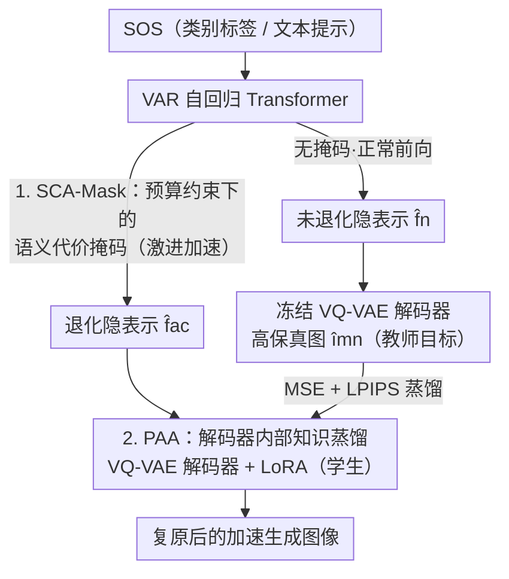

# RADAR: VQ-VAE Decoder of VAR is a Good Student for Restoring Against Degradation by Acceleration

**会议**: CVPR 2026  
**论文**: [CVF Open Access](https://openaccess.thecvf.com/content/CVPR2026/html/Wang_RADAR_VQ-VAE_Decoder_of_VAR_is_a_Good_Student_for_CVPR_2026_paper.html)  
**代码**: 无  
**领域**: 图像恢复 / 视觉自回归生成 / 推理加速  
**关键词**: VAR 加速, 注意力掩码, 知识蒸馏, VQ-VAE 解码器, LoRA

## 一句话总结
针对视觉自回归（VAR）模型加速后隐表示退化、图像质量下降的问题，本文提出两段式框架 RADAR：先用语义代价感知掩码（SCA-Mask）把注意力剪枝转成"预算约束下保留最多语义信息"的优化问题，再用后加速适配（PAA）——只给 VQ-VAE 解码器挂一个 LoRA、用未加速分支做教师做内部知识蒸馏，把退化的隐表示重新还原成高保真图像；在 ImageNet-1K 上实现约 1.6–1.9× 提速且 FID 几乎无损（VAR-d20 从退化的 5.02 复原到 2.68，原始为 2.61）。

## 研究背景与动机
**领域现状**：视觉自回归建模（VAR）用"由粗到细的下一尺度预测"取代传统逐 token 光栅扫描，让 GPT 式 Transformer 首次在图像生成上超过扩散模型，并迅速衍生出文生图（Infinity）、图像编辑、多模态理解（VARGPT）等一整套生态。

**现有痛点**：VAR 推理仍然慢，主流加速思路都是在注意力层加掩码——要么剪掉对最终图像影响小的待生成 token，要么压缩每步用到的上下文 token。但给 VAR 设计"该剪哪里"的掩码异常困难：每一步并行预测一整个新尺度、且最初的粗尺度会持续影响整张图。作者实测注意力图呈现两种强偏置——**粗尺度注意力汇聚（attention sink）**（早期尺度 token 吸走过高权重，类似 streamingLLM）和**强空间局部性**（每个尺度内注意力近似对角块结构）。这意味着剪掉不同位置/步/尺度的注意力，对画质的伤害是**非均匀**的。

**核心矛盾**：现有方法（LiteVAR 看对角模式手搓掩码、HACK 手动把注意力头分两组）靠启发式归纳偏置简化掩码设计，**缺一个量化判据**来衡量"剪枝/压缩到底损失了多少语义"，于是加速与质量的 trade-off 无法被显式优化——"加速到底要付出什么代价"说不清楚。更关键的是，现有方法几乎只盯着加速自回归 Transformer，**完全忽略了解码器**：Transformer 一旦被激进加速，喂给 VQ-VAE 解码器的隐序列必然退化，而要修复就得花大量 GPU-hours 重训整个大 Transformer（如 MVAR）。

**切入角度**：作者注意到 VQ-VAE 解码器只有约 100M 参数、占整体推理延迟比例不大，却被前人长期忽视；而它本身具备很强的视觉建模能力（在 Token-Opt 里甚至能脱离 Transformer 独立生成有意义图像）。既然解码器是"隐序列 → 像素"的最后一站，那能不能**让小而强的解码器去当学生，专门学习如何把退化隐表示还原回高保真图像**？

**核心 idea**：用"可优化的语义代价掩码（决定剪多狠）+ 解码器侧轻量蒸馏适配（修复剪坏的部分）"两段式替代"手搓掩码 + 重训大 Transformer"，得到一条数据无关、低成本、trade-off 友好的 VAR 加速路径。

## 方法详解

### 整体框架
RADAR 把 VAR 加速拆成**前后两段、各管一件事**：第一段在自回归 Transformer 侧用 SCA-Mask 做"敢剪"——在给定算力/显存预算下自动算出一张保留语义最多的注意力掩码，激进剪枝换取吞吐；第二段在 VQ-VAE 解码器侧用 PAA 做"能修"——通过一次双分支前向的内部知识蒸馏，给冻结的解码器挂上 LoRA，专门学习把被剪枝弄退化的隐表示还原成高保真图像。两段都不需要重训庞大的自回归 Transformer，也不需要任何外部图像数据。

整体数据流是：输入（类别标签或文本提示的 SOS token）经过 VAR Transformer，正常分支产出未退化隐表示 $\hat{f}_n$、加速分支（带 SCA-Mask）产出退化隐表示 $\hat{f}_{ac}$；前者经原始冻结解码器得到高保真图 $\hat{im}_n$ 当教师目标，后者经"解码器 + LoRA"学生还原。测试时只保留加速分支这一条，所以 PAA 不增加任何推理开销。

### 关键设计

**1. SCA-Mask：把"剪哪里"从手搓掩码变成预算约束下的语义保留优化**

这一设计针对"加速到底要付出什么代价说不清、trade-off 无法显式优化"的痛点。作者从第一性原理出发：注意力的价值（也是冗余来源）在于让图像不同局部区域交换信息，所以**一个区域的语义重要性 = 它与其他区域交换信息的频次**。具体做法是把每个注意力矩阵切成与 GPU 计算粒度对齐的 tile（如 64×64 或 128×128），当一个 tile-to-tile 的平均 token 注意力分数超过阈值 $\tau$ 就记为一次"有效交互"，在整条生成流程上累加两类分数：

$$\text{Score}_Q(\text{tile}_{i,j}) = \sum_{k=1}^{K} T^{Q}_{ijk}, \qquad \text{Score}_{KV}(\text{tile}_{i,j}) = \sum_{k=1}^{K} T^{KV}_{ijk}$$

其中 $k$ 索引生成步、$K$ 为总步数；$T^{Q}_{ijk}$ 是该 tile 中其 query 有效注意到其他 tile 的 token 数（衡量它作为"发问方"的活跃度），$T^{KV}_{ijk}$ 是其 key/value 被其他 tile 有效查询的 token 数（衡量它作为"上下文方"的活跃度）。有了语义分数，掩码设计被写成一个预算约束优化：令 $x_{ij}\in\{0,1\}$ 表示是否保留 $\text{tile}_{i,j}$ 的注意力计算、$y_{ij}\in[0,1]$ 表示保留多少比例的 KV 进 cache，则

$$\max_{x,y}\ \alpha \sum_{i,j}\text{Score}_Q(\text{tile}_{i,j})\,x_{ij} + \beta \sum_{i,j}\text{Score}_{KV}(\text{tile}_{i,j})\,y_{ij}$$

约束为 $\sum_{i,j} c_{ij} x_{ij}\le C_{budget}$、$\sum_{i,j} m_{ij} y_{ij}\le M_{budget}$。这个目标在"算力预算 $C_{budget}$ + 显存预算 $M_{budget}$"下最大化保留的语义内容（等价于最小化上下文损失），把预算调小就自动得到更激进的加速。由于现代 GPU 上掩码前每个 tile 的 FLOPs/显存近似相等（$c_{ij}\approx c$、$m_{ij}\approx m$），约束退化为简单的"保留 tile 数 ≤ 预算"，可在推理前用一小批（约 50K 图，类条件任务每类 50 张）一次性求解出混合整数规划，推理时直接套用：被掩 tile 跳过注意力计算、其 KV 按比例压缩。这就是"敢剪"——剪枝强度可控、且每一刀都尽量保住高语义价值的 tile。

**2. PAA：让小解码器当学生，用内部知识蒸馏把退化隐表示还原回高保真**

这一设计针对"加速后隐表示退化、而修复它要昂贵重训大 Transformer"的痛点。核心是一次**双分支前向**：对同一个 SOS token，VAR Transformer 先做无掩码正常前向得到 $\hat{f}_n$、再做带 SCA-Mask 的加速前向得到退化的 $\hat{f}_{ac}$；冻结解码器解码 $\hat{f}_n$ 得到高保真图 $\hat{im}_n$（教师输出），同一解码器**并联一个 LoRA** 后解码 $\hat{f}_{ac}$ 得到学生输出 $\hat{im}_{ac}$，训练目标是让学生对齐教师：

$$\hat{f}_n = \text{VAR}(\text{sos};\,\text{normal}),\quad \hat{f}_{ac} = \text{VAR}(\text{sos};\,\text{accelerated})$$
$$\hat{im}_n = \text{Dec}(\hat{f}_n),\quad \hat{im}_{ac} = \text{Dec}(\hat{f}_{ac};\,W+\Delta W)$$
$$\mathcal{L}_{KD} = \lambda_m \mathcal{L}_{MSE}(\hat{im}_n,\hat{im}_{ac}) + \lambda_p \mathcal{L}_{LPIPS}(\hat{im}_n,\hat{im}_{ac})$$

其中 $\Delta W = \frac{\alpha}{r}BA$ 是低秩 LoRA 增量、加到冻结解码器权重 $W$ 上，损失结合像素级 MSE 与感知 LPIPS。整个过程**只有 LoRA 可学**，VAR 所有 block 与解码器权重全部冻结。这本质是一次内部知识蒸馏（IKD）：未加速分支 + 原始解码器是教师，加速分支 + LoRA 解码器是学生，最小化 $\mathcal{L}_{KD}$ 就让 LoRA 学会补偿加速带来的退化。它比原版 IKD（用整个 BERT 当教师自蒸馏）更轻：**数据无关**（教师目标由 SOS/提示词在线生成，不需任何外部图像）、只需少量 LoRA 迭代、双分支复用同一套冻结模型使峰值显存几乎与标准 VAR 推理相同；测试时丢掉教师分支，零额外推理开销，且因为是即插即用，可直接挂到 FastVAR / ScaleKV / SkipVAR 等现有加速方法上做质量补偿。

### 损失函数 / 训练策略
PAA 用 AdamW、基础学习率 3e-6、weight decay 1e-5，对 VQ-VAE 解码器微调 10k 次迭代并配早停防灾难性遗忘；每 GPU batch size 16（梯度累积保证稳定）。蒸馏损失为 MSE + LPIPS 的加权组合（$\lambda_m,\lambda_p$）。SCA-Mask 侧无需训练，是推理前一次性求解的混合整数规划。

## 实验关键数据

### 主实验
在 ImageNet-1K 类条件生成上（单卡 RTX 5090，FlexAttention，未用 FlashAttention/FP16），把 VAR 的算力预算砍 50%、显存预算砍约 40% 得到"退化版"，再叠加 RADAR 复原：

| 模型 | FID↓ | IS↑ | Precision↑ | Recall↑ | 吞吐↑ |
|------|------|-----|-----------|---------|-------|
| VAR-d20 | 2.61 | 295.3 | 0.83 | 0.54 | 51.4 it/s |
| VAR-d20 退化版 | 5.02 | 269.8 | 0.78 | 0.51 | 94.4 it/s |
| VAR-d20 + RADAR | 2.68 | 293.1 | 0.83 | 0.54 | 92.7 it/s (1.92×) |
| VAR-d24 退化版 | 4.29 | 275.5 | 0.69 | 0.53 | 57.8 it/s |
| VAR-d24 + RADAR | 2.19 | 298.2 | 0.83 | 0.56 | 57.9 it/s (1.80×) |
| VAR-d30 退化版 | 3.58 | 283.4 | 0.80 | 0.52 | 38.9 it/s |
| VAR-d30 + RADAR | 2.01 | 306.2 | 0.85 | 0.58 | 35.7 it/s (1.57×) |

RADAR 在保住约 1.6–1.9× 吞吐的同时，把退化掉的 FID 几乎完全拉回原始水平（d20: 5.02→2.68 vs 原 2.61），Precision/Recall 也恢复到与原始 VAR 相当甚至更高。与现有加速方法横比（基于文生图 Infinity，GenEval 指标）：

| 方法 | 吞吐↑ | FID↓ | GenEval↑ |
|------|-------|------|----------|
| Infinity | 1.32 it/s | 19.61 | 0.73 |
| + ScaleKV | 1.87 it/s | 22.45 | 0.64 |
| + FastVAR | 1.98 it/s | 26.44 | 0.60 |
| + RADAR | 2.08 it/s | 22.97 | 0.69 |

RADAR 在最高吞吐下仍保住最好的 GenEval（0.69，逼近原始 0.73），FID 也优于 FastVAR。此外把模块用到 VARGPT-v1.1（SCA-Mask 用于视觉编码器与 LLM、PAA 集成进 LM head 与顶层），在 GQA/TextVQA/VQAv2 上以 1.6× 提速换来仅边际的性能下降，仍超过 Qwen-VL-Chat、LLaVA-1.5 等模型，说明方法不止能加速图像合成，也能延伸到多模态理解。

### 消融实验
VAR-d20 @256×256，10 次平均：

| 配置 | FID↓ | GFLOPs↓ | 延迟(ms)↓ | 说明 |
|------|------|---------|-----------|------|
| Vanilla VAR | 2.61 | 81.25 | 5458±57 | 原始基线 |
| + SCA-Mask | 5.02 | 64.47 | 2895±88 | 只剪枝：FLOPs/延迟近乎减半，但 FID 大幅恶化 |
| + PAA | 2.88 | 81.44 | 5403±48 | 只蒸馏（无加速）：略降，因无加速分支可当教师 |
| + full RADAR | 2.68 | 64.47 | 2964±84 | 剪枝+蒸馏：延迟≈减半且 FID 几乎复原 |

### 关键发现
- **加速增益全来自 SCA-Mask，质量恢复全靠 PAA，二者必须合用**：单用 SCA-Mask 把 FLOPs 从 81.25 降到 64.47、延迟从 5458ms 砍到 2895ms，但 FID 从 2.61 崩到 5.02；单用 PAA（不加速）反而略掉点（2.61→2.88），因为没有"加速 vs 正常"的差异就没有有效的教师信号。两者合用才同时拿到提速与质量。
- **PAA 不引入推理开销**：full RADAR 的延迟（2964ms）与只用 SCA-Mask（2895ms）几乎一致，证明 LoRA 学生在推理时几乎零成本。
- **极省 GPU-hours**：相比需要重训的 MVAR，RADAR 在更高加速比下消耗 **超过 20×** 更少的 GPU 小时（图 8 相对指标：MVAR 提速 1.3× 耗时 0.4，RADAR 提速 1.9× 耗时仅 0.02），主因是 VQ-VAE 解码器前向远快于 VAR block，加上 PAA 本身轻量。
- **即插即用补偿**：把 PAA 接到 FastVAR/ScaleKV/SkipVAR 上（图 7，GenEval 性能百分比），都能把激进加速造成的不可逆退化压回有限范围（如 FastVAR 73.0% 损失 → w/ PAA 显著回升）。

## 亮点与洞察
- **"解码器当学生"是被忽视的免费午餐**：前人都盯着重训大 Transformer，本文反其道——VQ-VAE 解码器小（~100M）、快、表达力强，专门训它去"修复退化隐表示"，用 20× 更少的算力换到同等质量。这是个很可迁移的视角：当上游被激进压缩/量化时，与其重训上游，不如让下游小模块学一个"纠偏映射"。
- **把启发式掩码设计形式化成预算约束优化**：用"信息交换频次"定义 tile 语义分数、再写成混合整数规划，让加速强度由 $C_{budget}/M_{budget}$ 一个旋钮显式控制，回答了"加速代价几何"这个前人答不清的问题。
- **数据无关蒸馏**：教师目标全由 SOS/提示词在线生成，双分支复用同一套冻结模型，峰值显存≈标准推理，工程上极易落地。
- **跨任务即插即用**：同一对模块既能加速类条件/文生图合成，又能用到多模态理解（VARGPT），说明"剪 + 修"范式不绑定具体生成任务。

## 局限与展望
- **依赖"未加速分支"产生教师信号**：PAA 必须跑一遍正常前向当教师，训练时双分支前向比单分支贵（虽然测试时丢掉）；若加速极端到正常分支也无法提供有意义目标，蒸馏会失效。
- **掩码求解需校准数据**：SCA-Mask 的语义分数要在约 50K 图的子集上统计累加，换数据域/任务时这套统计是否仍代表性，文中未深入讨论 ⚠️。
- **复原非无损、且加速比随模型增大递减**：d20 能 1.92×、d30 只 1.57×，FID 仍有微小残差（如 d20 2.68 vs 原 2.61）；图 7 也承认存在"不可逆退化"只能被约束而非消除。
- **阈值 $\tau$ 与 $\alpha,\beta,\lambda_m,\lambda_p$ 等超参的敏感性**论文未给系统性分析，实际部署可能需要调。

## 相关工作与启发
- **vs LiteVAR / HACK（手搓掩码）**：它们靠观察对角注意力模式或手动分注意力头来简化掩码设计，缺量化判据；RADAR 用 tile 语义分数 + 预算约束优化自动求最优掩码，加速强度可显式控制。
- **vs FastVAR / ScaleKV / SkipVAR（其他加速）**：这些只在 Transformer 侧做 token 选择/上下文压缩、且不补偿解码器侧退化；RADAR 不仅给出更优 trade-off（同等吞吐下 GenEval/FID 更好），其 PAA 还能即插即用反过来给它们做质量补偿。
- **vs MVAR（重训式）**：MVAR 靠重训自回归 Transformer 适配加速，耗费大量 GPU-hours；RADAR 只训解码器侧的 LoRA，省 20× 算力还拿到更高加速比。
- **启发**：把昂贵上游的"加速/量化/剪枝退化"问题，转化为给廉价下游模块做一次数据无关的内部知识蒸馏纠偏——这个思路可迁移到任何"大编码器 + 小解码器"或"重 backbone + 轻 head"的级联系统。

## 评分
- 新颖性: ⭐⭐⭐⭐ 首次把解码器当"修复退化的学生"、并将掩码设计形式化为预算约束优化，视角新但两块组件（约束剪枝 + LoRA 蒸馏）均有成熟前身
- 实验充分度: ⭐⭐⭐⭐ 覆盖三种 VAR 深度 + 文生图 + 多模态 VQA + 与重训/无补偿基线对比，消融清晰；但超参敏感性与跨域稳健性略欠
- 写作质量: ⭐⭐⭐⭐ 动机（两种注意力偏置→非均匀剪枝代价）与方法叙述清楚，图 3 把四类方法对比讲得很直观
- 价值: ⭐⭐⭐⭐ 数据无关、低成本、即插即用，对部署 VAR 类生成模型有直接实用价值

<!-- RELATED:START -->

## 相关论文

- [\[CVPR 2026\] DRFusion: Degradation-Robust Fusion via Degradation-Aware Diffusion Framework](drfusion_degradation_robust_fusion_via_degradation_aware_diffusion_framework.md)
- [\[CVPR 2026\] Degradation-Robust Fusion: An Efficient Degradation-Aware Diffusion Framework for Multimodal Image Fusion in Arbitrary Degradation Scenarios](degradation-robust_fusion_an_efficient_degradation-aware_diffusion_framework_for.md)
- [\[ICML 2025\] ε-VAE: Denoising as Visual Decoding](../../ICML2025/image_restoration/epsilon-vae_denoising_as_visual_decoding.md)
- [\[CVPR 2026\] RAW-Domain Degradation Models for Realistic Smartphone Super-Resolution](rawdomain_degradation_models_smartphone_sr.md)
- [\[CVPR 2026\] Degradation-Consistent Test-Time Adaptation for All-in-One Image Restoration](degradation-consistent_test-time_adaptation_for_all-in-one_image_restoration.md)

<!-- RELATED:END -->
