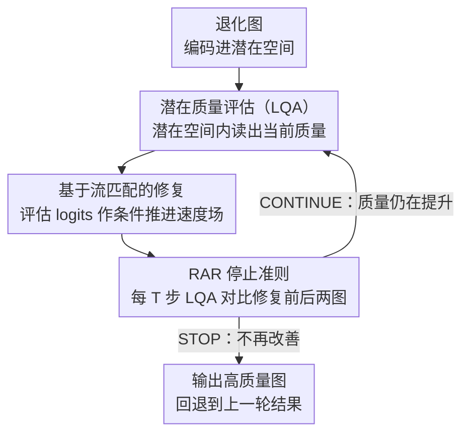

# RAR: Restore, Assess, Repeat - A Unified Framework for Iterative Image Restoration

**会议**: CVPR 2026  
**arXiv**: [2603.26385](https://arxiv.org/abs/2603.26385)  
**代码**: [https://restore-assess-repeat.github.io/](https://restore-assess-repeat.github.io/)  
**领域**: 图像修复  
**关键词**: 图像修复, 图像质量评估, 迭代修复, 复合退化, 流匹配

## 一句话总结

RAR 将图像质量评估（IQA）与图像修复（IR）深度集成为统一端到端模型，在潜在空间中迭代执行"评估-修复-验证"循环，在复合退化场景下 PSNR 提升 +2.71 dB 且速度比 AgenticIR 快 11.27×。

## 研究背景与动机

真实场景中图像退化复杂且未知，可能同时包含模糊、噪声、雨雾等多种退化。现有方案分两类：All-in-one 模型（统一模型处理多种退化，但性能受限）和 Agentic 模型（智能体迭代选择专用工具，效果好但极慢）。

**核心矛盾**：All-in-one 模型缺乏对退化的精准识别能力，而 Agentic 模型的 IQA 和 IR 模块完全割裂——需要图像反复编解码、LLM 规划决策，流程臃肿且信息损失大。

**本文切入**：取两者之长——使用 VLM-based 自由文本 IQA（不限于预定义退化类别）+ 将 IQA 和 IR 深度集成到同一潜在空间中，实现端到端可训练的迭代修复。

## 方法详解

### 整体框架

RAR 要解决的是"复合退化、退化类型未知"下的修复问题：一张图可能同时有模糊、噪声、雨雾，既要识别"现在坏在哪"又要"针对性地修"，还得知道"修到什么程度该停"。它的做法是把图像质量评估（IQA）和图像修复（IR）压进同一个潜在空间里循环运转——以 DepictQA 为 IQA 骨干、SD3.5 为 IR 骨干，用两个轻量适配器把它们的潜在空间对齐。一张退化图先编码进潜在空间，由潜在质量评估模块（LQA）读出当前质量，评估结果不经过文本、直接作为 IR 的条件去修复；修完的图再交回 LQA 评估，如此"评估→修复→再评估"地反复迭代，直到 LQA 判断质量不再提升才停。整个 restore-assess-repeat 循环是一个端到端可训练的整体，而不是几个独立模型靠 LLM 调度拼起来的流水线。

### 关键设计

**1. 潜在质量评估（LQA）：把 IQA 塞进修复模型的潜在空间，端到端打通评估与修复**

此前 Agentic 方案的致命瓶颈是 IQA 和 IR 彻底割裂——评估结果要先解码成文本、再由 IR 的文本条件分支重新编码，每轮还得把图像反复编解码，信息一路损耗、延迟也居高不下。LQA 用两个适配器把这条断链接上：输入适配器 $\mathcal{A}_I$ 把 IR 的潜在编码直接桥接到 IQA 的输入空间，免去解码回图像这一步；输出适配器 $\mathcal{A}_Q$ 把 IQA 输出的 logits 直接对齐到 IR 的条件嵌入空间，跳过"文本解码 + 文本条件分支"。这样评估信号始终在潜在空间里流动，既消除了 IQA→文本→IR 的信息瓶颈，又因为不再需要文本条件分支而省下了一块参数和对应的延迟。训练上分两阶段：先只训两个适配器把通路接通，再全参数微调让两个骨干协同。

**2. 基于流匹配的直接映射：让中间状态始终是"看得懂的图"，迭代评估才成立**

这个设计直接服务于"要在迭代过程中反复评估质量"这一目标。传统扩散模型从纯噪声出发，中间步骤都是带噪的隐变量，LQA 根本无从判断质量好坏，迭代评估也就无从谈起。RAR 改用 Flow Matching，直接学习从退化分布 $\rho_{deg}$ 到高质量分布 $\rho_{hq}$ 的速度场：

$$\mathcal{L}_v = \mathbb{E}\,\bigl\|v_\theta(\mathbf{z}_t^n, Q_{deg}^n, t) - (\mathbf{z}_{hq} - \mathbf{z}_{deg}^n)\bigr\|^2$$

由于轨迹是退化图与目标图之间的线性插值，任意时间步 $t$ 的中间状态 $\mathbf{z}_t^n$ 都是一张"有意义的图像"（退化和高质量之间的某个过渡态），LQA 可以对它做出有效评估。换句话说，正是流匹配中间表示的物理意义，才让"边修边评"的循环跑得起来——这也是 RAR 排除加噪扩散方案的根本原因。

**3. RAR 停止准则：用 IQA 的对比能力自适应决定"修够了没"**

复合退化的图各不相同，固定迭代次数要么修不够、要么白白浪费算力。RAR 每隔 $T$ 步就调用一次 LQA，比较"这一轮修复前后"两张图的质量——DepictQA 骨干天生支持图像对比较，于是 LQA 直接输出二元决策：CONTINUE（新图更好，继续修）或 STOP（质量不再改善，停下并回退到上一轮结果）。这样每张图都按自己的退化程度自然获得不同的迭代次数：轻度退化几轮收敛，重度复合退化则多迭代几轮，既避免过度修复又不浪费计算。

### 一个完整示例

以一张同时带噪声和雾的图为例走一遍循环：编码进潜在空间后，第 1 轮 LQA 读出"噪声重、有雾"的质量评估，logits 作为条件喂给 IR，速度场把它沿退化→高质量方向推进一段，得到一张噪声明显减轻的中间图；每 $T$ 步触发一次停止判断，LQA 对比修复前后发现质量上升、输出 CONTINUE；第 2 轮 LQA 在已去噪的图上识别出"雾"成为主要矛盾，条件随之更新、IR 转而去雾；继续若干步后 LQA 比较发现新图相对上一轮已无改善、输出 STOP，循环终止并采用上一轮结果。整个过程没有人为指定"先去噪再去雾"，是 LQA 每轮重新评估、条件动态切换的结果——恰好契合退化从易到难的处理顺序。

### 损失函数 / 训练策略

训练目标是流匹配速度场损失 $\mathcal{L}_v$ 加上 LQA 自身的 IQA 训练损失。关键在于 RAR 的迭代过程被无缝嵌进标准流匹配训练里——LQA 可以在任意时间步被调用并更新 IR 的条件，所以"评估-修复"循环不是推理时才临时拼出来的逻辑，而是训练时就一并学到的行为。

## 实验关键数据

### 主实验

| 方法 | 复合退化PSNR↑ | MANIQA↑ | CLIP-IQA↑ | 速度 |
|------|-------------|---------|-----------|------|
| AgenticIR | 21.04 | 0.3071 | 0.4474 | 1× |
| AutoDIR | 19.64 | 0.2500 | 0.3767 | — |
| MiOIR | 20.84 | 0.2451 | 0.3933 | — |
| **RAR** | **20.46** | **0.4659** | **0.6566** | **11.27×** |

RAR 在感知指标（MANIQA、CLIP-IQA）上大幅领先，速度比 AgenticIR 快 11.27×。

### 消融实验

| 配置 | 关键指标 | 说明 |
|------|---------|------|
| 无 LQA（固定文本条件） | 明显下降 | 动态评估条件至关重要 |
| 噪声扩散替代流匹配 | IQA 失效 | 中间表示含噪无法评估 |
| 无迭代（单次修复） | 复合退化处理不完整 | 迭代对复合退化必要 |
| 完整 RAR | 最优 | 所有组件协同增效 |

### 关键发现

- 流匹配的直接映射对于迭代修复是关键设计选择——扩散模型的加噪过程与迭代 IQA 评估根本不兼容
- 迭代过程自然地"先去噪再去雾"等，符合退化从易到难的处理顺序
- 端到端集成相比 pipeline 方案在延迟和性能上都有巨大优势

## 亮点与洞察

- **IQA-IR 深度集成**：从"两个独立模型协作"变成"一个模型的两个能力"，这种思路可迁移到其他需要评估-执行循环的任务
- **流匹配的意外优势**：流匹配相比扩散模型的一个被忽视的优势是中间表示有物理意义，使得迭代评估成为可能
- **停止准则的设计**：用 IQA 的对比能力做停止判断，优雅地解决了"修多少次够了"的问题

## 局限与展望

- PSNR 在某些设置下不如 AgenticIR（保真度 vs 感知质量的权衡）
- 依赖 DepictQA 的评估能力，对其不擅长的退化类型可能失效
- 停止准则可能在某些边界情况下不够鲁棒
- 未来可探索与更大的生成模型结合

## 相关工作与启发

- **vs AgenticIR**: AgenticIR 用 LLM 做规划+专用工具，功能强但极慢；RAR 将评估和修复融为一体，快 11× 且端到端可训练
- **vs AutoDIR**: AutoDIR 用 CLIP 做退化分类（闭集），RAR 用 DepictQA 做自由文本评估（开集），泛化能力更强
- **vs PromptIR/MiOIR**: All-in-one 方法无动态评估能力，对复合退化处理不够

## 评分

- 新颖性: ⭐⭐⭐⭐⭐ IQA-IR 潜在空间集成+流匹配迭代的组合非常创新
- 实验充分度: ⭐⭐⭐⭐⭐ 复合/单一/未知退化全覆盖，保真和感知指标齐全
- 写作质量: ⭐⭐⭐⭐⭐ 架构清晰，逻辑严密，图示精美
- 价值: ⭐⭐⭐⭐⭐ 对图像修复领域有范式性贡献

<!-- RELATED:START -->

## 相关论文

- [\[CVPR 2026\] Retrieve-to-Restore: Efficient All-in-One Image Restoration with a Retrieval-Based Degradation Bank](retrieve-to-restore_efficient_all-in-one_image_restoration_with_a_retrieval-base.md)
- [\[CVPR 2026\] Toward Real-world Infrared Image Super-Resolution: A Unified Autoregressive Framework and Benchmark Dataset](real_iisr_infrared_image_super_resolution_autoregressive.md)
- [\[CVPR 2026\] Self-supervised Dynamic Heterogeneous Degradation Modeling for Unified Zero-Shot Image Restoration](self-supervised_dynamic_heterogeneous_degradation_modeling_for_unified_zero-shot.md)
- [\[CVPR 2026\] MMDIR: Multimodal Instruction-Driven Framework for Mixed-Degradation Document Image Restoration](mmdir_multimodal_instruction-driven_framework_for_mixed-degradation_document_ima.md)
- [\[CVPR 2026\] More Than Meets the Eye: A Unified Image Fusion Framework via Semantic-Pixel Entropy Trade-off for Zero-Shot Generalization](more_than_meets_the_eye_a_unified_image_fusion_framework_via_semantic-pixel_entr.md)

<!-- RELATED:END -->
