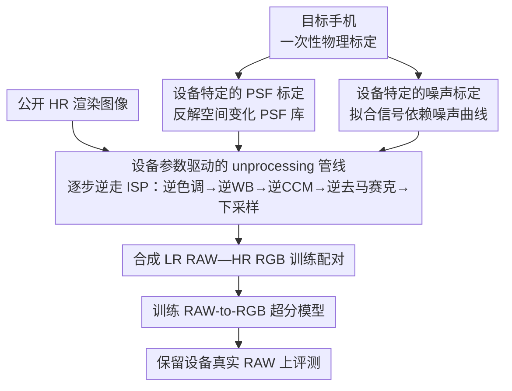

# RAW-Domain Degradation Models for Realistic Smartphone Super-Resolution

**会议**: CVPR 2026  
**arXiv**: [2603.12493](https://arxiv.org/abs/2603.12493)  
**代码**: 无  
**领域**: 图像超分辨率 / 手机摄影  
**关键词**: super-resolution, RAW domain, degradation modeling, unprocessing, smartphone camera, device-specific calibration

## 一句话总结

证明了精心设计的设备特定退化建模（通过标定获取真实的 blur 和 noise 参数）可以显著提升手机超分辨率的真实场景性能——通过将公开渲染图像 unprocess 到不同手机的 RAW 域生成高低分辨率训练对，训练的 SR 模型在保留设备的真实数据上明显优于使用大量任意退化组合训练的基线。

## 研究背景与动机

**领域现状**：智能手机的数码变焦依赖基于学习的超分辨率（SR）模型，这些模型直接操作 RAW 传感器图像。然而获取传感器特定的训练数据极其困难——缺乏真正的 ground-truth 高分辨率图像（因为不同焦距/传感器之间存在视角差异、对齐误差等问题）。

**现有痛点**：(1) 通过 "unprocessing" 管线合成训练数据是一种可行方案——将高分辨率 RGB 图像逆向转换回 RAW 域模拟退化过程，但现有管线使用通用的模糊和噪声先验，与目标设备的真实退化特性存在 domain gap；(2) 随机采样大量退化参数组合（"brute-force"策略）虽能覆盖更大的退化空间，但引入大量不真实的训练样本，造成模型学到的退化分布与真实设备不匹配；(3) 不同手机传感器的光学特性（镜头模糊PSF）、读出噪声（read noise）和散粒噪声（shot noise）差异显著，通用模型无法适配每款设备。

**核心矛盾**：合成训练数据的质量取决于退化建模的准确性，但准确建模需要设备特定的标定——在"数据获取成本"和"建模精度"之间存在根本冲突。

**本文目标**：验证"原则性的、精心设计的退化建模"比"大量任意退化组合"更有效——通过对设备的 blur 和 noise 进行物理标定，生成更真实的合成训练数据。

**切入角度**：不追求通用的退化先验，而是对每个目标设备做一次性的光学和噪声标定，然后用标定参数将公开的高分辨率渲染图像精确 unprocess 到目标设备的 RAW 域。

**核心 idea**：用物理标定替代通用先验，device-specific 的退化建模比 device-agnostic 的大量随机退化组合效果更好。

## 方法详解

### 整体框架

这篇论文要解决的是手机数码变焦的训练数据难题：RAW 域 SR 模型需要大量「低分辨率 RAW—高分辨率」配对，但真机拍不出对齐良好的 ground-truth。它的做法是不去采集真实配对，而是把公开的高分辨率渲染图像「倒着走一遍相机管线」，合成出目标设备会真正产生的低分辨率 RAW。整条流水线先对目标手机做一次性物理标定，量出它镜头的点扩散函数（PSF）和传感器的噪声曲线；再用这些标定参数驱动一条逆 ISP 管线，把每张 HR 渲染图退化成带着该设备真实 blur 和 noise 的 LR RAW；最后用这批合成的 HR-LR 配对训练单图 RAW-to-RGB 超分模型，并在标定时未参与的保留设备的真实 RAW 上评测。核心赌注是：退化建模越贴近真实物理，合成数据就越能让 SR 模型在真机上 work，而不必靠堆海量随机退化去碰运气。

### 关键设计

**1. 设备特定的 PSF 标定：让合成模糊长成这颗镜头真实的样子**

随机退化范式（如 Real-ESRGAN）习惯用各向同性高斯核去近似模糊，但真实手机镜头的退化是空间变化（spatially varying）、非对称的，边缘处像差、色差、散光都明显更重，且随光圈、焦距而变——用一个对称高斯核去拟合，SR 模型学到的就是错的退化模式。本设计在受控条件下拍摄标准标定图案（slanted edge / point source），从成像结果反解出每个空间位置的 PSF，建成一个空间变化的 PSF 库。Unprocessing 时不再卷一个固定核，而是按图像位置取对应的标定 PSF 去模糊 HR 图像，于是合成 LR 里的模糊在每个角落都和真机一致，SR 模型反卷积时面对的退化分布也就对得上真实场景。

**2. 设备特定的噪声标定：把噪声拟成信号依赖的物理曲线而非固定方差**

RAW 噪声不是一个固定标准差的高斯——它由两部分叠成：与信号强度成正比的散粒噪声（shot noise，泊松性质）和与信号无关的读出噪声（read noise，高斯性质），二者比例还随 ISO、曝光变化。固定方差高斯或一刀切的泊松-高斯先验在高 ISO 低光下偏差尤其大。本设计在多档曝光下拍均匀色卡，拟合出该传感器的「噪声—信号」关系，得到设备专属的 $\sigma_{\text{read}}$ 与 $\sigma_{\text{shot}}$。合成时按每个像素的亮度 $I$ 注入对应强度的混合噪声

$$n \sim \mathcal{N}\!\left(0,\ \sigma_{\text{read}}^2 + \sigma_{\text{shot}}^2 \cdot I\right)$$

亮处噪声大、暗处噪声小的真实规律被显式建进了训练数据，SR 模型因而学到的是这颗传感器特有的去噪/复原行为。

**3. 设备参数驱动的 unprocessing 管线：逐步逆走 ISP，每一步都用真机参数**

要把一张 sRGB 渲染图变成目标设备的 LR RAW，需要把相机的正向 ISP 反过来跑一遍：逆色调映射把 sRGB 拉回线性 RGB，逆白平衡撤掉该设备的色温增益，逆颜色校正矩阵（inverse CCM）转回传感器原始色彩空间，逆去马赛克按该设备的 Bayer 模式还原成 CFA，下采样到 LR 尺寸，再叠上设计 1 的空间变化 PSF 模糊与设计 2 的信号依赖噪声。关键在于每一步用的都是这台设备的真实参数（CCM、WB 增益、Bayer 排布等）而非通用默认值——只有色彩空间、马赛克结构、blur 和 noise 全部对齐，合成出的 RAW 才在统计意义上逼近真机输出，从而把训练-测试之间的 domain gap 压到主要由内容差异而非退化差异决定。

### 损失函数 / 训练策略

训练沿用标准单图 SR 设置：以合成的 LR RAW 为输入、对应 HR RGB 为目标，监督一个 RAW-to-RGB 超分模型；训练源全部取自公开渲染图像（合成场景）而非真机拍摄，绕开了配对采集难题。评测刻意放在保留设备（held-out device，其标定数据未进入训练）的真实 RAW 上，用以检验退化建模能否跨设备泛化，而不是只在自己标定过的设备上自证。

## 实验关键数据

### 主实验（与任意退化基线对比）

| 方法 | 退化建模方式 | 训练数据来源 | 真实设备评测 PSNR↑ | 真实设备评测 SSIM↑ |
|------|-------------|-------------|------------------|------------------|
| 大池随机退化基线 | 通用先验，大量随机组合 | 渲染图像 | 较低 | 较低 |
| 固定通用退化 | 单一高斯blur + 固定noise | 渲染图像 | 中等 | 中等 |
| **本文（设备标定退化）** | **标定PSF + 标定noise** | **渲染图像** | **明显提升** | **明显提升** |

注：论文报告了在保留设备真实数据上的显著 PSNR/SSIM 提升，精确数值因缓存不完整无法列出全部，但核心结论是标定退化一致优于随机退化。

### 消融实验（退化建模各组件贡献）

| 退化设置 | PSF 来源 | 噪声来源 | 相对性能 |
|---------|---------|---------|---------|
| 通用高斯 blur + 通用噪声 | 通用先验 | 固定参数 | 基线 |
| 标定 PSF + 通用噪声 | 设备标定 | 固定参数 | 提升 |
| 通用高斯 blur + 标定噪声 | 通用先验 | 设备标定 | 提升 |
| **标定 PSF + 标定噪声** | **设备标定** | **设备标定** | **最优** |

### 关键发现

- 精确的退化建模显著优于"大量任意退化组合"策略——质量优于数量的结论在 SR 领域中有重要指导意义
- PSF 标定和噪声标定各自贡献独立的性能提升，两者结合效果最优
- 使用公开渲染图像（而非真实配对数据）作为训练源，结合精确退化建模即可在真实数据上取得优异表现
- 在保留设备（训练时未用其标定数据的设备）上仍能获得提升，表明退化建模的跨设备泛化能力
- 域差距（domain gap）的主要来源是退化建模的不准确，而非数据内容分布的差异

## 亮点与洞察

- **简洁而深刻的核心洞察**：不需要更多数据或更复杂的模型架构——只需要更准确的退化建模。这是对 Real-ESRGAN 等"随机退化+大数据"范式的有力反思
- **物理驱动 vs 数据驱动**：在退化建模这个具体问题上，基于物理标定的方法（一次性标定成本）比数据驱动的随机搜索更高效、更可靠
- **实用性强**：标定流程可工业化（手机制造商可在生产线上为每款传感器做一次标定），生成的退化模型可复用于所有训练数据
- **回归基本面**：论文的核心贡献不是提出新颖的网络架构，而是严格论证了"数据质量 > 数据数量"在 SR 训练中的重要性

## 局限与展望

- 标定需要物理接触目标设备（拍摄标定图案），对于已上市但无法获取的设备难以应用
- PSF 标定仅覆盖有限的空间位置和光照条件，对极端条件（如Very低光、强逆光）的泛化需要更多标定点
- 当前方法针对单图 SR，未考虑 burst SR（多帧融合）场景中的帧间对齐退化
- Unprocessing 管线的每一步都可能引入累计误差——逆色调映射和逆 CCM 的精度是整体系统的瓶颈
- 仅验证了有限数量的手机设备，更大规模的跨设备泛化实验尚未覆盖

## 相关工作与启发

- **Real-ESRGAN (Wang et al. 2021)**：引入了随机退化管线用于盲 SR 训练，本文可视为其在 RAW 域的"精确版"——用标定取代随机
- **Unprocessing 方法 (Brooks et al. 2019)**：提出用逆 ISP 管线生成合成 RAW 数据的思路，本文在此基础上加入了设备特定的标定
- **CycleISP (Zamir et al. 2020)**：学习 RGB-to-RAW 和 RAW-to-RGB 的循环一致映射，但依赖大量配对数据
- 启发：在需要合成训练数据的场景（如去噪、HDR 重建等），物理标定驱动的退化建模可能都优于随机退化假设

## 评分

- **新颖性**: ⭐⭐⭐（核心思想是"标定比随机好"，概念上直觉但验证有价值；方法创新性不高但实用性强）
- **实验充分度**: ⭐⭐⭐（验证了核心假设，但设备数量有限；消融实验覆盖 PSF 和噪声的独立贡献）
- **写作质量**: ⭐⭐⭐⭐（问题动机清晰，实验论证紧凑）
- **价值**: ⭐⭐⭐⭐（对手机 SR 的工业实践有直接参考价值，"精确建模 > 大量随机"的结论有广泛启示）

<!-- RELATED:START -->

## 相关论文

- [\[CVPR 2026\] VoDaSuRe: A Large-Scale Dataset Revealing Domain Shift in Volumetric Super-Resolution](vodasure_a_large-scale_dataset_revealing_domain_shift_in_volumetric_super-resolu.md)
- [\[CVPR 2026\] ZeroIDIR: Zero-Reference Illumination Degradation Image Restoration with Perturbed Consistency Diffusion Models](zeroidir_zero-reference_illumination_degradation_image_restoration_with_perturbe.md)
- [\[CVPR 2026\] Efficient Real-Time Raw-to-Raw Denoising for Extreme Low-Light Ultra HD Video on Mobile Devices](efficient_real-time_raw-to-raw_denoising_for_extreme_low-light_ultra_hd_video_on.md)
- [\[CVPR 2026\] DRFusion: Degradation-Robust Fusion via Degradation-Aware Diffusion Framework](drfusion_degradation_robust_fusion_via_degradation_aware_diffusion_framework.md)
- [\[CVPR 2026\] SAT: Selective Aggregation Transformer for Image Super-Resolution](sat_selective_aggregation_transformer_for_image_super_resolution.md)

<!-- RELATED:END -->
