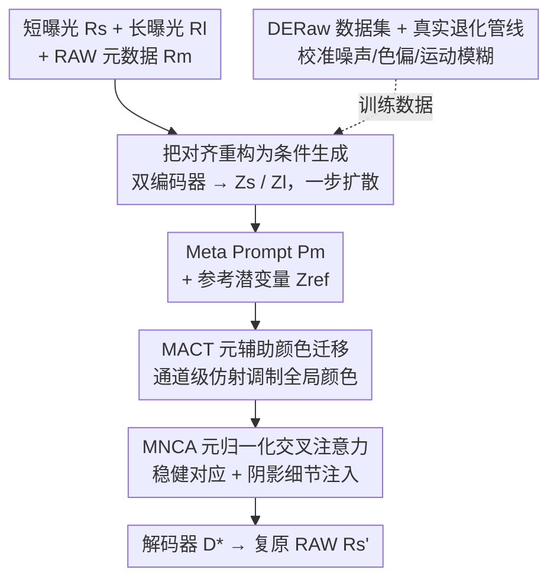

# RawMetaDiff: Unlocking Extreme Darkness from Dual-Exposure RAW with Meta-Guided Diffusion

**会议**: CVPR 2026  
**论文**: [CVF Open Access](https://openaccess.thecvf.com/content/CVPR2026/html/Liu_RawMetaDiff_Unlocking_Extreme_Darkness_from_Dual-Exposure_RAW_with_Meta-Guided_Diffusion_CVPR_2026_paper.html)  
**代码**: 无  
**领域**: 图像恢复 / 扩散模型 / 低光增强  
**关键词**: 极暗 RAW 复原、双曝光、扩散模型、RAW 元数据、跨曝光对齐

## 一句话总结
RawMetaDiff 把"对齐短/长曝光帧"这个脆弱的显式配准问题重写成"条件生成"问题——以噪声短曝光 RAW 作为扩散初始化，用可能错位的长曝光 RAW 作参考、并由 RAW 元数据（ISO/CCM/曝光）引导一步式潜空间扩散，借 MACT 做全局颜色迁移、MNCA 做阴影细节注入，在合成与真实数据上 LPIPS 提升 33%、真实数据 DeQA 涨 15%。

## 研究背景与动机
**领域现状**：极暗光下单帧 RAW 复原是计算摄影的长期难题——传感器读出的信号被噪声和裁剪严重污染，单帧本身就是个信息瓶颈，暗区里的信号要么淹没在噪声里、要么被 clip 掉。回归类方法（Restormer 等）输出模糊或带噪；即使上扩散先验，单帧也只能"幻想"出看似合理却不准的细节和颜色偏移。

**现有痛点**：一条出路是再拍一张长曝光帧来补信息（HDR / LSD2 / LSFNet 这类双曝光方法）。但它们都依赖**显式跨曝光对齐**——靠光流之类的经典对应来配准两帧。问题是：短、长曝光之间存在巨大的曝光差和手持产生的非刚性运动模糊，光流在这种情况下极其脆弱，配准一旦失败，细节恢复就退化、颜色保真度也崩。

**核心矛盾**：长曝光帧确实带着可信的全局颜色和阴影细节，但要用它就得先对齐，而对齐在大曝光差 + 运动模糊下根本不可靠。显式对齐这条路本身就走不通。

**本文目标**：在不做显式像素对齐的前提下，稳健地利用一张"可能错位"的长曝光参考来复原噪声短曝光 RAW。

**切入角度**：作者把任务从"对齐"换成"条件生成"——把噪声短曝光 RAW 当成扩散的带噪初始化，让扩散先验把它去噪到自然图像流形上，长曝光帧只作为**条件**而非要逐像素配准的对象。但初步实验暴露两个新坑：(1) 巨大曝光差会扰乱 cross-attention，让对应不可靠；(2) 朴素条件注入会把"颜色迁移"和"细节注入"纠缠在一起，导致颜色迁移不准、保真度下降。

**核心 idea**：用 **RAW 元数据**（描述双曝光物理关系的 ISO/CCM/曝光等参数）作为显式条件，把颜色迁移和细节注入解耦成两个互补机制——MACT 负责沿通道做全局颜色一致性，MNCA 负责把跨曝光对应约束在物理可行范围内、再注入阴影细节。

## 方法详解

### 整体框架
RawMetaDiff 是一个**一步式条件潜空间扩散**模型。输入是噪声短曝光 RAW $R_s$、干净但可能模糊的长曝光 RAW $R_l$（Bayer 单通道先经双三次插值转成 3 通道线性 RAW），以及两帧拼接成一个向量的 RAW 元数据 $R_m$；输出是复原后的线性 RAW $R_s'$。

整条管线这样转：两个独立编码器 $E_s,E_l$ 把 $R_s,R_l$ 映成潜表示 $Z_s,Z_l$；再由 embedder 从 $R_m$ 和 $Z_l$ 派生出两路条件——**Meta Prompt** $P_m$（编码双曝光物理关系的提示）和 **参考潜变量** $Z_{ref}$（携带长曝光的互补信息）。UNet 主干以 $Z_s$ 为带噪初始化，在 $P_m$ 引导下用两个机制做条件复原：MACT 用 $Z_{ref}$ 和 $P_m$ 做通道级调制完成全局颜色迁移，MNCA 用 $P_m$ 归一化 query/key 建立稳健对应、并从 $Z_{ref}$ 注入阴影细节，最终得到高保真潜表示 $Z_s'$，由专门为线性 RAW 适配过的解码器 $D^*$ 重建出 $R_s'$。

### 关键设计

**1. 把显式对齐重构为条件生成：用扩散先验绕开脆弱的配准**

这针对的是双曝光方法最根本的痛点——显式跨曝光对齐在大曝光差和运动模糊下必然失败。作者的做法是彻底换框架：不再去算两帧的像素对应，而是把噪声短曝光 RAW $R_s$ 当成扩散过程的"带噪初始化"，让模型沿着自然图像流形的扩散先验把它去噪复原，长曝光帧只作为条件信息（颜色统计 + 阴影细节）参与，而不要求逐像素配准。具体落在一个**一步式**条件潜空间扩散上（基于 SD-2.1 的预训练 UNet），既拿到了生成先验带来的真实纹理，又因为不依赖对齐而对运动错位天然鲁棒。这一步是后面两个机制能成立的前提：正因为不强求对齐，才需要 MACT/MNCA 这种"软"的、由元数据约束的条件注入方式。

**2. MACT 元辅助颜色迁移：把颜色迁移从细节注入里解耦出来**

朴素条件注入会把颜色迁移和细节注入纠缠在一起，导致从参考帧迁移颜色时不准、出现色偏。MACT 的思路是单独、稳健地完成全局颜色迁移：它用参考潜变量 $Z_{ref}$ 捕获长曝光帧的全局颜色统计，再配上携带双曝光物理关系的 Meta Prompt $P_m$，把两者一起喂进一个轻量 MLP，预测出一组**通道级仿射变换参数**——缩放向量 $\gamma_{1,2},\alpha_{1,2}$ 和平移向量 $\beta_{1,2}$，分别作用到网络里各个 Scale / Scale-Shift 调制点。对中间特征 $Z_t$ 的一次调制就是

$$Z_t' = \gamma \odot Z_t + \beta.$$

它的新意不只是"做颜色迁移"，而是引入 RAW 元数据来**稳住**这个过程：颜色校正既以参考帧的颜色信息为锚，又用 $P_m$ 编码的物理关系（不同 ISO/曝光下通道响应的差异）来约束，从而抑制短曝光 RAW 因通道响应不一致带来的色偏，给后续重建打下可靠的颜色底子。

**3. MNCA 元归一化交叉注意力：把跨曝光对应约束在物理可行范围内再注入细节**

短、长曝光特征之间存在"信息鸿沟"，朴素 cross-attention 会算出不可靠的注意力图，阴影细节注入随之失败。MNCA 用 RAW 元数据给注意力加物理约束。关键是**Meta-Norm**：由 Meta Prompt 经轻量 MLP 预测出逐特征的 scale/shift，先把 query 和 key 拉到跨曝光可比的分布上，再做注意力——

$$[\gamma_{q,k},\beta_{q,k}]=\text{MLP}(P_m),\quad q=W_Q(\text{LN}(Z_s)\cdot\gamma_q+\beta_q),\quad k=W_K(\text{LN}(Z_{ref})\cdot\gamma_k+\beta_k),$$

而 value 只从曝光良好的参考特征取 $v=W_V(Z_{ref})$，保证细节合成的源头是高质量的。最后 $Z_{ca}=\text{softmax}(qk^\top/\sqrt{d_k})\,v$。这套"三件分工"——Meta-Norm 后的 Q/K 建立可靠对应、高质量 V 提供细节源——让检索被限制在物理可行的流形上，对曝光失配和退化内容都更抗造，从而在不引入错位伪影的前提下忠实复原阴影细节。

**4. DERaw 数据集与真实退化管线：让训练数据贴近真实双曝光物理**

扩散训练需要大量数据，但双曝光 RAW 既缺数据也缺评测基准。作者先采集了约 1K 张真实世界 RAW 三元组 **DERaw**——三脚架短曝光（无运动模糊但噪声大）、手持长曝光（有自然相机抖动模糊、低噪）、三脚架长曝光参考——既当评测基准又当合成的现实依据。再设计一条**真实退化管线**把海量 sRGB 经逆 ISP 转成干净线性 RAW 后施加三类退化：传感器噪声用异方差高斯建模 $n\sim\mathcal{N}(0,\sigma_r^2+y\cdot\sigma_s)$（同时含信号相关的散粒噪声和信号无关的读出噪声，参数由 ISO 标定）；色偏用逐通道、随亮度变化的标定缩放 $C_k'=f_k(L)\cdot C_k$；运动模糊**在线性 RAW 域**做——因为模糊源于光子在成像非线性变换之前的时间积分，用从 PSF Kernel Bank 采样的复合核 $I_{blurred}=\text{Conv}(I_{Raw},\frac1N\sum_{i=1}^N K_i)$ 卷积，比在 RGB 域模糊更能保住高光、更贴合真实长曝光。最终合成 9 万对训练数据，其直方图统计与真实数据高度吻合。

### 损失函数 / 训练策略
两阶段训练。**阶段一·线性 RAW VAE 适配**：把 SD-2.1 的预训练 VAE 用 KL + MSE + LPIPS + 对抗(GAN) 复合目标微调到线性 RAW 域，得到专用编码器 $E^*$ 和解码器 $D^*$。**阶段二·框架训练**：用 $E^*$ 权重初始化 $E_s,E_l$，配上 $D^*$ 和预训练 UNet 组装完整模型；冻结解码器 $D^*$，只端到端微调双编码器和整个 UNet，用 MSE + LPIPS + latent + GAN 监督，把模型容量集中在潜空间里的特征调制与注入这一核心任务上。

## 实验关键数据

数据集 9 万对（合成），留 600 对测试 + 真实 DERaw；所有评测在 sRGB 域、统一 ISP 参数。基线分三组：单帧 Restormer、生成式 RDDM/OSEDiff/HYPIR、传统双帧融合 LSD2/LSFNet。

### 主实验（合成数据，Table 1）

| 方法 | PSNR↑ | LPIPS↓ | ∆E↓ | MUSIQ↑ | MANIQA↑ | CLIP-IQA↑ | DeQA↑ |
|------|-------|--------|------|--------|---------|-----------|-------|
| Restormer | 23.74 | 0.4156 | 6.197 | 55.29 | 0.3549 | 0.6787 | 3.381 |
| RDDM | 17.36 | 0.3301 | 16.96 | 61.69 | 0.4171 | 0.6163 | 2.993 |
| LSD2 | 23.07 | 0.2499 | 6.948 | 65.82 | 0.4122 | 0.6069 | 3.629 |
| LSFNet | 22.89 | 0.2629 | 7.655 | 63.76 | 0.3528 | 0.5887 | 3.639 |
| HYPIR | 22.16 | 0.2447 | 7.020 | 66.23 | 0.3881 | 0.5883 | 3.811 |
| **RawMetaDiff** | **23.74** | **0.1650** | **5.407** | **70.32** | **0.4363** | **0.7008** | **4.115** |

LPIPS 相对次优（HYPIR 0.2447）降到 0.1650，约 33% 提升；∆E 也降到 5.407（次优 6.197，约 0.70 改善），感知和颜色指标几乎全面第一；PSNR/MS-SSIM 与确定性回归基线相当，在像素保真和感知真实之间取得更好平衡。

### 真实数据（DERaw，Table 2，全为无参考指标）

| 方法 | NIQE↓ | MUSIQ↑ | MANIQA↑ | CLIP-IQA↑ | DeQA↑ |
|------|-------|--------|---------|-----------|-------|
| LSFNet | 8.070 | 31.82 | 0.2414 | 0.2656 | 1.519 |
| HYPIR | 9.960 | 36.96 | 0.3067 | 0.4269 | 2.017 |
| **Ours** | **7.709** | **44.60** | **0.3352** | **0.4348** | **2.343** |

五项无参考指标全部第一，且 MUSIQ（44.60 vs 36.96）、DeQA（2.343 vs 2.017，约 15% 提升）领先幅度很大，说明对真实复杂退化的鲁棒性和泛化性。

### 消融实验（合成数据，Table 3）

| 配置 | PSNR↑ | ∆E↓ | MUSIQ↑ | DeQA↑ | CLIP-IQA↑ |
|------|-------|------|--------|-------|-----------|
| w/o Cond.（去掉长曝光引导） | 21.37 | 7.8052 | 68.99 | 4.067 | 0.6290 |
| w/o MNCA | 21.42 | 7.5449 | 70.57 | 4.063 | 0.6533 |
| w/o MACT | 21.58 | 7.7757 | 71.18 | 4.111 | 0.6729 |
| **Ours（完整）** | **23.59** | **5.5077** | **71.45** | **4.115** | **0.7008** |

### 关键发现
- 去掉长曝光条件（w/o Cond.）PSNR 从 23.59 跌到 21.37、∆E 从 5.51 涨到 7.81，阴影细节和颜色都明显丢失——证明长曝光参考确实是信息来源，而非可有可无。
- 去掉 MNCA 感知质量最差（CLIP-IQA 0.6533），阴影细节不足且因错误注入出现伪影；去掉 MACT 则 ∆E 高、出现强色偏——两个机制分别主管"细节"和"颜色"，职责清晰、缺一不可。
- 完整模型在所有指标上同时最优，说明两机制互补而非冗余。

## 亮点与洞察
- **把"对齐"问题重述为"条件生成"**：当配准本身不可靠时，与其改进配准算法，不如换个框架让扩散先验把错位当作可容忍的条件噪声——这种"换问题定义"的思路可迁移到任何被脆弱对齐拖累的多帧融合任务（多帧去噪、burst SR）。
- **用物理元数据当条件的"归一化器"**：MNCA 的 Meta-Norm 不是简单把元数据拼进特征，而是用它预测 scale/shift 把跨曝光的 Q/K 拉到可比分布，把注意力检索约束在物理可行流形上——这是"用先验约束注意力搜索空间"的巧妙范例。
- **颜色与细节解耦**：作者从初步实验发现朴素条件会把颜色迁移和细节注入纠缠，于是干脆拆成 MACT（通道级颜色）+ MNCA（空间细节注入）两条独立通路，这个"诊断—解耦"的路径很值得借鉴。
- **退化建模放在线性 RAW 域**：运动模糊在光子积分（非线性变换之前）发生，所以在线性 RAW 域卷积复合 PSF 核比 RGB 域模糊更物理、更能保高光——这是 RAW 域复原数据合成的一个实用细节。

## 局限与展望
- 作者承认局限着墨不多；从方法看，整套系统依赖 RAW 元数据（ISO/CCM/曝光）可得，对只有 sRGB 输出或元数据缺失的相机不适用。
- DERaw 仅约 1K 真实三元组，且真实评测全靠无参考 IQA 指标（无配对 GT 做 PSNR/LPIPS），无参考指标与人眼感知未必完全一致，真实场景的定量结论需谨慎。
- 真实退化管线的噪声/色偏参数是按作者采集的特定相机标定的，跨相机/跨传感器的泛化性未充分验证。
- 双曝光设置本身要求能拍到一张长曝光参考帧，对纯单帧或动态剧烈场景仍受限。

## 相关工作与启发
- **vs LSFNet / LSD2（传统双帧融合）**：它们依赖显式跨曝光对齐（光流类对应），在大运动下脆弱、易出颜色块状伪影；本文把对齐换成条件生成 + 元数据引导的软对应，鲁棒性显著更好。
- **vs Restormer（单帧回归）**：单帧是信息瓶颈，暗区信号丢失只能靠回归"猜"，输出模糊；本文引入第二帧 + 生成先验，能真正补回阴影细节。
- **vs RDDM / OSEDiff / HYPIR（生成式复原）**：这些单帧扩散方法缺可靠信号，常幻想出不准的细节和色偏；RawMetaDiff 用长曝光参考 + 元数据约束注入，在所有扩散基线上大幅领先，且一步式推理避免了 RDDM 的多步采样开销。

## 评分
- 新颖性: ⭐⭐⭐⭐⭐ 把对齐重述为条件生成 + 用 RAW 元数据归一化注意力，视角新且落地。
- 实验充分度: ⭐⭐⭐⭐ 合成+真实双基准、消融清晰，但真实侧只有无参考指标。
- 写作质量: ⭐⭐⭐⭐ 动机—诊断—解耦的逻辑链讲得很顺，公式和机制对应明确。
- 价值: ⭐⭐⭐⭐ 极暗双曝光 RAW 复原的强基线 + 配套 DERaw 数据集与退化管线，实用性强。

<!-- RELATED:START -->

## 相关论文

- [\[CVPR 2026\] NEC-Diff: Noise-Robust Event–RAW Complementary Diffusion for Seeing Motion in Extreme Darkness](nec-diff_noise-robust_event-raw_complementary_diffusion_for_seeing_motion_in_ext.md)
- [\[CVPR 2026\] Efficient Real-Time Raw-to-Raw Denoising for Extreme Low-Light Ultra HD Video on Mobile Devices](efficient_real-time_raw-to-raw_denoising_for_extreme_low-light_ultra_hd_video_on.md)
- [\[CVPR 2026\] From Events to Clarity: The Event-Guided Diffusion Framework for Dehazing](from_events_to_clarity_the_event-guided_diffusion_framework_for_dehazing.md)
- [\[CVPR 2026\] UniLDiff: Unlocking the Power of Diffusion Priors for All-in-One Image Restoration](unildiff_unlocking_the_power_of_diffusion_priors_for_all-in-one_image_restoratio.md)
- [\[CVPR 2026\] Dual Graph Regularized Deep Unfolding Network for Guided Depth Map Super-resolution](dual_graph_regularized_deep_unfolding_network_for_guided_depth_map_super-resolut.md)

<!-- RELATED:END -->
