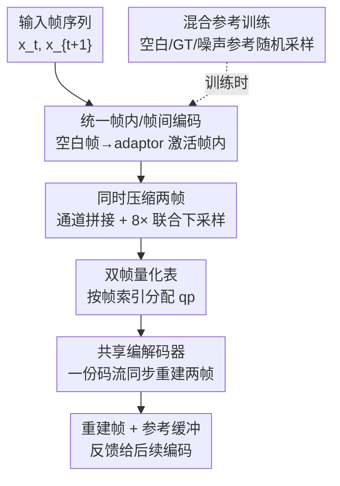

# Real-Time Neural Video Compression with Unified Intra and Inter Coding

**会议**: CVPR 2026  
**论文**: [CVF Open Access](https://openaccess.thecvf.com/content/CVPR2026/html/Xiang_Real-Time_Neural_Video_Compression_with_Unified_Intra_and_Inter_Coding_CVPR_2026_paper.html)  
**代码**: https://github.com/ihuixiang/UIIC  
**领域**: 图像与视频恢复  
**关键词**: 神经视频压缩, 帧内/帧间统一编码, 双帧压缩, 误差传播, 实时编解码

## 一句话总结
针对实时神经视频压缩（如 DCVC-RT）在场景切换/新内容处帧内编码能力弱、必须靠"周期刷新"硬切导致质量骤降、比特率突刺和帧间误差累积的问题，本文用"单模型统一帧内/帧间编码 + 同时压缩两帧 + 混合参考训练"，让模型按参考可靠性自适应在帧内/帧间间切换，在 DCVC-RT 基础上平均省码率 12.1%（BD-rate），且保持实时编解码、模型更小、无需刷新机制。

## 研究背景与动机

**领域现状**：神经视频压缩（NVC）近年快速进步，DCVC-RT 这类实时方案在压缩效率上已超过 H.266/VVC，还能实时编解码。它们普遍走"条件编码 + 隐式上下文对齐"路线，靠充分利用帧间（时域）参考来榨取冗余。

**现有痛点**：绝大多数 NVC 只顾压榨帧间冗余，却忽视了**参考稀缺/不可靠时的帧内编码能力**。场景切换时，前一场景末帧和新场景首帧没有时域相关性，P 帧模型被迫退化成帧内编码——但 SOTA 方案的 P 帧模型帧内能力很弱，于是质量骤降 + 误差严重传播。为兜底，近期方案引入"周期特征刷新"（把累积特征恢复成三通道像素图再喂回当参考），可它有两个硬伤：(1) 在丢弃误差的同时也丢掉了有价值的长期时域信息/被遮挡物体细节；(2) 在刷新点造成比特率骤升，有网络拥塞风险、不利部署。

**核心矛盾**：在参考稀缺场景下，要同时兼顾低码率、高画质、实时三者很难——SOTA 仍依赖一个**独立、重量级的 I 帧模型**来处理这些情况，但把这种重帧内复杂度直接塞进帧间流水线会拖慢推理，而推理速度恰恰是低延迟应用的命门。

**本文目标**：用单一模型统一帧内与帧间编码，让它根据当前参考误差水平自适应平衡两种模式；同时在不牺牲实时速度的前提下增强参考稀缺时的鲁棒性。

**切入角度**：回到经典视频编码的智慧——经典标准允许在帧间编码的帧里局部切换到帧内模式（处理新出现内容/复杂运动）。把这个"帧内工具内嵌于帧间"的思想搬到 NVC。

**核心 idea**：训练一个能自适应做帧内/帧间编码的统一模型（首帧/场景切换时喂"空白帧"经 adaptor 生成参考特征即激活帧内能力），再用"同时压缩两帧"借用后向参考来弥补复杂度约束下的帧内短板。

## 方法详解

### 整体框架
模型名为 UI2C（Unified Intra and Inter Coding），构建在实时神经编解码器 DCVC-RT 上。它去掉了专用 I 帧模型，把帧内/帧间统一进单个时空网络：当编码 $x_t$ 且 $t$ 为偶数时，引入 1 帧延迟等待 $x_{t+1}$，把两帧沿通道拼接、做 8× 联合下采样后送入共享编解码器，同时利用前向（已解码帧）和后向（$x_{t+1}$）冗余，解码端从一份码流同步重建两帧、并把融合特征存入参考缓冲。首帧或场景切换这种"无参考"情形，则把空白帧经首帧 adaptor（ADI）转成参考特征，直接调用模型固有的帧内能力。两帧间用"双帧量化表"做细粒度码率分配，训练时用"混合参考"策略让模型学会评估参考误差并自适应切换模式。

### 关键设计

**1. 统一帧内/帧间编码：一个模型同时干 I 帧和 P 帧的活**

以往 NVC 给 I 帧和 P 帧用两个分立模型，让各自专精；但首帧（无参考）和场景切换（前后帧无相关）本质上是同一种情形——都是"在没有可用参考下编码当前帧"。作者据此论证**专用 I 帧模型是多余的**：用单一统一模型即可覆盖两种场景。推理时，对首帧/场景切换帧，喂一个空白帧（全零图）经首帧 adaptor（ADI）生成参考特征，从而直接激活模型固有的帧内编码能力；对后续帧，同一模型复用富含信息的参考特征，主要发挥帧间能力。这样既消除了对独立 I 帧模型的依赖（参数更少），又天然拦截帧间误差传播——不再需要手工刷新机制。实验也显示其内在帧内能力显著强于 DCVC-RT 的 P 帧模型、仅略逊于 DCVC-RT 的高复杂度 I 帧模型。

**2. 同时压缩两帧：用后向参考补足复杂度受限下的帧内短板**

实时流场景下 1 帧延迟通常可接受，这就给"借用后一帧作后向参考"创造了空间。作者把连续两帧 $x_t,x_{t+1}$ 沿通道拼接、做 8× 联合下采样（抑制两帧间无关高频、增强特征级一致性），送入共享单流编解码器，只产生一份紧凑码流、解码端同步重建两帧。这样做的关键收益是：参考稀缺时（首帧/场景切换），来自 $x_{t+1}$ 的后向参考能补偿前向信息缺失，缓解弱帧内编码在受限复杂度下的画质损失；帧间编码时，双向线索能更准地建模遮挡区域、为带噪/不完美传播的特征提供误差校准。它在"维持低复杂度"和"增强编码鲁棒性"这个核心权衡之间给出了出路——只付出 1 帧延迟。

**3. 双帧量化表：按帧角色做细粒度码率分配**

联合压缩两帧带来一个 RD 优化难题：既要保留分层质量结构（Hierarchical Quality Structure）的效率，又要在两个共编码帧间做细粒度质量控制。DCVC-RT 用共享量化表统一控制编码器/解码器/重建器/特征提取器的码率，但没考虑两帧的不同参考角色（$x_{t+1}$ 既是 $x_t$ 的后向参考，又是后续帧的未来参考；$x_t$ 只管前向上下文）。作者给每帧按其帧索引查询一个质量参数 $qp$，得到两个不同 $qp$，再各自查不同量化表得到量化系数，拼接后逐位置与特征相乘实现质量控制；并给两帧中的**后一帧分配更高 $qp$**，使其成为更好的参考。

**4. 混合参考训练：逼模型学会"评估参考误差并自适应切换"**

统一模型要发挥威力，训练策略是关键，而把模型练得能按当前参考误差水平动态平衡帧内/帧间并不容易。作者对初始帧的参考考虑三种候选：纯空白信号（全零图）、上一帧真值（GT）、以及该 GT 的噪声扰动版（由预留帧推断特征作训练参考）。训练时随机采样其一作初始帧参考，逼模型**隐式评估参考误差等级**：参考准确充足时偏帧间预测，参考易错/不足时自适应加强帧内编码做误差校正。这样在处理比训练数据更长的序列时，模型无需手工丢弃参考即可自适应增强帧内；同时摆脱了"丢信息式刷新"，降低了峰值码率、减小网络拥塞风险。

### 损失函数 / 训练策略
用 Vimeo-90k 的 7 帧序列训练，再按 DCVC-RT 把原视频裁成更长序列微调；损失为带尺度的 YUV 均方误差，按帧分配分层权重以支持分层质量结构。多码率通过每次迭代在 $[0,63]$ 随机选 $qp$ 实现，8 帧一组的 $qp$ 偏置为 $[0,8,0,4,0,4,0,4]$。训练用 8 张 RTX 4090；测试在单张 RTX 3090 + Xeon Gold 6248R，YUV420、low-delay、intra-period=-1，码率用估计熵评估。

## 实验关键数据

> **BD-rate（Bjøntegaard Delta rate）**：在相同质量（PSNR）下相对锚点方法的平均码率变化，负值越小越好（同画质下更省码率）。下表以 DCVC-RT 为锚点。

### 主实验

各测试集 BD-rate（%，DCVC-RT 为锚=0）与编解码速度：

| 方法 | HEVC-B | HEVC-C | HEVC-D | HEVC-E | MCL-JCV | UVG | 平均 | Enc.(fps) | Dec.(fps) |
|------|--------|--------|--------|--------|---------|-----|------|-----------|-----------|
| VTM-17.0 | 15.7 | 21.1 | 34.7 | 28.0 | 13.8 | 28.5 | 23.6 | 0.01 | 20.5 |
| DCVC-FM | -1.4 | -13.9 | -16.9 | -7.7 | 4.5 | 3.9 | -5.3 | 1.5 | 1.7 |
| DCVC-RT | 0.0 | 0.0 | 0.0 | 0.0 | 0.0 | 0.0 | 0.0 | 56.8 | 51.5 |
| **UI2C (本文)** | **-9.8** | **-16.4** | **-23.5** | **-17.7** | 1.1 | **-6.1** | **-12.1** | **65.1** | 46.1 |

相比 DCVC-RT 平均省 12.1% 码率且编解码速度相当；相比 DCVC-FM RD 高 6.8% 且约 25× 更快；相比 VTM 平均省 35.7%。在低码率段优势明显，长序列高码率段因误差累积更少甚至在 HEVC-E 超过高复杂度 DCVC-FM；但在短序列（如最长仅 150 帧的 MCL-JCV）表现稍逊（+1.1%）。

复杂度对比（Table 2）：

| 模型 | 编码 (kMACs/px) | 解码 (kMACs/px) | 参数 (M) | 潜变量通道 | 解码步数 |
|------|----------------|----------------|---------|-----------|---------|
| DCVC-DC | 1333 | 910 | 50.9 | 128 | 4 |
| DCVC-FM | 1137 | 866 | 45.0 | 128 | 4 |
| DCVC-RT | 142 | 167 | 66.4 | 128 | 2 |
| **UI2C (本文)** | 157 | 233 | **46.7** | 64 | **1** |

参数列里别家是 I+P 两个模型之和，本文只有一个模型；因两帧联合处理，每帧平均潜变量大小与解码步数减半（解码步=熵模型自回归步数）。

### 消融实验

以"完整模型无刷新"为锚（BD-rate=0，HEVC 平均，Table 3 节选）：

| 配置 | Unified | 双帧压缩 | 混合参考 | Refresh | 平均 BD-rate(%) |
|------|---------|---------|---------|---------|----------------|
| 仅 I 帧模型 + 刷新 | ✗ | ✗ | ✗ | 64 | 33.8 |
| 仅 I 帧模型 无刷新 | ✗ | ✗ | ✗ | – | 93.9 |
| +统一编码 无刷新 | ✔ | ✗ | ✗ | – | 29.0 |
| +双帧压缩 | ✔ | ✔ | ✗ | – | 5.3 |
| +混合参考（完整） | ✔ | ✔ | ✔ | – | 0.0 |

### 关键发现
- **统一编码是"去刷新依赖"的关键**：无刷新下，独立 I 帧模型方案误差累积严重（93.9%）；换成统一模型后非刷新 IP-1 直接提升 64.9%（93.9→29.0），且模型已能有效处理误差传播。
- **双帧压缩贡献最大单项**：29.0→5.3，后向参考显著弥补了受限复杂度下的帧内短板。
- **混合参考再补一刀**：相比只用单一空白参考，RD 再提升约 5.3%（5.3→0.0），让模型真正学会按参考可靠性切换模式。
- **更稳的逐帧码率/质量**：场景切换（如 Kimono1 第 141 帧）后质量恢复明显快于 DCVC-RT，峰值码率更低，无需刷新且不受误差传播影响。

## 亮点与洞察
- **"经典编码智慧 + 神经网络"的回归**：经典标准早就在帧间帧里允许局部帧内，本文把这个被 NVC 忽视的工具重新激活，用单模型 + 空白帧 adaptor 优雅实现，思路简洁却抓住了 SOTA 的真实痛点。
- **用 1 帧延迟换鲁棒性**：同时压缩两帧借后向参考，把"低复杂度 vs 强帧内"的死结解开，这个"双向但低延迟"的折中在低延迟流媒体里很实用。
- **混合参考训练是可迁移技巧**：随机在空白/干净/带噪参考间采样，逼模型隐式估计参考质量——任何依赖逐步累积参考、怕误差传播的序列模型都能借鉴。

## 局限与展望
- 作者承认：推理速度尚未针对边缘设备（弱 GPU/NPU）优化；高码率段压缩效率仍落后于更复杂的非实时 NVC。
- 自己看：短序列（MCL-JCV）上反而略逊（+1.1%），因后向参考/长序列误差抑制的收益在短片里摊不开；1 帧延迟在严格低延迟场景不可接受；训练策略仍不完善——作者复现的 DCVC-RT 仍逊于官方版（⚠️ 训练细节难复现，以原文为准）。
- 改进方向：更轻量网络降复杂度；引入先进模块提升高码率压缩；优化两帧延迟与边缘部署。

## 相关工作与启发
- **vs DCVC-RT**: 同为实时条件编码，但本文补上统一帧内/帧间能力 + 双帧后向参考，平均省 12.1% 码率、无需刷新、误差传播更轻，速度相当、模型更小。
- **vs DCVC-FM**: 对方靠长序列训练 + 长序列刷新维持时域上下文精度，但依赖光流、复杂度高不实时；本文 RD 高 6.8% 且约 25× 更快。
- **vs 经典 VTM (H.266)**: 借鉴其"帧间帧内嵌帧内"的思想，但用单一神经模型自适应实现，平均省 35.7% 码率。

## 评分
- 新颖性: ⭐⭐⭐⭐ 把经典"帧内嵌帧间"思想 + 双帧后向参考统一进单模型，角度务实且切中 SOTA 痛点。
- 实验充分度: ⭐⭐⭐⭐ 6 个测试集 BD-rate + 复杂度 + 逐技术消融完整，短序列弱项也如实报告。
- 写作质量: ⭐⭐⭐⭐ 动机推导清晰、图表充分，方法叙述偏工程实现细节。
- 价值: ⭐⭐⭐⭐ 实时 + 无刷新 + 更稳码率，对低延迟视频流落地有直接价值。

<!-- RELATED:START -->

## 相关论文

- [\[CVPR 2026\] Perceptual Neural Video Compression with Color Separation and Rank Chain](perceptual_neural_video_compression_with_color_separation_and_rank_chain.md)
- [\[CVPR 2026\] Efficient Real-Time Raw-to-Raw Denoising for Extreme Low-Light Ultra HD Video on Mobile Devices](efficient_real-time_raw-to-raw_denoising_for_extreme_low-light_ultra_hd_video_on.md)
- [\[CVPR 2026\] Time-Specialized Event-Image Alignment for Blur-to-Video Decomposition](time-specialized_event-image_alignment_for_blur-to-video_decomposition.md)
- [\[CVPR 2026\] Toward Real-world Infrared Image Super-Resolution: A Unified Autoregressive Framework and Benchmark Dataset](real_iisr_infrared_image_super_resolution_autoregressive.md)
- [\[CVPR 2026\] Time-Aware One Step Diffusion Network for Real-World Image Super-Resolution](time-aware_one_step_diffusion_network_for_real-world_image_super-resolution.md)

<!-- RELATED:END -->
