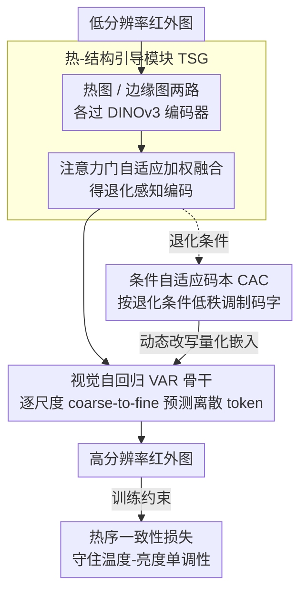

# Toward Real-world Infrared Image Super-Resolution: A Unified Autoregressive Framework and Benchmark Dataset

**会议**: CVPR 2026  
**arXiv**: [2603.04745](https://arxiv.org/abs/2603.04745)  
**代码**: [https://github.com/JZD151/Real-IISR](https://github.com/JZD151/Real-IISR)  
**领域**: 图像修复 / 红外超分辨率  
**关键词**: 红外图像超分辨率, 视觉自回归, 热结构引导, 条件自适应码本, 热序一致性

## 一句话总结

提出 Real-IISR 统一自回归框架，通过热-结构引导模块、条件自适应码本和热序一致性损失解决真实红外图像超分辨率的特有挑战，并构建了 FLIR-IISR 数据集（1457 对真实 LR-HR 红外图像）。

## 研究背景与动机

1. **领域现状**：可见光图像超分辨率已有显著进展，但红外成像因更长波长、更弱大气散射导致空间变化模糊、不稳定热边界和温度相关辐射漂移等特有退化。
2. **现有痛点**：现有 IISR 方法在模拟数据集（下采样的 IVIF 数据集）上训练，无法捕获真实红外退化。扩散模型的随机采样和缺乏红外退化先验限制其在 IISR 中的适用性。
3. **核心矛盾**：(1) 缺乏真实红外退化数据集；(2) 缺乏红外感知的退化建模——热辐射强度与结构边缘不对应，且非均匀退化引入量化偏差。
4. **本文目标**：同时解决真实 IISR 数据集和方法两个根本缺口。
5. **切入角度**：利用红外成像的温度-亮度单调性作为物理约束。
6. **核心 idea**：热-结构双引导 + 退化自适应码本 + 热序保持损失。

## 方法详解

### 整体框架

Real-IISR 把真实红外超分当成一个**退化条件下的自回归生成**问题，整条链路围绕红外特有的物理先验展开。一张低分辨率红外图先进入热-结构引导（TSG）模块，被拆成热图和边缘图两路并融合，得到一份"既知道哪里热、又知道边缘在哪"的退化感知编码；这份编码再喂给视觉自回归（VAR）骨干，由它逐尺度（coarse-to-fine）预测离散 token 生成高分辨率结果。生成过程中，条件自适应码本（CAC）会根据当前退化条件动态改写量化嵌入，让同一个码字在不同退化下解出不同纹理；最后用热序一致性损失约束输出，保证恢复结果不破坏"温度越高、像素越亮"的红外物理规律。相比扩散方法的随机多步去噪，VAR 的确定性逐尺度预测既快又不会把高频热细节糊掉。

### 关键设计

**1. 热-结构引导模块（TSG）：让模型同时盯住热分布和真实边缘**

红外图里的强热源（如汽车发动机）会产生大片高亮辐射区，但这片区域常常偏离物体的真实轮廓，模型若直接端到端训练就容易过拟合热峰值、把边缘恢复糊掉。TSG 从 LR 输入分别构建热图 $I_{\text{Heat}}$ 和边缘图 $I_{\text{Edge}}$，各用一个 DINOv3 编码器提特征，再用一个可学习的注意力门 $W = \sigma(L(A) + G(A))$ 自适应决定两路特征各占多少权重——热源明显时多信热图、纹理丰富时多信边缘图。融合后的特征经交叉注意力去引导 LR 特征编码，等于在生成前就把"热"和"形"两种线索对齐，避免后续生成在二者冲突的地方走偏。

**2. 条件自适应码本（CAC）：让离散码字随退化条件变形**

VAR 走的是 VQ-VAE 式离散量化，但固定码本的量化误差在红外的空间非均匀退化下被放大——同一个码字在清晰区和散焦区本该解出不同纹理，静态码本却只能给一个答案。CAC 给每个码嵌入加一个低秩扰动来动态调制：

$$Z'(g)[i] = Z[i] + \tanh(\alpha)\big[(U_i \odot h(g))V^\top\big]$$

其中条件向量 $h(g)$ 来自 TSG 的退化感知特征，$\tanh(\alpha)$ 把调制幅度限定在可控范围、避免训练发散。这样同一个离散索引在不同退化条件下能解码成不同的嵌入向量，码本从"静态查表"变成"随条件微调"，用低秩结构在灵活性和稳定性之间取了折中。

**3. 热序一致性损失 $\mathcal{L}_{\text{TOC}}$：把"温度-亮度单调性"写进训练目标**

红外成像里更高温度对应更亮的像素，这是一条硬物理规律；但散焦、运动模糊会压缩局部温度、让热峰值偏移，而 MSE 只约束像素绝对值、管不住相邻区域的相对亮暗排序，恢复结果可能在数值上接近却把冷热顺序搞反。TOC 直接对相邻 patch 对的亮度排序下手：

$$\mathcal{L}_{\text{TOC}} = \text{ReLU}\big(-[(I_{\text{SR}}^p(i) - I_{\text{SR}}^p(j)) \times (I_{\text{HR}}^p(i) - I_{\text{HR}}^p(j))]\big)$$

当 SR 与 HR 在同一对 patch 上的亮度差方向一致时两项乘积为正、ReLU 后无惩罚；一旦 SR 把冷热顺序弄反，乘积为负、损失上升。它约束的是相对排序而非绝对值，正好补上 MSE 管不到的物理一致性，实验中有效抑制了热峰值漂移。

### 损失函数 / 训练策略

总损失把自回归交叉熵、像素重建和物理约束三项加权组合：$\mathcal{L}_{\text{total}} = \mathcal{L}_{\text{CE}} + \lambda_1 \mathcal{L}_{\text{MSE}} + \lambda_2 \mathcal{L}_{\text{TOC}}$，取 $\lambda_1=0.2,\ \lambda_2=0.8$——物理一致性项权重明显高于像素 MSE，体现"宁可像素差一点也要守住热序"的取舍。训练在 4 × A800 上用 AdamW 做 10K 次微调。

## 实验关键数据

### 主实验

| 数据集 | 指标 | Real-IISR | DifIISR (之前SOTA) | 提升 |
|--------|------|-----------|-------------------|------|
| FLIR-IISR@Set5 | MUSIQ↑ | 59.90 | 54.79 | +5.11 |
| FLIR-IISR@Set15 | MUSIQ↑ | 57.06 | 53.16 | +3.90 |
| FLIR-IISR@Set5 | LPIPS↓ | 0.1615 | 0.2525 | -0.091 |

### 消融实验

| 配置 | PSNR | MUSIQ | 说明 |
|------|------|-------|------|
| 无 TSG | 下降 | 下降 | 边缘模糊、热分布不准 |
| 无 CAC | 下降 | 下降 | 纹理不稳定 |
| 无 $\mathcal{L}_{\text{TOC}}$ | 下降 | 下降 | 热峰值漂移 |
| VAR vs 扩散基线 | VAR 优 | VAR 优 | 确定性生成更适合红外 |

### 关键发现

- Real-IISR 虽然参数最多（1144.6M）但推理最快（2.45 FPS），因自回归无需多步去噪
- 扩散方法的迭代去噪模糊了高频热细节并破坏结构-热对应
- $\mathcal{L}_{\text{TOC}}$ 有效防止了热峰值漂移，保持了物理一致性

## 亮点与洞察

- **领域特有约束设计**：热序一致性损失巧妙利用红外成像的物理单调性
- **真实数据集构建**：通过自动对焦变化和运动模糊模拟真实退化，填补了真实红外 SR 数据的空白
- **CAC 的低秩扰动**：用低秩结构控制码本调制幅度，平衡灵活性和稳定性

## 局限与展望

- FLIR-IISR 数据集仅 1457 对，规模仍有限
- 仅支持 4× 超分，未验证其他倍率
- 热图和边缘图的质量依赖于 LR 输入，极端退化下可能不可靠
- 未来可扩展到红外视频超分以利用时序信息

## 相关工作与启发

- **vs VARSR**: VARSR 为可见光设计无红外约束，Real-IISR 引入热先验
- **vs DifIISR**: DifIISR 用扩散+梯度对齐但多步去噪慢且模糊红外细节

## 评分

- 新颖性: ⭐⭐⭐⭐ 热-结构引导和热序约束是针对红外的创新设计，填补了真实红外SR的空白
- 实验充分度: ⭐⭐⭐⭐ 两个数据集+多对比方法+全面消融，效率分析完整
- 写作质量: ⭐⭐⭐⭐ 结构清晰，热图可视化和灰度波动图直观展示物理一致性
- 价值: ⭐⭐⭐⭐ 填补了真实红外 SR 的数据和方法双重空白，为该领域提供了基准

<!-- RELATED:START -->

## 相关论文

- [\[ECCV 2024\] A New Dataset and Framework for Real-World Blurred Images Super-Resolution](../../ECCV2024/image_restoration/a_new_dataset_and_framework_for_real-world_blurred_images_super-resolution.md)
- [\[CVPR 2026\] RAR: Restore, Assess, Repeat - A Unified Framework for Iterative Image Restoration](rar_restore_assess_repeat_a_unified_framework_for_iterative_image_restoration.md)
- [\[CVPR 2026\] FinPercep-RM: A Fine-grained Reward Model and Co-evolutionary Curriculum for RL-based Real-world Super-Resolution](finpercep_rm_a_fine_grained_reward_model_and_co_evolutionary_curriculum_for_rl_ba.md)
- [\[CVPR 2026\] UniRain: Unified Image Deraining with RAG-based Dataset Distillation and Multi-objective Reweighted Optimization](unirain_unified_image_deraining_rag_dataset_distillation.md)
- [\[CVPR 2026\] Beyond Ground-Truth: Leveraging Image Quality Priors for Real-World Image Restoration](beyond_ground-truth_leveraging_image_quality_priors_for_real-world_image_restora.md)

<!-- RELATED:END -->
