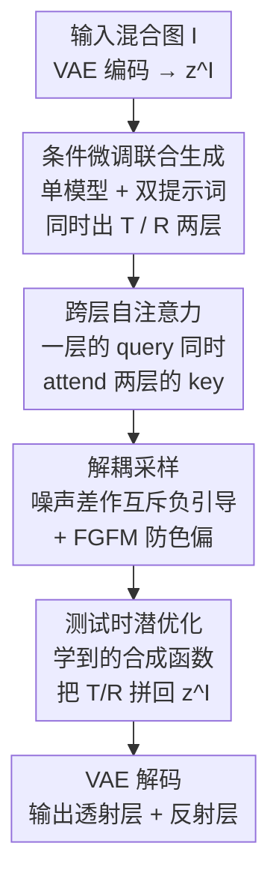

# Reflection Separation from a Single Image via Joint Latent Diffusion

**会议**: CVPR 2026  
**arXiv**: [2606.04107](https://arxiv.org/abs/2606.04107)  
**代码**: https://brian90709.github.io/diff-reflection-separation/ (项目页)  
**领域**: 图像恢复 / 扩散模型 / 反射分离  
**关键词**: 单图反射分离, 潜空间扩散, 跨层自注意力, 解耦采样, 测试时潜优化

## 一句话总结
针对单张图在强眩光、弱反射等极端场景下难以同时还原透射层和反射层的问题，本文微调一个潜扩散模型，用统一模型加「Transmission / Reflection」提示词**同时**生成两层，配合跨层自注意力、解耦采样和测试时潜空间合成优化，在多个真实基准上把透射和反射的分离质量都刷到 SOTA（Real20 PSNR 25.32、反射层 LPIPS 从 0.52 降到 0.37）。

## 研究背景与动机
**领域现状**：单图反射分离（Single-Image Reflection Separation, SIRS）要把一张隔着玻璃/半反射介质拍的图 $\mathcal{I}$ 分解成想要的透射层 $\mathcal{T}$（真实场景）和不想要的反射层 $\mathcal{R}$。这是一个高度病态（ill-posed）的逆问题，主流做法分两类：一类靠额外线索（闪光、多帧、文字描述）来降低不确定性；另一类是纯判别式深度网络（YTMT、DSRNet、DSIT、RDNet 等），用大规模合成数据学透射/反射的分布，做端到端回归。

**现有痛点**：判别式方法本质是「擦除」——在强眩光场景里被遮挡的内容根本没信息可还原，网络只能涂抹出残留反射或扭曲伪影；在弱反射场景里，反射信号太微弱，网络干脆把它当噪声丢掉，无法提取有意义的反射内容。而依赖额外线索的方法（如最相关的 L-DiffER 需要精确的逐层文字标注）现实中拿不到那么准的标注，落地受限。此外，几乎所有生成式工作都只关心还原透射层，把反射层当垃圾扔掉。

**核心矛盾**：信息不足时，判别式网络没有「无中生有」的能力；而强行用扩散模型做单层预测（naïve 适配）虽然能幻想出缺失细节，却常引入不真实的伪影，且两层各自独立预测会互相污染（透射里残留反射、反射里混进透射物体）。

**本文目标**：(1) 用生成式先验在信息缺失时合理「幻想」出内容；(2) 让透射层和反射层**联合**建模、互相约束，而不是各算各的；(3) 不依赖复杂语言标注，只用固定提示词；(4) 在真实「in-the-wild」场景下还能稳健，且计算开销可控。

**切入角度**：作者观察到预训练扩散模型（Stable Diffusion v2.1）的生成先验对**两层都有用**——反射层提供额外场景上下文，反过来又能帮助透射层恢复。于是把 SIRS 重新表述成「一个统一扩散模型在提示词引导下同时吐两层」的条件生成任务。

**核心 idea**：微调单个潜扩散模型，用「Transmission」「Reflection」两个固定提示词驱动它**联合生成**两层，再用跨层自注意力让两层在特征空间互通、用解耦采样让两层在噪声空间互斥、最后用学到的潜空间合成函数做测试时优化把两层拼回原图。

## 方法详解

### 整体框架
给定一张含反射的输入图 $\mathcal{I}$，先用预训练 VAE 编码器把它压成潜码 $z^{\mathcal{I}}=\mathcal{E}(I)$。然后把 $z^{\mathcal{I}}$ 沿通道维和带噪潜码 $z_t$ 拼接，喂进微调过的 U-Net；同一个模型分别在「Transmission」和「Reflection」提示词下跑两条分支，得到透射和反射各自的噪声预测。整个流程分三段递进：**前馈生成分离**（条件微调 + 跨层自注意力，得到初步两层）→ **解耦采样**（去噪轨迹上让两层互斥，压制残留重叠，并用 FGFM 防止色偏）→ **测试时潜优化**（用学到的合成函数把两层拼回输入，反向修正两层潜码）。最后 VAE 解码出最终的透射图和反射图。

整体可概括为「一次微调拿到稳定初值 + 测试时优化精修」的混合策略：前者保证基本质量和稳定性，后者用模型隐式知识把分离结果对齐到真实输入。

### 关键设计

**1. 条件微调的联合双层生成：一个扩散模型用提示词同时吐两层**

针对「两层独立预测会互相污染、且单层判别式没法幻想缺失内容」的痛点，作者把 SIRS 改造成扩散条件生成。具体做法遵循已有的图像条件微调范式：取输入图的 VAE 编码 $z^{\mathcal{I}}$，沿通道维和带噪潜码 $z_t$ 拼接后送入 U-Net，训练目标沿用标准噪声预测损失 $\mathbb{E}\|\epsilon_t-\epsilon_\theta(z_t,t,c)\|_2^2$，只是把 $z_t$ 替换成拼接张量。关键在于**不为两层各训一个模型**，而是引入文字线索——用「Transmission」和「Reflection」两个提示词作为条件 $c$，让同一个扩散模型在不同提示词下预测对应的层。这样既复用了预训练生成先验（强反射时能幻想细节、弱反射时能捕捉微弱内容），又让两层共享同一套参数、为后续跨层交互打基础。相比 L-DiffER 需要精确的逐层语言标注，这里只用两个固定单词，零标注成本。

**2. 跨层自注意力（CLSA）：让透射和反射在特征空间互看**

仅靠条件微调，难例里两层仍会互相残留伪影。作者把 U-Net 的自注意力模块改成显式跨层交互：每个注意力块**同时**处理透射和反射特征，允许一层的 query 去 attend 两层的 key。形式上

$$H^i=\text{softmax}\!\Big(\frac{Q^i\,[K^{\mathcal{T}};K^{\mathcal{R}}]^\top}{\sqrt{d}}\Big)\,[V^{\mathcal{T}};V^{\mathcal{R}}],\quad i\in\{\mathcal{T},\mathcal{R}\}$$

其中 $[\cdot;\cdot]$ 是沿空间维拼接，$Q^i,K^i,V^i$ 由对应提示词激活。直观上，透射的 query 既看自己的 key、也看反射的 key，反之亦然。在真值监督下，这种互看让每个分支放大「本层一致」的特征、压制不相关干扰。效果上它显著提升反射层重建质量（弱反射也能被挖出来），而更干净的反射层反过来又给透射层更强的引导，让透射更清晰——两层互为增益。

**3. 解耦采样（Disjoint Sampling）+ FGFM：在噪声空间把两层推开、再防色偏**

特征空间互通后，去噪轨迹上两层仍可能重叠（反射里混进透射的杯子、花盆）。作者借鉴 Classifier-Free Guidance 的思路，在采样时把两层的潜表示**显式推开**。设第 $t$ 步透射、反射的预测噪声为 $\epsilon_t^{\mathcal{T}}$、$\epsilon_t^{\mathcal{R}}$，透射分支的目标是最大化概率比 $p(z_t\mid\mathcal{T})/p(z_t\mid\mathcal{R})^k$；由于微调让两支噪声分别建模 $\nabla_z\log p(z_t\mid\mathcal{T})$ 和 $\nabla_z\log p(z_t\mid\mathcal{R})$，于是用噪声差作互斥负引导：

$$\hat{\epsilon}_t^{\mathcal{T}}=\epsilon_t^{\mathcal{T}}+k(\epsilon_t^{\mathcal{T}}-\epsilon_t^{\mathcal{R}}),$$

再据此更新去噪潜码 $z_{t-1}^{\mathcal{T}}$，反射分支做对称更新。整条扩散过程反复迭代这一步，就能持续压低两层的交叉污染（$k=0.2$）。但这种推开容易引起色偏，作者再加一个 **Fidelity-Guided Feature Modulation（FGFM）** 模块，从原始混合图引入多尺度特征做校准：$\hat{y}_{dec}=y_{dec}+w\times f([y_{enc}\,|\,y_{dec}])$，其中 $y_{enc}$ 是原图编码特征、$f$ 是若干卷积层、$w$ 控制调制强度（$w=0.8$）。$w$ 越大细节越多但可能残留反射，$w<0.5$ 时质量明显下滑，所以 0.8 是分离质量与原图保真的折中。

**4. 测试时潜空间合成优化：用学到的合成函数把两层拼回原图来反向修正**

单次前馈往往不能完全满足「两层拼起来等于原图」的约束。作者引入测试时潜优化，但关键创新是**不在像素空间假设 $\mathcal{I}=\mathcal{T}+\mathcal{R}$**——真实成像偏离严格相加，单一参数化规则刻画不了。于是先在带真值的合成数据上训练一个紧凑卷积合成网络 $\mathcal{C}$，输入两层潜码、输出伪合成潜码 $\hat{z}^{\mathcal{I}}=\mathcal{C}(z_{0|t}^{\mathcal{T}},z_{0|t}^{\mathcal{R}})$，用 $\mathcal{L}_{\text{comp}}=\|\hat{z}^{\mathcal{I}}-z^{\mathcal{I}}\|_2^2$ 学会「在潜空间怎么把两层合成回去」。推理时，先用 Tweedie 公式从 $z_t$ 一步近似 $z_{0|t}$，再迭代地按梯度修正两层潜码：

$$\hat{z}_t^{\mathcal{T}}=z_t^{\mathcal{T}}-\gamma_i\|z_t^{\mathcal{T}}\|\,\nabla_{z_t^{\mathcal{T}}}\mathcal{L}_{\text{comp}},$$

反射层用同样的式子。因为优化在潜空间进行、不需要反传穿过 VAE 解码器和大特征图，所以又快又省显存——512×512 下每步仅 0.15 秒，而像素空间优化要 1.53 秒，且分离质量更高（潜空间优化把 Nature 上 PSNR 从 21.53 拉到 25.54）。

### 损失函数 / 训练策略
- **扩散微调**：标准噪声预测 L2 损失，透射与反射两层的目标合并训练，条件 $c$ 为对应提示词；输入是 $z^{\mathcal{I}}$ 与 $z_t$ 的通道拼接。
- **合成网络 $\mathcal{C}$**：在带真值两层的合成数据上以 $\mathcal{L}_{\text{comp}}=\|\hat{z}^{\mathcal{I}}-z^{\mathcal{I}}\|_2^2$ 单独训练。
- **FGFM**：用组合的像素级损失训练（细节在补充材料）。
- **推理设置**：Stable Diffusion v2.1 为底模，推理分辨率 960×960，FGFM $w=0.8$，解耦采样强度 $k=0.2$。基线统一在 DSRNet Setting 2 + Nature（含合成与真实数据）上重训以保证公平。

## 实验关键数据

### 主实验
透射层在三个真实数据集（Real20、Nature、SIR2）上与 7 个方法对比，本文在多数指标尤其是感知指标（LPIPS、DISTS）上领先：

| 数据集 | 指标 | 本文 | 次优 | 说明 |
|--------|------|------|------|------|
| Real20 | PSNR↑ | **25.32** | 24.89 (RDNet) | +0.43 |
| Real20 | LPIPS↓ | **0.107** | 0.145 (RDNet) | 感知质量大幅领先 |
| Real20 | DISTS↓ | **0.089** | 0.103 (RDNet) | — |
| Nature | LPIPS↓ | **0.080** | 0.114 (RDNet) | -0.034 |
| SIR2 | LPIPS↓ | **0.075** | 0.108 (DSIT) | — |
| SIR2 | DISTS↓ | **0.065** | 0.074 (RDNet) | — |

反射层（仅 SIR2 有反射真值）的提升更明显——以往方法基本只还原透射，本文的反射分离遥遥领先：

| 指标 | YTMT | DSRNet | DSIT | RDNet | 本文 |
|------|------|--------|------|-------|------|
| PSNR↑ | 16.64 | 20.59 | 18.51 | 18.00 | **21.14** |
| SSIM↑ | 0.252 | 0.671 | 0.462 | 0.362 | **0.681** |
| LPIPS↓ | 0.646 | 0.533 | 0.520 | 0.526 | **0.373** |
| DISTS↓ | 0.576 | 0.380 | 0.402 | 0.340 | **0.275** |

作者特别指出：PSNR/SSIM 仅为完整性给出，LPIPS/DISTS 更能反映分离质量，因为它们更贴合人类感知、对像素级分解的非唯一性不敏感。

### 消融实验
SIR2 上逐模块累加（C=跨层自注意力，O=潜优化，D=解耦采样）：

| 配置 | PSNR↑ | SSIM↑ | LPIPS↓ | DISTS↓ | 说明 |
|------|-------|-------|--------|--------|------|
| baseline | 24.66 | 0.843 | 0.133 | 0.107 | 仅条件微调 |
| +C | 24.67 | 0.858 | 0.120 | 0.094 | 加跨层自注意力 |
| +C+O | 25.03 | 0.866 | 0.115 | 0.091 | 再加潜优化 |
| +C+O+D | **25.35** | **0.911** | **0.075** | **0.065** | 完整模型，解耦采样带来最大跃升 |

另两个针对性消融：

| 对照 | 关键指标 | 说明 |
|------|---------|------|
| w/o CLSA → w/ CLSA（反射层 SIR2） | LPIPS 0.429→0.385，DISTS 0.382→0.284 | 跨层自注意力主要提升反射重建 |
| 像素空间 OP → 潜空间 OP（Nature） | PSNR 21.53→25.54，每步 1.53s→0.15s | 潜空间优化又准又快又省显存 |

### 关键发现
- **解耦采样（D）贡献最大**：从 +C+O 到完整模型，PSNR +0.32、SSIM 从 0.866 跳到 0.911、LPIPS 几乎腰斩（0.115→0.075），说明把两层在噪声空间显式推开是去除交叉污染的关键一步。
- **跨层自注意力主要受益于反射层**：单看透射 PSNR 几乎不动（24.66→24.67），但反射层的感知指标显著改善，再通过「反射变好→反向引导透射」间接提升透射感知质量。
- **FGFM 的 $w$ 是质量-保真折中**：$w$ 越大细节越足但可能残留反射，$w<0.5$ 时性能骤降，$w=0.8$ 综合最优。
- **潜空间优化的双赢**：相比像素空间假设 $\mathcal{I}=\mathcal{T}+\mathcal{R}$，潜空间合成函数既更贴合真实非线性成像、又因避开 VAE 解码反传而快 10 倍。

## 亮点与洞察
- **把「擦反射」改写成「联合生成两层」**：以往判别式方法把反射当垃圾擦掉，本文意识到反射层本身携带场景上下文，联合建模后两层互为增益——这是从根本上换了问题表述的「啊哈」点。
- **零标注的提示词驱动**：用「Transmission」「Reflection」两个固定单词就让单模型分工出两层，绕开了 L-DiffER 对精确逐层语言标注的依赖，工程上极简且可复现。
- **解耦采样 = 把 CFG 用在「两层互斥」上**：把 Classifier-Free Guidance 的负引导思想迁移到「让两个输出彼此排斥」，用噪声差 $\epsilon^{\mathcal{T}}-\epsilon^{\mathcal{R}}$ 作互斥项，这个 trick 可迁移到任意「需要把多个输出推开」的扩散分解任务（如内蕴图像分解、多层抠图）。
- **潜空间测试时优化范式**：用一个小网络学「潜空间合成函数」替代固定的像素相加约束，再在潜空间做梯度精修，兼顾保真与效率，是处理「成像模型不严格已知」类逆问题的通用思路。

## 局限与展望
- **依赖合成数据训练合成网络 $\mathcal{C}$**：合成数据的成像规律若与真实分布有差距，潜空间合成函数可能学偏，影响 in-the-wild 泛化。
- **多步扩散 + 测试时优化的推理成本**：虽然潜空间优化已省显存，但整体仍是扩散多步采样叠加迭代优化，比单次前馈的判别式方法慢，实时应用受限（论文未给完整端到端耗时）。
- **生成先验的双刃剑**：强反射时「幻想」缺失内容，意味着输出未必忠于真实物理场景，在对真实性要求高的下游（如证据、测量）需谨慎。
- **反射真值稀缺**：反射层定量评测只能在 SIR2 上做（其他数据集无反射真值），反射分离质量的评估覆盖面有限。
- **超参 $w$、$k$ 需人工设定**：FGFM 的 $w$ 和解耦强度 $k$ 是固定经验值，不同场景下未必最优。

## 相关工作与启发
- **vs L-DiffER**：同样微调 Stable Diffusion，但 L-DiffER 靠精确逐层文字描述、且只还原透射；本文用两个固定提示词 + 跨层注意力 + 解耦采样，**联合**出两层且无需复杂语言标注，避免标注成本和信息丢失。
- **vs DSRNet / DSIT / RDNet（判别式 SOTA）**：它们靠双流交互架构（MuGI、interactive exchange）做端到端回归，强反射时无信息可还原只能涂抹；本文用生成先验「幻想」缺失内容，感知指标（LPIPS/DISTS）大幅领先。
- **vs naïve 扩散单层适配**：直接把扩散模型当单层预测器会引入不真实伪影；本文通过联合两层 + 互相约束（CLSA + 解耦采样）显著抑制了伪影和交叉污染。
- **vs ControlNet 基线**：作为唯一可用的扩散基线，ControlNet 在所有数据集上明显落后（Real20 PSNR 仅 18.68），说明通用条件控制不足以解决反射分离，需要本文的任务专属设计。

## 评分
- 新颖性: ⭐⭐⭐⭐⭐ 把反射分离重述为「联合生成两层」并配套跨层注意力 + 解耦采样 + 潜空间合成优化，问题表述和技术都有原创性
- 实验充分度: ⭐⭐⭐⭐ 三个真实基准 + 多组消融充分，但反射定量评测受限于单一数据集、缺端到端耗时
- 写作质量: ⭐⭐⭐⭐ 方法叙述清晰、动机与图示到位，部分细节（FGFM/算法）放在补充材料
- 价值: ⭐⭐⭐⭐⭐ 在极端反射场景同时还原两层并刷新 SOTA，解耦采样与潜空间优化范式可迁移到更广的扩散分解任务

<!-- RELATED:START -->

## 相关论文

- [\[CVPR 2026\] ReflexSplit: Single Image Reflection Separation via Layer Fusion-Separation](reflexsplit_single_image_reflection_separation_via_layer_fusion-separation.md)
- [\[CVPR 2026\] LightRR: A Lightweight Network for Single Image Reflection Removal](lightrr_a_lightweight_network_for_single_image_reflection_removal.md)
- [\[CVPR 2026\] PS-SR: Pseudo-Single-Step Video Super-Resolution via Speculative Diffusion](ps-sr_pseudo-single-step_video_super-resolution_via_speculative_diffusion.md)
- [\[CVPR 2026\] Perceptual Neural Video Compression with Color Separation and Rank Chain](perceptual_neural_video_compression_with_color_separation_and_rank_chain.md)
- [\[CVPR 2026\] Polarization State Tracing for Reflection Removal and Color-Consistent Reconstruction](polarization_state_tracing_for_reflection_removal_and_color-consistent_reconstru.md)

<!-- RELATED:END -->
