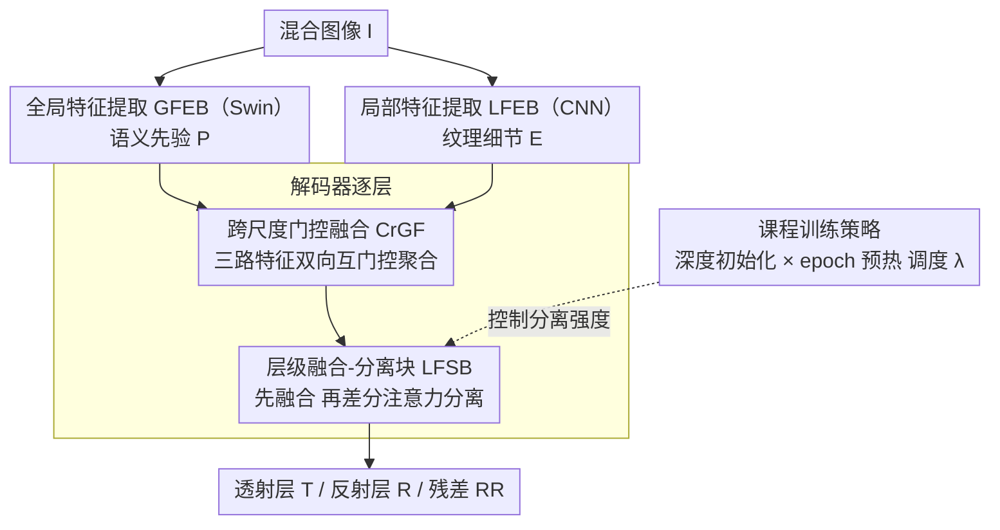

# ReflexSplit: Single Image Reflection Separation via Layer Fusion-Separation

**会议**: CVPR 2026  
**arXiv**: [2601.17468](https://arxiv.org/abs/2601.17468)  
**代码**: [https://github.com/wuw2135/ReflexSplit](https://github.com/wuw2135/ReflexSplit)  
**领域**: 图像修复  
**关键词**: 单图反射分离, 差分注意力, 跨尺度融合, 课程学习, 双流架构

## 一句话总结
ReflexSplit提出一种显式层融合-分离框架，通过跨尺度门控融合(CrGF)自适应聚合多尺度特征，层融合-分离模块(LFSB)中的差分双维度注意力 $\mathbf{A}^t - \lambda_\ell \mathbf{A}^r$ 进行跨流干扰抑制，配合深度依赖初始化+epoch-wise warmup的课程训练，在合成和真实世界反射分离基准上取得SOTA。

## 研究背景与动机

1. **领域现状**：单图反射分离（SIRS）需要将混合图像 $\mathbf{I}$ 分解为透射层 $\mathbf{T}$ 和反射层 $\mathbf{R}$。近年方法从简单线性叠加模型 $\mathbf{I}=\mathbf{T}+\mathbf{R}$ 发展到非线性残差模型 $\mathbf{I}=\mathbf{T}+\mathbf{R}+\Phi(\mathbf{T},\mathbf{R})$，通过YTMT、DSRNet、DSIT等方法增强层间交互。

2. **现有痛点**：当遇到强反射（如水面强光反射）或语义模糊场景（如墙上的月亮画被误识为反射）时，网络会错误地混淆透射和反射层（"透射-反射混淆"）。随着网络深度增加，特征信息损失导致层内和层间特征不可分，这在深层decoder中尤为严重。

3. **核心矛盾**：现有方法在两个维度上存在不足：(a) 层级特征聚合不充分导致梯度不稳定——DSIT缺乏梯度稳定性，RDNet缺少显式尺度协调，MuGI只在单尺度操作；(b) 隐式融合机制导致渐进式层混淆——DSIT直接聚合双维度注意力输出而无分离约束。

4. **本文目标** (a) 如何在多尺度上自适应聚合来自不同来源（语义先验、纹理细节、decoder上下文）的特征？(b) 如何在融合共享结构信息的同时强制执行层特异性的分离？(c) 如何在训练早期避免过强的分离约束导致不稳定？

5. **切入角度**：将反射分离显式建模为"融合-分离"的交替过程——先融合获得共享结构信息，再用差分注意力进行层特异性的分离。将Differential Transformer的注意力消除思想从单流噪声抑制扩展到双流层分离。

6. **核心 idea**：通过在双流架构中交替执行融合（共享结构提取）和差分注意力分离（跨流减法 $\mathbf{A}^t - \lambda_\ell \mathbf{A}^r$），结合课程训练渐进增强分离强度，实现鲁棒的透射-反射分离。

## 方法详解

### 整体框架

ReflexSplit采用双流编码器-解码器架构。编码端包含双分支特征提取：预训练Swin Transformer作为全局特征提取模块（GFEB）提取语义先验 $\{\mathbf{P}_\ell\}$，MuGI-based CNN作为局部特征提取模块（LFEB）捕捉纹理细节 $\{\mathbf{E}_\ell\}$。解码端通过CrGF自适应聚合多尺度特征，LFSB在每个解码层交替执行融合和差分分离。输出透射层 $\mathbf{T}$、反射层 $\mathbf{R}$ 和残差 $\mathbf{RR}$（捕捉非线性交互）。

### 关键设计

**1. 跨尺度门控融合（CrGF）：稳定多尺度特征流，防止解码器渐进退化**

反射分离的特征来自三个互不对齐的来源——Swin 提供的全局语义先验 $\mathbf{P}_\ell$、CNN 提供的局部纹理 $\mathbf{E}_\ell$、以及上一层解码器上下文 $\mathbf{F}_{\ell+1}$。以往要么像 MuGI 只在单一尺度做双流交互、要么像 RobustSIRR 直接拼接而没有自适应门控、要么像 RDNet 走固定可逆路径，跨尺度协调都不充分，深层特征越走越糊、梯度也不稳。CrGF 在解码器 Level 4/3/2 先把三路相加成原始特征 $\mathbf{F}_\ell^{\text{raw}} = \mathbf{F}_{\ell+1} + \mathbf{P}_\ell + \mathbf{E}_\ell$，再让它和解码器上下文走一对互为门控的双向路径：

$$\mathbf{F}_\ell^{\text{main}} = \mathcal{G}_1(\mathbf{F}_\ell^{\text{raw}}) \odot \mathcal{G}_2(\mathbf{F}_{\ell+1}), \qquad \mathbf{F}_\ell^{\text{aux}} = \mathcal{G}_1(\mathbf{F}_{\ell+1}) \odot \mathcal{G}_2(\mathbf{F}_\ell^{\text{raw}})$$

其中门控 $\mathcal{G}$ 通过通道分割挑出互补通道，两路最后再用 softmax 加权融合。双向互门控让"当前层"和"上下文"彼此筛选、动态重组，而不是被动相加，从而在每个尺度上稳住特征流、抵消逐层退化。

**2. 层级融合-分离块（LFSB）：在交替的融合与差分注意力中维持层可分**

强反射或语义歧义场景（水面强光、墙上画着月亮）最容易让网络把透射和反射搅在一起，而隐式融合会让这种混淆随深度不断累积。LFSB 把每个解码阶段拆成"先融合、再分离"的交替三步。早期融合用双向跨流投影 $\mathbf{F}^{t'}_\ell = \mathbf{W}^t[\mathbf{F}^t_\ell \| \mathbf{F}^r_\ell]$ 把两流对齐到共享语义空间、互补取信息；随后是关键的差分双维注意力——沿 batch 维拼接算自注意力 SA 建模空间相关、沿序列维拼接算交叉注意力 CA 捕层间依赖，再对两流做跨流减法：

$$\mathbf{A}^t_{\text{diff}} = (\mathbf{A}^t_{\text{SA}} + \mathbf{A}^t_{\text{CA}}) - \sigma(\lambda_\ell)\,(\mathbf{A}^r_{\text{SA}} + \mathbf{A}^r_{\text{CA}})$$

最后用 FFN + 残差把分离后的特征聚合回去。与 DSIT 直接把 SA、CA 输出相加、毫无分离约束不同，这里用反射流的注意力去"减掉"透射流里残留的反射响应（反之亦然），让层特定信号在所有深度都保持可区分，从机制上堵住深层混淆。

**3. 课程训练策略：分离强度随深度与训练进程渐进增强**

差分项系数 $\lambda$ 是把双刃剑：训练早期特征还没结构化就上强分离会震荡发散，太弱又压根分不开。ReflexSplit 用空间和时间两个维度联合调度。空间上做深度依赖初始化 $\lambda_\ell^{\text{init}} = 0.8 - 0.6\,e^{-0.3\ell}$，深层信息损失重、给更强分离（$\lambda \to 0.8$），浅层保持弱分离（$\lambda \to 0.2$）以留住细粒度纹理；时间上做逐 epoch 预热 $\lambda_{\text{diff}}(e)$，前 30 个 epoch 把全局缩放从 0.1 线性升到 1.0，有效系数取两者之积 $\lambda_\ell(e) = \lambda_\ell^{\text{init}} \cdot \lambda_{\text{diff}}(e)$。这样网络先学整体重构、再逐步聚焦层特定分离，避开了一上来就强约束带来的不稳定。

### 损失函数 / 训练策略

总损失函数包含6项：Charbonnier重建损失 $\mathcal{L}_{\text{rec}}$（透射层）、$\ell_1$反射损失 $\mathcal{L}_{\text{refl}}$、VGG感知损失 $\mathcal{L}_{\text{vgg}}$（layers {2,7,12,21,30}）、颜色一致性损失 $\mathcal{L}_{\text{color}}$、排他性损失 $\mathcal{L}_{\text{exclu}}$和重建约束损失 $\mathcal{L}_{\text{recons}}$。

## 实验关键数据

### 主实验

| 数据集 | PSNR↑ / SSIM↑ | ReflexSplit | 之前SOTA (RDNet) | 比较 |
|--------|------|------|----------|------|
| Real20 | PSNR / SSIM | 25.22 / 0.846 | 25.17 / 0.841 | +0.05 / +0.005 |
| Objects | PSNR / SSIM | 27.08 / 0.929 | 27.11 / 0.925 | -0.03 / +0.004 |
| Postcard | PSNR / SSIM | 25.38 / 0.927 | 25.04 / 0.910 | +0.34 / +0.017 |
| Wild | PSNR / SSIM | 27.30 / 0.933 | 27.86 / 0.931 | -0.56 / +0.002 |
| Nature | PSNR / SSIM | 27.03 / 0.854 | 26.75 / 0.846 | +0.28 / +0.008 |
| 平均 (540张) | PSNR / SSIM | 26.40 / 0.898 | 26.38 / 0.890 | +0.02 / +0.008 |

备注：ReflexSplit参数量174M vs RDNet 266.4M，参数效率更高。

### 消融实验

从论文中LFSB差分注意力可视化和层级特征分离对比可得出以下要点：

| 配置 | 关键效果 | 说明 |
|------|---------|------|
| DSIT (baseline) | 深层出现透射-反射混淆 | 无分离约束，渐进退化 |
| + CrGF | 稳定梯度流 | 自适应跨尺度聚合 |
| + LFSB (w/o diff) | 融合但未分离 | 共享结构但layer混淆未解 |
| + LFSB (w/ diff) | 有效分离各层特征 | 差分算子抑制跨流干扰 |
| + 课程训练 | 训练稳定性提升 | 渐进增强分离强度 |

### 关键发现
- Postcard子集上提升最显著（+0.34 PSNR / +0.017 SSIM），因为该子集反射较强且存在明显的非线性混合
- 差分注意力可视化（Figure 6）清晰展示了跨流减法如何抑制重叠attention模式，将模糊的混合attention转化为层特异性的均衡分布
- 相比RDNet（266.4M参数，两阶段训练），ReflexSplit用更少参数（174M）和更简洁的训练流程达到了可比甚至更好的性能

## 亮点与洞察
- **从Differential Transformer到双流分离的迁移**：原版Diff Transformer在同一head内做减法消除噪声，本文将其扩展到跨流——用另一个流的attention来"减掉"当前流中的层间干扰。这种跨模态/跨流减法的思想可广泛迁移到任何需要分离纠缠信号的多流架构
- **课程训练的空间-时间协同设计**：深度依赖初始化+epoch-wise warmup形成了一个2D的分离强度控制面，使网络在不同阶段和不同深度都有最优的融合-分离平衡，这种细粒度的训练强度控制策略可推广到其他multi-scale分解任务

## 局限与展望
- 在某些子集上（Objects, Wild）PSNR略低于RDNet，说明对某些场景类型的适应性还不够强
- 依赖预训练Swin Transformer提取全局语义，对训练数据域外的泛化能力有待验证
- 差分系数 $\lambda_\ell$ 的初始化公式是手动设计的，可能对不同数据分布不够通用
- 论文未提供计算效率（FLOPs、推理延迟）的详细对比，174M参数相比DSIT（136M）更大但比RDNet（266M）小

## 相关工作与启发
- **vs DSIT**: DSIT用双维度注意力但直接聚合输出无分离约束，导致深层渐进混淆。ReflexSplit用差分算子显式解纠缠
- **vs RDNet**: RDNet用可逆编码器实现无损梯度流但参数量大（266M）且需两阶段训练。ReflexSplit用CrGF实现自适应跨尺度协调，参数更少
- **vs DSRNet**: DSRNet引入MuGI做层间交互但仅在单尺度操作，CrGF将其门控思想扩展到跨尺度聚合

## 评分
- 新颖性: ⭐⭐⭐⭐ 差分注意力在双流分离中的应用有创意，但整体框架是增量式改进
- 实验充分度: ⭐⭐⭐⭐ 多个数据集评估+可视化分析，但缺少详细消融数字
- 写作质量: ⭐⭐⭐⭐ 动机清晰，方法描述详细，图表丰富
- 价值: ⭐⭐⭐ 在反射分离这一较小子领域内有价值，但对更广泛的视觉社区影响有限

<!-- RELATED:START -->

## 相关论文

- [\[AAAI 2026\] Depth-Synergized Mamba Meets Memory Experts for All-Day Image Reflection Separation](../../AAAI2026/image_restoration/depth-synergized_mamba_meets_memory_experts_for_all-day_image_reflection_separat.md)
- [\[CVPR 2026\] DRFusion: Degradation-Robust Fusion via Degradation-Aware Diffusion Framework](drfusion_degradation_robust_fusion_via_degradation_aware_diffusion_framework.md)
- [\[CVPR 2025\] Reversible Decoupling Network for Single Image Reflection Removal](../../CVPR2025/image_restoration/reversible_decoupling_network_for_single_image_reflection_removal.md)
- [\[CVPR 2026\] BHCast: Unlocking Black Hole Plasma Dynamics from a Single Blurry Image with Long-Term Forecasting](bhcast_unlocking_black_hole_plasma_dynamics_from_a_single_blurry_image_with_long.md)
- [\[CVPR 2026\] EVLF: Early Vision-Language Fusion for Generative Dataset Distillation](evlf_early_vision-language_fusion_for_generative_dataset_distillation.md)

<!-- RELATED:END -->
