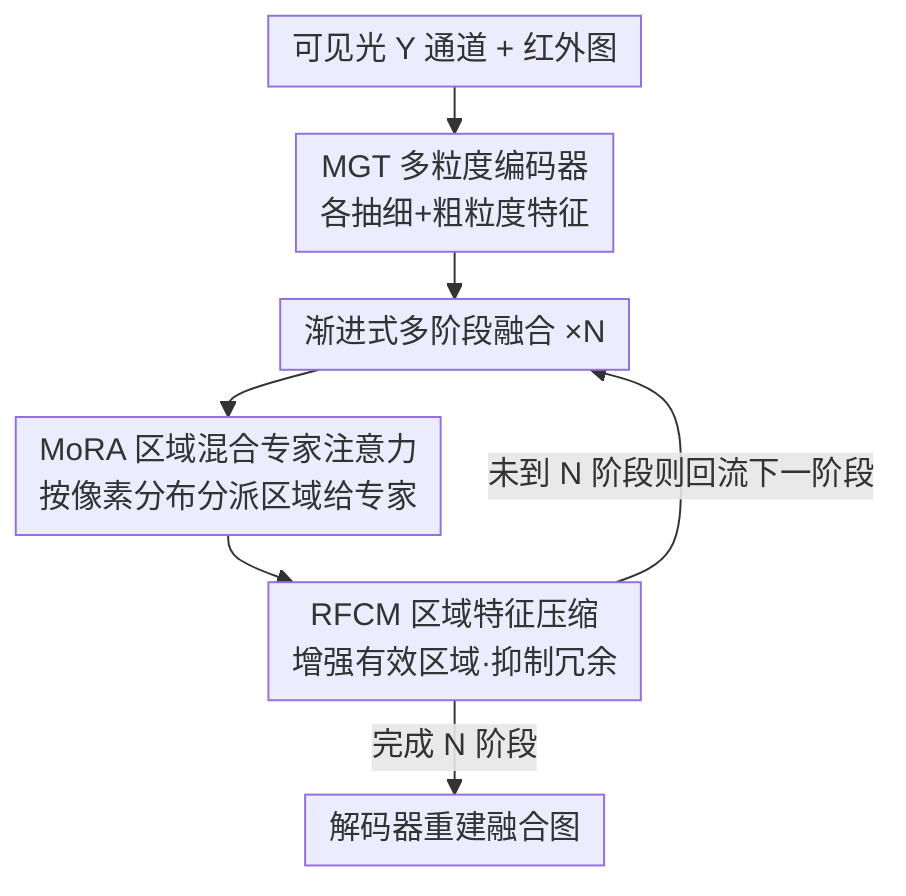

# RegionFuse: Region-Adaptive Pixel Distribution Learning for Infrared and Visible Image Fusion

**会议**: CVPR 2026  
**论文**: [CVF Open Access](https://openaccess.thecvf.com/content/CVPR2026/html/Xia_RegionFuse_Region-Adaptive_Pixel_Distribution_Learning_for_Infrared_and_Visible_Image_CVPR_2026_paper.html)  
**代码**: https://github.com/DarkIceField/RegionFuse （有）  
**领域**: 图像恢复 / 红外可见光图像融合  
**关键词**: 红外可见光融合、区域自适应、像素分布、区域注意力MoE、动态融合权重

## 一句话总结
RegionFuse 把红外-可见光图像融合（IVIF）的融合权重从「全图统一」细化到「按局部像素分布逐区域自适应」：用一个区域级的混合专家注意力（MoRA）把不同像素分布的区域分派给不同的掩码注意力专家、再用区域特征压缩模块（RFCM）增强有效区域、抑制冗余，在四个 IVIF 基准上拿到 SOTA，且对过/欠曝这类非均匀光照尤其鲁棒。

## 研究背景与动机

**领域现状**：红外-可见光图像融合（IVIF）的目标是把红外的热辐射信息和可见光的纹理细节合成到一张图里，弥补单模态成像的短板，并为下游检测、分割提供更好的输入。主流深度方法（AE / GAN / 扩散 / CNN / Transformer / 混合结构）大多走两条路线：**固定融合**（融合权重静态、与场景无关）和**样本自适应融合**（按整张图的全局像素分布动态算权重，如 PIAFusion 的光照感知损失、MoE-Fusion 的混合专家）。

**现有痛点**：固定融合无法随真实成像条件变化——高光照下本该多用可见光纹理、低光照下本该多用红外，静态权重要么丢掉有用的模态信息、要么放大模态噪声。样本自适应融合虽然能随整图调节，但**粒度太粗**：它给整张图算一套权重，忽略了「同一张图内部不同区域的像素分布并不一致」这件事。一张图里完全可能同时存在过曝区、欠曝区和正常曝光区，它们各自该信任的模态完全不同。

**核心矛盾**：融合权重的决策粒度和像素分布的空间不一致性不匹配。样本级权重无法在「同一张图内、不同可靠性的区域」之间做差异化的模态重加权，于是在像素分布严重非均匀（如非均匀光照）的场景下捕捉不到关键跨模态信息、也压不住模态冗余伪影。

**切入角度**：作者观察到「样本自适应其实是区域自适应的一个特例」——当区域大小等于整图时，区域自适应就退化成样本自适应。既然如此，把决策粒度下放到区域级、让每个区域按自己的局部像素分布学一套融合权重，理论上应当严格更强、泛化也更好。直觉上：在欠/过曝区域多引入红外，在光照良好区域尽量保留可见光细节。

**核心 idea**：把融合任务**按局部像素分布拆成多个子任务**，用区域级的混合专家注意力为不同区域动态优化融合权重——即「区域自适应像素分布学习」。

## 方法详解

### 整体框架
RegionFuse 取可见光图的 Y 通道 $I_v$ 和红外图 $I_r$（都是 $\mathbb{R}^{1\times H\times W}$）作输入，输出融合图的 Y 通道 $I_f$。整体由三段组成：**两个 MGT 编码器**分别从可见光、红外抽特征；**区域感知动态融合**模块把两路特征按区域和像素分布自适应地融合；最后一个**解码器**重建图像。

融合模块内部的两个主角是 **RegionFormer Block（RFB）**（核心是 MoRA）和 **RFCM**，它们以「渐进式多阶段融合」串起来。第 $l$ 阶段的融合写成

$$F^l = \mathrm{Fuse}\big([\,F_v + F^{l-1},\; F_r + F^{l-1}\,]\big),\quad l\in[1,N],$$

其中 $[\cdot,\cdot]$ 是通道拼接，每一阶段都在前一阶段融合结果上继续 refine，逐级把跨模态、跨区域信息整合进来。

### 关键设计

**1. 多粒度 Transformer 编码器（MGT）：让区域内细节和跨区域全局都不丢**

IVIF 里像素分布在区域间不一致，编码器既要抽**区域内的细粒度特征**以保住欠/过曝区的细节，又要做**跨区域的粗粒度全局交互**以避免不同区域间像素强度的非均匀。作者直接复用图像恢复里已被验证有效的 X-Restormer block 搭成多粒度编码器：$F_* = \mathrm{MGT}(\mathrm{Embed}(I_*))$，$I_*\in\{I_v, I_r\}$。它不是本文最核心的创新，但消融显示把它换成普通 Restormer 编码器（w/o MGT）后梯度信息和视觉保真度明显下滑，说明这种「细+粗」多层级表征是后续区域自适应融合的前提——区域级的判断必须建立在足够好的区域表征之上。

**2. 混合区域注意力 MoRA：把不同像素分布的区域分派给不同的掩码注意力专家**

这是全文的核心，针对「样本级权重太粗、无法在图内分区域差异化」的痛点。MoRA 把混合专家（MoE）的任务分解能力和注意力的特征交互能力结合起来，让每个专家对一类像素分布负责。具体分三步：

其一，**区域嵌入**：在 Q/K/V 投影之后加一个区域嵌入层，把特征图切成区域级 token，得到 $Q,K,V\in\mathbb{R}^{C\frac{H}{R}\frac{W}{R}\times R^2}$（$R$ 为区域大小）；并引入随网络深度增大的重叠划分，最终区域大小 $R=(1+\gamma)R_o$（$\gamma$ 是随深度增长的重叠比），以进一步缓解区域间像素强度的突变。

其二，**像素分布感知路由**：用一个 MLP + softmax 预测每个区域对各专家的责任分数 $S=\mathrm{Softmax}(\mathrm{MLP}(\mathrm{RSP}(X)))$，其中 $S\in\mathbb{R}^{E\times C\frac{H}{R}\frac{W}{R}}$，$E$ 是专家数，$\mathrm{RSP}(\cdot)$ 是区域切分。路由按像素分布把区域归类。

其三，**掩码注意力专家**：每个专家用一张注意力掩码 $M_e$ 限制自己只在「同一类像素分布」的区域内做交互。掩码由路由的 TopK 选择决定——$\hat C(i,e)=\mathrm{TopK}(s_i(e),k)$ 表示第 $i$ 个区域是否被第 $e$ 个专家选中，

$$m^e_{ij}=\begin{cases}1,& \hat C(i,e)=1 \text{ 且 } \hat C(j,e)=1\\ 0,& \text{否则}\end{cases}$$

第 $e$ 个专家的注意力为 $\mathrm{ATTN}_e(Q,K,V)=\mathrm{Softmax}(M_e\odot QK^\top/\alpha)\,V$（$\alpha$ 是可学习缩放），最终 MoRA 输出是各专家按责任分数的加权和 $\sum_{e} S(e)\,\mathrm{ATTN}_e(Q,K,V)$。这样一来，过曝区和正常曝光区会被路由到不同专家、用各自的融合行为处理，融合权重真正做到了「逐区域随局部像素分布而变」。可视化也证实了专家分工：浅层专家关注简单的亮度变化，深层专家捕捉显著物体/背景这类高层语义。

**3. 区域特征压缩模块 RFCM：在高维特征上增强有效区域、抑制冗余**

直接在高维特征上做注意力开销过大，RFCM 接在每个 MoRA 之后做区域级压缩。先把特征重排成区域 patch $F_r\in\mathbb{R}^{\frac{H}{R}\frac{W}{R}\times C\times R\times R}$，用通道注意力 $F'_r=M_c(F_r)\odot F_r$ 增强关键通道、压低冗余，其中 $M_c(F_r)=\mathrm{Sigmoid}(\mathrm{Conv}(\mathrm{GAP}(F_r)))$；再用 $1\times1$ 卷积 + LeakyReLU 降维 $F'_{r\_out}=\mathrm{LReLU}(\mathrm{Conv}(F'_r))$，把通道从 $C$ 压到 $C'$，最后合并回压缩后的输出特征图。它解决的是「MoRA 产生的区域表征里夹带冗余、且高维注意力太贵」的问题——消融里把 RFCM 换成普通卷积（w/o RFCM）后视觉保真度掉得最多，说明跨区域的模态交互需要这一步显式的「挑重点」才够有效。

**4. 增强强度损失：用梯度加权掩码取代逐元素取最大**

IVIF 没有 ground truth，损失设计直接决定融合质量。传统强度损失用逐元素取 max 合并两模态，会在过曝区引入过多可见光、在光照良好区引入冗余红外，无法适配图内像素分布不一致。作者改用梯度加权掩码 $M$ 合并：

$$L_{int}=\tfrac{1}{HW}\big\|\,I_f-(M\odot I_v+(1-M)\odot I_r)\,\big\|_F^2,$$

掩码按局部区域的平均梯度决定：$m(i,j)=1$ 当 $G_v(i,j)>G_r(i,j)$ 否则 $0$，其中 $G_v, G_r$ 是 $R\times R$ 局部区域内可见光/红外的 Sobel 平均梯度。这等于让网络在过曝区更依赖红外、在光照良好区保留更多可见光纹理。总损失再叠加梯度损失 $L_{gra}=\tfrac{1}{HW}\|\nabla I_f-\max(\nabla I_v,\nabla I_r)\|_1$ 和（仅在前 5 个 epoch 启用的）负载均衡损失 $L_{load}$ 来稳定路由训练：$L=L_{int}+\lambda L_{gra}+\mu L_{load}$。

### 损失函数 / 训练策略
在 MSRS 训练集（1083 对）上训练，128×128 patch，Adam 优化器，80 epoch + 4 epoch 线性 warm-up，余弦学习率衰减，batch 8，初始 lr $10^{-4}$，$\lambda=\mu=5$。负载均衡损失只在前 5 个 epoch 用，目的是先把路由网络训稳再退出。

## 实验关键数据

### 主实验
四个公开基准（MSRS / RoadScene / M3FD / TNO）上和 7 个 SOTA 比，五个指标 SF / AG / VIF / Qabf / Qcb 越高越好。RegionFuse 仅在 MSRS 训练，**后三个数据集零微调直接测**仍领先，体现强泛化。

| 数据集 | 方法 | SF↑ | AG↑ | VIF↑ | Qabf↑ | Qcb↑ |
|--------|------|------|------|------|------|------|
| MSRS | PIAFusion | 11.49 | 3.75 | 0.99 | 0.69 | 0.58 |
| MSRS | CDDFuse | 11.56 | 3.73 | 1.05 | 0.69 | 0.58 |
| MSRS | DCEvo | 11.46 | 3.71 | 1.03 | 0.71 | 0.59 |
| MSRS | **RegionFuse** | **12.12** | **3.99** | **1.06** | **0.72** | **0.60** |
| RoadScene | CDDFuse | 18.93 | 6.74 | 0.62 | 0.48 | 0.49 |
| RoadScene | DCEvo | 14.83 | 5.50 | 0.68 | 0.57 | 0.48 |
| RoadScene | **RegionFuse** | 18.73 | **6.81** | **0.68** | **0.59** | **0.51** |

注：RoadScene 上 SF 略低于 CDDFuse（18.73 vs 18.93），但 AG / Qabf / Qcb 等多数指标取得最优或并列最优；M3FD、TNO 上 RegionFuse 在 VIF / Qabf 等保真度指标上同样领先。

### 消融实验
在 MSRS 上逐个去掉模块（指标越高越好）：

| 配置 | SF | AG | VIF | Qabf | Qcb | 说明 |
|------|------|------|------|------|------|------|
| w/o MGT | 11.374 | 3.678 | 1.037 | 0.713 | 0.597 | 换普通 Restormer 编码器，梯度/保真明显下滑 |
| w/o MoRA | 11.640 | 3.774 | 1.060 | 0.717 | 0.592 | 换普通注意力，融合效果变差 |
| w/o RFCM | 11.779 | 3.832 | 1.018 | 0.682 | 0.569 | 换普通卷积，保真度掉得最多 |
| w/o $L_{load}$ | 12.088 | 3.954 | 1.036 | 0.714 | 0.593 | VIF / Qcb 小幅下降 |
| Region→Sample | 11.965 | 3.938 | 1.039 | 0.719 | 0.584 | 退化成样本自适应，VIF / Qcb 下降 |
| **Full（Ours）** | **12.115** | **3.995** | **1.063** | **0.723** | **0.601** | 完整模型最优 |

### 下游与扩展
- **目标检测（M3FD，YOLOv5s）**：用 RegionFuse 融合图训练的检测器 mAP@0.5 达 **86.50%**，超过所有对手（DDFM 85.05、PIAFusion 84.41），且在 Lamp（84.20）和 Motorcycle（87.87）类别 AP 最高。
- **近红外-可见光（VIS-NIR Scene，未见任务）**：零迁移到 NIR-VIS 仍全面领先（Ours VIF 1.12 / Qcb 0.62），验证区域自适应范式对复杂场景变化的适应力。
- **极端非均匀光照**：用线性映射 $I'=\phi[k(I-0.5)+0.5]$ 人为造出同时含过曝/欠曝的图，$k$ 从 1.5 到 5.0；$k$ 越大、RegionFuse 的优势越明显，印证其对非均匀像素分布的鲁棒性。

### 关键发现
- **RFCM 去掉掉点最狠**（Qabf 0.723→0.682），说明跨区域模态交互后必须显式压缩、挑重点，否则冗余拖累保真度。
- **区域级 vs 样本级**（Region→Sample）直接验证了核心假设：把决策粒度从整图下放到区域，VIF / Qcb 都涨，证明「样本自适应是区域自适应特例」这一论断在实测上成立。
- **专家确有分工且随深度演化**：浅层专家管简单亮度差异、深层专家捕显著物体/背景，说明 MoRA 的路由学到的不是随机划分，而是有语义层级的像素分布归类。

## 亮点与洞察
- **粒度细化是个干净的故事**：把「固定 → 样本自适应 → 区域自适应」摆成一条递进链，并指出样本自适应只是区域大小等于整图的特例，逻辑上天然地论证了自己更强——这种「把已有方法收编成自己的特例」的叙事很有说服力。
- **MoE + 掩码注意力的组合很自然**：用路由按像素分布分派区域、用注意力掩码把每个专家关在「同分布区域」里交互，等于把 MoE 的「条件计算」落到了空间区域维度，而不是常见的 token / 样本维度，是一个可迁移到其他「图内分布不一致」任务（如非均匀去雾、HDR 融合）的思路。
- **损失层面也对齐了动机**：梯度加权掩码强度损失不是常规取 max，而是按局部梯度判断该信谁，直接把「过曝信红外、亮处信可见光」的直觉写进了监督信号，和网络结构的区域自适应思想首尾呼应。
- **零微调泛化 + 下游涨点**：四基准里三个零微调领先、检测 mAP 也涨，说明区域自适应不是过拟合某个数据集的 trick。

## 局限与展望
- **区域大小 $R$ 和重叠比 $\gamma$ 是关键超参**，正文把敏感性分析放到了补充材料，主文没给出 $R$ 取值范围对性能的曲线，实际部署时如何选区域粒度需要额外调参。
- **专家数 $E$ 和 TopK 的 $k$ 缺乏主文消融**：MoE 类方法对专家数和路由稀疏度通常敏感，本文主文未展示这部分，难以判断容量-计算的权衡点。
- **计算开销只定性说"可接受"**：虽然 RFCM 是为降低注意力开销而设计，但正文没给出和 SOTA 的参数量 / FLOPs / 推理速度对照表，高分辨率下的实际效率仍需看代码验证。
- **只融合 Y 通道**：沿用了 Y 通道融合 + 色彩通道直接保留的常规做法，对色彩一致性本身没有专门处理，强光照漂移下的颜色保真未单独评估。

## 相关工作与启发
- **vs PIAFusion**：PIAFusion 用光照感知损失在**样本级**调节融合，对整图算一套权重；RegionFuse 把光照/像素分布的判断下放到区域级，在图内过曝/正常区差异化处理，因此在非均匀光照下更稳。
- **vs MoE-Fusion**：MoE-Fusion 同样用混合专家做动态融合，但路由的是**样本**（不同图给不同专家），本质仍是样本自适应——按本文的定义它正是 RegionFuse 的一个特例（区域=整图）；RegionFuse 把专家分派到**区域**并用掩码注意力约束在同分布区域内交互。
- **vs CDDFuse / Restormer 系**：这些方法靠强表征骨干提升融合质量，但融合策略仍是静态或全局的；RegionFuse 复用 X-Restormer 做多粒度编码器作为底座，真正的创新在其上的区域自适应动态融合。
- **可迁移启发**：「按局部分布把空间区域路由给专门的掩码注意力专家」这一机制，对任何「同一张图内统计特性高度不一致」的任务（非均匀去雾/去雨、HDR 重建、多焦点融合）都值得借鉴。

## 评分
- 新颖性: ⭐⭐⭐⭐ 把融合粒度从样本级细化到区域级、用 MoE+掩码注意力实现区域自适应，思路清晰且收编了样本自适应为特例，但 MoE/注意力/区域划分各组件均有前作渊源。
- 实验充分度: ⭐⭐⭐⭐ 四基准 + 极端光照 + 检测/NIR-VIS 双下游 + 完整模块消融 + 专家可视化，较扎实；但缺主文的效率对照和专家数/区域大小消融。
- 写作质量: ⭐⭐⭐⭐ 动机递进链讲得明白，公式和模块对应清楚；部分符号（如 $S(e)$ 与责任分数的索引）略显仓促，需对照原文。
- 价值: ⭐⭐⭐⭐ 在 IVIF 上拿到 SOTA 且开源、下游涨点，区域自适应路由机制对一类「图内分布不一致」问题有迁移价值。

<!-- RELATED:START -->

## 相关论文

- [\[CVPR 2026\] Bridging Human Evaluation to Infrared and Visible Image Fusion](bridging_human_evaluation_to_infrared_and_visible_image_fusion.md)
- [\[CVPR 2026\] Customized Fusion: A Closed-Loop Dynamic Network for Adaptive Multi-Task-Aware Infrared-Visible Image Fusion](customized_fusion_a_closed-loop_dynamic_network_for_adaptive_multi-task-aware_in.md)
- [\[CVPR 2026\] Beyond Strict Pairing: Arbitrarily Paired Training for High-Performance Infrared and Visible Image Fusion](beyond_strict_pairing_arbitrarily_paired_training_for_high-performance_infrared_.md)
- [\[CVPR 2026\] Degradation-Robust Fusion: An Efficient Degradation-Aware Diffusion Framework for Multimodal Image Fusion in Arbitrary Degradation Scenarios](degradation-robust_fusion_an_efficient_degradation-aware_diffusion_framework_for.md)
- [\[CVPR 2026\] Enhancing Unregistered Hyperspectral Image Super-Resolution via Unmixing-based Abundance Fusion Learning](enhancing_unregistered_hyperspectral_image_super-resolution_via_unmixing-based_a.md)

<!-- RELATED:END -->
