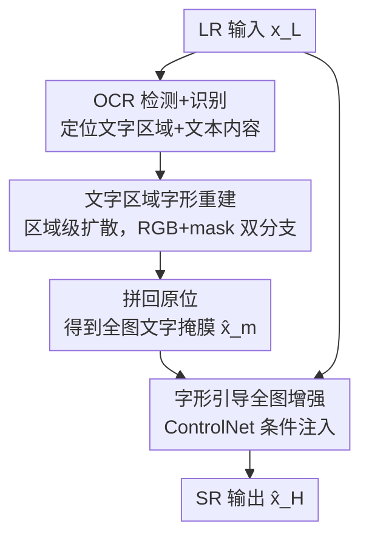

# Restore Text First, Enhance Image Later: Two-Stage Scene Text Image Super-Resolution with Glyph Structure Guidance

**会议**: CVPR 2026  
**论文**: [CVF Open Access](https://openaccess.thecvf.com/content/CVPR2026/html/Luo_Restore_Text_First_Enhance_Image_Later_Two-Stage_Scene_Text_Image_CVPR_2026_paper.html)  
**代码**: 项目页（论文标注 "Project page: link"，未给出具体地址 ⚠️ 以原文为准）  
**领域**: 图像恢复 / 超分辨率  
**关键词**: 场景文字超分、字形结构、两阶段、扩散模型、ControlNet 引导

## 一句话总结
TiGeSR 用"先修字、后修图"的两阶段范式把场景文字超分中"图像质量"与"文字可读性"的固有取舍拆开：先用扩散模型在文字区域重建精确字形结构，再把这些字形作为条件注入 ControlNet 做全图超分，并配套发布了首个最大变焦 ×14.29 的中文场景文字数据集 UZ-ST，在 Real-CE 与 UZ-ST 上的图像质量与 OCR 准确率都拿到 SOTA。

## 研究背景与动机
**领域现状**：场景文字图像超分（Scene Text Image Super-Resolution）要从退化的低分辨率输入恢复高分辨率图像，同时保住文字含义。近年主流做法是借扩散模型的强生成先验（StableSR、DiffBIR、SeeSR、SUPIR、OSEDiff、DiT4SR 等）去"补"丢失的细节。

**现有痛点**：通用图像超分方法以"整体观感"为目标，擅长合成草地、树叶这类自然纹理，但会把文字区域搞成乱码——因为它们忽略文字结构，倾向把字形坍缩成"平均化"的简化形态，产生重叠或畸变的字。这一问题在中文上尤其严重：笔画复杂、字形多样、在图中显著性又低，一笔之差就可能改变字义。另一类只处理文字区域的方法（如 MARCONet、DiffTSR）虽然提升可读性，却缺少全局背景约束，导致文字与背景之间风格不一致、出现块状伪影。

**核心矛盾**：可读性（文字结构精确）与图像质量（全图自然协调）之间存在 trade-off。作者的关键观察是：**这两个目标并非互斥，只要把文字区域和非文字区域显式地区别对待**——文字结构用专门机制重建，再用它去引导全图恢复，就能在不引入伪影的前提下保持整体风格协调。

**本文目标**：① 让文字字形被准确重建；② 让全图在保住文字结构的同时维持高视觉质量；③ 补上中文、强退化、多行文本的评测数据缺口。

**核心 idea**："restore text first, enhance image later"——把字形重建从图像增强中**解耦**成两个串行阶段，第一阶段专注文字结构，第二阶段把恢复出的字形当条件来引导全图超分。

## 方法详解

### 整体框架
TiGeSR 是一个两阶段串行 pipeline。输入是低分辨率图像 $x_L \in \mathbb{R}^{H\times W\times C}$，输出是超分结果 $\hat{x}_H$。**第一阶段（Text Restoration）**：用 OCR 检测器定位每个文字区域并识别其文本内容，把每个区域送进一个基于扩散的字形结构修复模型，逐区域重建笔画几何，再把所有恢复好的区域拼回原位置，得到一张全图的文字掩膜 $\hat{x}_m$。**第二阶段（Image Enhancement）**：把文字掩膜 $\hat{x}_m$ 和低分辨率输入 $x_L$ 一起喂给一个 ControlNet 式网络，由它在特定时间步去噪、生成全图超分结果 $\hat{x}_H$——字形结构作为条件"操控"全局超分，让文字与背景协调、抑制伪影。

### 关键设计

**1. 两阶段"先修字、后修图"解耦范式：把可读性与画质拆成两个串行目标**

这是全文的核心。痛点是单一生成先验同时优化全图，文字结构必然被"平均化"牺牲。TiGeSR 把流程拆成：阶段一只对文字区域 $\tilde{x}_L$ 做字形重建、产出文字掩膜 $\hat{x}_m$；阶段二再把 $\hat{x}_m$ 作为结构条件注入全图超分。第二阶段用 ControlNet $\epsilon_\phi$ 在特定时间步 $t$ 对 $z_L$ 做单步去噪，超分隐变量为 $\hat{z}_H = z_L - \sigma_t\,\epsilon_\phi(z_L, \hat{z}_m, t, c_{\text{Null}})$，其中 $c_{\text{Null}}$ 是空文本嵌入、$\sigma_t$ 由预设扩散步决定。这样"结构感知的控制"被注入生成过程，网络在增强全局画质的同时被字形掩膜钉住、不再把笔画写崩——既保住可读性又维持背景协调，正面破掉了"可读性 vs 画质"的 trade-off。

**2. 区域级字形结构重建（RGB/结构双分支）：在退化文字上稳健地长出笔画**

痛点是现成的文字分割模型（如 HiSAM）只在干净高清文字上好使，面对低分辨率里残缺、畸变的文字就失效。TiGeSR 的第一阶段对每个检测到的文字区域 $\tilde{x}_L$ 先用 VAE 编码为 $\tilde{z}_L$，与噪声 $z_T$ 拼接后由 UNet $\epsilon_\theta$ 迭代去噪成**两条分支**：外观分支 $z^{RGB}_{t-1}$ 和结构分支 $z^m_{t-1}$。同时把 OCR 识别出的文本内容 $y$ 嵌入为 $c_{te}$、经 cross-attention 融进去噪过程，用语义条件指导结构恢复。$T$ 步后结构分支输出 $z^m_0$ 解码成区域掩膜 $\tilde{x}_m$，所有区域拼成最终掩膜 $\hat{x}_m$。只在真实文字区域上重建，让模型专注字形、不被非文字干扰，也降低了对文字显著性的敏感。

**3. 两阶段一损"合成-真实"训练 + 分割导向损失：兼顾字形精度与真实退化泛化**

痛点是真实退化文字的分割掩膜稀缺，纯合成数据退化人工、泛化差，但人工标注真实样本又昂贵。作者设计**两阶段训练**：Phase 1 同时用合成+真实数据，让模型既能从真实 LR 学到退化模式、又能产出文字掩膜；但真实数据里掩膜含噪会拖累质量，于是 Phase 2 冻结 RGB-out 与 mask-out 模块、只用合成数据精修 UNet，提升掩膜质量。第一阶段总损失为 $\mathcal{L}=\lambda_{td}\mathcal{L}_{td}+\lambda_{Seg}\mathcal{L}_{Seg}$：$\mathcal{L}_{td}$ 是文本控制扩散损失（标准的 $\epsilon$ 预测 MSE，条件含 $\tilde{z}_L$ 和 $c_{te}$）；$\mathcal{L}_{Seg}$ 是分割导向损失——把结构分支的 $z^m_0$ 经 VAE 解码得近似掩膜 $x'^m_0$，再用 MSE+Focal+Dice 三项组合在像素级监督它逼近真值掩膜 $x^m_0$，从而让字形在像素级被约束准确。

**4. 字形感知 ControlNet + 边缘损失：让全图增强不破坏笔画完整性**

第二阶段的训练目标在重建损失外特意强化笔画。重建损失 $\mathcal{L}_{img}=\lambda_{l2}\|x_H-\hat{x}_H\|^2_2+\lambda_{LPIPS}\,\text{LPIPS}(x_H,\hat{x}_H)$ 兼顾保真与感知。为强调字形结构，用 Sobel 算子提取文字边界、加一项边缘损失 $\mathcal{L}_{edge}=\|\text{Sobel}(x_H)-\text{Sobel}(\hat{x}_H)\|^2_2$，第二阶段总损失 $\mathcal{L}=\mathcal{L}_{img}+\lambda_{edge}\mathcal{L}_{edge}$。字形掩膜条件 + 边缘约束目标一起，让模型在协调文字与背景外观的同时守住笔画完整性。

### 损失函数 / 训练策略
- **阶段一**：$\mathcal{L}=\lambda_{td}\mathcal{L}_{td}+\lambda_{Seg}\mathcal{L}_{Seg}$，分割损失 = MSE + Focal + Dice（在解码后的近似掩膜上像素级监督）。两阶段训练：Phase 1 合成+真实，Phase 2 冻结输出块仅用合成数据精修掩膜。
- **阶段二**：$\mathcal{L}=\mathcal{L}_{img}+\lambda_{edge}\mathcal{L}_{edge}$，$\mathcal{L}_{img}$ = MSE + LPIPS，边缘项用 Sobel。
- **实现**：合成数据基于 LSDIR 渲染文字 + Real-ESRGAN 退化；真实数据来自 Real-CE（过滤重标后 337 训练 / 188 测试）与 UZ-ST。阶段一基于 IDM 架构，阶段二基于 Stable Diffusion 3.5，采用 tile-based 推理。

## 实验关键数据

### 主实验
全图图像质量 + 文字准确率（OCR-A 为基于 Levenshtein ratio 的 OCR 准确率，越高越好；OCR-A $=\frac{\text{Len}(s_{pred})+\text{Len}(s_{gt})-\text{Dist}(s_{pred},s_{gt})}{\text{Len}(s_{pred})+\text{Len}(s_{gt})}$）。下表为 Real-CE（×4 最难档）与 UZ-ST（各档平均）上的代表性对比：

| 数据集 | 方法 | PSNR↑ | SSIM↑ | LPIPS↓ | DISTS↓ | FID↓ | OCR-A↑ |
|--------|------|-------|-------|--------|--------|------|--------|
| Real-CE | HAT | 23.61 | 0.830 | 0.214 | 0.176 | 51.16 | 56.6% |
| Real-CE | TADiSR | 23.83 | 0.790 | 0.286 | 0.154 | 44.42 | 64.7% |
| Real-CE | **TiGeSR** | **24.12** | **0.839** | **0.164** | **0.125** | **38.72** | **67.3%** |
| UZ-ST | OSEDiff | 25.07 | 0.819 | 0.201 | 0.169 | 20.53 | 28.9% |
| UZ-ST | TADiSR | 24.61 | 0.796 | 0.203 | 0.160 | 36.61 | 36.6% |
| UZ-ST | **TiGeSR** | **25.48** | **0.830** | **0.196** | **0.156** | **20.01** | **43.0%** |

文字区域裁剪指标（带下标 cr）上 TiGeSR 也最优，且 $\Delta$OCR-A（相对 LR 的 OCR 准确率变化）是少数为正的方法：Real-CE +2.5%、UZ-ST +1.3%，而几乎所有通用超分方法都为负（如 SUPIR −37.0%、OSEDiff −38.0%），说明它们"修图反而把字修没了"。

### 消融实验
| 消融维度 | 配置 | OCR-A↑ | 说明 |
|----------|------|--------|------|
| 数据集 UZ-ST | OSEDiff w/o → w/ | 22.8% → 28.9% | 通用模型用 UZ-ST 微调即涨点 |
| 数据集 UZ-ST | DiT4SR w/o → w/ | 19.3% → 23.7% | 同上，验证数据集有效性 |
| 数据集 UZ-ST | Ours w/o → w/ | 40.0% → 43.0% | 本方法配 UZ-ST 进一步提升 |
| OCR 文本输入 | Null Text | 40.4% | 不给 OCR 文本仍强于 TADiSR(35.5%) |
| OCR 文本输入 | Random Text | 40.3% | 对错误 OCR 鲁棒 |
| OCR 文本输入 | Predicted (Ours) | 44.6% | 完整版（35mm 子集） |

### 关键发现
- **解耦范式是核心增益来源**：相比通用超分方法在文字区域普遍掉点（$\Delta$OCR-A 为负），TiGeSR 是少数能正向提升文字可读性的方法，验证"先修字再修图"确实破掉了 trade-off。
- **数据集对所有架构都有效**：UNet 系（OSEDiff）和 DiT 系（DiT4SR）用 UZ-ST 微调都涨 OCR-A，说明强退化中文数据的价值不限于本方法。
- **对 OCR 依赖有限**：即便阶段一喂空文本/随机文本，OCR-A 仍达 40.4%/40.3%，说明模型能从 LR 输入自身的文字结构恢复字形，而非过度依赖 OCR 识别结果。
- **典型失败对手**：TADiSR 受 cross-attention 分辨率限制，在强退化和小字上崩；MARCONet/DiffTSR 处理长文本序列和大宽高比文字时易畸变，且缺全局语义引导导致文字与背景割裂。

## 亮点与洞察
- **"先修字后修图"是个干净的解耦视角**：把文字结构从图像增强里抽出来单独重建，再当条件回注，思路简单却直接命中"文字 vs 背景"的本质矛盾——这种"先恢复硬约束、再生成软细节"的拆法可迁移到任何"局部结构敏感 + 全局观感"冲突的恢复任务（如表格、乐谱、电路图）。
- **结构分支 + 分割导向损失**：把扩散去噪的中间结果解码回像素、用 MSE+Focal+Dice 在像素级监督掩膜质量，是个把"生成"与"分割"缝起来的实用 trick。
- **数据集贡献扎实**：UZ-ST 用四焦段（14/35/85/200mm）真机采集 + 级联粗到细对齐，首次把中文场景文字超分推到 ×14.29 变焦，填了"强退化 + 多行 + 中文"三重缺口。
- **$\Delta$OCR-A 这个评测视角很尖锐**：直接暴露了"通用超分修图会损害文字可读性"这一被长期忽视的问题。

## 局限与展望
- **依赖 OCR 检测定位文字区域**：虽然对识别文本鲁棒，但若检测漏掉/错框文字区域，第一阶段无从修复——pipeline 的上游误差未被讨论。
- **两阶段串行 + 扩散去噪**：阶段一逐区域多步去噪 + 阶段二全图超分，推理成本与延迟较高，论文未给出运行时/显存的正面对比（仅提及 tile-based 推理）。
- **代码/项目页地址未明确**：论文写 "Project page: link" 但缺具体 URL（⚠️ 以原文为准），复现门槛偏高。
- **以中文为主验证**：方法动机和数据集都强调中文复杂字形，对其他复杂书写系统（如阿拉伯文、天城体）的泛化未验证。

## 相关工作与启发
- **vs TADiSR**：TADiSR 用 Kolors 为底、聚合 cross-attention 图做文字结构监督，但受 cross-attention 分辨率限制，小字/强退化下崩；TiGeSR 用专门的区域级字形重建分支 + 像素级分割损失，不受注意力分辨率约束，强退化下更稳。
- **vs MARCONet / DiffTSR**：二者是纯文字区域重建（StyleGAN 字形码本 / 隐空间分别去噪文字与图像），缺全局背景约束，文字与背景风格不一致、有块状伪影；TiGeSR 第二阶段用 ControlNet 把字形当条件注入全图超分，背景协调度更好。
- **vs DiffBIR / SeeSR / SUPIR / OSEDiff / DiT4SR**：这些通用扩散超分以全图观感为目标，文字区域 $\Delta$OCR-A 普遍为负（修图损可读性）；TiGeSR 显式区分文字/非文字，是少数 $\Delta$OCR-A 为正的方法。

## 评分
- 新颖性: ⭐⭐⭐⭐ "先修字后修图"的解耦范式简单但切中要害，配套数据集也有增量价值，不过两阶段+条件注入在思路上属组合式创新
- 实验充分度: ⭐⭐⭐⭐⭐ 两个 benchmark、全图与文字区域双套指标、$\Delta$OCR-A、数据集/OCR 双消融，覆盖充分
- 写作质量: ⭐⭐⭐⭐ 动机和方法叙述清晰、图表完整，部分公式排版（缓存里）有 LaTeX 转义噪声
- 价值: ⭐⭐⭐⭐ 直面"超分损文字可读性"的真实痛点，UZ-ST 数据集对中文场景文字超分社区有实际价值

<!-- RELATED:START -->

## 相关论文

- [\[CVPR 2026\] SDUIE: Semi-Supervised Diffusion for Underwater Image Enhancement with Quant-Text Dual Control](sduie_semi-supervised_diffusion_for_underwater_image_enhancement_with_quant-text.md)
- [\[CVPR 2026\] White-Balance First, Adjust Later: Cross-Camera Color Constancy via Vision-Language Evaluation](white-balance_first_adjust_later_cross-camera_color_constancy_via_vision-languag.md)
- [\[CVPR 2026\] F²HDR: Two-Stage HDR Video Reconstruction via Flow Adapter and Physical Motion Modeling](f2hdr_two-stage_hdr_video_reconstruction_via_flow_adapter_and_physical_motion_mo.md)
- [\[CVPR 2026\] Rethinking Diffusion Model-Based Video Super-Resolution: Leveraging Dense Guidance from Aligned Features](rethinking_diffusion_model-based_video_super-resolution_leveraging_dense_guidanc.md)
- [\[CVPR 2026\] RAR: Restore, Assess, Repeat - A Unified Framework for Iterative Image Restoration](rar_restore_assess_repeat_a_unified_framework_for_iterative_image_restoration.md)

<!-- RELATED:END -->
