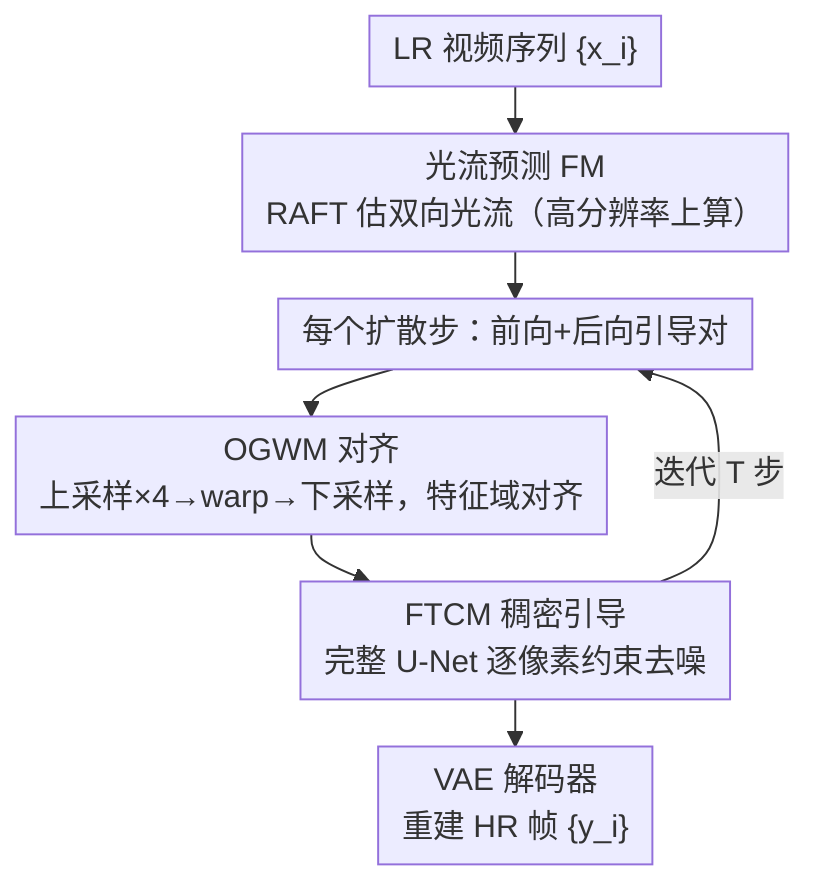

# Rethinking Diffusion Model-Based Video Super-Resolution: Leveraging Dense Guidance from Aligned Features

**会议**: CVPR 2026  
**论文**: [CVF Open Access](https://openaccess.thecvf.com/content/CVPR2026/html/Xu_Rethinking_Diffusion_Model-Based_Video_Super-Resolution_Leveraging_Dense_Guidance_from_Aligned_CVPR_2026_paper.html)  
**代码**: https://github.com/tszssong/DGAF-VSR  
**领域**: 图像恢复 / 视频超分辨率  
**关键词**: 视频超分、扩散模型、特征对齐、光流 warping、稠密时序引导

## 一句话总结
DGAF-VSR 重新审视扩散视频超分里"对齐 + 补偿"的作用，先用量化实验得出两条观察——特征域比像素域时空相关性更强、在高分辨率上 warping 更能保住高频，再据此设计在特征域做"上采样-warp-下采样"对齐的 OGWM 模块和用完整 U-Net 做稠密时序引导的 FTCM 模块，在感知质量、保真度、时序一致性三方面同时刷过 SOTA（DISTS −35.82%、PSNR +0.20dB、tLPIPS −30.37%）。

## 研究背景与动机
**领域现状**：视频超分（VSR）相比单图超分（SISR）多了相邻帧的时序信息，可同时提升空间细节与时序一致性。非扩散方法（EDVR、BasicVSR/++、RVRT）保真度高但感知质量差（模糊、过平滑）；扩散（DM）系方法（StableVSR、MGLD-VSR 等）感知质量惊艳、时序也较稳。

**现有痛点**：现有 DM-based VSR **过度偏向感知合成，忽视了"准确对齐 + 充分补偿"能带来的保真增益**。具体表现为两点：① 它们大多直接在像素域或仅用 U-Net 编码器做时序引导，补偿不够稠密；② 特征对齐不准导致误差在扩散步间累积，最终 PSNR/SSIM 这类保真指标偏低。

**核心矛盾**：感知质量与保真度（fidelity）之间长期被当成 trade-off，而作者认为问题根子在于"在哪个域、以什么分辨率做对齐与引导"没被想清楚——对齐和补偿的潜力在 DM pipeline 里被低估了。

**本文目标**：① 搞清楚"特征域 vs 像素域"哪个更适合做时序引导；② 搞清楚 warping 在什么分辨率下最能保住高频；③ 据此设计对齐模块和稠密引导模块，让感知和保真兼得。

**切入角度**：作者不靠直觉，而是在 REDS4 上做了两组量化观察（Observation 1/2），用数据说话再倒推模块设计。

**核心 idea**：把对齐与稠密引导都搬到**特征域**、并在**上采样后的高分辨率特征**上做 warping，再用完整 U-Net 提供"逐像素约束"的稠密时序条件，从而在扩散过程中保住原始视频信息。

## 方法详解

### 整体框架
DGAF-VSR 由三部分组成：一个光流预测模块 FM（Flow prediction Module，用 RAFT 估计相邻帧间双向光流）、$T$ 个扩散步、一个预训练 VAE 解码器。给定 $N$ 帧低分辨率序列 $\{x_i\}$，目标是重建高分辨率序列 $\{y_i\}$。$T$ 个扩散步被切成 $T/2$ 对，每一对含一次**前向引导**（用前面帧的特征）和一次**后向引导**（用后面帧的特征）。每个引导过程里串两个模块：先用 **OGWM** 把相邻特征对齐，再用 **FTCM** 在对齐后相邻特征的稠密引导下去噪当前特征。$T$ 步后把最终特征送进 VAE 解码器得到高分辨率帧。

### 关键设计

**1. 两条量化观察：把"在哪个域、什么分辨率对齐"从直觉变成数据结论**

这是整篇方法的地基。**观察 1**：特征域（latent）比像素域有更强的时空相关性。作者在 REDS4 上对相邻帧的"无噪近似特征" $\tilde{z}^i_{t\to0}$ 与重建帧 $\tilde{y}^i_{t\to0}$ 分别算 SSIM/PSNR/$F(H)$/$F(\sigma)$ 四个相关性指标（$F(H)=\frac{1}{1+H}$、$F(\sigma)=\frac{1}{1+\sigma}$，越大相关性越强）。结果特征域在四项上全面胜出：跨所有扩散步平均，特征域相比像素域 PSNR +13.53%、SSIM +22.61%、$F(H)$ +10.81%、$F(\sigma)$ +106.50%。**观察 2**：在更高分辨率上 warping 更能保住高频，但不是单调的、存在一个最优放大倍率。作者分析 8 万多组特征，发现 warp 低分辨率特征会让边缘强度掉 12.68%、高通强度掉 5.34%，而 warp 高分辨率特征只掉 4.38%/1.75%（约 1/3 影响）；进一步"上采样-warp-下采样"相比直接 warp 低分辨率特征，边缘强度 +9.98%、高通强度 +4.43%。这两条直接催生了 FTCM（特征域稠密引导）和 OGWM（高分辨率 warping）。

**2. OGWM 光流引导 warping 模块：用"上采样-warp-下采样"在对齐时少丢高频**

针对观察 2，OGWM 解决"既要准确空间对齐、又要保住高频"。它在每个扩散步的前向引导里走三步：(a) **输入准备**——取上一步前一帧的无噪近似特征 $\tilde{z}^{i-1}_{t\to0}$，用最近邻插值上采样 $s=4$ 倍得 $\tilde{z}^{i-1,s\times Ne}_{t\to0}$；(b) **特征对齐**——用 FM 算出的光流 $v_{i-1,i}$ 在 latent 空间对上采样特征做 warp，得 $\tilde{z}^{i-1,s\times warp}_{t\to0}$；(c) **下采样与整合**——再下采样 $s$ 倍回原分辨率 $\tilde{z}^{i-1,s\times warp\times\frac{1}{s}}_{t\to0}$，喂给 FTCM。相比 StableVSR 在 latent 直接做运动补偿易引入伪影，OGWM 这条"先放大再 warp 再缩回"的简单策略实测能显著降低累积误差、保住更多纹理高频。

**3. FTCM 特征级时序条件模块：用完整 U-Net 做逐像素的稠密引导**

针对观察 1，FTCM 把时序补偿做"稠密"。痛点是现有 DM-based 超分大多只用 U-Net 编码器做引导网络，补偿粒度粗。FTCM 借鉴 BrushNet 用**完整 U-Net**（而非只编码器）作引导网络，在不同感受野上引入严格的逐像素约束来抽取/重建信息，实现相邻信息的稠密整合。第 $t$ 步对第 $i$ 帧 latent 的去噪写成 $z^i_{t-1}=D_U(\langle z^i_t, x^i\rangle)+\text{Conv}(G_U(\langle z^i_t, x^i, \tilde{z}^{i-1,s\times warp\times\frac{1}{s}}_{t\to0}\rangle))$：$D_U$ 是参数冻结的去噪 U-Net，$G_U$ 是可训练的引导 U-Net，$\langle\cdot\rangle$ 表示当前帧 $x^i$、当前 latent $z^i_t$ 和对齐后相邻特征的拼接，$\text{Conv}$ 是零初始化卷积（防止训练早期过度扰动 $D_U$ 的中间特征）。去噪后再由式 (3) 反推 $\tilde{z}^i_{t-1\to0}$ 作为下一步相邻帧的引导信息，逐步迭代。

### 损失函数 / 训练策略
- **双向成对引导**：$T$ 步切成 $T/2$ 对，每对一次前向引导（用前序帧特征）、一次后向引导（用后续帧特征），兼顾双向时序信息。
- **冻结/可训练划分**：去噪 U-Net $D_U$ 冻结（保住预训练生成先验），引导 U-Net $G_U$ 全程可训练，零初始化卷积保证稳定起步。
- 训练设置细节论文放在 Supplementary 8（缓存未含）。

## 实验关键数据

### 主实验
合成数据集 REDS4 / Vid4 上 4× VSR，感知指标（⋄，LPIPS/DISTS 越低越好、MUSIQ/CLIP-IQA 越高、NIQE 越低）与保真指标（⋆，PSNR/SSIM）：

| 数据集 | 方法 | LPIPS↓ | DISTS↓ | MUSIQ↑ | PSNR↑ | SSIM↑ |
|--------|------|--------|--------|--------|-------|-------|
| REDS4 | RVRT (非DM, SOTA保真) | 0.128 | 0.067 | 67.46 | 32.75 | 0.911 |
| REDS4 | StableVSR (DM SOTA) | 0.098 | 0.045 | 67.62 | 27.97 | 0.795 |
| REDS4 | **DGAF-VSR** | **0.095** | **0.043** | **67.90** | **28.17** | **0.804** |
| Vid4 | StableVSR | 0.182 | 0.116 | 67.20 | 24.47 | 0.699 |
| Vid4 | **DGAF-VSR** | **0.175** | **0.113** | **67.95** | **24.75** | **0.714** |

DM-based 方法里 DGAF-VSR 同时拿下最高 PSNR/SSIM：REDS4 上比 StableVSR +0.20dB PSNR / +0.009 SSIM，Vid4 上 +0.28dB / +0.015，证明它在保真与感知间取得更好平衡。真实数据集 VideoLQ 上（无参考指标）也领先：MUSIQ 59.05、CLIP-IQA 0.498、DOVER 0.7599，分别比 STAR 高 4.46 MUSIQ、59.11% CLIP-IQA。

### 消融实验
REDS 上对稠密引导机制（FTCM）与 rescaling-based warping 策略（OGWM）做拆解（tLPIPS/tOF 为时序一致性指标，越低越好）：

| Case | warping 方式 | 稠密引导 | PSNR↑ | SSIM↑ | LPIPS↓ | DISTS↓ | tLPIPS↓ | tOF↓ |
|------|--------------|----------|-------|-------|--------|--------|---------|------|
| 1 | Bicubic | ✗ | 27.81 | 0.791 | 0.104 | 0.047 | 6.25 | 2.83 |
| 2 | Nearest | ✗ | 26.70 | 0.756 | 0.118 | 0.050 | 21.61 | 3.29 |
| 3 | Bicubic | ✓ | 28.13 | 0.803 | 0.099 | 0.045 | 4.28 | 2.81 |
| 4 (Ours) | Nearest (rescaling) | ✓ | **28.17** | **0.804** | **0.095** | **0.043** | **3.92** | **2.71** |

### 关键发现
- **稠密引导是保真与时序一致性的主力**：对比 case 1 vs case 3（加入稠密引导）和 case 2 vs case 4，开稠密引导后 PSNR、tLPIPS 都明显改善（tLPIPS 6.25→4.28、21.61→3.92），说明 FTCM 的完整 U-Net 逐像素约束确实把原始视频信息保住了。
- **rescaling-based warping 有效**：完整版（case 4）相比 case 3 在各指标上再小幅领先，印证观察 2 的"高分辨率上 warp 少丢高频"。
- **时序一致性大幅领先**：tLPIPS 相比非 DM SOTA 的 RVRT 改善 56.30%，相比 DM SOTA 的 StableVSR 改善 30.37%、tOF 改善 2.02%；时序 profile 更平滑无闪烁。
- **三维度同时拿 SOTA**：感知（DISTS −35.82%）、保真（PSNR +0.20dB）、时序（tLPIPS −30.37%）三者兼得，打破了感知-保真 trade-off 的惯有印象。

## 亮点与洞察
- **"先观察、后设计"的方法论很扎实**：两条量化观察（特征域相关性更强、高分辨率 warp 少丢高频）不是拍脑袋，而是用 8 万组特征 + 多指标实测得出，再倒推出 OGWM/FTCM，可信度高、也给后人一套"在哪个域/分辨率做对齐"的可复用分析框架。
- **"上采样-warp-下采样"是个便宜又有效的 trick**：仅靠改变 warping 的工作分辨率就能把高频损失从 ~12.7% 压到 ~4.4%，几乎零额外结构成本，可直接迁移到任何需要 latent 空间运动补偿的视频生成/恢复任务。
- **用完整 U-Net（而非只编码器）做引导**：借 BrushNet 的思路引入逐像素稠密约束，是把"补偿做稠密"落到实处的关键，揭示了过去 DM-VSR 引导太稀疏导致保真不足的症结。
- **双向成对引导**：把扩散步成对拆成前向/后向引导，简单地把双向时序信息塞进迭代去噪，对时序一致性贡献明显。

## 局限与展望
- **依赖光流质量**：OGWM 用 RAFT 估计的光流做 warp，剧烈运动/遮挡下光流不准会直接拖累对齐，论文未深入讨论失败案例。
- **推理成本**：完整 U-Net 引导 + 每步双向 warp，计算/显存开销大，论文把效率分析（runtime/参数/显存）放在 Supplementary 13（缓存未含正面数字），实际部署代价存疑。
- **最优放大倍率需调**：观察 2 指出存在最优 rescaling 倍率（文中固定 $s=4$），但其在不同数据/退化下是否稳定、如何自适应选取未充分展开（细节在 Supplementary 5，⚠️ 以原文为准）。
- **保真增益幅度有限**：PSNR 仅 +0.20~0.28dB，相对非 DM 的 RVRT（PSNR 32.75）在合成集上仍有明显保真差距，DM 系的固有保真劣势没有被完全抹平。

## 相关工作与启发
- **vs StableVSR**：StableVSR 在 latent 直接做运动补偿易引入伪影、且引导偏稀疏；DGAF-VSR 用"上采样-warp-下采样"减少高频损失 + 完整 U-Net 稠密引导，PSNR/SSIM/时序一致性全面更好。
- **vs MGLD-VSR**：MGLD-VSR 也做特征级引导，但 DGAF-VSR 首次在 DM-based VSR 语境下**量化验证**特征域优于像素域，并把引导做稠密（关键思路差异在 Supplementary 6，⚠️ 以原文为准）。
- **vs BasicVSR**：BasicVSR 同样主张特征级引导，但没在 DM-based VSR 里量化验证；DGAF-VSR 补上了这块实证，并把它扩展为稠密逐像素引导。
- **vs IART**：IART 指出不准确的 warping 会损害 VSR、用坐标网络学 warping 函数；DGAF-VSR 走的是"换工作分辨率"这条更轻量的路线来缓解 warp 高频损失。

## 评分
- 新颖性: ⭐⭐⭐⭐ 模块本身是组合式（光流 warp + U-Net 引导），但"用量化观察倒推设计"的视角和"换分辨率做 warp"的洞察有新意
- 实验充分度: ⭐⭐⭐⭐⭐ 合成+真实三数据集、感知/保真/时序三类指标、两条观察各自的验证实验 + 模块消融，非常充分
- 写作质量: ⭐⭐⭐⭐ 观察→设计的逻辑链清晰，但大量关键细节（训练设置、效率、最优倍率）压进 Supplementary，正文略显单薄
- 价值: ⭐⭐⭐⭐ 打破感知-保真 trade-off 的实证 + 可复用的对齐分析框架 + 开源代码，对 DM-based VSR 社区有实际推动

<!-- RELATED:START -->

## 相关论文

- [\[AAAI 2026\] Temporal Inconsistency Guidance for Super-resolution Video Quality Assessment](../../AAAI2026/image_restoration/temporal_inconsistency_guidance_for_super-resolution_video_quality_assessment.md)
- [\[CVPR 2026\] PS-SR: Pseudo-Single-Step Video Super-Resolution via Speculative Diffusion](ps-sr_pseudo-single-step_video_super-resolution_via_speculative_diffusion.md)
- [\[CVPR 2026\] Restore Text First, Enhance Image Later: Two-Stage Scene Text Image Super-Resolution with Glyph Structure Guidance](restore_text_first_enhance_image_later_two-stage_scene_text_image_super-resoluti.md)
- [\[CVPR 2026\] STCDiT: Spatio-Temporally Consistent Diffusion Transformer for High-Quality Video Super-Resolution](stcdit_spatio-temporally_consistent_diffusion_transformer_for_high-quality_video.md)
- [\[CVPR 2026\] EMR-Diff: Edge-aware Multimodal Residual Diffusion Model for Hyperspectral Image Super-resolution](emr-diff_edge-aware_multimodal_residual_diffusion_model_for_hyperspectral_image_.md)

<!-- RELATED:END -->
