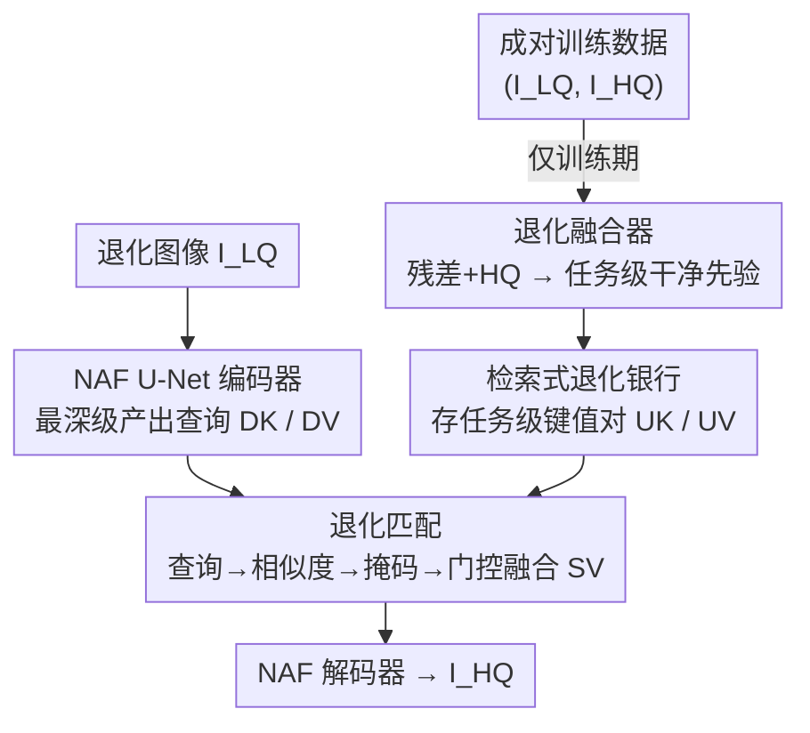

# Retrieve-to-Restore: Efficient All-in-One Image Restoration with a Retrieval-Based Degradation Bank

**会议**: CVPR 2026  
**论文**: [CVF Open Access](https://openaccess.thecvf.com/content/CVPR2026/html/Wang_Retrieve-to-Restore_Efficient_All-in-One_Image_Restoration_with_a_Retrieval-Based_Degradation_Bank_CVPR_2026_paper.html)  
**代码**: [https://github.com/cscxwang/R2R](https://github.com/cscxwang/R2R)  
**领域**: 图像修复  
**关键词**: 全能图像修复, 退化解耦, 检索式先验, 退化银行, 轻量化

## 一句话总结
R2R 把"退化适配"从骨干网络里抽出来，外置成一个可检索的"退化银行"——训练期用退化融合器把各类退化的干净先验蒸馏进银行，推理期用退化匹配检索最相关的先验来调制特征，从而在单一轻量骨干上稳定处理多种退化，PSNR 与 SOTA 持平却只用约 9% 的算力。

## 研究背景与动机

**领域现状**：全能图像修复（all-in-one restoration）想用一个模型处理噪声、雾、雨、模糊、低光等多种退化，免去为每种退化单独训练、单独部署的麻烦。主流做法是在共享骨干里"内部调制"：要么注入视觉/文本提示（PromptIR、InstructIR、DA-CLIP），要么用 MoE 路由把输入分派给退化专属专家（MoCE-IR）。

**现有痛点**：这些内部调制策略都在变相膨胀参数空间——提示栈越堆越大、专家越加越多、还引入额外的超参与路由动态。更要命的是，为某种退化优化的参数会和另一种退化所需的参数冲突，多退化联合训练时产生**跨任务干扰（cross-task interference）**，导致参数更新不一致、训练不稳，很难在所有任务上都保持强性能。

**核心矛盾**：退化适配（要因退化而异）和骨干计算（要跨退化共享）被硬塞进同一套参数里相互掣肘——想要适配灵活就得让参数随退化变，想要训练稳定又得让参数跨任务一致，二者在共享骨干内不可兼得。

**本文目标**：在单一模型里同时做到三点——(1) 把退化信息从共享重建能力里**显式分离**以抑制干扰；(2) 统一参数、保持优化稳定，不随退化种类数 $|T|$ 增长而恶化；(3) 保持算力高效且易扩展到新退化。

**切入角度**：作者观察到退化具有很强的**类内相似、类间可分**结构——雨是条纹状、雾是全局低对比与遮蔽、噪声是高频抖动。既然每类退化都能用一个紧凑的、任务级的描述子来概括，那就没必要在骨干里做重度内部调制，而应改用"外部先验"视角：把每类退化压缩成一个先验，需要时检索出来用。

**核心 idea**：把退化知识"外置"成一个紧凑的退化银行，遵循 **Encode-Retrieve-Decode（编码-检索-解码）** 范式——共享骨干只管重建，退化适配交给可检索的外部先验，从而把"适配"与"计算"解耦。

## 方法详解

### 整体框架
R2R 用一个 NAF 风格的对称 U 形编码器-解码器作为**任务无关骨干**，只在编码器最末一级下采样处插入两个轻量模块：退化融合器（仅训练期用）和退化匹配（推理期用）。退化图像先经 $3\times3$ 卷积映射成浅层特征，再过四级 NAFBlock 编码；在最深一级，额外两个 $3\times3$ 卷积产出查询特征 $D_K$ 和 $D_V$。训练时，退化融合器把成对数据蒸馏成任务级先验存入退化银行；推理时，退化匹配拿 $D_K$ 去银行里检索最相关的先验，融合进 $D_V$ 后送入解码器重建。整条管线端到端可训，无需多阶段优化；推理时融合器被移除，零额外开销。

### 关键设计

**1. 检索式退化银行：把退化知识外置成可检索的外部先验**

针对"退化适配与骨干计算在共享参数里相互掣肘"这个核心矛盾，R2R 不在骨干内部做调制，而是把每类退化概括成一个紧凑的任务级描述子，存进一个外部的退化银行。银行里每个任务对应一组键值对 $(U_K, U_V)$，$U_K\in\mathbb{R}^{M\times H\times W\times C_k}$ 当索引、$U_V\in\mathbb{R}^{M\times H\times W\times C_v}$ 携带干净先验，$M$ 是每类退化存储的先验条数（容量超参）。这样一来，共享骨干只负责通用重建、参数跨任务一致；"该用哪种退化的知识"交给一次检索来决定。和提示栈、MoE 路由相比，这个外置设计不膨胀骨干、不加路由动态，从根上把跨任务干扰隔离开，且新增退化时只要往银行里再加一组键值对即可，天然可扩展。

**2. 退化融合器：训练期把成对数据蒸馏成任务级干净先验**

银行里的先验从哪来？退化融合器（degradation amalgamator）在训练期用成对数据构建它。它先把退化图 $I_{LQ}$ 与其真值 $I_{HQ}$ 的残差 $I_{LQ}-I_{HQ}$ 再拼上 $I_{HQ}$ 沿通道维拼接（既给退化线索、又给干净参照），过一串带渐进下采样的 NAFBlock 抽取退化感知特征，末端两个 $3\times3$ 卷积产出 $G_K$、$G_V$。此时一个 batch 里混着不同退化的样本，于是**按退化标签把同类样本沿 batch 维聚到一起**，并复制补齐到统一长度 $M$（保证各任务张量同形），再用任务级 3D 操作（深度可分 + 逐点 3D 卷积、BatchNorm3D、ReLU）沿 batch 轴**类内聚合**，得到压缩的任务级嵌入 $U_K$、$U_V$ 存入银行。第三个 NAFBlock 后还挂了一个轻量退化分类头来增强特征可分性——这个头和整个融合器都**只在训练时存在，推理时移除**，所以银行是"训练蒸馏、推理只读"，不给推理增加任何成本。

**3. 退化匹配：推理期为每个输入检索最相关先验并门控融合**

推理时输入的退化未知，查询特征 $D_K$ 的 batch 维同样混着不同退化，无法预先指定查哪个任务。退化匹配（degradation matching）解决"查得准"：把银行所有任务的键沿任务维拼平成 $U_K\in\mathbb{R}^{[n\times M,\,H\times W\times C_k]}$，与查询做矩阵乘算出全局相似度 $S = D_K \times U_K^{\top}$，其中每段长度 $M$ 的连续窗口对应一个任务。为抑制任务间串扰，对 $S$ 的每一行按长度 $M$ 的窗口求**局部均值**，取均值最高的任务、把其余任务的相似度全掩成大负值：$S_{mask}=\mathrm{Mask}(\mathrm{Argmax}(\mathrm{Local\text{-}Mean}(S)))$。掩码后行 Softmax 只让候选任务的先验激活，用它加权银行的值 $U_V$ 得到检索先验，再与 $D_V$ 沿通道**交错拼接**、过一个分组数为 $C_v$ 的门控卷积（Gate-Conv）产出最终锐化先验 $S_V$；分组保证每个样本只与自己检索到的先验交互。局部均值得出的任务归属还会喂给一个辅助分类头，进一步正则化、强迫网络区分退化类型。

**4. 双域 + 分类联合损失：在空间和频率域同时保真，并监督正确检索**

为最大化方法潜力，损失由失真项和分类项组合而成。像素级 $L_{pixel}=\lVert x-\hat{x}\rVert_1$ 保证低失真；为兼顾频域保真，加上傅里叶域的 $L_{fft}=\frac{1}{P}\lVert\mathcal{F}(\hat{x})-\mathcal{F}(x)\rVert_1$（$P$ 为归一化元素数，$\mathcal{F}$ 为 FFT）。另有两个交叉熵分类损失：$L_{deg}$ 监督融合器骨干的退化识别、$L_{match}$ 监督匹配阶段检索到正确先验。总损失 $\mathcal{L}=L_{pixel}+\lambda_d L_{deg}+\lambda_m L_{match}+\lambda_f L_{fft}$，权重经验设为 $\lambda_d=0.1$、$\lambda_m=0.1$、$\lambda_f=0.125$。$L_{match}$ 让银行里 $U_K$、$U_V$ 的类内聚类更紧（t-SNE 可见），检索更判别。

## 实验关键数据

> 说明：**MACs**（multiply-accumulate operations，乘加运算数，按 $224\times224$ 输入统计）衡量算力开销，越低越省；**$M$** 是退化银行每类退化存储的先验条数（容量超参）。主对比指标为 PSNR(dB)↑ 与 SSIM↑。

### 主实验

三退化（去雾/去雨/去噪）与五退化（再加去模糊/低光）的平均结果，R2R 仅用 12G MACs 即取得最佳平均 PSNR：

| 设置 | 方法 | MACs | 平均 PSNR | 平均 SSIM |
|------|------|------|-----------|-----------|
| 三退化 | AirNet | 238G | 31.20 | .910 |
| 三退化 | PromptIR | 132G | 32.06 | .913 |
| 三退化 | Gridformer | 251G | 32.19 | .912 |
| 三退化 | **R2R (ours)** | **12G** | **32.53** | **.918** |
| 五退化 | PromptIR | 132G | 29.15 | .904 |
| 五退化 | Perceive-IR | — | 30.11 | .905 |
| 五退化 | **R2R (ours)** | **12G** | **30.48** | **.921** |

三退化下 R2R 比 PromptIR 高 0.47dB 且省 90.9% MACs、比 AirNet 高 1.33dB 且省 95% MACs；五退化下比 AirNet/IDR/Gridformer 分别高 4.99/2.14/1.15dB，在 GoPro 去模糊上比通用修复器 Restormer、MambaIR 高 3.71/2.32dB。

复杂度对比（三退化设置）凸显其"小内存、少参数、低算力"：

| 方法 | PSNR | 显存 | 参数量 | MACs |
|------|------|------|--------|------|
| AirNet | 31.20 | 4829M | 8.93M | 238G |
| PromptIR | 32.06 | 9830M | 35.59M | 132G |
| Gridformer | 32.19 | 28462M | 30.1M | 251G |
| **R2R (ours)** | **32.53** | **846M** | **19.7M** | **12G** |

相比 PromptIR，R2R 在 +0.47dB 的同时省了 91.4% 显存、44.6% 参数、90.9% 算力。

### 消融实验

| 配置 | 平均 PSNR | 说明 |
|------|-----------|------|
| $M=24$ | 32.30 | 银行容量过小 |
| $M=64$ | **32.53** | 最优容量 |
| $M=128$ | 32.34 | 过大引入冗余/过拟合 |
| 仅 $L_{pixel}$ | 31.88 | 基线 |
| $+L_{fft}$ | 32.23 | 频域保真，+0.35dB |
| $+L_{deg}$ | 32.29 | 加退化分类监督 |
| $+L_{match}$（完整）| **32.53** | 加检索监督，累计 +0.65dB |

### 关键发现
- **银行容量并非越大越好**：$M$ 从 24→64 涨点、64→128 反掉，因为融合器的复制补齐在银行过大时引入冗余、易过拟合，存在容量与质量的权衡。
- **检索监督贡献突出**：$L_{match}$ 单独再带来约 0.24dB 平均提升，并让 t-SNE 上各任务先验聚类更紧、检索更判别；$L_{deg}$ 在去雾（SOTS）上约 +0.40dB。
- **任务扩展鲁棒**：从单任务扩到三任务、再到五任务时，AirNet/PromptIR/Gridformer 等都明显掉点，R2R 因显式解耦退化、靠任务级先验抑制干扰，掉点最小。
- **银行可在无干净 HQ 时构建**：用加噪 $HQ^{*}$（$\sigma=15$）及其残差替代干净 HQ 仅掉 0.54dB，甚至直接从 LQ 构建也接近用 HQ 的效果，利于干净数据稀缺时的实际部署。

## 亮点与洞察
- **把"适配"和"计算"物理分离**是最巧的一招：退化知识被搬出骨干、存进可检索的外部银行，骨干参数跨任务一致，从根上绕开了 MoE/提示栈那种"参数互相打架"的跨任务干扰——这是它能用 1/10 算力打平 SOTA 的关键。
- **训练蒸馏、推理只读**的银行设计很实用：退化融合器和分类头只在训练存在，推理时整块移除，所以"外置先验"几乎零推理成本，不像提示/专家那样常驻膨胀。
- **局部均值掩码 + 分组门控**这套检索-融合机制可迁移：任何"输入类别未知、但类内可分"的条件化任务（如盲超分、盲压缩伪影去除、甚至音频降噪）都能借鉴"先检索任务级先验、再门控注入共享骨干"的范式。
- 银行可在缺干净 HQ 时用加噪图甚至 LQ 构建，给真实场景（拿不到成对干净数据）留了落地空间。

## 局限与展望
- 退化银行按**离散任务类别**组织（雨/雾/噪声…），对训练时未见过的**全新退化类型**或**复合/混合退化**，检索能否找到合适先验、局部均值的 Argmax 硬选单一任务是否会失效，论文未充分验证。⚠️ 复合退化场景下的表现以原文/补充材料为准。
- 检索是"硬选最高均值任务再掩码"，本质单任务归属；当一张图同时含多种退化时，这种 winner-take-all 可能不如软融合多个先验。
- 容量超参 $M$ 需要按任务数调（这里最优 $M=64$），任务规模变化时是否需要重调、银行随任务线性增长 $n\times M$ 的存储代价在超多任务下如何，值得进一步分析。
- 改进方向：把"硬检索单任务"放松成"软检索 top-k 先验加权融合"，或让银行支持连续退化嵌入而非离散类别，以覆盖复合与未知退化。

## 相关工作与启发
- **vs PromptIR / 提示类方法**：它们往共享骨干注入可学习视觉/文本提示来做退化感知调制，提示栈膨胀参数、且仍在骨干内部相互干扰；R2R 把退化知识完全外置成可检索先验，骨干保持单一轻量，参数省 44.6%、算力省 90.9%，且任务扩展更稳。
- **vs MoCE-IR 等 MoE 路由方法**：它们用门控把输入分派给退化专属专家，引入路由动态和大量专家参数；R2R 不分专家、只检索任务级先验注入同一骨干，更新一致性更好、扩展不靠堆专家。
- **vs AirNet / IDR（对比学习 / 两阶段解耦）**：AirNet 用对比目标学退化感知表示再注入骨干、IDR 两阶段元学习分解退化；R2R 用"成对数据蒸馏 + 推理检索"显式分离退化与重建，五退化下比二者分别高 4.99dB、2.14dB。
- **vs 扩散/指令类（DiffUIR、InstructIR）**：它们靠迭代采样或文本指令，延迟与算力高；R2R 单次前向、12G MACs，更适合资源受限部署。

## 评分
- 新颖性: ⭐⭐⭐⭐ "外置可检索退化银行 + Encode-Retrieve-Decode"的视角在全能修复里新颖，把适配与计算解耦的思路干净利落
- 实验充分度: ⭐⭐⭐⭐ 三/五退化、单退化、复杂度、任务扩展、损失与容量消融、无 HQ 构建都覆盖了，较系统
- 写作质量: ⭐⭐⭐⭐ 动机-观察-方法逻辑清晰，图 2 把三个模块讲明白；复合退化等边界讨论略少
- 价值: ⭐⭐⭐⭐ 用约 1/10 算力打平 SOTA、显存仅 846M，对实际部署很有吸引力，且代码开源

<!-- RELATED:START -->

## 相关论文

- [\[CVPR 2026\] Degradation-Consistent Test-Time Adaptation for All-in-One Image Restoration](degradation-consistent_test-time_adaptation_for_all-in-one_image_restoration.md)
- [\[CVPR 2026\] UniLDiff: Unlocking the Power of Diffusion Priors for All-in-One Image Restoration](unildiff_unlocking_the_power_of_diffusion_priors_for_all-in-one_image_restoratio.md)
- [\[CVPR 2026\] FAPE-IR: Frequency-Aware Planning and Execution Framework for All-in-One Image Restoration](fape-ir_frequency-aware_planning_and_execution_framework_for_all-in-one_image_re.md)
- [\[CVPR 2026\] Degradation-Robust Fusion: An Efficient Degradation-Aware Diffusion Framework for Multimodal Image Fusion in Arbitrary Degradation Scenarios](degradation-robust_fusion_an_efficient_degradation-aware_diffusion_framework_for.md)
- [\[CVPR 2025\] Degradation-Aware Feature Perturbation for All-in-One Image Restoration](../../CVPR2025/image_restoration/degradation-aware_feature_perturbation_for_all-in-one_image_restoration.md)

<!-- RELATED:END -->
