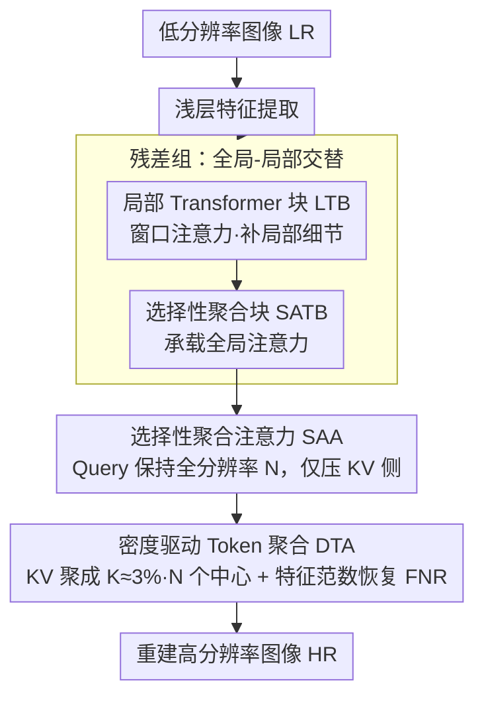

# SAT: Selective Aggregation Transformer for Image Super-Resolution

**会议**: CVPR 2026  
**arXiv**: [2604.07994](https://arxiv.org/abs/2604.07994)  
**代码**: [https://github.com/PhuTran1005/SAT](https://github.com/PhuTran1005/SAT)  
**领域**: 图像超分辨率  
**关键词**: super-resolution, transformer, token aggregation, efficient attention, global modeling

## 一句话总结

提出选择性聚合 Transformer (SAT)，通过密度驱动 token 聚合将 Key-Value 矩阵 token 数减少 97%、保持 Query 全分辨率，实现高效全局注意力建模，超越 SOTA PFT 达 0.22dB 且 FLOPs 降低 27%。

## 研究背景与动机

基于 Transformer 的超分方法能捕获长距离依赖但面临二次计算复杂度。窗口注意力方法限制感受野，而近期方法各有不足：IPG 的图操作对硬件不友好、ATD 的外部字典引入有限额外信息、PFT 的跨层注意力链接可能传播早期层错误。

核心观察：SR 中高频区域（边缘、纹理）需要更多计算，低频区域（平滑区域）可安全聚合。现有方法对全图均匀处理导致计算分配低效。

## 方法详解

### 整体框架

SAT 想解决的是 Transformer 超分里"全局注意力太贵、窗口注意力又看不远"的两难。它的骨架是残差组结构，组内交替堆叠两种块：局部 Transformer 块（LTB，做窗口注意力，管局部细节）和选择性聚合 Transformer 块（SATB，做全局注意力，管长距离依赖）。关键在于 SATB 里的全局注意力不再对全图均匀算，而是先把 Key-Value 大幅压缩、只保留 Query 的全分辨率，从而在近似全局建模的同时把计算量压下来。

### 关键设计

**1. 选择性聚合注意力（SAA）：Query 不动、只压 KV 的非对称注意力**

全局注意力的二次复杂度卡点在于 $N$ 个 token 两两相乘。但超分是逐像素重建任务，Query 那一侧不能丢分辨率，能动的只有 Key-Value。SAA 因此做非对称压缩：Query 保持全部 $N$ 个 token，Key-Value 则聚合成 $K$ 个代表性 token（$K \approx 3\% \times N$），注意力复杂度从 $O(N^2 d)$ 降到 $O(NKd)$。token 砍掉 97% 还能保持甚至提升重建质量，正是因为压缩只发生在信息冗余的 KV 侧，逐像素输出的精度没有被牺牲。

**2. 密度驱动 Token 聚合（DTA）：让高频区域多留 token、低频区域被合并**

KV 压缩的核心问题是"留哪些 token"。均匀聚合会把边缘纹理这种高频细节一并糊掉，所以 DTA 借密度峰值聚类的思路挑聚合中心：为每个 token 算它的局部密度（k-近邻余弦相似度）和到更高密度点的最小距离，两者乘积大的才当中心。这样平滑区域被合并、高频区域的细粒度 token 被自然保留。中心选好后做相似度加权聚合，再用特征范数恢复（FNR）把加权平均后塌缩的特征范数拉回原分布——消融显示去掉 FNR 训练就不稳。为避免选中心本身又退化成 $O(N^2)$，DTA 用分层子采样把这步降到 $O(K^2)$。

**3. 全局-局部交替结构：SATB 看远、LTB 看近**

单靠全局或单靠局部都不够：消融里只留局部注意力时性能明显下降。SAT 因此在残差组里把承载全局注意力的 SATB 和做窗口注意力（Rwin-SA）的 LTB 交替排列，让长距离依赖与局部细节两种感受野在深层特征里互补，这是经过消融验证的最优搭配。

### 损失函数 / 训练策略

用标准 L1 像素损失训练。论文还给了两条理论保证：定理 3.1 的复杂度界证明 SAA 确实把全局注意力降到线性级，定理 3.2 的近似界则说明在质量退化可控的前提下实现了大幅加速。

## 实验关键数据

### 主实验

| 数据集 | 指标 | SAT | PFT (之前SOTA) | 提升 |
|--------|------|-----|-------------|------|
| Urban100 ×4 | PSNR | +0.22dB | baseline | 显著 |
| 多数据集 | FLOPs | -27% | baseline | 效率大幅提升 |

### 消融实验

| 配置 | PSNR | 说明 |
|------|------|------|
| 无 FNR (特征范数恢复) | 下降 | FNR 对稳定训练至关重要 |
| 均匀聚合 vs 密度驱动 | 下降 | 密度感知选择中心更优 |
| 仅局部注意力 | 下降 | 全局建模不可或缺 |

### 关键发现

- Token 数量减少 97% 的情况下仍能保持甚至提升重建质量
- 密度驱动选择自然保留高频区域的细粒度 token 而合并低频区域
- FNR 对维持加权平均后的特征范数分布至关重要

## 亮点与洞察

- 非对称 Query-KV 压缩完美匹配 SR 任务需求（Query 保持逐像素，KV 可聚合）
- 密度驱动选择自适应于图像内容，高频保留、低频聚合
- 有完整的理论分析（复杂度界和近似界），增强了方法可信度
- 全局-局部交替是经过充分消融验证的最优选择

## 局限与展望

- 聚合比例（k=3%）和子采样因子 β 需要调优
- DTA 中的 k-近邻搜索仍有一定计算开销
- 对极度不规则纹理的处理效果有待验证

## 评分

- 新颖性：⭐⭐⭐⭐ — 非对称KV压缩+密度驱动聚合组合新颖
- 技术深度：⭐⭐⭐⭐⭐ — 理论分析严格
- 实验充分度：⭐⭐⭐⭐⭐ — 全面对比+充分消融
- 实用价值：⭐⭐⭐⭐ — 显著降低FLOPs同时提升性能

<!-- RELATED:START -->

## 相关论文

- [\[CVPR 2025\] Progressive Focused Transformer for Single Image Super-Resolution](../../CVPR2025/image_restoration/progressive_focused_transformer_for_single_image_super-resolution.md)
- [\[CVPR 2026\] Bridging the Perception Gap in Image Super-Resolution Evaluation](bridging_the_perception_gap_in_image_super-resolution_evaluation.md)
- [\[CVPR 2026\] Disentangled Textual Priors for Diffusion-based Image Super-Resolution](disentangled_textual_priors_for_diffusion-based_image_super-resolution.md)
- [\[CVPR 2026\] RAW-Domain Degradation Models for Realistic Smartphone Super-Resolution](rawdomain_degradation_models_smartphone_sr.md)
- [\[CVPR 2026\] Toward Real-world Infrared Image Super-Resolution: A Unified Autoregressive Framework and Benchmark Dataset](real_iisr_infrared_image_super_resolution_autoregressive.md)

<!-- RELATED:END -->
