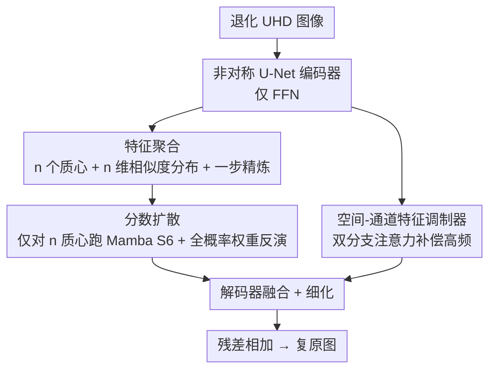

# Scan Clusters, Not Pixels: A Cluster-Centric Paradigm for Efficient Ultra-high-definition Image Restoration

**会议**: CVPR 2026  
**论文**: [CVF Open Access](https://openaccess.thecvf.com/content/CVPR2026/html/Wu_Scan_Clusters_Not_Pixels_A_Cluster-Centric_Paradigm_for_Efficient_Ultra-high-definition_CVPR_2026_paper.html)  
**代码**: https://github.com/5chen/C2SSM  
**领域**: 图像恢复 / 状态空间模型  
**关键词**: UHD 图像恢复, Mamba/SSM, 聚类中心扫描, 线性复杂度, 全分辨率推理

## 一句话总结
针对超高清（4K）图像恢复中 Mamba 仍要逐像素扫描、显存爆炸的瓶颈，C2SSM 把"逐像素扫描"改成"逐聚类中心扫描"——先用一个神经参数化的混合分布把上百万像素蒸馏成几个语义质心，只对质心跑 Mamba，再把全局上下文按相似度分布扩散回所有像素，从而在五项 UHD 恢复任务上同时拿下 SOTA 和最低 FLOPs（0.407G）。

## 研究背景与动机
**领域现状**：UHD（3840×2160）图像恢复要在上千万像素上建立全局感受野。Transformer 的自注意力是平方复杂度直接劝退；近年 Mamba 这类状态空间模型（SSM）凭线性复杂度成为主流替代，MambaIR、MambaIRv2、Wave-Mamba 等都把 SSM 引入恢复任务。

**现有痛点**：尽管 SSM 是线性复杂度，但它的基本操作单元仍是**单个像素**。一张 UHD 图有 800 万+ 像素，逐像素串行扫描（pixel-serial scanning）会带来无法承受的显存和算力开销，消费级 GPU 根本跑不动全分辨率。绕开瓶颈的两类做法各有硬伤：多尺度下采样（如 UHDformer 在高度下采样的低分辨率空间里建模）会丢掉全局上下文和高频细节；切 patch 分块恢复（如 LLFormer）会引入边界伪影。

**核心矛盾**：自然图像本身有**结构冗余**（相邻区域特征高度趋同、整体呈低秩结构），但现有方法用的却是**逐像素计算原语**，把像素当成彼此独立的个体，没有利用语义聚集性，于是付出了大量本不必要的算力。

**本文目标**：在不牺牲全分辨率与恢复质量的前提下，把全局建模的复杂度从 $O(C\cdot H^2W^2)$ 量级压下来，让 4K 图像能在消费级硬件上做全分辨率恢复。

**切入角度**：作者反问"理解一张图，真的需要处理每一个像素吗？"。既然图像特征会收敛到一小簇语义连贯的区域，那就不该以像素为中心，而应以**聚类为中心**来表示。

**核心 idea**：用"扫聚类中心，而不是扫像素"（scan clusters, not pixels）替代逐像素扫描——把图像建模成一个神经参数化的混合分布，只在稀疏质心上做全局推理，再把上下文概率性地扩散回每个像素。

## 方法详解

### 整体框架
C2SSM 采用**非对称 U-Net** 编码器-解码器结构，输入退化图、输出复原图（最终以残差形式加回输入）。编码器为了省算力**只用 FFN**；解码器借鉴 MetaFormer，在 FFN 之外集成两个核心模块——**CCSM（Cluster-Centric Scanning Module，聚类中心扫描模块）** 与 **SCFM（Spatial-Channel Feature Modulator，空间-通道特征调制器）**——两者并行协同，前者负责高效全局建模、后者负责补偿高频细节。

CCSM 内部是一条"**特征聚合（Feature Aggregating）→ 在质心上扫（Score Diffusing 的前半）→ 权重反演扩散回像素**"的双阶段流水线：先把所有像素聚成 $n$ 个语义质心，只对这 $n$ 个质心跑 Mamba 的选择性扫描（S6）得到全局权重，再依据像素与质心的相似度分布、用全概率公式把权重反演回每个像素。SCFM 则与权重反演阶段**并行**，用空间+通道双分支注意力把聚类时可能被抹平的高频信息找补回来。

### 关键设计

**1. 聚类中心扫描范式：把逐像素扫描换成逐质心扫描**

这是全文的总纲，直击"上千万像素逐个扫导致显存爆炸"的痛点。作者把全局建模重新表述为**神经参数化混合分布的建模与推理**：一张图的丰富特征分布可以被蒸馏成稀疏的一组语义质心，于是只需在质心上做扫描和推理，再把结果扩散回所有像素。对 $n$ 个质心跑 Mamba 的复杂度是 $O(C\cdot n^2)$，由于 $n\ll HW$，相比逐像素的 $O(C\cdot H^2W^2)$ 可忽略不计——这正是它能在消费级 GPU 上做全分辨率推理、且 FLOPs 远低于其他 Mamba 方法的根因。

**2. 特征聚合：用概率分布一步完成像素分配与质心精炼**

针对"如何高效地把像素聚成有代表性的质心、又不引入迭代聚类的开销"。给定层归一化特征 $F\in\mathbb{R}^{C\times H\times W}$，先用均匀采样 + k 近邻初始化 $n$ 个质心 $\{c_1,\dots,c_n\}$（让初始质心覆盖多样特征模式）。然后对每个质心 $c_k$，把它与每个像素特征 $f_p$ 的余弦相似度 $sim(f_p,c_k)$ 归一化成概率密度 $p_k(f_p)=\frac{sim(f_p,c_k)}{\sum_{p\in\Omega}sim(f_p,c_k)}$，$n$ 个质心合起来构成 $n$ 维相似度分布 $\mathcal{D}=\{D_1,\dots,D_n\}$，把"成对相似度"转成"概率性关联"。质心精炼则通过一个可学习门控一步完成：

$$\hat{c}_k=\frac{1}{N_k}\Big(v_k+\sum_{p\in\Omega}\delta(\alpha\cdot p_k(f_p)+\beta)\cdot\hat{f}_p\Big)$$

其中 $\delta(\cdot)$ 是平滑门控，软性地挑出与质心真正相关的像素；可学习的 $\alpha$ 调节相似度选择的锐度（边缘主导区收紧阈值、纹理丰富区放宽），$\beta$ 平移激活阈值；$N_k=1+\sum_p\delta(\cdot)$ 做归一化并保留初始质心贡献。关键在于**整个分配与精炼都是一步（one-step）算子、无任何迭代**，因此保住了计算效率。

**3. 分数扩散：只在质心上扫 Mamba，再用全概率公式把权重反演回像素**

针对"既要全局长程依赖、又不能逐像素两两计算"。它先把精炼后的 $n$ 个质心 $\hat{C}=[\hat{c}_1,\dots,\hat{c}_n]$ 喂进 Mamba 的 S6 选择性扫描，得到每个质心的全局上下文权重 $W=S6(\hat{C};\theta_{mamba})$。然后做**权重反演**：把像素 $p$ 属于簇 $k$ 的分配概率 $\alpha_{p,k}$ 直接由相似度分布 softmax 归一化得到（与第 4 式的 $p_k$ 一脉相承，形成闭合概率回路），再按全概率公式把质心权重期望回每个像素：

$$w_p=\mathbb{E}_{k\sim\mathcal{D}(p)}[w_k]=\sum_{k=1}^{n}\alpha_{p,k}\cdot w_k$$

这等价于模仿了 Transformer 注意力"每个位置聚合全局信息"的效果，却避免了全像素两两计算——稀疏质心当作一张统计上确定的图，全局推理在图上完成，结果再概率性地播撒回所有像素。

**4. 空间-通道特征调制器（SCFM）：补偿聚类带来的高频细节损失**

聚类天然会抹平细节，所以需要一个并行的"信息论补偿器"。SCFM 与权重反演阶段并行，用双分支注意力最大化输入输出特征间的互信息：空间分支 $W_s=\delta(\mathrm{Conv}([\mathrm{Max}(F_{in});\mathrm{Mean}(F_{in})]))$ 抓空间显著性，通道分支 $W_c=\delta(\mathrm{Max}(F_d)+\mathrm{Avg}(F_d))$ 抓通道重要性，最后 $F_{out}=\mathrm{Conv}(W_s\cdot F_{in})+\mathrm{Conv}(W_c\cdot F_{in})$。消融显示它是 CCSM 的辅助补偿模块——去掉它掉点有限，但与 CCSM 互补、共同保住高频保真。

### 损失函数 / 训练策略
基础重建损失用 RGB 空间的 **L1 损失 + FFT 损失**（频域约束高频）。优化器 AdamW，初始学习率 $5\times10^{-4}$，余弦退火；4 卡 A800，把 4K 图随机裁到 768×768 输入、batch 16、训练 150K 次迭代。网络 $N_1=3$ 级，编解码块结构 $N_2=[2,4,4]$，瓶颈与细化各 4 块，基础嵌入维度 32，质心数默认 $n=4$。

## 实验关键数据

### 主实验
在**五项 UHD 恢复任务**上（低光增强 / 去雨 / 去模糊 / 去雾 / 去雪）全面对比，C2SSM 仅 2.71M 参数即取得一致 SOTA：

| 任务 / 数据集 | 指标 | C2SSM | 之前最优 | 提升 |
|--------------|------|-------|----------|------|
| 低光 UHD-LOL4K | PSNR | 39.61 | MixNet 39.22 | +0.39 dB |
| 低光 UHD-LL | PSNR | 27.63 | MixNet 27.54 | +0.09 dB |
| 去雨 4K-Rain13k | PSNR | 35.13 | ERR 34.48 | +0.65 dB |
| 去模糊 UHD-Blur | PSNR | 31.53 | ERR 29.72 | +1.81 dB |
| 去雾 UHD-Haze | PSNR | 24.08 | UHD-processer 23.24 | +0.84 dB |
| 去雪 UHD-Snow | PSNR | 42.45 | UHDDIP 41.56 | +0.89 dB |

相对 Mamba 基线 Wave-Mamba，在低光任务上领先 2.18 dB；在 4K-RealRain（无参考）上 NIQE 8.198 / PIQE 54.90 也最优。

### 消融实验
UHD-LOL4K 上对两大模块做替换/移除（Tab. 8）：

| 配置 | PSNR | SSIM | Param | 说明 |
|------|------|------|-------|------|
| full model（ours） | 39.61 | 0.992 | 2.71M | 完整模型 |
| remove CCSM | 35.87 | 0.987 | 2.21M | 掉点最多（-3.74 dB），全局建模最关键 |
| replace CCSM→ResBlock | 37.32 | 0.989 | 2.38M | 失去全局推理 |
| replace CCSM→Vanilla Mamba | 37.43 | 0.990 | 3.11M | 逐像素扫，更慢且更差 |
| replace CCSM→ASSM | 38.71 | 0.991 | 2.96M | 仍不及质心扫描 |
| remove SCFM | 39.05 | 0.992 | 2.53M | 掉点较小（-0.56 dB），属补偿模块 |
| replace SCFM→ResBlock | 39.25 | 0.992 | 2.69M | — |

扫描策略复杂度对比（64×64 输入，Tab. 10）：C2SSM FLOPs 仅 **0.407G**，低于 MambaIR（4.774G）、Wave-Mamba（0.881G）、EVSSM（7.893G）、MambaIRv2（4.940G）。除 Wave-Mamba 外其余方法都无法对 UHD 做全分辨率推理。

### 关键发现
- **CCSM 是性能主力**：移除它掉 3.74 dB，远超移除 SCFM（0.56 dB），印证"长程全局建模对恢复任务至关重要"，SCFM 只是补偿性配角。
- **质心数 $n=4$ 多数据集最优**：质心过多会引入冗余簇反而略降；但 UHD-Blur（室内复杂场景、内容多样）在 $n=6$ 达峰，说明最优质心数与场景内容复杂度相关。
- **全分辨率可行性**：vanilla Mamba 与 ASSM 受限于显存必须 8× 下采样再上采样，引入额外信息损失；C2SSM 靠稀疏质心表示真正做到全分辨率处理，从根上解了显存瓶颈。

## 亮点与洞察
- **把"扫描单元"从像素抬到聚类中心**，是对 Mamba 视觉化的一次范式级重构：不是把扫描做得更快，而是把要扫的东西变少（$HW\to n$），这条思路对一切大规模视觉计算都可迁移。
- **概率闭环设计很巧**：相似度分布既用于质心精炼（前向聚合），又复用为权重反演的分配概率（反向扩散），用同一个 $\mathcal{D}$ 串起聚合与扩散，理论上形成全概率回路而非两套独立参数。
- **一步聚类**避开了 K-means 式迭代，把"可微聚类"压进单次前向，是它能在 UHD 上保持低开销的工程关键。
- 性能与效率同时占优（SOTA + 最低 FLOPs + 仅 2.71M 参数），说明语义冗余确实是 UHD 恢复里一块没被吃干净的红利。

## 局限与展望
- **质心数需按任务调**：$n$ 对不同场景敏感（室内复杂场景偏好更多质心），论文用固定 $n=4$，缺乏自适应质心数机制。⚠️ 表中部分 PDF 公式 OCR 后有断裂，门控/归一化系数等细节以原文为准。
- 初始质心用随机均匀采样 + kNN，初始化的随机性对结果稳定性的影响未充分讨论。
- 方法聚焦 UHD 恢复，是否能直接迁移到 UHD 之外（如视频、检测）的大规模视觉任务，文中只给了方向性展望、未做验证。
- SCFM 作为细节补偿模块贡献有限，是否有更强的高频找补方式仍可探索。

## 相关工作与启发
- **vs Wave-Mamba**：同样用线性复杂度 Mamba，但 Wave-Mamba 靠小波变换只建模低频信号、且全程固定 48 通道，特征提取能力弱；C2SSM 直接在全分辨率上以质心扫描建模全局，质量与效率都更优（低光任务领先 2.18 dB）。
- **vs MambaIR / MambaIRv2**：它们仍是逐像素/逐 patch 扫描，UHD 下显存爆炸、无法全分辨率推理；C2SSM 把扫描对象换成稀疏质心，FLOPs 仅为其约 1/12。
- **vs UHDformer / 多尺度下采样**：后者在高度下采样空间建模、丢高频；C2SSM 用质心稀疏表示实现真·全分辨率处理，避免下采样信息损失。

## 评分
- 新颖性: ⭐⭐⭐⭐⭐ "扫聚类不扫像素"是范式级重构，把可微聚类与 Mamba 全局扫描优雅缝合
- 实验充分度: ⭐⭐⭐⭐⭐ 五项 UHD 任务 + 多组消融 + FLOPs 对比，证据链完整
- 写作质量: ⭐⭐⭐⭐ 框架清晰、概率闭环讲得透，但公式排版（OCR 前）部分符号略繁
- 价值: ⭐⭐⭐⭐⭐ 真正让 4K 全分辨率恢复跑上消费级 GPU，思路可外推到大规模视觉计算

<!-- RELATED:START -->

## 相关论文

- [\[CVPR 2026\] DreamSR: Towards Ultra-High-Resolution Image Super-Resolution via a Receptive-Field Enhanced Diffusion Transformer](dreamsr_towards_ultra-high-resolution_image_super-resolution_via_a_receptive-fie.md)
- [\[CVPR 2026\] InstantRetouch: Efficient and High-Fidelity Instruction-Guided Image Retouching with Bilateral Space](instantretouch_efficient_and_high-fidelity_instruction-guided_image_retouching_w.md)
- [\[CVPR 2026\] Efficient Real-Time Raw-to-Raw Denoising for Extreme Low-Light Ultra HD Video on Mobile Devices](efficient_real-time_raw-to-raw_denoising_for_extreme_low-light_ultra_hd_video_on.md)
- [\[CVPR 2026\] ShiftLUT: Spatial Shift Enhanced Look-Up Tables for Efficient Image Restoration](shiftlut_spatial_shift_enhanced_look-up_tables_for_efficient_image_restoration.md)
- [\[CVPR 2026\] Retrieve-to-Restore: Efficient All-in-One Image Restoration with a Retrieval-Based Degradation Bank](retrieve-to-restore_efficient_all-in-one_image_restoration_with_a_retrieval-base.md)

<!-- RELATED:END -->
