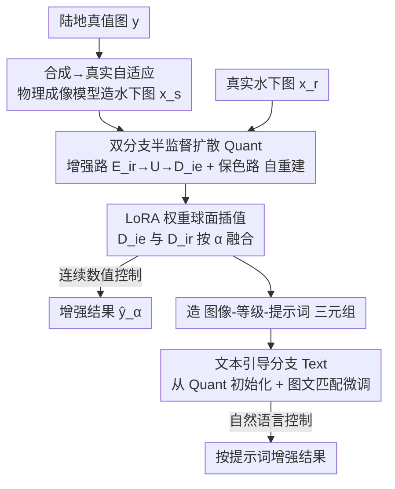

# SDUIE: Semi-Supervised Diffusion for Underwater Image Enhancement with Quant-Text Dual Control

**会议**: CVPR 2026  
**论文**: [CVF Open Access](https://openaccess.thecvf.com/content/CVPR2026/html/Cong_SDUIE_Semi-Supervised_Diffusion_for_Underwater_Image_Enhancement_with_Quant-Text_Dual_CVPR_2026_paper.html)  
**代码**: https://github.com/Xiaofeng-life/SDUIE  
**领域**: 图像恢复 / 水下图像增强 / 扩散模型  
**关键词**: 水下图像增强, 半监督扩散, LoRA 权重融合, 可控增强等级, 文本引导

## 一句话总结
针对水下图像增强里"每个人对增强程度偏好不同、但现有方法只能输出固定结果"的痛点，SDUIE 用一个半监督双分支扩散框架，既能通过融合因子 $\alpha$ 做**连续数值调级**（SDUIE-Quant），又能通过自然语言提示做**语义调级**（SDUIE-Text），在保住水下蓝绿色调美学的同时取得 SOTA。

## 研究背景与动机
**领域现状**：水下成像因水分子和悬浮颗粒造成的波长依赖衰减（红黄光快速衰减、蓝绿光相对稳定），普遍呈现蓝绿色偏。增强方法分两类：非深度学习的先验/物理模型方法（如 ULAP、HLRP），以及数据驱动的 CNN / Transformer / GAN / Flow / Diffusion 方法（如 Semi-UIR、UIE-DM、WF-Diff）。

**现有痛点**：绝大多数方法只输出**一个固定的增强结果**。但水下增强本质是个**病态问题**——"完美的增强"并不唯一存在，不同用户对"增强多少"有显著不同的主观偏好；固定输出要么欠增强、要么过增强。少数能给多样输出的工作（CECF、PWAE）靠风格引导图来控制，**缺乏对"增强程度"的显式控制**；UIESS 用风格隐空间调级，但其隐空间混入了过宽的风格信息、且无法接受文本指令。

**核心矛盾**：增强的"客观保真"与"主观偏好"之间存在张力——保留适度蓝绿色调对维持水下图像特征很关键，但每个人的偏好点不同，单一固定输出无法同时满足。需要一个**能按人的感知需求自适应调节增强等级**的机制，且最好同时支持精确的数值控制与直观的语义控制。

**本文目标**：构建一个既能精确数值调级（给个 $\alpha$ 就连续变）、又能用大白话指令调级（"把这张图增强到 ___ 级"）的水下增强框架，并解决合成数据训练 → 真实水下泛化的域差问题。

**切入角度**：复用预训练扩散模型的先验，用 LoRA 微调；把"增强等级"建模成两个解码器（增强 vs 保色）之间的**权重融合比例**，从而把连续调级变成一次可插值的权重合并。

**核心 idea**：双分支半监督扩散 + LoRA 权重球面插值 = 连续可控的增强等级（Quant）；再用 Quant 自动造出"图像-等级-提示词"三元组去训练文本控制分支（Text）。

## 方法详解

### 整体框架
SDUIE 以预训练**潜空间扩散模型**为骨干、用 **LoRA** 微调，由两部分组成：**SDUIE-Quant**（数值精确控制）与 **SDUIE-Text**（语言语义控制），二者共享同一套潜空间与"合成→真实"自适应策略。

SDUIE-Quant 是一个**双分支**结构：编码器 $E_{ie}$（编码陆地真值图 $y$）、$E_{ir}$（编码合成/真实水下图 $x_s,x_r$）共享同一个 UNet $U$；解码器 $D_{ie}$ 负责**图像增强**、$D_{ir}$ 负责**色调保持**。训练走两条路——**图像增强路**（合成水下图 → 陆地真值，监督学习）和**色调保持路**（自重建，自监督地学真实水下的自然色调），这正是"半监督"的来源。推理时通过在 $D_{ie}$ 与 $D_{ir}$ 之间做 LoRA 权重融合（融合因子 $\alpha\in[0,1]$）实现连续调级。

SDUIE-Text 的编码器 $E'_{ir}$、扩散模型 $U'$、解码器 $D'_{ie}$ 都从训练好的 Quant 初始化；它用 Quant 在不同 $\alpha$ 下生成的"图像-等级"对配上提示词模板，学"文本语义 → 增强等级"的映射。

### 关键设计

**1. 双分支半监督扩散（SDUIE-Quant）：增强分支与保色分支共享潜空间**

针对"只有合成监督会损伤真实水下泛化、纯自监督又学不会增强"的两难。框架把任务拆成两条共享 UNet $U$ 的路径：**图像增强路** $E_{ir}\to U\to D_{ie}$，用合成水下图 $x_s$ 学到陆地真值 $y$ 的映射，损失为像素级 $L^{ie}_{p,x_s}=\|D_{ie}(U(\tau_\theta(p),E_{ir}(x_s)))-y\|_1$ 加对抗损失 $L^{ie}_{a,x_s}$；**色调保持路**则对 $x_s,x_r,y$ 做自重建（如 $L^{ir}_{p,x_r}=\|D_{ir}(U(\tau_\theta(p),E_{ir}(x_r)))-x_r\|_1$），让模型在自监督下学到真实水下的自然色调模式。因为所有编解码对共享同一个 $U$，合成与真实表征在潜空间被对齐，缓解了域差。

**2. 合成→真实自适应：物理成像模型造监督对**

针对"真实水下图没有干净参考、无法直接监督"。作者用陆地室内图作真值标签，按色彩失真感知的水下成像模型反向合成对应水下图：

$$x_s(c)=\eta(c)\circ[y(c)\circ e^{-\beta d}+L(c)\circ(1-e^{-\beta d})]$$

其中 $c$ 是通道、$d$ 是深度图、$\beta$ 散射系数、$L$ 环境光、$\eta$ 色彩失真向量（取自人工选取的水下色块）。这样就凭空造出了"水下图 $x_s$ ↔ 干净真值 $y$"的监督对（共合成 1001 对），再配合在合成与真实数据上共享潜空间训练，把"合成域学到的增强能力"迁移到真实水下场景。

**3. LoRA 权重球面插值：用融合因子 $\alpha$ 做连续等级控制**

这是实现"连续可控增强等级"的核心机制，直击"现有方法只能固定输出"的痛点。推理时不重新训练，而是在增强解码器 $D_{ie}$ 与保色解码器 $D_{ir}$ 的 LoRA 权重之间做**球面线性插值（Slerp）**：

$$S(\omega_{ie},\omega_{ir};\alpha)=\omega_{ir}\frac{\sin((1-\alpha)\theta)}{\sin\theta}+\omega_{ie}\frac{\sin(\alpha\theta)}{\sin\theta},\quad\theta=\arccos(\omega_{ie}\cdot\omega_{ir})$$

融合因子 $\alpha\in[0,1]$ 控制两者比例：$\alpha=0$ 是纯色调保持（$D_{ir}$）、$\alpha=1$ 是完全增强（$D_{ie}$），中间值给出连续渐变的增强强度。实验证实 $\alpha$ 与客观分数（UIQM/URANKER）强正相关，等级真的可被"标定"。相比 UIESS 在风格隐空间里调（隐空间信息过宽、不纯），这里直接在两个语义明确的解码器权重间插值，控制更干净。

**4. SDUIE-Text：把数值等级翻译成自然语言指令**

针对"数值 $\alpha$ 对普通用户不直观"。SDUIE-Text 从 Quant 初始化，用 Quant 在不同 $\alpha$ 下生成的增强图 $\hat{y}_\alpha$ 配上提示词模板 "Enhance this image by ___ level."，构成图文对数据集 $S_{\hat{y}}=\{\hat{y}_\alpha,p_\alpha\}$ 做图文匹配微调，损失为像素级 $L^{ie'}_{p,\hat{y}}$ 加对抗 $L^{ie'}_{a,\hat{y}}$。训练后用户只要改提示词里的等级词（如 "ten"），就能用大白话控制增强程度，其余推理流程与 Quant 一致。这样把精确的数值控制无缝包装成了直观的语义控制。

### 损失函数 / 训练策略
总损失联合增强路与保色路：$L_{all}=L^{ie}_{p,x_s}+L^{ie}_{a,x_s}+\lambda_1(L^{ir}_{p,x_s}+L^{ir}_{p,y}+L^{ir}_{p,x_r})+\lambda_2(L^{ir}_{a,x_s}+L^{ir}_{a,y}+L^{ir}_{a,x_r})$，训练时交替更新各网络（详见原文 Algorithm 1）。$\lambda_1=\lambda_2=1$；Adam 优化器、学习率 0.0001、batch 1；UNet $U$ 与 VAE 的 LoRA 秩分别设 8 和 4；Quant / Text 总步数为 10000 / 5000。

## 实验关键数据

### 主实验
在 UCCS、EUVP、U45、Challenge-60 四个真实水下数据集上，用 **UIQM**（水下图像质量综合度量）、**UCIQE**（水下彩色图像质量评价）、**URANKER**（一个排序式质量分）三项指标评测（均越高越好）。SDUIE-Quant（等级设 1.0）与 SDUIE-Text（等级 "ten"）在 UIQM/URANKER 上大幅领先现有方法：

| 数据集 | 指标 | SDUIE-Quant | 之前较优 | 说明 |
|--------|------|-------------|----------|------|
| U45 | UIQM | 5.501 | HLRP 4.908 | 大幅领先 |
| U45 | URANKER | 2.478 | Semi-UIR 2.032 | +0.45 |
| UCCS | UIQM | 5.351 | HLRP 4.760 | 大幅领先 |
| UCCS | URANKER | 2.481 | CDF 1.549 | 显著提升 |
| Challenge-60 | UIQM | 5.010 | HLRP 4.392 | 最优 |
| EUVP | UIQM | 4.966 | HLRP 4.491 | 最优 |

UCIQE 上各法接近（如 SDUIE-Text 在 U45 达 0.620、Challenge-60 达 0.611，普遍最优或次优）。视觉上，MIP/IBLA/ULAP 处理不掉蓝色调，SMBL/HLRP/CECF 偏欠增强，UIE-DM/HCLRNet 在蓝色场景会压暗亮度，而 SDUIE 在色彩与细节上整体更好。

### 消融 / 等级可控性验证
SDUIE-Quant 在不同融合因子 $\alpha$ 下的客观分数（Tab. 2，UCCS）随 $\alpha$ 单调上升，验证等级可被连续标定：

| $\alpha$ | 0 | 0.2 | 0.4 | 0.6 | 0.8 | 1.0 |
|----------|------|------|------|------|------|------|
| UIQM ↑ | 1.501 | 1.905 | 2.740 | 4.073 | 4.996 | 5.351 |
| UCIQE ↑ | 0.488 | 0.490 | 0.506 | 0.529 | 0.550 | 0.563 |
| URANKER ↑ | -1.415 | -0.924 | 0.157 | 1.545 | 2.274 | 2.481 |

### 关键发现
- **等级与客观分强正相关**：无论是 Quant 的 $\alpha$ 还是 Text 的提示词等级，增强强度提高、三项指标随之单调上升，说明"可控增强"不是噱头而是可量化标定的。
- **Quant 与 Text 结果接近**：在公平设置（$\alpha=1.0$ vs "ten"）下两者性能相当，说明文本分支成功把数值控制翻译成了语义控制、几乎无损。
- **保色 vs 增强可连续权衡**：$\alpha=0$ 保留原始蓝绿色调、$\alpha=1$ 完全增强，中间值平滑过渡，正好对应"主观偏好多样"的需求。

## 亮点与洞察
- **把"增强等级"建模成两个解码器的权重插值**，是个很轻巧的可控生成思路：不需要为每个等级训一个模型，一次 Slerp 就给出连续谱，可迁移到其他"强度可调"的低层视觉任务（去雾/去雨的强弱）。
- **用 Quant 自造数据喂 Text**：先有精确数值控制，再用它批量生成"图-等级-词"三元组反哺语义控制，是一种自举式的"数值→语言"对齐范式。
- **物理成像模型造监督对**绕开了"真实水下无干净参考"的死结，半监督共享潜空间则把合成域能力迁到真实域。
- 抓住了水下增强"病态、偏好多样"的本质——不追求唯一最优解，而是把选择权（数值或语言）交还用户。

## 局限与展望
- **UCIQE 提升有限**：SDUIE 在 UIQM/URANKER 上大幅领先，但 UCIQE 与其他方法接近，说明在色彩均匀性等维度上优势不明显。⚠️ 三项指标都偏向"对比度/饱和度高"的图，可能与人主观一致性存疑，论文也承认评价存在主观分歧。
- 合成监督依赖物理成像模型的参数（$\beta,L,\eta$ 等人工选取），合成与真实的剩余域差对极端浑浊场景的影响未充分讨论；合成对仅 1001 对，规模偏小。
- SDUIE-Text 的等级词表（如 "ten"）粒度和语义覆盖范围有限，复杂语义指令（"只提亮不改色"）能否解析未验证。
- batch=1、Adam、固定 $\lambda_1=\lambda_2=1$ 等超参未做敏感性分析。

## 相关工作与启发
- **vs UIESS**：同样想控制增强程度，但 UIESS 在风格隐空间里调、隐空间信息过宽不纯、且不能接受文本；SDUIE 直接在增强/保色两个解码器权重间球面插值，控制更干净，还多了语言接口。
- **vs CECF / PWAE**：它们靠风格引导图给多样输出，但缺乏对"增强程度"的显式连续控制；SDUIE 用 $\alpha$ 给出连续可标定的等级谱。
- **vs Semi-UIR**：同为半监督，但 Semi-UIR 用师生策略更新非对称网络；SDUIE 用共享潜空间的双分支扩散 + 物理合成对来做"合成→真实"自适应，并额外提供可控等级。

## 评分
- 新颖性: ⭐⭐⭐⭐ 把可控增强等级建模成 LoRA 权重插值、并自举出语义控制分支，思路新颖
- 实验充分度: ⭐⭐⭐⭐ 四数据集 + 三指标 + $\alpha$ 扫描验证可控性，但缺超参敏感性与更大规模合成数据
- 写作质量: ⭐⭐⭐⭐ 框架与双控制讲得清楚，公式与算法表完整，个别记号偏密
- 价值: ⭐⭐⭐⭐ 直面水下增强"偏好多样"的真实需求，连续 + 语言双控制实用且可迁移

<!-- RELATED:START -->

## 相关论文

- [\[CVPR 2026\] Restore Text First, Enhance Image Later: Two-Stage Scene Text Image Super-Resolution with Glyph Structure Guidance](restore_text_first_enhance_image_later_two-stage_scene_text_image_super-resoluti.md)
- [\[ICML 2026\] Semi-Supervised Neural Super-Resolution for Mesh-Based Simulations](../../ICML2026/image_restoration/semi-supervised_neural_super-resolution_for_mesh-based_simulations.md)
- [\[CVPR 2026\] IFCSR: Inference-Free Fidelity-Realism Control for One-Step Diffusion-based Real-World Image Super-Resolution](ifcsr_inference-free_fidelity-realism_control_for_one-step_diffusion-based_real-.md)
- [\[CVPR 2026\] Bi-Bridge: Bidirectional Diffusion Bridges for Low-Light Image Enhancement](bi-bridge_bidirectional_diffusion_bridges_for_low-light_image_enhancement.md)
- [\[CVPR 2026\] MR. Illuminate: Zero-Shot Low-Light Image Enhancement with Diffusion Prior](mr_illuminate_zero-shot_low-light_image_enhancement_with_diffusion_prior.md)

<!-- RELATED:END -->
