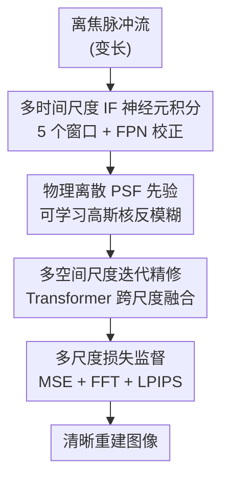

# DeSpike：脉冲相机的离焦去模糊与图像重建

**会议**: CVPR 2026  
**论文**: [CVF Open Access](https://openaccess.thecvf.com/content/CVPR2026/html/Ma_Seeing_Through_Blur_Tackling_Defocus_in_Spike-Based_Imaging_CVPR_2026_paper.html)  
**代码**: 无  
**领域**: 图像恢复 / 神经形态视觉  
**关键词**: 脉冲相机, 离焦去模糊, 积分发放神经元, PSF 先验, 图像重建

## 一句话总结
DeSpike 是首个针对脉冲相机（spike camera）离焦模糊的端到端去模糊与重建框架，先用薄透镜物理模型刻画离焦如何扭曲脉冲发放，再用多时间尺度 IF 神经元 + 可学习离散 PSF 先验 + 多空间尺度迭代精修把模糊脉冲流恢复成清晰图像，在合成与真实离焦脉冲数据上全面超越现有去模糊方法。

## 研究背景与动机
**领域现状**：脉冲相机是一类神经形态传感器，每个像素持续积分入射光强、超过阈值就发放一个脉冲（integrate-and-fire，IF），时间分辨率可达 40,000 Hz，天然抗运动模糊、能记录绝对光强细节，适合自动驾驶、高速机器人等场景。已有的脉冲重建工作（TFP/TFI、Spk2ImgNet、RSIR、WGSE 等）主要在解决**运动模糊**和**传感器噪声**。

**现有痛点**：现实中镜头浅景深或对焦延迟会带来**离焦模糊（defocus blur）**，这是脉冲重建里一个被严重忽视的退化。离焦和运动模糊本质不同——运动模糊是时间维失真，可被高采样率缓解；而离焦是**光学层面的空间弥散**，它在传感器端就改变了光子的空间分布，从而改变脉冲的发放行为，传统时域技术救不回来。

**核心矛盾**：离焦把一个场景点的光子从单像素弥散到一片邻域（形成弥散圆 CoC），导致单像素的光强累积变慢，脉冲被**延迟甚至漏发**；而且这种扰动是**空间非均匀、时间非单调**的——有的脉冲因本地衰减而延迟、有的因邻域能量流入而提前，破坏了脉冲管线默认的时序一致性。已有的脉冲自动对焦方法只能"预防性"地避免拍到离焦，无法**恢复已经离焦**的脉冲流。

**本文目标**：(1) 建立离焦如何影响脉冲发放的物理模型；(2) 从已离焦的脉冲流里直接重建清晰图像。

**切入角度**：既然离焦的根源是光学弥散（可由 PSF 描述），就把**物理离焦模型**显式嵌进网络——既用它指导神经元如何积分跨尺度脉冲，又把 PSF 当作可学习先验去做"反卷积"。

**核心 idea**：用"薄透镜 PSF 物理先验 + 多时间尺度 IF 积分 + 多空间尺度迭代精修"把离焦脉冲流端到端恢复成清晰图像。

## 方法详解

### 整体框架
DeSpike 的输入是一段变长的离焦脉冲流，输出是一张清晰的重建图像。整条管线分两阶段思路：先在**时间维**用一组 IF 神经元把不同积分窗口下的脉冲累积成特征（同时顺手补偿固定模式噪声 FPN），再在**空间维**用一组可学习的离散 PSF 核对这些特征做"反模糊"，并通过 Transformer 注意力在不同离焦程度间自适应加权，最后用多空间尺度迭代精修逐步还原细节，各层都施加多尺度损失监督。

物理建模是这一切的前提：根据薄透镜方程 $\frac{1}{f}=\frac{1}{u}+\frac{1}{v}$，离焦点在传感器上形成半径 $r=\frac{D}{2}\cdot\frac{\Delta v}{v}$ 的弥散圆，空间模糊用高斯 PSF $G(x,y;\sigma)=\frac{1}{2\pi\sigma^2}\exp(-\frac{x^2+y^2}{2\sigma^2})$ 近似。于是离焦脉冲的发放变为对**模糊后**光强的时间积分：

$$S(x,y,t)=\begin{cases}1,& \int_{t_n}^{t}\eta\cdot(I*G)(x,y,\tau)\,d\tau\ge\theta\\0,&\text{otherwise}\end{cases}$$

这条式子点明了离焦的危害：卷积降低了单像素的有效光强，拖慢积分、延迟（甚至抑制）脉冲——这正是后面所有模块要对抗的东西。

### 关键设计

**1. 多时间尺度 IF 神经元积分：用一组积分窗口同时抓住"早发"和"晚发"的脉冲**

离焦带来的时序扰动是非单调的——同一帧里有的脉冲提前、有的延迟，单一积分窗口必然丢信息。DeSpike 用一组**非脉冲（non-spiking）神经元**在多个离散时间窗 $\{T_1,\dots,T_n\}$（论文取 $n=5$，窗长 64/96/128/160/192）上做可微的膜积分，每个窗口得到一个特征 $F_i=\mathrm{SN}(S(T_i))$，从而在不同时间尺度上同时编码清晰与模糊结构，正好对应第 3 节分析的"局部积分失衡、非单调扰动、时序剪切"三种现象。更关键的是它把脉冲相机的硬件特性直接写进神经元：在膜电位更新里加入逐像素的 FPN 校正项

$$V(t)=V(t-1)+\gamma(x,y)\cdot S(t)$$

其中校正系数 $\gamma(x,y)=\frac{R(x_m,y_m)}{R(x,y)}$ 由均匀光场下各像素相对参考像素 $(x_m,y_m)$ 的响应偏差比估得。因为离焦去模糊对噪声极敏感，这一步在积分时就把固定模式噪声压掉，让后续反卷积不被噪声放大。

**2. 物理离散 PSF 先验：把"去模糊"做成可学习的反卷积核组**

既然离焦在物理上就是高斯 PSF 卷积，那去模糊最直接的先验就是它的逆过程。DeSpike 构造一组离散可学习卷积核 $\{k_1,\dots,k_m\}$，每个核对应一种弥散程度（按尺度 $\sigma_j$ 初始化成高斯），作用在每个时间特征上得到 $D_{i,j}=k_j*F_i$，相当于对不同模糊程度各做一次"空间反卷积"，产出一组去模糊候选。由于真实离焦在画面里空间非均匀，再用一个 Transformer 注意力按上下文相关性给不同核输出加权融合，让同一张图的不同区域选用合适强度的反卷积——这比单一固定核或纯黑盒卷积更可控、也更贴合物理。

**3. 多空间尺度迭代精修：由粗到细逐级补回残余模糊**

单次反卷积难以一次清掉严重离焦，于是把 PSF 去模糊结果送进一个迭代精修模块：把每个 $F_i$ 下采样到多个空间分辨率、各尺度上与离散核 $k_p$ 卷积，再通过 Transformer 把当前尺度结果与上一级重建融合：

$$\mathrm{Rec}_j=M\big(T(F),\ \mathrm{Rec}_{j-1}\!\uparrow\ \otimes\ \textstyle\bigcup_{p=1}^{s_G}k_p*F\big),\quad j=1,2,3$$

其中 $M$ 是逐元素融合、$T$ 是 Transformer 编码器、$\uparrow$ 为上采样、$\otimes$ 为融合算子。这种递归结构让模型在每一级同时利用**全局空间上下文**和**局部模糊先验**，逐步把严重离焦下的清晰结构还原出来。⚠️ 式中算子符号以原文为准。

**4. 多尺度分层损失：在时间×空间网格上逐级监督**

为了让时间和空间两个维度的中间输出都被约束，损失在 $N_t$ 个时间窗 × $N_s$ 个空间分辨率（论文取 $N_t=5,N_s=3$）构成的分层网格上施加：

$$L=\lambda_1\sum_{i=1}^{N_t}\sum_{s=1}^{N_s}\beta_{i,s}L_{i,s}^{\mathrm{MSE}}+\lambda_2 L_{\mathrm{FFT}}+\lambda_3 L_{\mathrm{LPIPS}}$$

逐路 MSE 保证各尺度像素级保真，频域 $L_{\mathrm{FFT}}$ 与感知 $L_{\mathrm{LPIPS}}$ 只加在最粗分辨率的最终输出上以兼顾纹理与感知质量。权重设置为 $\beta_{1..5}=0.1/0.3/0.5/0.7/1.0$（越大尺度权重越高），$\lambda_1,\lambda_2,\lambda_3=1/0.2/0.2$。

## 实验关键数据

### 主实验
数据集：用 DPDD 数据集合成离焦脉冲序列（350 对训练 / 32 对测试），并额外用脉冲相机采集 75 段真实离焦序列。训练 2000 epoch、batch=2，单张 RTX 4090。基线为"脉冲重建（TFP/TFI/RSIR/Spk2ImgNet）+ 帧域去模糊（GKMNet/NRKNet）"的级联管线，带 `*` 者为在本文合成集上重训版本。

| 数据 | 指标 | DeSpike | 最佳基线 | 说明 |
|------|------|---------|----------|------|
| 合成 | PSNR↑ | **18.94** | 17.77 (RSIR-NRKNet) | 显著领先 |
| 合成 | SSIM↑ | 0.57 | 0.58 (TFP-GKMNet) | 略低于个别基线 |
| 合成 | LPIPS↓ | **0.25** | 0.29 (TFP-GKMNet) | 感知质量最佳 |
| 真实 | RankIQA↓ | **4.74** | 4.82 (TFI-GKMNet) | 无参考质量最佳 |
| 真实 | Contrast↑ | **0.15** | 0.12 | 对比度最高 |

PSNR 与 LPIPS 全面领先；SSIM 仅略逊于 GKMNet 去模糊的 TFP 重建，整体优势仍明显。真实数据上各项指标均最优，在线网/通风格栅/窗框等场景能同时还原结构与底层纹理，而"先重建再去模糊"的级联管线会因信息丢失保不住细节。

### 消融实验
| 配置 | PSNR↑ | SSIM↑ | LPIPS↓ | 说明 |
|------|-------|-------|--------|------|
| All Modules | 18.94 | 0.57 | 0.25 | 完整模型 |
| w/o MTS | 18.28 | 0.53 | 0.30 | 去多时间尺度积分 |
| w/o MSS | 18.20 | 0.53 | 0.29 | 去多空间尺度迭代精修 |
| w/o NC | 17.36 | 0.50 | 0.33 | 去 FPN 补偿（神经元仅做积分） |
| w/o transformer | 17.02 | 0.46 | 0.38 | 注意力换成普通 QKV |
| w/o physical kernel | 18.48 | 0.54 | 0.29 | 物理核换成同维卷积层 |

### 关键发现
- **Transformer 注意力融合贡献最大**：去掉后 PSNR 从 18.94 掉到 17.02、LPIPS 升到 0.38，说明跨尺度自适应加权对处理空间非均匀离焦最关键。
- **FPN 补偿（NC）次之**：去掉后掉到 17.36，印证离焦去模糊对噪声高度敏感、在积分阶段就压噪很有必要。
- **物理 PSF 先验有效但更"温和"**：换成普通卷积只掉到 18.48，说明物理先验主要起稳定/正则作用而非主导贡献。
- **鲁棒性**：在焦平面前/上/后不同离焦距离、以及更短时间窗（64/32 步）下仍稳定去模糊，短窗虽有性能下降但仍优于对比方法。

## 亮点与洞察
- **把光学物理写进神经形态传感器模型**：从薄透镜 + 弥散圆推出"离焦改变脉冲发放"的 IF 方程，再据此设计模块，物理建模与网络结构一一对应，可解释性强。
- **首次处理脉冲相机的离焦问题**：之前脉冲重建只管运动模糊和噪声，本文补上了离焦这块空白，并指出离焦的时序扰动是非单调的——这点对设计时间维聚合很有启发。
- **"端到端"胜过"先重建再去模糊"**：级联管线在第一步重建时就丢了信息，去模糊救不回来；DeSpike 直接从脉冲流恢复，可迁移到其他"退化在传感器端发生"的重建任务。
- **可学习离散 PSF 核 + 注意力加权**：把经典去卷积的"核选择"问题变成可微的注意力融合，是处理空间非均匀模糊的通用思路。

## 局限与展望
- 训练用的离焦脉冲序列由 DPDD 帧数据**合成**，合成离焦与真实光学离焦可能存在 gap；真实数据仅 75 段、且无成对清晰 GT（只能用无参考指标评）。
- SSIM 略逊于个别基线，说明在结构相似度上仍有提升空间；离散 PSF 核数量 $m$、时间窗设置等超参对性能的影响未充分展开。
- FPN 校正系数 $\gamma$ 需借均匀光场离线标定，换相机/换工况需重标，限制即插即用。
- ⚠️ 论文未提供代码，部分模块（融合算子 $\otimes$、迭代精修式的精确实现）细节以原文为准。
- 改进思路：联合学习离焦+运动复合退化、用真实成对数据或自监督减少合成 gap、把 PSF 先验扩展为深度相关（按景深预测局部 $\sigma$）。

## 相关工作与启发
- **vs 帧域离焦去模糊（DPDNet / GKMNet / NRKNet）**：它们针对传统帧相机、且常需先估离焦图再恢复；本文直接在脉冲域端到端处理，并把 GKMNet 式"预定义高斯核 + 学习混合系数"的思路迁移成可学习离散 PSF 先验。
- **vs 脉冲重建（Spk2ImgNet / RSIR / WGSE / TFP-TFI）**：它们解决运动模糊与噪声，对离焦无能为力；DeSpike 是首个面向离焦的脉冲重建框架，且把 RSIR 的 FPN 噪声建模思路并入 IF 神经元积分。
- **vs 脉冲自动对焦**：自动对焦是"预防"离焦、无法恢复已离焦数据；本文是"事后修复"，二者互补。

## 评分
- 新颖性: ⭐⭐⭐⭐⭐ 首个脉冲相机离焦去模糊框架，物理建模与网络设计紧密耦合
- 实验充分度: ⭐⭐⭐⭐ 合成+真实双数据、多焦距/多窗长/六项消融，但真实数据规模偏小
- 写作质量: ⭐⭐⭐⭐ 物理动机讲得清晰，部分算子符号略含糊
- 价值: ⭐⭐⭐⭐ 补齐脉冲重建的离焦空白，对自动驾驶等高速场景有实用意义

<!-- RELATED:START -->

## 相关论文

- [\[CVPR 2026\] HFR and HDR Video from Multi-Attenuated Spikes Using a Rapidly Rotating SpokeND Filter](hfr_and_hdr_video_from_multi-attenuated_spikes_using_a_rapidly_rotating_spokend_.md)
- [\[CVPR 2026\] Hybrid Agents for Image Restoration](hybrid_agents_for_image_restoration.md)
- [\[CVPR 2026\] DRFusion: Degradation-Robust Fusion via Degradation-Aware Diffusion Framework](drfusion_degradation_robust_fusion_via_degradation_aware_diffusion_framework.md)
- [\[CVPR 2026\] Towards Universal Computational Aberration Correction in Photographic Cameras: A Comprehensive Benchmark Analysis](unicac_universal_computational_aberration_correction_benchmark.md)
- [\[CVPR 2026\] Bi-Bridge: Bidirectional Diffusion Bridges for Low-Light Image Enhancement](bi-bridge_bidirectional_diffusion_bridges_for_low-light_image_enhancement.md)

<!-- RELATED:END -->
