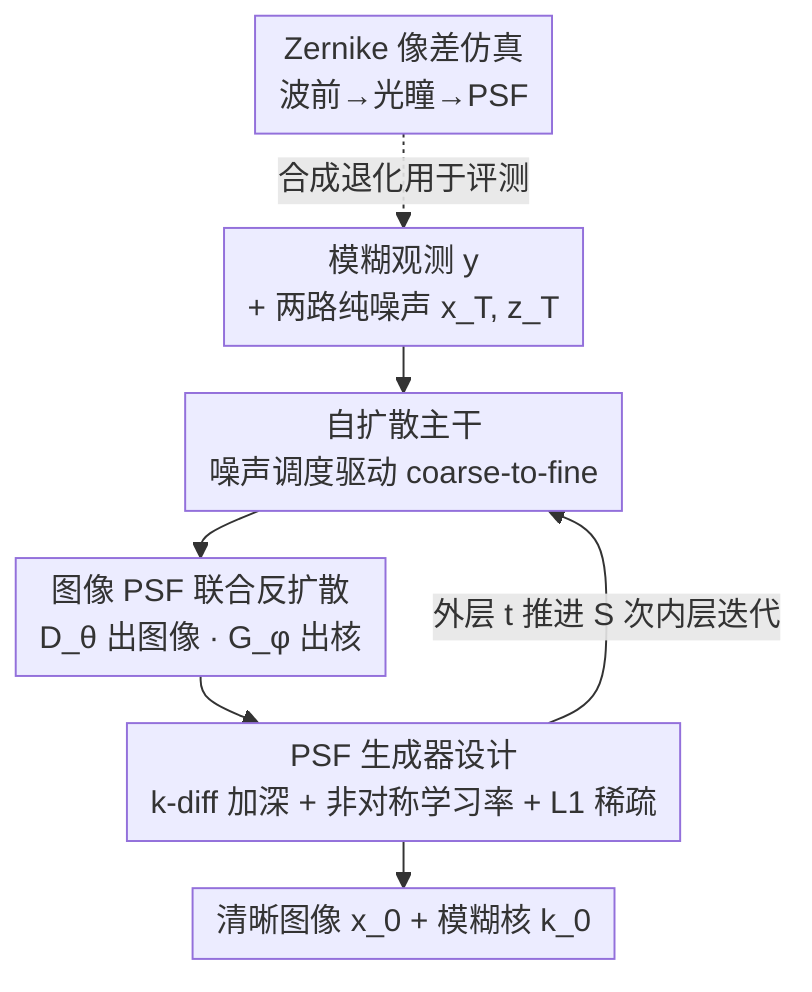

# Self-Diffusion Driven Blind Imaging

**会议**: CVPR 2026  
**论文**: [CVF Open Access](https://openaccess.thecvf.com/content/CVPR2026/html/Yang_Self-Diffusion_Driven_Blind_Imaging_CVPR_2026_paper.html)  
**代码**: 无  
**领域**: 图像恢复 / 盲去模糊  
**关键词**: 盲反卷积, 自扩散, PSF 估计, 零样本, 光学像差

## 一句话总结
DeblurSDI 把"自扩散"（self-diffusion，一种无需预训练的逆问题求解器）从已知退化算子的非盲场景拓展到盲场景，用两个随机初始化、互不预训练的网络在一段从纯噪声出发的反向扩散过程里**同时**重建清晰图像和模糊核（PSF），靠噪声调度天然稳住这个本来极易崩塌的联合优化，在光学像差和运动模糊上大幅超过现有盲去模糊方法。

## 研究背景与动机

**领域现状**：光学成像系统因衍射极限、镜头加工公差、装配误差，再叠加拍摄时的相机抖动和物体运动，采集到的图像总会被光学像差和运动模糊污染。要修复，要么显式标定每个镜头的点扩散函数（PSF，即成像系统的模糊核），要么走盲反卷积路线——只从一张退化图里同时估计清晰图像 $x$ 和未知核 $k$，满足前向模型 $y = x \circledast k + n$。

**现有痛点**：标定法精度高但要专用硬件、多次采集、专家知识，对手机这类消费级相机不现实。盲反卷积法则被联合优化的病态本质拖累：手工先验（稀疏、重尾梯度、TV）对初始化、核尺寸、超参极其敏感，容易核漂移、收敛崩塌；Deep Image Prior 这类隐式神经先验（如 SelfDeblur）灵活但联合优化依然极不稳定、易过拟合，尤其核大或空间结构复杂时；预训练扩散先验（DPS 等）在非盲场景很强，但依赖大规模预训练、有域偏移，而且**根本无法估计核**，没法直接用于全盲反卷积。

**核心矛盾**：盲反卷积最难的不是恢复图像，而是 PSF 估计——图像网络和核网络耦合在一起优化时，解空间巨大，极易塌缩到平凡解（Dirac 核、或者直接复制模糊图本身）。已有方法要么牺牲适应性（靠标定/预训练），要么牺牲稳定性（靠裸优化）。

**核心 idea**：作者注意到自扩散有个叫"噪声调控的频谱偏置"（noise-regulated spectral bias）的特性——按噪声调度逐级注入噪声，会逼着网络先学低频、再逐步细化高频，形成 coarse-to-fine 的隐式正则。把这套隐式正则**同时**施加到图像和 PSF 两条估计上，就能在不用任何外部先验或预训练的前提下，把联合优化从"易崩塌"变成"稳定可靠"。

## 方法详解

### 整体框架

DeblurSDI 是一个零样本、自监督、无需预训练的盲成像框架。它把盲图像恢复重写成一段**反向自扩散过程**：从两路纯高斯噪声出发（一路给图像估计 $x_T$，一路给 PSF 估计 $z_T$），沿 $T$ 个外层时间步逐步精炼，最终同时吐出清晰图像和模糊核。

整条流水线只有两个可学习部件，且都是**当场随机初始化、就这一张图现学现用**：图像去噪器 $D_\theta$（U-Net 结构，五级编解码 + skip + 深层 NonLocal 块）负责从含噪估计里恢复清晰图像；PSF 生成器 $G_\phi$（全连接网络，末层 softmax 保证核非负且归一化）负责生成模糊核。每个外层时间步 $t$ 内部跑 $S$ 次内层迭代，用同一个 Adam 把 $\theta, \phi$ 一起更新，去拟合"当前清晰图卷当前核 = 观测图"这个数据一致性约束；内层收敛后，把去噪结果作为下一时间步的图像/核估计带入，继续 coarse-to-fine。

为了能用合成的、物理真实的退化来公平评测，作者还配套搭了一个基于 Zernike 多项式的**光学像差仿真器**，从波前畸变合成一族真实 PSF（散焦、彗差、像散、球差等），再卷到清晰图上得到带像差的退化图。

### 关键设计

**1. 把自扩散的"噪声调控频谱偏置"当作隐式正则主干**

自扩散原本是为已知前向算子 $A$ 的线性逆问题 $Ax_\text{true}=y$ 设计的：从纯噪声出发，每步给当前估计加噪 $\hat{x}_t = x_t + \sigma_t \cdot \epsilon_t$，然后用一个随机初始化的自去噪器 $D_\theta$ 持续最小化数据保真损失 $L_t(\theta) = \lVert A D_{\theta,t}(\hat{x}_t) - y \rVert_2^2$。它有效的关键在于噪声调度 $\sigma_t$ 起到隐式正则的作用——大噪声阶段网络只能先抓住低频结构，随着 $\sigma_t$ 衰减才逐步刻画高频细节，天然形成多尺度、由粗到细的恢复。作者把这一特性视为"稳住病态优化"的杠杆：盲反卷积之所以爱崩，是因为搜索空间太大、太容易冲进平凡解；而往中间重建结果里反复注噪，等于不断**扩大逆解的搜索空间**、跳出局部塌缩，这也解释了为何重建曲线呈现非单调的"升-降-升"形态（而非传统优化的单调上升）。

**2. 双网络耦合的图像-PSF 联合反扩散**

这是把自扩散搬进盲场景的核心动作。盲设定下 $x_\text{true}$ 和核 $k$ 都未知，所以作者开两条独立的随机初始化网络：图像去噪器 $D_\theta$ 还原 $x_\text{true}$，PSF 生成器 $G_\phi$ 产生 $k$，各自带一路噪声调度。每步对两路估计分别扰动

$$\hat{x}_t = x_t + \sigma_t \cdot \epsilon_x, \qquad \hat{z}_t = z_t + \sigma'_t \cdot \epsilon_z,$$

其中图像噪声调度 $\sigma_t = \sqrt{1-\bar\alpha_t}$（$\bar\alpha_t$ 为 $1-\beta_i$ 的累乘、$\beta_t$ 线性插值），核噪声调度 $\sigma'_t = \mu \sigma_t$，$\mu$ 是可调系数。两网络在内层循环里被一个联合目标同时优化：

$$L_t(\theta,\phi) = \lVert (D_\theta(\hat{x}_t) \circledast G_\phi(\hat{z}_t)) - y \rVert_2^2 + \lambda_k R(G_\phi(\hat{z}_t)),$$

第一项是"图卷核应等于观测图"的数据保真，第二项 $R(\cdot)$ 取 PSF 的 L1 范数施加稀疏先验（真实运动核本就稀疏）。内层收敛后取 $x_{t-1}=D_\theta(\hat{x}_t)$、$z_{t-1}=G_\phi(\hat{z}_t)$ 进入下一步。和 SelfDeblur 那种纯耦合裸优化的区别在于：这里两条估计都被各自的噪声调度托着走 coarse-to-fine，PSF 不会一上来就冲进 Dirac/直线这种平凡核。

**3. PSF 生成器的可学退化设计：加深 + 非对称学习率 + 稀疏约束**

PSF 估计是盲成像里最脆的一环，作者专门给 $G_\phi$ 做了几处针对性设计。结构上用全连接网络（核维度低），末层 softmax 强制核非负且和为 1（物理可行的模糊核约束），再 reshape 成 2D 核；并刻意叠多层 ReLU 来鼓励稀疏。作者区分了两种模式做对照：**Standard** 模式下隐变量 $z$ 从正态分布采样后**固定不变**；**k-diff（diffusion）** 模式下 $z_t$ 随自扩散过程演化、且加深隐藏层。实验显示 k-diff 明显优于 Standard，而且隐藏层越深、核估计越准——说明把噪声调度也用到核生成器上、并给它足够的表达深度，是稳住 PSF 估计的关键。优化上用**非对称学习率**：图像去噪器初始 $1\times10^{-3}$，核生成器只用其 25%（$2.5\times10^{-4}$），因为核的微小变动会被卷积放大成图像上的大变化，慢一点才稳；核生成器还可选地在每个外层步末按 0.95 衰减（下限 $1\times10^{-5}$）。

**4. 基于 Zernike 多项式的光学像差仿真**

为了能在可控、物理真实的像差下系统评测盲成像，作者搭了配套退化仿真器。波前畸变写成 Zernike 多项式的加权和 $W(\rho,\theta) = \sum_{(n,m)\in\mathcal{A}} a_{n,m} Z_n^m(\rho,\theta)$（取到 $n=4$ 阶，涵盖散焦、像散、彗差、三叶差、球差、四叶差），系数 $a_{n,m}$ 控制各像差强度；由波前得到复光瞳函数 $P(\rho,\theta) = \mathbb{1}_{\rho\le 1}\exp(\tfrac{2\pi i}{\lambda}W)$，PSF 取光瞳傅里叶变换的归一化模平方 $h(x,y) = |\mathcal{F}\{P\}|^2 / \max|\mathcal{F}\{P\}|^2$。这套仿真在 $255\times255$ 网格上数值实现，生成单一/组合像差的 PSF 卷到清晰图上构造评测对，让"恢复光学像差"这件事第一次有了可量化的 benchmark。

### 一个例子：一张图的反扩散恢复
以 FFHQ 上一张人脸为例，过程从纯噪声起步：早期噪声步（$t$ 大）重建结果平滑、缺细节，核估计也只是个粗糙团块；随着 $\sigma_t$ 衰减，图像逐步找回锐利的五官、核逐渐收敛到真实运动轨迹。作者在噪声步 5/10/15/20/30 处可视化估计，PSNR 曲线呈"升-降-升"——中途注噪把已收敛的解再次推开、扩大搜索空间，避免卡在次优；外层 $T=30$、内层 $S=200$ 跑完，最终输出锐利图像 $x_0$ 与准确核 $k_0$。

### 损失函数 / 训练策略
核心目标即式 (12)：数据保真 $\lVert D_\theta(\hat{x}_t)\circledast G_\phi(\hat{z}_t)-y\rVert_2^2$ 加 L1 核稀疏正则，权重 $\lambda_k=2\times10^{-3}$。单个 Adam 联合更新 $\theta,\phi$；外层 $T=30$ 步、内层 $S=200$ 次；噪声方差线性调度，$\beta$ 从 $1\times10^{-4}$ 到 $2\times10^{-2}$。整个过程零预训练、单图自监督。

## 实验关键数据

### 主实验

光学像差校正（PSNR/SSIM，四数据集）：

| 数据集 | Phase-Only | FFT-ReLU | SelfDeblur | FastDiffusionEM | DeblurSDI |
|--------|-----------|----------|------------|-----------------|-----------|
| Levin | 15.52/0.372 | 19.57/0.566 | 18.13/0.471 | 18.68/0.509 | **28.36/0.860** |
| Cho | 22.04/0.827 | 23.07/0.857 | 20.69/0.779 | 15.66/0.477 | **25.60/0.923** |
| Kohler | 27.37/0.789 | 29.89/0.836 | 20.76/0.541 | 19.83/0.524 | **32.07/0.906** |
| FFHQ | 26.31/0.770 | 23.21/0.694 | 19.65/0.559 | 17.90/0.451 | **33.00/0.934** |

盲运动去模糊（PSNR/SSIM，四数据集）：

| 数据集 | Phase-Only | FFT-ReLU | SelfDeblur | FastDiffusionEM | DeblurSDI |
|--------|-----------|----------|------------|-----------------|-----------|
| Levin | 20.68/0.606 | 15.56/0.385 | 25.06/0.730 | 16.55/0.401 | **31.85/0.791** |
| Cho | 19.89/0.675 | 18.73/0.655 | 20.37/0.684 | 15.39/0.469 | **28.73/0.886** |
| Kohler | 28.23/0.809 | 25.33/0.714 | 21.97/0.600 | 18.85/0.481 | **29.17/0.765** |
| FFHQ | 25.80/0.790 | 21.71/0.658 | 19.82/0.556 | 15.59/0.359 | **33.90/0.906** |

DeblurSDI 在像差和运动两种退化、几乎所有数据集上都明显领先，尤其 Levin/FFHQ 上 PSNR 高出次优方法约 8–10 dB。值得注意的是预训练扩散方法 FastDiffusionEM 反而最差——即便在 FFHQ 上预训练过，核估计塌缩成点/线状平凡解，强图像先验也救不回来，反向印证了"准确估核才是关键"。

### 消融实验

| 配置 | 关键观察 | 说明 |
|------|---------|------|
| Standard 模式（核 $z$ 固定不演化） | PSNR/SSIM 较低 | 核生成器不走自扩散调度 |
| k-diff, $n=1$ | 优于 Standard | 加噪声调度即提升 |
| k-diff, $n=2,3,5$ | 随深度单调更优 | 加深隐藏层→核估计更准 |
| $T:10\to30$ | 增益最大 | 外层步从 10 提到 30 时收益最显著 |
| $T=40$ vs $T=30$ | 曲线几乎重合 | $T=30,S=400$ 后饱和 |

### 关键发现
- **核生成器的噪声调度 + 深度是稳 PSF 的核心**：k-diff 全面优于固定隐变量的 Standard 模式，且隐藏层越深核越准——把自扩散正则用到核这一路，是相对原始自扩散最关键的增量。
- **稳定性是最大卖点**：在核尺寸 15–33 的扫描中，DeblurSDI 的 SSIM/PSNR 几乎不随核尺寸波动，而其他方法剧烈震荡；SelfDeblur 甚至需要逐图精选核尺寸，DeblurSDI 不需要。
- **抗噪到 $\sigma=0.02$**：加性噪声 $\sigma\le0.02$ 时仍保持 PSNR>28、SSIM>0.73，PSF 在 $\sigma=0.03$ 前都视觉准确，$\sigma=0.05$ 才明显退化。
- 非单调"升-降-升"曲线是噪声调度扩大搜索空间的直接体现，与单调上升的传统优化形成对比。

## 亮点与洞察
- **把"频谱偏置"从非盲迁到盲场景**：核心洞察是自扩散的隐式正则不仅能稳图像，也能稳核估计——这一步迁移让盲反卷积从"裸优化易崩"变成"调度托底稳收敛"，思路可复用到其他联合估计型逆问题（盲超分、盲去噪）。
- **零预训练 + 单图自监督**：无需任何外部数据/标定硬件，对每张图现场训两个小网络，规避了预训练扩散先验的域偏移问题。
- **非对称学习率的小 trick 很实用**：核学习率压到图像的 25%，因为核的微扰会被卷积放大——这种"对敏感变量用更小步长"的思路在耦合优化里普适。
- **软约束保证核物理可行**：softmax 末层（非负+和为1）+ L1 稀疏，把"模糊核"的物理性质直接编码进网络结构，比事后投影更稳。

## 局限与展望
- **运行时间长**（作者承认）：同时用两个神经网络约束图像和核、再叠分层噪声调度，外层 30 步×内层 200 次的迭代使其比一次性优化方法慢得多。
- **评测以合成退化为主**：像差由 Zernike 仿真、运动核来自既有 benchmark 卷积合成，真实拍摄退化（空间变化 PSF、真实传感器噪声）下的表现未充分验证。⚠️ 论文未给真实采集图的定量结果。
- **抗噪上限有限**：$\sigma>0.03$ 后 PSF 与图像质量明显下滑，对强噪场景鲁棒性不足。
- **超参仍需设**：虽宣称对超参不敏感，但 $T,S,\mu,\lambda_k$、核噪声调度系数等仍需经验设定；自适应化、提速（如减少内层迭代或蒸馏）是自然的改进方向。

## 相关工作与启发
- **vs SelfDeblur（DIP 式耦合优化）**：两者都零预训练、联合估计图像与核，但 SelfDeblur 是裸耦合优化，对核尺寸/初始化极敏感、需逐图精选核尺寸；DeblurSDI 用自扩散噪声调度给两路估计都加 coarse-to-fine 隐式正则，跨核尺寸稳定、无需精选，定量上大幅领先。
- **vs FastDiffusionEM（预训练扩散先验）**：后者靠大规模预训练提供强图像先验但无法可靠估核，核易塌缩成平凡解、且有域偏移；DeblurSDI 现场自监督、把正则同样施加到核生成上，反而在其"主场" FFHQ 上反超约 18 dB。
- **vs 模型驱动的 PSF 标定（Zernike + Shack-Hartmann 等）**：标定法精度高但要专用硬件和多次采集；DeblurSDI 走免标定盲反卷积路线，把同一套 Zernike 物理模型只用来"造评测数据"而非"标定每个镜头"。

## 评分
- 新颖性: ⭐⭐⭐⭐ 把自扩散的频谱偏置首次系统迁到盲场景的核估计，切入点干净有洞察
- 实验充分度: ⭐⭐⭐⭐ 两种退化×四数据集 + 核尺寸/噪声/架构多维消融，但缺真实采集图验证
- 写作质量: ⭐⭐⭐⭐ 物理建模与方法推导清晰，公式完整；个别处有笔误
- 价值: ⭐⭐⭐⭐ 零预训练、免标定、稳定性强，对消费级成像修复有实用潜力，慢是主要短板

<!-- RELATED:START -->

## 相关论文

- [\[CVPR 2026\] LF-BVN: Blind-View Network for Self-Supervised Light Field Denoising](lf-bvn_blind-view_network_for_self-supervised_light_field_denoising.md)
- [\[CVPR 2026\] TM-BSN: Triangular-Masked Blind-Spot Network for Real-World Self-Supervised Image Denoising](tm-bsn_triangular-masked_blind-spot_network_for_real-world_self-supervised_image.md)
- [\[CVPR 2026\] PNG: Diffusion-Based sRGB Real Noise Generation via Prompt-Driven Noise Representation Learning](diffusion-based_srgb_real_noise_generation_via_prompt-driven_noise_representatio.md)
- [\[CVPR 2026\] MMDIR: Multimodal Instruction-Driven Framework for Mixed-Degradation Document Image Restoration](mmdir_multimodal_instruction-driven_framework_for_mixed-degradation_document_ima.md)
- [\[CVPR 2026\] DetectSCI: Toward Object-Guided ROI Reconstruction for High-Resolution Video Snapshot Compressive Imaging](detectsci_toward_object-guided_roi_reconstruction_for_high-resolution_video_snap.md)

<!-- RELATED:END -->
