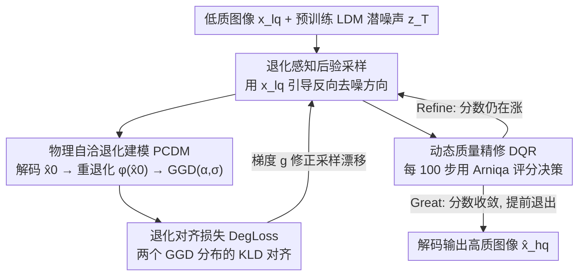

# Self-supervised Dynamic Heterogeneous Degradation Modeling for Unified Zero-Shot Image Restoration

**会议**: CVPR 2026  
**论文**: [CVF Open Access](https://openaccess.thecvf.com/content/CVPR2026/html/Hu_Self-supervised_Dynamic_Heterogeneous_Degradation_Modeling_for_Unified_Zero-Shot_Image_Restoration_CVPR_2026_paper.html)  
**代码**: https://github.com/yangjinglyy/UP-ZeroIR  
**领域**: 图像恢复 / 扩散模型  
**关键词**: 零样本图像恢复, 退化建模, 广义高斯分布, 后验采样, 潜空间扩散

## 一句话总结
UP-ZeroIR 发现噪声/雾霾/低光等异质退化在潜空间里都能被一个两参数的广义高斯分布（GGD）刻画，于是把退化建模重写成"分布对齐"问题，再配上一个自评估质量、动态调整采样轨迹的策略，让预训练扩散模型在不重训的零样本设定下同时刷新单退化与混合退化的恢复 SOTA。

## 研究背景与动机

**领域现状**：真实图像在采集和传输中会被噪声、模糊、雾霾、低光等多种退化污染。处理这些退化主要有三条路线：任务专用模型（每种退化单独建一套物理前向模型 + 配对监督）、all-in-one 模型（共享网络 + 学到的退化 embedding 统一处理多种退化）、以及零样本恢复（直接借用预训练扩散先验，推理时调整采样调度/引导信号，不做任务专属重训）。零样本路线最灵活，因为它不需要为每个新退化重新训练。

**现有痛点**：现有零样本方法把退化当成"黑盒扰动"，靠堆叠网络层或预训练特征去隐式捕捉退化特性。这带来三个具体问题：(1) **表征弱**——没有显式的物理提示，扩散过程只能在一步步的随机采样里去"猜"退化是什么，提示信号不足；(2) **训练/采样成本高**——隐式表征逼着模型用更深的网络、更多的采样步去补偿，退化种类一多成本就爆炸；(3) **轨迹固定易坍缩**——推理走的是一条事先定死的扩散轨迹，遇到复杂或混合退化时常常收敛到次优解。

**核心矛盾**：异质退化的物理机制天差地别（噪声是加性扰动、雾霾是透射衰减、低光是光照-反射分解），现有方法要么为每种退化单独建模（不通用），要么干脆放弃物理建模（不可控）。问题的根源是：**缺一个既统一又有物理依据的退化表示**，让所有退化能放进同一个可优化的框架里。

**切入角度**：作者做了一个关键的实证观察——虽然退化机制不同，但它们在像素分布上的表现是**系统性的分布平移**：噪声让像素分布**弥散**变宽，雾霾让分布整体**往高亮度偏移**，低光则**压缩动态范围**。这些类似的分布行为暗示存在一个统一的参数化表示。进一步地，把图像编码进 LDM 的潜空间后（潜空间抑制了像素级冗余、保留关键线索），这些退化分布会一致地呈现同构（homogeneous）的形态，可以用广义高斯分布的两个参数 $(\alpha, \sigma)$ 就充分概括。

**核心 idea**：把异质退化重参数化成潜空间里一组最小的、物理上自洽的参数（GGD 的尺度 $\sigma$ 与形状 $\alpha$），从而将"建模复杂退化"这个难题转化为"在潜空间做分布对齐"这个可直接优化的问题，再用一个质量驱动的动态策略修正采样轨迹，避免固定轨迹坍缩到次优。

## 方法详解

### 整体框架

UP-ZeroIR 接收一张低质图像 $x_{lq}$ 作为条件输入，借助预训练 LDM 在潜空间从高斯噪声 $z_T$ 逐步去噪，最终解码出高质恢复结果。整个系统围绕一个核心信念运转：**退化不该被当黑盒，而应被建成潜空间里一个可对齐、可优化的同构分布**。四个组件协同实现这一点——后验采样负责把低质观测的引导信号注入扩散反向过程；PCDM 负责把"当前估计的干净图"重新退化、并用 GGD 统一刻画退化分布；DegLoss 负责度量"重退化结果"与"真实低质输入"两个分布之间的差距并驱动对齐；DQR 则在采样途中用无参考质量评估动态决定继续精修还是提前退出。

### 关键设计

**1. 退化感知后验采样：把低质观测当成引导信号注入扩散反向过程**

标准 LDM 反向过程里，从 $z_t$ 估计干净潜表示 $\hat{z}_0 = (z_t - \sqrt{1-\bar\alpha_t}\,\epsilon_\theta(z_t,t))/\sqrt{\bar\alpha_t}$，唯一不确定量是预测噪声 $\epsilon_\theta$，整条轨迹与具体退化无关，所以面对不同退化只能"一视同仁"地猜。本设计把输入 $x_{lq}$ 引入采样，把后验改写为带修正项的形式：

$$q(z_{t-1}\mid z_t, x_{lq}) \propto \mathcal{N}\big(z_{t-1};\ \mu(z_t,\hat z_0) + \delta g,\ \delta\big)$$

其中修正项 $g = \nabla_{z_t}\log p(x_{lq}\mid z_t)$ 是一个梯度，把去噪漂移 $\mu$ 与观测 $x_{lq}$ 耦合起来，让每一步去噪方向都对准"当前这种退化"。这个似然进一步用干净估计近似为 $p(x_{lq}\mid\hat z_0) = \frac{1}{Z}\exp(-[\lambda_1 J(\phi(\hat z_0), x_{lq}) + \lambda_2 Q(\hat z_0)])$：$J$ 度量"把干净估计重退化后"与真实低质图的距离，$Q$ 评估图像质量。这样一来，采样方向不再是盲猜，而是由一个显式、可解释的退化似然梯度驱动——而这个似然的关键，就在于能否准确建模退化机制，从而自然引出下一个组件。

**2. 物理自洽退化建模 PCDM：用两参数 GGD 把异质退化压成同构分布**

痛点是异质退化没有统一表示，无法塞进一个可优化框架。作者先在实证上确立：退化图像的潜表示可以用广义高斯分布逼近

$$\mathrm{GGD}(x;\alpha,\sigma^2) = \frac{\alpha}{2\beta\Gamma(1/\alpha)}\exp\Big(-\big|\tfrac{x}{\beta}\big|^\alpha\Big),\quad \beta = \sigma\sqrt{\tfrac{\Gamma(1/\alpha)}{\Gamma(3/\alpha)}}$$

其中 $\sigma$ 控制尺度（弥散程度）、$\alpha$ 控制形状（尾部行为）。这两个参数就是退化的"低维充分统计量"——它们抓住了退化变化的主成分，从而把噪声/雾霾/低光等不同机制统一成一组物理可解释的参数。具体地，PCDM 在每个采样步把预测潜表示 $\hat z_0$ 解码成像素图 $\hat x_0 = D(\hat z_0)$，再把 GGD 参数 $(\alpha_0,\sigma_0)$ 经线性层 $l$ 嵌入，用一个轻量卷积模块重新生成"被退化"的观测：

$$\phi(\hat x_0) = f_3\big(f_2(f_1(\hat x_0)) + l(\alpha_0,\sigma_0)\cdot f_1(\hat x_0)\big)$$

并用 MSE + 感知 + 对抗损失约束 $\phi(\hat x_0)$ 既贴近干净图又贴近真实低质图。这一步的妙处在于：它把"建模退化"重写成了"学一个分布级的等价映射"——只要这个重退化网络能把干净估计变回和 $x_{lq}$ 同分布的样子，就证明它捕捉到了真实退化的物理本质。

**3. 退化对齐损失 DegLoss：用 GGD 之间的 KL 散度做分布级监督**

有了 PCDM 产出的重退化图 $\phi(\hat x_0)$ 和真实输入 $x_{lq}$，怎么衡量它们"退化得像不像"？逐像素 L1/L2 只能比表面差异，抓不住退化的分布特性。本设计把两者经 LDM 编码器映射到潜表示 $z_\phi, z_{lq}$，分别建成 $\mathrm{GGD}(z_\phi;\alpha_1,\sigma_1^2)$ 和 $\mathrm{GGD}(z_{lq};\alpha_2,\sigma_2^2)$，然后用两个 GGD 之间的 KL 散度 $J_{deg}$ 作为对齐目标（闭式解里含 $\alpha,\sigma,\Gamma$ 函数的组合项，⚠️ 具体表达式以原文 Eq. 13 为准）。这正好就是组件 1 里似然项 $J$ 的具体实现——它把"统一退化分布"变成了一个显式、可微、可优化的目标。最终损失再叠加 MSE/感知/对抗项 $J_{total} = \lambda_1 J_{deg} + \lambda_2 J_{mse} + \lambda_3 J_{pse} + \lambda_4 J_{adv}$ 保证重建保真度。此外还定义了一个图像质量项 $Q(\hat z_0)$，从亮度（各通道均值与自然曝光标准 $\tau$ 的偏差）和色度（色彩对差异）两方面约束，对应似然里的 $Q$ 项。

**4. 动态质量精修 DQR：用无参考质量评估自适应地决定何时停、何时再扰动**

固定步数的扩散推理在复杂退化下常坍缩到次优。本设计引入预训练的无参考质量评估模型 Arniqa（在真实世界多种退化上预训练），每隔 $\Delta t = 100$ 步给当前恢复图 $\hat x_0$ 打一个质量分 $s_j$，与上一次的 $s_{j-1}$ 比较，做自适应决策：

$$\text{Decision} = \begin{cases} \text{Great}, & s_j - s_{j-1} < \eta \\ \text{Refine}, & s_j - s_{j-1} \geq \eta \end{cases}$$

若分差小于阈值 $\eta$，说明质量已趋于饱和、提前终止并把 $\hat x_0$ 当作最优解输出（省采样开销）；若仍在明显上升则继续精修——当 $t>0$ 时按标准扩散继续，当 $t=0$（已到终点但质量还没收敛）时往潜表示注入噪声 $z_{t'} = z_t\sqrt{a_t} + \sqrt{1-a_t}\,z_\epsilon$ 重启一轮后验采样。这把原本一条死板的轨迹变成了一个"自评估—自调整"的可控搜索过程，是模型在混合退化下不坍缩的关键。

### 损失函数 / 训练策略
方法是零样本的，无需训练任务专属模型：用 Stable Diffusion（1000 步）作为预训练先验，仅在**测试时**用 Adam（学习率 $1\times10^{-5}$）在线优化 PCDM。缩放因子 $Z=4000$、DQR 阈值 $\eta=0.01$。各损失项权重按经验方案配置。全部实验在单张 NVIDIA L20 GPU 上跑。

## 实验关键数据

在低光增强、去雾、去噪三个代表性任务上评测，与零样本后验采样方法（GDP、TAO、LD-RPS）以及任务专用 / 监督 all-in-one 方法对比。B/U/Z 分别表示任务盲（task-blind）、无监督、零样本三种属性。

### 主实验

| 任务 / 数据集 | 指标 | 本文 UP-ZeroIR | 第二好 LD-RPS | 提升 |
|--------|------|------|----------|------|
| 低光 LOLv1 | PSNR↑ | 18.21 | 17.26 | +0.95 dB |
| 低光 LOLv2 | PSNR↑ | 19.20 | 18.22 | +0.98 dB |
| 去雾 HSTS | PSNR↑ | 21.51 | 20.48 | +1.03 dB |
| 去噪 Kodak24 | PSNR↑ | 28.51 | 27.66 | +0.85 dB |

本文在三个任务上对零样本后验采样基线全面领先，且部分结果可比肩有监督的 all-in-one 方法。在 SSIM 上同样多数最优（如 Kodak24 0.845 vs 0.830、LOLv1 0.823 vs 0.797）。值得注意的是 GDP 因缺乏退化先验、噪声建模不足，在去雾和去噪上大幅落后（HSTS 仅 12.57 dB）。

### 混合退化

| 配置 | PSNR↑ / SSIM↑ / LPIPS↓ | 说明 |
|------|---------|------|
| Low-light + Noise（本文） | 18.00 / 0.812 / 0.271 | 全面优于 TAO(17.38)/LD-RPS(16.87) |
| Low-light + Haze + Noise（本文） | 17.86 / 0.810 / 0.275 | 三重退化下仍领先，LD-RPS 跌到 16.77 |

随着噪声强度从 5 增到 20，本文性能下降明显比 LD-RPS 平缓，显示出对混合退化和噪声扰动的强鲁棒性——这正是统一物理退化分布建模带来的好处。

### 消融实验

三个核心组件逐一替换/移除（LOLv1 上的 PSNR）：

| 配置 | LOLv1 PSNR↑ | 相对完整模型 | 说明 |
|------|---------|------|------|
| Full Version | 18.21 | — | 完整模型 |
| w/o PCDM | 17.78 | −0.43 | 用参数量相当的 ResBlock 替换，掉点最多 |
| w/o DegLoss | 17.93 | −0.28 | 用逐像素 L1 替换分布对齐 |
| w/o DQR | 17.92 | −0.29 | 改用固定 1000 步调度 |

### 关键发现
- **PCDM 贡献最大**：用参数量相当的 ResBlock 替换它后 LOLv1 PSNR 从 18.21 掉到 17.78（最大降幅），证明"显式物理先验"本身比单纯堆参数更重要——这也直接印证了第 3 节的实证分析（异质退化能被两参数 GGD 统一刻画）。
- **DegLoss 的分布级对齐不可省**：换成逐像素 L1 后掉 0.28 dB，说明逐像素损失抓不住退化的分布特性，KL 散度的分布对齐才是"物理可解释引导"的来源。
- **DQR 解决固定轨迹坍缩**：固定 1000 步调度掉 0.29 dB，验证质量驱动的动态轨迹对全局最优收敛的价值。
- **三组件互补**：去掉任意一个都明显回退，且在三个任务上一致，说明"表征强度（PCDM）+ 有原则的引导（DegLoss）+ 收敛鲁棒性（DQR）"是三块互补拼图。
- **去噪过程可视化**：随扩散从 $t=1000$ 到 $t=0$，PSNR 从 9.46 dB 升到 30.32 dB，同时退化分布沿着一条稳定、物理自洽的轨迹收敛到干净分布，直观展示了"分布对齐"在推理途中真实发生。

## 亮点与洞察
- **"异质退化在潜空间是同构分布"这个实证观察很关键**：它把一个看似无法统一（噪声/雾霾/低光机制完全不同）的问题，归约成了一个两参数分布的对齐问题，是整篇方法成立的地基。这种"先在数据里找统一规律、再据此设计统一表示"的思路可迁移到其他多任务/多域问题。
- **把退化建模重写成"重退化—对齐"的自监督闭环**：PCDM 把干净估计重新退化、DegLoss 拉它去贴真实低质输入，整个过程不需要配对的干净-退化监督，天然适配零样本设定。
- **DQR 把死板的扩散轨迹变成"自评估的可控搜索"**：用无参考质量模型当"裁判"动态决定停/继续/重启，既省采样步又避免坍缩，这个"质量驱动早退 + 必要时注噪重启"的机制可复用到其他迭代式生成任务。
- **GGD 的两参数 $(\alpha,\sigma)$ 当退化的充分统计量**：用极低维的物理参数概括退化，比隐式深层特征更可控、更可解释，且省去了为新退化重训的开销。

## 局限与展望
- **依赖 GGD 假设的逼近精度**：方法的成立前提是退化潜分布能被广义高斯很好地逼近。对于强结构化退化（如运动模糊、JPEG 块效应、复杂雨雪）这类不一定满足 GGD 形态的退化，两参数表示是否仍充分，论文未充分验证（实验集中在噪声/雾霾/低光三类）。
- **测试时在线优化 PCDM 带来额外开销**：虽然零样本免去了任务专属训练，但每张图推理时都要在线优化 PCDM，加上 1000 步扩散，单图延迟可能不低，论文未给出明确的推理时间/采样步数对比。
- **DQR 依赖外部质量模型 Arniqa**：整套早退/精修决策建立在 Arniqa 打分上，质量评估模型的偏差会直接传导到恢复轨迹；阈值 $\eta$ 也是经验设定，对不同任务的敏感性未做系统分析。
- **改进思路**：可探索混合分布或自适应分布族替代固定 GGD 以覆盖更多退化类型；用更轻量的可微质量代理替代外部 NR-IQA 模型以减少依赖；给出推理成本-质量的帕累托曲线让落地更可控。

## 相关工作与启发
- **vs 任务专用恢复方法**：它们为每种退化建显式物理前向模型 + 配对监督，可解释但只能处理单一退化、跨任务迁移差、混合退化下脆弱。本文同样基于物理，但把物理建在"潜空间统一分布"层面而非"逐任务前向模型"，因而一套框架通吃多种退化。
- **vs all-in-one 方法（如 PromptIR 类）**：它们用共享网络 + 学到的退化 embedding 统一多任务，但退化是隐式建模、控制信号无物理依据，靠加深网络补偿、随任务增多成本上升。本文用两参数 GGD 显式、物理地表示退化，可控性和扩展性更好。
- **vs 零样本后验采样方法（GDP / TAO / LD-RPS）**：它们都借预训练扩散先验在推理时调整采样，但把退化当黑盒、靠隐式特征，采样步多、复杂退化下易收敛到次优。本文的差异在于：给后验采样注入了显式的物理退化似然（DegLoss）+ 动态轨迹调整（DQR），在四个数据集上均以约 0.85–1.03 dB 的 PSNR 领先 LD-RPS，且混合退化鲁棒性更强。
- **vs 物理退化建模方法**：传统物理建模（噪声统计、大气散射、Retinex 光照-反射分解）可解释但依赖任务专属前向模型和精确参数，对模型失配敏感、难泛化到混合退化。本文用统一的 GGD 参数化绕开了"每种退化一套前向模型"的瓶颈。

## 评分
- 新颖性: ⭐⭐⭐⭐⭐ "异质退化在潜空间是同构 GGD 分布"是新颖且有说服力的观察，并据此把退化建模重写成可优化的分布对齐，是首个显式分布级可控的物理可解释零样本恢复范式
- 实验充分度: ⭐⭐⭐⭐ 覆盖低光/去雾/去噪三任务 + 混合退化 + 噪声鲁棒 + 三组件消融 + 过程可视化，较扎实；但缺推理成本对比，退化类型偏窄（未含模糊/JPEG 等）
- 写作质量: ⭐⭐⭐⭐ 实证发现→统一表示→四组件的逻辑链清晰，公式与图示对应；KLD 闭式表达较密、部分细节（损失权重方案）放在补充材料
- 价值: ⭐⭐⭐⭐ 零样本免重训、统一处理多种及混合退化、物理可解释且可控，对真实世界部署很实用，思路（找统一分布规律→设计统一表示）有迁移价值

<!-- RELATED:START -->

## 相关论文

- [\[CVPR 2026\] ZeroIDIR: Zero-Reference Illumination Degradation Image Restoration with Perturbed Consistency Diffusion Models](zeroidir_zero-reference_illumination_degradation_image_restoration_with_perturbe.md)
- [\[CVPR 2026\] More Than Meets the Eye: A Unified Image Fusion Framework via Semantic-Pixel Entropy Trade-off for Zero-Shot Generalization](more_than_meets_the_eye_a_unified_image_fusion_framework_via_semantic-pixel_entr.md)
- [\[CVPR 2026\] Zero-Shot Image Denoising via Hybrid Prior-Guided Pseudo Sample Generation](zero-shot_image_denoising_via_hybrid_prior-guided_pseudo_sample_generation.md)
- [\[CVPR 2026\] MR. Illuminate: Zero-Shot Low-Light Image Enhancement with Diffusion Prior](mr_illuminate_zero-shot_low-light_image_enhancement_with_diffusion_prior.md)
- [\[CVPR 2026\] Dynamic Exposure Burst Image Restoration](dynamic_exposure_burst_image_restoration.md)

<!-- RELATED:END -->
