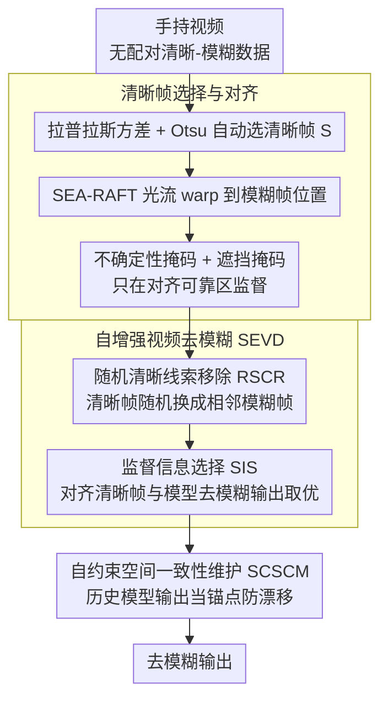

# SelfHVD: Self-Supervised Handheld Video Deblurring

**会议**: CVPR 2026  
**arXiv**: [2508.08605](https://arxiv.org/abs/2508.08605)  
**代码**: [https://cshonglei.github.io/SelfHVD](https://cshonglei.github.io/SelfHVD)  
**领域**: 图像恢复  
**关键词**: 视频去模糊, 自监督学习, 手持设备, 光学防抖, 自增强训练

## 一句话总结
SelfHVD 利用手持视频中自然存在的清晰帧作为监督信号，通过自增强视频去模糊（SEVD）构建高质量训练对和自约束空间一致性维护（SCSCM）防止位移偏移，实现了无需配对数据的手持视频去模糊。

## 研究背景与动机
1. **领域现状**：学习式视频去模糊方法在网络设计上取得了很大进展，但其预训练模型通常只对与训练样本类似的模糊数据有效。
2. **现有痛点**：手持视频的模糊不仅受相机抖动影响，还受OIS校正影响，其模糊分布与现有训练数据集（如GoPro、BSD）显著不同，导致现有模型表现不佳。
3. **核心矛盾**：采集配对手持视频去模糊数据集成本高昂且过程复杂，但直接使用合成模糊数据又存在域差距。
4. **本文目标**：利用手持视频中自然存在的清晰帧，以自监督方式学习去模糊模型，避免对配对数据的需求。
5. **切入角度**：当拍摄设备运动轨迹简单（如直线）且速度缓慢时，OIS可以正常工作，产生清晰帧。这些清晰帧可为相邻模糊帧提供去模糊线索和监督。
6. **核心idea**：清晰帧→对齐监督→SEVD自增强超越清晰帧上限→SCSCM防止空间漂移。

## 方法详解

### 整体框架
SelfHVD 要做的是：在没有任何配对清晰-模糊数据的前提下，只靠手持视频本身把模糊帧修清楚。它的依据是一个被忽视的事实——当相机运动轨迹简单且缓慢时 OIS 能正常工作，视频里会自然冒出一些清晰帧。整条流程因此分三步走：先把这些天然清晰帧挑出来、对齐到相邻模糊帧上当监督；再用模型自己的去模糊能力反过来造出比原清晰帧更好的训练对，让模型超越"只能复现清晰帧"的天花板；最后用历史模型约束输出，堵住对齐误差长期累积导致的空间漂移。

### 关键设计

**1. 清晰帧选择与对齐：把"天然监督"从手持视频里挖出来**

自监督的第一颗扣子是找到可信的清晰帧并精确对齐——选错或对歪，后面所有自训练都会被污染。SelfHVD 用图像拉普拉斯的方差 $v_l(\mathbf{I})$ 衡量清晰度（纹理越锐方差越大），再用 Otsu 自动定阈值省去人工调参；同时把视频按每段 20 帧切块，强制清晰帧在时间轴上均匀分布，避免某一段全靠插值。挑出清晰帧 $\mathbf{S}$ 后用 SEA-RAFT 光流把它 warp 到目标模糊帧 $\mathbf{B}_i$ 的位置得到 $\mathbf{S}_{j\to i}$，并配一对掩码——不确定性掩码 $\mathbf{M}_{uncer}$ 滤掉光流置信度低的像素、遮挡掩码 $\mathbf{M}_{occ}$ 滤掉前后景遮挡区，让监督只落在对齐可靠的地方。这套流程的选帧准确率在 GoProShake 上 96.77%、HVD 上 91.88%，说明"天然清晰帧"确实是廉价又可靠的监督来源。

**2. 自增强视频去模糊（SEVD）：突破"清晰帧即上限"的天花板**

直接拿清晰帧当监督有个硬伤——模型最好也就学成那帧的样子，而手持视频里的清晰帧本身往往也不够锐、还碰不到物体运动模糊。SEVD 让模型用自己的输出造更难的训练对来自我超越，分两步：随机清晰线索移除（RSCR）把输入里的清晰帧随机换成相邻模糊帧，得到线索更少的退化视频 $\tilde{\mathbf{B}}$，逼模型在信息更稀的条件下复原；监督信息选择（SIS）则在两路候选——对齐清晰帧 $\mathbf{S}_{j\to i}$ 与原始完整视频的去模糊输出 $\mathcal{D}(\mathbf{B})_k$——之间挑更优的当 $\tilde{\mathbf{B}}$ 的监督：当对齐清晰帧没被 warp 过度失真且确实更锐时用它，否则改用模型自己的去模糊结果（并 stop gradient 防止自我强化噪声）。因为监督上界不再是某一帧而是"模型当前能产出的最好结果"，模型得以越过输入中最清晰帧的质量，还能借跨帧线索处理单帧清晰帧覆盖不到的物体运动模糊。

**3. 自约束空间一致性维护（SCSCM）：堵住对齐误差累积成的空间漂移**

光流对齐不可能像素级完美，这些微小偏差会在长期自训练里一点点累积，让输出相对输入整体平移、内容"飘"掉。作者基于信息瓶颈理论观察到一个可利用的现象：训练早期模型还能很好保持输入输出的空间一致性，漂移是后期才显现的。SCSCM 据此把第 $e$ 次迭代的历史模型参数 $\Theta_{\mathcal{D}_e}$ 的输出冻结下来当辅助锚点，约束当前输出向它对齐：

$$\mathcal{L}_{scscm} = \|\tilde{\mathbf{R}}_i - sg(\mathbf{R}_k^e)\|_1$$

其中 $sg(\cdot)$ 表示 stop gradient。等于是拿"还没漂的早期自己"当正则项把"正在漂的现在"拉回来，既不需要额外标注，又精准针对漂移这个自训练特有的失效模式。

### 损失函数 / 训练策略
总损失由三项 L1 构成：掩码加权的重建损失 $\mathcal{L}_{rec}$（只在对齐可靠区监督清晰帧）、SEVD 的条件选择损失 $\mathcal{L}_{sevd}$（监督取 SIS 选出的更优一路）、以及历史模型约束的 $\mathcal{L}_{scscm}$（维持空间一致性）。三者共同把"挑清晰帧—自增强—防漂移"的闭环串成一个可端到端训练的目标。

## 实验关键数据

### 主实验

| 数据集 | 指标 | SelfHVD | Ren et al. | DaDeblur | 提升 |
|--------|------|---------|-----------|---------|------|
| GoProShake | PSNR | 最优 | 次优 | - | 显著提升 |
| HVD (真实) | 视觉质量 | 最优 | - | 次优 | 明显更清晰 |

### 消融实验

| 配置 | 关键指标 | 说明 |
|------|---------|------|
| Full SelfHVD | 最优 | 完整模型 |
| 仅清晰帧监督 | 基础水平 | 上限受限于清晰帧质量 |
| +SEVD | 显著提升 | 自增强突破上限 |
| +SCSCM | 进一步提升 | 防止空间漂移 |
| 不确定性+遮挡掩码 | 优于无掩码 | 排除错误对齐区域 |

### 关键发现
- SEVD能让模型超越输入视频中最清晰帧的质量，是最关键的贡献。
- SCSCM在训练后期尤为重要，没有它模型会逐渐出现空间漂移。
- 该方法对物体运动模糊也有一定的修复能力，因为SEVD利用了跨帧的清晰信息。

## 亮点与洞察
- **自监督的闭环设计**非常巧妙：清晰帧→模型→更好的监督→更好的模型。
- **信息瓶颈理论的实用化**：利用训练早期空间一致性好的观察设计SCSCM，理论指导实践。
- 方法对去模糊网络架构是通用的，可适配多种backbone。

## 局限与展望
- 依赖视频中存在足够的清晰帧，对全程严重模糊的视频不适用。
- 光流模型的准确性仍是瓶颈，复杂运动场景的对齐可能不准确。
- 未来可探索与基于扩散模型的去模糊方法结合。

## 相关工作与启发
- **vs Ren et al.**: 使用随机生成的模糊核来模糊清晰帧构建训练对，但合成模糊与真实模糊仍有差距。本文直接利用真实清晰帧+自增强策略更接近真实分布。
- **vs DaDeblur**: 使用扩散模型来模糊清晰图像，但生成的模糊仍非真实模糊。

## 评分
- 新颖性: ⭐⭐⭐⭐⭐ SEVD自增强训练和SCSCM空间一致性维护都是创新贡献
- 实验充分度: ⭐⭐⭐⭐ 合成+真实数据集验证，消融完整
- 写作质量: ⭐⭐⭐⭐ 方法动机清晰，逻辑链条完整
- 价值: ⭐⭐⭐⭐ 解决了手持视频去模糊的实际痛点

<!-- RELATED:START -->

## 相关论文

- [\[CVPR 2026\] Gyro-based Deep Video Deblurring](gyro-based_deep_video_deblurring.md)
- [\[CVPR 2026\] LF-BVN: Blind-View Network for Self-Supervised Light Field Denoising](lf-bvn_blind-view_network_for_self-supervised_light_field_denoising.md)
- [\[CVPR 2026\] Next-Scale Prediction: A Self-Supervised Approach for Real-World Image Denoising](next-scale_prediction_a_self-supervised_approach_for_real-world_image_denoising.md)
- [\[CVPR 2026\] Self-supervised Dynamic Heterogeneous Degradation Modeling for Unified Zero-Shot Image Restoration](self-supervised_dynamic_heterogeneous_degradation_modeling_for_unified_zero-shot.md)
- [\[CVPR 2026\] Convexity-Aware Noise Calibration: A Self-Supervised Framework for Noise-Level-Unknown Image Denoising](convexity-aware_noise_calibration_a_self-supervised_framework_for_noise-level-un.md)

<!-- RELATED:END -->
