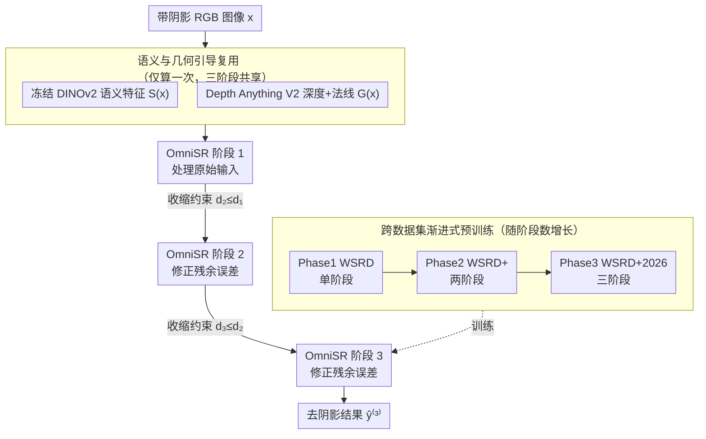

# Winner of CVPR2026 NTIRE Challenge on Image Shadow Removal: Semantic and Geometric Guidance for Shadow Removal via Cascaded Refinement

**会议**: CVPR 2026 Workshop (NTIRE)  
**arXiv**: [2604.16177](https://arxiv.org/abs/2604.16177)  
**代码**: 无  
**领域**: 图像修复  
**关键词**: 阴影去除, 级联精炼, 语义引导, 几何引导, 渐进式修复

## 一句话总结

基于 OmniSR 构建三级级联精炼 pipeline，结合冻结 DINOv2 语义特征与单目深度/法线几何引导，通过收缩约束损失稳定多阶段训练，在 NTIRE 2026 阴影去除挑战赛中获得第一名。

## 研究背景与动机

**领域现状**：图像阴影去除是底层视觉中的重要任务，近年来方法逐步从手工光照模型演进到基于 Transformer 的端到端修复系统，如 ShadowFormer、HomoFormer、OmniSR 等，其中 OmniSR 通过结合 RGB 外观与语义和几何辅助信息取得了良好效果。

**现有痛点**：即便是强力的单阶段系统如 OmniSR，在一次前向传播后仍会残留颜色偏移、光照偏差和边界伪影。单次推理无法完全消除复杂场景中的阴影效应，特别是在纹理丰富区域和阴影边界处。

**核心矛盾**：阴影去除本质上更适合被视为渐进精炼而非一次性预测问题。单阶段方法尝试一步到位地分离光照变化和固有外观，但这在复杂场景中往往力不从心。

**本文目标**：(1) 将 OmniSR 扩展为多阶段级联精炼架构；(2) 设计稳定多阶段训练的损失函数；(3) 利用跨数据集渐进式预训练来提高泛化性。

**切入角度**：作者观察到阴影去除的后续阶段可以纠正前序预测的残余误差，类似于逆问题中的迭代修复思路。

**核心 idea**：用三阶段直接精炼级联替代单次前向传播，每个阶段接收上一阶段的输出并进一步修正残余伪影，辅以收缩约束确保误差单调递减。

## 方法详解

### 整体框架

这篇方案要解决的核心问题是：单阶段阴影去除器（如 OmniSR）一次前向后仍残留颜色偏移和边界伪影，因此作者把"一步到位"改成"分三步精炼"。给定一张带阴影的 RGB 图像 $\boldsymbol{x}$，系统先从原始输入一次性提取两类辅助信号——冻结 DINOv2 的语义特征 $S(\boldsymbol{x})$ 和基于单目深度的几何特征 $G(\boldsymbol{x})$（深度通道 + 表面法线），再把它们连同图像一起送入三个串联的 OmniSR 阶段。第一阶段处理原始输入，第二、三阶段依次接收前一阶段的输出继续修正残余误差，最终的 $\hat{\boldsymbol{y}}^{(3)}$ 即去阴影结果。整条 pipeline 的关键在于：辅助信号只算一次而被三个阶段共享，且每个阶段都被显式约束"不能比上一阶段更差"。

### 关键设计

**1. 语义与几何引导复用：用一次计算的场景先验防止三个阶段各自跑偏**

纯 RGB 修复网络分不清"地上的投射阴影"和"本来就是深色的材质"，也容易把局部颜色修正错误地扩散到不该改的区域。作者用冻结的 DINOv2 ViT-L/14 提取四层中间特征图，投影后在瓶颈层融合，并注入到 1/4 和 1/8 分辨率的深层 Transformer 块——语义特征给出"这块是什么物体"的判断，帮网络区分阴影与固有暗色。几何侧用 Depth Anything V2 估计深度，归一化后与 RGB 拼成 RGB-D 输入，同时把深度衍生的点云图和法线也注入深层块，让外观修正在几何连续的表面内传播、不跨越深度不一致的场景边界。关键工程取舍是：这些昂贵的辅助特征只在原始输入上计算一次，三个级联阶段全程复用，避免每阶段都重跑一遍 DINOv2 和深度估计。

**2. 收缩约束多阶段监督：只罚"变差"，不强求"变好的速度"，从而稳住多阶段训练**

多阶段级联最大的风险是后面的阶段不仅没修好、反而把前一阶段的结果搞坏，导致训练发散。作者定义第 $k$ 阶段的重建误差 $d_k = \|\hat{\boldsymbol{y}}^{(k)} - \boldsymbol{y}^*\|_2$，再加一项收缩损失：

$$\mathcal{L}_{\text{contraction}} = \sum_{k=2}^{K} \big[\, d_k - \text{sg}(d_{k-1}) \,\big]_+$$

其中 $\text{sg}$ 是 stop-gradient，把前一阶段误差当成固定参考值。$[\cdot]_+$ 取正部意味着：只有当本阶段误差 $d_k$ 超过上阶段 $d_{k-1}$ 时才产生惩罚，误差单调下降的情况完全不罚。这比"强制每阶段误差按固定比例衰减"更宽松——它不规定下降多快，只兜底保证误差不回升，因此既稳住了训练又不过度束缚各阶段的修复自由度。

**3. 跨数据集渐进式预训练：先在"对得不准"的数据上学鲁棒先验，再到"对得准"的数据上精修**

阴影去除的成对数据往往存在轻微空间错位，直接当噪声丢掉很可惜。作者把训练拆成三段并与级联深度同步增长：Phase 1 在近似对齐的 WSRD 上训练 500 epochs 的单阶段模型；Phase 2 迁移到精确对齐的 WSRD+ 并扩展为两阶段，训练 1500 epochs；Phase 3 再扩到三阶段，在 WSRD+ 2026 上微调 100 epochs。不完美对齐的数据在这里反而是有用的训练信号——它逼模型学会容忍空间偏移和边界不精确，相当于一种自带的数据增强；等鲁棒先验学好了，再用精确数据把细节对齐。

### 损失函数 / 训练策略

总损失为五项之和：MSE 重建损失、作为主项的 LPIPS 感知损失、Hessian 结构一致性、对每个中间输出直接施加的阶段监督损失，以及上面的收缩损失。优化器用 AdamW，配余弦退火学习率调度；推理时取训练后期 5 个 checkpoint 的预测均值做集成，进一步压低方差。

## 实验关键数据

### 主实验

| 数据集 | 指标 | 本文 | 第二名(RAS) | 第三名(SNU-ISPL-B) |
|--------|------|------|------------|-------------------|
| WSRD+ 2026 Test | PSNR↑ | **26.68** | 26.14 | 25.94 |
| WSRD+ 2026 Test | SSIM↑ | **0.874** | 0.866 | 0.867 |
| WSRD+ 2026 Test | LPIPS↓ | **0.058** | 0.071 | 0.085 |
| WSRD+ 2026 Test | FID↓ | **26.14** | 30.47 | 28.05 |

### 消融实验

| 配置 | PSNR | SSIM | LPIPS |
|------|------|------|-------|
| 1 stage | 27.077 | 0.873 | 0.0605 |
| 2 stages | 27.274 | 0.877 | 0.0599 |
| 3 stages (Full) | **27.356** | 0.877 | 0.0631 |
| w/o 收缩损失 | 27.173 | 0.877 | 0.0608 |
| w/o DINOv2 引导 | 25.859 | 0.871 | 0.0711 |
| w/o 深度+法线 | 27.105 | 0.876 | 0.0634 |

### 关键发现

- DINOv2 语义引导是最重要的组件，去除后 PSNR 下降 1.5 dB
- 三阶段是最佳配置，进一步增加阶段数收益递减甚至恶化 LPIPS
- 收缩损失主要起稳定化正则作用，去除后 PSNR 下降但 LPIPS 略有改善，说明它倾向于保真度而非感知锐度

## 亮点与洞察

- 将阴影去除建模为迭代精炼而非一次性预测，这种视角与逆问题求解中的 plug-and-play 思路一脉相承。收缩约束损失的设计特别优雅——只惩罚"变差"而不强制"变好的速度"
- 不完美对齐数据的"优势"利用思路很有启发：通常被视为噪声的空间错位反而可以作为数据增强的一种形式，增强模型的鲁棒性
- 74.3M 参数量在竞赛方案中属于轻量级（第二名 RAS 用了 1500M，第四名 APRIL-AIGC 用了 9105M），说明精巧的设计可以弥补规模差距

## 局限与展望

- 作为竞赛方案，高度针对 WSRD+ 数据集优化，对 in-the-wild 阴影的泛化性存疑
- 三阶段推理增加了约 3 倍计算量，实时应用受限
- 集成策略（5 个 checkpoint 平均）进一步增加了推理成本
- 改进方向：可探索自适应级联深度（简单阴影用少阶段、复杂阴影用多阶段）以提升效率

## 相关工作与启发

- **vs OmniSR（单阶段）**: 本文直接基于 OmniSR 扩展为三阶段，证明了多阶段精炼在阴影去除中的有效性
- **vs 扩散模型方案（RAS/APRIL-AIGC）**: 竞赛中的二三名使用了大型扩散模型作为去阴影的第一阶段，本文方案则完全基于修复架构，参数量小一到两个数量级但性能更优

## 评分

- 新颖性: ⭐⭐⭐ 方法组合已有组件为主，创新在于系统性工程设计
- 实验充分度: ⭐⭐⭐⭐ 有竞赛排名验证，消融全面
- 写作质量: ⭐⭐⭐⭐ 结构清晰，实验描述详尽
- 价值: ⭐⭐⭐⭐ 提供了阴影去除领域多阶段精炼的最佳实践参考

<!-- RELATED:START -->

## 相关论文

- [\[CVPR 2026\] PhaSR: Generalized Image Shadow Removal with Physically Aligned Priors](phasr_generalized_image_shadow_removal_with_physically_aligned_priors.md)
- [\[CVPR 2025\] Detail-Preserving Latent Diffusion for Stable Shadow Removal](../../CVPR2025/image_restoration/detail-preserving_latent_diffusion_for_stable_shadow_removal.md)
- [\[CVPR 2026\] NTIRE 2026 The Second Challenge on Day and Night Raindrop Removal for Dual-Focused Images](ntire_2026_raindrop_removal_challenge.md)
- [\[CVPR 2025\] SoftShadow: Leveraging Soft Masks for Penumbra-Aware Shadow Removal](../../CVPR2025/image_restoration/softshadow_leveraging_soft_masks_for_penumbra-aware_shadow_removal.md)
- [\[CVPR 2026\] NTIRE 2026 The 3rd RAIM Challenge: AI Flash Portrait (Track 3)](ntire_2026_ai_flash_portrait_challenge.md)

<!-- RELATED:END -->
