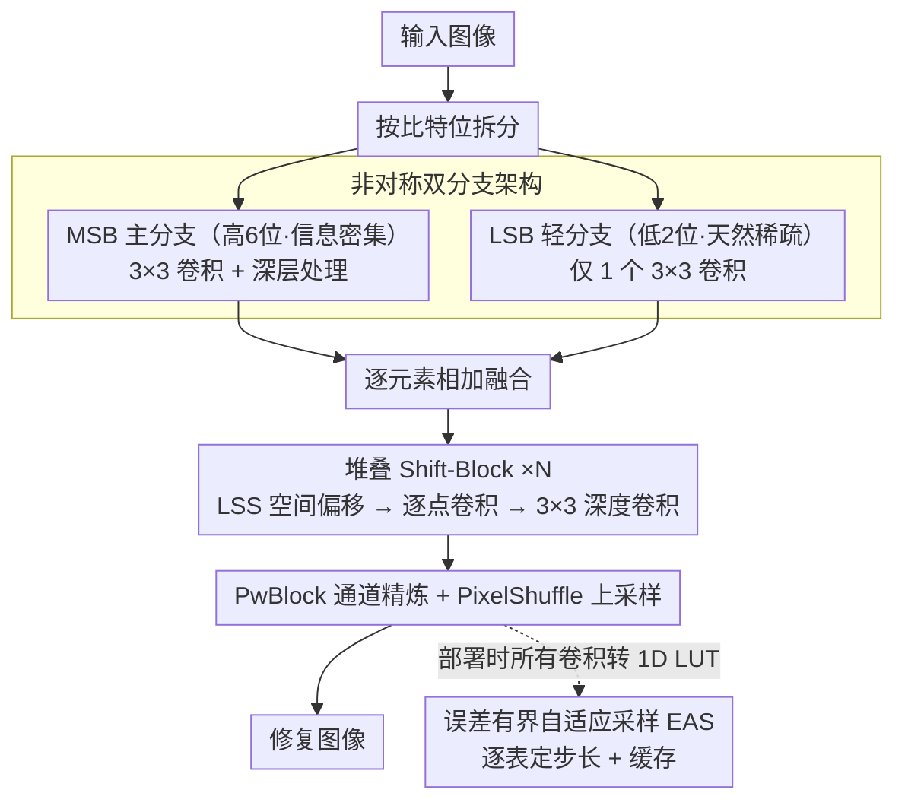

# ShiftLUT: Spatial Shift Enhanced Look-Up Tables for Efficient Image Restoration

**会议**: CVPR 2026  
**arXiv**: [2603.00906](https://arxiv.org/abs/2603.00906)  
**代码**: [GitHub](https://github.com/Sailor-t/ShiftLUT)  
**领域**: 高效图像修复  
**关键词**: 查找表, 高效超分, 空间偏移, 非对称架构, 自适应采样

## 一句话总结

提出 ShiftLUT，通过可学习空间偏移模块（LSS）实现 LUT 方法中最大感受野（65×65），配合非对称双分支架构和误差有界自适应采样（EAS），在存储 104KB + 推理 84ms 的条件下超越所有现有 LUT 方法。

## 研究背景与动机

LUT（查找表）方法通过"空间换时间"策略，将卷积运算替换为高效的内存查找，适合在智能手机等边缘设备上部署。但面临核心矛盾：

**感受野受限**：LUT 存储指数增长（$B^N$），扩大感受野代价极高
   - MuLUT 通过级联多个 LUT 扩大感受野，但存储和延迟线性增加
   - TinyLUT-F 达到 33×33 感受野，但需 171KB + 146ms

**双分支对称设计低效**：SPLUT 将输入分为 MSB（高 6 位）和 LSB（低 2 位）分支并行处理，但对称设计在 LSB 分支上浪费计算——LSB 分支深层特征零值比例趋近 100%

**LUT 压缩策略不灵活**：现有方法对所有 LUT 使用固定采样步长，但不同 LUT 对结果贡献不同

## 方法详解

### 整体框架

ShiftLUT 要解决的核心问题是：LUT 方法想扩感受野就得让存储指数膨胀，这条路在边缘设备上走不通。它的思路是把"扩感受野"从存储维度挪到特征处理维度——让特征在被查表之前先做一次跨空间位置的搬运，从而用几乎不增加 LUT 数量的方式聚合远处的像素信息。

整条 pipeline 分三步走。输入图像先按比特位拆成 MSB（高 6 位）和 LSB（低 2 位）两路，各自过一个 3×3 卷积提取浅层特征后逐元素相加融合；融合特征再送入若干个堆叠的 Shift-Block，每个 block 的结构是「LSS 空间偏移 → PwBlock 逐点卷积 → 3×3 深度卷积」；最后由 PwBlock 做通道精炼、PixelShuffle 上采样还原出修复图像。模型按 Shift-Block 数量分三档：ShiftLUT-S（0 个）、ShiftLUT-M（1 个）、ShiftLUT-L（7 个），感受野随之从 9×9 涨到 65×65。推理阶段所有卷积都按 SMS 策略转成 1D LUT，再叠加旋转集成。

### 关键设计

**1. 可学习空间偏移模块 LSS：用零额外查表的代价把感受野撑大**

LUT 的感受野受限，本质是因为多覆盖一个邻居像素就要多一个维度、存储翻 $B$ 倍。LSS 绕开这个矛盾的办法是：不去扩大单次查表覆盖的窗口，而是先让每个特征通道整体沿空间方向平移一段距离，再用后续的逐点卷积去聚合——平移之后，逐点位置上"恰好"对齐的就是远处的像素信息。具体地，一个轻量的偏移预测网络 $\mathcal{O}(\cdot)$（卷积 + MLP）为每个通道预测一对偏移量 $\{(\Delta x_c, \Delta y_c)\}_{c=1}^{C} = \mathcal{O}(\mathbf{F})$，然后逐通道按该偏移搬运特征 $\mathbf{F}'_c(x,y) = \mathbf{F}_c(x - \Delta x_c, y - \Delta y_c)$。

它的关键巧思在于训练-推理两阶段解耦。Stage 1 让偏移是可学习的浮点数，配双线性插值联合训练，把"哪些通道该往哪搬"学出来；Stage 2 直接扔掉偏移预测网络，用训练期间偏移的均值取整后的固定整数偏移替代——这样推理时就退化成纯整数索引的移位，连插值开销都没了。之所以能这么干，是因为作者观察到学到的偏移方差极低（< $10^{-3}$），说明 LSS 实际上收敛到了一组固定的、通道相关的空间采样模式，浮点的灵活性在收敛后是冗余的。相比 PCS 等用人工固定偏移的做法，LSS 把偏移交给数据去发现更优配置，又在部署时退回零开销的固定形态。

**2. 非对称双分支架构：把浪费在稀疏分支上的算力还给主分支**

SPLUT 一类方法把 MSB 和 LSB 两路用对称的深网络平行处理，但作者发现这里有明显浪费：在对称架构里，LSB 分支深层的零值激活比例趋近 100%。原因是 MSB 承载的是低频结构信息、空间上密集，而 LSB 承载的是高频细节、本身就天然稀疏，对一路接近全零的稀疏信号堆同样深的网络没有意义。于是 ShiftLUT 把 LSB 分支砍到只剩一个 3×3 卷积，把省下的算力全部还给信息密集的 MSB 分支。代价几乎为零：非对称设计与对称设计 PSNR 同为 28.19，但延迟从 164ms 直接降到 84ms。

**3. 误差有界自适应采样 EAS：给每个 LUT 单独定压缩率，而不是一刀切**

现有 LUT 压缩对所有表用同一个采样步长，但不同 LUT 对最终结果的贡献并不相同，统一步长必然次优。EAS 把每个 LUT 的步长选择写成一个带误差约束的最大化问题：在不超过预设误差上界 $\varepsilon$ 的前提下，取尽可能大的步长以最大化压缩，

$$\max_{s \in \mathcal{S}} s \quad \text{s.t.} \quad \text{Error}(s) < \varepsilon$$

候选步长限定在 $\mathcal{S} = \{2^k \mid k=0,1,\dots,K_{\max}\}$，即 2 的幂次，这样查表时能用位移代替除法、对硬件友好；误差度量里还乘了一个权重惩罚 $\frac{s}{s-1}$，让惩罚强度和存储节省率成正比，避免为省一点存储牺牲过多精度。落地时配一个缓存机制：推理前把插值后的 LUT 输出预计算好缓存进共享 buffer（6-bit 输入只占 64 字节），每个像素直接查缓存而非逐次插值，于是压缩换来的存储下降几乎不带来延迟上升。

### 损失函数 / 训练策略

- 数据集：DIV2K
- 优化器：Adam，$\beta_1=0.9, \beta_2=0.999$，初始 lr $5 \times 10^{-3}$，余弦退火
- 训练 200K iterations，batch 32，patch 48×48
- 两阶段训练 LSS（Stage 1 可学习偏移 → Stage 2 固定整数偏移）
- EAS 容差 $\varepsilon = 0.4$

## 实验关键数据

### 主实验

| 方法 | 存储 | 延迟 | 感受野 | Set5 PSNR | Urban100 | Manga109 | 平均 |
|------|------|------|--------|-----------|----------|----------|------|
| SPLUT-L | 18432KB | 265ms | 5×5 | 30.52 | 24.46 | 27.70 | 27.42 |
| MuLUT | 4159KB | 242ms | 9×9 | 30.60 | 24.46 | 27.90 | 27.48 |
| TinyLUT-F | 171KB | 146ms | 33×33 | 31.18 | 24.92 | 28.83 | 28.01 |
| **ShiftLUT-S** | **24KB** | **22ms** | 9×9 | 30.50 | 24.39 | 27.65 | 27.39 |
| **ShiftLUT-M** | **38KB** | **31ms** | 17×17 | 30.77 | 24.62 | 28.18 | 27.66 |
| **ShiftLUT-L** | **104KB** | **84ms** | **65×65** | **31.33** | **25.12** | **29.16** | **28.19** |

注：ShiftLUT-L 在所有 benchmark 上 SOTA，存储仅 TinyLUT-F 的 61%，速度快 42%，感受野扩大近 2 倍。

### 消融实验

| 配置 | 关键指标 | 说明 |
|------|---------|------|
| 无 LSS vs 有 LSS | PSNR +0.30+ dB | 所有网络配置下一致有效 |
| 对称双分支 vs 非对称 | 28.19 vs 28.19 PSNR，164ms vs 84ms | 性能不降，延迟减半 |
| EAS(ε=0.4) | 与原始 LUT PSNR 相同 | 存储减半，延迟几乎不增加 |
| EAS(ε=0.8) | PSNR 降 < 0.03 dB | 更激进压缩仍保持精度 |
| 均匀采样 step=4 | PSNR 降 0.04 dB，延迟 211ms | EAS 更优（84ms + 不降 PSNR） |

### 关键发现

- LSS 在所有网络配置（不同 block 数和通道数）下**稳定提升 > 0.30 dB**，证明其通用性
- LAM（Local Attribution Map）验证：LSS 使模型有效利用更大空间范围的像素信息
- 偏移方差极低证明 LSS 本质上学习了最优的静态采样模式
- MSB 6-bit / LSB 2-bit 是存储-性能的最佳权衡
- ShiftLUT 在去噪（Set12: 32.43 vs TinyLUT-F 32.22）和去块效应（Classic5: 29.12 vs 28.74）中同样 SOTA

## 亮点与洞察

1. **LSS 的优雅设计**：可学习偏移发现最优采样配置，训练后转为零开销的固定整数偏移，兼顾了灵活性和效率
2. **非对称架构的实证论证**：通过 LSB 分支的零值激活分析，令人信服地论证了对称设计的浪费
3. **EAS 的自适应压缩**：为每个 LUT 定制采样步长 + 缓存机制，是对 LUT 压缩的实质性改进
4. **多任务验证**：超分辨率、去噪、去块效应三个任务均验证有效
5. **Pareto 前沿**：ShiftLUT 系列在存储-速度-质量三维空间建立了新的 Pareto 前沿

## 局限与展望

1. LUT 方法的表达能力仍受限于输入量化精度（6-bit MSB）
2. LSS 的两阶段训练增加了训练复杂度
3. 仅评估了 ×4 超分辨率，未测试其他缩放因子
4. 在真实退化（非 bicubic）场景下的表现未知
5. 可扩展方向：轻量化视频修复、更大的 LUT 分解模式

## 相关工作与启发

- **TinyLUT**：1D LUT + SMS 分离映射策略，ShiftLUT 在此基础上引入空间偏移
- **SPLUT**：双分支 MSB/LSB 架构的开创者，ShiftLUT 改进其对称设计
- **PCS/Group ShiftNet**：固定偏移的 shift 操作用于低级视觉，LSS 将其升级为可学习
- **ECLUT**：在输出端扩展覆盖范围，LSS 在特征端扩展感受野
- 启发：LUT 方法的核心瓶颈在感受野，而非计算量；空间偏移是零开销扩展感受野的关键

## 评分

- 新颖性: ⭐⭐⭐⭐ LSS 的两阶段可学习偏移设计新颖，非对称架构的实证论证有洞察
- 实验充分度: ⭐⭐⭐⭐ 3 个任务、5+ 数据集、全面消融（LSS/架构/EAS/bit 分配）
- 写作质量: ⭐⭐⭐⭐ 逻辑清晰，三个贡献的动机和关联讲解流畅
- 价值: ⭐⭐⭐⭐⭐ 面向边缘设备的实用性极强，24KB-104KB 的超高效模型有实际部署价值

<!-- RELATED:START -->

## 相关论文

- [\[ICCV 2025\] IM-LUT: Interpolation Mixing Look-Up Tables for Image Super-Resolution](../../ICCV2025/image_restoration/im-lut_interpolation_mixing_look-up_tables_for_image_super-resolution.md)
- [\[CVPR 2026\] Beyond the Ground Truth: Enhanced Supervision for Image Restoration](beyond_the_ground_truth_enhanced_supervision_for_image_restoration.md)
- [\[CVPR 2026\] Blink: Dynamic Visual Token Resolution for Enhanced Multimodal Understanding](blink_dynamic_visual_token_resolution_for_enhanced_multimodal_understanding.md)
- [\[CVPR 2026\] Beyond Ground-Truth: Leveraging Image Quality Priors for Real-World Image Restoration](beyond_ground-truth_leveraging_image_quality_priors_for_real-world_image_restora.md)
- [\[CVPR 2026\] RAR: Restore, Assess, Repeat - A Unified Framework for Iterative Image Restoration](rar_restore_assess_repeat_a_unified_framework_for_iterative_image_restoration.md)

<!-- RELATED:END -->
