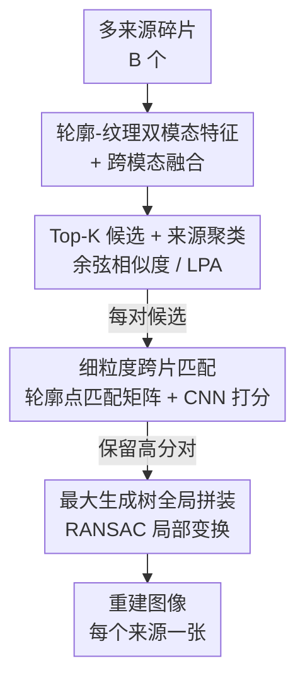

# ShreddingNet: Coarse-to-Fine Restoration for Multi-Source Shredded Manuscripts

**会议**: CVPR 2026  
**论文**: [CVF Open Access](https://openaccess.thecvf.com/content/CVPR2026/html/Cui_ShreddingNet_Coarse-to-Fine_Restoration_for_Multi-Source_Shredded_Manuscripts_CVPR_2026_paper.html)  
**代码**: https://github.com/tqychy/shreddingnet  
**领域**: 图像恢复 / 碎片拼接  
**关键词**: 文物修复, 碎片拼接, 多来源, 粗到细匹配, 线性复杂度

## 一句话总结
ShreddingNet 用「粗匹配先按来源聚类、再细粒度逐对评分」的两阶段流程，解决多张书画作品碎片混在一起的修复问题，把模型调用次数从 $O(n^2)$ 降到 $O(n)$，在两个数据集上全局拼装 F1 达 98.37%，比此前 SOTA 高 5.72%。

## 研究背景与动机
**领域现状**：书画、文物的数字化修复是计算机视觉服务文化遗产的重要方向。已有工作大多聚焦「单来源」场景——所有碎片都来自同一张完整图像（如 JigsawNet 用 CNN 在单源拼图里筛选相邻碎片对），按相邻关系两两枚举后拼接。

**现有痛点**：现实中碎片往往是**多来源**的——不同作品的碎片混在一起，且没人告诉你到底有几张原图、哪些是「外来碎片」。在这种设定下旧方法各有硬伤：JigsawNet 之类的 Siamese 框架要对所有碎片对做穷举，时间复杂度 $O(n^2)$；LLMCO4MR 虽然能在多源场景去离群碎片，却**假设离群碎片数量已知**，不实用；PairingNet 召回高但精度低，而且本身不负责拼出完整图。此外大量方法只用轮廓线索、不考虑真实碎片的污渍、霉斑、轮廓残缺等退化。

**核心矛盾**：「无约束的多来源 + 线性可扩展 + 对退化鲁棒」三者很难同时满足。要避免 $O(n^2)$ 穷举就得先剪枝候选，但剪枝又容易把真匹配也剪掉、或把不同来源的碎片错连在一起。

**本文目标**：在不依赖「碎片含文字」「离群数已知」等强假设的前提下，把多源碎片按来源分开、再精确拼回各自的原图，同时把模型调用次数压到线性。

**切入角度**：作者抓住一个关键观察——**粗匹配阶段产生的错误候选对，极少跨越来源边界**（实测错误对里跨源的只占 0.69%/1.02%）。因为不同来源的碎片在形状和纹理上差异更大，天然更难被误配。

**核心 idea**：用「粗匹配 → 按来源聚类 → 细粒度匹配 → 全局拼装」的粗到细流程，让粗匹配既负责把候选压成线性规模、又顺手把碎片按来源聚成簇；细粒度阶段只在每个碎片的 Top-K 候选里做重活，从而 $O(n)$。

## 方法详解

### 整体框架
输入是 $B$ 个混在一起、可能来自多张原图的碎片，输出是把它们各自拼回的若干张重建图像。整条流水线分三段：**粗匹配**先给每个碎片抽「轮廓+纹理」双模态特征并融合，算两两余弦相似度、每个碎片只保留 Top-K 候选（把潜在匹配从 $B^2$ 压到 $B\times K$），并基于这些候选边把碎片按来源聚类；**细粒度匹配**只在这些候选对上做逐对的跨片交互，产出轮廓点匹配矩阵、用一个轻量 CNN 给每对打置信分、过滤低分对，并用 RANSAC 估计局部变换；**全局拼装**把保留的匹配对组成带权图，每个连通分量对应一张原图，在每个分量里取最大生成树、沿树复合局部变换得到全局变换，拼出完整图。

### 关键设计

**1. 轮廓-纹理双模态特征 + 跨模态融合：把不稳定的整图处理换成碎片内的局部特征**

碎片在大小、朝向、形状上千差万别，往往也没有清晰语义，直接做图像级处理很不稳定。作者改成围绕**轮廓点**取特征：先提取每个碎片的轮廓，在每个轮廓点处取 $7\times7$ 的双模态 patch——一份采自原图（纹理）、一份采自轮廓二值图（形状），堆成序列 $I\in\mathbb{R}^{L\times7\times7}$（$L$ 取数据集最大轮廓点数，超出的下采样）。每种 patch 序列经 8-近邻建图后送入一个独立参数的 14 层 ResGCN，得到纹理特征 $F_t$ 和轮廓特征 $F_c$。融合用**双向跨注意力**：纹理作 Query、轮廓作 Key/Value 增强纹理，再反过来增强轮廓，二者取平均得 $F_{\text{fused}}$。这样既保留了碎片的边缘几何（拼接靠边缘），又引入了纹理语义，比只用轮廓线索更判别。

**2. Top-K 候选 + 来源聚类：把候选压成线性规模，并顺手按来源分簇**

这是本文最核心的一步，直接解决了「$O(n^2)$ 穷举」和「不知道有几张原图」两个痛点。对每个碎片，用 $F_{\text{fused}}$ 算两两余弦相似度，只保留相似度最高的 Top-K 个候选，于是候选总量从 $B^2$ 降到至多 $B\times K$，模型调用随碎片数线性增长。更妙的是聚类：作者发现粗匹配的错误候选**极少跨来源**（art 2192 上仅 0.69%、pex 2000 上仅 1.02%），因此把碎片当节点、候选匹配当边，做图聚类就能把同源碎片分到一簇。这里用**标签传播 LPA** 而非 K-Means/谱聚类，因为 LPA 不需要预先知道簇数（即原图数量未知）、且复杂度低、天然在图上操作。尽管此时候选精度很低，但因为错配几乎都发生在同源内部，聚类反而高精度。

**3. 细粒度跨片匹配 + CNN 打分：在候选对上做精细化，把脏候选筛干净**

粗匹配给的是高召回但大量假阳的候选，细粒度阶段负责提精度。与粗匹配处理单个碎片不同，这里**成对输入**，用堆叠的跨注意力 decoder 让两个碎片互相推理：给定一对，得到特征 $f_1^1\in\mathbb{R}^{L_1\times dim}$、$f_2^1\in\mathbb{R}^{L_2\times dim}$，经 $n$ 层交互后算轮廓点匹配矩阵

$$f_1^i = \mathrm{Att}(f_2^{i-1}, f_1^{i-1}, f_1^{i-1}),\quad f_2^i = \mathrm{Att}(f_1^{i-1}, f_2^{i-1}, f_2^{i-1}),\quad M = f_1^n \times (f_2^n)^T$$

真正能拼上的轮廓点对在 $M$ 主对角线附近形成连续的高相似区域，但上游噪声会打断对角连续性或引入离对角响应，所以纯规则打分不可靠。作者用一个轻量 CNN（3 层卷积捕捉矩阵的对角连续性/密度等模式）+ MLP + Sigmoid 输出置信分，分数过阈值的对才保留为最终匹配，再用 RANSAC 估计局部变换。消融显示这个 CNN 打分比规则打分给出更清晰的决策边界。

**4. 最大生成树全局拼装：把局部匹配复合成全局坐标系**

最终匹配定义了一张带权图，节点是碎片、边带着匹配分和局部变换，每个连通分量对应一张原图。作者在每个分量里选**最大生成树**、沿树把局部变换逐段复合，把所有碎片放进同一个坐标系完成拼接。用最大生成树而非全部边，既避免了冗余/冲突变换的累积误差，又因为前面候选已经很「干净」，传给 RANSAC 的对少、拼装又快又准。

### 损失函数 / 训练策略
三个网络分开训练（粗匹配、细粒度匹配、打分），用 Adam + 余弦退火，权重衰减 $5\times10^{-4}$，按 7:1:2 划分 train/val/test（seed=1024）。数据是合成的：先采集原图（art 2192 共 2192 张中国书画，pex 2000 共 2000 张 Kaggle 高清照片），再受控切碎；训练集不退化、测试集注入污渍/霉斑/轮廓残缺，以评估零样本鲁棒性。具体损失见原文补充材料。

## 实验关键数据

### 主实验（与基线对比，art 2192，IC=每批原图数）
全局拼装（GA）精度/召回，对比规则法、JigsawNet、PairingNet：

| IC | 方法 | GA Prec(%) | GA Rec(%) |
|----|------|-----------|-----------|
| 3 | JigsawNet | 92.79 | 82.88 |
| 3 | PairingNet | 94.81 | 90.49 |
| 3 | **Ours** | **99.15** | **97.59** |
| 6 | JigsawNet | 92.46 | 82.28 |
| 6 | PairingNet | 94.10 | 90.67 |
| 6 | **Ours** | **98.55** | **97.28** |

细粒度匹配的召回与 PairingNet 接近，但精度明显更高——说明粗到细设计让传入全局拼装的结果更「干净」。推理时间上，art 2192（每批 3 图）平均每批 207.2s，而 JigsawNet 811.36s、PairingNet 350.84s；JigsawNet 吃 $O(n^2)$ 枚举，PairingNet 把大量假候选丢给 RANSAC，本文干净候选集减少了 RANSAC 调用，且随碎片数近似线性扩展。

### 消融实验（art 2192，ARI 衡量按来源分簇能力）

| 配置 | FM Prec(%) | FM Rec(%) | ARI(%) | GA Prec(%) | GA Rec(%) |
|------|-----------|-----------|--------|-----------|-----------|
| w/o 来源聚类 (FC) | 76.71 | 79.01 | 53.44 | 97.94 | 97.31 |
| w/o 细粒度匹配 (FM) | 20.77 | 98.49 | 91.16 | N/A | N/A |
| w/o CNN 打分 | 65.17 | 78.46 | 91.78 | 96.43 | 93.54 |
| 完整模型 | 77.07 | 78.40 | 92.29 | 99.15 | 97.59 |

### 关键发现
- **去掉来源聚类 ARI 暴跌**（92.29 → 53.44）：大量跨源错配传到后续阶段，验证「先按来源分簇」是多源设定的关键。
- **去掉细粒度匹配精度崩塌**（FM Prec 77.07 → 20.77）：它负责把粗匹配的假候选筛掉，没了它精度几乎不可用。
- **CNN 打分换成规则打分**精度/召回双降（GA 99.15/97.59 → 96.43/93.54），CNN 给出更清晰的决策边界。
- 超参 $K$：$K<20$ 时各指标随 $K$ 增大而提升，$K>20$ 后召回饱和、精度/F1 开始波动下降（过多错配进入细粒度阶段），故取 $K=20$ 平衡精度与效率。
- 退化场景（污渍/霉斑/轮廓残缺）下全局精度仍 >95%，召回降到约 75–82%（严重侵蚀、纹理被破坏的边缘碎片不可恢复），精度的稳定体现了对真实噪声的鲁棒性。
- 真实案例：手撕+扫描的两组真实碎片，全局精度/召回 97.72/98.20 与 96.70/97.73，接近合成数据。

## 亮点与洞察
- **「错误候选极少跨来源」这个观察非常关键且反直觉**：粗匹配虽然精度低，但因为错配几乎都在同源内部，反而能用来高精度聚类——把「噪声」变成了「按来源分簇」的信号。
- **用 Top-K 候选把复杂度从 $O(n^2)$ 降到 $O(n)$**，且模型调用数线性增长这个度量很务实，直接转化为推理时间优势（比 JigsawNet 快约 4 倍）。
- **用 LPA 而非 K-Means 聚类**，巧妙规避了「原图数量未知」的难题，比假设离群数已知的 LLMCO4MR 实用得多。
- 轮廓点匹配矩阵 $M$ 的「主对角线连续高相似区」这个先验，配上轻量 CNN 学习对角连续性/密度，比硬规则评分更稳——这个「把结构先验交给小 CNN 学」的思路可迁移到其他需要匹配矩阵评分的任务。

## 局限与展望
- **数据基本是合成的**：训练/主测都靠算法切碎合成，真实评测只有两组手撕案例，规模很小；作者也承认缺大规模真实碎片数据集，有了会再测。
- **严重退化下召回明显下降**（约 75–82%）：纹理被彻底破坏的边缘碎片无法恢复，这是方法本身难以突破的边界。
- **依赖 Top-K 的 $K$ 选取**：$K$ 太小漏真匹配、太大引入噪声拖慢速度，需按数据集调；不同来源数/分辨率下最优 $K$ 是否稳定，原文未充分展开。⚠️ 部分损失与指标定义在补充材料，正文未给全，以原文为准。
- 三个网络分开训练，未端到端联合优化，可能存在阶段间误差累积；端到端训练或联合微调是潜在改进方向。

## 相关工作与启发
- **vs JigsawNet**: 它给传统流水线接 CNN 做「预筛+神经纠正」，但要穷举所有碎片对（$O(n^2)$）、且面向单源；本文用 Top-K 候选做到 $O(n)$ 并原生支持多源，精度/速度全面更优。
- **vs PairingNet**: 同样面向多源候选池找相邻碎片，召回高但精度低、且不负责拼出完整图；本文细粒度召回与它接近但精度大幅领先，并补齐了全局拼装，传给拼装的候选更「干净」。
- **vs LLMCO4MR**: 它用 GNN+最优传输去离群碎片，但假设离群数已知；本文用 LPA 聚类不需要预知原图/离群数，假设更弱、更贴近真实修复场景。

## 评分
- 新颖性: ⭐⭐⭐⭐ 「错误候选极少跨源」的观察 + 用粗匹配同时降复杂度和按源聚类，构思巧妙
- 实验充分度: ⭐⭐⭐⭐ 两数据集、多原图数、退化鲁棒性、效率、消融、真实案例都覆盖；但真实数据规模偏小
- 写作质量: ⭐⭐⭐⭐ 动机—观察—方法的逻辑链清晰，图表完整
- 价值: ⭐⭐⭐⭐ 文化遗产/文物修复有现实意义，线性复杂度让大规模碎片可行

<!-- RELATED:START -->

## 相关论文

- [\[CVPR 2026\] FinPercep-RM: A Fine-grained Reward Model and Co-evolutionary Curriculum for RL-based Real-world Super-Resolution](finpercep_rm_a_fine_grained_reward_model_and_co_evolutionary_curriculum_for_rl_ba.md)
- [\[CVPR 2026\] DNF-SR: Dual-Input and Negative-Aware Feature Fine-Tuning for Real-World Image Super-Resolution](dnf-sr_dual-input_and_negative-aware_feature_fine-tuning_for_real-world_image_su.md)
- [\[AAAI 2026\] Clear Nights Ahead: Towards Multi-Weather Nighttime Image Restoration](../../AAAI2026/image_restoration/clear_nights_ahead_towards_multi-weather_nighttime_image_res.md)
- [\[CVPR 2026\] Multinex: Lightweight Low-light Image Enhancement via Multi-prior Retinex](multinex_lightweight_low-light_image_enhancement_via_multi-prior_retinex.md)
- [\[AAAI 2026\] MFmamba: A Multi-function Network for Panchromatic Image Resolution Restoration Based on State-Space Model](../../AAAI2026/image_restoration/mfmamba_a_multi-function_network_for_panchromatic_image_resolution_restoration_b.md)

<!-- RELATED:END -->
