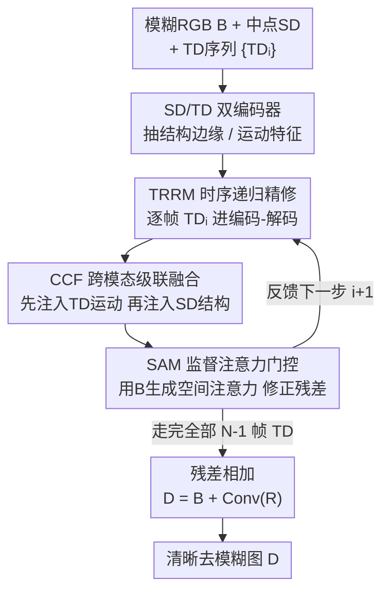

# Spatio-Temporal Difference Guided Motion Deblurring with the Complementary Vision Sensor

**会议**: CVPR 2026  
**论文**: [CVF Open Access](https://openaccess.thecvf.com/content/CVPR2026/html/Meng_Spatio-Temporal_Difference_Guided_Motion_Deblurring_with_the_Complementary_Vision_Sensor_CVPR_2026_paper.html)  
**代码**: https://tmcDeblur.github.io/ （项目页）  
**领域**: 图像恢复 / 运动去模糊  
**关键词**: 运动去模糊, 互补视觉传感器, 时空差分, 递归精修, 跨模态注意力融合

## 一句话总结
针对 RGB 单帧去模糊本质病态、事件相机又会饱和且边缘/运动纠缠的问题，本文用天眸（Tianmouc）互补视觉传感器在单次 RGB 曝光内同步采到的高帧率空间差分（SD，编码结构边缘）与时间差分（TD，编码运动），设计了递归多分支网络 STGDNet 把 SD/TD 逐时序注入 RGB 特征空间做去模糊，并配套一套 DMD 数据制造管线生成真实对齐训练对，在合成 CVS 数据集和 100+ 真实极端运动场景上都取得 SOTA。

## 研究背景与动机
**领域现状**：运动模糊源于曝光期间场景快速变化，把曝光内丰富的运动轨迹「积分」压扁进一张 RGB 帧。传统去模糊从核估计走到深度编码-解码网络、多尺度递归、注意力机制，但都只能从单张/多张模糊 RGB 里**隐式**地反推运动。

**现有痛点**：纯 RGB 去模糊在极端运动下高度病态——大幅非线性运动把结构和颜色在曝光内混在一起，而 RGB 模态本身缺乏足够的结构线索和运动线索来刻画曝光内动态。为了引入额外线索，近期工作转向高时间分辨率的类脑视觉传感器（事件相机、脉冲相机），但事件相机有三重硬伤：(1) 信号质量上有不应期假阴性、触发阈值不恒定、快速运动下事件率饱和；(2) 模态上事件把**边缘特征**和**运动线索**两类信息纠缠在一起，需要后续算法专门解耦；(3) 硬件上事件相机与 RGB 的时空对齐通常要分光镜等复杂光路标定。

**核心矛盾**：要补 RGB 缺失的运动/结构线索，就得引入高时间分辨率模态；但事件模态本身既会饱和、又把边缘和运动搅在一起、还难与 RGB 物理对齐——补线索的代价是引入新的噪声和纠缠。

**本文目标**：找一种**在传感层就把边缘与运动解耦、且天然与 RGB 时空对齐、不饱和**的高时间分辨率模态来引导 RGB 去模糊，并解决随之而来的 RGB 曝光时长不定、差分信号稀疏无色、多模态域差等工程难题。

**切入角度**：作者改用互补视觉传感器 CVS（天眸 Tianmouc）——它有两条协同视觉通路：认知通路输出 30 FPS RGB 帧，行动通路以 757–10,000 FPS 输出空间差分 SD（编码结构）和时间差分 TD（编码帧间运动）。由于固定帧率 + 固定多比特精度，CVS 读出带宽有界、**不饱和**；SD/TD 用极短曝光采集**本身无运动模糊**；二者分别编码空间结构和曝光内时间动态，在**传感层就把边缘与运动解耦**，并与 RGB 做到硬件级时空对齐。

**核心 idea**：用 CVS 同步采到的 SD（中点结构帧）+ TD（运动序列）作为显式时空先验，通过一个**递归**网络把它们逐时序注入 RGB 特征空间、逐步残差精修，从而在极端运动下恢复清晰、色彩一致的图像。

## 方法详解

### 整体框架
STGDNet 是一个编码-解码框架，输入是**一张模糊 RGB 帧 $B$、一帧中点空间差分 $SD_{\lfloor (N-1)/2 \rfloor}$、以及曝光内全部 $N{-}1$ 帧时间差分 $\{TD_i\}$**，输出一张清晰去模糊图 $D$。这里 $N$ 由 RGB 曝光时长 $t_{RGB}$ 与差分采样间隔 $\tau_{diff}$ 决定：$N = \lceil t_{RGB}/\tau_{diff} \rceil$（实验中 $\tau_{diff}=1320\,\mu s$，对应 757 FPS、±7 bit），所以**曝光越长、TD 帧越多**，网络必须自适应可变长度序列。SD 只取最靠近曝光中点的那一帧，是为了让恢复图与一张物理采到的结构快照做显式对齐（论文也指出可训练对齐到任意 SD 索引）。

整体数据流是：SD/TD 各自经独立编码器抽特征 → 进入**时序递归精修模块 TRRM**，TRRM 在每个递归步 $i$ 取一帧 $TD_i$、配合 SD 特征，通过**跨模态互补融合 CCF** 注入注意力，产出中间残差图，再由**监督注意力模块 SAM** 用模糊 RGB 做空间门控后反馈给下一步 → 递归走完全部 TD 后，最后的残差图经一次卷积，与原始模糊帧相加得到清晰图 $D = B + \mathrm{Conv}_{out}(R_{N-1})$。

### 关键设计

**1. CCF 跨模态级联互补融合：把无色的运动/结构差分注入有色的 RGB 特征**

SD/TD 只编码亮度差分、**没有颜色**，且与 RGB 存在域差，直接 concat 难以让网络分清「哪部分该补运动、哪部分该补结构」。CCF 嵌在 TRRM 每个编码阶段，用**两级级联交叉注意力**显式分工：第一级以当前编码特征为 Query、以 TD 特征为 Key/Value 做注意力，得到「运动增强」的中间表示 $\tilde F^{j,i} = \mathrm{softmax}\!\big((Q^{j,i}_{enc})(K^{j,i}_{TD})^\top/\sqrt{d_k}\big)V^{j,i}_{TD} + F^{j,i}_{enc}$；第二级再以 $\tilde F^{j,i}$ 为 Query、以 SD 特征为 Key/Value，得到同时含运动和结构的 $F^{j,i}_{CCF} = \mathrm{softmax}\!\big((\tilde Q^{j,i})(K^{j}_{SD})^\top/\sqrt{d_k}\big)V^{j}_{SD} + \tilde F^{j,i}$。所有 $Q/K/V$ 都是 $1{\times}1$ 卷积投影。先 TD（运动）后 SD（结构）的顺序，正好对应「先把运动轨迹补回来、再用结构边缘把纹理钉清晰」的去模糊逻辑；多尺度都嵌 CCF，实现分层时空特征聚合。消融里去掉 CCF（换成直接 concat + 两层卷积）掉 0.44 dB PSNR。

**2. TRRM 时序递归精修：用可变长度递归吃下不定曝光时长的 TD 序列**

曝光越长模糊越重、TD 帧数 $N$ 越多，固定结构的网络无法适配。TRRM 把去模糊拆成沿 TD 时序的**递归逐步精修**：每个递归步 $i$ 取一帧 $TD_i$ 与 SD 特征，经一组层次化编码-解码块（编码阶段做 CCF 时空融合、解码阶段带 skip 连接恢复纹理）输出中间残差图 $R_i$，再喂回去做下一步 $R_{i+1} = \mathrm{TRRM}(R'_i, B_{enc}, F_{TD_i}, F_{SD})$，其中 $B_{enc}$ 是模糊帧 $B$ 过一次 $3{\times}3$ 卷积的浅特征。这种递归天然适配任意 $N$，且让运动信息**逐帧累积、逐步把模糊推干净**，而不是一次前向硬猜整段运动。消融里把 TRRM 换成单次前向掉 0.67 dB PSNR、运动边界明显变糊。

**3. SAM 监督注意力门控：用模糊帧定位「哪里还糊」来约束残差反馈**

递归反馈若不加约束，误差会在迭代间累积。SAM 在每步把中间残差 $R_i$ 投回 RGB 域、与模糊帧 $B$ 对齐后生成空间注意力图 $A = \sigma(C_3(C_2(R_i)+B))$，再用它门控残差 $R'_i = R_i + C_1(R_i)\odot A$（$C_1\!-\!C_3$ 为卷积层，$\sigma$ 为 sigmoid）。这个门把注意力强化在与模糊区域相关的特征上，让每一步递归的修正都聚焦在「真正还糊的地方」，而非全图无差别叠加，从而稳住递归精修不发散。

**4. DMD 数据制造管线：把现成高帧率 RGB 视频转成像素级对齐的真实 CVS 训练对**

只在合成数据上训练的去模糊网络往往难泛化到真实场景。作者借鉴视觉芯片表征方法，用**数字微镜器件 DMD** 配光路把 SportsSloMo 的清晰帧逐帧投射到 CVS 传感器上（每 $\tau_{diff}=1320\,\mu s$ 投一帧），让 CVS 的时空差分通路真实地产出 SD 和 TD；同时把 RGB 曝光时长配成 6600/9240/11880/14520 µs 四档（对应 $N=5,7,9,11$ 帧叠加），得到不同模糊程度的真实模糊 RGB；ground-truth 则是整段曝光只投一张固定清晰图、让 CVS 采到真实清晰响应。硬件级触发保证 DMD 与传感器时间同步、固定光学件保证像素级空间对齐，因此训练对天然带噪声/非线性等非理想因素。最终得到 SportsSloMo-CVS：98,569 训练对、1,928 验证、1,820 测试。正是这套管线让模型**无需微调**就能泛化到 100+ 真实场景。

### 损失函数 / 训练策略
直接优化基于 PSNR 的损失 $L_{PSNR} = -\lambda_{psnr}\cdot 10\log_{10}\big(1/(\mathrm{MSE}+\epsilon)\big)$，$\lambda_{psnr}=0.5$。全部参数从零训练，AdamW（lr $2\times10^{-4}$、weight decay $1\times10^{-4}$、$\beta=[0.9,0.99]$），余弦退火到 $1\times10^{-7}$，4×RTX 4090 训练 10 epoch。

## 实验关键数据

### 主实验
在 SportsSloMo-CVS 上跨四档曝光（$N=5,7,9,11$，模糊递增）对比 RGB 方法（Restormer / Turtle，`*` 表示把 SD/TD concat 进 RGB 输入）、CVS 扩散方法 CBRDM、事件方法（EFNet / STCNet / ELEDNet，用 TD/SD 替代事件输入）。所有方法在同数据集同样训 10 epoch。本文在四档曝光下 PSNR/SSIM 全部最高，且参数仅 13.9 M：

| 方法 | N=5 PSNR | N=11 PSNR | N=11 SSIM | Params(M)↓ |
|------|---------|----------|-----------|-----------|
| Restormer（纯RGB） | 34.99 | 31.35 | 0.9186 | 26.1 |
| Restormer*（+SD/TD） | 39.51 | 38.32 | 0.9732 | 26.1 |
| Turtle* | 39.37 | 37.73 | 0.9713 | 59.1 |
| STCNet（事件） | 40.07 | 37.79 | 0.9723 | 16.4 |
| ELEDNet（事件） | 39.51 | 38.36 | 0.9743 | 12.8 |
| EFNet（事件） | 41.29 | 39.37 | 0.9847 | 8.5 |
| CBRDM（CVS扩散） | 31.48 | 30.70 | 0.9307 | 166.2 |
| **STGDNet（本文）** | **41.88** | **40.12** | **0.9874** | **13.9** |

可见：纯 RGB 方法掉点最严重；把 SD/TD 喂进 RGB 方法（`*`）能大幅回血（Restormer 在 N=11 从 31.35→38.32），印证 CVS 差分信号的价值；扩散方法 CBRDM 参数 166 M 却最差，还有结构/颜色失真。本文以最接近最小的体量拿下最高指标。

### 消融实验
在 N=11 测试集上拆解模态与组件：

| SD | TD | CCF | TRRM | PSNR↑ | SSIM↑ | 说明 |
|----|----|-----|------|-------|-------|------|
| × | × | × | × | 31.06 | 0.9429 | 仅 RGB |
| ✓ | × | ✓ | × | 37.70 | 0.9811 | +SD：+6.64 dB |
| × | ✓ | ✓ | × | 39.01 | 0.9842 | +TD：+7.95 dB |
| ✓ | ✓ | × | × | 39.01 | 0.9841 | 去 CCF（直接 concat） |
| ✓ | ✓ | ✓ | × | 39.45 | 0.9855 | 去 TRRM（单次前向） |
| ✓ | ✓ | ✓ | ✓ | **40.12** | **0.9874** | 完整模型 |

### 关键发现
- **模态贡献**：相比纯 RGB，单加 SD 涨 6.64 dB、单加 TD 涨 7.95 dB，两者合并涨 8.39 dB（SSIM +4.52%）——TD（运动）单独比 SD（结构）更关键，二者强互补。
- **组件贡献**：去掉 TRRM（换单次前向）掉 0.67 dB、运动边界变糊；去掉 CCF（换 concat+两层卷积）掉 0.44 dB——递归精修比融合方式影响更大。
- **真实泛化**：训练只用四档离散曝光，但在真实数据上能泛化到连续曝光时长；与 RGB-事件混合相机 DAVIS 对比，事件方法在快速运动下因事件率饱和丢信息、出现伪影/串色，本文色彩保真和结构细节更好。
- **性能边界**：用可控转盘 benchmark（转速 × 曝光时长二维平面）刻画出一条「清晰重建区 vs 串色崩溃区」的分界，为 CVS 去模糊的能力上限给出可量化标尺。

## 亮点与洞察
- **把「解耦」从算法搬到传感层**：事件方法要花专门模块解耦边缘和运动，CVS 直接用 SD/TD 两条通路在硬件上就分好了，还顺带解决了与 RGB 的时空对齐——这是「换传感器消掉一类算法难题」的典型范例。
- **CCF 的先 TD 后 SD 顺序很有讲究**：把级联注意力的两级分别绑到「先补运动、再钉结构」，让融合顺序对应去模糊的物理直觉，而非无序堆注意力。
- **递归适配可变曝光**：用沿 TD 时序的递归天然吃下不定长度序列，把「曝光时长不定」这个工程麻烦转成了递归步数，思路可迁移到任何「输入帧数随采集条件变化」的多帧任务。
- **DMD 数据制造管线可复用**：用投影 + 硬件触发把现成 RGB 视频转成任意新型传感器的真实对齐数据，对所有「新传感器缺数据集」的研究都有借鉴价值。

## 局限与展望
- 强依赖 CVS（天眸）这一特定硬件，方法本身不通用到普通相机；传感器普及度决定落地面。
- 训练用 DMD 投影合成 SportsSloMo-CVS，虽含非理想因素，但仍是投影域数据，与真实自然光照采集仍可能有域差（⚠️ 论文以无需微调的真实泛化结果间接论证，未给真实采集的定量 PSNR）。
- 性能边界分析显示存在「转速×曝光」的崩溃区，即极端快速运动下仍会串色失败，能力有上限。
- SD 只用中点单帧做结构对齐，可能浪费了 SD 序列里的其余结构信息；论文提到可对齐任意索引但未深入挖掘多 SD 帧联合的潜力。

## 相关工作与启发
- **vs 纯 RGB 去模糊（Restormer / Turtle）**：它们只能隐式反推运动，极端模糊下细节丢失、结构糊；本文用显式 SD/TD 先验，且把 SD/TD 喂进它们也能大幅回血，说明增益主要来自模态而非单纯网络。
- **vs 事件相机去模糊（EFNet / STCNet / ELEDNet）**：事件会饱和、边缘与运动纠缠、需复杂光路对齐；CVS 不饱和、传感层解耦、硬件对齐，真实快速运动下伪影/串色更少。
- **vs CVS 扩散方法 CBRDM**：CBRDM 用扩散统一重建高速清晰场景，但 166 M 参数、计算重、易色彩失真、保真度差；本文走轻量确定性路线（13.9 M），色彩更忠实、结构更锐。

## 评分
- 新颖性: ⭐⭐⭐⭐⭐ 首个系统利用 CVS 的 SD/TD 双差分做 RGB 去模糊，把边缘/运动解耦从算法挪到传感层
- 实验充分度: ⭐⭐⭐⭐ 合成跨四档曝光 + 100+ 真实场景 + 转盘性能边界，但真实采集缺定量 GT 对比
- 写作质量: ⭐⭐⭐⭐ 动机推导（事件三重硬伤 → CVS）清晰，方法各模块交代到位
- 价值: ⭐⭐⭐⭐ 配套真实对齐数据集与 benchmark，为新型传感器去模糊任务铺了基础设施

<!-- RELATED:START -->

## 相关论文

- [\[CVPR 2026\] Event-Based Motion Deblurring Using Task-Oriented 3D Gaussian Event Representations](event-based_motion_deblurring_using_task-oriented_3d_gaussian_event_representati.md)
- [\[CVPR 2026\] MAD-Avatar: Motion-Aware Animatable Gaussian Avatars Deblurring](motionaware_animatable_gaussian_avatars_deblurring.md)
- [\[CVPR 2026\] NEC-Diff: Noise-Robust Event–RAW Complementary Diffusion for Seeing Motion in Extreme Darkness](nec-diff_noise-robust_event-raw_complementary_diffusion_for_seeing_motion_in_ext.md)
- [\[CVPR 2026\] STCDiT: Spatio-Temporally Consistent Diffusion Transformer for High-Quality Video Super-Resolution](stcdit_spatio-temporally_consistent_diffusion_transformer_for_high-quality_video.md)
- [\[CVPR 2026\] Gyro-based Deep Video Deblurring](gyro-based_deep_video_deblurring.md)

<!-- RELATED:END -->
