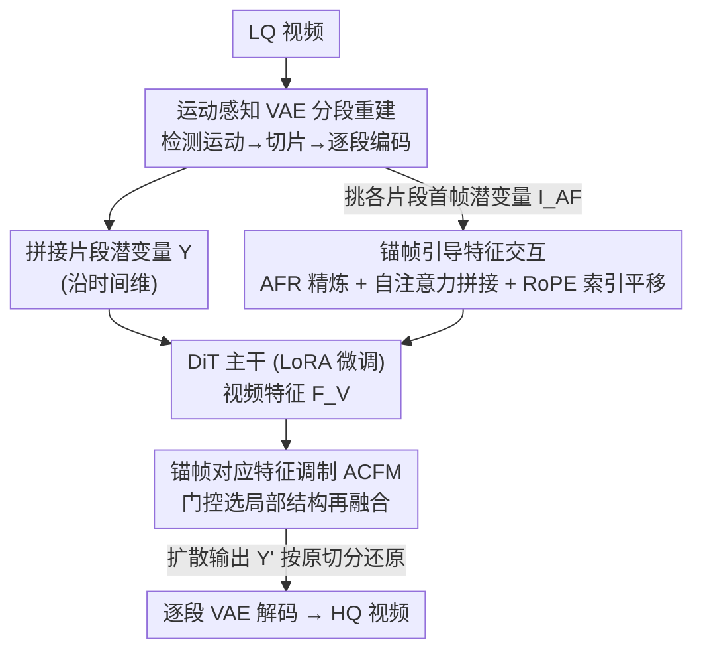

# STCDiT: Spatio-Temporally Consistent Diffusion Transformer for High-Quality Video Super-Resolution

**会议**: CVPR 2026  
**论文**: [CVF Open Access](https://openaccess.thecvf.com/content/CVPR2026/html/Chen_STCDiT_Spatio-Temporally_Consistent_Diffusion_Transformer_for_High-Quality_Video_Super-Resolution_CVPR_2026_paper.html)  
**代码**: https://jychen9811.github.io/STCDiT_page （项目页）

**领域**: 图像/视频恢复（视频超分）  
**关键词**: 视频超分辨率, 视频扩散模型, 运动感知VAE, 锚帧引导, 参数高效微调

## 一句话总结
STCDiT 在预训练视频扩散模型（Wan2.1）之上做真实世界视频超分：用"运动感知 VAE 分段重建"解决复杂相机运动下 VAE 重建失真，再用"锚帧引导增强"把每个片段首帧潜变量里保存完好的空间结构信息注入生成过程，只增加约 LoRA 参数 7% 的可训练量就在结构保真度与时序一致性上全面超过 SeedVR、STAR 等 SOTA。

## 研究背景与动机
**领域现状**：视频超分（VSR）要从低质量（LQ）视频里恢复高质量（HQ）帧。传统方法（滑窗、双向/网格传播如 BasicVSR++）擅长挖掘时空依赖，但在真实退化下细节生成乏力；图像扩散模型能补出逼真细节，却因为逐帧独立采样、对同一输入不同噪声给出不同结果，难以保持时序一致，画面会闪烁。视频扩散模型天生建模时空、帧间更连贯，于是成了 VSR 的新底座。

**现有痛点**：把预训练视频扩散模型直接搬到 VSR 有两个具体的坑。其一是**重建阶段的时序稳定性**——主流视频扩散用预训练 VAE 做时序下采样/上采样，但它的时序缩放算子在空间维上是局部操作，建模不了跨帧的复杂空间变换；一旦视频里有相机抖动、推拉变焦这类剧烈运动，VAE 直接重建就会出现结构扭曲和伪影。其二是**生成阶段的结构保真度**——已有方法（SeedVR）靠全量微调大 DiT 来保真，算力开销极高；换成 LoRA 这种参数高效微调虽省钱，但低秩约束限制了模型捕捉复杂特征交互的能力，VSR 既要保住 LQ 的结构又要补细节，单纯 LoRA 不够用。

**核心矛盾**：重设计 VAE 算子/架构来适配复杂运动是高度人力密集的；而保真度与"参数高效"之间存在张力——想省参数就用 LoRA，但 LoRA 的低秩瓶颈又压制了保真所需的特征交互。

**本文目标**：在**不改 VAE 架构、不全量微调 DiT**的前提下，同时拿下时序稳定与结构保真两件事。

**切入角度**：作者两点观察。其一，复杂运动之所以让 VAE 失手，是因为一整段视频里混杂了多种运动模式；如果把视频切成"运动模式一致"的小片段分别重建，VAE 就能各个击破。其二，经过运动感知 VAE 编码后，**每个片段的首帧潜变量（称作"锚帧潜变量" anchor-frame latent）没有经过时序压缩**，比后续帧潜变量保留了更丰富的空间结构——这正好是保真所缺的那块信息。

**核心 idea**：用"分段重建"绕开 VAE 对复杂运动的无能，用"锚帧结构信息"作为参数高效的引导信号去约束 DiT 生成，二者耦合让视频扩散模型实现高质量 VSR。

## 方法详解

### 整体框架
STCDiT 是搭在预训练视频扩散模型上的 VSR 框架，整条管线分重建与生成两段。**重建段**：给一段 LQ 视频，先做运动检测把它切成若干运动模式一致的片段，每段单独过 VAE 编码得到片段潜变量 $\{X_i\}_{i=1}^{L}$，再沿时间维拼成统一潜变量 $Y$ 喂进扩散过程；扩散输出的 $Y'$ 按原切分还原成各片段，分别 VAE 解码拼成最终 HQ 视频。**生成段**：从各片段首帧挑出锚帧潜变量 $I_{AF}$，过一个锚帧特征精炼模块（AFR）得到锚帧特征 $F_{AF}$；在每个 DiT block 里，锚帧 token 与视频 token 拼接进自注意力做交互（把结构信息扩散到各帧），同时用锚帧对应特征调制模块（ACFM）做局部结构选择融合；LQ 视频潜变量 $Y$、噪声潜变量 $N$、全一掩码 $M$ 沿通道拼接后 patchify 得到视频特征 $F_V$。整个 DiT 用 LoRA 微调，可训练量仅约 LoRA（rank=128）参数的 7%（以 Wan-14B 计）。

### 关键设计

**1. 运动感知 VAE 分段重建：把"复杂运动"拆成"局部均匀运动"再让 VAE 各个击破**

痛点是预训练 VAE 的时序缩放算子只在空间维做局部操作，整段视频里抖动、推拉、平移混在一起时它建模不了这种跨帧的大幅空间变换，重建结果结构扭曲。作者不去重设计 VAE，而是在输入端做运动自适应切分：对 LQ 视频先用 Shi–Tomasi 角点检测找特征点，再用 Lucas–Kanade 稀疏光流估计内容运动轨迹，从中拟合**仿射变换矩阵**并分解出帧间变换参数（平移、旋转角、尺度）；用经验阈值找出"运动突变"的帧索引，按这些索引把视频切成 $L$ 个运动模式一致的片段。每段单独 VAE 编码得 $X_i \in \mathbb{R}^{C\times F\times H\times W}$，沿时间维拼成 $Y\in\mathbb{R}^{C\times F'\times H\times W}$；扩散后的 $Y'$ 再按原切分拆回 $\{X_i'\}$ 逐段解码。这样每个片段内运动近似均匀，恰好落在 VAE 时序算子的能力范围内，从而重建出时空连贯的潜变量。为防长片段内仍有运动错位，推理时把单段最大长度限制到 9 帧。消融里这一招把重建 PSNR 从 27.22dB 抬到 31.42dB（+4.20dB），是整套方法稳定性的地基。

**2. 锚帧引导的时空特征交互：用"没被时序压缩的首帧"当结构锚点注入生成**

LoRA 的低秩瓶颈让 DiT 难以兼顾"保住 LQ 结构"和"补细节"。作者的观察是：运动感知 VAE 编码后，每个片段**首帧**潜变量没经历时序压缩，比后续帧保留了更丰富的空间结构——把这些首帧稀疏挑出来作为锚帧潜变量 $I_{AF}$（实现里均匀采样四分之一的首帧潜变量），就是一份免费的高质量结构引导。锚帧先过 AFR 精炼模块增强空间细节：

$$\hat I_{AF} = \mathrm{DConv}(\mathrm{PConv}(I_{AF})),\quad \tilde F_{AF} = \downarrow_2(\hat I_{AF}) + \mathrm{TConv}(I_{AF}),\quad F_{AF} = \mathrm{DConv}(\mathrm{PConv}(\zeta(\tilde F_{AF})))$$

其中 $\mathrm{DConv}$ 是 $3\times3$ 深度卷积，$\mathrm{PConv}$ 是 $1\times1$ 卷积，$\downarrow_2$ 是 $\times2$ 下采样的最大池化，$\zeta$ 是 SiLU，$\mathrm{TConv}$ 是步长 2 的 $2\times2$ 卷积。然后在第 $j$ 个 DiT block 里，把视频特征 $F^V_j$ 与锚帧特征 $F^{AF}_j$ 都展平成 token 沿序列维拼成 $T^C_j$，送进自注意力让二者交互：

$$\mathrm{Attn}(T^C_j) = \mathrm{softmax}\!\left(\frac{Q_j K_j^{\top}}{\sqrt{d}}\right) V_j$$

视频 token 借此把锚帧里的结构信息吸收过来提升保真度。两个细节是关键：其一，对 $Q_j,K_j$ 做位置编码时**保持视频 token 的位置索引不变，只把锚帧 token 的索引沿时间维平移**，借助 RoPE 的外推特性避免两类 token 索引重叠，这样预训练 DiT 不必改动原有视频时序关系就能接纳锚帧交互；其二，自注意力输出后按序列维拆回视频/锚帧 token，**锚帧 token 被排除在后续与文本嵌入交互的 cross-attention 之外**——因为让锚帧和文本交互会破坏它保存的结构信息（消融显示这么做 MUSIQ 反掉 4.84）。

**3. 锚帧对应特征调制 ACFM：自注意力管全局，再补一个门控模块挑局部结构**

自注意力擅长全局依赖，但对视频与锚帧特征里的**局部空间信息**利用不足。受 DiT4SR 启发，ACFM 不直接注入锚帧特征，而是从锚帧特征里估计**门控单元**做判别式特征选择。先把视频/锚帧 token 还原成特征 $O^V_j, O^{AF}_j$，从锚帧提取局部信息：

$$\hat D^{AF}_j = \mathrm{DConv}(O^{AF}_j) + O^{AF}_j,\qquad \hat S^{AF}_j = \hat D^{AF}_j \odot \phi(\mathrm{DConv}(\hat D^{AF}_j))$$

$\odot$ 是逐元素乘，$\phi$ 是 GELU——这里 $\phi(\cdot)$ 充当门控，决定哪些局部结构被放行。再把选出的 $\hat S^{AF}_j$ 融进锚帧对应的视频特征：先 $[\hat O^{V1}_j,\hat O^{V2}_j]=\mathrm{Split}(O^V_j)$ 按时间维分出锚帧对应那部分 $\hat O^{V1}_j$，做 $\hat O^{V1'}_j=\hat O^{V1}_j+\hat S^{AF}_j$，再 $\hat D^{cat}_j=\mathrm{Concat}(\hat O^{V1'}_j,\hat O^{V2}_j)$ 拼回，最后 $\hat D^{O}_j=\mathrm{DConv}(\hat D^{cat}_j)+\hat D^{cat}_j$ 增强局部空间特征。和 DiT4SR 直接注入不同，ACFM 是"先判别式地挑、再融合"，对结构细节（如网格、文字笔画）的恢复更有效；消融里它给 MUSIQ/DOVER 各带来 2.66/1.31 的提升，比换成普通 $3\times3$ 深度卷积明显更强。

### 损失函数 / 训练策略
训练数据用 UltraVideo 的 HQ 视频 + LSDIR 的 HQ 图像，LQ 用 RealBasicVSR / Real-ESRGAN 的退化管线合成，并额外加入相机抖动与缩放效果以贴近真实退化；文本描述由 Qwen2.5-VL 生成。基于 Wan2.1 T2V-1.3B / I2V-14B 分别得到 STCDiT-tiny / STCDiT，LoRA rank=128。训练用 AdamW、常数学习率 5e-5，仅用 MSE loss 约束（与 Wan 一致），视频/图像 batch 各 32/128，4 张 A800。推理仅 10 步，锚帧均匀采样首帧潜变量的四分之一。

## 实验关键数据

### 主实验
在 REDS30 / UDM10（合成）与 RealVSR / VideoLQ / SportsLQ（真实，含新提出的 20 段 720p 体育视频数据集）上，$\times4$ 超分（RealVSR/SportsLQ 为 $\times1$ 原尺度）。下表摘取 REDS30 与 UDM10 上的代表性指标（红/蓝为原文最优/次优，这里用粗体表示本文最优）：

| 数据集 | 指标 | STAR(2B) | DOVE(5B) | SeedVR(7B) | Wan(14B) | STCDiT(14B) |
|--------|------|----------|----------|------------|----------|-------------|
| REDS30 | LPIPS ↓ | 0.4289 | 0.3487 | 0.3209 | 0.2943 | **0.2866** |
| REDS30 | MUSIQ ↑ | 40.45 | 50.33 | 54.50 | 55.05 | **61.65** |
| REDS30 | DOVER ↑ | 36.43 | 36.83 | 36.36 | 39.69 | **42.94** |
| UDM10 | MUSIQ ↑ | 60.84 | 60.84 | 64.62 | 63.75 | **66.46** |
| UDM10 | DOVER ↑ | 54.03 | 57.70 | 60.93 | 60.64 | **64.10** |
| UDM10 | LPIPS ↓ | 0.2312 | 0.1581 | 0.1827 | 0.1720 | 0.1682 |

STCDiT 在 REDS30/UDM10/RealVSR 上的 MUSIQ、CLIPIQA+、MANIQA、FasterVQA、DOVER 等无参考感知指标几乎全面登顶，LPIPS 在 REDS30/RealVSR 取最优；连 1.3B 的 STCDiT-tiny 都常常逼平甚至超过 7B/14B 的对手。

### 消融实验

运动感知 VAE 重建（REDS30 上的纯重建任务，对比标准 VAE 重建 ST VAE 与运动感知 MA VAE）：

| 配置 | PSNR ↑ | SSIM ↑ | E*warp ↓ |
|------|--------|--------|----------|
| ST VAE（标准重建） | 27.22 | 0.7802 | 1.76 |
| MA VAE（运动感知，本文） | **31.42** | **0.8924** | **1.34** |

锚帧引导增强（RealVSR 上，逐组件累加）：

| 配置 | MUSIQ ↑ | DOVER ↑ | 说明 |
|------|---------|---------|------|
| Base | 68.30 | 55.62 | 不用锚帧 |
| + 首帧锚帧交互 (FF) | 70.58 | 58.68 | 自注意力里加锚帧交互 |
| + FF & ACFM | 73.24 | 59.99 | 再加 ACFM（vs 换普通 DWC 的 71.87） |
| Ours (FF & ACFM & AFR) | **73.57** | **60.81** | 完整模型 |
| Ours w/ ITE（锚帧进 cross-attn） | 68.73 | 56.15 | 与文本交互反而掉 4.84 MUSIQ |
| Ours w/o FF & w/ US（均匀采样代替首帧） | 69.72 | 56.39 | 证明首帧锚点更优 |

### 关键发现
- **运动感知重建是最大功臣**：单这一招就把重建 PSNR 抬了 4.20dB，是整套方法在复杂运动下不崩的根本。
- **锚帧必须选"首帧"而非随便均匀采样**：首帧未经时序压缩、结构最完整，换成均匀采样 MUSIQ 从 73.57 掉到 69.72。
- **锚帧不能碰文本（cross-attention）**：让锚帧与文本嵌入交互会污染其结构信息，MUSIQ 反降 4.84，所以作者刻意把锚帧 token 排除在 cross-attn 外。
- **warping error 优势不明显有原因**：E*warp 会惩罚富含细节的结果，作者结果细节多反而在该指标上不占绝对优势——这是该指标本身的偏置，不是时序差。

## 亮点与洞察
- **"换不动算子就换输入"的工程智慧**：VAE 时序算子建模不了复杂运动，作者不去重设计算子（人力密集），而是在输入端把视频切成运动均匀的片段，让现成 VAE 落在它的能力区间——零架构改动拿下 4.2dB，是很可复用的思路。
- **"首帧潜变量未被时序压缩"是一个干净的免费午餐**：很多视频扩散框架都做时序压缩，这个观察意味着任何此类框架都可以把首帧当作结构锚点，几乎零成本地补回结构保真，迁移性很强。
- **RoPE 索引平移让预训练 DiT 无痛接纳新 token**：靠 RoPE 外推把锚帧 token 索引错开、不动视频 token 索引，避免了改动预训练模型的时序先验——给"往预训练 DiT 里塞额外引导 token"提供了一个干净范式。
- **参数极省**：只增加约 LoRA 参数 7% 的可训练量（Wan-14B），却在保真+一致性上超全量微调的 SeedVR，说明"好的引导信号"比"更多可训练参数"更值钱。

## 局限与展望
- **依赖经典运动估计**：分段靠 Shi–Tomasi + Lucas–Kanade 光流和经验阈值检测运动突变，在低纹理、严重退化或快速大位移场景下角点/光流可能失准，进而影响切分质量；阈值也是经验设定，泛化性存疑。
- **片段长度受限带来的取舍**：为缓解长片段运动错位把单段限到 9 帧，运动极频繁时会切出很多短片段，可能削弱长程时序建模，作者未深入分析这种碎片化的代价。
- **时序一致性指标不占优**：E*warp 上优势不明显，虽然作者归因于指标偏置，但缺乏一个更可信的时序一致性度量来正面证明；真实长视频上的累积漂移也未充分评估。
- **改进方向**：把运动检测换成可学习/可微的运动分段、或与扩散过程联合优化；探索锚帧之外（如片段中关键帧）的多锚点引导；面向超长视频的分段-记忆机制。

## 相关工作与启发
- **vs 非扩散 VSR（BasicVSR++ 等传播类）**：它们靠双向/网格传播挖时空依赖，保真但真实退化下细节生成弱；STCDiT 借视频扩散的生成先验补细节，并用锚帧约束防止"生成跑飞"，在感知质量上明显更强。
- **vs 图像扩散 VSR（MGLD、UAV）**：图像扩散逐帧采样、对同输入不同噪声给不同结果，时序闪烁；UAV 用光流做运动补偿仍不足以稳定时序。STCDiT 用视频扩散底座 + 分段重建从根上保时序连贯。
- **vs SeedVR / STAR（视频扩散 VSR）**：STAR 把 LQ 与噪声潜变量拼接但 LQ-生成交互不足，结构扭曲；SeedVR 靠全量微调大 DiT 保真、算力昂贵。STCDiT 用 LoRA + 锚帧引导，仅约 7% LoRA 参数就同时拿下保真与一致性，是"参数高效 + 强引导"的折中。
- **vs DiT4SR（ACFM 灵感来源）**：DiT4SR 直接注入条件特征；ACFM 改成"门控判别式选取局部结构再融合"，对结构细节恢复更有效。

## 评分
- 新颖性: ⭐⭐⭐⭐ "首帧锚帧未被时序压缩"的观察 + 运动感知分段两点都很巧，虽都是在已有视频扩散框架上做加法。
- 实验充分度: ⭐⭐⭐⭐⭐ 5 个数据集（含自建 SportsLQ）、多套无参考/参考指标、消融把每个组件和采样策略都拆开验证，很扎实。
- 写作质量: ⭐⭐⭐⭐ 动机-观察-方法逻辑顺畅，公式清晰；图 2 组件命名稍密集，需对照才能理清各模块连接。
- 价值: ⭐⭐⭐⭐ 参数高效又超过全量微调 SOTA，分段重建与锚帧引导两点对其他视频扩散下游任务都有迁移价值。

<!-- RELATED:START -->

## 相关论文

- [\[CVPR 2026\] DreamSR: Towards Ultra-High-Resolution Image Super-Resolution via a Receptive-Field Enhanced Diffusion Transformer](dreamsr_towards_ultra-high-resolution_image_super-resolution_via_a_receptive-fie.md)
- [\[CVPR 2026\] PS-SR: Pseudo-Single-Step Video Super-Resolution via Speculative Diffusion](ps-sr_pseudo-single-step_video_super-resolution_via_speculative_diffusion.md)
- [\[CVPR 2026\] One-Step Diffusion Transformer for Controllable Real-World Image Super-Resolution](one-step_diffusion_transformer_for_controllable_real-world_image_super-resolutio.md)
- [\[CVPR 2026\] FiDeSR: High-Fidelity and Detail-Preserving One-Step Diffusion Super-Resolution](fidesr_high-fidelity_and_detail-preserving_one-step_diffusion_super-resolution.md)
- [\[AAAI 2026\] Temporal Inconsistency Guidance for Super-resolution Video Quality Assessment](../../AAAI2026/image_restoration/temporal_inconsistency_guidance_for_super-resolution_video_quality_assessment.md)

<!-- RELATED:END -->
