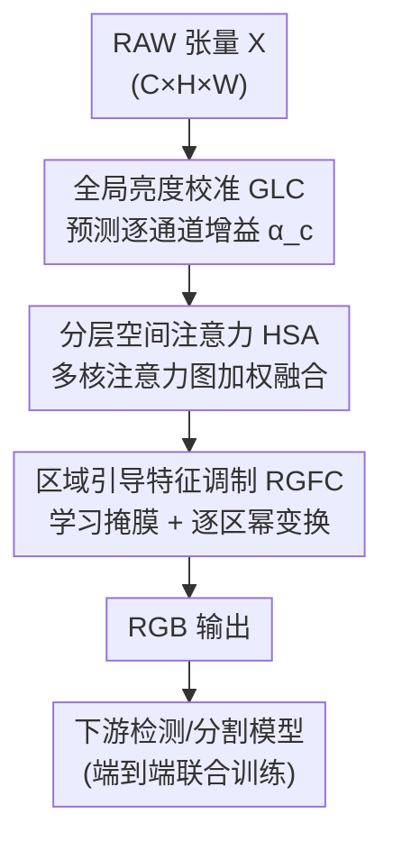

# Task-Aware Image Signal Processor for Advanced Visual Perception

**会议**: CVPR 2026  
**论文**: [CVF Open Access](https://openaccess.thecvf.com/content/CVPR2026/html/Chen_Task-Aware_Image_Signal_Processor_for_Advanced_Visual_Perception_CVPR_2026_paper.html)  
**代码**: https://github.com/CVL-UESTC/TA-ISP  
**领域**: 图像恢复 / ISP / RAW 视觉感知  
**关键词**: 任务感知ISP, RAW-to-RGB, 多粒度调制, 轻量化, 目标检测与分割

## 一句话总结
TA-ISP 把 RAW→RGB 这一步从"重网络/或只调几个传统 ISP 参数"换成"预测一小撮全局/区域/像素三级的调制算子"，用仅 3K 参数、亚 27ms 的代价产出对下游检测/分割友好的图像表示，在多个 RAW 检测/分割基准上同时刷高精度并大幅压参降时延。

## 研究背景与动机
**领域现状**：越来越多视觉任务直接用传感器的 RAW 数据而非低比特 RGB，因为 RAW 保留了更丰富的信息。要把 RAW 喂给预训练的检测/分割模型，中间需要一个 ISP（Image Signal Processor）做 RAW→RGB 转换。当前主流有两条路：① 用大网络端到端学 RAW→RGB 映射，并和下游模型联合优化（如 MW-ISPNet）；② 只微调传统 ISP 流水线里的少量参数 / 插入小 adapter（如 DIAP、RAW-Adapter）。

**现有痛点**：第一条路的网络又大又慢——ISP 本身是部署在端侧、对面积和功耗有严格约束的模块，挂一个动辄上千 GFLOPs 的网络（MW-ISPNet 1690 GFLOPs、延迟 2.4s）在终端设备上根本跑不动。第二条路虽然轻，但表达能力被传统 ISP 的设计空间钉死：只能调全局或逐通道参数，无法表达实际需要的"空间上逐区域变化"的复杂变换，一旦场景/任务超出原 ISP 设计空间就泛化失败。

**核心矛盾**：表达能力 vs 计算预算之间的硬 trade-off——想要够强的空间自适应变换，传统做法只能靠堆稠密卷积换来，而端侧 ISP 偏偏不允许堆算力。

**本文目标**：在严格的参数量/延迟/带宽约束下，产出"任务导向"（task-oriented）的 RAW→RGB 表示，且能表达空间上逐区域变化的丰富变换。

**切入角度**：作者的关键观察是——大部分算力其实没必要花在稠密卷积上。如果把"对图像做什么变换"和"在每个像素上具体施加多少"解耦开，让网络只去**预测一小组紧凑的调制算子**（per-channel 增益、注意力图、区域掩膜+权重），再把这些算子作用回图像，就能在几乎不耗算力的前提下，把空间可变变换的表达空间撑得很大。

**核心 idea**：用"预测多粒度调制算子"代替"稠密卷积式 ISP"，在全局、区域、像素三个尺度上分解式地重塑图像统计量，从而在低算力下获得强空间自适应性。

## 方法详解

### 整体框架
TA-ISP 是一条与下游视觉模型**端到端联合优化**的轻量 RAW→RGB 流水线。输入是打包后的 RAW 张量 $X \in \mathbb{R}^{C\times H\times W}$，输出是处理后的 RGB 图，直接喂给冻结/可训练的下游检测器或分割器。整条流水线由三个串行模块组成，分别在**全局→区域→像素**三个由粗到细的尺度上调整表示：先做全局亮度/色彩校准，再做多尺度空间注意力凸显信息量大的结构，最后做区域感知的逐区增强。三个模块的共同点是：网络主要算力都花在"预测一小撮调制参数"上，而不是稠密卷积，因此参数量低到 3K、延迟低到 26ms（3840×2160 输入）。

### 关键设计

**1. 全局亮度校准（GLC）：用逐通道增益拉开 RAW 的动态范围**

针对的痛点是：RAW 像素值往往挤在一个很窄的低强度区间，且传感器固有特性导致通道间曝光严重失衡，色彩响应偏置，直接喂给下游模型会限制特征学习。GLC 的做法非常轻：先对每个通道算全局均值方差 $\mu_c=\frac{1}{HW}\sum_{i,j}X_{c,i,j}$、$\sigma_c^2=\frac{1}{HW}\sum_{i,j}(X_{c,i,j}-\mu_c)^2$，把 $[\mu_c,\sigma_c^2]$ 拼起来过几层全连接，估出逐通道的乘性增益 $\alpha_c=\mathrm{Softplus}(F_g([\mu_c,\sigma_c^2]))+1$，再用 $X_g=\alpha_c\cdot X_c$ 校准。Softplus 保非负、常数 +1 强制 $\alpha_c>1$（只会提亮不会压暗）。它有效是因为：用一个标量增益就把"动态范围不足 + 通道曝光失衡"两件事一起修了，且增益是端到端学出来、面向下游任务优化的，几乎不耗算力。

**2. 分层空间注意力（HSA）：多尺度注意力凸显任务相关结构**

针对的痛点是：RAW 图里信息分布极不均匀——边缘/纹理这类结构信息量大，背景平坦区信息量小，而且这些结构尺寸不一（细节需局部上下文、大区域需更宽感受野）。一视同仁会削弱重要信号。HSA 先对 $X_g$ 沿通道做平均池化和最大池化、拼成 $M=[M_{avg};M_{max}]\in\mathbb{R}^{2\times H\times W}$，再分别送进多个不同核大小 $k$ 的卷积分支，得到不同感受野下的单通道注意力图 $A_k=\sigma(\mathrm{Conv}_k(M))$。融合时不是简单相加，而是用全局描述子 $d=G(X_g)$ 经 $1{\times}1$ 卷积 + softmax 算出每个分支的权重 $w_k$，最终 $A=\sum_k w_k A_k$，再逐元素相乘 $X_s=X_g\odot A$。它有效是因为：用"全局上下文决定该信哪个尺度的注意力"这种数据自适应加权，让网络对不同大小的结构都给到合适的感受野，同时整个过程只产出单通道注意力图、计算开销极小。

**3. 区域引导特征调制（RGFC）：让网络自己学空间分区并逐区增强**

针对的痛点是：全局/通道级调整无法表达"图像不同区域需要不同变换"这种空间可变需求，而手工划分区域又不灵活。RGFC 让网络**自己学出空间划分**：用一个卷积头 $F_m$ 产生 mask logits，经 Gumbel–Softmax $M=S_\tau(F_m(X_s),\tau)$ 得到 $K$ 组近似离散的空间掩膜（温度 $\tau=0.1$ 鼓励掩膜接近 one-hot），每个 $M_k$ 是一块学到的区域。再对每块区域估一个自适应标量权重 $w_k=F_w(P(F_m(X_s)))$（$P$ 为全局池化）。最终用一个**幂变换**逐区增强并聚合：

$$X_o=\sum_{k=1}^{K} M_k\cdot X_s^{1/w_k}.$$

它有效是因为：$X_s^{1/w_k}$ 这种逐区幂变换能对不同区域施加不同强度的非线性提升（$w_k$ 越大提升越强），而区域划分完全数据驱动、无需人工设计，于是在几乎不增算力的前提下实现了"细粒度、上下文感知"的空间可变变换——这正是传统参数微调 ISP 表达不出来的部分。

### 损失函数 / 训练策略
TA-ISP 不引入额外的图像质量重建损失，而是和下游视觉模型**端到端联合优化**，直接用下游任务损失（检测/分割）反传来指导三个模块的调制参数预测。检测实验用 RetinaNet（ResNet-18/50）和 YOLOX 系列、SGD、batch 4、约 35–50 epoch；分割用 Segformer（MiT-B0 backbone）、512×512 裁剪、80k 迭代。所有对比方法均从同一预训练下游模型初始化以保证公平。

## 实验关键数据

### 主实验
在 PASCAL RAW（白天）和 LOD（低光）检测数据集上，TA-ISP 在精度和效率两端同时领先（AP；FLOPs 按 640×640、延迟按 3840×2160 RAW 测）：

| 方法 | PASCAL R18 | PASCAL R50 | LOD R50 | 参数(M) | FLOPs(G) | 延迟(ms) |
|------|-----------|-----------|---------|---------|----------|----------|
| Demosaic | 87.7 | 89.2 | 58.5 | — | — | — |
| MW-ISPNet | 88.9 | 89.6 | 59.4 | 9.14 | 1690.54 | 2425.87 |
| InvISP | 85.4 | 87.6 | 56.9 | 1.06 | 433.30 | 1584.65 |
| DIAP | 88.5 | 89.7 | 59.5 | 0.08 | 0.23 | 79.70 |
| RAW-Adapter | 88.7 | 89.7 | 62.1 | 0.76 | 4.02 | 158.01 |
| **TA-ISP (本文)** | **89.9** | **90.2** | **63.9** | **0.003** | **0.20** | **26.43** |

亮点是 ResNet-18 版（89.9）就超过了别人 ResNet-50 版的成绩，且参数量比次轻的 DIAP 还少一个数量级（3K vs 80K），延迟仅 26ms（约为 RAW-Adapter 的 1/6）。在高动态范围、含白天/夜间的 ROD 数据集上同样领先：

| 方法 | Day AP | Day AP50 | Night AP | Night AP50 |
|------|--------|----------|----------|------------|
| Demosaic | 36.1 | 49.4 | 54.5 | 80.6 |
| DIAP | 36.2 | 49.9 | 58.5 | 84.3 |
| RAW-Adapter | 35.9 | 49.0 | 45.9 | 69.9 |
| **TA-ISP** | **38.0** | **51.6** | **59.7** | **84.8** |

值得注意的是 MW-ISPNet / InvISP / RAW-Adapter 在夜间 ROD 上大幅崩盘（Night AP 跌到 11.9–45.9），而 TA-ISP 维持 59.7，说明其空间可变变换对极端光照更鲁棒。语义分割（ADE20K 合成 RAW，mIOU）也是全场最高：normal 36.29 / dark 26.77，均超 RAW-Adapter（34.72 / 25.06）。

### 消融实验
逐模块叠加（ROD 白天 AP / LOD 夜间）验证三个模块各自有效：

| GLC | HSA | RGFC | ROD AP | LOD |
|-----|-----|------|--------|-----|
| – | – | – | 36.1 | 58.5 |
| ✓ | – | – | 36.3 (+0.2) | 60.4 (+1.9) |
| ✓ | ✓ | – | 36.8 (+0.7) | 63.0 (+4.5) |
| ✓ | ✓ | ✓ | 38.0 (+1.9) | 63.9 (+5.4) |

低光 LOD 上三个模块累计带来 +5.4 AP，且 HSA 这一档（+2.6）和 RGFC 这一档（+0.9）在白天 ROD 上贡献尤为明显——说明空间尺度上的注意力与逐区调制对"信息分布不均"的 RAW 帮助最大。

### 关键发现
- **效率与精度不再二选一**：以往强表达靠堆算力（MW-ISPNet 1690 GFLOPs），TA-ISP 用 0.20 GFLOPs 反而精度更高，核心在于"预测紧凑算子"而非稠密卷积。
- **数据效率突出**：PASCAL RAW 限训实验里，TA-ISP 只用 25%/50% 训练数据就超过对手用 50%/100% 数据的成绩，而多数 ISP 方法在数据稀缺时甚至跌破 demosaic 基线。
- **跨模型规模稳定**：换成更大的 YOLOX-L 联合训练时（ROD），TA-ISP（42.9 AP）仍稳居第一，说明增益不依赖特定下游模型容量。
- **三级粒度缺一不可**：去掉任一模块都掉点，低光场景对 HSA/RGFC 的依赖比白天更强。

## 亮点与洞察
- **"预测算子"而非"做卷积"的算力哲学**：把 ISP 的大部分计算从稠密像素变换转移到"预测一小组调制参数（增益/注意力/掩膜权重）"，是它能做到 3K 参数还表达力强的根本原因——这套"解耦变换内容与施加强度"的思路可迁移到任何对延迟敏感的图像预处理模块。
- **逐区幂变换 $X_s^{1/w_k}$ 是巧设计**：用一个可学标量指数实现逐区域、可强可弱的非线性增强，比"逐区域乘加"更适合修正 RAW 的曝光/对比差异，且形式极简。
- **Gumbel–Softmax 学软分区**：让网络数据驱动地发现该把图像切成哪几块、各自增强多少，避免了手工分区的僵硬，是把"空间可变"落地到轻量模块的关键一招。
- **全局→区域→像素的由粗到细分解**：三级粒度天然覆盖了"整图校准 / 大区域调整 / 细节修正"三类需求，结构清晰且各司其职。

## 局限与展望
- 论文未给出三个模块的具体超参（分支核大小集合 $\{k_1,k_2,\dots\}$、区域数 $K$）在不同数据集上的敏感性分析，$K$ 取值如何影响分区质量尚不清楚（⚠️ 以原文为准）。
- 评测集中在检测/分割两类感知任务，对深度估计、跟踪等其它 RAW 下游任务的迁移性未验证。
- 端到端联合训练意味着每换一个下游模型/任务都要重训 ISP，缺少"一次训练、多任务复用"的能力，这在多任务端侧部署时是个现实约束。
- 幂变换 $X_s^{1/w_k}$ 对 $X_s$ 取值范围敏感（负值/极小值下幂运算可能不稳定），论文未讨论数值稳定性处理（⚠️ 以原文为准）。

## 相关工作与启发
- **vs MW-ISPNet / InvISP（端到端学习型 ISP）**: 它们用大网络学完整 RAW→RGB 映射，表达力强但算力/延迟爆炸（>400 GFLOPs、秒级延迟），且在低光/HDR 场景反而崩盘；TA-ISP 用预测式紧凑算子把算力压到 0.2 GFLOPs 同时精度更高、更鲁棒。
- **vs DIAP / RAW-Adapter（参数微调型 ISP）**: 它们只调传统 ISP 的少量参数或插小 adapter，轻但表达力被原 ISP 设计空间钉死，只能做全局/逐通道调整、无法空间可变；TA-ISP 通过 HSA+RGFC 显式引入多尺度、逐区域的空间可变变换，泛化到未见场景更稳。
- **启发**: "把重计算换成预测一小组作用算子"这一范式，本质是在网络里做了一次"参数高效的函数族参数化"，对所有需要空间自适应但又受算力约束的低层视觉任务（去噪、增强、HDR 重建）都值得借鉴。

## 评分
- 新颖性: ⭐⭐⭐⭐ 把多粒度调制算子预测引入任务感知 ISP，全局/区域/像素三级分解 + 逐区幂变换是有辨识度的组合，但每个组件单看都是已知技术的精巧拼装。
- 实验充分度: ⭐⭐⭐⭐⭐ 覆盖 3 个检测 + 1 个分割数据集、白天/夜间/HDR/限训/多模型规模，消融与效率对比都到位。
- 写作质量: ⭐⭐⭐⭐ 动机与方法叙述清晰，公式完整；部分超参与数值稳定性细节略缺。
- 价值: ⭐⭐⭐⭐⭐ 3K 参数 + 26ms 还刷 SOTA，对端侧 RAW 感知部署有很强实用价值。

<!-- RELATED:START -->

## 相关论文

- [\[CVPR 2026\] Bridging the Perception Gap in Image Super-Resolution Evaluation](bridging_the_perception_gap_in_image_super-resolution_evaluation.md)
- [\[CVPR 2026\] BiEvLight: Bi-level Learning of Task-Aware Event Refinement for Low-Light Image Enhancement](bievlight_bi-level_learning_of_task-aware_event_refinement_for_low-light_image_e.md)
- [\[CVPR 2026\] Customized Fusion: A Closed-Loop Dynamic Network for Adaptive Multi-Task-Aware Infrared-Visible Image Fusion](customized_fusion_a_closed-loop_dynamic_network_for_adaptive_multi-task-aware_in.md)
- [\[CVPR 2026\] Towards Generalized Representations for Low-Light Understanding: When Signal Constancy Meets Semantic Enrichment](towards_generalized_representations_for_low-light_understanding_when_signal_cons.md)
- [\[CVPR 2026\] Blink: Dynamic Visual Token Resolution for Enhanced Multimodal Understanding](blink_dynamic_visual_token_resolution_for_enhanced_multimodal_understanding.md)

<!-- RELATED:END -->
