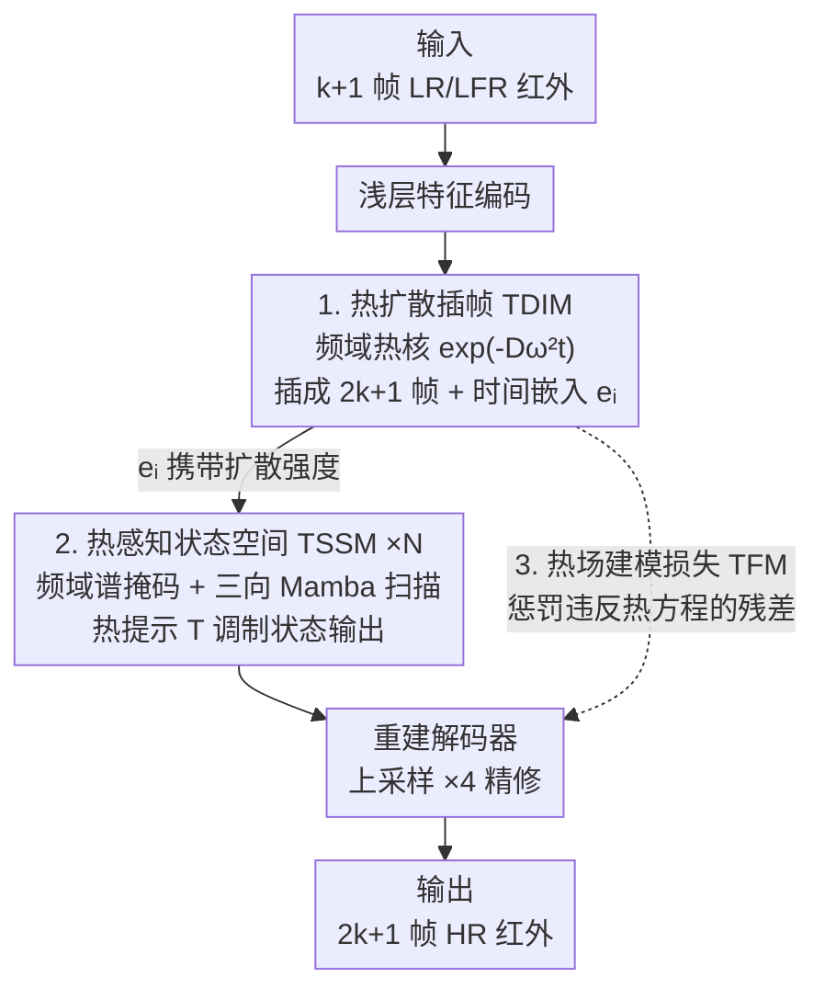

# Thermal Diffusion Matters: Infrared Spatial-Temporal Video Super-Resolution through Heat Conduction Priors

**会议**: CVPR 2026  
**论文**: [CVF Open Access](https://openaccess.thecvf.com/content/CVPR2026/html/Zhou_Thermal_Diffusion_Matters_Infrared_Spatial-Temporal_Video_Super-Resolution_through_Heat_Conduction_CVPR_2026_paper.html)  
**代码**: 无  
**领域**: 视频超分辨率 / 图像恢复  
**关键词**: 红外视频, 时空超分辨率, 热传导先验, 状态空间模型, 频域扩散

## 一句话总结
THERIS 把红外视频的逐像素灰度序列当成满足热传导方程的温度场，用频域热扩散核做帧插值（TDIM）、用带"热提示"调制的 Mamba 模块做时空细节恢复（TSSM），再加一个强制满足离散热方程的损失（TFM Loss），在红外时空视频超分上拿到 SOTA。

## 研究背景与动机
**领域现状**：红外（TIR）成像受传感器物理限制，普遍是低空间分辨率（LR）+ 低帧率（LFR）。要同时把空间细节和时间连续性补回来，对应的任务是时空视频超分（STVSR）——它把视频超分（VSR，聚合相邻帧补空间细节）和帧插值（VFI，建模运动轨迹补时间分辨率）合成一个统一任务，代表工作有 ZoomingSlowMo、TMNet，以及连续尺度的 VideoINR、MoTIF、BF-STVSR。

**现有痛点**：几乎所有 STVSR 方法都是为可见光视频设计的，直接搬到红外上效果明显变差——论文实测当时可见光 SOTA 的 BF-STVSR 在红外数据上只是次优。原因是红外图像编码的是物体表面发出的热辐射，而非可见光纹理；用纯视觉模式训练的网络生成的帧"看起来合理"，却违背底层的热物理一致性，时间剖面（temporal profile）上会出现抖动和结构断裂。

**核心矛盾**：红外像素灰度和表面温度是一一对应的（辐射强度↔灰度），所以灰度随时间的演化本质上就是温度场的演化，受热传导方程支配。但现有方法完全没利用这个物理约束，把红外当普通灰度视频处理，于是模型没有任何机制保证生成帧之间的"热量变化"是物理上说得通的。

**本文目标 + 切入角度**：作者的观察是——既然红外视频的时空演化天然遵循热传导动力学，那就不该让网络从零去学一个时空映射，而应该把热传导先验直接嵌进网络。具体拆成三件事：插帧要符合热扩散的频率衰减规律、细节恢复要被同一套扩散强度约束、训练目标要显式惩罚违反热方程的输出。

**核心 idea**：把特征序列在时间轴上看成一维热场，用"频域热扩散核 $\exp(-D\omega^2 t)$"来插帧并贯穿整个 pipeline，让超分过程物理一致。

## 方法详解

### 整体框架
THERIS 是端到端 pipeline。输入是 $k+1$ 帧 LR+LFR 红外视频 $\{I^L_{2t-1}\}_{t=1}^{k+1}$（尺寸 $H\times W\times C$），输出是 $2k+1$ 帧 HR 视频 $\{I^H_t\}_{t=1}^{2k+1}$（尺寸 $4H\times 4W\times C$，即空间 ×4、时间 ×2）；其中奇数时刻的输出帧才有 LR 对应帧，偶数时刻是新插出来的。

整条链路四步走：① 浅层特征编码器逐帧抽特征；② **TDIM** 把 $k+1$ 个输入时刻在频域用热扩散核插成 $2k+1$ 个时间对齐的特征图，同时为每个输出时刻产出一个可学习的时间嵌入 $e_i$；③ 一串 **TSSM** 在 TDIM 的特征上做频域增强 + 选择性状态空间扫描，并被 TDIM 传来的 $e_i$（携带扩散强度信息）调制，恢复高频纹理同时保持全局时间一致性；④ 重建解码器上采样并精修成最终 HR 帧。训练时额外用 **TFM Loss** 把热方程约束打进监督信号。关键在于 TDIM 学到的"扩散强度/时间嵌入"会一路传给 TSSM，让插帧和细节恢复共享同一套物理先验，形成紧耦合。

### 关键设计

**1. TDIM 热扩散插帧模块：把帧序列当一维热场，在频域按热核衰减插帧**

针对"现有插帧不符合热物理、生成的中间帧时间不连贯"的痛点。一维热传导方程 $\frac{\partial u(x,t)}{\partial t}=D\frac{\partial^2 u(x,t)}{\partial x^2}$ 经空间傅里叶变换后，每个频率分量解耦成 $\tilde u(\omega,t)=\tilde f(\omega)\exp(-D\omega^2 t)$——高频分量随时间指数衰减得更快，这正是热扩散"棱角先被磨平"的数学刻画。作者的巧思是把 $k+1$ 帧视频特征当成沿"空间轴" $x=0,\dots,k$ 的采样（令 $X=k+1$），于是插帧就变成在这条轴上求热方程的解。

具体做法：对输入特征沿时间轴做离散余弦变换（DCT，作为热方程本征函数的离散形式）得到谱系数 $\hat F_n$；每个目标插值时刻 $\tau_i$ 先过轻量网络 $\Theta$ 得到可学习时间嵌入 $e_i$，再经 MLP 映成衰减系数 $\kappa(n;e_i)$（Softplus 保证 $\geq 0$，物理上即"频率越高衰减越快"）；据此构造离散热扩散核

$$W(n,e_i)=\exp\!\big(-\kappa(n;e_i)\,\omega_n^2\,\Delta t\big),\quad \omega_n=\frac{n\pi}{k+1}.$$

把 $\hat F_n$ 乘上 $W(n,e_i)$ 后做逆 DCT，让 $t$ 跑遍 $[1,2k+1]$ 就一次性得到所有（含新插的偶数时刻）特征。区别于 VideoINR 用隐式坐标映射、MoTIF 用光流前向 warp，TDIM 不学运动而学"热扩散动力学"，插出来的帧天然满足频率衰减规律，所以时间剖面更平滑。

**2. TSSM 热感知状态空间模块：频域补高频 + 三向 Mamba 扫描，用热提示同步物理时序**

针对"光靠堆扩散层无法刻画红外视频完整时空复杂度，且红外高频严重衰减"的痛点。每个 TSSM 先把特征 FFT 到频域，用一个可学习谱掩码 $W$ 选择性增强被压制的高频分量，再 IFFT 回空域——因为红外传感器导致高频信息大量丢失（论文在 LR 上用高通滤波验证了这点），这步专门把对比度和细节的高频找回来。之后接多个选择性状态空间块（Mamba 思路）：用空间优先（SMB）、时间优先（TMB）、希尔伯特曲线局部扫描（HMB）三种扫描顺序交错，兼顾全局连通性和展平后的局部性。Mamba 离散状态方程为 $h_t=\bar A h_{t-1}+\bar B x_t,\ y_t=Ch_t+Dx_t$。

关键创新是"热提示"：经典 Mamba 固定的输出映射矩阵 $C$ 会强制严格因果、局部受限的扫描，单次前向无法做非因果/全局融合。作者把 TDIM 的时间嵌入 $e_i$（编码了每个频率分量在分数时刻怎么扩散）经适配器 $\Psi$ 变成热提示 $T$，去调制输出映射：

$$h_t=\bar A h_{t-1}+\bar B x_t,\qquad y_t=(C+T)h_t+D x_t.$$

这样 TSSM 的潜在动力学就和 TDIM 的物理插值时刻表、频率扩散强度同步，二者共享同一套扩散提示、形成物理一致的紧耦合 pipeline。

**3. TFM 热场建模损失：把离散热方程残差当物理正则，强制相邻帧热量变化合规**

针对"纯 L1 像素损失不约束帧间热量演化、导致时间不稳"的痛点。作者把一维热方程扩到二维 $\frac{\partial u}{\partial t}=D\nabla^2 u$，其中热扩散系数 $D$ 用经验值初始化并随训练自适应。对预测序列，时间导数用中心差分 $\frac{\tilde I^H_{t+1}-\tilde I^H_{t-1}}{2\Delta t}$ 估计，空间拉普拉斯用 5 点卷积模板近似，于是每个时空点的物理残差为

$$r(x,y,t)=\frac{\tilde I^H_{t+1}-\tilde I^H_{t-1}}{2\Delta t}-D\nabla^2 u(x,y,t).$$

残差越大说明越违反热方程。再乘一个边缘感知权重 $w_{x,y,t}=\exp(-\alpha|\nabla I^H_t(x,y)|^2)$：高梯度（边缘）区抑制扩散正则、平滑区鼓励热演化，避免把锐利边缘也强行抹平。总损失是加权 L1 残差 $L_{TFM}$，最终目标 $L=L_1+\lambda L_{TFM}$ 把物理约束和像素重建一起优化。

## 实验关键数据

### 主实验
任务为空间 ×4、时间 ×2 超分；训练/评测主用自建 IRVAL，并在 LLVIP（街景行人）、SGMP（海上船只）上验证。指标含全参考的 PSNR/SSIM 与无参考感知质量 MUSIQ/DOVER。

| 数据集 | 方法 | PSNR↑ | SSIM↑ | MUSIQ↑ | DOVER↑ |
|--------|------|-------|-------|--------|--------|
| IRVAL | DAIN+RealBasicVSR | 20.47 | 0.7177 | 53.00 | 0.2844 |
| IRVAL | TMNet | 19.78 | 0.7684 | 50.98 | 0.2588 |
| IRVAL | BF-STVSR（可见光 SOTA） | 20.18 | 0.7634 | 45.41 | 0.1636 |
| IRVAL | **THERIS** | **21.37** | **0.7872** | **55.59** | **0.2990** |

THERIS 在 IRVAL 全部四个指标上均最优；可见光 SOTA 的 BF-STVSR 在红外上 PSNR 仅 20.18、感知指标更是大幅落后，印证了红外域的特殊性。在 LLVIP / SGMP 上同样领先：

| 数据集 | 方法 | PSNR↑ | SSIM↑ |
|--------|------|-------|-------|
| LLVIP | TMNet | 27.51 | 0.9141 |
| LLVIP | **THERIS** | **28.05** | **0.9177** |
| SGMP | TMNet | 37.54 | 0.9474 |
| SGMP | **THERIS** | **37.83** | **0.9517** |

### 消融实验
在 IRVAL 上逐个去掉三个核心组件（Table 3）：

| 配置 | PSNR↑ | SSIM↑ | MUSIQ↑ | 说明 |
|------|-------|-------|--------|------|
| w/o 谱掩码 | 19.86 | 0.7674 | 49.89 | 去掉频域高频增强，掉点最狠（PSNR −1.51） |
| w/o 热提示（TSSM） | 20.54 | 0.7759 | 48.31 | TSSM 退回固定 $C$，时序与插值表错位、抖动 |
| w/o TFM Loss | 20.81 | 0.7702 | 53.99 | 只用 L1，缺物理约束，时间一致性变差 |
| Full（THERIS） | **21.37** | **0.7872** | **55.59** | 完整模型 |

下游红外目标检测（LLVIP，YOLO，mAP@0.5:0.95）进一步验证 SR 质量对实用性的影响：

| 方法 | Upsampled LR | VideoINR | MoTIF | BF-STVSR | THERIS |
|------|------|------|------|------|------|
| mAP | 43.8 | 45.8 | 45.5 | 47.4 | **50.7** |

### 关键发现
- 三个组件里**谱掩码贡献最大**：去掉它 PSNR 从 21.37 掉到 19.86，说明红外超分的瓶颈很大程度在"高频找回"，频域选择性增强是刚需。
- 另一个消融可视化显示，**TDIM 单独**（去掉 TSSM）也能插出兼具空间细节和时间一致性的中间帧，证明热扩散插帧本身就是一个强初始化。
- SR 质量直接转化为下游收益：THERIS 让红外行人检测 mAP 从 LR 的 43.8 提到 50.7（+6.9），明显超过其他 STVSR。

## 亮点与洞察
- **把物理方程"翻译"成网络算子**：热方程在频域解耦成 $\exp(-D\omega^2 t)$ 这一形式，被直接做成可学习扩散核插帧——不是软约束、而是把物理解析解嵌进前向计算，这种"解析解即算子"的思路可迁移到任何有 PDE 先验的信号（如流体、扩散过程视频）。
- **用一个共享嵌入把插帧和恢复绑成物理一致 pipeline**：TDIM 的时间嵌入 $e_i$ 既驱动插帧的频率衰减、又经热提示 $T$ 调制 TSSM 的状态输出，避免了"插帧和细化各学各的、互相打架"。这种"物理先验贯穿多模块"的耦合方式很值得借鉴。
- **配套放出 IRVAL 数据集**：108,512 帧、512×512 的 LWIR 红外视频，车载 + 固定监控多场景，填补了红外视频超分公开数据稀缺的空白，对后续研究价值不小。

## 局限与展望
- 物理先验假设红外灰度与温度严格一一对应、且热扩散是主导动力学；对存在强外部热源突变、运动物体边界剧烈热交换的场景，热方程近似是否依然成立 ⚠️（论文未深入讨论这类极端情形）。
- TFM Loss 里热扩散系数 $D$ 用经验值初始化后自适应，但论文未给出 $D$、$\lambda$、边缘权重 $\alpha$ 的敏感性分析，调参鲁棒性不明。
- 方法专为红外的热物理设计，迁回可见光视频未必有优势——它的强项恰恰来自红外特有的"灰度=温度"假设，这既是亮点也是适用范围的边界。
- 主实验仅在 ×4 空间 / ×2 时间一个设定下评测，更大上采样倍率（如 ×8 或任意连续尺度）下的表现还需验证。

## 相关工作与启发
- **vs BF-STVSR / VideoINR / MoTIF（可见光 STVSR）**：它们分别用 B 样条+傅里叶映射、隐式神经表示、光流 warp 来做连续时空插值，本质是数据驱动的运动/坐标建模；THERIS 改用热传导物理先验，区别在于"插帧依据"从运动轨迹换成了热扩散动力学。在红外上 THERIS 明显占优（IRVAL PSNR 21.37 vs BF-STVSR 20.18），但在可见光上谁更强论文未直接比，理论上热先验在可见光不一定适用。
- **vs DifIISR（红外图像 SR）**：DifIISR 把视觉/感知梯度先验注入扩散模型做单图红外 SR，THERIS 则面向视频、强调时空联合与热物理一致，且不靠生成式扩散模型而靠解析热核 + Mamba，计算上更轻。
- **vs 纯 Mamba 低层视觉方法**：常规 Mamba 用固定输出矩阵 $C$、扫描严格因果局部；THERIS 用热提示 $T$ 把 $C$ 改成 $C+T$，让状态演化跟物理时刻表对齐，这种"用外部物理量调制 SSM 状态输出"的做法是对 Mamba 的一个有意思的改造。

## 评分
- 新颖性: ⭐⭐⭐⭐⭐ 把热传导解析解做成频域插帧核 + 热提示调制 Mamba，物理先验贯穿全 pipeline，角度很新
- 实验充分度: ⭐⭐⭐⭐ 三数据集 + 消融 + 下游检测较完整，但缺超参敏感性与多倍率设定
- 写作质量: ⭐⭐⭐⭐ 物理推导清晰、动机连贯；部分公式细节需对照原文
- 价值: ⭐⭐⭐⭐ 红外视频超分 SOTA + 放出 IRVAL 数据集，对该方向有实际推动

<!-- RELATED:START -->

## 相关论文

- [\[CVPR 2026\] Disentangled Textual Priors for Diffusion-based Image Super-Resolution](disentangled_textual_priors_for_diffusion-based_image_super-resolution.md)
- [\[AAAI 2026\] Temporal Inconsistency Guidance for Super-resolution Video Quality Assessment](../../AAAI2026/image_restoration/temporal_inconsistency_guidance_for_super-resolution_video_quality_assessment.md)
- [\[CVPR 2026\] PS-SR: Pseudo-Single-Step Video Super-Resolution via Speculative Diffusion](ps-sr_pseudo-single-step_video_super-resolution_via_speculative_diffusion.md)
- [\[CVPR 2026\] Time Without Time: Pseudo-Temporal Representation for Space-Time Super-Resolution](time_without_time_pseudo-temporal_representation_for_space-time_super-resolution.md)
- [\[CVPR 2026\] Rethinking Diffusion Model-Based Video Super-Resolution: Leveraging Dense Guidance from Aligned Features](rethinking_diffusion_model-based_video_super-resolution_leveraging_dense_guidanc.md)

<!-- RELATED:END -->
