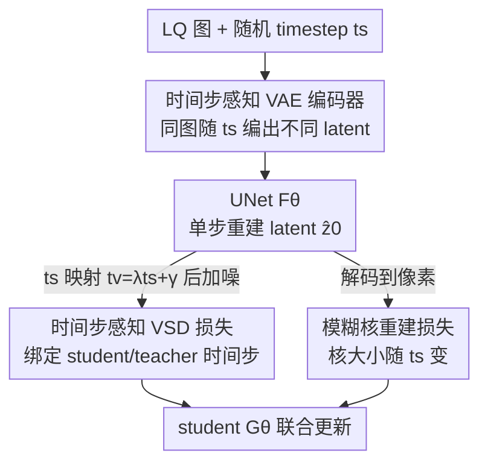

# Time-Aware One Step Diffusion Network for Real-World Image Super-Resolution

**会议**: CVPR 2026  
**论文**: [CVF Open Access](https://openaccess.thecvf.com/content/CVPR2026/html/Zhang_Time-Aware_One_Step_Diffusion_Network_for_Real-World_Image_Super-Resolution_CVPR_2026_paper.html)  
**代码**: https://github.com/zty557/TADSR  
**领域**: 图像恢复 / 扩散模型  
**关键词**: 真实世界超分, 单步扩散, 变分分数蒸馏, 时间步感知, 保真度-真实感权衡

## 一句话总结
TADSR 指出现有单步扩散超分都把 student 的 timestep 写死在 999，白白浪费了 SD 在不同时间步上各异的生成先验；它给 VAE encoder 加时间嵌入、让同一张图随 timestep 编出不同 latent，再用一个映射把 student 和 teacher 的 timestep 绑起来，从而单步就能拿到一致的生成引导，并且只靠调一个 $t_s$ 就能在保真度和真实感之间无级滑动，多个真实/合成数据集上无参考指标全面 SOTA。

## 研究背景与动机

**领域现状**：真实世界图像超分（Real-ISR）要从经历了复杂未知退化的低质图里恢复高清图。近两年主流是借用预训练 Stable Diffusion（SD）的生成先验，但多步去噪太慢，于是 OSEDiff、S3Diff、PisaSR、AdcSR、TSDSR 这一批工作走「蒸馏成单步」的路线：把 SD 加可训练 LoRA 当 student，固定权重的 SD 当 teacher，用变分分数蒸馏（VSD）损失把 teacher 的生成能力压进一步出图。

**现有痛点**：这些单步方法有个共同的固定动作——把 student 的 timestep 钉死在一个固定值（如 999），同时 teacher 的 timestep 又是完全随机采样的。论文用一组观察（Fig. 1b）说明这有多浪费：把同一张图喂给 SD，$t=100$ 时几乎保留全部信息、teacher 只在纹理细节上微调；$t=300$ 时 teacher 开始动用生成先验补被噪声盖住的内容；$t=600$ 时图像信息大量丢失、teacher 只能恢复大致结构和颜色。也就是说 **SD 在不同 timestep 上的生成先验本质不同**，固定一个 timestep 等于只用了其中一段。

**核心矛盾**：固定 student timestep → 用不上 SD 在各 timestep 上的差异化先验；随机 teacher timestep → 引导信号忽大忽小、方向相互打架（小 $t$ 引导纹理、大 $t$ 引导语义），给 student 的优化信号是矛盾的，收敛到次优。表现出来就是像 PisaSR 那样想加真实感、调大语义权重 $\lambda_{sem}$，结果只是更锐利而不是语义更丰富。

**核心 idea**：让单步模型也「感知时间步」——既要让 student 接收随机采样的 timestep，又要让喂进去的 latent 随 timestep 变化（模拟 SD 里噪声水平的改变）。为此一边改 encoder（同图随 timestep 编出不同 latent），一边改蒸馏损失（把 student 的 $t_s$ 和 teacher 的 $t_v$ 用映射函数绑定），从而单步就吃透不同 timestep 的生成先验，还顺带白送一个「调 timestep 即调真实感」的可控旋钮。

## 方法详解

### 整体框架

TADSR 训练一个单步 student 模型 $G_\theta$，它由两个可训练部件组成：**时间步感知 VAE 编码器** $E_\theta$（TAE）和一个挂了 LoRA 的扩散 UNet $F_\theta$。teacher 是冻结的预训练 SD $\epsilon_\psi$，再复制一份挂 LoRA 得到 LoRA 模型 $\epsilon_\phi$ 用来估计「假分布」的分数。

一次训练的数据流是这样转的：从数据集取一对 HQ-LQ 图，并从 $[0, 999]$ 均匀采一个 $t_s$；把 LQ 图和 $t_s$ 一起喂进 student，$E_\theta(x_L, t_s)$ 得到随时间步变化的 LQ latent，再过 $F_\theta$ 得到重建 latent $\hat z_0$。$\hat z_0$ 解码回像素空间和 HQ 算重建损失（蓝色流）。在 latent 空间，把 $t_s$ 经映射函数变成另一个 timestep $t_v$，按 $t_v$ 给 $\hat z_0$ 加噪得到 $\hat z_{t_v}$，再把 $\hat z_{t_v}$ 和 $t_v$ 同时喂给 teacher 和 LoRA 模型，算时间步感知 VSD 损失（橙色流）来提真实感。LoRA 模型本身则用 student 产出的数据、以标准扩散损失训练（绿色流）。三条流共同把 student 推向「单步出真实图、且真实感随 $t_s$ 可调」。

### 关键设计

**1. 时间步感知 VAE 编码器（TAE）：让同一张图随 timestep 编出不同 latent**

直接的改法是训练时随机采 timestep，但有个隐藏障碍：原始 VAE encoder 对同一张图永远只映射到同一个 latent 分布，跟 timestep 无关。这样即使 UNet 收到了不同的 timestep，输入 latent 却一模一样，它很难仅凭 timestep 就激活不同的生成先验。而另一个看似自然的做法——按 timestep 直接往 latent 注高斯噪——又会破坏重建保真度，不可取。

TADSR 的做法是在 VAE encoder 里插入一个时间嵌入层，把输入图编码成**随 $t_s$ 变化的 latent 分布**：$z_L = E_\theta(x_L, t_s)$，$\hat z = F_\theta(z_L, t_s)$（公式 4）。这样 $t_s$ 和 latent 分布同步变化，复刻了 SD 里「timestep 改变 ↔ 噪声水平改变」的特性，从而让单步网络也能按 timestep 激活对应的生成先验。论文用 PCA 可视化验证（Fig. 3）：随 $t_s$ 增大，同一张图被 TAE 编出的 latent 特征其均值和标准差都呈下降趋势，latent 空间确实在随时间步变化，而不是注噪那种粗暴扰动。

**2. 时间步感知变分分数蒸馏损失（TAVSD）：把 student 和 teacher 的时间步绑起来，消除矛盾引导**

光让 student 感知时间步还不够——蒸馏端 teacher 的 timestep 仍是独立随机采的，引导依旧不一致。论文先把标准 VSD 的引导拆开看：由于 stop-gradient，VSD 的引导可解读为 teacher 与 LoRA 两个模型预测 latent 图之差的残差。把这残差解码到像素空间分析（Fig. 4）发现：$t_v=100$ 时两者输出相似、梯度主要补纹理细节；$t_v=300$ 时 teacher 含明显更多语义而 LoRA 仍平滑，梯度反映全局语义引导；$t_v=600$ 时 teacher 只能从噪声里恢复粗糙颜色结构，几乎给不出有意义引导。不同 $t_v$ 给同一张图的引导方向相反，叠在一起就是互相冲突的优化信号。

TAVSD 的关键是在 student 的 $t_s$ 和 teacher 的 $t_v$ 之间建一个线性映射：

$$t_v = \lambda t_s + \gamma, \quad t_s \in [0, 999],\ t_v \in [0, 999]$$

（公式 5，论文取 $\lambda=0.5,\ \gamma=0$）。随机采的 $t_s$ 喂 student 得 $\hat z = G_\theta(x_L, t_s)$，按 $t_v$ 给 $\hat z$ 加噪成 $\hat z_{t_v} = \alpha_{t_v}\hat z + \beta_{t_v}\epsilon$，再连同 $t_v$ 一起喂 teacher 和 LoRA 算损失：

$$\nabla_\theta L_{TAVSD}(\hat z, c, t_v) = \mathbb{E}_\epsilon\!\left[\omega(t_v)\big(\epsilon_\psi(\hat z_{t_v}; t_v, c) - \epsilon_\phi(\hat z_{t_v}; t_v, c)\big)\frac{\partial \hat z}{\partial \theta}\right]$$

（公式 6）。这样一来：student 用大 $t_s$ 时，teacher 收到的是加了更强噪声的 latent，引导偏向更强的语义生成；用小 $t_s$ 时引导更接近重建、主要增强纹理。引导方向不再随机打架，而是**始终条件于 $t_s$、保持一致**，蒸馏才真正吃透了 teacher 在各时间步的先验。这一条同时解释了「为什么 VSD 能让图更真实而不过度平滑」——LoRA 模型在 student 生成的低质数据上训练且不用 CFG，输出天然比 teacher 更平滑，二者残差自然提供的是高频细节引导。

**3. 时间步自适应的模糊核重建损失：随 $t_s$ 放大模糊核，腾出真实感空间**

Real-ISR 是病态问题，如果直接对全频带做 MSE 监督，会和 TAVSD 想补的高频生成内容打架。论文的处理是：算 MSE 前先对重建图和 HQ 图都做高斯模糊，让 HQ 只监督低频内容、把高频留给生成端：

$$L_{MSE}^{blur} = L_{MSE}\big(G_\theta(x_L) * G_{t_s},\ x_H * G_{t_s}\big)$$

（公式 7，$*$ 为卷积，$G_{t_s}$ 是核大小由 $t_s$ 决定的高斯核）。$t_s$ 越大用越大的模糊核——这正好和 TAVSD 的逻辑配套：大 $t_s$ 时希望更强生成，那就放宽低频监督；小 $t_s$ 时核小、保真度约束强。它和 LPIPS 共同构成重建损失 $L_{Rec} = L_{MSE}^{blur} + L_{LPIPS}(G_\theta(x_L), x_H)$（公式 8），是 TADSR「调 $t_s$ 即调保真度-真实感」这一可控特性在重建端的支撑。

### 损失函数 / 训练策略

student 总损失为重建损失加 TAVSD 正则：$L_{Stu} = L_{Rec} + \lambda_{TAVSD}\cdot L_{TAVSD}$（公式 9）。LoRA 模型单独用标准扩散损失 $L_{Diff}(\hat z, c_y) = \mathbb{E}_{t,\epsilon}\big[\lVert \epsilon_\phi(\hat z_t; t, c_y) - \epsilon'\rVert^2\big]$ 训练（公式 10），$\epsilon'$ 是随机采的高斯噪声目标。训练数据用 LSDIR、$512\times512$ patch，按 Real-ESRGAN 退化管线造 HQ-LQ 对；AdamW、学习率 $5\times10^{-5}$、LoRA rank=4，base 模型为 SD 2.1-base，8 张 A40、batch 24 只微调 2k 步；文本提示用 DAPE 模块抽取。

## 实验关键数据

### 主实验

在 4 个数据集（合成 DIV2K-Val + 真实 DRealSR / RealSR / RealLR200）上对比 9 个 SOTA（含多步的 StableSR/DiffBIR/SeeSR 与单步的 SinSR/OSEDiff/S3Diff/PisaSR/TSDSR/AdcSR）。推理时设 $t_s=500$。下表摘取最能说明问题的无参考质量指标（值越大越好）：

| 数据集 | 指标 | OSEDiff | PisaSR | AdcSR | TADSR |
|--------|------|---------|--------|-------|-------|
| DIV2K-Val | CLIPIQA ↑ | 0.6682 | 0.6928 | 0.6763 | **0.7353** |
| DIV2K-Val | TOPIQ ↑ | 0.6188 | 0.6619 | 0.6526 | **0.7044** |
| DIV2K-Val | QALIGN ↑ | 3.8357 | 3.8812 | 3.612 | **4.0783** |
| DRealSR | CLIPIQA ↑ | 0.6974 | 0.6971 | 0.7049 | **0.7398** |
| DRealSR | QALIGN ↑ | 3.5450 | 3.5838 | 3.6520 | **3.7491** |
| RealSR | MUSIQ ↑ | 69.087 | 70.147 | 69.899 | **71.182** |
| RealLR200 | CLIPIQA ↑ | 0.6792 | 0.7153 | 0.7048 | **0.7741** |
| RealLR200 | TOPIQ ↑ | 0.5990 | 0.6627 | 0.6684 | **0.7249** |

TADSR 在 4 个数据集的无参考指标上几乎全部第一（唯一例外是 DIV2K-Val 上的 MUSIQ），是**唯一在所有无参考指标上稳定超过多步方法的单步方法**；同时 PSNR/SSIM 这些保真度指标与其他单步方法持平（如 DRealSR PSNR 28.387 ≈ 各家），说明真实感的提升没有牺牲保真度。

### 消融实验

baseline = 原始 VAE encoder + 原始 VSD（但同样随机采 timestep），逐个加回 TAE 与 TAVSD：

| 数据集 | 配置 | PSNR↑ | MUSIQ↑ | CLIPIQA↑ | TOPIQ↑ |
|--------|------|-------|--------|----------|--------|
| RealSR | Baseline | 24.39 | 70.22 | 0.6751 | 0.6391 |
| RealSR | w/o TAE | 24.89 | 70.08 | 0.6857 | 0.6466 |
| RealSR | w/o TAVSD | 24.84 | 70.96 | 0.6930 | 0.6553 |
| RealSR | Full | **25.16** | **71.18** | **0.7283** | **0.7082** |
| DRealSR | Baseline | 27.45 | 65.90 | 0.6887 | 0.6275 |
| DRealSR | w/o TAE | 27.95 | 65.95 | 0.7030 | 0.6396 |
| DRealSR | w/o TAVSD | 28.03 | 66.95 | 0.7015 | 0.6373 |
| DRealSR | Full | **28.39** | **67.02** | **0.7398** | **0.6758** |

### 关键发现

- **baseline 单靠随机采 timestep 不灵**：即便 baseline 也随机采 timestep，但去掉 TAE 后参考/无参考指标双双下降，说明「latent 分布随时间步自适应」才是用上 SD 各时间步先验的关键，单纯随机采没意义。
- **TAVSD 主要提真实感**：去掉 TAVSD 后 CLIPIQA/TOPIQ 这类语义质量指标明显下滑（RealSR TOPIQ 0.7082→0.6553），印证「一致的 teacher 引导能更好激活跨时间步的生成先验」。baseline 在 PSNR 上掉得最狠（DRealSR 27.45 vs Full 28.39），可视化里甚至出现明显伪影。
- **$t_s$ 就是保真度-真实感旋钮**：在 DRealSR 上随 $t_s$ 增大，PSNR 下降、QALIGN 上升，呈清晰 trade-off。$t_s=200$ 时 PSNR 26.61dB（比 SinSR 高 1dB 多）且 QALIGN 远超 SinSR；而 PisaSR 调到 PSNR 29.60dB 时 QALIGN 只有 2.91（和 SinSR 相当）——说明 TADSR 在大幅提保真度时只付出极小真实感代价，始终位于 trade-off 曲线右上角。

## 亮点与洞察

- **把「timestep 浪费」这个被忽略的点讲透了**：单步方法默认 timestep 不重要（反正不迭代），TADSR 用 Fig.1b/Fig.4 的解码可视化实证 SD 在不同 timestep 先验本质不同，并据此把它从「无用超参」变成「可控旋钮」，问题动机非常具体。
- **encoder 和 loss 双管齐下、互为前提**：只改 encoder（TAE）让 latent 随时间步变、只改 loss（TAVSD）绑 student/teacher timestep，单独哪个都不够；两者一个负责「输入端能区分时间步」、一个负责「监督端引导一致」，配合起来才闭环——这种「输入侧 + 监督侧成对改」的思路可迁移到其他蒸馏/单步生成任务。
- **VSD = teacher-LoRA 残差** 的解读很有用：把 VSD 梯度解读成两模型预测图之差，顺手解释了「为何 VSD 能提真实感又不过度平滑」（LoRA 不用 CFG 故更平滑，残差即高频），是个可复用的分析视角。
- **模糊核随 $t_s$ 放大** 这个 trick 简单却关键：用「按 timestep 调低频监督强度」把重建损失和生成损失从对抗变成配合，给可控 trade-off 提供了重建端支撑。

## 局限与展望

- 论文未给出推理延迟/FLOPs 的硬数据，只声称「与 OSEDiff 同参数量」，单步效率优势缺定量佐证 ⚠️（以原文为准）。
- $t_v = \lambda t_s + \gamma$ 是手设的线性映射，$\lambda=0.5,\gamma=0$ 看起来是经验值，是否最优、对不同退化/数据集是否稳健没有充分敏感性分析。
- 真实感-保真度可控性靠推理时手调 $t_s$，但「该选多大 $t_s$」缺乏自动决策机制；对未知退化场景，最优 $t_s$ 可能因图而异，实际部署需要人工或额外策略来选。
- 方法强依赖预训练 SD 2.1-base 的先验质量，base 模型本身的偏差/局限会被一并继承，论文未讨论换底座的影响。

## 相关工作与启发

- **vs OSEDiff**：OSEDiff 首个用 VSD 把 SD 蒸馏成单步，但 student timestep 固定。TADSR 在同等参数量下，靠 TAE+TAVSD 让单步也能用上各时间步先验，无参考指标显著超 OSEDiff、参考指标持平。
- **vs PisaSR**：PisaSR 用像素级/语义级两个 LoRA 调 trade-off，但调大语义权重 $\lambda_{sem}$ 只让图更锐利、语义不增。TADSR 改用「调 timestep」做 trade-off，能真正在保真度-真实感曲线上滑动，且同 PSNR 下 QALIGN 远高于 PisaSR。
- **vs StableSR / SeeSR / DiffBIR**：这些多步方法早就把 timestep 当条件注入（time-aware encoder / ControlNet），但代价是多步迭代慢。TADSR 把「timestep 作条件」的思想搬进单步框架，兼得效率与感知质量。
- **vs S3Diff / TSDSR / AdcSR**：同为单步蒸馏，但都沿用固定 timestep 或对抗损失。TADSR 的差异在于显式建模并对齐 timestep，从蒸馏引导一致性这个角度提升了上限。

## 评分
- 新颖性: ⭐⭐⭐⭐⭐ 把单步超分里「被当垃圾的固定 timestep」翻成核心可控变量，切入角度新且有实证支撑
- 实验充分度: ⭐⭐⭐⭐ 4 数据集 9 对手 + 多指标 + 清晰消融与 trade-off 曲线，但缺延迟/FLOPs 硬数据和映射超参敏感性
- 写作质量: ⭐⭐⭐⭐⭐ 用解码可视化把抽象的「时间步先验差异」讲得很直观，动机到方法逻辑顺
- 价值: ⭐⭐⭐⭐ 单步即 SOTA 且自带可控旋钮，对实际部署友好；思路可迁移到其他单步蒸馏生成任务

<!-- RELATED:START -->

## 相关论文

- [\[CVPR 2026\] IFCSR: Inference-Free Fidelity-Realism Control for One-Step Diffusion-based Real-World Image Super-Resolution](ifcsr_inference-free_fidelity-realism_control_for_one-step_diffusion-based_real-.md)
- [\[CVPR 2026\] One-Step Diffusion Transformer for Controllable Real-World Image Super-Resolution](one-step_diffusion_transformer_for_controllable_real-world_image_super-resolutio.md)
- [\[CVPR 2026\] Bridging Fidelity-Reality with Controllable One-Step Diffusion for Image Super-Resolution](bridging_fidelity-reality_with_controllable_one-step_diffusion_for_image_super-r.md)
- [\[CVPR 2026\] PS-SR: Pseudo-Single-Step Video Super-Resolution via Speculative Diffusion](ps-sr_pseudo-single-step_video_super-resolution_via_speculative_diffusion.md)
- [\[CVPR 2026\] FiDeSR: High-Fidelity and Detail-Preserving One-Step Diffusion Super-Resolution](fidesr_high-fidelity_and_detail-preserving_one-step_diffusion_super-resolution.md)

<!-- RELATED:END -->
