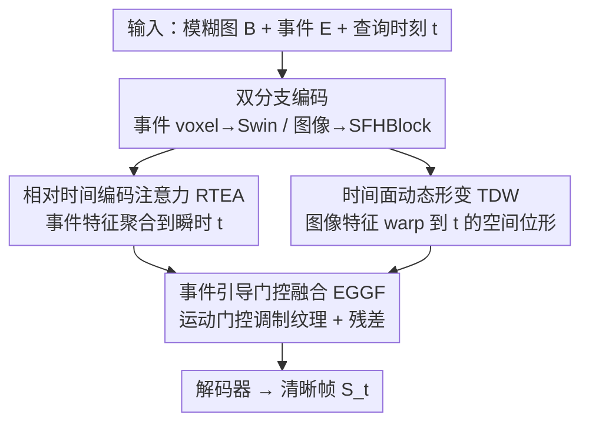

# Time-Specialized Event-Image Alignment for Blur-to-Video Decomposition

**会议**: CVPR 2026  
**论文**: [CVF Open Access](https://openaccess.thecvf.com/content/CVPR2026/html/Sun_Time-Specialized_Event-Image_Alignment_for_Blur-to-Video_Decomposition_CVPR_2026_paper.html)  
**代码**: https://github.com/ZhijingS/TSANet （有）  
**领域**: 图像恢复 / 事件相机 / 运动去模糊  
**关键词**: 模糊分解, 事件相机, 时间对齐, 视频重建, 注意力

## 一句话总结
TSANet 用事件相机辅助，把一张运动模糊图像「展开」成高帧率清晰视频——核心是先把事件特征和图像特征都「时间专门化」对齐到任意查询时刻 $t$，再做轻量融合，在 GoPro / HighREV / EBD 三个数据集上一致超过此前 SOTA。

## 研究背景与动机

**领域现状**：单图去模糊（blur → 一张清晰图）已经研究得很充分，近年的研究方向升级到了更难的「模糊分解」（blur decomposition）：从一张运动模糊图像里恢复出一段时间连续的清晰视频序列 $S_t = \phi(B, E, t)$，其中 $t\in[0,1]$ 标记曝光窗口内的归一化时刻。

**现有痛点**：模糊分解本质是病态问题——不同的运动轨迹在曝光时间内积分后会得到同一张模糊图（论文用「手-球」玩具例子说明：手上球下、双上、双下、手下球上四种运动平均后模糊图完全一样），这就是**运动歧义（motion ambiguity）**。纯图像方法（靠时序一致性损失、多帧输入或卷帘快门线索）在大幅复杂运动下会崩，因为关键的时序信息已经被模糊不可逆地抹掉了。

**核心矛盾**：事件相机以微秒级时间分辨率异步记录像素亮度变化，恰好保存了那段「丢失的运动轨迹」，是消解歧义的天然钥匙。但已有的事件方法没有把这把钥匙用好：基于物理模型的方法（如 EDI）对真实事件噪声敏感；两阶段管线（先去模糊再插帧）会误差累积；学习型方法（如 EVDI、E-CIR）把整段曝光的事件当成一个**整体运动描述子**，缺少把特征**显式对齐到任意查询时刻** $t$ 的机制——EVDI 只在输入预处理时按 $t$ 生成不同事件表示，密集视频生成时既低效、又无法在网络内部动态对齐特征。

**核心 idea**：作者提出「时间专门化对齐（Time-Specialized Alignment）」原则——在融合两个模态之前，必须先各自把特征对齐到目标时刻 $t$：让**事件特征聚焦到 $t$ 附近的瞬时运动**，让**图像特征 warp 到 $t$ 对应的空间位形**。两者在任意 $t$ 显式对齐后再融合，才能重建出高质量、时序连贯的清晰视频。

## 方法详解

### 整体框架
输入是一张模糊图 $B$ 和曝光期间采集的事件 $E$，输出是任意查询时刻 $t$ 的清晰帧 $S_t$（遍历多个 $t$ 即得高帧率视频）。整条管线分四步：**双分支编码 → 事件时间专门化（RTEA）→ 图像时间专门化（TDW）→ 门控融合（EGGF）→ 解码**。

事件先转成 event voxel（体素）和 event timesurface（时间面）两种表示。事件分支用 Conv + Swin Transformer 块从 voxel 里抽整段曝光的时空运动动态；图像分支用 SFHBlock 抽全局纹理特征。这两路抽出的都是「时间无关的全局特征」，真正的关键在后续的**时间专门化阶段**：RTEA 把事件运动特征聚合到瞬时 $t$，TDW 用 timesurface 把图像特征几何变换到 $t$ 对应的空间位形，最后 EGGF 轻量融合两者送入解码器重建 $S_t$。

### 关键设计

**1. 相对时间编码注意力 RTEA：把事件特征「聚焦」到查询时刻附近**

痛点直接对准「事件被当整体描述子、对齐靠预处理低效」这件事。RTEA 不再为每个 $t$ 重新生成事件表示，而是在网络内部对一串事件特征图 $F_E\in\mathbb{R}^{N\times C\times H\times W}$（$N$ 个时间 bin）按它们到查询时刻 $t$ 的**相对时间距离**动态重加权。它先用标准 query-key 注意力算内容相关性：把 $F_E$ 空间平均池化得 $\hat F_E\in\mathbb{R}^{N\times C}$ 投影成 key $K$，把 $t$ 过 Fourier 位置编码 + MLP 得 query $q$，内容注意力 logits $W = K\cdot q$。

真正的核心是注入**相对时间先验偏置** $T_\text{bias}$：先算每个事件帧索引 $n$ 到目标时刻的归一化相对距离

$$d_n = \frac{n - p}{N-1}, \quad p = t\times(N-1)$$

再把 $d_n$ 和 $d_n^2$ 过 MLP 生成偏置，加到内容 logits 上做 softmax，最后对 $F_E$ 加权求和得到时间专门化运动特征 $F_E^t$：

$$T_\text{bias} = \text{MLP}([d_n, d_n^2]),\quad \eta = \text{Softmax}(W + T_\text{bias}),\quad F_E^t = \eta\cdot F_E$$

为什么有效：$T_\text{bias}$ 显式编码「离 $t$ 越近的事件帧越该被关注」这一物理先验，让模型像一个「自适应时间聚焦镜头」只盯住 $t$ 邻域的瞬时运动；没有它时，模型会平均掉整段曝光、恢复出带运动拖影的过平滑图。RTEA 还在全局尺度和窗口尺度各跑一遍，用可学习权重 $\alpha$ 自适应融合全局/局部运动。

**2. 时间面动态形变 TDW：把「时间平均」的图像纹理 warp 回瞬时位形**

这个设计针对的痛点是：模糊图抽出的纹理特征是**整段曝光的时间平均**，和任意时刻 $t$ 的真实场景位置存在系统性的空间错位——直接拿去和瞬时运动特征融合就会对不齐。TDW 利用 event timesurface 来做几何对齐：timesurface 在每个像素记录「最近一次事件的时间戳」，这张图隐式刻画了运动轨迹，正好携带预测形变场所需的局部运动先验。

机制上，TDW 把 timesurface $TS$ 过卷积块抽运动模式，并用 Scale & Shift 让它**以 $t$ 为条件**：$t$ 嵌入后经 MLP 生成逐通道缩放/平移参数 $\gamma,\beta$，调制 timesurface 特征得到时间条件运动表示 $M^t$；再用一个卷积头把 $M^t$ 映射成 2 通道形变场 $K_t\in\mathbb{R}^{2\times H\times W}$（逐像素位移 $(\Delta x, \Delta y)$），对图像特征做可微双线性采样 warp：

$$\gamma,\beta = \text{MLP}(\text{Embed}(t)),\quad M^t = \gamma\cdot\text{ConvBlock}(TS) + \beta$$
$$K_t = \text{Conv}(M^t),\quad F_B^t = \text{Warp}(F_B, K_t)$$

为什么有效：消融里把 warp 引导从 timesurface 换成事件 voxel 特征（EDW 变体）会掉 0.49dB，说明 timesurface 这种「任务对齐」的事件表示比原始 voxel 更能精准指导形变——它直接编码了运动历史轨迹，而 voxel 还混着冗余的时空信息。

**3. 事件引导门控融合 EGGF：用运动「点亮」该补细节的纹理区域**

由于前两步已经把跨模态时空对齐这个最难的活干完了，融合阶段就不必再上昂贵的 cross-attention transformer，作者用一个轻量门控模块即可。它先用 TDW 产出的稠密运动表示 $M^t$ 对事件特征 $F_E^t$ 做 scale & shift 增强得 $\hat F_E^t$，再过卷积 + ReLU 生成空间门控图 $G$，让 $G$ 逐元素去缩放图像特征 $F_B^t$、并加残差：

$$\gamma_m, \beta_m = \text{Chunk}(\text{ReLU}(\text{Conv}(M^t))),\quad \hat F_E^t = \gamma_m\cdot F_E^t + \beta_m$$
$$G = \text{ReLU}(\text{Conv}(\hat F_E^t)),\quad F_\text{fused} = G\odot F_B^t + F_B^t$$

为什么有效：门控图 $G$ 来自运动特征，于是「哪里运动剧烈就强调哪里的纹理细节」，残差又保证只注入事件引导的细节、不覆盖底层纹理。消融显示 EGGF 比 concat / add / cross-attn 都好（最高 +0.53dB），同时比第二好的 cross-attn 还省 0.54G FLOPs——这正是「前面对齐做扎实了，融合就能简单」的直接体现。

## 实验关键数据

### 主实验
统一在三个数据集（合成事件 GoPro、真实事件 HighREV 与作者新采的 EBD）上重训所有对比方法，模糊图由平均 11 帧连续清晰帧合成，「×5」表示一张模糊图分解成 5 帧。

| 数据集（×5） | 指标 | TSANet（本文） | 最强事件基线 | 提升 |
|--------------|------|----------------|--------------|------|
| GoPro | PSNR | **28.40** | EvEnhancer 27.76 | +0.64dB |
| HighREV | PSNR | **36.84** | EvEnhancer 35.78 | +1.06dB |
| EBD | PSNR | **29.02** | REFID 27.84 | +1.94dB（论文正文记 +1.4dB） |
| HighREV | SSIM | **0.974** | EBFI 0.957 | +0.017 |

相比依赖多张模糊输入的纯图像方法，本文在三个集上分别至少领先 1.14 / 4.6 / 3.4 dB，说明曝光期间的事件确实比多张模糊帧更可靠地刻画了底层运动。参数量 6.3M，比多数事件基线更小。长视频（×9，一张图分解成 9 帧）下同样领先：HighREV 36.81 vs EvEnhancer 35.59，EBD 28.99 vs REFID 27.57。

### 消融实验（HighREV）
| 配置 | RTEA | Warp 引导 | 融合 | PSNR | FLOPs(G) |
|------|------|-----------|------|------|----------|
| Case 1（baseline） | - | - | EGGF | 33.92 | 94.12 |
| Case 2 | ✓ | - | EGGF | 35.42 | 101.67 |
| Case 3 | ✓ | EDW（event voxel 引导） | EGGF | 36.35 | 108.76 |
| Case 4 | ✓ | TDW | Concat | 36.31 | 115.96 |
| Case 5 | ✓ | TDW | Add | 36.33 | 106.31 |
| Case 6 | ✓ | TDW | Cross attn. | 36.79 | 108.45 |
| **Ours** | ✓ | TDW | EGGF | **36.84** | 107.91 |

### 关键发现
- **RTEA 贡献最大**：从 Case 1→2 单加 RTEA 就涨 1.5dB / +0.007 SSIM，是「充分利用事件」的基石；去掉它会恢复出带运动拖影的过平滑图。
- **timesurface 比 event voxel 更适合引导形变**：TDW（timesurface 引导）比 EDW（voxel 引导）再涨 0.49dB，印证「用任务对齐的事件表示」很关键。
- **对齐做扎实后融合可以很轻**：EGGF 比 cross-attn 还高 0.05dB 且省 0.54G FLOPs，比 concat/add 高 0.5dB 左右，说明复杂融合模块在对齐充分时是冗余的。
- 时空切片可视化显示本文运动轨迹平滑连续，而 REFID/EvEnhancer 出现断裂、抖动的轨迹。

## 亮点与洞察
- **「先对齐、再融合」的解耦哲学很干净**：把模糊分解的难点拆成「事件聚焦到 $t$ + 图像 warp 到 $t$」两个可显式建模的子问题，融合反而成了最简单的一步——这种「把难度前移到对齐」的思路可迁移到任何多模态时序对齐任务。
- **相对时间距离当注意力偏置**：用 $[d_n, d_n^2]$ 过 MLP 注入「越近越重要」的物理先验，比为每个 $t$ 重生成表示（EVDI）高效得多，是处理「连续查询时刻」的轻量好 trick。
- **timesurface 当形变引导**：把「每像素最近事件时间戳」这种现成事件表示直接当作运动先验去预测 warp field，比从 voxel 估计形变更准——提示事件表示的选择本身就是一种归纳偏置。
- **配套真实数据集 EBD**：用 DVSync 事件相机硬件级对齐采集 29 段彩色视频 / 25,608 帧 + 真实事件，填补了模态良好对齐的真实事件去模糊数据空白。

## 局限与展望
- 模糊图全部由「平均 11 帧清晰帧」合成，并非真实相机长曝光模糊；真实运动模糊的非线性、卷帘效应可能与合成有 gap，论文未在真实拍摄的模糊图上评测。
- 方法对事件质量有隐性依赖：timesurface 在事件稀疏/高噪声区域（弱纹理、低光、极快运动导致事件饱和）能否提供可靠 warp 先验，论文未做压力测试。
- RTEA 假设运动可由「相对时间距离」线性加权聚合，对曝光内有方向反转、加减速的复杂运动是否仍准确，缺少针对性分析。
- 形变场 $K_t$ 是 2D 像素位移，遇到遮挡/视差变化（一个像素在不同 $t$ 该来自不同深度层）时单层 warp 可能力不从心，可考虑多层/遮挡感知 warp。

## 相关工作与启发
- **vs EVDI [45]**：EVDI 也按 $t$ 生成事件表示，但只在输入预处理阶段做、网络内部不再动态对齐，密集视频生成低效；本文 RTEA 把时间专门化搬进网络内部用注意力偏置实现，既高效又能特征级对齐。
- **vs EDI [27] 等物理模型**：物理模型解析地耦合模糊、事件与潜在清晰帧，但对真实事件噪声敏感；本文走学习型路线、用 timesurface 抗噪并显式对齐，鲁棒性更好。
- **vs 两阶段方法 [22]**：先去模糊再插帧的级联设计误差累积；本文单网络直接按任意 $t$ 重建 $S_t$，避免中间清晰图的误差传播。
- **vs 纯图像方法 BiT [47] / DeMFI [26]**：它们只能从相邻 RGB 帧推运动、在大运动下有方向歧义；本文引入事件作为运动「真值记录」，三数据集上领先纯图像方法 1+ dB。

## 评分
- 新颖性: ⭐⭐⭐⭐ 「时间专门化对齐」原则 + RTEA/TDW 两个对齐模块组合清晰，相对时间偏置与 timesurface 形变引导都是有针对性的小创新，但属于已有事件去模糊范式内的精致改进。
- 实验充分度: ⭐⭐⭐⭐ 三数据集 + 合成/真实事件 + ×5/×9 长视频 + 逐模块消融 + 形变场/注意力可视化，相当完整；缺真实长曝光模糊评测。
- 写作质量: ⭐⭐⭐⭐ 动机用手-球例子讲得直观，公式与模块职责交代清楚，框架图清晰。
- 价值: ⭐⭐⭐⭐ SOTA + 开源代码 + 新真实数据集 EBD，对事件辅助模糊分解社区有实用价值。

<!-- RELATED:START -->

## 相关论文

- [\[CVPR 2026\] AE2VID: Event-based Video Reconstruction via Aperture Modulation](ae2vid_event-based_video_reconstruction_via_aperture_modulation.md)
- [\[CVPR 2026\] One-Shot Flow, Any-Time Frame: A Bidirectional Warping Framework for Event-Based Video Frame Interpolation](one-shot_flow_any-time_frame_a_bidirectional_warping_framework_for_event-based_v.md)
- [\[CVPR 2026\] Event-Based Motion Deblurring Using Task-Oriented 3D Gaussian Event Representations](event-based_motion_deblurring_using_task-oriented_3d_gaussian_event_representati.md)
- [\[CVPR 2026\] Real-Time Neural Video Compression with Unified Intra and Inter Coding](real-time_neural_video_compression_with_unified_intra_and_inter_coding.md)
- [\[CVPR 2026\] Time Without Time: Pseudo-Temporal Representation for Space-Time Super-Resolution](time_without_time_pseudo-temporal_representation_for_space-time_super-resolution.md)

<!-- RELATED:END -->
