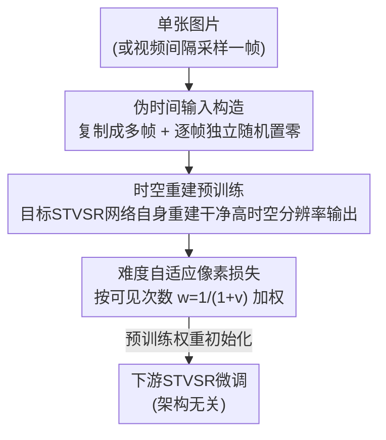

# Time Without Time: Pseudo-Temporal Representation for Space-Time Super-Resolution

**会议**: CVPR 2026  
**论文**: [CVF Open Access](https://openaccess.thecvf.com/content/CVPR2026/html/Choi_Time_Without_Time_Pseudo-Temporal_Representation_for_Space-Time_Super-Resolution_CVPR_2026_paper.html)  
**代码**: 待确认  
**领域**: 图像恢复 / 视频超分辨率  
**关键词**: 时空视频超分、预训练、伪时间、自监督、难度自适应损失

## 一句话总结
针对时空视频超分（STVSR）缺乏有效预训练策略的问题，本文提出把单张图片"复制成多帧 + 逐帧独立随机置零"伪造出一段没有真实时间的视频，让目标 STVSR 网络自己做"从退化的伪时间输入重建高时空分辨率干净输出"的预训练，并用难度自适应像素损失聚焦难生成区域；这套架构无关、只用图像就能跑的预训练在少样本微调下把多种 STVSR 网络的 PSNR 提升最多 +5dB。

## 研究背景与动机

**领域现状**：时空视频超分（Space-Time Video Super-Resolution, STVSR）要同时在空间上放大分辨率、在时间上插帧提高帧率（论文默认设置是空间 ×4、时间 ×2，输入 4 帧、输出 7 帧）。这个方向过去几年几乎所有精力都花在设计任务专用架构（Zooming、TMNet、RSTT 等）和新建模范式（扩散、连续时间建模）上。

**现有痛点**：预训练这条在分类/检测里早已成熟的路，在 STVSR 上几乎是空白。直接搬视频自监督的主流方案——基于掩码自编码器（MAE）的 VideoMAE、MAE-ST 等——会水土不服：它们是为 ViT 设计的，把图像切成矩形 patch 处理，patch 粗粒度划分会在低层视觉任务里产生明显的块状伪影；而且它们用极高掩码率（如 90~95%）训练重建，会把边缘、纹理、重复结构这些高频细节大量抹掉。论文 Figure 1 实测：在 REDS 上用各种视频自监督方法预训练 RSTT-S 再微调，MAE-ST 拿到 31.60 PSNR、VideoMAE 31.64，几乎和从头训练（31.66）没区别甚至更差。

**核心矛盾**：STVSR 是像素级密集预测任务，要求保留丰富的时空信息；而主流视频自监督预训练靠"激进掩码 + patch 重建"，本质上是在丢弃高频信息学高层语义——两者的目标根本对不上。另一方面，视频帧之间高度冗余、空间判别性弱，纯视频预训练还特别费算力和显存。

**本文目标**：找到一种 (1) 架构无关、能套到任意定速 STVSR 网络上，(2) 能高效利用图像数据集（图像天生提供清晰、无模糊的强空间线索）的预训练方法。

**切入角度**：作者的关键观察是——STVSR 的两大核心能力是"空间复原"和"跨帧聚合"。那么预训练任务为什么不直接对齐这两件事？图像数据虽然没有时间维度，但只要把一张图复制成多帧、再对每帧独立地随机挖洞，各帧的可见区域就不一样了，这种"可见性差异"天然逼着网络去跨帧推断——于是在没有任何真实运动的情况下，伪造出了时间。

**核心 idea**：用"复制单图 + 逐帧独立置零"构造伪时间视频，让目标 STVSR 网络本身做时空重建预训练（而非外挂一个独立预训练模块），从图像数据里同时长出空间复原和跨帧聚合的归纳偏置。

## 方法详解

### 整体框架
整个方法是一个"预训练框架"而非新网络：它不引入任何额外模块，预训练的就是你最终要用的那个 STVSR 网络。给定一张图片（或从视频里间隔采样出的一帧），先把它复制成与目标网络输入帧数相同的若干帧，再对每帧**独立**地随机把若干小块像素置零，得到一段低分辨率、低帧率、带洞的"伪时间视频"；目标网络以这段退化输入为输入，被要求重建出空间 ×scale_s、时间 ×scale_t 上采样后的干净高分辨率视频；损失不是普通 MSE，而是对每个输出区域按其在输入帧中的"可见次数"加权——越难生成（输入里越多被遮）的区域权重越大。预训练完直接拿这套权重去下游 STVSR 任务微调。

### 关键设计

**1. 伪时间输入构造：用逐帧独立掩码从单图凭空造出"时间"**

这一招直接破解了"图像没有时间维度，怎么训跨帧能力"的死结。做法分两步：先把一张图片复制 T_in 份得到一段"每帧都一样"的伪视频（用视频数据时则每隔 T 帧采样一帧、再复制，这样能增加空间多样性）；再对每一帧**各自独立**地随机选若干 4×4 小块、把像素**置零**。关键细节有两点：其一，这里的掩码是"填零"而不是像 MAE 那样"把区域从网络输入里删掉"，因为 STVSR 是密集预测、网络结构需要完整空间张量；采样按文献做法不放回，避免中心偏置。其二，论文**刻意不用高掩码率**（默认仅 0.5，而 VideoMAE 用 0.9~0.95），因为高掩码率会把边缘、纹理、重复模式这些 STVSR 命脉的高频信号抹掉。虽然所有帧来自同一张图，但逐帧独立的掩码让"哪些像素这帧可见、那帧不可见"在帧间产生差异——正是这种**可见性的帧间变化**，在没有真实运动的前提下逼网络去"跨帧找信息补当前帧的洞"，从而伪造出时间结构。

**2. 时空重建预训练：让目标网络自己做对齐核心能力的 pretext 任务**

不外挂独立预训练模块，而是让最终要部署的那个 STVSR 网络**本身**去做预训练，是本方法"架构无关"的根源——因为预训练任务和下游任务用的是同一个网络、同一类输入输出形态，所以任何定速 STVSR 网络（ViT 系的 RSTT、CNN 系的 Zooming/TMNet 都行）都能套，而 VideoMAE 那类方案只能服务特定架构（ViT 或 3D-CNN）。pretext 任务的设计精确对齐 STVSR 的两个核心挑战：输入是伪时间、低分辨率、低帧率且带洞的视频，输出要求是干净、高分辨率、高帧率。这样**空间侧**网络学的是补全缺失内容 + 像素级超分以恢复高频细节；**时间侧**虽然没有显式运动线索，但各帧可见区域不同迫使网络做跨帧推断，学到"跨帧交叉引用"的时间归纳偏置。作者把它类比为强化学习和低层视觉里的"任务诱导表示学习"——预训练直接练的就是下游要用的肌肉。

**3. 难度自适应像素损失：按可见次数加权，逼网络死磕难生成区域**

普通像素 MSE 对所有输出区域一视同仁，但伪时间设定下"难易"是可以精确量化的。由于每段输入视频都由单图复制而来，输出帧里第 (i,j) 块 $\hat{H}^{(t)}_{ij}$ 对应的输入区域 $\{L^{(t)}_{ij}\}_{t=1}^{T_{in}}$ 是完全可定位的。定义**可见次数** $v^{(t)}_{ij}$ 为该区域在 T_in 个输入帧中未被遮的帧数（取值 0 到 T_in，且对同一空间块在所有输出帧 t 上相同）。如果一个区域在输入里几乎全被遮（$v$ 小），那无论是给中间新插帧生成它、还是在已有低分辨率帧里增强它，都很难；反之全可见就很容易。据此定义调制因子

$$w^{(t)}_{ij} = \frac{1}{1 + v^{(t)}_{ij}}$$

并把它乘进逐块 L2 损失：

$$\text{loss} = \frac{1}{N}\sum_{t}\sum_{i}\sum_{j} w^{(t)}_{ij}\,\big\|H^{(t)}_{ij} - \hat{H}^{(t)}_{ij}\big\|^2$$

其中 N 是输出帧总像素数，$H^{(t)}_{ij}$ 是对应的真值高分辨率块。可见次数越少、权重越大，网络被推着把注意力放到最难补的区域。注意与 MAE 的另一处本质差异：MAE 只在被遮 patch 上算损失，而这里**可见和被遮区域都参与**预训练。消融显示这个加权策略（"Ours"）显著优于等权（"Equal"）和 onehot 加权。

### 损失函数 / 训练策略
预训练 200 epoch、微调 50 epoch；掩码块 4×4、掩码率默认 0.5；目标任务为空间 ×4、时间 ×2（4 帧入、7 帧出）。为放大并公平评估预训练增益，下游用少样本微调（如 "Vimeo-90K 1%" 指训练集 1% 子集，随机采 5 个不重叠子集取平均）。损失即上面的难度自适应像素损失（以 MSE 为底改造）。

## 实验关键数据

### 主实验
在 Zooming / TMNet / RSTT 三种架构、Vimeo-90K 与 REDS 多数据集、不同数据量下验证（均为 Vimeo-90K 预训练，下表 Vimeo-90K 报 fast 序列 PSNR）：

| 架构 | 配置 | Vimeo-90K 1% | Vimeo-90K 10% | REDS 10% | REDS 100% |
|------|------|------|------|------|------|
| Zooming | baseline | 28.88 | 33.96 | 24.84 | 26.20 |
| Zooming | **+Ours** | **33.96** (+5.08) | **34.93** (+0.97) | **26.25** | **26.60** |
| TMNet | baseline | 28.91 | 33.79 | 23.32 | 26.56 |
| TMNet | **+Ours** | **34.79** (+5.88) | **35.43** | **26.50** | **26.93** |
| RSTT | baseline | 31.66 | 34.56 | 25.31 | 26.35 |
| RSTT | **+Ours** | **34.18** | **35.61** | **26.21** | **26.83** |

数据越少增益越大：Zooming 在 1% 数据上 PSNR +5.08dB，到 10% 数据缩到 +0.97dB——印证预训练主要价值在少样本场景。

预训练数据类型对比（RSTT-S，Vimeo-90K 1% fast 的 PSNR）：

| 预训练数据 | # 图片 | Vimeo-90K 1% Fast | REDS 100% |
|------|------|------|------|
| Scratch | 0 | 31.66 | 26.35 |
| ImageNet 10% | 128,116 | 34.20 | 26.81 |
| Vimeo-90K | 64,612 | 34.18 | 26.83 |
| REDS | 3,840 | 33.46 | 26.66 |

即便只用 REDS 区区 3,840 张图预训练，也能把 Vimeo-90K 1% 从 31.66 拉到 33.46；ImageNet 图像表示能有效迁移到 STVSR，说明方法不挑数据规模。

### 消融实验
RSTT-S 在 Vimeo-90K 预训练、Vimeo-90K 1%（5 split 平均 PSNR）微调：

| 配置 | 关键指标 (Fast PSNR) | 说明 |
|------|---------|------|
| Scratch | 31.66 | 不预训练 |
| 调制因子 = Equal（等权） | 33.64 | 普通均匀 MSE 预训练 |
| 调制因子 = Onehot | 33.45 | 只盯单一区域，反而不如等权 |
| **调制因子 = Ours**（难度自适应） | **34.18** | 完整方法 |
| 掩码率 0.3 / 0.5 / 0.7 | 34.19 / 34.18 / 34.19 | 对掩码率不敏感（只要"全遮区域"占比不高） |
| 掩码率 0.9（全遮 65.6%） | 33.77 | 信息丢太多，掉点 |
| 预训练 50 / 100 / 200 epoch | 34.11 / 34.09 / 34.18 | 50 epoch 已接近 200，不需长预训练 |

### 关键发现
- **难度自适应损失是核心增益来源**：从等权 33.64 提到 34.18（+0.54dB），且 onehot（只盯最难一块）反而退化到 33.45，说明"按可见次数平滑加权"而非"非此即彼"才对。
- **对掩码率鲁棒、但怕过度遮挡**：0.3~0.7 几乎无差异，真正的临界量是"被完全遮住（所有输入帧都看不到）的区域比例"——掩码率 0.9 时全遮区域飙到 65.6%，关键信号丢失才掉点，这与高掩码率 MAE 的失败一脉相承。
- **预训练极省**：50 epoch 即逼近 200 epoch，方法"简单且不贵"。
- **越大的网络获益越多**（消融 d），说明预训练为大模型提供了更有价值的初始化。

## 亮点与洞察
- **"伪时间"这个观念本身最妙**：跨帧聚合能力一直被认为非有真实运动视频不可，本文揭示只要"帧间可见性有差异"就足以诱导跨帧推断——把昂贵、冗余的视频预训练替换成廉价、清晰的图像预训练。
- **预训练任务 = 下游网络本体**：不设计独立 pretext 模块，而让目标网络自己做对齐核心能力的任务，一举换来架构无关性，可直接迁移到任何定速密集预测任务（如视频去噪、插帧）。
- **难度量化的巧思**：因为输入是单图复制而来，每个输出块对应的输入区域可精确定位，从而把"生成难度"显式量化为可见次数——这种"自带 ground-truth 难度"的设定可复用于其他掩码重建型预训练。
- 反 MAE 直觉：低层视觉里"低掩码率 + 填零（而非删除）+ 全区域算损失"比"高掩码率 + 删 patch + 只算被遮区"更合适，给密集预测预训练提供了清晰的设计准则。

## 局限与展望
- **仅限定速（fixed-rate）STVSR**：论文明确只针对预设固定时间尺度重建，连续时间 / 任意倍率 STVSR 不在覆盖范围内。
- **伪时间没有真实运动语义**：复制单图造出的"时间"只有可见性差异，缺乏真实物体运动、形变、遮挡关系，⚠️ 对运动剧烈或大位移场景能否同样有效，论文未深入分析（可能需要真实视频做补充）。
- **增益随数据量增大快速衰减**：10% 数据上增益已降到约 +1dB，100% 数据场景下的实用价值待评估——预训练主要服务少样本/数据受限场景。
- 改进方向：把"逐帧独立掩码"升级为带伪运动轨迹的掩码（让被遮区域沿某方向平移），或许能注入更强的运动归纳偏置。

## 相关工作与启发
- **vs VideoMAE / MAE-ST（视频 MAE）**: 它们为 ViT 设计、高掩码率删 patch、只在被遮区算损失，导致块状伪影 + 高频丢失，且只适配特定架构；本文低掩码率填零、全区域加权损失、架构无关，Figure 1 实测高出 2~3dB。
- **vs 图像→视频的 3D-CNN 预训练 [36,57] / 图像视频联合训练 [19]**: 这些方法依赖特定 3D-CNN 架构、泛化性受限；本文不依赖任何架构，且图像表示（ImageNet）能直接有效迁移。
- **vs 低层视觉的任务诱导预训练 [2,5,35,39,52]**: 同属"用退化线索/同任务做预训练"思路，但本文首次把它带到需要像素级视频预测的 STVSR，并通过"复制单图 + 独立掩码"巧妙解决了图像数据没有时间维度的问题。

## 评分
- 新颖性: ⭐⭐⭐⭐⭐ "复制单图 + 逐帧独立掩码 = 伪时间"这一观念简单却击中要害，首次为 STVSR 给出架构无关的图像预训练范式。
- 实验充分度: ⭐⭐⭐⭐ 跨 3 架构 × 多数据集 × 多数据量充分验证，消融覆盖调制因子/掩码率/epoch/模型规模；但缺真实运动剧烈场景与连续倍率分析。
- 写作质量: ⭐⭐⭐⭐ 动机—方法—实验逻辑清晰，公式与图示到位。
- 价值: ⭐⭐⭐⭐ 即插即用、只用图像、少样本增益大，对数据受限的 STVSR 落地实用价值高。

<!-- RELATED:START -->

## 相关论文

- [\[CVPR 2026\] Time-Aware One Step Diffusion Network for Real-World Image Super-Resolution](time-aware_one_step_diffusion_network_for_real-world_image_super-resolution.md)
- [\[CVPR 2026\] Time-Specialized Event-Image Alignment for Blur-to-Video Decomposition](time-specialized_event-image_alignment_for_blur-to-video_decomposition.md)
- [\[ICML 2025\] TimeDART: A Diffusion Autoregressive Transformer for Self-Supervised Time Series Representation](../../ICML2025/image_restoration/timedart_a_diffusion_autoregressive_transformer_for_self-supervised_time_series_.md)
- [\[CVPR 2026\] Degradation-Consistent Test-Time Adaptation for All-in-One Image Restoration](degradation-consistent_test-time_adaptation_for_all-in-one_image_restoration.md)
- [\[CVPR 2026\] Real-Time Neural Video Compression with Unified Intra and Inter Coding](real-time_neural_video_compression_with_unified_intra_and_inter_coding.md)

<!-- RELATED:END -->
