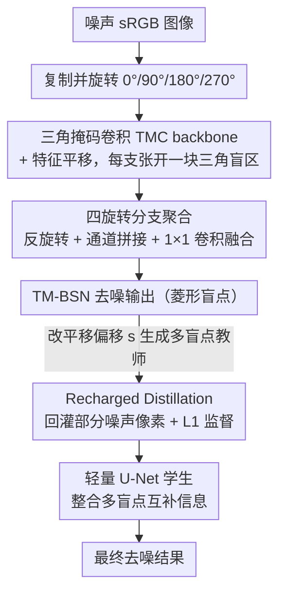

# TM-BSN: Triangular-Masked Blind-Spot Network for Real-World Self-Supervised Image Denoising

**会议**: CVPR 2026  
**arXiv**: [2604.04484](https://arxiv.org/abs/2604.04484)  
**代码**: [https://github.com/parkjun210/TM-BSN](https://github.com/parkjun210/TM-BSN)  
**领域**: 图像恢复 / 自监督去噪  
**关键词**: 盲点网络, 自监督去噪, 三角掩码卷积, 空间相关噪声, 知识蒸馏

## 一句话总结

提出三角掩码盲点网络 TM-BSN，通过将盲点区域设计为与真实 sRGB 噪声的菱形空间相关模式精确对齐的形状，在原始分辨率上实现无需下采样的自监督图像去噪，并通过知识蒸馏进一步提升性能，在 SIDD 和 DND 基准上达到自监督去噪 SOTA。

## 研究背景与动机

1. **领域现状**：盲点网络（BSN）是自监督图像去噪的主流方法，其核心思想是通过排除目标像素的感受野来防止恒等映射，从而在无需干净图像监督的情况下估计干净信号。
2. **现有痛点**：BSN 假设噪声是逐像素独立的，但真实 sRGB 图像中，ISP 流水线（特别是去马赛克过程）会引入强烈的空间相关噪声，违反独立性假设导致网络退化为恒等映射。
3. **核心矛盾**：现有解决方案要么通过像素洗牌下采样（PD）来去相关噪声，但这改变了噪声统计特性且需要后处理（如 AP-BSN）；要么在原始分辨率上扩大盲点区域（如 AT-BSN），但矩形盲点与噪声的菱形相关模式不匹配，排除了有用的非相关像素。
4. **本文目标**：如何设计一个盲点形状与真实噪声空间相关几何结构精确匹配的自监督去噪网络？
5. **切入角度**：作者观察到去马赛克过程中，每个像素由邻近样本以空间衰减权重重建，产生以目标像素为中心的菱形相关模式。盲点应精确覆盖这个菱形区域。
6. **核心idea**：用三角掩码卷积构建菱形盲点，精确匹配 sRGB 噪声的空间相关几何，在保留最大上下文信息的同时排除所有相关像素。

## 方法详解

### 整体框架

TM-BSN 要解决的核心问题是：真实 sRGB 噪声不是逐像素独立的，去马赛克插值让每个像素与邻域形成一个以自身为中心的**菱形**相关区域，而传统盲点网络要么靠下采样破坏噪声统计、要么用矩形盲点排除掉本可利用的非相关像素。整篇方法就是让盲点的几何形状精确贴合这个菱形。

具体怎么转：噪声图像先被复制成四份，分别旋转 0°、90°、180°、270°；每一份送进一个以三角掩码卷积（TMC）替换标准 3×3 卷积搭起来的 backbone，配合特征平移把目标像素挤出自身感受野，于是每个分支只在一个方向上张开一块三角形盲区。四个方向的三角形拼起来恰好围成一个完整的菱形盲点。各分支特征反旋转回正、沿通道拼接，再过一个 1×1 卷积融合输出去噪结果。性能还不够时，可再通过知识蒸馏把多个盲点尺寸的互补预测迁移进一个轻量 U-Net。

### 关键设计

**1. 三角掩码卷积（TMC）：把盲点的"边"做成可控的三角形**

痛点在于盲点必须排除目标像素及其相关邻域，但矩形盲点连菱形之外的非相关像素也一起挡掉了。TMC 的做法是对 3×3 卷积核乘一个上三角二值掩码 $M_{ij} = 1\ \text{if}\ i \leq j$，把下三角权重清零，于是单层卷积的感受野只朝上三角方向扩展；多层 TMC 堆叠后，感受野沿这个方向逐级长大，配合把特征图上移或右移 $s$ 个像素的平移操作，目标像素被推到感受野之外形成盲点。因为感受野是三角形而非方形，它天然只覆盖菱形相关区的一条斜边，为后面拼出菱形盲点、又不浪费角上的非相关像素打下基础。

**2. 四旋转分支聚合：用四个三角形拼出对称菱形**

单个三角掩码只能在一个方向张开盲区，无法独自围出对称的菱形。设计上把输入旋转到 0°、90°、180°、270° 四个朝向各跑一个 TMC 分支，每个分支的三角感受野负责菱形的一条边，四个方向聚合后正好闭合成完整菱形——既挡住了所有与目标相关的像素，又把菱形之外的非相关上下文全部保留下来。这里还有个细节：聚合时只拼接垂直和水平平移的特征，刻意避开对角平移，因为对角方向的覆盖是不连续的，会在盲点边界留下漏洞。

**3. Recharged Distillation：用蒸馏突破单盲点的信息上限**

盲点约束的本质是主动丢掉目标像素信息，这给单个网络的精度划了天花板。TM-BSN 的便利之处是只要改平移偏移 $s$，就能在共享 backbone 上几乎免费地（约 +15% 计算）生成一组不同盲点尺寸的预测，每个尺寸提供互补的恢复线索。蒸馏框架把这些教师输出合成监督信号——在每个教师结果里随机回灌一部分原始噪声像素（"recharge"），再用 L1 损失训练一个不带盲点约束、可直接看到目标像素的轻量 U-Net 学生。学生因此能整合多盲点的互补信息，性能反超任何单一盲点预测。

### 损失函数 / 训练策略

TM-BSN 主干用自监督 L1 损失训练，固定平移偏移 $s=5$，Adam 优化 500k 迭代——这个 $s$ 是消融出的甜点：$s=4$ 偏移太小挡不住相关像素、退化成恒等映射，$s\geq 6$ 又把有用近邻一起丢了。蒸馏阶段的目标为

$$\mathcal{L}_{RD} = \sum_{s_i \in S} \big\| f_D(y) - \text{sg}\big[T_{s_i} \odot (1-M_i) + y \odot M_i\big] \big\|_1$$

其中 $f_D$ 是学生、$T_{s_i}$ 是偏移 $s_i$ 的教师预测、$M_i$ 标记被回灌的噪声像素、$\text{sg}[\cdot]$ 表示停止梯度。推理偏移集取 $S=\{2,3,4,5,6\}$（既多样又都靠近训练偏移，监督信号稳定），学生 U-Net 仅 1.02M 参数，训练 200k 迭代。

## 实验关键数据

### 主实验

| 数据集 | 指标 | TM-BSN (D) | APR (RD) | TBSN | AT-BSN (D) |
|--------|------|------------|----------|------|------------|
| SIDD Val | PSNR | **38.08** | 38.00 | 37.71 | 37.88 |
| SIDD Benchmark | PSNR | **38.31** | 38.26 | 38.02 | 38.14 |
| DND Benchmark | PSNR | **39.41** | 38.83 | 39.08 | 38.68 |
| DND (全自监督) | PSNR | **38.96** | 38.57 | - | 38.29 |

### 消融实验

| 配置 | SIDD Val PSNR | 说明 |
|------|---------------|------|
| s=4 训练 | 严重退化 | 偏移太小，无法阻断相关像素，产生恒等映射 |
| s=5 训练 | **37.31** | 最佳平衡：避免恒等映射 + 利用近邻信息 |
| s=6 训练 | 次优 | 偏移太大，丢失有用上下文 |
| s=7 训练 | 次优 | 过大偏移进一步损失信息 |
| 蒸馏 S={1,2,3,4,5} | 次优 | s=1 与训练偏移差距太大，教师信号不稳定 |
| 蒸馏 S={2,3,4,5,6} | **最优** | 多样且可靠的监督目标 |
| 蒸馏 S={3,4,5,6,7} | 次优 | 大偏移限制信息利用 |

### 关键发现

- 训练偏移 $s=5$ 是最佳平衡点：$s=4$ 过小导致恒等映射，$s \geq 6$ 过大丢失有用上下文
- 蒸馏后的 TM-BSN (D) 在 DND 上提升 +0.33 dB（vs TBSN），参数仅 1.02M、推理 3.21ms
- 效率方面：TM-BSN (D) 仅 26.74 GFLOPs、3.21ms 推理时间，远优于 TBSN（5463.9 GFLOPs、1004.6ms）

## 亮点与洞察

- **菱形盲点设计**：首次将盲点形状与噪声空间相关几何精确对齐，而非简单使用矩形盲点。这个思路表明，理解噪声的物理成因（去马赛克的插值模式）对于设计更好的去噪架构至关重要。
- **高效多尺度预测**：利用共享特征提取+不同偏移平移，仅增加约 15% 计算就能产生多个互补预测，这种"一次提取、多次使用"的设计思路可迁移到其他需要多尺度预测的任务。
- **蒸馏打破盲点性能上限**：盲点约束本质上限制了信息利用，通过蒸馏到无盲点约束的学生网络，突破了这一瓶颈。

## 局限与展望

- 菱形盲点假设噪声相关模式来自标准 Bayer CFA 的去马赛克，对于非标准 CFA 或其他 ISP 流水线可能需要调整盲点形状
- 训练偏移 $s$ 的选择依赖于消融实验，缺乏自适应确定最优偏移的机制
- 仅在 SIDD 和 DND 两个数据集上验证，未覆盖医学图像等其他自监督去噪应用场景
- 可考虑将菱形盲点思想拓展到视频去噪，利用时空相关性设计三维盲点

## 相关工作与启发

- **vs AP-BSN**: AP-BSN 使用像素洗牌下采样去相关噪声，需要后处理修复棋盘伪影，感受野严重受限；TM-BSN 在原始分辨率工作，无需后处理
- **vs AT-BSN**: AT-BSN 使用非对称操作在原始分辨率形成矩形盲点，但矩形与菱形相关模式不匹配，排除了角落的非相关像素；TM-BSN 的菱形盲点更精确
- **vs TBSN**: TBSN 使用 Transformer 注意力块，计算开销巨大（5463 GFLOPs）；TM-BSN (D) 仅 26.7 GFLOPs 且性能更优

## 评分

- 新颖性: ⭐⭐⭐⭐ 菱形盲点设计有物理直觉支撑，三角掩码卷积实现方式巧妙，但整体框架仍是 BSN 范式内的改进
- 实验充分度: ⭐⭐⭐⭐ SIDD + DND 标准基准全面评估，包含详细消融和复杂度分析，但数据集种类偏少
- 写作质量: ⭐⭐⭐⭐⭐ 从噪声物理成因到架构设计的推导链条清晰完整，图示直观
- 价值: ⭐⭐⭐⭐ 在自监督去噪领域达到新 SOTA，实用性强，思路对其他需要利用噪声结构先验的任务有启发

<!-- RELATED:START -->

## 相关论文

- [\[CVPR 2026\] Next-Scale Prediction: A Self-Supervised Approach for Real-World Image Denoising](next-scale_prediction_a_self-supervised_approach_for_real-world_image_denoising.md)
- [\[CVPR 2026\] LF-BVN: Blind-View Network for Self-Supervised Light Field Denoising](lf-bvn_blind-view_network_for_self-supervised_light_field_denoising.md)
- [\[CVPR 2026\] Convexity-Aware Noise Calibration: A Self-Supervised Framework for Noise-Level-Unknown Image Denoising](convexity-aware_noise_calibration_a_self-supervised_framework_for_noise-level-un.md)
- [\[CVPR 2026\] Self-Diffusion Driven Blind Imaging](self-diffusion_driven_blind_imaging.md)
- [\[CVPR 2026\] Time-Aware One Step Diffusion Network for Real-World Image Super-Resolution](time-aware_one_step_diffusion_network_for_real-world_image_super-resolution.md)

<!-- RELATED:END -->
