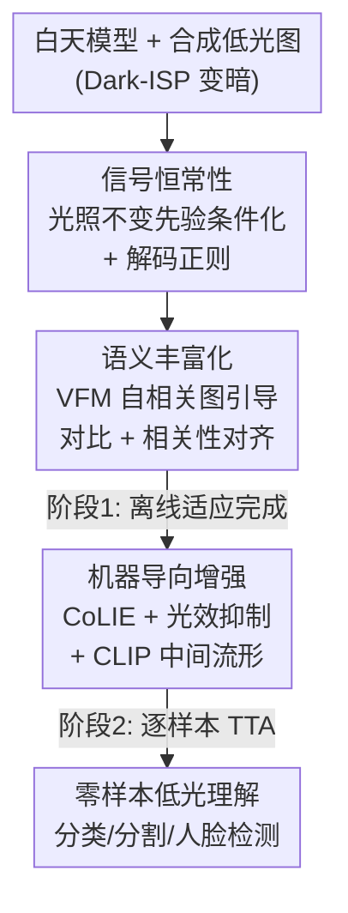

# Towards Generalized Representations for Low-Light Understanding: When Signal Constancy Meets Semantic Enrichment

**会议**: CVPR 2026  
**论文**: [CVF Open Access](https://openaccess.thecvf.com/content/CVPR2026/html/Li_Towards_Generalized_Representations_for_Low-Light_Understanding_When_Signal_Constancy_Meets_CVPR_2026_paper.html)  
**代码**: https://lyf1212.github.io/UniPrior (项目页)  
**领域**: 低光理解 / 表示学习 / 域适应  
**关键词**: 低光适应, 光照不变先验, 视觉基础模型, 对比学习, 测试时增强

## 一句话总结
UniPrior 把"光照不变信号先验"和"视觉基础模型（DINOv2/CLIP）的语义先验"统一起来，在**完全不用任何真实低光数据**训练的前提下，让白天训好的模型稳健泛化到各种没见过的夜间/低光场景，并在分类、分割、人脸检测三类任务上大幅刷新零样本 SOTA。

## 研究背景与动机
**领域现状**：让机器在夜里"看得清"有三条主流路线。一是 **enhance-then-understand**（先增强再理解），用 Zero-DCE、Retinex 这类方法把暗图提亮再喂给下游模型；二是**有监督适应**，用配对的标注低光数据直接训；三是**域适应**，把白天标注知识迁到无标注的低光目标域。

**现有痛点**：这三条路各有硬伤。增强方法是为**人眼**优化的，提亮后常引入伪影、丢掉任务相关细节，反而拖累机器感知（论文 Fig.1/Fig.2c 明确指出这点）；有监督方法受困于低光标注数据稀缺，**过拟合到特定训练集**；域适应方法受困于训练数据里**有偏的退化模式和场景分布**，换一批低光数据（DarkFace→ExDark）准确率就掉 1.72%，数据量从 4800 降到 600 还会再掉 2.27%。

**核心矛盾**：低光退化本身**极其多样**（低可见度、噪声、运动模糊、霓虹灯、夜间反光……），靠采样穷举不现实；而现有方法都缺一个**通用、与光照无关的语义先验**来锚定"物体本质是什么"，于是一遇到没见过的退化就崩。

**本文目标**：在不碰任何真实低光数据的前提下，构造既**稳定**（信号层不随光照漂移）又**有判别力**（语义层富含高层线索）的表示，把白天模型零样本迁到任意低光条件。

**切入角度**：作者观察到两类先验天然互补——**光照不变先验**（如 QuadPrior 的物理 ISP 先验）能在信号层抑制光照扰动给出稳定表示，但对复杂噪声脆弱；**视觉基础模型 VFM**（DINOv2、CLIP）则携带跨场景、跨退化都稳的强语义先验。把两者拼起来，就能同时拿到"信号恒常性"和"语义丰富性"。

**核心 idea**：用光照不变先验建立 **signal constancy（信号恒常性）**稳住特征分布，再用 VFM 自相关图引导的对比学习建立 **semantic enrichment（语义丰富性）**对齐到基础模型语义空间，最后把这套统一先验注入像素级增强做**逐样本测试时适应（TTA）**——三层先验贯通，零真实低光数据训练。

## 方法详解

### 整体框架
UniPrior 是一个分两阶段的"统一先验"框架。**输入**是白天训好的下游模型 + 合成低光数据（用 Dark-ISP 把白天图变暗），**输出**是一个能零样本泛化到真实低光的适应后模型。整条管线分三大模块、两个训练阶段：

- **阶段 1（离线适应训练）**：在高层特征侧同时做两件事——① **信号恒常性**：把光照不变先验作为辅助输入喂进主干，并用一个轻量解码器做跨光照重建正则，逼主干学出紧凑、与光照无关的表示；② **语义丰富化**：用 DINOv2 的自相关图引导对比学习 + 相关性对齐，把任务主干的特征空间对齐到 VFM 语义空间。
- **阶段 2（测试时增强）**：在真实低光数据上，用一个 **machine-oriented enhancer**（CoLIE 主干）逐样本优化像素，靠光效抑制损失 + 信号先验一致性 + CLIP 中间流形损失，把"语义对齐"和"像素矫正"耦合起来，进一步适应没见过的低光分布。

### 关键设计

**1. 信号恒常性：光照不变先验条件化 + 解码正则当信息瓶颈**

这一块直击"特征随光照漂移"的痛点。模块上，给图像 $I\in\mathbb{R}^{h\times w\times 3}$ 先抽出光照不变先验 $p_{iip}=G_{iip}(I)\in\mathbb{R}^{h\times w\times 6}$（$G_{iip}$ 用 QuadPrior 预训练权重初始化、在线微调），再把原图和先验沿通道拼成 9 通道，用一个卷积 $K_{merge}$ 融合进主干。关键 trick 是**零初始化**：先验通道对应的权重初始化为 0，让网络在不破坏白天预训练能力的前提下渐进学会利用先验——消融里去掉 zero-init 直接从 74.52% 暴跌到 62.25%，是最敏感的设计之一。

训练约束有两条。一是**离群鲁棒的先验一致性损失**：用 inverse-ISP 把白天图变暗合成低光，逼合成低光先验 $G_{iip}(I_{low})$ 逼近白天先验 $G_{iip}(I_{normal})$；但合成数据有伪影，于是先算差异图 $d=|G_{iip}(I_{low})-G_{iip}(I_{normal})|$，用 $\alpha$-分位数 $d_\alpha$ 当自适应阈值过滤离群点：

$$\mathcal{F}=\begin{cases}0,& d>d_\alpha\\1,&\text{otherwise}\end{cases},\qquad \mathcal{L}_{\text{iip-consis}}=\big\|\mathcal{F}\odot(G_{iip}(I_{low})-G_{iip}(I_{normal}))\big\|_2^2$$

二是**解码正则**：挂一个只有主干约 10% 参数的轻量解码器 $D_{prior}$，让它从低光输入的中间特征 $\{f^i\}$ 重建出**白天图**的光照不变先验 $p_{iip}^{normal}$，即 $\mathcal{L}_{\text{iip-decode}}=\|D_{prior}(\{f^i\})-p_{iip}^{normal}\|_2^2$。解码器故意做小，等于一个**信息瓶颈**，逼主干蒸馏出最紧凑、最与光照无关的信息——消融里去掉先验解码器掉到 70.26%，验证它贡献巨大。

**2. 语义丰富化：用 VFM 自相关图（而非静态特征）引导对比与对齐**

光稳住信号还不够判别。作者的核心洞察（Fig.4）是：DINOv2 的**原始特征**里，一个纸巾盒会和周围无关物体混在一起难以区分，但 DINOv2 的**自相关图**能把语义相关区域精准高亮——所以应该对齐"相关结构"而不是"绝对特征值"。基于此做两件事。

**对比增强**：给 VFM 特征 $f_{vfm}\in\mathbb{R}^{(N_h\cdot N_w)\times D}$ 算归一化自相似矩阵 $\mathcal{S}=\big(\tfrac{f_{vfm}}{\|f_{vfm}\|_2^2}\big)\cdot\big(\tfrac{f_{vfm}}{\|f_{vfm}\|_2^2}\big)^\top$，再按行用自适应百分位阈值 $\mathcal{S}_\alpha$ 二值化得到掩码，取定某锚点 $p=(n_h,n_w)$ 对应的语义聚类区域 $\mathcal{M}$。掩码内的特征算正样本、掩码外算负样本，对合成低光图的锚特征 $f$、白天同位置正样本 $f^+$、掩码外负样本 $f^-$ 跑 InfoNCE：

$$\mathcal{L}_{\text{contra}}=-\log\frac{\sigma(f,f^+)}{\sigma(f,f^+)+\sum_{M[i]=0}\sigma(f,f^-_i)},\quad \sigma(x,y)=\exp(x\cdot y/\tau)$$

这样模型借 VFM 的结构语义先验挖出"理解关键区域"，并把不同光照下同语义特征拉近、提升判别力与鲁棒性。

**相关性对齐**：VFM 容量远大于任务主干，硬逼小模型模仿 VFM 特征分布既难又会引入偏置。所以改成在**自相关图层面**对齐——对主干特征 $f$ 和 DINOv2 特征 $f_{dino}$ 各算自相关图 $\mathcal{S},\mathcal{S}_{dino}$，按行 softmax 后做交叉熵：$\mathcal{L}_{\text{align}}=\text{CE}(\text{Softmax}(\mathcal{S}),\text{Softmax}(\mathcal{S}_{dino}))$。对齐的是"上下文化的相对模式"而非绝对值，泛化更好——消融里把它换成 naive 的 L1 特征对齐，准确率从 74.52% 崩到 63.26%，是降幅最大的对照之一，直接坐实了"相关图 > 静态特征"这一核心论点。

**3. 机器导向增强：把统一先验注入像素矫正，逐样本 TTA**

高层语义和低层信号不完全相关，但像素退化确实会拖累高层特征提取。已有增强方法只服务人眼，反而伤机器感知。于是阶段 2 用 CoLIE 当增强主干（它给每张图学一套独有的增强映射），在原有四项人眼增强损失 $\mathcal{L}_{enh}$ 之外，加三项**机器导向**目标：

- **光效抑制损失**：抽出过曝主导区域掩码 $\mathcal{M}_{LE}$（把信号先验扩展到能处理过曝，如车灯、路灯反光），用其面积均值 $\mathcal{L}_{LE}=\tfrac{1}{hw}\sum_{i,j}\mathcal{M}_{i,j}$ 惩罚过曝面积，防止提亮放大有害光效。
- **信号先验一致性**：对增强图先验 $p_{iip}^{enh}$ 和低光输入先验 $p_{iip}^{low}$ 用同款离群鲁棒 L1 约束，保住语义完整性。
- **CLIP 中间流形损失**：受特征白化启发，想抹掉增强图的"光照属性"。收集 $N_1$ 条白天文本、$N_2$ 条低光文本取 CLIP 嵌入，算增强图与文本的 softmax 余弦相似度 $p_{sim}$，再用**最大熵**损失 $\mathcal{L}_{\text{clip-inter}}=\sum_i p_{sim}^i\log p_{sim}^i$ 把图像推向白天/低光嵌入之间的"中间流形"——光照属性被擦掉，域偏移随之减小。

因为整套增强天然**与光照无关、与分布无关**，可以对每张测试图做逐样本优化，这就是阶段 2 的 TTA。

### 损失函数 / 训练策略
两阶段训练：

**阶段 1（离线适应）**用 Dark-ISP 合成配对低光数据，联合训高层组件：
$$\mathcal{L}_{\text{high}}=\lambda_{\text{task}}\mathcal{L}_{\text{task}}+\lambda_{\text{con}}\mathcal{L}_{\text{iip-consis}}+\lambda_{\text{dec}}\mathcal{L}_{\text{iip-decode}}+\lambda_{\text{contra}}\mathcal{L}_{\text{contra}}+\lambda_{\text{ca}}\mathcal{L}_{\text{align}}$$

**阶段 2（测试时增强）**在真实数据上逐样本优化低层：
$$\mathcal{L}_{\text{low}}=\lambda_{\text{enh}}\mathcal{L}_{\text{enh}}+\lambda_{\text{entropy}}\mathcal{L}_{\text{entropy}}+\lambda_{\text{consis}}\mathcal{L}_{\text{consis}}$$

全程不使用任何真实低光训练数据。

## 实验关键数据

### 主实验
在 CoDaN 低光分类（ResNet-18 baseline）上，UniPrior 大幅领先所有零样本适应方法，且主模型几乎零额外开销（参数 11.70M→11.72M，FLOPs 1.80G→2.04G）：

| 类别 | 方法 | Top-1 ACC (%) | 备注 |
|------|------|------|------|
| Baseline | ResNet-18 | 53.32 | 直接推理 |
| 增强类 | GEFU | 60.92 | 为人眼优化，机器感知吃亏 |
| 零样本适应 | Sim-MinMax | 65.87 | 对比学习，缺通用先验 |
| 零样本适应 | DAI-Net | 68.44 | 之前 SOTA |
| **本文** | **UniPrior** | **74.52** | **+6.08 over SOTA**，开销可忽略 |
| 本文 | UniPrior + TTA Enhancer | **75.72** | 逐样本增强进一步提升 |

分割（mIoU）与人脸检测（mAP@0.5）同样刷新零样本 SOTA：

| 任务/数据集 | 指标 | 之前最好(零样本) | 本文 | 本文+TTA |
|------|------|------|------|------|
| 分割 / Nighttime Driving | mIoU | 44.9 (Sim-MinMax) | **48.2** | 48.6 |
| 分割 / ACDC-Night | mIoU | 27.6 (Sim-MinMax) | 27.9 | **28.5** |
| 人脸检测 / DarkFace | mAP | 28.0 (DAI-Net) | 31.3 | **33.6** |

人脸检测相对前最优领先 **5.6% mAP**；分类零样本档领先 **7.28%**。另外只训 2 个 epoch 就达 72.12%，已超 DAI-Net 3.68%，说明收敛快。

### 消融实验
| 配置 | CoDaN ACC (%) | ND mIoU (%) | 说明 |
|------|------|------|------|
| **Full（Ours）** | **74.52** | **48.20** | 完整模型 |
| w/o zero-init | 62.25 | 39.31 | 去零初始化，**崩得最狠** |
| with naive feature align | 63.26 | 41.72 | 自相关对齐换成 L1，**第二崩** |
| w/o contrastive aug. | 68.89 | 47.07 | 去对比增强 |
| w/o correlation align. | 69.71 | 46.67 | 去相关性对齐 |
| w/o prior decoder | 70.26 | 45.23 | 去解码正则，掉 4.26 |
| w/o invariant prior | 67.24 | 44.62 | 去光照不变先验 |
| Ours + TTA Enhancer | 75.72 | 48.61 | TTA 再加约 +1.2 |
| └ w/o machine-oriented designs | 71.48 | 46.44 | TTA 去掉机器导向三损失 |

### 关键发现
- **零初始化和"用自相关图对齐"是两根命门**：去掉任一个准确率都跌破 64%，说明 UniPrior 的增益不是堆模块堆出来的，而是这两个具体设计在撑——前者保住白天预训练能力、让先验渐进融入，后者验证了"对齐相关结构 > 模仿静态特征"这一核心洞察。
- **解码正则当信息瓶颈确实有效**：仅约 10% 主干参数的小解码器，去掉就掉 4.26（74.52→70.26），印证"逼主干蒸馏紧凑光照不变信息"的设计动机。
- **增强方法在分割上甚至不如 baseline**：夜间街景光照不均，纯人眼增强会引入有害伪影（如 EnlightenGAN 在 ND 上 25.2 < baseline 34.3），反衬出"机器导向增强"的必要性。
- **数据依赖型方法天生脆**：WiiD 换数据集掉 1.72%、减数据量掉 2.27%，而 UniPrior 零真实低光数据反而更稳，直接论证了"通用先验 > 拟合特定退化分布"。

## 亮点与洞察
- **"对齐相关图而非特征"这一点很巧**：直接逼小模型模仿 DINOv2 特征又难又引偏置，改成对齐 softmax 后的自相关矩阵（相对结构），既绕开容量鸿沟又抓住了语义本质——Fig.4 的纸巾盒可视化和消融里 L1 对齐的暴跌互相印证，是全文最有说服力的论点闭环。
- **零真实低光数据 + 三层先验贯通**：信号层（光照不变先验）、特征层（VFM 语义）、像素层（机器导向增强）三层都用同一套统一先验串起来，而非各管各，这种"cross-level"耦合是它能泛化到未见退化的根因。
- **可迁移的 trick**：① 零初始化让新模态/新先验"无痛接入"预训练模型，可用于任何"给冻结大模型加辅助输入"的场景；② 离群鲁棒损失（分位数阈值过滤合成数据伪影）对所有"用合成数据训练"的任务都适用；③ CLIP 中间流形 + 最大熵损失"擦属性"的思路，可迁到任何想消除某种 nuisance 属性（光照、天气、风格）的域适应任务。

## 局限与展望
- **依赖外部预训练先验的质量**：光照不变先验来自 QuadPrior、语义来自 DINOv2/CLIP，若这些基础模型在某些极端域（如红外、水下）本身就弱，UniPrior 的上限会被拉低。
- **TTA 增强代价不小**：Ours+TTA 单图推理 2.593s（主模型仅 0.005s）、FLOPs 8.66G，逐样本优化对实时系统（自动驾驶）不友好，只在"追求极致性能"时才划算。
- **合成低光的真实性假设**：阶段 1 全靠 Dark-ISP 合成低光，虽有离群鲁棒损失兜底，但若真实退化（传感器特异噪声）和合成分布差距过大，恒常性约束可能失效——作者未量化这一 gap。
- **任务覆盖偏分类/分割/检测**：未验证更复杂的低光场景理解（如夜间实例分割、深度估计），泛化边界待探。

## 相关工作与启发
- **vs Sim-MinMax**：两者都用对比学习，但 Sim-MinMax 靠 similarity min-max 合成"最难"低光图训判别表示、缺通用先验；本文引入 VFM 语义先验 + 信号恒常性，在分类上 65.87→74.52、分割上 44.9→48.2 全面领先。
- **vs DAI-Net**：DAI-Net 靠反射分解正则增强光照不变性，是之前零样本 SOTA；本文额外把 VFM 语义先验注进来，分类 +6.08、人脸检测 +5.6 mAP。
- **vs CIConv / MAET（物理先验类）**：它们用颜色不变/ISP 仿真做光照鲁棒，但物理先验对复杂非高斯噪声脆弱；本文把物理信号先验和 VFM 语义先验互补，鲁棒性显著更强。
- **vs enhance-then-understand（Zero-DCE、CoLIE 等）**：纯像素增强为人眼优化、放任下游模型不变，常引伪影伤机器感知（分割甚至低于 baseline）；本文的机器导向增强把语义对齐和像素矫正耦合，方向性根本不同。

## 评分
- 新颖性: ⭐⭐⭐⭐⭐ "对齐自相关图而非静态特征"的洞察 + 三层先验贯通 + 零真实低光数据，组合很扎实且有可视化/消融双重佐证
- 实验充分度: ⭐⭐⭐⭐⭐ 覆盖分类/分割/检测三任务、含复杂度与时间、消融逐项拆解且能定位命门设计
- 写作质量: ⭐⭐⭐⭐ 逻辑链清晰、图示到位；公式排版在开放版里偶有混乱，但方法可复述
- 价值: ⭐⭐⭐⭐⭐ 零样本低光理解的实用新 SOTA，开销可忽略，trick 可迁移性强

<!-- RELATED:START -->

## 相关论文

- [\[CVPR 2026\] More Than Meets the Eye: A Unified Image Fusion Framework via Semantic-Pixel Entropy Trade-off for Zero-Shot Generalization](more_than_meets_the_eye_a_unified_image_fusion_framework_via_semantic-pixel_entr.md)
- [\[CVPR 2026\] 2-Shots in the Dark: Low-Light Denoising with Minimal Data Acquisition](2-shots_in_the_dark_low-light_denoising_with_minimal_data_acquisition.md)
- [\[CVPR 2026\] Multinex: Lightweight Low-light Image Enhancement via Multi-prior Retinex](multinex_lightweight_low-light_image_enhancement_via_multi-prior_retinex.md)
- [\[CVPR 2026\] UDAPose: Unsupervised Domain Adaptation for Low-Light Human Pose Estimation](udapose_unsupervised_domain_adaptation_for_low_light_human_pose_estimation.md)
- [\[CVPR 2026\] Bi-Bridge: Bidirectional Diffusion Bridges for Low-Light Image Enhancement](bi-bridge_bidirectional_diffusion_bridges_for_low-light_image_enhancement.md)

<!-- RELATED:END -->
